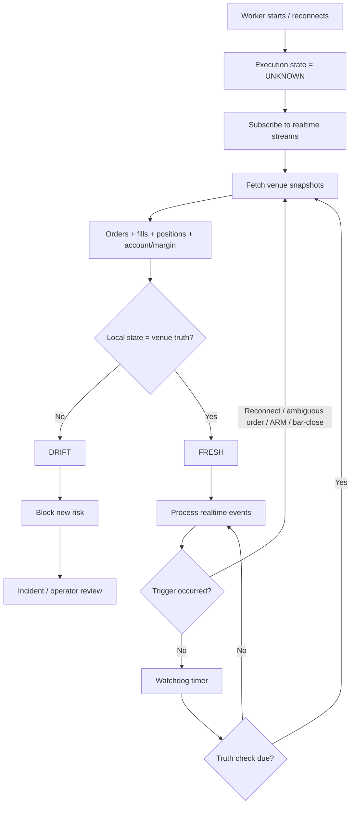
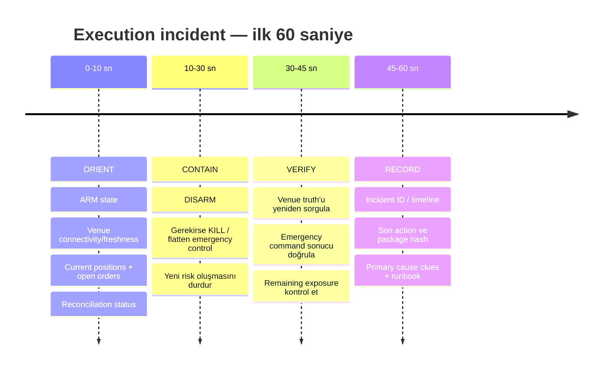
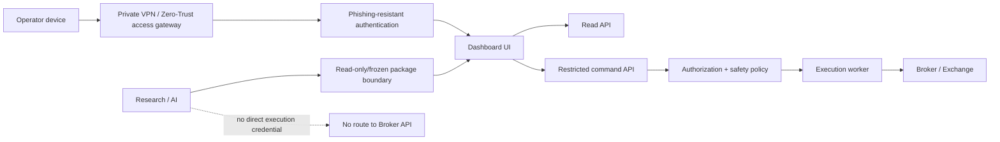

# Trading-Bot Execution Dashboard Mimarisi için Derin Araştırma Raporu

## Yönetici özeti

Ekli `DASHBOARD_UNIFIED_ARCHITECTURE_PROPOSAL_20260818.md` dosyası okunabilir durumdadır ve araştırma için yeterli mimari bağlam sağlamaktadır. Ancak dosyanın sonunda atıf yapılan ayrı `DEEP_RESEARCH_PROMPT_TRADING_BOT_DASHBOARD_2026-08-18.md` dosyasının **kendisi ekli değildir**; mevcut dosyada yalnızca bu dosya adına referans vardır. Dolayısıyla araştırma promptunun kelimesi kelimesine metnini çıkarmak mümkün değildir. Buna karşılık mevcut belgede “Open questions (feed the deep-research prompt)” başlığı altında promptu beslemesi amaçlanan beş soru açıkça verilmiştir; bu rapor, bu soruları ve belgenin güvenlik/mimari varsayımlarını esas alarak promptu yeniden yapılandırmaktadır. fileciteturn0file0

Araştırmanın ana sonucu şudur: **önerilen iki-yüzeyli mimari — execution ile research/command yüzeylerinin ayrılması — sağlam ve korunması gereken temel karardır.** Özellikle “viewing never trades”, yalnızca frozen/approved package çalıştırma, her no-trade durumunun açıklanabilir olması, AI’ın execution yolundan ayrılması ve stale verinin quiet market gibi görünmemesi ilkeleri; güncel SRE, finansal işlem altyapısı ve güvenlik uygulamalarıyla uyumludur. fileciteturn0file0 NIST Zero Trust yaklaşımı da güveni yalnızca ağ konumuna bağlamamayı, erişimin kimlik ve kaynak bazında doğrulanmasını öngörür; bu nedenle “loopback-first” doğru bir başlangıç olmakla birlikte uzaktan erişim açıldığında tek başına yeterli bir güvenlik sınırı değildir. citeturn17search6turn17search3

En önemli değişiklik, belgede V2 için öngörülen “three-tier truth reconciliation” fikrinin bir UI özelliği olmaktan çıkarılıp **execution safety state machine’in temel parçası** yapılmasıdır. Hyperliquid WebSocket abonelikleri yeniden bağlantıda snapshot sağlayabilir; bağlantılar sessiz kaldığında sunucu 60 saniye sonrasında bağlantıyı kapatabilir ve heartbeat mekanizması vardır. Hyperliquid ayrıca realtime veri için WebSocket kullanımını önerirken REST/Info endpointleri ile order status, fills ve hesap durumunu tekrar sorgulamaya imkân verir. IBKR tarafında da bağlantı kesintisi ve yeniden bağlantı açık durum kodlarıyla raporlanır; örneğin `1101` yeniden bağlantının sağlandığını fakat bazı verilerin kaybolmuş olabileceğini ve subscription'ların tekrar kurulması gerektiğini belirtir. Bunların ortak sonucu şudur: **streaming veri tek başına authoritative truth olarak kabul edilmemelidir; stream + snapshot/query + periyodik/audit-level reconciliation birlikte kullanılmalıdır.** citeturn14search6turn14search16turn14search3turn21search0

Araştırmada, “olgun bar-close trading botlarının standart mutabakat periyodu X dakikadır” şeklinde güvenilir bir endüstri standardı veya ampirik akademik çalışma bulunmamıştır. FIX spesifikasyonu, çok-günlü açık emirlerin mutabakatının tipik olarak gün sonunda veya sonraki işlem gününün başında yapılabileceğini açıkça tarif eder; ancak bu bir intraday bot cadence standardı değildir. Bu nedenle aşağıda önerilen intraday cadence, **vendor API davranışları, rate limitleri, FIX uygulama kalıpları ve failure-mode analizi üzerinden türetilmiş mühendislik önerisidir**, sektör standardı olduğu iddia edilmemelidir. citeturn14search2turn14search0

Önerilen mutabakat modeli:

| Katman | Önerilen çalışma şekli | Amaç |
|---|---|---|
| Event truth | Emir/fill/account olaylarını sürekli ve idempotent işle | Normal operasyonun hızlı local state'i |
| Triggered truth | Startup, reconnect, ambiguous acknowledgement, ARM, terminal order/fill ve emergency action sonrasında derhal venue snapshot/query | “Bir şey kaçırdım mı?” sorusunu kapat |
| Active watchdog | ARMED, açık emir veya pozisyon varken başlangıç değeri olarak yaklaşık 60 saniyede bir minimal truth check; broker/strategy riskine göre ayarlanabilir | Uzun bar sürelerinde bar-close'u beklememek |
| Bar-close reconcile | Her strateji bar kapanışında orders + positions + fills + account/margin + local state kıyaslaması | Karar döngüsü ile finansal gerçeği senkronize etmek |
| Audit truth | Gün sonu broker statement/Flex veya uygun venue/history kaynağıyla tam kontrol | Local history'nin uzun dönem doğruluğunu doğrulamak |

Bu tabloda **60 saniye endüstri standardı değil, başlangıç konfigürasyon önerisidir**. Hyperliquid'in REST limiti dakikada toplam 1.200 weight olup bazı state sorguları düşük weight taşır; IBKR TWS API dokümantasyonu da mesaj ve bağlantı mekanizmalarını tanımlar. Dolayısıyla düşük frekanslı bir watchdog teknik olarak makul görünür, ancak gerçek cadence broker pacing, worker sayısı ve sorgu seti ile load-test edilmelidir. citeturn14search0turn21search0

Uyarı sistemi için de belgede bulunan `INFO/WARN/ERROR/CRIT` event seviyelerinin insan bildirim politikasıyla aynı şey olmaması gerekir. Google SRE ve Prometheus, paging'in semptom bazlı, az sayıda ve doğrudan eyleme geçirilebilir olması gerektiği konusunda tutarlıdır; Alertmanager'ın grouping, deduplication ve inhibition mekanizmaları büyük olaylarda yüzlerce ilişkili alarmı tek operatör bildirimine indirmek için tasarlanmıştır. citeturn16search1turn16search2turn16search0 Bu nedenle execution dashboard için üç insan-aksiyon sınıfı öneriyorum: **PAGE**, **ACTION**, **LOG**. `INFO/WARN/ERROR/CRIT` ise event/journal sınıflandırması olarak kalabilir.

İlk 60 saniyelik incident UX için ekranın öncelikle “sistem neden bozuldu?” sorusuna değil, şu üç soruya cevap vermesi gerekir: **Şu anda para/risk nerede? Venue gerçeği nedir? Risk artmasını durdurmak için hangi güvenli eylem mevcut?** Google'ın incident yaklaşımında öncelik “kanamayı durdurmak, servisi geri getirmek ve kanıtı korumak” şeklindedir; NIST SP 800-61r3 de olay müdahalesini hazırlık, tespit, müdahale ve recovery ile birlikte risk yönetiminin içine yerleştirir. citeturn16search9turn15search0turn15search12

Journal tarafında en güçlü tasarım, yalnızca bir “trade table” tutmak değildir. **Append-only execution/event ledger + bundan üretilen materialised trade/review record** önerilmektedir. FIX, emir yaşam döngüsünde `OrderID`, cumulative quantity, leaves quantity, order status, average price gibi alanların sürekliliğini temel alır; düzenleyici kayıt prensipleri de emir, değişiklik, iptal ve gerçekleşmeleri zaman sıralı ve birbirine bağlanabilir şekilde tutmaya önem verir. citeturn14search2turn8search0turn8search1 Bu yapı, belgedeki mevcut “decision chain” kavramıyla birleştiğinde post-trade incelemeyi ciddi biçimde kolaylaştırır. fileciteturn0file0

Güvenlikte ise **execution dashboard'ın doğrudan public Internet'e açılmaması** tavsiye edilir. CISA, Internet'e açık yönetim arayüzlerinin kaldırılmasını veya arayüzün kendisinden ayrı bir Zero Trust policy enforcement katmanı ile korunmasını önerir; NIST, ağ lokasyonunun tek başına güven sebebi sayılmaması gerektiğini belirtir. citeturn17search1turn17search6 Uzaktan kullanım gerekli olduğunda önerilen model public app port yerine private overlay/VPN veya Zero-Trust access gateway + phishing-resistant MFA + uygulama içi RBAC'tır. NIST'in güncel SP 800-63B-4 dokümanı WebAuthn/FIDO2'yi phishing-resistant authentication örneği olarak gösterirken manuel OTP girişinin phishing-resistant olmadığını açıklar; CISA da mümkün olduğunda phishing-resistant MFA kullanımını önermektedir. citeturn15search4turn15search5turn13search0

Sonuç olarak mevcut proposal'ın temel yönü değiştirilmemeli; ancak **V1.1 ve V2 sıralamasında bir değişiklik yapılması gerekir**: reconciliation engine'in tamamı V2'ye ertelenmese bile en azından startup/reconnect/ARM/after-order “thin reconcile”, global freshness model ve venue-truth indicator **live'a yaklaşmadan önce V1.x güvenlik katmanına çekilmelidir**. Bu, belgenin “stale feed must never look like a quiet market” ilkesinin doğal sonucudur. fileciteturn0file0

## Ek dosyadan çıkarılan araştırma brifi

Ek dosyanın kendisi bir tasarım proposal'ıdır. İki ayrı dashboard yüzeyi tanımlar: Bridge içindeki execution dashboard aggregate/worker drill-down, ARM/DISARM/KILL, gates, orders, positions, risk, journal, reconciliation ve telemetry'ye odaklanırken; research/command dashboard scanner, watchlist, news, backtest/optimisation ve advisory AI işlevlerini üstlenir. Veri/işlem yönünde araştırma katmanından execution katmanına doğrudan “idea promotion” yerine yalnızca frozen approved package geçmesi tasarımın merkezindedir. fileciteturn0file0

Dosyada tanımlanan non-negotiable safety invariants şunlardır: görüntüleme işlem başlatmaz; seçim/hazırlık ARM etmez; yalnızca approved/frozen paketler execution için uygundur; blocked/no-trade durumu görünür nedenle açıklanır; loopback dışına çıkılmadan önce login, 2FA ve roles bulunur; AI advisory olup execution yolundan ayrıdır; stale veri hiçbir zaman quiet market gibi görünmemelidir. fileciteturn0file0

**Dosyadan kelimesi kelimesine çıkarılabilen prompt referansı** yalnızca şudur:

> `Deep-research prompt: DEEP_RESEARCH_PROMPT_TRADING_BOT_DASHBOARD_2026-08-18.md`

Referans verilen bu ikinci dosya mevcut attachment setinde bulunmadığı için promptun özgün uzun metnini doğrulamak mümkün değildir. fileciteturn0file0

Bunun yerine proposal'ın “Open questions” bölümünden çıkabilen asıl araştırma hedefleri şunlardır. Birincisi, bar-close çalışan trading botlarında **reconciliation cadence ve pattern** tasarımıdır. İkincisi, solo operator için hangi olayların page, hangilerinin log olması gerektiğini belirleyen **minimal alert taxonomy**'dir. Üçüncüsü, bir incident'ın ilk 60 saniyesinde ekranda hangi gerçeklerin ve güvenli kontrollerin bulunması gerektiğidir. Dördüncüsü, post-trade incelemeyi hızlandıracak **journal schema conventions**'dır. Beşincisi ise loopback ve 2FA'nın ötesindeki **self-hosted money-adjacent dashboard security baseline**'dır. fileciteturn0file0

Proposal'da ayrıca bazı güçlü ön kabuller vardır. Reconciliation V2'de “bot DB vs exchange truth + DRIFT” şeklinde mandatory-before-live olarak tasarlanmıştır; perps için margin health, leverage mode ve liquidation distance zorunlu kabul edilmiştir; multi-worker aggregate görünümü hedeflenmiştir; Prometheus/Grafana yerine solo-host ölçeğinde built-in lean metrics tercih edilmiştir; notification kanalları tek ana kanala indirilmiştir; manual order entry reddedilmiş ve dashboard “observatory with a brake pedal” olarak çerçevelenmiştir. fileciteturn0file0

Araştırma sonucunda bu varsayımların büyük bölümü korunmaktadır. Özellikle manual order editor'ın execution dashboard'a geri eklenmemesi, AI'ın research/read-only tarafta tutulması, notification fan-out yerine dedup/grouping yaklaşımı kullanılması ve dashboard'ın terminal/strategy-design UI'a dönüşmemesi yönündeki kararlar güçlü görünmektedir. Google SRE ve Prometheus'un az sayıda, action-oriented alarm yaklaşımı da tek operatör mimarisindeki “daha çok kanal = daha güvenli” varsayımını desteklememektedir. citeturn16search1turn16search2turn16search0

Proposal'ın bir varsayımı ise güçlendirilmelidir: “reconciliation V2 feature” olarak değil, **execution correctness primitive** olarak düşünülmelidir. Venue streamlerinin kesintiye uğrayabilmesi, yeniden bağlantıda snapshot/re-subscription gerekliliği ve broker connection state'lerinin ayrı veri-kaybı durumlarını ifade edebilmesi nedeniyle dashboard'ın “local DB doğru kabul edilir, V2'de venue ile kıyaslarız” modeli live safety açısından zayıftır. citeturn14search16turn14search6turn21search0

## Kapsam ve yöntem

Araştırma kapsamı stratejinin kârlı olup olmadığına, sinyal üretimine veya portföy optimizasyonuna değil; **execution observability, operational correctness, incident response, auditability ve security** konularına sınırlandırıldı. Bu ayrım proposal'ın execution ile research yüzeylerini bilinçli olarak ayırmasıyla uyumludur. fileciteturn0file0

Araştırma soruları daha kesin biçimde şu hale getirildi:

| Alan | Rafine araştırma sorusu |
|---|---|
| Reconciliation | Local bot state ile venue truth hangi olaylarda ve hangi cadence ile karşılaştırılmalı; drift hangi durumlarda trading inhibit etmeli? |
| Freshness | WebSocket “connected” olmak yeterli midir; panel bazlı freshness ve authoritative timestamp nasıl modellenmeli? |
| Alerting | Solo operator'ı uyandırması gereken minimum durum kümesi nedir ve alarm fırtınası nasıl önlenir? |
| Incident UX | Bir incident'ın ilk 60 saniyesinde operator hangi finansal ve teknik gerçekleri aynı ekranda görmelidir? |
| Journal | Signal → gate → order → acknowledgement → fill → position → P&L zincirini hangi veri modeli en iyi korur? |
| Security | Loopback'ten remote access'e geçildiğinde hangi ek katmanlar minimum baseline olmalıdır? |
| Architecture | Prometheus/Grafana gibi ayrı bir observability stack bu ölçek için gerekli mi, yoksa semantiklerini daha küçük bir komponent uygulayabilir mi? |

Kaynak taraması 18 Ağustos 2026 itibarıyla hem İngilizce hem Türkçe sorgular kullanılarak yapıldı. Öncelik sırası vendor/API dokümantasyonu, standartlar ve kamu kurumu kaynakları, ardından peer-reviewed/akademik literatür ve en son tamamlayıcı endüstri materyali şeklinde tutuldu. Hyperliquid ve IBKR'nin güncel API dokümantasyonu venue-state davranışları için; FIX protokolü order lifecycle/reconciliation için; Google SRE ve Prometheus alert/incident prensipleri için; NIST, CISA ve OWASP güvenlik baseline'ı için; Borsa İstanbul ve SPK ise Türkçe sermaye piyasası teknoloji/risk-control perspektifi için tarandı. citeturn14search0turn21search0turn14search2turn16search1turn15search12turn18search3turn12search2

Türkçe kaynaklarda özellikle Borsa İstanbul'un BISTECH PTRM mimarisi dikkate değerdir. PTRM, emir ve gerçekleşmelerden doğan riskleri emir sisteme kabul edilmeden önce, kabul edildikten sonra ve işlem sonrasında kontrol edebilen mekanizmalar içerir; ayrıca bağlantı kaybı halinde açık emirleri askıya alma/iptal etme amacı taşıyan Cancel on Disconnect işlevi ve heartbeat kontrolleri bulunmaktadır. Bu yapı doğrudan kullanıcının botuna uygulanacak bir teknik spesifikasyon değildir, fakat **execution safety'nin yalnızca pre-trade gate'ten ibaret olmadığı; bağlantı durumu ve post-trade state'in de risk kontrolü olduğu** yönündeki mimari çıkarımı destekler. citeturn12search2turn12search5

Akademik literatürün çoğu trading dashboard operational design yerine optimal execution, market microstructure ve HFT davranışı üzerinde yoğunlaşmaktadır. Realtime Transaction Cost Analysis çalışması, algorithmic order performansının runtime'da izlenmesi ve underperformance sebeplerinin açıklanması ihtiyacını doğrudan ele alır; bu, proposal'daki expected-vs-actual slippage ve P&L decomposition fikirlerini destekler. citeturn19academia24 Yazılım incident araştırmasında Sillito ve Kutomi'nin 30 incident üzerinde yaptığı nitel çalışma ise failures'ın cascade edebildiğini ve detection/investigation/mitigation süreçlerindeki zorlukları vurgular; bu bulgu incident ekranının yalnızca ham log üretmek yerine state ve impact'i hızlı bir şekilde konsolide etmesi gerektiğini destekler. citeturn20academia12turn20search5

Araştırmada kanıt seviyesi bilinçli olarak ayrıldı. Örneğin Hyperliquid'in heartbeat süresi veya IBKR `1101` davranışı **doğrudan vendor gerçeğidir**. Buna karşılık “aktif pozisyon varken 60 saniyede bir thin reconcile” **bu vendor özelliklerinden türetilen tasarım önerisidir**; vendor tarafından önerilmiş bir cadence değildir. Benzer şekilde ilk 60 saniye UX sıralaması Google/NIST incident prensiplerinden türetilmiştir, Google'ın trading dashboard standardı değildir. citeturn14search6turn21search0turn16search9turn15search12

## Operasyonel doğruluk ve mutabakat bulguları

Proposal'ın en kritik güvenlik ilkelerinden biri “a stale feed must never look like a quiet market” ifadesidir. Bu yalnızca market-feed seviyesinde değil, **her authoritative data domain'i için ayrı freshness clock** gerektirir: market data, order state, fills, positions/account, risk/margin, worker heartbeat ve UI snapshot farklı zamanlarda stale olabilir. fileciteturn0file0 Hyperliquid'in WebSocket protokolünde 60 saniye boyunca server'dan mesaj gelmeyen bağlantının kapatılabilmesi ve ping/pong mekanizması bulunması, “socket object hâlâ mevcut” ile “data fresh” kavramlarının aynı olmadığını gösterir. citeturn14search6

Bu nedenle UI'daki tek bir yeşil `CONNECTED` ışığı yeterli değildir. Önerilen topbar state'i en azından ayrı `TRANSPORT`, `MARKET DATA`, `EXECUTION`, `ACCOUNT TRUTH`, `RECONCILIATION` sağlıklarını konsolide etmeli ve genel sistem durumu bunların en riskli olanına göre türetilmelidir. Bu bir tasarım çıkarımıdır; temel gerekçe, Hyperliquid'de stream snapshot/reconnect davranışları ve IBKR'de connection restore durumlarının “data lost” ile “data maintained” olarak dahi ayrılmasıdır. citeturn14search16turn21search0

Önerilen data-state modeli:

| Durum | Anlam | Execution davranışı |
|---|---|---|
| `FRESH` | Beklenen zaman sınırı içinde doğrulanmış veri | Normal |
| `AGING` | Henüz limit dışı değil fakat beklenen update gecikiyor | Görsel warning; trading devamı policy'ye bağlı |
| `STALE` | Freshness threshold aşıldı | İlgili risk alanında yeni risk alma inhibit edilmeli |
| `UNKNOWN` | Startup/reconnect sonrası authoritative snapshot henüz tamamlanmadı | Yeni trade yok |
| `DRIFT` | Local ve venue state karşılaştırması uyumsuz | Yeni trade yok; reconcile/incident |
| `DEGRADED` | Primary transport bozuk, fallback çalışıyor | Açık sarı state; risk policy'ye göre kısıtlı |
| `RECOVERING` | Bağlantı döndü ancak snapshot/reconciliation bitmedi | Normal state'e otomatik atlama yok |

`RECOVERING` özellikle önemlidir. IBKR'deki `1101` “bağlantı geri geldi” fakat bazı market-data subscription'larının kaybolduğunu ifade eder; Hyperliquid subscription mekanizması da reconnect sonrasında snapshot semantics sağlar. Dolayısıyla “WebSocket tekrar açıldı ⇒ green” geçişi yanlış bir modeldir. Doğru sıra **reconnect → resubscribe/snapshot → replay/dedup → reconcile → fresh** olmalıdır. citeturn21search0turn14search16

Önerilen mutabakat akışı şöyledir:

Bu akışın önemli özelliği reconciliation'ın yalnızca periyodik cron işi olmamasıdır. **Event-triggered reconciliation**, trading sistemlerinde daha güvenli bir temel sağlar çünkü en riskli anlar zaman çizelgesine eşit aralıklarla dağılmaz; reconnect, ambiguous acknowledgement, partial fill ve emergency command gibi olaylarda state belirsizliği bir anda yükselir. Hyperliquid order status ve user/account bilgilerini Info endpoint üzerinden sorgulamaya izin verir; WebSocket subscriptions snapshot + incremental modele sahiptir. IBKR TWS API de open orders, executions ve connection state erişimi sunar. citeturn14search3turn14search16turn21search0

**Önerilen cadence** aşağıdaki gibi olmalıdır:

| Trigger/cadence | Veri kapsamı | Trading etkisi |
|---|---|---|
| Process startup | Positions, open orders, recent fills, account/margin, package/config | Reconcile bitene kadar yeni order engelli |
| ARM öncesi | Aynı minimal truth set + freshness | PASS olmadan ARM yok |
| Reconnect sonrası | Snapshot + missed/recent events + state comparison | Reconcile bitene kadar `RECOVERING` |
| Order acknowledgement belirsizliği | İlgili order ID/client ID + open orders + fills | Aynı order kör şekilde tekrar gönderilmez |
| Fill/partial fill sonrası | İlgili order/position projection | Hızlı local consistency |
| Her bar-close | Orders, positions, fills since watermark, account/risk | Bir sonraki karar döngüsünden önce doğrulama |
| ARMED/açık risk varken watchdog | Minimal positions/orders/account truth; başlangıçta yaklaşık 60 s | Uzun barlarda state drift'in saatlerce beklememesi |
| DISARM/KILL/FLATTEN sonrası | Açık orders + positions + execution response | Komutun etkisi doğrulanmadan “safe” gösterilmez |
| Gün sonu | Full execution ledger + broker/venue audit source | Uzun dönem journal doğrulaması |

Buradaki 60 saniyelik watchdog **önerilen default'tur, zorunlu standart değildir**. Hyperliquid güncel dokümantasyonu 1.200 REST weight/dakika IP limiti bildirir ve `clearinghouseState` gibi bazı Info sorguları düşük request weight taşır; dolayısıyla tek/az sayıda worker için bu ölçek oldukça düşük yük oluşturabilir. Worker sayısı arttığında query coalescing, backoff ve broker-specific scheduling yapılmalıdır. citeturn14search0 IBKR'de ise TWS/IB Gateway state akışı ve pacing karakteristikleri farklı olduğundan aynı polling pattern'ini körlemesine kopyalamak yerine broker adapter'ın kendi reconcile policy'si olması daha uygundur. citeturn21search0

FIX'in çok-günlü emirler için açık order listesinin tipik olarak end-of-day veya sonraki gün başında reconciliation amacıyla tekrar iletilebileceğini tanımlaması, **gün sonu truth closure** katmanını güçlü biçimde desteklemektedir. Bu, intraday reconciliation'ın yerine geçmez; tam tersine “realtime projection + intraday snapshots + EOD authoritative closure” şeklinde üç seviyeli bir model önerir. citeturn14search2

IBKR tarafında Flex Query sistemi Activity Statement ve Trade Confirmation raporlarını alan bazında yapılandırmaya ve tarih aralıklarında raporlamaya izin verir; dolayısıyla EOD/audit reconciliation katmanında kullanılabilecek ayrı bir broker reporting yüzeyi vardır. citeturn14search12 Bu da execution runtime API'si ile muhasebe/audit kaynağının aynı şey olmak zorunda olmadığını gösterir.

Hyperliquid için ise veri güven zinciri farklıdır. API server'lar node state'ini takip eder ve transaction cevapları committed block'a dahil edilme sonrasında döner; ayrıca Foundation non-validating node'un kendi dokümantasyonu bu servisin time-sensitive trading için tek authoritative source olarak kullanılmaması ve verinin kullanıcı tarafından doğrulanması gerektiğini belirtir. citeturn14search14turn14search17 Bu nedenle uzun vadeli audit açısından yalnızca “dashboard WebSocket'te ne gördü?” kaydı yeterli değildir.

Mutabakatın teknik özü yalnızca `position_qty_local == position_qty_exchange` değildir. En az şu invariants kontrol edilmelidir:

| Domain | Temel invariant |
|---|---|
| Order identity | Local client order ID ↔ venue/broker order ID bağları unique ve izlenebilir |
| Open orders | Venue'daki her açık emir local'de biliniyor; local “open” olan her emir venue'da açıklanabiliyor |
| Quantity | ordered, cumulative filled, leaves ve cancelled miktarları tutarlı |
| Position | Venue net position ile local projected position eşleşiyor |
| Fill ledger | Venue'daki yeni fill'lerin tamamı event ledger'da bir kez mevcut |
| Account | Cash/equity/margin/risk-critical değerler makul tolerans içinde |
| Config | Worker'ın çalışan frozen-package hash'i approved registry ile eşleşiyor |
| Time | Kaynağın data timestamp'i ve local receipt timestamp'i freshness policy içinde |
| Worker ownership | Account/subaccount/order worker'a doğru atanmış |

FIX order lifecycle modelinde `OrderID`, cumulative quantity, leaves quantity ve status gibi alanların açık biçimde temsil edilmesi bu invariant setini destekler. citeturn14search2 Proposal'ın `CONFIG DRIFT` için frozen package hash göstermesi de aynı “runtime truth must be observable” prensibinin configuration tarafındaki karşılığıdır. fileciteturn0file0

Reconciliation sonucunda fark bulunduğunda UI yalnızca kırmızı “DRIFT” göstermemelidir. Operatörün **beklenen, local, venue ve delta** değerlerini tek satırda görebilmesi gerekir. Örneğin `BTC position: local +0.40 / venue +0.35 / Δ -0.05`; `open orders: local 2 / venue 3 / unknown venue order #...`. Bu, root-cause aramak yerine önce mevcut finansal gerçeği anlamayı kolaylaştıran incident tasarım ilkesidir. Google SRE incident yaklaşımı da mitigation sırasında high-level state'in açık tutulmasını ve önce etkiyi kontrol altına almayı vurgular. citeturn16search1turn16search9

## Uyarı, olay müdahalesi ve journal tasarımı

Proposal'da event log için `INFO/WARN/ERROR/CRIT` seviyeleri planlanmıştır; bu UI ve log sınıflandırması olarak yararlıdır. Ancak bu dört seviye dış bildirimlerle bire bir eşleştirilmemelidir. fileciteturn0file0 Google SRE iyi alarmı timely, user-facing fonksiyonu kapsayan, symptom-based ve actionable olarak tanımlar; Prometheus da mümkün olduğunca az alarm, semptom bazlı page ve “yapılacak bir şey yoksa page atma” yaklaşımını önerir. citeturn16search1turn16search2

Solo operator için daha uygun insan-aksiyon taksonomisi:

| Sınıf | Ne anlama gelir? | Örnek trading olayları | Bildirim |
|---|---|---|---|
| **PAGE** | Şimdi insan müdahalesi gerekir; para veya execution safety doğrudan risk altında | Venue/local DRIFT; bilinmeyen pozisyon; execution bağlantısı kayıp ve açık risk var; stale account truth while ARMED; margin/liquidation kritik; KILL/FLATTEN başarısız; unauthorized action; config drift while ARMED | Ana kritik kanal, hemen |
| **ACTION** | Acil wake-up gerektirmez fakat kısa sürede incelenmeli | Degraded WS + çalışan fallback; yükselen p95 order latency; tekrarlayan reconnect; disk headroom düşüyor; slippage expectation dışına kayıyor; risk budget threshold'a yaklaşıyor | Dashboard + toplu/normal kanal |
| **LOG** | Beklenen operasyon veya diagnostic event | Gate BLOCK/no-trade; normal fill; başarılı reconcile; heartbeat; recovered reconnect; strategy decision | Journal/event log |

Bu üçlü model, “warning ile page aynı şey değildir” ayrımını açıklaştırır. Prometheus Alertmanager'ın deduplication, grouping, routing ve inhibition özellikleri de benzer alarm fırtınalarını tek anlamlı bildirime indirgemeye yöneliktir. citeturn16search0 Bu semantiklerin kullanılması için mutlaka Prometheus kurulması gerekmez; proposal'ın lean built-in metrics/alerting kararı korunabilir ve aynı prensipler küçük bir local alert dispatcher içinde uygulanabilir. fileciteturn0file0

Örneğin `WS disconnected`, `market data stale`, `position snapshot stale`, `order stream stale` ve `reconciliation impossible` aynı upstream network failure'dan kaynaklanıyorsa beş ayrı telefon alarmı yerine tek **“EXECUTION TRUTH LOST — open exposure X”** PAGE gönderilmeli; diğer sinyaller bu incident'ın children'ı olarak UI'da gösterilmelidir. Bu, Alertmanager'ın grouping/inhibition mantığının trading sistemine uyarlanmış halidir. citeturn16search0turn16search7

Alarm flapping için de bir `for`/persistence mekanizması yararlıdır; Prometheus alert rules, bir condition'ın belirli süre devam etmesini bekleyen `for` semantics'i sağlar. citeturn16search11 Ancak trading safety alarmında genel web-service eşikleri körlemesine kullanılmamalıdır. Örneğin market-data stale için kabul edilebilir 5 dakika ile disk-space warning için kabul edilebilir süre aynı olamaz. Burada threshold doğrudan risk domain'ine göre tanımlanmalıdır.

**İlk 60 saniye incident UX** açısından mevcut proposal'ın dashboard'u bir “observatory with a brake pedal” olarak tutması doğru yaklaşımdır; incident anında kullanıcıya manual order editor sunulmamalıdır. fileciteturn0file0 Google'ın incident yaklaşımında önce etkiyi durdurmak, servisi stabilize etmek ve evidence'ı korumak öne çıkar; ayrıca incident commander'ın high-level state'i sürdürmesi ve operasyonel görevlerin kontrollü yürütülmesi önerilir. citeturn16search9turn16search1

Önerilen 60 saniyelik bilişsel akış:

Bu “60 saniye” herhangi bir NIST veya Google zorunluluğu değildir; kaynakların incident-management prensiplerinin execution-trading ortamına uygulanmış UX tasarımıdır. citeturn15search12turn16search1

Bu nedenle Overview'un en üstünde normal zamanlarda küçük, incident sırasında genişleyen bir **Incident Strip** önerilmektedir. Strip, ilk bakışta şu state'i vermelidir:

| Alan | Ekranda görülecek gerçek |
|---|---|
| Execution mode | `DISARMED / ARMED / BLOCKED / KILLING / RECOVERING` |
| Financial exposure | Net/gross exposure, open orders, day P&L, risk budget |
| Perp risk | Margin usage, leverage mode, liquidation distance |
| Truth health | Market, execution, account data age; last reconciliation |
| Drift | `NONE` veya exact local ↔ venue difference |
| Primary incident | Bir cümlelik root symptom + first seen + duration |
| Recent change | Frozen package hash, last deploy/config change, last ARM |
| Emergency controls | DISARM; KILL/flatten; `RECONCILE NOW` |
| Verification | Son emergency action'ın venue-confirmed olup olmadığı |
| Audit | Who/when/why ve incident timeline |

Perpetual futures ortamında margin/leverage/liquidation bilgisinin bu ekranda olması proposal'da zaten V2 mandatory olarak belirlenmiştir. fileciteturn0file0 Borsa İstanbul PTRM'nin de pozisyon limitleri, işlem öncesi ve işlem anı risk kontrolleri gibi mekanizmaları aynı risk-control prensibini farklı bir pazar altyapısında göstermektedir. citeturn12search2

Emergency control UX'te önemli bir denge vardır. Normal privilege artıran işlemler için step-up authentication güçlü bir güvenlik katmanıdır; fakat gerçek KILL anında dış bir kimlik sistemine tekrar bağlanma zorunluluğu riskli olabilir. Bu nedenle önerim, **ARM/config/package promotion gibi riski başlatan eylemlerde güçlü step-up auth; önceden güvenilir şekilde authenticate edilmiş session içinde risk azaltan DISARM/KILL için hızlı fakat audit edilebilir confirmation** modelidir. Bu bir safety-design önerisidir ve proposal'ın typed-confirmation/emergency-action yaklaşımıyla uyumludur. fileciteturn0file0

Borsa İstanbul'un Cancel on Disconnect mekanizması da bağlantı kaybı halinde açık emir riskini heartbeat üzerinden otomatik azaltabilen venue-level korumaların değerini gösterir. citeturn12search5 Venue/broker böyle bir özellik sunuyorsa execution backend'in bunu desteklemesi, yalnızca dashboard operator'ının reaksiyon süresine güvenmekten daha güçlüdür; ancak özellikler venue-specific doğrulanmalıdır.

Journal için tavsiye edilen model **event-sourced core + review projection**'dır. Tek mutable trade satırı, order state geçişlerinin nasıl oluştuğunu kaybettirebilir. FIX'in order lifecycle yapısı ve düzenleyici time-sequenced record yaklaşımı, değişikliklerin ve gerçekleşmelerin ayrı olaylar olarak korunmasının auditability açısından daha sağlam olduğunu gösterir. citeturn14search2turn8search0turn8search1

Önerilen append-only `execution_event` kaydı şu alan gruplarına sahip olmalıdır:

| Alan grubu | Önerilen içerik |
|---|---|
| Identity | `event_id`, correlation/decision ID, worker, strategy, account/subaccount |
| Configuration | strategy version, frozen-package hash, relevant risk/config version |
| Market decision | instrument, strategy bar ID/time, signal, intended side/size/risk |
| Gates | Her gate sonucu, PASS/BLOCK, block reason |
| Order intent | client order ID, parent ID, side, quantity, order type, TIF, limit/stop |
| Venue identity | broker/exchange order ID, fill/execution ID |
| Timing | decision, submit, send, ack, fill, cancel timestamps + source timestamps |
| Lifecycle | submitted, acknowledged, partial, filled, cancel-pending, cancelled, rejected |
| Quantities | order qty, cum fill, leaves qty, fill qty |
| Economics | intended price, fill price, avg price, commission/fees, realised slippage |
| Position/risk | position before/after, SL/TP, risk $, R multiple, margin impact |
| Observability | market-data age, account-data age, latency, transport state |
| Reconciliation | venue/local comparison result, drift type, reconcile ID |
| Incident/audit | ARM/KILL actor, reason, incident ID, annotations/tags |

FIX'in `OrderID`, `CumQty`, `LeavesQty`, `AvgPx` ve order-status gibi lifecycle alanları bu şemanın execution kısmı için güçlü bir referans oluşturur. citeturn14search2 ESMA'nın order/transaction record prensipleri de orders, modifications, cancellations ve executions arasında bağ kurulmasını ve zaman bilgilerinin korunmasını öne çıkarır; burada bunlar **kullanıcıya hukuki yükümlülük iddiası olarak değil, journal schema için iyi bir veri-modeli referansı olarak** kullanılmaktadır. citeturn8search0turn8search1

Bu event ledger'dan ayrı bir materialised `trade_review` tablosu üretilebilir:

`decision → gate chain → orders → fills → position close → net P&L → fees → slippage → R → incident/reconcile annotations`

Bu yaklaşım proposal'ın chart bar'ına tıklayınca decision-chain açılması fikrini özellikle güçlü hale getirir. Bir bar veya trade seçildiğinde kullanıcı yalnızca “BUY at X” değil, **neden trade edildi, hangi gate'ler geçti, hangi package aktifti, veri ne kadar fresh'ti, order ne kadar gecikti, nasıl fill oldu ve sonradan reconciliation drift oldu mu** sorularını tek zincirden cevaplayabilir. fileciteturn0file0

Realtime TCA literatürü de algoritmik emirlerde execution performance'ın yalnızca final P&L ile değil, market conditions ve underperformance factors ile izlenmesinin değerini vurgular. citeturn19academia24 Bu nedenle proposal'daki p50/p95 latency, expected-vs-actual slippage ve P&L decomposition maddeleri korunmalıdır.

Özellikle **p95'in last-value latency'den daha değerli olması** mantıklıdır: Google SRE monitoring yaklaşımı latency distribution'ının ortalama veya tek örnekten saklanabilecek tail davranışını yakalamasını önerir. citeturn16search5 Trading uygulamasında p50 + p95 başlangıç için yeterli olabilir; daha sonra örnek sayısı anlamlı hale gelirse p99 eklenebilir.

## Güvenlik mimarisi ve uygulama kararları

Proposal'ın “loopback-first; login + 2FA + roles before any non-loopback exposure” kuralı doğru fakat uzaktan erişim açıldığında bunun üzerine ek bir katman gereklidir. fileciteturn0file0 NIST Zero Trust Architecture, fiziksel veya network location'a dayanarak implicit trust verilmemesini ve kaynağa erişmeden önce authentication/authorization yapılmasını temel ilke olarak tanımlar. citeturn17search6

CISA, Internet-exposed management interfaces için daha da somut bir güvenlik modeli önerir: mümkün olduğunda interface public Internet'ten kaldırılmalı; gerekli ise interface'in kendisinden ayrı bir Zero Trust policy enforcement point ile korunmalıdır. Bu direktif ABD federal kurumları için bağlayıcı olsa da CISA tehdidin sektörler genelinde geçerli olduğunu belirtmektedir. citeturn17search1 Trading execution dashboard hukuken bu direktif kapsamına girmese bile mimari analoji güçlüdür.

Bu nedenle önerilen erişim mimarisi:

En önemli nokta uygulama portunun doğrudan Internet'e açılmamasıdır. Remote kullanım gerekiyorsa private VPN/overlay veya Zero-Trust gateway üzerinden erişim, public reverse proxy'nin doğrudan execution app'e açılmasından daha kontrollü bir sınır sağlar. CISA, uzak erişimde MFA ve Zero-Trust gateway kullanımını çeşitli güvenlik rehberlerinde tavsiye etmektedir. citeturn13search6turn17search1

MFA tarafında basit “2FA var/yok” checkbox yaklaşımı yeterli değildir. NIST SP 800-63B-4, AAL2'de phishing-resistant seçeneğin sunulmasını önerir ve WebAuthn/FIDO2'yi phishing resistance sağlayan standart örneği olarak açıklar; OTP'nin manuel girildiği yöntemler phishing-resistant kabul edilmez. citeturn15search4turn15search5 CISA da mümkün olan en güçlü MFA seçeneğine geçilmesini ve özellikle güvenlik anahtarlarını yüksek koruma sağlayan seçeneklerden biri olarak gösterir. citeturn13search0

Bu nedenle execution dashboard için tercih sırası **WebAuthn hardware key veya doğru yapılandırılmış passkey**, ardından gerekli fallback'tir. NIST, doğru yapılandırılmış syncable WebAuthn authenticators'ın AAL2 bağlamında phishing ve replay resistance sağlayabildiğini belirtir. citeturn15search11

Uygulama güvenliği için OWASP ASVS iyi bir verification baseline'dır. ASVS'nin güncel stable sürümü 5.0.0'dır ve 30 Mayıs 2025'te yayımlanmıştır; standardın amacı web applications ve web services için security requirements ve verification ölçütleri sağlamaktır. citeturn18search3turn18search5 Execution dashboard'ın tasarım/review checklist'inin ASVS 5.0.0 gereksinim ID'lerine bağlanması audit'in tekrarlanabilirliğini artıracaktır.

Minimum security baseline önerisi:

| Kontrol alanı | Karar |
|---|---|
| Network exposure | Default loopback/private network; public execution port yok |
| Remote access | VPN/overlay veya ayrı Zero-Trust gateway |
| MFA | WebAuthn/FIDO2 phishing-resistant yöntem tercih |
| Roles | En az read-only / operator / administrator ayrımı |
| Execution credentials | Browser veya research service'e verilmez |
| Session | Server-side session; Secure + HttpOnly + SameSite cookie |
| CSRF | Tüm state-changing web commands için koruma |
| Sensitive actions | ARM/config/package changes için step-up auth |
| Emergency risk reduction | Önceden authenticated session'da hızlı, auditable, idempotent control |
| Authorisation | Her command server tarafında yeniden doğrulanır |
| Audit | Login, failed auth, ARM/DISARM/KILL, config/package ve permission actions append-only kaydedilir |
| Secrets | UI response, localStorage, client bundle veya loglarda broker private key yok |
| Supply chain | Pinned dependencies, update policy, vulnerability review |
| Backup | Journal/config/registry backup + restore testi |
| App verification | OWASP ASVS 5.0.0 checklist |

OWASP, session cookie'lerinde `HttpOnly`, `Secure` ve uygun `SameSite` kullanımı gibi mekanizmaları session hijacking ve CSRF risklerini azaltan temel kontroller arasında ele alır. citeturn17search7turn17search10

Burada **read-only API ile restricted command API'nin mantıksal olarak ayrılması** özellikle değerlidir. NIST'in güncel Zero Trust yaklaşımı application/service identity seviyesinde granular policy enforcement yapılmasını destekler. citeturn17search3turn17search5 Böylece Research/AI dashboard'a read-side state erişimi verilebilse bile broker write credentials veya execution command capability verilmesi gerekmez.

Proposal'ın “AI advisory and architecturally air-gapped from execution” kararı bu nedenle korunmalıdır. fileciteturn0file0 AI market view'ın execution ekranında confidence yüzdesi göstermemesi de doğru karardır; operator'ın execution truth ile probabilistic research opinion'ı aynı authority level'da algılamasının önüne geçer. “Why No Trade?” için LLM gerekmemesi de teknik olarak güçlüdür; gate engine zaten deterministic block reason üretebiliyorsa UI doğrudan o authoritative nedeni göstermelidir. fileciteturn0file0

`CONFIG DRIFT` tasarımı da basit bir görsel pill'den daha ileri götürülmelidir. Worker başlangıcında package hash, strategy version ve risk config hash kayda alınmalı; ARM öncesinde approved registry ile doğrulanmalı; runtime'da değişiklik algılanırsa yeni risk inhibit edilmeli; ilgili hash her decision/trade journal kaydına iliştirilmelidir. Bu, proposal'ın frozen-approved-package invariant'ını runtime audit trail'e dönüştürür. fileciteturn0file0

Prometheus/Grafana konusunda proposal'ın “şimdilik kurma” kararı değiştirilmek zorunda değildir. Prometheus'un asıl değerlerinden bazıları semantiktir: symptom-based alerts, grouping, deduplication, inhibition, persistence ve metamonitoring. citeturn16search0turn16search2 Tek host ve tek operator ortamında bu prensiplerin küçük bir built-in metrics/alert module'da uygulanması mümkündür; sistem multi-host/multi-service ölçeğine ulaştığında ayrı monitoring stack kararı yeniden değerlendirilebilir. Bu son cümle bir ölçeklendirme önerisidir, Prometheus'un resmi bir eşik tavsiyesi değildir.

Ayrıca dashboard'ın monitoring mekanizmasının kendisi de izlenmelidir. Prometheus resmi rehberi monitoring sisteminin çalıştığına dair metamonitoring/black-box kontrolün önemini vurgular. citeturn16search2 Trading bot için bunun hafif karşılığı, ana notification channel'a düzenli fakat düşük frekanslı bir “dead-man/heartbeat” veya dışarıdan doğrulanan health probe olabilir. Böylece dashboard tamamen ölürse dashboard'ın kendi alarm üretmesini bekleyen paradoks önlenir.

## Yol haritası, kaynak güvenilirliği ve belirsizlikler

Araştırma sonucunda önerilen implementation sırası proposal'ın V1.1/V2 ayrımını bir miktar değiştirmektedir. fileciteturn0file0 Özellikle freshness ve reconciliation birlikte ele alınmalıdır; çünkü “fresh” olduğuna karar veremeyen bir sistemin “truth reconciled” olduğuna karar vermesi de mümkün değildir.

| Öncelik | Yapılacak iş | Kabul kriteri |
|---|---|---|
| **Safety foundation** | Global freshness model | Her kritik domain'in source timestamp + receive timestamp + stale threshold'u var |
| **Safety foundation** | Reconnect state machine | `DISCONNECTED → RECOVERING → RECONCILING → FRESH`; doğrudan green yok |
| **Safety foundation** | Startup/ARM reconciliation | Venue snapshot doğrulanmadan ARM mümkün değil |
| **Safety foundation** | Config/package integrity | Approved hash mismatch ⇒ `CONFIG DRIFT` + new-risk block |
| **Operator safety** | Incident Strip | ARM, exposure, open orders, truth health, drift, primary alarm tek viewport |
| **Operator safety** | Minimal PAGE/ACTION/LOG taxonomy | Her PAGE için tanımlı operator action/runbook var |
| **Operator safety** | Dedup/group/inhibit | Tek root failure alarm fırtınası üretmiyor |
| **Auditability** | Append-only execution ledger | Signal→gate→order→fill→position zinciri kaybolmuyor |
| **Auditability** | ARM/DISARM/KILL audit | Actor, time, reason, result, resulting venue truth kayıtlı |
| **Execution quality** | p50/p95 latency + fees/slippage decomposition | Last-value yerine distribution ve cost attribution |
| **V2 perp safety** | Margin/leverage/liquidation | Exposure ile aynı incident view'da |
| **V2 scale** | Worker aggregate/reconcile fan-in | Her account/subaccount/worker ayrı ve aggregate görünür |
| **Remote-access gate** | Private access + WebAuthn + RBAC | Public app port yok; phishing-resistant auth test edilmiş |
| **Later** | Read-only AI explanation | Execution credentials/routing yok; yalnızca state explanation |

Bu sıralamada önemli değişiklik şudur: **“full three-tier reconciliation UI” V2'de kalabilir fakat reconciliation'ın minimum runtime engine'i live-safety foundation'a çekilmelidir.** Startup, reconnect ve ARM reconciliation olmadan yalnızca UI staleness badge'i eklemek eksik koruma sağlar. Hyperliquid ve IBKR API davranışları reconnect sonrasında data/state recovery'nin ayrı bir adım olduğunu göstermektedir. citeturn14search16turn21search0

Ayrıca release kabul testleri feature-based değil invariant-based yazılmalıdır. Örneğin “staleness badge implemented” yerine **“market data threshold'u aşıldığında sistem hiçbir koşulda quiet-market görünümü üretmez ve new-risk policy beklenen şekilde inhibit olur”** testi daha güçlüdür. Bu, proposal'ın safety invariants mantığının test seviyesine taşınmasıdır. fileciteturn0file0

Incident rehearsal da release sürecine eklenmelidir. Google SRE, incident playbook'larının güncel tutulmasını ve incident-response pratiklerinin egzersizlerle çalışılmasını önerir; CISA da küçük organizasyonların dahi basit response planlarını düzenli olarak pratik etmesini tavsiye eder. citeturn16search1turn13search4 Solo operator bağlamında en yüksek değerli testler gerçek para gerektirmeyen fault injection senaryolarıdır:

| Rehearsal | Başarı koşulu |
|---|---|
| WS fiziksel olarak kesilir | UI stale/degraded olur; reconnect sonrası reconcile olmadan green olmaz |
| Fill event local tüketiciye ulaşmaz | Snapshot reconcile `DRIFT` yakalar |
| Venue'da bilinmeyen open order enjekte edilir | Unknown order PAGE + new-risk block |
| Local position yanlış değiştirilir | Venue reconciliation farkı yakalar |
| Package hash değiştirilir | `CONFIG DRIFT`; ARM reddedilir |
| Notification provider kesilir | Dead-man/fallback mekanizması alarm kaybını görünür kılar |
| KILL response gecikir | UI “KILL REQUESTED” ile “FLAT CONFIRMED” durumlarını ayırır |
| Stale feed fakat fiyat değişmiyor | Quiet market olarak yorumlanmaz |
| Database read-only/disk-full olur | Trading ve journal policy fail-safe davranır |

Yazılım incident literatüründe failure cascade'leri ve gerçek sistem limitlerinin incident yaşanana kadar görünmeyebilmesi belgelenmiştir; dolayısıyla kontrollü fault-injection ve rehearsal yalnızca operasyon eğitimi değil, mimari varsayımları test etme aracıdır. citeturn20academia12

Araştırmada kullanılan ana kaynakların güvenilirlik değerlendirmesi şöyledir:

| Kaynak | Kullanım alanı | Güvenilirlik | Sınırlama |
|---|---|---|---|
| Ekli architecture proposal fileciteturn0file0 | Sistem gereksinimleri ve mevcut kararlar | **Çok yüksek — proje için authoritative** | Tasarım proposal'ı; dış doğrulama değildir; ayrı deep-research prompt eksik |
| Hyperliquid resmi API docs citeturn14search0turn14search3turn14search16turn14search6 | Rate limit, snapshots, heartbeat, venue queries | **Çok yüksek** | API davranışı zamanla değişebilir; vendor-specific |
| Hyperliquid node/API docs citeturn14search14turn14search17 | Data authority ve verification sınırları | **Çok yüksek** | Platforma özgü |
| IBKR Campus TWS API docs citeturn21search0 | Connectivity, orders, executions, reconnect | **Çok yüksek** | TWS/IB Gateway mimarisine özgü; broker configuration farklılıkları var |
| FIX Trading Community spec citeturn14search2 | Order lifecycle ve EOD/open-order reconciliation | **Çok yüksek** | FIX workflow; doğrudan “bar-close bot cadence” standardı değil |
| Google SRE citeturn16search1turn16search5turn16search9 | Monitoring, paging, incident management | **Yüksek** | Large-scale service ops kökenli; trading'e uyarlama gerektirir |
| Prometheus official docs citeturn16search0turn16search2turn16search11 | Alert grouping, dedup, inhibition, persistence | **Yüksek** | Prometheus implementation-specific kısımlar doğrudan zorunlu değil |
| NIST SP 800-61r3 citeturn15search12 | Incident response baseline | **Çok yüksek** | Genel cybersecurity standardı; trading-specific değil |
| NIST SP 800-63B-4 citeturn15search4turn15search5 | Authentication/MFA | **Çok yüksek** | Federal digital identity bağlamı; burada teknik benchmark olarak kullanılıyor |
| NIST SP 800-207/207A citeturn17search6turn17search3 | Zero Trust/resource-based access | **Çok yüksek** | Enterprise model; küçük deployment için sadeleştirme gerekir |
| CISA guidance citeturn17search1turn13search0 | Internet exposure ve phishing-resistant MFA | **Çok yüksek** | Bazı direktifler yalnızca ABD federal kurumlarına hukuken bağlayıcı |
| OWASP ASVS 5.0.0 citeturn18search3turn18search5 | Web application verification checklist | **Yüksek** | Architecture/operational trading risk standardı değildir |
| Borsa İstanbul PTRM/COD citeturn12search2turn12search5 | Türkçe pre/post trade controls ve disconnect risk | **Çok yüksek** | BISTECH üye altyapısına özgü; bot için doğrudan teknik requirement değil |
| Realtime TCA akademik çalışma citeturn19academia24 | Execution quality/underperformance monitoring | **Orta-yüksek** | 2013; dashboard safety/reconciliation ana konusu değil |
| Sillito & Kutomi incident çalışması citeturn20academia12turn20search5 | Incident investigation/cascade evidence | **Yüksek akademik tamamlayıcı** | 30 incident; finansal trading sistemlerine özel değil |

Araştırmanın en önemli **belirsizliği**, soruda atıf yapılan orijinal deep-research prompt dosyasının ekli olmamasıdır. Dolayısıyla bu rapor mevcut proposal'ın açık sorularını araştırma talimatının proxy'si olarak kullanmaktadır. Exact prompt içinde burada görünmeyen ek sınırlamalar, teknoloji tercihleri veya deliverable'lar varsa bu raporda doğal olarak yer almamıştır. fileciteturn0file0

İkinci önemli boşluk, mature bar-close bot reconciliation cadence için yayınlanmış ampirik benchmark bulunmamasıdır. FIX EOD/start-of-day reconciliation pattern'i tanımlar ve vendor API'leri nasıl state doğrulanabileceğini gösterir; ancak “5 dakika”, “1 dakika” veya “her bar” için genel kabul görmüş bilimsel/industry standard bulunamamıştır. citeturn14search2turn14search3turn21search0 Bu nedenle önerilen model cadence-first değil **event-first + bounded-time safety net** yaklaşımıdır; süreler paper trading/fault-injection sırasında ölçülerek kalibre edilmelidir.

Üçüncü boşluk, alert threshold'ların strategy ve account risk profile'ına bağlı olmasıdır. Google/Prometheus neyin page olması gerektiğine ilişkin güçlü prensipler verir, fakat “liquidation distance yüzde kaçta PAGE olmalı?” veya “order latency p95 kaç ms'de CRIT olmalı?” sorularını cevaplayamaz. citeturn16search1turn16search2 Bu değerler broker baseline, historical distribution ve strategy tolerance üzerinden tanımlanmalıdır.

Dördüncü boşluk security deployment topology'sidir. Aynı makinede yalnızca loopback kullanan dashboard ile Internet üzerinden erişilen VPS dashboard'ın threat model'i aynı değildir. NIST/CISA'nın network-location'a implicit trust vermeme ve Internet-exposed management surfaces'ı kaldırma/Zero-Trust katmanı arkasına alma tavsiyesi güçlüdür; fakat nihai implementation seçimi host OS, reverse proxy, VPN/overlay ve deployment provider'a bağlıdır. citeturn17search6turn17search1

Beşinci boşluk hukuki/regülasyon kapsamıdır. ESMA/FIX/Borsa İstanbul kaynakları bu raporda **recordkeeping ve risk-control tasarım referansları** olarak kullanılmıştır; kullanıcının belirli bir düzenleyici rejime tabi olduğu sonucuna varılmamıştır. citeturn8search0turn12search2 Regulated client money, investment service veya kurumsal algorithmic trading söz konusu olduğunda ayrı jurisdiction-specific compliance değerlendirmesi gerekir.

Nihai mimari karar şu şekilde özetlenebilir: **proposal'ın iki-yüzeyli yapısını, AI air-gap'ini, no manual trading terminal ilkesini, frozen-package modelini ve lean observability yönünü koruyun; fakat execution safety çekirdeğini `freshness + reconciliation + immutable audit + actionable incident UX` dörtlüsü etrafında yeniden önceliklendirin.** İlk live-capable sürümde sistem yalnızca “bot çalışıyor mu?” sorusunu değil, daha güçlü olan **“venue gerçeğini en son ne zaman doğruladım, şu anda ne kadar risk açık, local state ile venue state aynı mı ve bu duruma güvenmem için neden var?”** sorularını tek bakışta cevaplayabilmelidir. Bu sonuç proposal'ın kendi safety invariants'ı, resmi broker/exchange API davranışları, FIX reconciliation modeli, SRE incident prensipleri ve güncel Zero-Trust/authentication rehberleri tarafından birlikte desteklenmektedir. fileciteturn0file0 citeturn14search16turn21search0turn14search2turn16search1turn17search6turn15search4