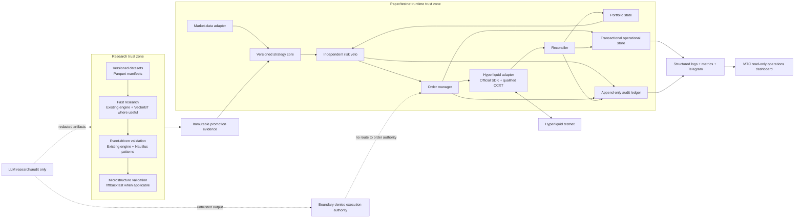
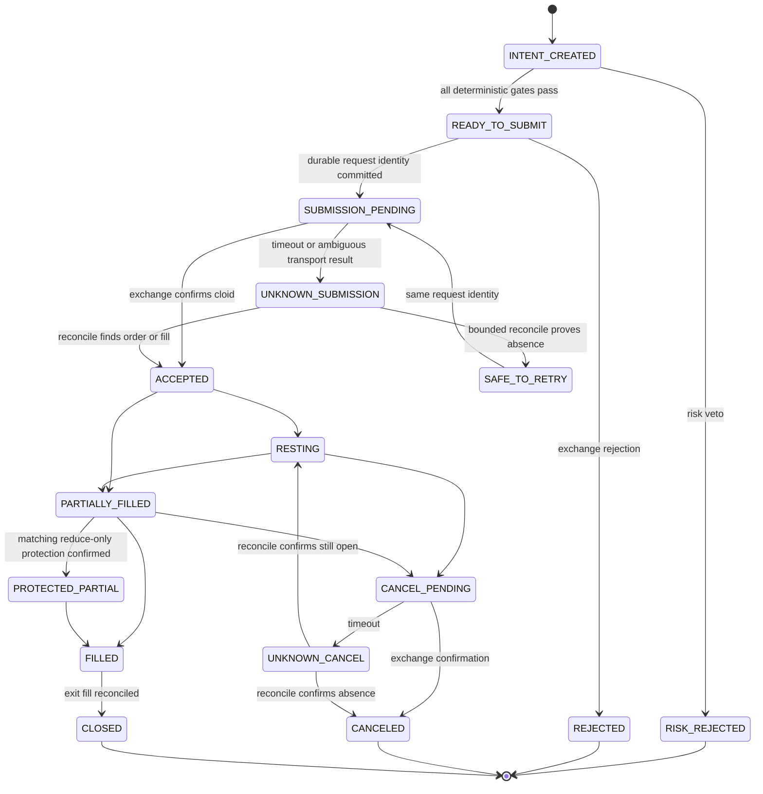
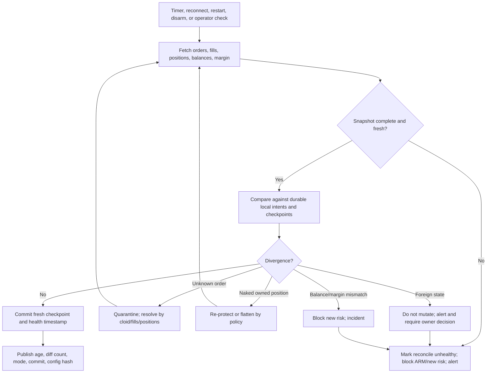
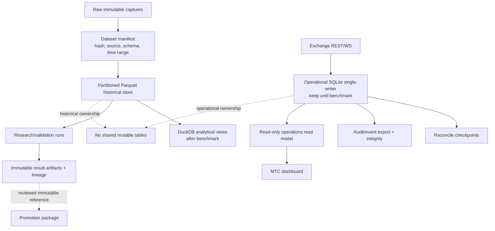
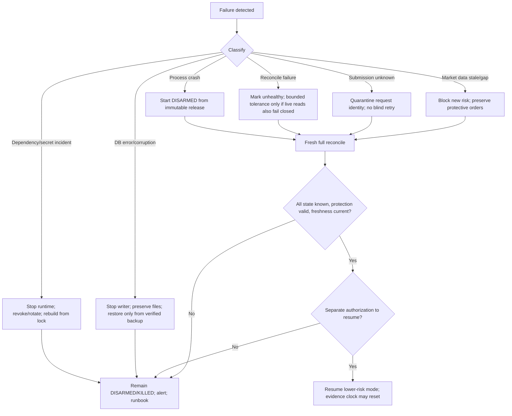

# 03 — Target Architecture

The target is an incremental hardening of the current Python system. It preserves the existing bridge, QuantLens, SQLite until benchmark evidence says otherwise, and the MTC read-only dashboard. It does not introduce a distributed event platform, Kubernetes, or framework rewrite.

## Principles

1. Research, validation, testnet/paper, and any future live environment have separate runtime identity, state, credentials, and evidence roots.
2. Strategies propose intent; an independent risk authority may veto; the order manager alone owns submission state.
3. Exchange truth wins. Unknown submissions are quarantined and reconciled before retry.
4. Historical analytical data and operational transaction state have different ownership.
5. Every release reports commit, config hash, dependency lock hash, runtime path, mode, database identity, and schema version.
6. Dashboard and LLM surfaces are outside the order-authority trust boundary.
7. Current Windows operation remains supported; Linux/Docker is a later qualification, not a prerequisite.

## Component responsibilities

| Component | Responsibility | Current reuse | Incremental change |
| --- | --- | --- | --- |
| Strategy decision core | Deterministic signal and protective intent from versioned inputs | Current strategy protocol and QuantLens logic | Remove concrete engine coupling; add version/config contract and parity fixtures |
| Market-data adapter | Historical bars, live stream, timestamps/sequences, gap/stale state | `BarFeed` + Hyperliquid broker | Add quality ledger and optional funding/OI/liquidation/L2 collectors |
| Exchange adapter | Official SDK signing/native behavior; qualified CCXT normalization | Current `Broker`/`HyperliquidBroker` | Add feature matrix, error taxonomy, rate/nonce/time policy |
| Portfolio state | Positions, balances, margin, exposure, PnL, reconciliation checkpoint | Store/account snapshots | Make authoritative and durable across restarts |
| Risk authority | Strategy-independent authorization/veto and kill escalation | Current `RiskEngine` | Wire reconciled PnL/exposure/drawdown/liquidation/funding inputs |
| Order manager | Deterministic intent/order identity and complete state machine | Current `OrderManager`/cloid | Add unknown, partial, cancel-pending, restart recovery invariants |
| Reconciler | Compare local state to orders/fills/positions/balances/margin | Current periodic reconcile | Create full diff/checkpoint/divergence alert contract |
| Operational store | Transactional runtime truth | SQLite WAL | Keep until benchmark; add migrations, backup/restore, corruption drill |
| Audit ledger | Append-only decisions, transitions, incidents, approvals | Events/decisions tables | Add schema, integrity chain/export, redaction and retention |
| Historical store | Immutable versioned research datasets | Existing bundles/Parquet | Standardize manifests; evaluate DuckDB query layer |
| Validation stack | Fast triage, event-driven validation, optional microstructure replay | QuantLens + current engine | Qualify VectorBT and hftbacktest behind tier contract |
| Observability | Logs, metrics, alerts, current incident/reconcile/risk state | APIs, DB events, Telegram | Add source-age/SLO semantics and read-only MTC view |
| Release tooling | Verify code/config/dependency/runtime identity | P2RT pattern and scripts | Add drift checker, immutable manifest, rollback/health evidence |
| LLM tools | Research, reporting, code audit | Existing optional LLM module/workflows | Remove any execution-authority interpretation; treat output as untrusted artifacts |

## 1. System component diagram

## 2. Order lifecycle

Invariant: a new-risk retry is forbidden while `UNKNOWN_SUBMISSION` or `UNKNOWN_CANCEL` exists. Every partial position is either protected to its filled quantity or flattened under a bounded fail-closed policy.

## 3. Reconciliation lifecycle

## 4. Strategy promotion pipeline

```mermaid
flowchart LR
    H["Hypothesis + preregistration"] --> D["Data validation + manifest"]
    D --> F["Fast research tier"]
    F --> W["Rolling walk-forward + locked OOS"]
    W --> S["Bootstrap/BH-FDR/DSR/CPCV/PBO/multi-window"]
    S --> B["Benchmark + fees/slippage/funding stress"]
    B --> E["Event-driven validation"]
    E --> M{"Microstructure-sensitive?"}
    M -- Yes --> O["L2/L3 replay and latency/queue validation"]
    M -- No --> PKG["Immutable candidate evidence package"]
    O --> PKG
    PKG --> SYS["Local system-test plumbing"]
    SYS --> PAPER["Pre-registered testnet/paper soak"]
    PAPER --> LIVE{"Signed live gate and explicit Barış approval?"}
    LIVE -- No --> BLOCK["Remain blocked/lower-risk"]
    LIVE -- Yes --> LIMITED["Separately approved limited-capital phase"]
```

No score, model verdict, dashboard badge, or short testnet run skips a gate.

## 5. Data architecture

## 6. Failure and recovery flow

## Trust boundaries

- Only the release-identified paper/testnet runtime may load exchange credentials.
- The official SDK signer is inside the exchange-adapter boundary; domain modules receive no key material.
- Risk and order state are deterministic internal authority. CCXT/native adapters cannot bypass them.
- Dashboard, Telegram, LLMs, research notebooks, and user-supplied content are untrusted/read-only with respect to order authority.
- Operational SQLite is single-writer. Read models use bounded read-only access or exported snapshots.
- Any future mainnet environment receives separate credentials, runtime, database, port, logs, and signed approval. It is not created by changing a testnet flag.

## Deployment topology

### Near term

- Windows host; canonical source checkout for development.
- Short isolated runtime worktree such as `C:\P2RT`, pinned to a reviewed release commit.
- Locked Python environment dedicated to the runtime.
- Localhost bridge/API; Task Scheduler supervisor; read-only health collection.
- Separate data/log root and immutable release manifest.

### Later, evidence-gated

- VPS/Linux or container only after reproducible build, secret injection, volume backup/restore, health checks, rollback, SBOM/image scan, and Windows parity qualification.
- No Kubernetes, Redis, message broker, or PostgreSQL unless measured concurrency/recovery requirements justify them.

## Borrow/use/study policy

- Use: official Hyperliquid SDK behind the owned adapter.
- Qualify: CCXT for normalized non-critical paths with native overrides.
- Integrate where useful: VectorBT for fast research, not fill truth.
- Evaluate: hftbacktest only for microstructure-sensitive strategies after collector coverage audit.
- Study patterns: NautilusTrader, Freqtrade, Hummingbot, Passivbot exposure/reconciliation, commercial UX.
- Do not adopt as production core: LLM-agent bots, copy-trading bots, Passivbot strategy logic, or unreviewed small trading repositories.
