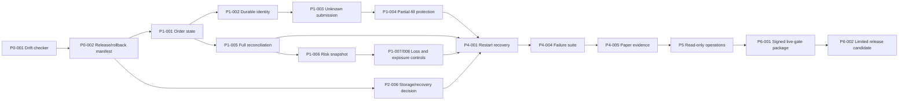
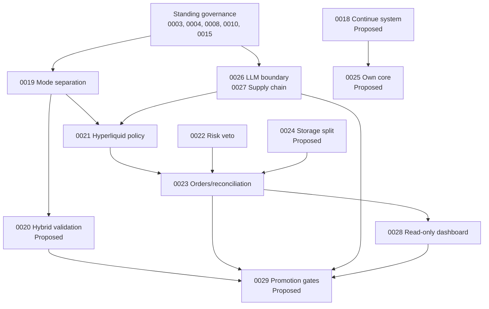

# 07 — Dependency and Sequence Map

## Critical path

Phase 6 nodes are blocked, not scheduled delivery commitments.

## ADR dependency graph

## Task waves and parallel work

| Wave | Serial work | Safe parallel work | Blocker/approval |
| --- | --- | --- | --- |
| W0 | P0-001 → P0-002 | P0-003 after P0-001 | Documentation only; Barış chooses P0-004 ADR status |
| W1 | P1-001 → P1-002 → P1-003 → P1-004 | P1-011 → P1-012; P1-005 begins after P1-001 | Safety design/adversarial review |
| W2 | P1-005 → P1-006 → P1-007/008 → P1-009 | P1-010 after P1-001/005 | Testnet drills separately approved |
| W3 | P2-001, P2-004, P2-006 feed later tasks | P2-002, P2-003, P2-005 | ADR-0018/0025 and schema/migration approvals |
| W4 | P3-001 → P3-002/003/004/005 → P3-006 | Tools can run in separate research-only branches | ADR-0020 acceptance; no backtest/download without approval |
| W5 | P4-001/002/003 → P4-004 → P4-005 | Mock/recorded drills parallel by subsystem | P4-005 requires explicit testnet/paper approval |
| W6 | P5-001 → P5-002/003 | UI and alert work can be separate after read model | Dashboard remains read-only |
| W7 | P6-001 → P6-002 | None | Signed live gate and separate written approval; currently blocked |
| W8 | P7 tasks one dimension at a time | No bundled exchange/symbol/platform expansion | Gate F and per-expansion approval |

## Approval and environment map

| Task class | Mock/fixture allowed | Recorded exchange fixture | Testnet required | Paper duration required | Real capital required | Manual approval |
| --- | --- | --- | --- | --- | --- | --- |
| Phase 0 identity/docs | Yes | No | No | No | No | ADR status only |
| Order/risk/reconcile code | Yes, mandatory first | Yes | Final adapter/drill tier only | No | No | Safety policy and external run |
| Validation integration | Yes | Yes | No by default | No | No | Backtest/download execution and ADR-0020 |
| Paper hardening | Yes first | Yes | P4-001/002 final tier and P4-005 | P4-005 | No | Explicit per run/window |
| Dashboard | Yes | Snapshot fixtures | Read-only observation optional | No | No | UI review; mutations forbidden |
| Limited live | Yes | Yes | Yes | Yes | P6-002 only | Barış explicit written approval; currently absent |

## Tasks blocked by current monitoring state

- TS-P4-005 cannot claim continuation of Day 0 v5. The current bridge API is unavailable; a future approved monitoring window must follow the reset policy.
- TS-P6-001 cannot cite an interrupted/unobservable window as complete paper evidence.
- No task may restart or ARM the bridge merely to collect roadmap evidence.

## Tasks blocked by missing evidence

- TS-P0-004: owner decision on ADR-0018/0025.
- TS-P2-006: representative writer/load/restore benchmark and recovery requirements.
- TS-P3-001: Barış decision on ADR-0020 after current-engine map.
- TS-P3-004: verified hftbacktest Hyperliquid field/sequence coverage.
- TS-P6-001/002: signed ADR-0029/live gate and all preceding evidence.

## Real-capital boundary

Only TS-P6-002 could ever require real capital, and only after TS-P6-001 passes and Barış issues a separate explicit authorization defining account, amount, limits, start/stop, retry and rollback. The roadmap itself provides no such authorization.

