# MASTER ARCHITECTURE AND IMPLEMENTATION BRIEF — v2.1
## Trading Platform — Consolidated Audit, Target Architecture and Roadmap

**Version:** 2.1 — owner-ratified decisions, peer-reviewed, Gate-5 audited, **repaired; G1 architecture acceptance SATISFIED on 2026-08-23 for the exact candidate commit `c81aacb83f89ebc2454ddc80b4fd619ae8fd57f5` (cycle C2-R1) — see §0.7, which governs current status**
**Date:** 2026-08-21 (v2.0) · repaired 2026-08-22 (v2.1, **five** repair rounds — the fifth is the round recorded in §0.6 / C-29; the header previously said four and undercounted it. The historical round records in §0.3, §0.4 and §0.5 are unchanged; §0.6 retains its original blocker statements, and its **R1**, **R3** and **R9** *Repair* and *Where* cells were **extended append-only** by later correction passes)

> ## STATUS — read before using this document
> | Field | Value |
> |---|---|
> | **Document state** | **v2.1 REPAIRED** — the 2026-08-21 Gate-5 findings are repaired (Appendix E), a second owner-authorized T2 documentation round applied the repairs listed in §0.3, a third owner-authorized T2 documentation round applied the repairs listed in §0.4, a **fourth owner-authorized T2 documentation round** applied the repairs listed in **§0.5** (owner acknowledgement of D-01…D-12, the D-02 and D-07 clarifications, and removal of a reserved future safeguard identifier), and a **fifth owner-authorized documentation round** repaired the **seventeen blockers R1 … R17 raised by the G1 architecture acceptance audit round 1 (T0)**, listed in **§0.6**. **The version remains v2.1; no repair round is an acceptance.** **A subsequent status-only record, §0.7 (2026-08-23), carries the current acceptance and acknowledgement position and changes no architecture text, count, package, gate or authorization** |
> | **Current counts (§0.6 governs the totals; §0.7 governs status)** | **60 tracked requirements = 44 owner outcomes (O-01…O-44, unchanged) + 16 derived safeguards (D-01…D-16)**. **All 16 are now owner-acknowledged** — D-01…D-12 on **2026-08-22** (D-02 and D-07 with their recorded clarifications), **D-13…D-16 on 2026-08-23 AS WRITTEN**. **They remain DERIVED permanently, their safeguard text is unchanged, and they never become original owner outcomes.** **76 work-package definitions** *(69 before the 2026-08-23 wayfinder decision fold — C-31; map #37 added six, bringing the count to 75, and the map-#79 execution-architecture fold added the seventh, **WP-P0-31 Lifecycle Ledger and Registrar** — §10.4, §17.1 — bringing it to the canonical 76; maps #78 and #95 amend existing carriers only)*. Counts quoted inside §0.3, §0.4 and §0.5 are historical to those rounds and are not the current totals |
> | **AUDIT ACCEPTANCE** | **SATISFIED for gate G1, at the exact candidate commit `c81aacb83f89ebc2454ddc80b4fd619ae8fd57f5` (parent / fixed point `e71248a2576132b3e3363df00b7f2ce5425902aa`), cycle C2-R1, 2026-08-23** — two fresh, independent, read-only flagship audits at `xhigh` (`claude-opus-5` **PASS**; Codex `gpt-5.6-sol` **PASS**), supplemental Standards and Spec axes **PASS**, **no unresolved required finding**, final audited worktree clean. **The acceptance attaches to that candidate commit only; a later status-record commit is not itself audited.** Acceptance remains governed by the **current root `AGENTS.md`**: the **tier-required independent audit(s)** at the **highest applicable tier at the actual gate**, with the auditor identity, effort and count that policy names **at the time of that gate**. This document does **not** decide a permanent tier, an auditor count or a model identity. The 2026-08-21 Codex Slot-B `REQUEST_CHANGES` on **v2.0** is **historical provenance only**. **G1 acceptance is not implementation authorization: `G1-IA` is unsatisfied, every work package is NOT STARTED, and no deployment, host, credential, testnet or live act is authorized.** Appendix E §E.7 is the canonical acceptance record and now carries this result |
> | **IMPLEMENTATION AUTHORIZED** | **NO.** Nothing in this document authorizes code, migration, deployment, schema activation, host contact, credential use, broker action, TESTNET/MAINNET action, ARM, or an order |
> | **DECISIONS APPROVED** | **YES, for the owner decisions in §21.1 only.** Those are binding. Everything else is analysis and proposal |
> | **Companion documents** | Owner plan: `OWNER_MASTER_PLAN_2026-08-22.md` · Traceability: `REQUIREMENTS_TRACEABILITY_REGISTER_2026-08-22.md` · Work packages: `MASTER_WORK_PACKAGE_AND_PARALLEL_DELIVERY_PLAN_2026-08-22.md` · Starting point: `PROJECT_STARTING_POINT_AND_MAIN_OBJECTIVE_2026-08-22.md` (all in `MTC_COMMAND_CENTER/11_TRIAGE/`) |
**Author:** Claude (Opus 5) — Lead session, documentation-only architecture task (documents written and repaired; no code, logic, deployment or Git mutation)
**Supersedes:** v1.0 and v2.0 of the same filename. §0.2 lists every change. **v2.1 repairs the eight required findings of the Codex Slot-B Gate-5 audit** (`CODEX_AUDIT_MASTER_BRIEF_VERDICT_2026-08-21.md`), all reproduced on real source before repair — ledger in **Appendix E**.
**Repository audited:** `C:\LAB\Tradingview_LAB_CLEAN`
**Audited tree:** working checkout on branch `codex/bridge-help-wiki` (HEAD `59e79bb2`) **plus** `master` (`b5d95d26`) read via `git show`. The working checkout is **60 commits behind master** — see F-19.
**Mode:** documentation-only. This brief and its companion documents were **written and repaired in place** — that is a write to documentation files, not a read-only session. **No code was edited; no strategy, Pine or Bridge logic was changed; no configuration or schema was modified; nothing was deployed, archived, moved or ordered; no Git mutation was performed (no commit, branch, tag, push, reset, checkout, stash or clean); and no host, credential, exchange or broker was contacted.**

**Peer review incorporated:** four independent reviews of v1 — Codex (16 points), ChatGPT report 1 (10 points), ChatGPT report 2 (9 points), Antigravity/Gemini (8 enhancement specifications). Disposition of all 43 points is in **Appendix D**, with six sub-clauses explicitly rejected.

**Owner decisions incorporated:** Q1–Q19, ratified 2026-08-21. Full text in §21.

**Authority of this document:** the owner decisions in §21 are **binding**. Everything else is analysis and proposal, and authorizes no implementation. Existing repo governance (`AGENTS.md` two-tier model, audit tiers T0–T3, `MTC_REPO_GUARD_PROTOCOL.md`) continues to apply unchanged. No package, migration, deployment, schema activation, host contact, credential use, broker action, TESTNET/MAINNET action, ARM or order is authorized by this document.

---

## Legend

| Tag | Meaning |
|---|---|
| **[FACT]** | Verified against source, artifact or git in the audit session. File and line cited. |
| **[OWNER]** | Ratified owner decision. Binding. |
| **[REPORTED]** | Stated by the owner or a repo record; not independently verifiable from this machine. |
| **[DRIFT]** | A documentation claim that source or artifacts contradict. |
| **[REC]** | Professional recommendation of this brief's author. |
| **[OPEN]** | Genuinely undecided; needs an owner decision or an experiment. |

---

# 0. What is binding, and what changed from v1

## 0.1 Owner decisions — index only; §21.1 is canonical

**Nineteen owner questions were answered and ratified on 2026-08-21. Q2 is answered in two parts (Q2a, Q2b), so twenty binding entries exist.** This section is a one-line index. **The full decision text lives in §21.1 and §21.1 alone is canonical** — if this index and §21.1 ever differ, §21.1 governs. §20 restates the same decisions as a dated decision log with `DL-` identifiers for cross-referencing; it is also derived from §21.1.

| Q | One-line label | Where it lands |
|---|---|---|
| **Q1** | One authoritative Python Strategy Kernel; allocation resolved by Allocator/Guardian | §5, §7, §16 |
| **Q2a** | Versioned contracts package, in place, now | §14.3 |
| **Q2b** | Repository topology — **stage-routed monorepo is the default through Phase 0–V3**; route and measure context in place, and consider a split later only if measured cost or the security/deployment boundary justifies it *(reconciled 2026-08-23 by the map-#97 fold; §21.1 remains canonical)* | §14.4, **§14.6**, §15, **§15.5** |
| **Q3** | Pine becomes visualization and divergence monitoring only | §8.3 |
| **Q4** | Hybrid worker isolation | §10.2, §17.2 |
| **Q5** | Harvest then freeze the duplicate engine; do not delete | §7.3, §16 |
| **Q6** | Account binding decided after **WP-P0-28 (VEN-A)** exchange verification; subaccounts preferred *(carrier name repaired 2026-08-24, map #123 fold, from the retired "Package 7"; §21.1 Q6 reads "decide after verification" and is unchanged)* | §10.2, §17.2 |
| **Q7** | Native exchange stop for V2 | §9.2, §5.4 |
| **Q8** | Research explorer on the owner PC initially | §12.1 |
| **Q9** | 20 GB artifact budget with replay and retention | §11.2 |
| **Q10** | Live-gate principle approved; signature deferred | §17.4, §19 |
| **Q11** | First live: one strategy, ≤ 1 % of account as **maximum capital allocated**; loss-at-stop (risk-to-stop) carries a separate, lower cap that must be defined and evidenced before live authorization | §17.4 |
| **Q12** | NautilusTrader POC only; no Bridge replacement in V2 | §13.2, §17.3 |
| **Q13** | Branch pruning only after inventory, tagging and explicit target approval | §16 |
| **Q14** | Historical results are signal screens, not capital-ready estimates | §2 F-3, §9.4 |
| **Q15** | `LEGACY_COMPATIBLE` first, then `CORRECTED_VNEXT` | §16 M7a/M7b |
| **Q16** | Guardian authorizes or rejects in V2; no resizing | §5.5, §10.2 |
| **Q17** | Capacity-driven testnet fleet size | §6.5, §17.2 |
| **Q18** | 30/50/20 is a simulation hypothesis; every bucket starts at 1× | §10.1 |
| **Q19** | Chart-library POC before any charting commitment | §12.2 |

## 0.2 Changes from v1 — for the auditor

Six of these are corrections of **errors in v1**, not refinements.

| # | Change | Driver | Type |
|---|---|---|---|
| C-1 | Migration split into `LEGACY_COMPATIBLE` → `CORRECTED_VNEXT`. v1's single bit-identical gate would have **preserved the F-2 sizing defect it identified**. | Codex §4, Q15 | **Error corrected** |
| C-2 | Shadow-leakage rules added: freeze package hash before shadow starts; timestamped evidence windows; `OBSERVED_DURING_RESEARCH` marking. v1 proposed parallel shadow + optimization with no leakage control. | Codex §14 | **Error corrected** |
| C-3 | `TrialRecord` contract defined before any optimizer choice. v1 recommended Optuna without noting that adaptive search changes the DSR/BH-FDR trial family. | Codex §6 | **Error corrected** |
| C-4 | F-14 wording corrected from "inert on the running database" to "not activated by the default initialization path; deployed state unverified". | ChatGPT 1 §9 | **Error corrected** |
| C-5 | Acceptance criterion A-13 reworded; deterministic on-demand replay added. v1's A-13 contradicted v1's own artifact model. | Codex §8 | **Error corrected** |
| C-6 | Promotion evidence binds to a **frozen hash**, never to `candidate_id`. v1 attached forward evidence to `candidate_id`. **Superseded and extended by §0.6 R2 (§6.7):** `package_hash` freezes strategy semantics and is **one component of lineage**; it does **not** by itself start or own a forward evidence clock. Economic, forward, promotion and live evidence binds to the composite **`deployment_identity_hash`**. C-6 is retained as the historical correction of v1's `candidate_id` binding, not as the current rule. | Codex §2 | **Error corrected, later extended** |
| C-7 | Position sizing split into `SizingIntent` (kernel) and `AuthorizedQuantity` (Risk Allocator). v1 gave the kernel the final quantity. **Superseded by §0.6 R3 (§5.4, §5.5): the single `SizingIntent` is replaced by `SizingRequest` (K) → `BoundSizingIntent` (OR) → `proposed_qty` (RA) → `AuthorizedQuantity` (Guardian).** | Codex §1, ChatGPT 2 §3, Q1, Q16 | Architectural improvement, later superseded |
| C-8 | Source profiles replaced: `SOURCE_LITERAL` / `SIGNAL_EDGE` evaluation / `SOURCE_COMPLETED_BASELINE` / `MTC_ENRICHED`. v1's "naked" was wrong once a substitute stop was added. No auto-reject on an incomplete source. | Codex §3, ChatGPT 1 §1, ChatGPT 2 §4 | Correction |
| C-9 | Four forward **environments** and four **eligibility states** replace v1's two-lane model. `TESTNET_PAPER_ELIGIBLE` added before full statistics. | Codex §13, ChatGPT 1 §4, ChatGPT 2 §6, Q17 | Improvement |
| C-10 | Module count removed from the DSR calculation; preregistered search family used instead; complexity reported separately. | Codex §7, ChatGPT 2 §5 | Correction |
| C-11 | Kernel mandatory core reduced from ~50 config keys to ~30; Multi-TP, break-even, trailing, time exits, pyramiding, flip, filter-block exits become modules. | ChatGPT 1 §3 | Improvement |
| C-12 | Kernel Economic Golden Suite replaces v1's "entry golden + one parity case". Seventeen families in v2.0; **25 families since v2.1** (families 18–25 added from the Gate-5 design review, §9.3). | Codex §4, ChatGPT 1 §5, ChatGPT 2 §2 | **Gate strengthened** |
| C-13 | Repository topology deferred; contracts package defined in place now. **Deferral closed 2026-08-23 by the map-#97 fold (§14.4, §14.6): the stage-routed monorepo is the ratified default through Phase 0–V3, with a later split only on a measured trigger. C-13 is retained as the historical sequencing correction of v1's assumed split, not as the current position.** | ChatGPT 2 §1, Codex §10, Q2a/Q2b | Sequencing, **later answered** |
| C-14 | AI context routing decoupled from migration — implemented now, in the current repo, and measured. | ChatGPT 2 §9, Q2b | Sequencing |
| C-15 | Historical artifacts classified by engine lineage rather than dismissed uniformly. | Codex §5 | Correction |
| C-16 | Bridge migration must name an exact accepted commit and package inclusion list — not "wholesale". | Codex §12 | Correction |
| C-17 | Branch pruning moved to after evidence preservation. | Codex §11, Q13 | Sequencing |
| C-18 | Licensing conclusions made integration-mode aware; categorical legal claims removed. | Codex §15, ChatGPT 1 §10 | Correction |
| C-19 | Multi-TP live execution removed from V2 acceptance; contract carries legs from V2. | Codex §16 | Scope |
| C-20 | Drag-and-drop client-server state machine, seven-state freshness machine, runtime correlation gating, plateau/needle detection, zero-trust network spec and the package-hash formula adopted as normative specifications. | Antigravity §1–§8 | Addition |
| C-21 | Promotion authority separated from the explorer; immutable decision artifact required. | ChatGPT 1 §8 | Improvement |
| C-22 | Chart library selection gated behind a POC. | Codex §9, Q19 | Sequencing |
| C-23 | Two trust domains mandatory; one owner-facing entry point permitted. | ChatGPT 2 §8 | Clarification |
| C-24 | New finding F-22 added: in the 2026-05-30 ~93k-configuration sweep, **zero configurations survived the strict gates**. | Audit follow-up | New evidence |
| C-25 | **v2.1 repair pass.** Eight reproduced findings from the Codex Slot-B Gate-5 audit repaired: F-7 corpus scoping + parity inventory (RF-1); F-22 rescoped to one sweep (RF-2); F-2 worked example corrected — shipped defaults floor to zero (RF-3); sizing snapshot identity made fail-closed at runtime (RF-4); F-4 narrowed + writer inventory (RF-5); F-10 payload-vs-directory (RF-6); F-15 runtime caveat (RF-7); F-17 timestamped with branch semantics (RF-8). Plus 8 citation repairs, the Appendix D count, and 3 nits. | Codex audit `CODEX_AUDIT_MASTER_BRIEF_VERDICT_2026-08-21.md` | **Errors corrected** |
| C-26 | **v2.1 second repair round (2026-08-22), owner-authorized T2 documentation task.** Twenty-one internal-consistency repairs applied in place; no evidence deleted, no citation weakened. Enumerated in §0.3. | Owner instruction, documentation-only round | **Errors corrected / clarifications** |
| C-27 | **v2.1 third repair round (2026-08-22), owner-authorized single T2 documentation round.** Five reproduced findings from a fresh independent T2 review repaired: acceptance policy and model identity (RF-T2-1); per-package implementation authorization and the new **G1-IA** gate (RF-T2-2); the V2A native-stop proof made local-only, with the real venue drill moved to V2B testnet (RF-T2-3); §22 tier alignment to the work plan (RF-T2-4); untracked-artefact inventory (RF-T2-5). Enumerated in §0.4. **No requirement added, no count changed, nothing accepted.** | Independent T2 review, documentation-only round | **Errors corrected / clarifications** |
| C-28 | **v2.1 fourth repair round (2026-08-22), owner-authorized single T2 documentation round.** The owner acknowledged all twelve derived safeguards **D-01…D-12** — ten as written, **D-02 and D-07 with clarifications** (new-order sizing vs. separately authorized emergency reduction of existing exposure; 1 % as maximum allocated capital with a separate lower loss-at-stop cap still to be defined and evidenced). Stale "not yet acknowledged" wording replaced across the document set, and a **reserved future derived-safeguard identifier removed** from the register's change-control rule. Enumerated in §0.5. **No requirement added, no requirement renumbered, no count changed in that round (56 = 44 + 12 at the time), nothing accepted and no implementation authorized.** | Owner decision 2026-08-22, documentation-only round | **Clarifications** |
| C-29 | **v2.1 fifth repair round (2026-08-22), owner-authorized documentation round answering the G1 architecture acceptance audit round 1 (T0).** Seventeen reproduced blockers repaired: the live gate restated at its canonical **fourteen** hard preconditions (R1); a **composite economic/deployment evidence identity** defined and bound to every evidence class (R2); the circular sizing contract replaced by four explicitly owned stages (R3); an acceptance-bearing **canonical research-simulator migration** package added (R4); **staged, objective, immutable environment admission** added ahead of loader admission (R5, R13); a **family/human-observation leakage control** placed before the first `LIVE_CANDIDATE` decision (R6); Pine de-fang **design** separated from a distinct T0 **implementation** package (R7); **DISARM / KILL / FLATTEN / future automatic emergency reduction** defined and kept separate (R8); the **G2–G9** protected-gate mapping completed (R9); a **production** chart and result-visual package added (R10); the OSS-first policy expanded to provenance, supply chain, abandonment, incident response, portability and owner-authorized retirement (R11); the false "inert `tw_*`" framing replaced with **active DRIFT** and its real consumers (R12); the **M9/M10** migration chain made executable with a separately authorized Bridge migration/deployment carrier (R14); a **cited-artefact provenance inventory** added and false reproducibility claims removed (R15, Appendix F); the **existing Bridge broker boundary** recorded with a reuse/extend/replace decision carrier (R16); and **break-glass authentication redundancy** with out-of-band venue-side recovery added (R17). **Four new derived safeguards D-13…D-16, ten new work packages, no O-row changed, nothing accepted, nothing authorized.** | G1 architecture acceptance audit round 1 (T0), documentation-only round | **Errors corrected** |
| C-31 | **Wayfinder decision fold (2026-08-23), owner-decided documentation round.** The wayfinder macro gap audit's 18 gaps were resolved as owner decisions through GitHub decision map #37 (15 tickets, all closed 2026-08-23). This round: six work packages added to the delivery plan (**WP-P0-26 OPS-A, WP-P0-27 OPS-C, WP-P0-28 VEN-A, WP-P0-29 VEN-C, WP-P0-30 VEN-E, WP-V4-09 tax export**) and thirteen amended in place; this brief's two §17.2 ghost dependency rows re-pointed from the retired "Package 7"/"Package 1 §A.2" names; package count 69 → **75**. **No owner outcome or safeguard wording changed; the requirement count stays 60; nothing was renumbered; nothing is authorized.** Deep-section prose folds (§6.3 lifecycle no-orphan rule, §9.2 carrier naming, §12.x host requirements) are carried by the amended plan packages and flagged for the recommended fresh G1 round. Full record: `WAYFINDER_DECISION_FOLD_2026-08-23.md` | Wayfinder decision map #37, owner-grilled | **Owner decisions folded** |
| C-30 | **Status-only provenance record (2026-08-23), owner-authorized T3.** Two facts recorded and nothing else: the owner **acknowledged D-13 … D-16 AS WRITTEN** on 2026-08-23, completing owner acknowledgement of all 16 derived safeguards while they stay **DERIVED** with **unchanged text**; and **G1 architecture acceptance completed successfully (cycle C2-R1)** for the exact candidate commit `c81aacb83f89ebc2454ddc80b4fd619ae8fd57f5` (parent `e71248a2576132b3e3363df00b7f2ce5425902aa`) on two fresh independent read-only `xhigh` flagship **PASS** verdicts (`claude-opus-5`, Codex `gpt-5.6-sol`), Standards and Spec axes **PASS**, no unresolved required finding, clean final worktree. **Recorded in §0.7, the STATUS block and Appendix E §E.7.** **No architecture text, requirement, safeguard wording, count, work package, dependency, tier or gate changed. `G1-IA` remains unsatisfied, every package remains NOT STARTED, and implementation, deployment, host, credential, testnet, live, push, trading and spending remain unauthorized.** | Owner acknowledgement and C2-R1 audit result, status-only round | **Status / provenance** |

## 0.3 The second v2.1 repair round — what changed on 2026-08-22

Documentation-only. No finding was removed, no citation dropped, no source claim invented. Each item repaired an internal contradiction, a stale count, or a classification error that would have misled an implementer.

| # | Repair | Where |
|---|---|---|
| 1 | Status made explicit: repaired, **audit acceptance pending**, implementation **not** authorized | Header STATUS block; Appendix E §E.7 unchanged and still canonical |
| 2 | "The fourteen" decision heading corrected — the section carries Q1–Q19 including Q2a/Q2b | §0.1 |
| 3 | Lifecycle/package-freeze contradiction resolved: the baseline/enriched package freezes for early shadow; optimization mints **trial identities**; each selected optimized package receives a **new `package_hash`**. **Superseded and extended by §0.6 R2:** a new `package_hash` does **not** by itself start an acceptance-bearing forward clock — the clock starts when the full **`deployment_identity_hash`** is minted and admitted for that environment (§6.7) | §6.3, §6.6, §6.7, §6.8 |
| 4 | Identity split: `package_hash` carries deployable strategy semantics only; **`evaluation_run_hash`** adds dataset, costs, simulator and evaluation configuration | §6.7, §11.2 |
| 5 | Duplicate sizing recipes eliminated: `kernel_reference_qty` redefined as a **replayable diagnostic**, never an independent runtime calculation | §5.4, §5.5 |
| 6 | One vocabulary everywhere: **RA computes `proposed_qty` · Guardian authorizes it unchanged as `AuthorizedQuantity` or rejects · Bridge executes or rejects** | §4.2, §5.5, §9.2, §10.2 |
| 7 | Principle 1 narrowed to "a **strategy-lifecycle** rule not in the kernel does not exist" | §5.1 |
| 8 | Stale 17-family references replaced with **25** wherever the Golden Suite is cited | §9.3, §16 M6, §17.1, §18 R-1, §22 |
| 9 | Phase 0 non-goal clarified: no **execution-dashboard** rework; the research-side Minimum Explorer is in scope | §17.1, §11.4 |
| 10 | Phase 0 contracts acceptance clarified: schema and consumer **compatibility** may be tested without changing Bridge behaviour; **Bridge runtime wiring belongs to V2** | §14.3, §19 A-1 |
| 11 | Repository topology clarified: **logical and trust-domain separation is binding**; separate Git repositories remain deferred | §12.1, §14.2, §14.4 |
| 12 | "Forward evidence is the binding constraint" replaced by **dual constraints** — discovery of statistically credible candidates **and** calendar-time forward evidence | §1.1, §2 F-22, §6.8, §18 R-22 |
| 13 | Next-action classifications corrected — tagging, packages, routing and branch guards are **writes**; "bring the checkout to master" replaced by a **verified clean isolated worktree** approach | §22 |
| 14 | Removing the Pine order alerts stated as a **protected routing/behaviour change requiring its own T0 authorization and audit**; this document does not authorize it | §8.3, §22 item 6 |
| 15 | "deleted into" corrected to **"consolidated into"** | §7.1 |
| 16 | End marker corrected to **v2.1**; appendices explicitly placed | end of §22 / after Appendix E |
| 17 | Duplicated binding-decision presentation reduced: **§0.1 is an index, §21.1 is canonical**, §20 is a derived log | §0.1, §20, §21.1 |
| 18 | `optuna-dashboard` timeboxed as an **optional isolated POC**, adopted only if it demonstrably saves work — never a second maintained viewer; **its retirement or removal requires a separate owner-authorized cleanup after its findings, measurements and decision record are preserved** | §13.2, §17.1, §22 item 8 |
| 19 | Exhaustive file classification made **risk-based**: every canonical, migration-relevant and evidence-bearing path is classified individually; generated and irrelevant paths may be machine-grouped | §16 M0/M1 |
| 20 | **V2A / V2B sequencing** made explicit so V2 is not one oversized delivery | §17.2, §17.2a |
| 21 | Citations and evidence preserved throughout; no fact invented | whole document |

## 0.4 The third v2.1 repair round — 2026-08-22 (RF-T2-1 … RF-T2-5)

Documentation-only, owner-authorized, **one** T2 repair round answering a fresh independent T2 review of the repaired document set. **No requirement was added, no requirement wording was inflated, no count changed, nothing was accepted and no implementation was authorized.** The tracked total remains **56 = 44 owner outcomes (O-01…O-44) + 12 derived safeguards (D-01…D-12)**.

| RF | Finding | Repair | Where |
|---|---|---|---|
| **RF-T2-1** | The STATUS block and Appendix E §E.7 named an obsolete auditor model and presented the v2.0 Slot A / Slot B pairing as the **current** acceptance contract | Acceptance restated as **PENDING** until the **tier-required independent audit(s) under current root `AGENTS.md`** accept it, at the **highest applicable tier at the actual gate**; no permanent tier, auditor count or model identity is decided in prose; the v2.0 Codex Slot-B result is retained as **historical provenance only** | STATUS block, this §0.4, Appendix E §E.7; delivery-plan gate **G1** |
| **RF-T2-2** | Authorization language implied that only protected-surface packages need the owner's implementation authorization | **Every** work package requires **explicit owner implementation authorization**, protected or not. A new gate **G1-IA — Package implementation authorization** was added **after G1** in the delivery plan, applying to every package, with **G2–G9 unchanged and not renumbered**. Audit acceptance, dependency readiness and authorization remain three separate things; protected, host, testnet, live, credential and destructive actions additionally require their own gates | Delivery plan §0, §1, §9; register §1.1, §1.2 and D-12 |
| **RF-T2-3** | WP-V2A-06 implied venue contact inside V2A, a phase whose defining property is **zero orders and no venue contact** | V2A **keeps** the native reduce-only stop contract (Q7 / DL-11) and proves it **locally only**: placement / amendment / cancellation semantics against a deterministic adapter-emulator or replay, the identical backtest model of a continuously active protective order, and a **local process-kill/restart harness** where the emulator retains the protective order while the worker dies — **no credentials, no venue contact**. The **real exchange-native protective-order and process-kill survival drill moves to WP-V2B-07**, on testnet, under gate **G4** | §5.4, §9.2, §17.2a, §17.2b; delivery plan **WP-V2A-06** and **WP-V2B-07**; register **D-03** |
| **RF-T2-4** | §22's tier column disagreed with the delivery plan's package tiers | §22 item 2 (contracts) and item 3 (context routing) aligned to **T1**, matching WP-P0-04 / WP-P0-05. Item 5 aligned to **T1** because WP-P0-15 adds a **repo-guard check**, and WP-P0-15 itself is raised to T1. Item 8 aligned to the conditional wording — **T1 if POC code is built; T2 for the closure artefact alone if it is skipped and produces only a documented skip decision** — matching WP-P0-17. **The delivery plan's tier column is canonical for package tiers**; no other tier was changed | §22; delivery plan **WP-P0-15**, **WP-P0-17** |
| **RF-T2-5** | The repository inventory covered **tracked** files only, while the untracked user material in the existing dirty checkout is the material actually at risk — so WP-P0-15's stated dependency on it was not real | M0/M1 and WP-P0-01 now **also inventory and classify untracked artefacts, read-only**: path, size, timestamp/age where available, likely owner, purpose, classification and evidence relevance, with the **volatile count measured at execution** rather than quoted from a stale snapshot. Moving, staging, deleting, overwriting or committing any untracked item during inventory is **explicitly forbidden**; unknown ownership stays **UNKNOWN** and blocks any cleanup or migration affecting it | §16 M0/M1, §22 item 5; delivery plan **WP-P0-01** |

**What did not change in this round.** Audit acceptance is still **PENDING**; implementation is still **NOT AUTHORIZED**; the 56-requirement count, every requirement ID, the phase structure, the deferred topology decision, the Pine decision-versus-edit split, the RA/Guardian vocabulary, every hash formula and the **25** golden families are all untouched. **This round accepts nothing** — it is a repair by the party under audit and a re-auditor should read §0.4 as a set of claims, exactly as §E.7 says of §0.3.

## 0.5 The fourth v2.1 repair round — 2026-08-22 (owner acknowledgement of D-01 … D-12)

Documentation-only, owner-authorized, **one** T2 repair round recording an owner decision taken on 2026-08-22. **No requirement was added, no requirement wording was inflated, no requirement was renumbered, no count changed, nothing was accepted and no implementation was authorized.** The tracked total remains **56 = 44 original owner outcomes (O-01…O-44) + 12 owner-acknowledged derived safeguards (D-01…D-12)**. The document version remains **v2.1** and audit acceptance remains **PENDING**.

**The owner decision recorded.** The owner acknowledged **all twelve** derived safeguards. **Acknowledgement does not reclassify them**: D-01…D-12 remain **DERIVED** permanently and were never original owner requirements, and no document may present them back to the owner as things he asked for.

| # | Repair | Where |
|---|---|---|
| 1 | Stale "proposed for acknowledgement / not yet given" wording replaced with the recorded acknowledgement of **D-01…D-12**, with the DERIVED source type preserved and the 56 = 44 + 12 split unchanged | Register §1, §3 and its preamble; starting point §4; owner plan §2 |
| 2 | **D-02 clarification.** The no-resizing rule governs **new-order sizing**. It does **not** prohibit a **separately authorized** emergency reduction or closure of **existing** exposure, which would be a distinct, explicit, tested safety policy with a visible reason — never silent resizing. **This clarification authorizes neither the implementation nor the use of such a policy.** It resolves the *distinction* raised as Appendix E **O-11**; the detailed emergency-policy design remains future work under **WP-V3-10** | §5.5, §10.2, §17.3; Appendix **E.5**, **E.6 O-11**; register **D-02**; delivery plan **WP-V2B-01**, **WP-V2B-02**, **WP-V3-04**, **WP-V3-10** |
| 3 | **D-07 clarification.** The **1 %** is the **maximum capital allocated** to the first `LIMITED_LIVE` strategy. **Loss-at-stop / risk-to-stop carries a separate and LOWER cap, which must be defined and evidenced before any live authorization.** **No number is invented for it here** | §17.4, §19 **A-24**, §20 **DL-15**, §21.1 **Q11**; register **D-07**; delivery plan **WP-V4-01**, **WP-V4-02** |
| 4 | The register's change-control rule no longer prints a **reserved future safeguard identifier**. New derived safeguards continue **sequentially after the current D-01…D-12 range**, and the next identifier is assigned **only when a safeguard is actually added** | Register §6 rule 3 |
| 5 | The four authorization axes kept explicitly distinct — **owner acknowledgement / decision approval · implementation authorization (G1-IA) · audit acceptance (G1) · deployment and live authorization (G2…G9)** — with acknowledgement stated as supplying none of the other three | STATUS block, this §0.5, Appendix **E.7**; owner plan §9; register **D-12** and its acknowledgement note |

**What did not change in this round.** Audit acceptance is still **PENDING**; implementation is still **NOT AUTHORIZED**; O-01…O-44 keep their exact wording and numbering; D-01…D-12 keep their IDs and their DERIVED source type; the phase structure, the 59 work-package definitions **as they stood at the close of that round**, their tiers and their dependencies, the deferred topology decision, the Pine decision-versus-edit split, the RA/Guardian vocabulary, every hash formula and the **25** golden families are all untouched. **No work package started and none became done. This round accepts nothing** — it is a repair by the party under audit, and a re-auditor should read §0.5 as a set of claims, exactly as §E.7 says of §0.3 and §0.4.

## 0.6 The fifth v2.1 repair round — 2026-08-22 (G1 architecture acceptance audit round 1 (T0) blockers R1 … R17)

**The audit event named correctly, once (repaired in the R1 correction pass).** Earlier wording in this round labelled the review with a **G3** gate identifier. That was wrong, and it named the wrong gate. What the owner authorized is a **G1 architecture acceptance audit round 1, classified T0** — an acceptance review of this document set under gate **G1**. **G3 and G3-K are future protected *implementation* gates** (delivery plan §9); no round of either has been held, requested or passed, and nothing in this document set may be read as one. Every current-round label now reads **"G1 architecture acceptance audit round 1 (T0)"**. The historical **2026-08-21 Gate-5** labels describe a different, earlier event and are unchanged.

**Read the counts here, not in §0.3–§0.5.** Every total quoted in §0.3, §0.4 and §0.5 is **historical to the round it describes**. The current totals are:

| Quantity | Before this round | **After this round** |
|---|---|---|
| Owner outcomes | 44 (O-01…O-44) | **44 (O-01…O-44) — unchanged in wording, numbering and order** |
| Derived safeguards | 12 (D-01…D-12) | **16 (D-01…D-16)** — D-13…D-16 added here, **DERIVED and NOT owner-acknowledged** |
| **Tracked requirements** | 56 | **60** |
| Work-package definitions | 59 | **69 — historical to this round's close, pre-wayfinder. The current canonical total is 76** *(§0 STATUS block; noted 2026-08-24, map #123 fold)* |
| Golden Suite families | 25 | 25 — unchanged |
| Owner decisions Q1–Q19 | binding | binding — unchanged |

Documentation-only, owner-authorized, **one** repair round answering the **G1 architecture acceptance audit round 1 (T0)** whose seventeen blockers were reproduced by the Lead against real source before repair. **What is verifiable and what is not:** the seventeen blockers R1 … R17 stand on the reproduced source facts recorded row by row in §0.6.1 and re-checkable from the paths cited there and in Appendix A. The **audit event itself** — who reviewed, at what effort, in how many rounds — is **session provenance**: no auditor transcript or report for this round exists at the frozen base commit, and none may be created here (Appendix F). **No owner outcome was added, removed, reworded, reordered or renumbered. No implementation was performed or authorized, no code, Pine, schema, configuration, memory, prompt or audit record was touched, no host, broker or venue was contacted, and nothing was accepted.** The round wrote to five documents only: this brief, the owner plan, the starting point, the traceability register and the work-package plan.

### 0.6.1 The seventeen blockers and where each is repaired

| # | Blocker, as reproduced | Repair | Where |
|---|---|---|---|
| **R1** | The document set claimed the live-trading gate has **six** hard preconditions, and A-21 / A-24 / gate **G5** were written against that number. `_AI_MEMORY/LIVE_TRADING_GATE.md:15-66` lists **fourteen**, with the explicit standing rule *"All items are required. There is no partial credit."* | Every six-gate and partial-gate claim replaced by the canonical **fourteen**, enumerated verbatim-in-substance in **F-16**. All fourteen must pass in **one dated, evidence-bound decision** against the **exact economic/deployment identity** (R2). **D-07's two-cap condition is an additional named requirement, not a substitute for any canonical precondition**. **Completed in the R2 correction pass:** preconditions **4** and **5** had no named carrier for the paper half — nothing in the plan ran the **`INTERNAL_PAPER` canonical paper soak**, so the testnet fleet was the only lane anyone could point at, which is the substitution D-01 and rule 1 forbid. **`WP-V2B-07` is now the explicit carrier of both, as two strictly separate evidence lanes with separate identities, clocks, counters, artifacts and claims. No requirement, safeguard or work package was added; the totals stay at 60 and 69** *(69 is historical to that round, pre-wayfinder; the current canonical package total is **76** — map #123 fold, 2026-08-24)* | **§2 F-16**, **§6.3 step 16**, **§6.4**, §19 **A-21**, **A-24**, §17.2, §17.2b, §17.4; plan gate **G5**, **WP-V2B-07**, **WP-V4-01**, **WP-V4-02**; register **D-01**, **D-07**, **O-18**; owner plan §6, §9; starting point §6 |
| **R2** | `package_hash` binds only strategy semantics, yet forward and live evidence clocks were bound to it. Allocator, Guardian policy, risk-bucket / economic / runtime policy, broker-adapter, protection-semantics and cost lineage could all change without minting a new evidence identity | **`deployment_identity_hash`** defined as the composite economic/deployment evidence identity. **TrialRecord, replay, eligibility, promotion, environment admission and rollback evidence all bind to it**, and a material change to any bound component **resets the applicable shadow / testnet / limited-live evidence period** | **§6.7**, §6.3, §6.6, §11.2, §11.5, §19 **A-21**; register **O-24, O-32, D-11**; plan **WP-P0-04**, **WP-V2A-01**, **WP-V2A-10**, **WP-V3-02**, **WP-V3-03**, **WP-V4-01** |
| **R3** | The sizing contract was circular: **K** was defined as pure `Bars + config → intent` and simultaneously required to carry a bound `snapshot_id` and an `R_policy` value, while `SizingIntent` still carried an emitted quantity/notional field family | **Four stages with one owner each** — (1) K emits a **snapshot-independent `SizingRequest`**, (2) the **Decision Orchestrator** binds it to a named `AccountSnapshot` and `allocation_policy_version` producing a `BoundSizingIntent`, (3) the **Risk Allocator** is the only component that computes `proposed_qty`, (4) the **Guardian** authorizes it unchanged or rejects, and only then does a **final quantity** exist. `RISK_AT_STOP`, `FIXED_QTY`, `FIXED_NOTIONAL`, `VOLATILITY_TARGET` and `SOURCE_DEFINED` semantics stated **without making K an account authority**. Snapshot **producer**, **freshness/staleness owner** and **fail-closed** behaviour named. **D-02 preserved verbatim in effect.** **Completed in the R1 correction pass:** the repair had left three self-contradictions — the message was described as carrying "no quantity and no notional" while defining `qty_request` / `notional_request` that `FIXED_QTY` and `FIXED_NOTIONAL` require; A-10c's schema test would have rejected them; and K was still made to emit `R_policy`, a value the text simultaneously said the allocation policy owns. **Now stated exactly: K emits a snapshot-independent, untrusted request constant from the frozen strategy/package configuration (`requested_fixed_qty` / `requested_fixed_notional` / `requested_risk_fraction`), never an account-derived, proposed, authorized or executable quantity; the `RISK_AT_STOP` number comes from the frozen package, not from allocation policy; RA applies the bound policy caps as propose-in-full-or-reject; OR binds identity and computes nothing; and `SOURCE_DEFINED` must compile to a snapshot-independent request form at freeze or be `NOT_EXPRESSIBLE` and take a named substitute**. **Completed in the R2 correction pass:** that compile-at-freeze rule was stated normatively while `sizing_method` still carried `SOURCE_DEFINED` as a **fifth runtime value** requiring an undefined `source_defined_request` field, and A-10c still demanded a `SOURCE_DEFINED` fixture — a contract that could not be satisfied. **Now stated once and identically everywhere: `sizing_method` has exactly the four executable normalized methods; `SOURCE_DEFINED` is a freeze-time source/provenance classification (`sizing_source_class`) that nothing branches on; a normalizable source rule records its provenance plus the compiled native method and emits that method's matching request field; a rule needing account state is `NOT_EXPRESSIBLE` and takes a named catalogue substitute that is itself one of the four; the `source_defined_request` field is removed; and A-10c tests the compiled path and the `NOT_EXPRESSIBLE` path separately, with no account-aware sizing inside K** | **§5.4**, **§5.5**, **§6.2 rule 6**, §4.1, §4.2, §9.2, §19 **A-9 / A-10 / A-10b / A-10c**; plan **WP-P0-04**, **WP-V2A-03**, **WP-V2A-04**, **WP-V2A-05**; register **D-02** |
| **R4** | Nothing migrated `mega_walk_forward.simulate_slice` — the canonical promotion-deciding simulator (F-3) — to the kernel and shared allocator, yet `TrialRecord`, the Explorer, replay and promotion were all treated as acceptance-bearing on top of it | New acceptance-bearing **T0** package **WP-P0-20 — Canonical research-simulator migration**. Enabled controls must be **simulated or declared in `UNSIMULATED_CONTROLS`**, and **promotion is blocked when a required control lacks evidence**. Dependencies repaired so replay and promotion depend on it. New safeguard **D-13**. **Completed in the R1 correction pass:** the first repair left an `ALLOCATOR_NOT_YET_SHARED` stand-in that could pass WP-P0-20's gate and let TrialRecord and the Explorer proceed before the shared allocator existed. **WP-P0-20 now delivers the one versioned shared allocator implementation and the canonical path imports it with the kernel; a stand-in is a non-accepting development state producing `SIGNAL_SCREEN_ONLY` and can never satisfy A-7b or D-13; WP-V2A-03 becomes runtime wiring plus import-identity proof, not first delivery; WP-P0-20 becomes a real dependency of WP-P0-13, with WP-P0-14 transitively dependent and required to refuse acceptance-bearing rows from the unmigrated path; and the eight dependent tools are classified as direct callers, independent simulators, a patcher and a reporting consumer instead of being described as one inheriting battery** | **§9.1**, **§9.1a**, §9.2, §9.4, §2 F-3, §19 **A-7b**; plan **WP-P0-20**, **WP-P0-13**, **WP-P0-14**, **WP-V2A-03**, **WP-V3-02**, **WP-V3-03**; register **D-13**, **F-3** |
| **R5** | Loader admission required registry entries derived from Promotion Authority decision artifacts (§11.5), but the Promotion Authority arrives in **V3** while shadow (V2A) and testnet (V2B) must load packages first — an unbreakable ordering circularity | **Staged, immutable, identity-bound admission decisions**: `SHADOW_ELIGIBLE` and `TESTNET_ELIGIBLE` are produced by a new **Environment Admission Authority** (**WP-V2A-10**, T0) **before** loader admission; **mainnet and `LIMITED_LIVE` admission remain reserved to the Promotion Authority**. The loader's admission check is **empty and fail-closed by default** — no admission record, no load | **§6.5**, **§11.5**, §19 **A-12b**; plan **WP-V2A-01**, **WP-V2A-10**, **WP-V2A-08**, **WP-V2B-07**, **WP-V3-03**; register **D-14** |
| **R6** | Family-level and human-observation leakage was recorded as an **unrepaired** residual gap (Appendix E O-12) whose only carrier, WP-V3-10, is a T2 design study sitting **after** promotion | New Phase-0 carrier **WP-P0-22 — Family-lineage and human-observation leakage control**, with **objective evidence** (family lineage graph, observation ledger, untouched-window computation). **Candidate eligibility (WP-V2A-10), Promotion Authority (WP-V3-03) and live admission (WP-V4-01) all depend on it.** New safeguard **D-15** | **§6.6**, §10.3, §19 **A-18**; Appendix **E.5**, **E.6 O-12**; plan **WP-P0-22**; register **D-15** |
| **R7** | WP-P0-19 is design-only, yet §22 item 6, WP-V4-07 and gate G2 referred to it as though the change had been executed | **WP-P0-23 — Pine de-fang implementation** added as a distinct **T0** package depending on WP-P0-19, requiring **its own exact-change owner authorization**, an **empty-allowlist fail-closed CI guard**, a **rollback path** and **D026 RED/GREEN** evidence. Every reference that implied WP-P0-19 executed the change is corrected. **No Pine is edited by this round.** **Completed in the R1 correction pass:** the first repair removed the alerts only from a **new visualization copy** while leaving the alert-capable original **active**, and then demanded an empty-allowlist whole-repo guard — an unsatisfiable combination. **The authorized end state is now: the frozen tag preserves the original; the one maintained active Pine source is transformed in place into visualization-only Pine with the two `alert()` emissions and the 13 `wt_*` inputs removed; the 13 consumerless Python `wt_*` keys remain the separately named approved scope; zero `.pine` files in the active tree contain `alert(` under an empty allowlist; the D026 guard is RED on a deliberate reintroduction anywhere in the active tree and GREEN after removal; and rollback restores the controller from the immutable tag** | **§8.3**, §22 item 6; plan **WP-P0-19**, **WP-P0-23**, **WP-V4-07**, gate **G2**; register **O-08** |
| **R8** | `DISARM`, `KILL`, `FLATTEN` and a possible future automatic emergency reduction were used interchangeably, and the dashboard package carried them as one undifferentiated command surface | **Four operations defined and kept separate**, each with owner, phase availability, authorization, simulation/reconciliation/evidence requirement and dashboard/API naming: **DISARM** · **KILL (cancel-and-latch, no automatic flatten)** · **authenticated operator FLATTEN** · **future automatic Guardian emergency reduction/closure (not built, not authorized)**. New package **WP-V2B-10**. **Completed in the R1 correction pass:** the stale Guardian tier label *"KILL all - flatten"* is replaced with **cancel-and-latch only**; the false claim that the **running** Bridge already separates KILL and FLATTEN is replaced with the accurate current state — **one `/api/kill` path with an optional `flatten` parameter, no separate FLATTEN operation, the separation created by the V2 plan**; **KILL is scoped to risk-increasing entry/add orders and preserves valid reduce-only protective orders**, with a reconcile gate proving **both** zero risk-increasing working orders **and** protective orders still live, so §10.2 rule 3 and the command contract agree; **FLATTEN owns the controlled cancel-and-replace of protection**; and the package ordering **WP-V2B-01 → WP-V2B-10 → WP-V2B-06 → WP-V2B-05 → WP-V2B-07 → WP-V4-01** removes the dashboard/command/auth/drill acceptance cycle | **§10.2**, **§10.2a**, **§12.5**, **§12.5a**, §19 **A-15b**; plan **WP-V2B-10**, **WP-V2B-06**, **WP-V2B-05**, **WP-V2B-07**, **WP-V4-01**; register **D-09**, **D-02**, **D-16** |
| **R9** | G2–G9 named only a handful of carriers, leaving protected runtime, sizing, worker, Guardian, supervisor, command, auth and Pine packages outside the mapping | **G2–G9 mapping completed**, and the rollback/rehearsal and evidence requirement stated per gate. **Completed in the R1 correction pass:** **WP-P0-25 is reclassified T0 and mapped to G3** — protected, cross-cutting architecture takes the highest tier even though the package edits no runtime code, and the mapping is decision-only now with any later implementation separately gated; and the coverage rule is restated **non-numerically as G2 through G9 plus G3-K, applied cumulatively**, with the false *"the three T0 packages that map to G3-K"* / *"the three that map to G4 and G6"* counts removed and the table re-checked. **No protected package is outside the mapping**. **Completed in the R2 correction pass:** the rule's *cumulative* half was still untrue for two rows — **WP-V3-06** (Multi-TP execution on testnet) and **WP-V3-07** (paper/testnet drag-and-drop) are T0 protected **execution and command** packages that appeared under **G4 alone**, so a rule reading "G4, G6 or G9 **in addition**" had two exceptions. **Both are now mapped to G3 as well as G4, cumulatively. No gate was renumbered and no package was added** | plan **§9**, **WP-P0-25**, **WP-V3-06**, **WP-V3-07**; register **D-12**, **O-03**, **O-14**, **O-17** |
| **R10** | O-02 and O-29 were carried only by a POC (WP-P0-18), a basic viewer (WP-P0-14) and the analytics-oriented WP-V3-01 — no package delivered the promised production chart and result visuals on real artifacts | New package **WP-V3-11 — Production chart and result-visual surface**: named position, SL, TP, Multi-TP and trailing-stop visual state, every promised result visual and statistic on **real artifacts**, one-click navigation to promising variants, and timeframe/strategy filtering. The separate chart-library POC/cleanup rule is preserved unchanged | **§11.4**, §12.2; plan **WP-V3-11**, **WP-P0-18**; register **O-02**, **O-29** |
| **R11** | O-16's "permanent OSS-first policy" had **no carrier at all** and no exit story | §13.1 expanded to **provenance and licence, dependency/supply-chain and vulnerability review, maintainer-activity and abandonment criteria, update and incident response, portability/export, replacement/rollback, evidence preservation, and separately owner-authorized retirement or removal**. Carrier **WP-P0-24** assigned with acceptance evidence | **§13.1**, §13.2; plan **WP-P0-24**; register **O-16**, **O-17** |
| **R12** | §7.2, §8.3 step 5 and Appendix A called the seven `tw_*` keys **inert / dead switches**. The verified truth is mixed: `mtc_v2/core/config.py:58-64` declares and validates all seven; **six** have located behavioural consumers in `position_sizer.py`, `exits.py` and `runner.py`, changing quantity rounding, re-entry timing, margin-call semantics and the break-even / trailing trigger bar; **`tw_margin_call_split_entries` is read and stamped but no behavioural branch has been located** | Recorded key by key: the six verified behavioural keys are active `[DRIFT]` and included in **legacy, golden-suite and parity scope**; `tw_margin_call_split_entries` remains protected as `[DRIFT/UNKNOWN]` and is routed to investigation, not declared economically active or deleted. **No code changed** | **§2 F-8a (new)**, **§3 D-12 (drift row)**, **§7.2**, **§8.3 step 5**, §9.3, §16 M1/M5/M7a, Appendix A; plan **WP-P0-09**, **WP-P0-10**, **WP-P0-11**, **WP-P0-23** |
| **R13** | The four eligibility states used subjective phrases — *"acceptable repaint behaviour"*, *"no catastrophic basic historical failure"* — with no carrier and no fixtures | Replaced with **falsifiable checks** for lookahead, repaint, data quality and basic failure, each with **D026 fixtures**, carried by new Phase-0 package **WP-P0-21**. **Shadow and testnet loader admission depend on accepted eligibility evidence** (via WP-V2A-10). Covered by **D-14** | **§6.5**, §19 **A-12b**; plan **WP-P0-21**, **WP-V2A-10**; register **D-14** |
| **R14** | M9 / WP-V2A-09 is a **record-only** package, and M10 / WP-V2B-09 performed a "workflow cutover" to a structure Q2b has not defined — a record cannot perform a cutover | **M9 stays a record.** New package **WP-V2B-11 — Bridge migration and deployment execution** (T0, **separately owner-authorized**, gates G3 + G9) with concrete target, inputs, rollback and acceptance. **M10 rescoped** to cutover **within the current repository only**; anything requiring a topology answer stays with WP-V5-04 under G7. **V1 remains untouched** | **§16 M9/M10**, §17.2b; plan **WP-V2A-09**, **WP-V2B-09**, **WP-V2B-11**, **WP-V5-04**, gates **G3**, **G7**, **G9**; register **D-11**, **O-39** |
| **R15** | Load-bearing citations — including the Gate-5 verdict this brief's Appendix E is built on — were presented as reproducible without stating whether they exist in the repository | **Appendix F** added: every load-bearing cited audit, report, addendum and corpus inventoried as **TRACKED**, **UNTRACKED** or **ABSENT** at the named base commit. **Absent and untracked artefacts are reclassified as unavailable / non-load-bearing or as an explicit prerequisite**, and false reproducibility claims are removed. **No missing artefact is created — only five files may change** | **Appendix F**, Appendix **E.7**, §1.2, §2 F-19, §12.5, §13.2 |
| **R16** | The brief invented a `BrokerAdapter` protocol while `IBKR_PAPER_BRIDGE/bridge/broker/base.py` already defines `Broker` (`:154`), `PartialRecoveryBroker` (`:230`) and `FullReconciliationBroker` (`:293`, **including `funding_evidence` at `:320-323`**), with `HyperliquidBroker` (`hyperliquid.py:105`) and `MockBroker` (`mock.py:68`) implementing them | The **existing boundary is recorded as a fact** and a **reuse / extend / deliberately replace-or-rename decision** is required **before** any new adapter protocol is named. Carrier **WP-P0-25** (decision only, no implementation). **Completed in the R1 correction pass: the `FullReconciliationBroker` method inventory was missing `funding_evidence`, and WP-P0-25 is reclassified T0 and mapped to G3** — protected/cross-cutting architecture takes the highest tier even when it edits no runtime code. **The existing structural `Protocol` seam remains the starting point, and no `BrokerAdapter` is invented** | **§2 F-9a (new)**, §4.1, §4.2, §13.3, §17.5; plan **WP-P0-25**, **WP-V5-01**; register **O-14**, **O-17** |
| **R17** | The authenticated kill/flatten path had **no redundancy requirement**. *(Statement corrected in the R1 correction pass: the prior plan did **not** implement or specify a solitary authenticator. §12.5 required WebAuthn/FIDO2 step-up and said nothing about credential count; it did **not** require redundant authenticators or an out-of-band recovery drill, and the current Bridge has **no WebAuthn path at all**. The defect is the missing requirement, not a specified single key — and it is enforceable: an implementation satisfying §12.5 with one credential would be compliant and would be a single point of failure on the one control that stops the system.)* | **At least two independently registered authenticators** required, **plus documented and drilled out-of-band venue-side access and flatten recovery**. Native exchange stops remain **mitigation, not a substitute**. Carried by protected packages **WP-V2B-10** (semantics and runbook), **WP-V2B-06** (two authenticators, proven locally) and **WP-V2B-07** (the authorized testnet drill evidence), and made a **live-gate dependency**. New safeguard **D-16**. **Completed in the R1 correction pass:** the drill and the completed-authentication obligations are placed on the packages that can actually satisfy them, in the order **B01 → B10 → B06 → B05 → B07 → WP-V4-01**, so no package is required to prove something that does not exist yet | **§12.5**, **§12.5a**, §10.2, §19 **A-15b**, **A-21**; plan **WP-V2B-10**, **WP-V2B-06**, **WP-V2B-05**, **WP-V2B-07**, **WP-V4-01**, gates **G4**, **G5**; register **D-16** |

### 0.6.2 The four new derived safeguards, and why each was necessary

**All four are `DERIVED`. As at the close of this round the owner had not seen or acknowledged them** — *he acknowledged all four **as written** on 2026-08-23 (§0.7); they stay `DERIVED` and the safeguard text below is unchanged.* They take the next sequential identifiers after D-12, per register §6 rule 3, and no identifier beyond D-16 is reserved.

| ID | Safeguard | Why an existing requirement could not carry it |
|---|---|---|
| **D-13** | No research artifact is acceptance-bearing for promotion unless it was produced by the **canonical kernel + shared-allocator simulator**; every enabled control is either simulated by that code or named in `UNSIMULATED_CONTROLS`, and promotion is **blocked** when a required control has no evidence | O-18 asks for a connected lifecycle and O-41 asks for lineage **classification**. Neither requires the promotion-deciding simulator itself to be **migrated**, so F-3 had no tracked owner and a classified-but-unmigrated artifact could still decide promotion |
| **D-14** | Environment admission is a **staged, immutable, identity-bound decision produced from objective falsifiable eligibility evidence before loader admission**; `SHADOW_ELIGIBLE` and `TESTNET_ELIGIBLE` are separate from, and never substitute for, Promotion Authority admission to mainnet or `LIMITED_LIVE` | D-04 covers **Promotion Authority** only, and rewriting an owner-acknowledged safeguard to cover shadow and testnet admission would change the meaning of something already acknowledged. R5's circularity and R13's subjective criteria are one gap and are carried together |
| **D-15** | **Family-lineage and human-observation leakage** must be controlled, with objective evidence, **before the first `LIVE_CANDIDATE` decision** | §6.6's five rules close **package-level** leakage only. Appendix E O-12 recorded the family-level gap as **acknowledged and not repaired**, and no requirement obliged anyone to close it before promotion |
| **D-16** | The **authenticated emergency-command path has no single point of failure**: at least two independently registered authenticators, plus documented and drilled out-of-band venue-side access and flatten recovery. Native exchange stops are mitigation, not a substitute | D-09 requires emergency-recovery controls to **exist**; **nothing required the authenticator itself to be redundant, and nothing required an out-of-band recovery drill.** *(Corrected in the R1 correction pass: the prior plan did not implement or specify a solitary authenticator — §12.5 required WebAuthn/FIDO2 step-up and was silent on credential count, and the current Bridge has no WebAuthn path at all.)* **Without an explicit redundancy requirement, a future single-credential implementation would be fully compliant and would be a single point of failure** — a lost or broken key would leave the owner unable to KILL or FLATTEN |

### 0.6.3 What this round did not do

Audit acceptance is still **PENDING**. Implementation is still **NOT AUTHORIZED**. **O-01…O-44 keep their exact wording, numbering and order.** D-01…D-12 keep their IDs, their DERIVED source type and their owner-acknowledged status, and the **D-02 and D-07 clarifications are unchanged**. **No numeric loss-at-stop default was introduced** — the separate lower cap under D-07 remains **UNSET** and still blocks live authorization. No work package started, none became done, and every gate that required the owner's explicit word before still requires it. **This round accepts nothing** — it is a repair by the party under audit, and a re-auditor should read §0.6 as a set of claims, exactly as §E.7 says of §0.3, §0.4 and §0.5.

**Read as of the close of that round.** Every status sentence in §0.3, §0.4, §0.5 and §0.6 — including "acceptance is still PENDING", "not owner-acknowledged" and the totals — is **historical to the round it describes and was true at that round's close**. **The current acceptance and acknowledgement position is §0.7 alone.**

## 0.7 Current status and provenance record — 2026-08-23 (status-only, T3)

**What this subsection is.** A **status and provenance record only**. It changes **no normative architecture text, no requirement, no count, no work package, no dependency, no tier, no gate and no authorization**. It adds nothing and removes nothing. It records two facts that happened outside this document, and nothing else. Everything above it stands as written.

**Fact 1 — the owner acknowledged D-13 … D-16, as written, on 2026-08-23.** All four were shown to him and accepted **without any change to their wording**. **They remain DERIVED safeguards permanently**, they were never original owner outcomes, and no document may present them back to him as things he requested. **All 16 derived safeguards are therefore now owner-acknowledged**: D-01 … D-12 on **2026-08-22** (D-02 and D-07 with the clarifications recorded in §0.5 and preserved unchanged), and D-13 … D-16 on **2026-08-23 as written**.

**Acknowledgement supplies nothing else.** It is **not** implementation authorization (`G1-IA`), **not** authorization for any work package, **not** deployment, host, schema, credential, testnet or live authorization, and **not** a change to any architecture text. Those axes stay exactly where §0.5, §0.6 and D-12 put them.

**Fact 2 — G1 architecture acceptance completed successfully on 2026-08-23, cycle C2-R1.**

| Field | Value |
|---|---|
| Gate | **G1 — brief acceptance**, classified **T0** |
| Candidate accepted | **`c81aacb83f89ebc2454ddc80b4fd619ae8fd57f5`** — the exact commit audited |
| Parent / fixed point | `e71248a2576132b3e3363df00b7f2ce5425902aa` |
| Flagship slot 1 | fresh, independent, read-only **`claude-opus-5`** at **`xhigh`** — verdict **PASS** |
| Flagship slot 2 | fresh, independent, read-only Codex **`gpt-5.6-sol`** at **`xhigh`** — verdict **PASS** |
| Supplemental axes | **Standards PASS**, **Spec PASS** |
| Findings | **No unresolved required finding.** No optional nit applied |
| Final state | Audited worktree **clean** at the candidate commit |

**G1 acceptance is SATISFIED for that exact candidate commit.** It attaches to `c81aacb8…` and to nothing else: the later commit that records this status is **not itself an audited artefact**, and no reader may treat it as one. Nothing about the audit round changes a requirement, a count, a package, a tier, a gate or an authorization.

**What is still unsatisfied, stated plainly.** **`G1-IA` remains unsatisfied.** **Every work package remains NOT STARTED**, and each one separately requires the owner's **explicit implementation authorization for that specific package**. **Implementation, code, host contact, credential use, testnet action, live action, deployment, repository push, trading and spending all remain UNAUTHORIZED**, and the protected gates G2 … G9 still require the owner's word, each in its own act.

**Counts and identifiers are untouched by this record.** The counts stated here are the **historical counts as they stood at the exact accepted candidate commit `c81aacb8…`**, not current totals: **60 tracked requirements = 44 owner outcomes (O-01…O-44) + 16 derived safeguards (D-01…D-16), and 69 work-package definitions at that commit.** The **current canonical totals remain 60 requirements = 44 owner outcomes + 16 derived safeguards, and 76 work packages**; later folds added work-package definitions after `c81aacb8…` without changing the requirement count. No O, D, WP, gate, tier or dependency identifier changed, and no normative text changed.

---

# 1. Executive summary

## 1.1 The situation in five sentences

1. You do not have one trading system with some duplication — you have **five independent implementations of "what is a trade"**, and the one that decides which strategies get promoted simulates almost none of the controls the production system enforces.
2. The most valuable thing Bridge V2 can do is not add features; it is to make **one strategy kernel authoritative** and force every other layer to consume it, so a backtest number means something about live behaviour.
3. Your visual-explorer problem is not a charting problem — **the per-trial data you want to inspect is computed and thrown away**, so no chart could be built from current artifacts at any price.
4. The Bridge is genuinely good engineering — idempotent order identity, reconciliation, partial-fill protection, native reduce-only stops, fail-closed gates — and must be kept and extended, not replaced.
5. In the largest recorded sweep — **~93,000 configurations on 2026-05-30** — **zero configurations were distinguishable from noise** under the strict gates, and the strongest candidate recorded anywhere sits at DSR 0.492 against a 0.95 threshold (F-22). That is not a failure of the statistics. It shows that **two constraints bind at once, and neither substitutes for the other**: (a) **discovery** — the pipeline has not yet produced a statistically credible candidate, so better search, better data and better strategy sourcing still matter; and (b) **calendar-time forward evidence** — even a credible candidate needs live-clock evidence that compute cannot compress. The lifecycle in §6 is built to work both constraints in parallel: keep searching, and start forward clocks early and safely on whatever is already frozen.

## 1.2 What the four peer reviews changed

The reviews were worth running. They found six real errors in v1 (§0.2, C-1 to C-6) and one architectural improvement (C-7).

The most consequential catch: v1 identified the Pine/Python sizing divergence as a defect and then demanded the new kernel reproduce old behaviour bit-identically. Those cannot both be true. The two-milestone migration (Q15) resolves it.

**A subsequent Gate-5 audit (Codex `gpt-5.6-sol`, xhigh, 2026-08-21) returned REQUEST_CHANGES with eight required findings. All eight were reproduced on real source and repaired in v2.1** — see C-25 and Appendix E. Two of them narrowed claims that v2.0 stated too broadly:

- **F-7 was overstated.** A 457-case corpus reporting 99.54 % parity exists and v2.0 omitted it. Parity status is corpus-dependent and the corpora are not yet comparable (F-7, RF-1).
- **F-22 was overstated.** "Zero survivors" is one dated sweep, not an all-time result (F-22, RF-2).

**What survived every review, unchanged:** the five independent implementations (F-1), the unsimulated production control set in the promotion-deciding engine (F-3 — confirmed by full call-path trace), the discarded per-trial data in `mega_walk_forward.py` (F-4, narrowed), the armed Pine order path (F-8 — confirmed exhaustively), the empty promotion registry (F-6), zero tags (F-17) and the 180,000-token onboarding chain (F-18, recomputed exact).

## 1.3 Verdict on the owner's stated assumptions

| Statement | Verdict | Basis |
|---|---|---|
| "Crypto Paper Bridge V1 is running DISARMED on a Hostinger VPS" | **[REPORTED] — locally corroborated, not independently verified** | `_AI_MEMORY/GLOBAL_HANDOFF.md:153-165`; owner decision D021, `_AI_MEMORY/DECISIONS.md:22`. Host contact not authorized, so the *record* is confirmed, not the *runtime*. |
| "Work on Bridge V2 will begin" | **Correct — further along than it may appear** | Packages 1, 2, 3, 4, 5a, 7 already built/accepted on `master`. |
| "I want a modern dashboard covering research → live" | **Correct requirement; two trust domains mandatory, one entry point permitted** | §12.1 |
| "I want a TradingView alternative with drag-and-drop SL/TP" | **Correct as a later goal; simulation mode is safe now, live is V4** | §12.4 |
| "Crypto via Hyperliquid first, IBKR and equities later" | **Correct, and it changes the open-source verdict** | NautilusTrader ships **stable** adapters for both, single backtest/live code path. POC only (Q12). |
| "Must eventually run multiple strategies simultaneously" | **Correct; the hard part is ownership of the quantity, not concurrency** | `Signal` has no `qty`; Bridge originates its own. §5.5 fixes it. |
| "Day/swing/position may need separate screens, risk budgets, groups" | **Correct — model once as a Risk Bucket** | §10.1 |
| "The morning report is insufficient" | **Correct; the cause is upstream of the report** | F-4 |

## 1.4 What this brief rejects

The two external research documents (`Deepresearc 2/Gemini.md`, `Deepresearc 2/Chatgbt.md`) are well-researched catalogues whose **architectural conclusion is wrong for this system**. They optimise for microsecond latency, L3 queue position, VPIN toxicity, FIX connectivity, colocation, Temporal clusters and three specialist databases. This system trades **on bar close**, on 15m–1D bars, one position at a time, run by one non-technical operator on one VPS. Their stack implies at least six new production services to patch, monitor and secure.

Taken from them: NautilusTrader (as a POC and future adapter layer), Lightweight Charts, Perspective, DuckDB/Parquet, run-tracking discipline, licence analysis. Rejected at current scale: Temporal, ClickHouse, QuestDB, ArcticDB, hftbacktest, VPIN, QuickFIX, a Rust hot path, colocation, Hummingbot.
---

# 2. Verified current-state findings

Each finding is independently reproducible from the cited path. Line numbers are from the trees named in the header.

## F-1 [FACT] Five independent implementations of trade lifecycle logic

| # | Implementation | Location | Size | Last commit touching it |
|---|---|---|---|---|
| 1 | **Pine strategy** | `MTC_COMMAND_CENTER/01_MTC_PROJECT/01_PINE/MTC_V2.pine` | 2,079 lines | 2026-05-31 `77a10e65` |
| 2 | **MTC_V2 Python kernel** | `MTC_COMMAND_CENTER/01_MTC_PROJECT/00_PYTHON/mtc_v2/core/` | ~4,500 core lines (`runner.py` 1,698; `config.py` 698; `gates.py` 605; `exits.py` 587; `position_manager.py` 355; `position_sizer.py` 70) | 2026-05-31 `5923c20c` |
| 3 | **Second Python MTC engine** | `MTC_COMMAND_CENTER/02_MTC_BACKTEST/src/` | 15,526 lines (`engine/mtc_runner.py` **2,789**, plus its own `modules/risk/position_sizer.py`, `sl_calculator.py`, `tp_calculator.py`, eight filter modules) | 2026-06-06 `b5ed1afa` |
| 4 | **Research simulator** | `MTC_COMMAND_CENTER/03_QUANTLENS/tools/mega_walk_forward.py` → `simulate_slice()` line 648 | 1,857 lines | 2026-07-13 `bcecdce0` |
| 5 | **Live executor** | `IBKR_PAPER_BRIDGE/bridge/` | 46,906 lines incl. tests (`store/db.py` 6,894; `engine/orders.py` 3,663; `broker/hyperliquid.py` 2,265; `engine/reconcile.py` 1,665; `engine/risk.py` 730) | 2026-08-17 `d71bc073` |

**Independence verified:** `grep -rln "mtc_v2" MTC_COMMAND_CENTER/02_MTC_BACKTEST --include=*.py` returns only `parity_compare.py` and `run_2025_audit.py` — the engine itself imports none of it. No module under `IBKR_PAPER_BRIDGE/bridge/` imports MTC_V2.

**Interpretation.** #2 and #3 are two separately written Python ports of the same Pine strategy, both alive. #4 is a different economic model (F-3). #5 is a third sizing policy (F-2). Nothing forces them to agree; nothing tests, end to end, that they do.

## F-2 [FACT] Position sizing is computed three times, with three different answers

The Bridge's own design document found part of this (`IBKR_PAPER_BRIDGE/docs/30_V2_BACKEND_AND_DASHBOARD_DESIGN_DECISIONS.md` §A10). Both gaps reproduced against source; a third added.

**Gap 1 — contract multiplier. CONFIRMED.**
- Pine `MTC_V2.pine:351` — `raw_qty := risk_amount / (per_unit_risk * contract_multiplier)`
- Python `mtc_v2/core/position_sizer.py:47` — `raw_qty = risk_amount / per_unit_risk`
- The same Python function uses `contract_multiplier` in its leverage cap (lines 52-54) and its notional check (line 66). Present in the caps, absent from the quantity.
- **Consequence:** for any instrument with `contract_multiplier != 1`, Pine and Python return different sizes from identical inputs.

**Gap 2 — minimum notional. CONFIRMED.**
- Python rejects to `0.0` when `rounded_qty * entry * contract_multiplier < instrument.min_notional` (`position_sizer.py:66-68`).
- Pine gates only on `syminfo.mincontract` (`MTC_V2.pine:341,360`); no notional gate exists.

**Gap 3 — instrument metadata source. NEW.**
- Pine reads `contract_multiplier = syminfo.pointvalue`, `min_qty = syminfo.mincontract` (`MTC_V2.pine:340-341`), `qty_step = syminfo.mincontract` (line 252) — **TradingView's** symbol database.
- Python reads them from `InstrumentMetadata` supplied by config (`mtc_v2/core/config.py:41-47`).
- **Consequence:** even after Gaps 1 and 2 close, the two can disagree because they read different databases. **Instrument metadata must be frozen data inside the strategy package, never a runtime lookup.**

**Third owner — the Bridge.**
- `bridge/engine/types.py:27-34` — `Signal` carries `ts, symbol, direction, reason, ref_price, stop_loss, take_profit`. **No `qty`.**
- `bridge/engine/risk.py:380-381` — `raw_qty = risk_dollars / stop_distance; qty = round(raw_qty, size_decimals)`.
- `bridge/engine/risk.py:37` and `config/bridge.yaml:14` — `risk_pct_per_trade = 0.005`.
- `mtc_v2/core/config.py:66-67` — `risk_per_long_pct = risk_per_short_pct = 1.0` (percent → 0.01).

### Worked example — metadata-qualified, not "defaults alone"

**Correction applied in v2.1 (RF-3).** v2.0 claimed a "factor of two from defaults alone" and quoted MTC at 0.05 BTC. **That was wrong.** Under the *shipped* defaults MTC does not return 0.05 — it returns **zero**, because `instrument_qty_step` defaults to `1.0` (`mtc_v2/core/config.py:46`) and `floor_qty_to_step` (`mtc_v2/core/rounding.py:27-33`) floors `0.05 / 1.0` to 0 with `ROUND_DOWN`. The divergence is real; the illustration was not.

Stated correctly, with **explicit instrument metadata** — `contract_multiplier = 1`, `qty_step = 0.001`, `min_qty = 0`, `min_notional = 0` — on $10,000 equity, entry $60,000, stop $58,000 (stop distance $2,000):

| Stage | MTC_V2 kernel | Bridge `RiskEngine` |
|---|---|---|
| Risk percentage | 1.0 % (`config.py:66-67`) | 0.5 % (`risk.py:37`, `bridge.yaml:14`) |
| Risk dollars | $100 | $50 |
| **Raw quantity** | 100 / 2000 = **0.05 BTC** | 50 / 2000 = **0.025 BTC** |
| Leverage cap | `10000 × 1.0 / 60000` = 0.1667 → not binding | n/a at this stage |
| **Rounded quantity** | floor to 0.001 → **0.050 BTC** | round to 6 dp → **0.025000 BTC** |
| Notional | $3,000 | $1,500 |
| **Post-cap outcome** | $3,000 **exceeds** the Bridge envelope below | $1,500 passes |

Bridge notional cap: `max_notional = equity × max_position_notional_pct × leverage` = `10000 × 0.20 × 1` = **$2,000**, enforced at `bridge/engine/risk.py:388-391` (the values are declared at `:41,44`; the rejection happens at `:388-391`).

**Two distinct defects, not one:**

1. **Policy divergence** — 2× in risk appetite (1.0 % vs 0.5 %) under otherwise identical metadata, producing $3,000 vs $1,500 of notional. A future validator accepting an MTC quantity under today's envelope would **reject** the MTC request.
2. **Shipped-default hazard** — with the `mtc_v2` defaults as they stand (`qty_step = 1.0`), any crypto-scale quantity below 1.0 floors to **zero**. The kernel silently declines to trade rather than mis-sizing. Safe, but silent — and it means the shipped defaults are not usable metadata for any crypto instrument. This is a third, independent argument for **freezing instrument metadata into the strategy package** (Gap 3) rather than relying on config defaults.

**No clash exists today** — nothing is wired. A loaded gun, not a fired one. §5.5 disarms it.

## F-3 [FACT] The research engine that decides promotion does not simulate the production control set

`mega_walk_forward.py` is the canonical research engine per `AGENTS.md` §"DATA & LAUNCH". Its simulator is `simulate_slice()` (line 648).

| Aspect | `mega_walk_forward.simulate_slice` | MTC_V2 kernel | Bridge |
|---|---|---|---|
| Position sizing | **None.** Per-trade **percent** returns; equity = `np.cumprod(1 + arr)` (line 781). Implicitly 100 % of equity per trade. | risk-at-stop % + leverage cap + qty step + min qty + min notional | risk-at-stop % + its own caps |
| Leverage / margin | absent | `max_leverage_cap` | `max_leverage`, `max_effective_leverage`, wallet margin utilisation, liquidation distance |
| Exit modes | **four**: `fixed_2R`, `fixed_3R`, `trail_ema8`, `opposite_channel` (line 81) | ATR / Percent / R / **Multi-TP (TP1 fraction + TP2)**, break-even, ATR trailing, opposite-signal, 9 filter-block exits, time stop, EOD, EOW | one full-quantity TP + tightening stop updates |
| Break-even | absent | `use_break_even`, `be_trigger_r`, `be_buffer_r` | absent |
| Multi-TP | absent | `tp1_r_multiple`, `tp1_close_pct`, `tp2_r_multiple` | **cannot express** (single `take_profit` on `OrderPlan`) |
| Daily-loss guard | absent | `use_daily_loss_limit` | `max_daily_loss_pct` |
| Max-drawdown guard | absent | `use_max_drawdown_guard` | `max_intraday_drawdown_pct` |
| Consecutive-loss halt | absent | `use_consecutive_loss_halt` | `max_consecutive_losses` + `on_consecutive_loss: pause_auto_rearm` |
| Max trades per day | absent | `use_max_trades_per_day` | absent |
| Cooldown / recovery | absent | `use_trade_cooldown`, `cooldown_bars_after_exit`, `use_guard_recovery` | `cooldown_minutes_after_loss`, `max_auto_rearms_per_day` |
| Equity-curve filter / MAE guard | absent | `use_equity_curve_filter`, `use_mae_guard` | absent |
| Entry filters | absent (raw producer signal only) | 14 families | absent |
| Signal transforms | absent | `use_confirm_transform`, `use_l18b_confirmation`, `use_level_retest` | absent |
| Direction control | one `direction` per run | `enable_long` / `enable_short` / `allow_flip` / `regime_lock` | `direction` intersected with LLM regime |
| Pyramiding / basket | absent — `i = max(exit_idx + 1, i + 1)` (line 767) | `max_entries`, `merge_pyramid_stop` | absent |
| Costs | single round-trip `COST_BPS = 8.0` (lines 64, 775) | `02_MTC_BACKTEST/src/engine/fee_model.py` | real exchange fees |
| Slippage | **post-hoc only** — `net_after_slippage_pct` (lines 776-779), never in the fill path | — | real |
| Stop fills | fills **exactly at `stop_price`** whenever a bar touches it (lines 731, 745). **No gap modelling.** | — | real exchange trigger |
| Holding cap | hard `HOLDING_BAR_LIMIT = 96` bars (line 74), forced exit at close | `use_time_stop` (optional) | absent |

**[DRIFT]** `03_QUANTLENS/_user_guide/07_BACKTEST_AND_OPTIMIZATION_RULES.md` §8 states a *"Risk Gate — … commission & slippage included."* The engine includes commission as a flat 8 bps and excludes slippage from the fill path entirely.

**[OWNER — Q14]** Historical results produced by this engine remain useful as **signal screens** and are **not capital-ready performance estimates**. Per C-15, this classification is applied per artifact by engine lineage (§9.4), not uniformly to all historical work — some shortlisted producers were additionally run through `MTCRunner` with a light-risk profile, which models materially more.

## F-4 [FACT] Per-trial optimization data is computed and discarded

- `mega_walk_forward.py:1477-1482` persists per (strategy × symbol × timeframe) cell: `trial_count`, `trial_sr_std`, `trial_sr_max`, and `summary.best_params` — **the winning parameter set only**.
- Verified on a real artifact: `05_BACKTEST_RESULTS/MEGA_results_iter_10_20260602_042506_results.json` holds 3,655 cells; a representative cell reports `"trial_count": 64` and exactly one `best_params`.
- Trade detail exists **in memory only within this script**: `simulate_slice(..., return_trade_events=True)` is called once, line 1355, to feed `compute_regime_analysis` (line 1443). No write path for `trade_events` exists anywhere in `mega_walk_forward.py`.

### Correction applied in v2.1 (RF-5) — the generalisation was wrong, and it was wrong in a specific way

v2.0 claimed *"No tool in the research toolchain persists per-trial records"*, supported by `grep -rn "all_trials\|trials.append\|per_trial"` returning zero hits.

**That grep was a self-confirming check** — the exact failure mode `DESIGN_DEFECT_PATTERNS_2026-08-10.md` warns about, and the one this brief instructed its own auditors to hunt. The pattern could not match the persistence paths that actually exist, because none of them use those names. Recorded here rather than quietly fixed, because the lesson is worth more than the correction.

**Inventory of writers that do persist trade or evaluation data:**

| Writer | What it persists | Unit | What is still missing |
|---|---|---|---|
| `tools/batch_candidate_processor.py:357-364` | `{"candidate_id", "summary", "trades": trades_for_strategy}` → `<cid>_results.json` | per candidate | no parameter-sweep dimension; one config only |
| `tools/reference_producer.py:16-18,75,108` | `<cid>_signals.csv` (bar-level: ts, OHLC, indicators, entry, stop, target) and `<cid>_trades.csv` (entry/exit/return) | per candidate | one config; not linked to a trial family |
| `tools/rigorous_walk_forward.py:536,551` | one record per (candidate × symbol × timeframe) → `RIGOROUS_walk_forward_results.json` | per **cell** | no per-trial parameter rows; no trades |
| `tools/run_quantlens_overnight_research.py:640-707` | one row per dataset × candidate × parameter evaluation, flushed to `evaluations_path`, each row carrying `params_json` | per **evaluation** | closest existing analogue to a trial record; no trades, no equity series, no rejection taxonomy |
| `mega_walk_forward.py` | `best_params` + aggregate trial statistics only | per **cell** | **the per-trial rows and all trade/equity detail** |

**The corrected claim, narrowed to what the evidence supports:**

1. **`mega_walk_forward.py` — the canonical engine that produces the promotion-deciding artifacts — discards per-trial records and never writes trade detail.** That is the finding, and it stands.
2. Trade lists and bar-level signal series **do** exist for individual candidates via `reference_producer.py` and `batch_candidate_processor.py`, and per-evaluation rows exist in `run_quantlens_overnight_research.py`.
3. What does not exist anywhere is a **unified, queryable, per-trial record carrying parameters, gate outcomes, rejection reasons and links to trade artifacts** — which is exactly the gap `TrialRecord` (§11.1) fills.

**Required Phase 0 task — Writer Inventory.** Before `TrialRecord` is designed, complete the table above for every writer: unit of persistence, fields present, fields missing, format, and whether the writer should emit `TrialRecord` directly or be retired. Designing the schema without this risks duplicating producers that already work.

## F-5 [FACT] Artifact storage is at scale and unmanaged

- `03_QUANTLENS/05_BACKTEST_RESULTS/` = **2.2 GB**; `data/` = 742 MB; `research/` = 493 MB.
- Measured single result file: **5.14 MB** JSON for 3,655 cells.
- Whole-file JSON: no column pruning, no predicate pushdown, no partitioning.
- Correctly git-ignored (`.gitignore:98`). Working tree total: **8.7 GB / 67,105 files**.

## F-6 [FACT] The promotion registry has never been used

- `05_REGISTRY/PROMOTION_REGISTRY.json` → `promotions: []` (50 bytes).
- `05_REGISTRY/STRATEGY_REGISTRY.json` → `candidates: []` (97 bytes).
- Against: `STRATEGY_RESEARCH_REGISTRY.json` 63 strategies; `TRIAGE_CANDIDATE_REGISTRY.json` 172 candidates (159 with transcripts, 89 high-quality, 90 eligible for retriage); `RESEARCH_RUN_REGISTRY.json` 6 runs.
- **The promotion ladder has never been walked end to end.** Candidate identity has no persistent home.

## F-7 [FACT, CORPUS-SCOPED] Parity status differs sharply by corpus, and the corpora are not comparable as they stand

**Correction applied in v2.1 (RF-1).** v2.0 stated that exit and lifecycle parity is "proven nowhere, on any pair". **That statement was false as written.** It generalised one corpus across the whole repository and omitted a much larger suite reporting high parity. The corrected picture is below. No corpus is allowed to silently supersede another.

### Corpus A — `12_PARITY_PINETS/parity_summary.md`

| Field | Value |
|---|---|
| Generated | 2026-04-14 |
| Scope | cases `case_103`–`case_162`, 58 cases |
| Harness | `12_PARITY_PINETS/manual_tw_futures_audit.py`, which invokes `parity_compare.py` (`:487-514`) |
| Python implementation under test | `02_MTC_BACKTEST/parity_compare.py` — one of only two files in that tree that import `mtc_v2` (**hypothesis: the `mtc_v2` kernel; confirm before relying on it**) |

| Comparison | Strict pass |
|---|---|
| TradingView **=** PineTS | 33 / 58 (57 %) |
| TradingView **=** Python | **27 / 58 (47 %)** |
| PineTS **=** Python | 50 / 58 (86 %) |
| Overall (strict + soft) | 50 / 58 |

### Corpus B — `02_MTC_BACKTEST/parity_suite_350/PARITY_STATUS_FINAL_20260304.md`

| Field | Value |
|---|---|
| Generated | 2026-03-04 |
| Declared scope | *"Canonical parity report for `mtc_backtest` vs `MTC`"* — i.e. **the `02_MTC_BACKTEST` engine (implementation #3), not the `mtc_v2` kernel** |
| Total cases | 457 |
| Executable | 439 · **Executable passes 437 · 99.54 %** · clip-overlap effective 439/439 |
| Composition | `PASS` 316 · **`PASS(reuse)` 121** · `MISMATCH` 2 · `SKIP` 18 |
| Caveat | **121 of the 437 passes are reuses, not independently executed cases.** Independently executed passes are 316. |

### Corpus C — `01_MTC_PROJECT/reports/FACTORY_REGRESSION_SUITE_V1/full_current/FULL_FACTORY_SUITE_REPORT.md`

163 cases · 2 pass · 0 fail · **160 `NOT_COMPARABLE`** · 1 missing export · reference-oracle coverage 1.
**This suite exists but does not currently evaluate.** Under `DESIGN_DEFECT_PATTERNS_2026-08-10.md` pattern 1, an inability to evaluate is a STOP, not a pass and not a fail.

### Corpus D — the Bridge golden

`IBKR_PAPER_BRIDGE/docs/03_STATUS.md`: **858/858 entry signals over 48,077 BTCUSD 1h bars**, and explicitly *"The golden still proves entry-signal parity only; broader exit-execution parity is not claimed."*

### The contradiction — recorded OPEN, not resolved by assertion

**[OWNER-APPROVED, RF-1] Corpora A and B must not be reconciled by picking one.** They report 47 % and 99.54 % against what may or may not be the same thing.

- **Leading hypothesis (not yet established):** they test **different Python implementations**. Corpus B declares its subject as `mtc_backtest`; Corpus A routes through `parity_compare.py`, which imports `mtc_v2`. If so, this is **not a regression between March and April** — it is implementation #3 scoring 99.54 % and implementation #2 scoring 47 %, both against TradingView.
- **If that hypothesis holds, it carries a consequence the brief must not bury:** the engine slated for retirement under **[OWNER — Q5]** has the *better* recorded parity, and the kernel consolidation must therefore harvest Corpus B's evidence and semantics rather than discard them (§7.3, §9.3).
- **If the hypothesis fails and both test the same implementation**, a severe regression occurred between 2026-03-04 and 2026-04-14 and must be found before any kernel is declared canonical.

**Required Phase 0 task — Parity Corpus Inventory.** Before F-7 is cited in any decision, produce a table covering, for every corpus:

| Field |
|---|
| exact Pine implementation and version |
| exact Python implementation and version |
| PineTS version where applicable |
| generation date |
| data and case scope |
| oracle identity and tolerances |
| executable / skipped / not-comparable counts, with reuses separated from executions |
| unresolved mismatches, named |

**[OWNER — RF-1.5–1.8]** The inventory and all parity evidence stay **in the current repository** during Phase 0. No parity work moves and no new repository is created now. *(Updated 2026-08-23, map #97 fold: this previously read "Q2b (topology) remains deferred". **Q2b is answered — the stage-routed monorepo is the default through Phase 0–V3** (§14.4, §14.6) — which makes this paragraph's instruction stronger, not weaker: parity evidence has no other repository to move to unless a later measured trigger fires.)* If parity ever moves, it moves through a hash-preserving migration ledger, and the old repository remains a read-only archive.

**What can be said today, precisely.** Entry-signal parity is proven for one strategy, one symbol, one timeframe (Corpus D). Beyond that, **parity status is corpus-dependent and the corpora are not yet comparable.** That uncertainty — not a blanket absence of parity — is the reason the Kernel Economic Golden Suite (§9.3) replaces v1's single-golden gate.

## F-8 [FACT] WunderTrading is a live order path that exists only in Pine

- `MTC_V2.pine` contains 24 WunderTrading references and **emits live routing alerts**:
  - line 2020 — `alert('{"code":"' + l25_entry_code + '","order_type":"' + wt_order_type + '","amount":' + … + '}', alert.freq_once_per_bar_close)`
  - line 2028 — `alert('{"code":"' + l25_exit_code + '","reduce_only":true}', …)`
- `mtc_v2/core/config.py:226-238` declares 13 `wt_*` keys with **no consumer** — grepping `wt_` in `runner.py`, `exits.py`, `results.py` returns nothing.
- `02_MTC_BACKTEST/src/` and `IBKR_PAPER_BRIDGE/bridge/` — **zero** references.

**Arming condition, verified precisely (`MTC_V2.pine:2010`):** the whole dispatch block is gated on
`l25_any_code_set = wt_enter_long_code != "" or wt_exit_long_code != "" or wt_enter_short_code != "" or wt_exit_short_code != "" or wt_exit_all_code != ""`.
All five default to `""`, so **with default inputs no alert fires.** The path is armed by *configuration*, not by default.

**That is the finding, stated exactly.** The arming action is typing one non-empty string into a text input on a chart, and there is **no second confirmation, no arming state, no audit record and no way for the Bridge to observe it**. A default-off switch with a one-step arming action and no counterparty visibility is not a safe default; it is an unguarded one. **[OWNER — Q3]** approved for removal (§8.3).

## F-8a [FACT, DRIFT] The seven `tw_*` keys are **not** inert — all seven are required, validated configuration; six have verified behavioural consumers, and one does not

**Correction applied 2026-08-22 (§0.6 R12), stated key by key in the R1 correction pass.** Earlier versions of this brief called the `tw_*` keys *"inert"*, *"dead switches"* and safe to delete as cleanup, on the strength of the source comment at `mtc_v2/core/config.py:56-57`: *"TradingView execution-parity research knobs (default-off; no runtime impact until semantic owners are implemented)."* **That blanket comment is demonstrably stale for six keys; the brief repeated it without checking the consumers, while the seventh remains `[DRIFT/UNKNOWN]`.**

**But the repair over-corrected in the other direction.** It said *"every one of the seven has a live reader"* and treated all seven as fully wired and economically active. **Six are. One is not, on the evidence available.** The honest statement, key by key:

| Key | Status | Evidence |
|---|---|---|
| `tw_audit_semantics_mode` | **Behaviourally active** | `position_sizer.py:22,61-62` — changes quantity rounding |
| `tw_be_semantics_mode` | **Behaviourally active** | `exits.py:294-298,302,334` — changes the break-even trigger bar and trigger type |
| `tw_trailing_semantics_mode` | **Behaviourally active** | `exits.py:294-298,302,334` — changes the trailing trigger bar and trigger type |
| `tw_margin_call_mode` | **Behaviourally active** | `runner.py:563` — margin-call branch under `== "tradingview"` |
| `tw_reversal_reentry_mode` | **Behaviourally active** | `runner.py:958,1296-1396` — gates re-entry after a protective exit |
| `tw_reversal_reentry_delay_bars` | **Behaviourally active** | `runner.py:958,1296-1396` — sets the re-entry delay |
| **`tw_margin_call_split_entries`** | **`[DRIFT/UNKNOWN]` — behaviourally dormant in the verified implementation** | **Read** at `runner.py:133` and **stamped into the run record** at `runner.py:1057`. **No behavioural branch consuming it has been located in the canonical core.** It is read and recorded; nothing found so far acts on it |

**What follows from the seventh key's status, stated so nobody demands impossible evidence.**

- **It is still a required, validated configuration key and it is not mass-deleted.** `config.py:282-288` requires it; removing it is a configuration-surface change like any other, decided in canonicalization.
- **It is routed to investigation, not to a behavioural proof.** Its disposition is a question for the **capability canonicalization table (WP-P0-09)**, the **golden suite (WP-P0-10)** and the **parity corpus inventory (WP-P0-06)**: *does a consumer exist anywhere — in a non-canonical path, in Pine, in the legacy engine — or is this a stamped-but-unused key?*
- **No two-branch behavioural golden fixture is demanded for it.** A fixture cannot pin a branch that has not been shown to exist. **Demanding one would be requiring evidence of a fiction**, and a check that can only pass by inventing its subject is exactly the self-confirming check repo rule D026 forbids. If WP-P0-09 locates a consumer, it gains a branch then; if it does not, the finding is recorded as *"required, validated, stamped, no located behavioural consumer"*.
- **The other six are unaffected** and carry the full both-branch obligation below.

**The keys are live** — six of them provably so, and the seventh is required configuration whose behaviour is unestablished. **Neither reading supports deleting any of them as cleanup.**

**Declaration —** `mtc_v2/core/config.py:58-64`, seven keys:

`tw_audit_semantics_mode` · `tw_reversal_reentry_mode` · `tw_reversal_reentry_delay_bars` · `tw_margin_call_mode` · `tw_margin_call_split_entries` · `tw_be_semantics_mode` · `tw_trailing_semantics_mode`

They are additionally **validated as required keys** at `config.py:282-288` and range-checked from `:470`, so they are part of the kernel's accepted configuration surface, not stray text.

**Consumer inventory — where each reader lives.** *(Read with the key-by-key table above: six of the seven have a **behavioural** consumer; `tw_margin_call_split_entries` is read and stamped only.)*

| Consumer | Lines | Economic effect when enabled |
|---|---|---|
| `mtc_v2/core/position_sizer.py` | `:22` reads `tw_audit_semantics_mode`; `:61-62` — `if self.tw_audit_semantics_mode == "research": rounded_qty = math.floor(raw_qty * 1_000_000.0) / 1_000_000.0` | **Replaces instrument-aware `floor_qty` with a fixed 1e-6 floor — a different traded quantity from identical inputs.** This sits directly inside the F-2 sizing defect |
| `mtc_v2/core/exits.py` | `:294-298` select `trail_source_bar` / `be_source_bar` from `prev_bar` instead of `bar`; `:302` and `:334` switch break-even and trailing to a close trigger | **Changes which bar arms break-even and trailing, and whether the trigger is intrabar or on close — different exits, different P&L** |
| `mtc_v2/core/runner.py` | `:130-133` reads the four remaining keys; `:563` margin-call branch under `tw_margin_call_mode == "tradingview"`; `:958` and `:1296-1396` gate re-entry on `tw_reversal_reentry_mode` / `tw_reversal_reentry_delay_bars`; `:1054-1057` stamps all four into the run record | **Changes margin-call handling and whether, and how many bars after a protective exit, a reversal may re-enter — different trade population.** **Exception, recorded precisely: `tw_margin_call_split_entries` appears only at `:133` (read) and `:1057` (stamped). No behavioural branch consuming it has been located in the canonical core — it is `[DRIFT/UNKNOWN]`, behaviourally dormant in the verified implementation, and routed to WP-P0-09 / WP-P0-10 / WP-P0-06 investigation rather than to a behavioural proof** |

**What this changes in the plan.**

1. **They are `[DRIFT]`, not dead code.** The correct statement is: *shipped default-off; all seven required and validated; **six fully wired and economically material when switched on**; **one (`tw_margin_call_split_entries`) read and stamped with no located behavioural consumer — `[DRIFT/UNKNOWN]`**; and one blanket source comment says none of them has runtime impact. That comment is demonstrably stale for the six behavioural keys; its no-impact claim is not yet disproven for `tw_margin_call_split_entries`.*
2. **They are in scope for legacy, golden and parity work, not for cleanup.** For the **six behaviourally active keys**, `LEGACY_COMPATIBLE` (M7a) must reproduce their behaviour on **both** branches of each switch and the golden suite (WP-P0-10) must pin both branches. For **`tw_margin_call_split_entries`**, the obligation is **investigation, not a two-branch behavioural proof**: WP-P0-09 establishes whether a consumer exists anywhere, WP-P0-06 records the key in the per-corpus `tw_*` vector, and a branch fixture is authored **only if a consumer is found**. The capability canonicalization table (M5, WP-P0-09) decides whether each semantic survives into the kernel. **Deleting any of them is a configuration-surface change and, for the six, a behaviour change — not a tidy-up.**
3. **They are one of the reasons parity is corpus-dependent (F-7).** A corpus generated with `tw_audit_semantics_mode = "research"` is not comparable with one generated at the default, and no corpus currently records which mode produced it. The Parity Corpus Inventory (WP-P0-06) must capture the `tw_*` vector per corpus.
4. **No code is changed by this finding.** It is a record of current state.

## F-9 [FACT] The adapter layer described in the docs does not exist

`MTC_COMMAND_CENTER/07_ADAPTERS/` contains six README files and one Python file (`liveops/dry_run_adapter.py`). Its own README: *"No adapter implementation exists in MVP-0."*

## F-9a [FACT] A broker boundary **already exists** in the Bridge, and it is not the one this brief was inventing

**Added 2026-08-22 (§0.6 R16).** F-9 is about `07_ADAPTERS/`, which is scaffolding. It is **not** evidence that the system has no broker abstraction, and earlier text used it that way while proposing a fresh `BrokerAdapter` protocol (§4.1 layer **A**, §17.5, §13.3). The Bridge already ships three typed protocols and two concrete implementations:

| Artefact | Location | What it is |
|---|---|---|
| **`Broker`** | `IBKR_PAPER_BRIDGE/bridge/broker/base.py:154` | The accepted abstract exchange interface: `connect`, `account`, `positions`, `open_orders`, `historical_bars`, `subscribe_bars`, `subscribe_user_events`, `planned_cloids`, `place_bracket`, `submission_recovery_evidence`, `modify_stop`, `cancel`, `cancel_all`, `flatten`, `reprotect_position` |
| **`PartialRecoveryBroker`** | `base.py:230` | Deliberately **separate** opt-in protocol (TS-P1-004): `lot_unit`, `symbol_snapshot`, `query_order`, `cancel_order_by_cloid`, `place_protective_stop`, `flatten_reduce_only`. Every result is typed and conservative — transport failure maps to `UNKNOWN`, never to claimed success. `OrderManager` feature-detects it and treats absence as *"recovery unavailable"* |
| **`FullReconciliationBroker`** | `base.py:293` | Separate **read-only** opt-in protocol (TS-P1-005): `lot_unit`, `portfolio_evidence`, `open_orders_evidence`, `fills_evidence`, **`funding_evidence` (`base.py:320-323`, implemented by both `HyperliquidBroker` and `MockBroker`)** — *the fifth method was missing from this inventory and was added in the R1 correction pass; an incomplete inventory of an existing boundary is exactly what makes "we need a new one" look reasonable.* Incomplete pagination fails closed rather than reporting an empty-but-accepted component |
| **`HyperliquidBroker`** | `bridge/broker/hyperliquid.py:105` | The live concrete implementation |
| **`MockBroker`** | `bridge/broker/mock.py:68` | The local concrete implementation, and the `INTERNAL_PAPER` fill source of §6.4 |
| Failure types | `base.py:222`, `:285` | `PartialRecoveryUnavailable`, `FullReconciliationUnavailable`, each carrying a machine-readable `reason_code` |

**Why this matters to the plan.** The existing boundary already embodies three things this brief argues for independently: **capability opt-in by separate protocol** rather than one fat interface, **fail-closed feature detection**, and **evidence-carrying conservative results**. Naming a new `BrokerAdapter` beside it would create a second boundary for the same job — the five-implementations failure (F-1) reproduced at the adapter layer, and a direct contradiction of the minimum-code and OSS-first goals (O-17, §13.3).

**Consequence, recorded as a required decision, not as a design.** Before any new adapter protocol is named anywhere, **WP-P0-25** must decide, with reasoning and cited line references, whether to **reuse** the existing three protocols as-is, **extend** them (for example with the account-snapshot and protection-semantics surfaces V2A needs), or **deliberately replace or rename** them — and, if replace, what happens to the accepted TS-P1-004 / TS-P1-005 contracts and their tests. **Nothing here implements, edits or renames anything.** Until that decision is accepted, "**A** — Broker Adapter" in §4.1 refers to **the existing `Broker` / `PartialRecoveryBroker` / `FullReconciliationBroker` family**, not to a new protocol.

## F-10 [FACT] The large parity result payload is duplicated across two directories; the directories themselves are **not** identical

**Correction applied in v2.1 (RF-6).** v2.0 said the directories are "byte-identical 19 MB duplicates". One matching file hash cannot establish directory identity, and the directories do differ.

**Supported:** `md5sum` of `01_MTC_PROJECT/05_PARITY/parity_results.json` and `12_PARITY_PINETS/parity_results.json` are identical (`08de2da65cc850a3feeeef72d1fd1ba9`); both directories ~19 MB; no document marks either as canonical.

**Differences, from `git diff --no-index --name-status` across the two directories:**

| Status | Path |
|---|---|
| Modified | `MTC_V2_PARITY_CASES.csv` differs between the two |
| Only in `12_PARITY_PINETS` | `README_MIGRATION.md` |
| Only in `05_PARITY` | `__pycache__/manual_tw_futures_audit.cpython-314.pyc` (build artefact) |

**Consequence for cleanup:** treating these as interchangeable would discard `README_MIGRATION.md` and silently pick one of two differing `MTC_V2_PARITY_CASES.csv` files. **Before any canonicalization, compare the full relative-path list and a hash of every file in both trees**, and record which differences are meaningful versus build artefacts. Phase 0 M1 task, not a cleanup convenience.

## F-11 [FACT] Two optimizers exist side by side; Optuna is already a dependency

- `02_MTC_BACKTEST/src/optimize/runner.py` — Optuna TPE/Random with pruning.
- `02_MTC_BACKTEST/src/optimizer_v0/search.py` (830 lines) — hand-written grid/random calling `MTCRunner`.
- A third grid mechanism in `mega_walk_forward.py` (`GRIDS`, `param_set_total`).
- `02_MTC_BACKTEST/requirements.txt` already declares `optuna>=3.5.0`, `plotly>=5.18.0`, `streamlit>=1.30.0`, `pyarrow>=14.0.0`, `ccxt>=4.0.0`.

**Caveat added in v2 (C-3):** these are *different search regimes*, and DSR deflates by the trial family (F-22). Switching regimes silently changes the statistics. §11.1 defines `TrialRecord` before any optimizer choice.

## F-12 [FACT] MTC_V2 is dormant; all active development is in the Bridge

| Area | Last commit |
|---|---|
| `01_MTC_PROJECT/01_PINE` | 2026-05-31 |
| `01_MTC_PROJECT/00_PYTHON` | 2026-05-31 |
| `02_MTC_BACKTEST` | 2026-06-06 |
| `07_ADAPTERS` | 2026-06-06 |
| `03_QUANTLENS/tools` | 2026-07-13 |
| `08_DASHBOARD_APP` | 2026-07-13 |
| `IBKR_PAPER_BRIDGE/bridge` | **2026-08-17** |

## F-13 [FACT] The Bridge's engineering quality is high and its dependency surface is small

Direct dependencies (`IBKR_PAPER_BRIDGE/requirements.in`): `fastapi`, `uvicorn[standard]`, `pydantic>=2`, `pydantic-settings`, `pyyaml`, `httpx`, `hyperliquid-python-sdk`, `eth-account`, `anthropic`, `pytest`. Hash-pinned lock; the installer refuses unpinned or unhashed requirements. No Postgres, Redis, Docker or message broker.

Accepted safety contracts exist as document **and** code **and** tests: window state (`docs/21`), order state (`docs/22`), order identity (`docs/23`, `tests/test_order_identity.py` 3,209 lines), unknown submission (`docs/24`), partial-fill protection (`docs/25`), full reconciliation (`docs/26`), authoritative risk snapshot (`docs/27`), full TS-P1-007 daily controls (`docs/28`), exposure/leverage/liquidation (`docs/29`).

**The crown jewel, and the reason the execution core is not replaced.** [OWNER — Q12] confirms: NautilusTrader POC only; no Bridge replacement in V2.

## F-14 [FACT + UNVERIFIED RUNTIME] Several accepted Bridge capabilities are not activated by the default initialization path

**Verified from source:** `bridge/store/db.py:263-264` — `SCHEMA_VERSION_BASELINE = 4` is the `initialize()` default; `bridge/app.py:108` calls `store.initialize()` with no target. Under that default path the following are not enabled:

- partial-fill recovery (schema v5)
- full reconciliation (v6)
- authoritative risk snapshot (v6)
- full daily risk controls (v7)
- exposure / leverage / liquidation (v8)

**Correction to v1 (C-4).** v1 asserted these are inert "on the running database". That was an unverified runtime claim — no host contact occurred. **The actual schema version of the deployed Hostinger store must be independently verified before relying on, or dismissing, these controls.** Correct statement: *built, and not activated by the default initialization path; deployed activation state UNKNOWN.*

## F-15 [FACT — SOURCE PATH ONLY] The LLM gate is dormant in the audited default initialization path; deployed activation state is UNKNOWN

**Correction applied in v2.1 (RF-7).** v2.0 said the LLM gate "is dormant scaffolding … for a code path that does not execute". That repeated the exact source-to-runtime inference F-14 was corrected for, and the brief must apply its runtime-honesty standard consistently.

**Verified from source:**
- `bridge/engine/llm_gate.py` exists.
- `bridge/app.py:158` constructs `BridgeEngine` **without an `llm_gate` argument**.
- `bridge/engine/engine.py:62,114` therefore installs `NullLLMGate`.
- `config/bridge.yaml:39-50` sets `regime_enabled: false` and `veto_enabled: false`.
- `anthropic` remains a direct dependency in `requirements.in`.

**Correct statement:** *dormant in the audited default app-initialization path.* **Not established:** that the deployed process is running this tree, this constructor path, or this configuration. No host was inspected. **Deployed activation state must be independently verified before it is relied upon or dismissed** — the same caveat as F-14.

## F-16 [FACT] The live-trading gate is an unsigned draft with **fourteen** hard preconditions

**Correction applied 2026-08-22 (§0.6 R1). v2.1 said "six hard preconditions". That was false.** `_AI_MEMORY/LIVE_TRADING_GATE.md:15-66` lists **fourteen**, under the standing rule at `:17` — *"All items are required. There is no partial credit."* Every downstream statement that counted six (A-21, A-24, gate G5, WP-V4-01, the owner plan and the starting point) has been corrected to fourteen.

`_AI_MEMORY/LIVE_TRADING_GATE.md:3-6`: *"Status: DRAFT … not binding until Baris signs this document."* `:8-10`: *"No AI may recommend going live, imply live readiness, or treat this gate as satisfied. Every item below requires dated evidence for one specific strategy and explicit Baris sign-off."*

### The fourteen canonical hard preconditions, as written

| # | Precondition | What the gate requires |
|---|---|---|
| **1** | Strategy robustness | `robust_final = 1`, ≥ 30 lockbox trades, positive excess alpha versus buy-and-hold, CPCV/PBO reports, multi-window stability — **regenerated on a frozen tagged commit** |
| **2** | Reference lock | Frozen parameters, tagged commit, hashed signal file, and a **deterministic rerun reproducing the same signal file** |
| **3** | Parity proof *(if Pine participates in monitoring or signalling)* | Dated artifact, ≥ 99 % signal-flag agreement over full history, trade-list diff within the approved tolerance. **A parity artifact older than the last code change on either side is void** |
| **4** | Paper soak | Pre-registered plan, immutable start date, **8–16 weeks minimum and ≥ 30 new forward trades**, zero unexplained reconciliation breaks, no restarted window unless a new plan is approved |
| **5** | Testnet proof | Executor/bridge soaked on exchange testnet, **including duplicate-signal injection and kill-process-mid-open-position restart/reconcile behaviour** |
| **6** | Reconciliation | Daily three-way diff across expected signals, bridge/executor log and exchange statement throughout the paper/testnet period. **Unexplained orphan count must be zero** |
| **7** | Kill switch | **Three layers documented and drilled with timing evidence** — signal-source pause, bridge/executor halt, API-key revocation. Full flatten target **under five minutes**. *"An un-rehearsed kill switch is not a kill switch"* |
| **8** | Idempotency | Every payload carries an idempotency key; **dedup behaviour proven by deliberate duplicate delivery** |
| **9** | Failure drills | Documented behaviour for duplicate signal, dropped signal, malformed payload, wrong environment, and exit-with-no-position |
| **10** | Capital limit | Dedicated sub-account funded with pilot capital only. **The hard number is signed by the owner before any live pilot** |
| **11** | Key security | Withdrawal disabled, IP restricted, least-privilege permissions, rotation schedule, secrets stored outside the repository |
| **12** | Incident response | One-page runbook for reconciliation break, exchange halt, runaway-signal alarm, open-position emergency, and broker/exchange support path |
| **13** | Monitoring | The Command Center may render **read-only** heartbeat, position summary and last reconciliation status. **It must not send orders or mutate execution state** |
| **14** | Human approval | Explicit written owner sign-off on the checklist, **per strategy and per capital increase. Never AI-recommended, never implied** |

**Standing rules that travel with the gate** (`:68-74`): dashboard visibility is not gate evidence; scorecard scores are not live-readiness evidence; board/model consensus is not live-readiness evidence; `SYSTEM_TEST_ONLY` artifacts are not strategy evidence; **any attempt to bypass this checklist is a stop-everything incident**.

### How the fourteen must be satisfied

1. **All fourteen pass, or none of them counts.** There is no partial credit and no substitution between preconditions.
2. **One dated, evidence-bound decision.** The fourteen are evidenced together, at one time, in one signed decision record — not accumulated piecemeal across different artefacts and dates.
3. **Against the exact economic/deployment identity.** Every item's evidence binds to the same **`deployment_identity_hash`** (§6.7). Evidence gathered against a different allocator, Guardian policy, risk-bucket policy, runtime policy, broker adapter, protection semantics or cost lineage is evidence about a different system, and the applicable forward-evidence period resets.
4. **D-07's two caps are an *additional* named requirement, not a substitute.** The `LIMITED_LIVE` ≤ 1 % **maximum allocated capital** and the **separate, lower, still-undefined loss-at-stop cap** sit alongside precondition 10 — they satisfy no canonical precondition on their own, and precondition 10's hard number still requires the owner's signature.
5. **Zero tags makes preconditions 1 and 2 currently unsatisfiable** (F-17, D-7 in §3), independent of any other evidence.
6. **Preconditions 4 and 5 are two environments, two lanes and two claims** *(named in the R2 correction pass; §6.4)*. Precondition **4** is the **`INTERNAL_PAPER` canonical paper soak** — pre-registered plan, immutable start date, 8–16 weeks minimum, ≥ 30 new forward trades, zero unexplained reconciliation breaks, restart only under a newly approved plan. Precondition **5** is the **`EXCHANGE_TESTNET` venue proof**. **Both are carried by `WP-V2B-07` as strictly separate lanes with separate identities, clocks, counters, artifacts and claims, and neither may be presented as evidence for the other** — which is rule 1 applied to the one pair of preconditions most likely to be conflated. No package was added to carry this.

7. **The numbers inside the fourteen are the draft document's own, and they are `[OPEN]`** *(added 2026-08-24, map #123 fold)*. `_AI_MEMORY/LIVE_TRADING_GATE.md` is an **unsigned draft** (`:3-6`), so every numeric threshold quoted above **as written** — `robust_final = 1` and **≥ 30 lockbox trades** (precondition 1), **≥ 99 % signal-flag agreement** (3), **8–16 weeks minimum and ≥ 30 new forward trades** (4), the **under-five-minute full-flatten target** (7), and precondition 10's capital number — is an **unratified draft proposal and stays `[OPEN]`** until the owner ratifies it, exactly as the map-#96 fold recorded. **The qualitative requirement of each precondition is unchanged and binding**: a minimum lockbox-trade count, a stated agreement threshold, a minimum paper window and forward-trade count, a stated flatten-time target, and an owner-signed capital number all remain required — **what is `[OPEN]` is the value, never the obligation**. **No number here is invented, lowered or raised, and no `[OPEN]` value may be treated as satisfied by default.** **D-16's safeguard wording, and the owner's 2026-08-23 acknowledgement of it as written, are unchanged by this note** — D-16 requires the out-of-band recovery path to be *timed against* the gate's flatten target, and that obligation stands whatever value the owner ratifies.

**[OWNER — Q10]** The principle is approved now; the gate is signed only when all evidence and conditions are complete. Until signature, "allowed to trade real money" has no binding definition — and no live capital may be committed.

## F-17 [FACT — DATED SNAPSHOT] Repository hygiene metrics

**Correction applied in v2.1 (RF-8).** Volatile metrics are now timestamped, carry their exact command and counting semantics, and distinguish local branches from local-plus-remote refs. v2.0 stated "237 branches" without that distinction and quoted an untracked count that was already stale when written.

**Measured 2026-08-22, on branch `codex/bridge-help-wiki` (HEAD `59e79bb2`):**

| Metric | Value | Command | Volatility |
|---|---|---|---|
| **Local branches** | **137** | `git branch \| wc -l` | slow |
| **All branch refs (local + remote)** | **237** | `git branch -a \| wc -l` | slow |
| **Tags** | **0** | `git tag -l \| wc -l` | **stable — see below** |
| Untracked files | **206** | `git status --porcelain=v1 -uall \| grep -c "^??"` | **high — changes within a session** |
| Tracked files | 8,031 | `git ls-files \| wc -l` | low |
| Tracked Markdown | 2,948 files, 7.04 MB | `git ls-files '*.md'` + `wc -c` | low |
| `11_TRIAGE/` tracked files | 1,234 | `git ls-files 'MTC_COMMAND_CENTER/11_TRIAGE/*' \| wc -l` | low |
| Registered worktrees | 8 | `git worktree list \| wc -l` | medium |
| Working tree | 8.7 GB, 67,105 files | `du -sh .` / `find . -type f -not -path "./.git/*" \| wc -l` | medium |
| `.git` size | 476 MB | `du -sh .git` | low |

**Counting semantics matter here.** "237 branches" is 137 local plus their remote-tracking counterparts; the number of *distinct* branches a prune would target is 137, and the deletion-target list (M11) must be built from that, not from the ref count.

**The stable, load-bearing metric is zero tags.** It contradicts two binding requirements: `LIVE_TRADING_GATE.md:20-25` requires a *"frozen … tagged commit"*, and the Bridge V2 model requires *frozen approved packages*. The repository has no immutable freeze points, so both requirements are currently unsatisfiable — independent of any volatile count above.

## F-18 [FACT] The mandated AI onboarding chain costs ~180,000 tokens before any work begins

| File | Bytes |
|---|---|
| `AGENTS.md` | 30,887 |
| `_AI_MEMORY/START_HERE.md` | 6,881 |
| `_AI_MEMORY/LESSONS.md` | 7,587 |
| `_AI_MEMORY/AI_RULES.md` | 11,527 |
| `_AI_MEMORY/PROJECT_MEMORY.md` | 7,690 |
| `_AI_MEMORY/GLOBAL_HANDOFF.md` | **249,370** |
| `_AI_MEMORY/NEXT_STEPS.md` | **343,725** |
| `03_QUANTLENS/_user_guide/07_BACKTEST_AND_OPTIMIZATION_RULES.md` | 18,932 |
| `11_TRIAGE/BACKTEST_OPTIMIZATION_RUNBOOK.md` | 32,402 |
| **Total** | **709,001 bytes ≈ 180,000 tokens** |

**Scope correction (C-13/C-14).** This proves a **context-routing** problem. It does not, by itself, prove a Git-topology problem. §15 fixes the routing in place. **[OWNER — Q2b]** *(Updated 2026-08-23, map #97 fold: the second half previously read "§14.4 defers topology until the fix is measured". **The topology doctrine is now ratified — the stage-routed monorepo is the default through Phase 0–V3** (§14.4, §14.6) — and the measurement this finding motivates is now the evidence for the later conditional-split trigger. The finding itself, and the byte figures above, are unchanged: they are a dated audit measurement, as is the separate 2026-08-23 ticket-#112 inventory recorded in §14.6.3.)*

## F-19 [FACT] The working checkout is 60 commits behind master

`git rev-list --left-right --count master...HEAD` → `60  0`. Master contains Packages 3, 4, 5a — `IBKR_PAPER_BRIDGE/dashboard_v2_prototype/` (9 files), `tools_v2/analysis_package/` (7), `tools_v2/observability/` (7) — none in the working tree. `git diff HEAD master` over `01_MTC_PROJECT`, `02_MTC_BACKTEST`, `03_QUANTLENS`, `07_ADAPTERS` is **empty**, so every MTC/QuantLens finding holds for master unchanged.

**Already caused one error:** `DASHBOARD_UNIFIED_ARCHITECTURE_PROPOSAL_20260818.md` cites a prototype at `08_DASHBOARD_APP/apps/trading_bot_dashboard/`, which exists only on unmerged commit `e0745285`.

## F-20 [FACT] Bridge V1 dashboard surface

`bridge/static/index.html` — seven pages (Overview, Trading, Strategy & Risk, Journal, LLM, System, Help/System Map) plus `KILL`, served by the same loopback FastAPI process. `deploy/linux/` contains `install.sh`, `systemd/`, `logrotate/`, `rollback.sh`, `verify.sh`, `verify_lock.py`, `SECURITY_BASELINE.md`.

## F-21 [FACT] The research intake pipeline works and is the healthiest part of the research stack

- 172 triage candidates, 159 with transcripts, source URLs per candidate.
- 63 structured strategy folders, each with `producer_spec.json`, `07_deterministic_spec.md`, `PROMOTION_PACKET.md`, `FORWARD_PAPER_TRADE_PLAN.md`, `PARITY_REFERENCE_METRICS.md`, signals/trades CSVs.
- Real statistical machinery: `cpcv_validator.py`, `probabilistic_pbo.py`, `alpha_vs_buyhold.py`, `buy_hold_baseline.py`, `multiwindow_oos.py`, DSR + BH-FDR inside `mega_walk_forward.py`.

**Do not rebuild this.**

## F-22 [FACT, SWEEP-SCOPED] In the 2026-05-30 sweep, zero configurations survived the strict gates

**Correction applied in v2.1 (RF-2).** v2.0 titled this "nothing has **ever** survived". The cited sentence does not support an all-time claim — it is scoped to one dated sweep. Rescoped below.

- `mega_walk_forward.py:1695` — `r["dsr_robust"] = bool(dsr_p == dsr_p and dsr_p >= 0.95)`. The engine applies the academic-standard **DSR p ≥ 0.95** threshold, deflated by the expected maximum across the grid's parameter trials (`:1786`).
- **`07_BACKTEST_AND_OPTIMIZATION_RULES.md:287-294`** — the *"zero configs were distinguishable from noise"* sentence sits under the heading **"Appendix B — Overnight Evidence Snapshot (2026-05-30)"**, describing one run: *"20 strategy families × 5 timeframes × 17 symbols × wide grids (~93k configs), 8 workers, ~9 min."*
- **Exact scope of the claim:** in **that ~93,000-configuration sweep of 2026-05-30**, under strict full-search-space BH-FDR + DSR, zero configurations were distinguishable from noise.
- **Not established:** that no later run, no other engine, and no alternate parameterisation has ever produced a strict survivor. Establishing "ever" requires an exhaustive inventory of every run and result in `05_BACKTEST_RESULTS/` and `research/`, which this audit did not perform.
- The `DSR < 0.50` figure in `_AI_MEMORY/FORWARD_PAPER_QUEUE.md` is the owner's 2026-06-06 exception, admitting weaker candidates to **observation only, never promotion**. Best observed there: DSR 0.492 (MOMENTUM_CONTINUATION, TRX 4h).

**Interpretation — still load-bearing, now correctly bounded.** One large, well-constructed sweep produced no statistically distinguishable survivor, and the strongest candidate recorded anywhere in the repository sits at DSR 0.492 against a 0.95 threshold. That is strong evidence — though not proof — that:

1. More backtesting of the same kind is unlikely, on its own, to produce a survivor.
2. **Two constraints bind simultaneously.** *Discovery:* no statistically credible candidate has been produced yet, so search quality, data quality and strategy sourcing remain live problems — this is not solved by waiting. *Calendar-time forward evidence:* a credible candidate still needs live-clock evidence, which compute cannot compress. Neither constraint substitutes for the other, and the plan must fund both.
3. The correct optimisation is therefore to keep improving discovery **while** starting **many forward clocks in parallel, safely and early** — which is what §6 is built to do, and why `TESTNET_PAPER_ELIGIBLE` (C-9) matters alongside, not instead of, additional statistical work.
4. It independently supports the owner's 2026-06-06 exception: a weaker candidate under *observation* costs nothing and buys calendar time.

**Required Phase 0 task — Run/Result Inventory.** Enumerate every recorded run with its engine, date, configuration count and strict-survivor count. Only that inventory can upgrade this finding from "one sweep" to "ever", or refute it.

---

# 3. Contradictions and documentation drift

**Naming collision, stated once.** The `D-n` identifiers in **this table** are **documentation-drift rows**. They are unrelated to the register's `D-01…D-16` **derived safeguards** and to §21.2's `O-n` **open items**. Cite them as "brief §3 D-n", "register D-nn" and "brief §21.2 O-n" respectively (register §1.4 carries the same note).

| # | Document claim | Source reality | Severity |
|---|---|---|---|
| D-1 | `07_...RULES.md` §8 "Risk Gate — commission & slippage included" | Slippage post-hoc only; commission a flat 8 bps | **High** |
| D-2 | Promotion ladder terminates in `APPROVED_FOR_MTC_V2_INTEGRATION`; "TradingView export remains the final release audit surface" (§9) | Actual execution path is the Hyperliquid Bridge consuming frozen packages; TradingView is not in it | **High** — the ladder points at an abandoned destination |
| D-3 | `07_ADAPTERS/README.md` describes six adapters | One file exists | Medium |
| D-4 | Unified proposal cites `08_DASHBOARD_APP/apps/trading_bot_dashboard/` | Not on master; only on unmerged `e0745285` | Medium |
| D-5 | `docs/27`–`docs/29` describe accepted risk contracts | Not activated by the default init path; deployed state unverified (F-14) | **High** |
| D-6 | Records treating MTC_V2 as the engine of record | Untouched since 2026-05-31; imported by neither the Bridge nor `02_MTC_BACKTEST`'s engine | Medium |
| D-7 | `LIVE_TRADING_GATE.md` requires a tagged commit | Zero tags | **High** — gate unsatisfiable as written |
| D-8 | `mega_walk_forward.py` default `BUNDLE_MANIFEST` → `C:\LAB\_MTC_V2_REPO_CLEANUP_ARCHIVE_20260529\…` | A legacy archive outside the repo; code warns loudly (lines 45-56) but does **not** hard-fail | Medium — silent-wrong-data path guarded only by a warning |
| D-9 | `05_PARITY` vs `12_PARITY_PINETS` treated as interchangeable | **The large `parity_results.json` payload is duplicated (identical md5); the directories are not identical** — `MTC_V2_PARITY_CASES.csv` differs, `README_MIGRATION.md` exists only in `12_PARITY_PINETS` (F-10, RF-6). Appendix E recorded this repair; the row itself still said "byte-identical" until the 2026-08-22 round | Low, but **must not** be canonicalized by assumption |
| D-10 | Docs describing Pine/Python parity as achieved discipline | Corpus-dependent: 27/58 strict TW=Python on cases 103–162 (2026-04-14) versus 437/439 on the 457-case `mtc_backtest` suite (2026-03-04). **The corpora are not established as comparable** (F-7). Neither reading supports "achieved discipline" without the corpus inventory. | **High** |
| D-11 | v1 of this brief asserted schema controls inert on the running database | Unverified runtime claim; corrected in F-14 | **Corrected in v2** |
| D-12 | `mtc_v2/core/config.py:56-57` states the `tw_*` keys have *"no runtime impact until semantic owners are implemented"*, and this brief repeated it as "inert / dead switches" | **The semantic owners exist for six of the seven.** `position_sizer.py:22,61-62` changes quantity rounding; `exits.py:294-298,302,334` changes the break-even and trailing trigger bar; `runner.py:563,958,1296-1396` changes margin-call and re-entry behaviour. **`tw_margin_call_split_entries` is the exception: read at `runner.py:133` and stamped at `:1057`, with no behavioural branch located in the canonical core — `[DRIFT/UNKNOWN]`, routed to investigation** (F-8a) | **High** — a stale source comment made an economically live surface look safe to delete |
---

# 4. Component responsibility matrix

## 4.1 Layers

For each economic control, exactly **one** component owns the decision, exactly **one** owns the enforcement, and every other layer may only observe, authorize or refuse.

| Layer | Name | Definition |
|---|---|---|
| **K** | Strategy Kernel | Deterministic, bar-driven, no I/O. Bars + config → **intent**. The only authority on economic *intent*. |
| **S** | Backtest Simulator | Runs K over historical bars; models fills, costs, equity. Contains **no** strategy logic. |
| **RA** | Risk Allocator | Converts `BoundSizingIntent` + the named immutable account/bucket snapshot → `proposed_qty`, which the Guardian then authorizes as `AuthorizedQuantity` or rejects. **The only component that computes a quantity, and it runs identically in backtest and at runtime.** *(New in v2 — C-7; message renamed in the §0.6 R3 four-stage split.)* |
| **P** | Portfolio Guardian | Account-level, cross-strategy. Budgets, correlation, kill switches. **V2: authorize or reject only** (Q16). |
| **B** | Bridge / Order Manager | Idempotency, submission, acknowledgement, fills, reconciliation, recovery. Executes accepted intent exactly, or rejects loudly. |
| **A** | Broker Adapter | Venue mechanics: precision, tick/lot, order types, reduce-only, error mapping. **This is the *existing* Bridge boundary — `Broker` / `PartialRecoveryBroker` / `FullReconciliationBroker` (`bridge/broker/base.py:154,230,293`) with `HyperliquidBroker` and `MockBroker` — not a new protocol.** Whether to reuse, extend or deliberately replace it is decided by **WP-P0-25** before any new adapter protocol is named (F-9a, §0.6 R16). |
| **OR** | Decision Orchestrator | The execution-domain component that turns K's snapshot-independent `SizingRequest` into a snapshot-bound decision: it obtains the immutable `AccountSnapshot`, binds `snapshot_id` and `allocation_policy_version`, and hands the bound intent to RA. **It performs no sizing arithmetic and holds no strategy logic.** *(New in the 2026-08-22 fifth round — §5.5, §0.6 R3. It names a responsibility that previously had no owner, which is why the sizing contract read as circular.)* |
| **D** | Dashboard | Display; and, on the execution surface only, explicitly confirmed operator commands. |
| **X** | Retire | Should not exist in the target architecture. |

## 4.2 Matrix

| Capability | Today | Target owner | Rationale |
|---|---|---|---|
| Entry signal / producer logic | Pine, mtc_v2, mtc_runner, mega, bridge strategies | **K** | One implementation, five call sites |
| Signal transforms (confirmation, L18b, level retest) | Pine, mtc_v2 `confirmation.py`, mtc_runner `confirmation_layer.py` | **K module** | Changes *when* an entry is valid → economic intent |
| Entry gates and filters (14 families) | Pine, mtc_v2 `gates.py`, mtc_runner `modules/filters/*` | **K modules** | Same reason |
| Trade direction (long/short/both/flip/regime lock) | Pine, mtc_v2, mega, bridge `RiskConfig.direction` | **K** decides; **P** may narrow | Kernel owns strategy direction; portfolio may restrict, never widen |
| **Sizing *request*** (method, one request constant from the frozen package, stop) | four implementations, none agreeing | **K** emits `SizingRequest` — snapshot-independent, **untrusted**, never an executable quantity | Risk appetite is strategy economics; the account is not the kernel's business (§5.4, §5.5) |
| **Final executable quantity** | Pine, mtc_v2, mtc_runner, bridge — all four claim it | **RA computes `proposed_qty`; P authorizes it unchanged as `AuthorizedQuantity` or rejects it; B executes or rejects** | A strategy must not allocate a *shared* account. Exactly one component proposes a number. C-7. |
| Initial SL | Pine, mtc_v2 `exits.py`, mtc_runner `sl_calculator.py`, mega `stop`, bridge strategy | **K core** | The stop is the risk unit; sizing depends on it |
| TP (single: ATR / % / R) | Pine, mtc_v2, mtc_runner `tp_calculator.py`, mega `r_mult` | **K core** | Economic intent |
| **Multi-TP (TP1 fraction + TP2)** | Pine, mtc_v2, mtc_runner only. mega absent. Bridge structurally impossible | **K module**; **B** carries legs from V2, executes them from V3 | C-11 + C-19 |
| Break-even | Pine, mtc_v2, mtc_runner | **K module** → `ExitIntent`; **B** applies as tighten-only | Bridge already enforces monotonic tightening |
| Trailing stop | Pine, mtc_v2, mtc_runner, mega, bridge `Strategy.trail_level` | **K module** emits; **B** applies | `trail_level` leaves the Bridge strategy protocol |
| Opposite-signal exit | Pine, mtc_v2, mtc_runner; mega only `opposite_channel` | **K core** | |
| Filter-block exits (9 toggles) | Pine, mtc_v2, mtc_runner | **K module** | Master toggle documented but unenforced (`config.py:131-135`) — fix or delete the comment |
| Time exits (bars / EOD / EOW) | Pine, mtc_v2, mtc_runner; mega only a hidden 96-bar cap | **K module** | mega's cap is a silent, unconfigurable time stop on every strategy |
| Pyramiding / basket adds | Pine `max_entries`, mtc_v2 `PositionManager` | **K module** | Only meaningful when `max_entries > 1` |
| Daily-loss guard | mtc_v2 (per-strategy), bridge (account) | **P** (account) + optional **K module** (per-strategy) | Two different questions; name them differently |
| Max-drawdown guard | mtc_v2, bridge | **P** | Account-level truth |
| Consecutive-loss guard | mtc_v2, bridge | **P** | |
| Max trades per day | mtc_v2 | **K module** (behavioural) | Shapes the strategy, not the account |
| Cooldown / recovery | mtc_v2 (bars/signals), bridge (wall-clock) | **K module** for bar-based; **P** for wall-clock | Different clocks — never merge |
| Equity-curve filter / MAE guard | mtc_v2 | **K module** | Needs a simulated equity series → S must model equity (§9) |
| Correlation limits | nowhere at runtime | **P** — promotion gate, runtime veto, live monitor | §10.3 |
| Leverage caps | Pine/mtc_v2 sizing-internal; bridge account/venue | **K** internal cap; **P** account cap; **A** venue cap | Three genuinely different caps; keep all three, name them distinctly |
| Exposure / margin utilisation / liquidation distance | bridge only (v8) | **P** | Correct home; activation is a separate T0 contract |
| Order idempotency / identity | bridge | **B** | Correct today |
| Fill accounting / partial fills / overfill | bridge | **B** | Correct today |
| Reconciliation / restart recovery | bridge | **B** | Correct today |
| Native reduce-only SL/TP placement | bridge + adapter | **B** + **A** | Correct today. **[OWNER — Q7]** the strategy stop *is* the native stop in V2 |
| Precision / tick / lot / min-notional | Pine `syminfo`, mtc_v2 `InstrumentMetadata`, mtc_runner `common/precision.py`, bridge `LotUnit` | **A** publishes → **frozen into the package** → K, S, RA, B all read identical values | Closes F-2 Gap 3 |
| **WunderTrading routing fields** | Pine only (live); dead config in mtc_v2 | **X — RETIRE** | **[OWNER — Q3]** |
| TradingView `alert()` order routing | `MTC_V2.pine:2020,2028` | **X — RETIRE**; Pine keeps observational divergence only | **[OWNER — Q3]** |
| Promotion decision | documented only; registry empty | **Separate promotion authority**, not the explorer (C-21) | §11.4 |
| ARM / DISARM / KILL | bridge + V1 dashboard | **B** enforces; **D** requests with typed confirmation + step-up auth | §12.5 |

## 4.3 Current overlap

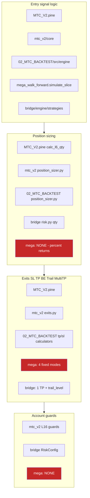

Red boxes: where the **promotion-deciding engine** has no equivalent of the production control.

---

# 5. Target architecture

## 5.1 Governing principles

1. **One kernel, many hosts.** Strategy economics live in exactly one Python package. Backtest, shadow, paper and live all *import* it. **A strategy-lifecycle rule not in the kernel does not exist** — account-level portfolio policy, allocation policy and execution-integrity rules deliberately live outside the kernel and are governed by §4.2.
2. **Intent is data, not code.** The kernel emits versioned intents. Every other layer consumes that data. This makes parity testable instead of aspirational.
3. **Strategies request risk; the portfolio allocates capital.** A strategy owns its risk appetite. It does not own a share of a shared account. *(New — C-7.)*
4. **Execution never invents economics.** The Bridge may reject, delay, or fail closed. It may never substitute a different quantity, stop, or target.
5. **The portfolio may refuse, not reshape.** In V2 the Guardian authorizes or rejects. Any future resizing is a versioned, backtested allocation policy — never a runtime adjustment. **[OWNER — Q16]**
6. **Anything that changes economics at runtime must be simulated identically.** Corollary, and the reason two Antigravity sub-rules are rejected (§12.3): transport health and correlation may **block**, never silently resize.
7. **Two trust domains.** Research holds no credentials. Execution is small, audited and authenticated. One owner-facing entry point is permitted; one process is not.
8. **Every no-trade state carries a machine-readable reason.** A blocked system and a quiet market must never look the same.
9. **Freeze by hash.** A promotable candidate is a content-addressed package. Different hash, different candidate, different evidence clock.

## 5.2 Target component diagram

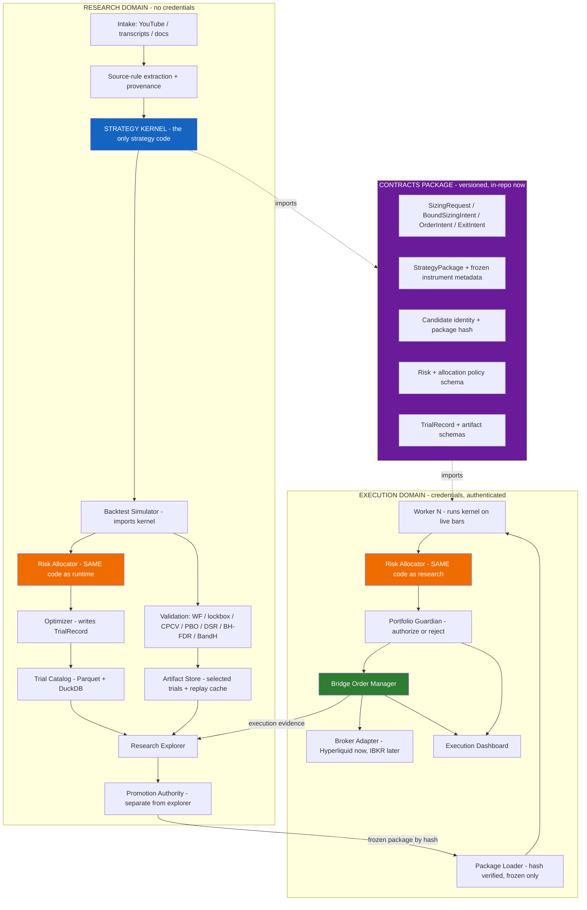

The two orange boxes are **the same code**. That is the mechanism, not a wish.

## 5.3 Strategy Kernel — reduced mandatory core

**[C-11]** The mandatory surface shrinks from ~50 config keys to **~30**. Nothing is deleted; capability moves from *always present* to *available when enabled*.

```
strategy_kernel/
  core/                          # MANDATORY - every strategy carries this
    types.py                     # Bar, Position, SizingRequest, OrderIntent, ExitIntent
    instrument.py                # FROZEN metadata: tick, lot, min_qty, min_notional, multiplier
    sizing.py                    # emits SizingRequest - ONE implementation
    stops.py                     # exactly one stop concept (ATR / percent / swing)
    targets.py                   # exactly one target concept (ATR / percent / R)
    lifecycle.py                 # single-position state machine, opposite-signal exit
    identity.py                  # candidate_id, package_hash, versions, provenance
    kernel.py                    # on_bar(bars, position, config) -> list[Intent]
  modules/                       # OPTIONAL, default OFF, individually testable
    targets_multi/               # Multi-TP: TP1 fraction + TP2 remainder
    breakeven/
    trailing/
    time_exits/                  # bars / EOD / EOW
    pyramiding/                  # adds, basket state, merge_pyramid_stop
    flip/                        # reversal behaviour
    filter_block_exits/          # the 9 toggles
    behaviour/                   # max trades/day, bar cooldown, equity-curve filter, MAE guard
    filters/                     # the 14 entry-filter families
    transforms/                  # confirmation, L18b, level retest
  signals/                       # producers: supertrend, range filter, keltner, research producers
```

**The rule that makes modules safe:** *if enabled, the exact same module code runs historically and at runtime.* Optional never means unsimulated.

**Why sizing, one stop and one target stay in core:** `RISK_AT_STOP` sizing is undefined without a stop, and a lifecycle with no target concept cannot express the most common source rule. Everything else genuinely can be a module.

## 5.4 Intent contracts

Three schemas, all versioned, all in the contracts package.

**Repaired 2026-08-22 (§0.6 R3).** v2.1 had a single `SizingIntent` that was described as pure kernel output while carrying a bound `snapshot_id` and a `snapshot_taken_at`. A kernel defined as `Bars + config → intent` with **no I/O** cannot know an account snapshot, so the contract contradicted the layer definition and made K an account authority by the back door. The contract is now **two messages across three owners**.

**`SizingRequest` — emitted by K. Snapshot-independent. Contains no account state and no executable quantity.**

**The distinction this contract turns on, stated before the fields (completed in the R1 correction pass).** Earlier wording said the message "contains no quantity and no notional" while the same table defined `qty_request` and `notional_request`, and acceptance criterion **A-10c** required the schema to reject "a quantity or a notional result" — which would have rejected the very fields `FIXED_QTY` and `FIXED_NOTIONAL` require. Two different things were being called by one word:

- A **request value** is a **snapshot-independent, untrusted constant read out of the frozen strategy/package configuration**. It contains no account state, it is not derived from anything the kernel looked up, and it is **never** an executable, proposed, authorized or final quantity. `requested_fixed_qty`, `requested_fixed_notional` and `requested_risk_fraction` are request values, and K is **required** to emit exactly one of them for the matching method.
- An **account-derived, allocator-proposed, Guardian-authorized or executable** quantity or notional is something else entirely. K may **never** emit one, and may never read or bind account or bucket state to produce one.

**The schema rejects the second class and requires the first.** *(Names may vary in the contracts package as long as they vary consistently and preserve the `requested_…` prefix that marks the class.)*

**The second distinction this contract turns on — method versus provenance, completed in the R2 correction pass.** The R1 form left the contract unsatisfiable in a different way: `sizing_method` listed `SOURCE_DEFINED` as a fifth runtime value requiring a `source_defined_request` field, while the normative rule below (§5.5) and A-10c both say a source-defined rule is **compiled at package freeze into one of the four native request forms**, and that the **compiled native form is what K emits**. A method that is always compiled away before runtime cannot also be a runtime discriminant, and the field it required was never defined anywhere. **One rule now holds everywhere:**

- **`sizing_method` has exactly four executable, normalized values — `RISK_AT_STOP`, `FIXED_QTY`, `FIXED_NOTIONAL`, `VOLATILITY_TARGET`.** There is no fifth runtime method.
- **`SOURCE_DEFINED` is a source/provenance classification recorded at package freeze**, not a runtime discriminant and not a licence to carry an arbitrary runtime field. It records *where the sizing rule came from*, never *how a quantity is computed*.
- A source-defined rule that **can** be normalized is compiled at freeze into one of the four native methods. The frozen package records `sizing_source_class = SOURCE_DEFINED` together with the **source-rule provenance and identity** (which extracted source rule was compiled), the **compiled `sizing_method`**, **that method's matching request constant**, and the **package and kernel identity already carried in the provenance group** (`package_hash`, `kernel_version`) under which the compilation was performed — which is what makes the compilation reproducible. **This path records no substitute-catalogue entry and requires none:** the versioned catalogue of §6.2 exists for a **missing** rule, and a rule that normalizes is not missing. K then emits that native method and **that method's matching request field**, exactly as if the rule had been declared natively.
- A source-defined rule that **cannot** be normalized without account state **does not freeze**. It is recorded `NOT_EXPRESSIBLE` in the Missing-Rule Ledger (§6.2), and that ledger entry names the **substitute-catalogue entry and version** (`substitute`, `substitute_catalogue_version`) used for the fallback; the candidate then takes that **named catalogue substitute**, which itself compiles to one of the four native methods. **This is the only path on which a substitute-catalogue entry is recorded or required.**
- **The undefined `source_defined_request` field is removed.** It named a runtime shape that the compile-at-freeze rule makes impossible, so nothing can emit it and no test could have accepted it.

**This adds no sizing capability.** It removes a contradiction: every runtime path that existed before is still expressible, because it was always one of the four.

| Group | Fields |
|---|---|
| Method | `sizing_method` ∈ {`RISK_AT_STOP`, `FIXED_NOTIONAL`, `FIXED_QTY`, `VOLATILITY_TARGET`} — **four executable normalized methods, and no fifth.** A source-defined rule arrives here already compiled into one of these (see the provenance row) |
| **Request value** — one, matching `sizing_method`, **from the frozen strategy/package configuration** | `requested_risk_fraction` \| `requested_fixed_notional` \| `requested_fixed_qty` \| `vol_target_params` — **exactly one, matching `sizing_method`**. All are **untrusted constants**: the schema asserts their class, and RA validates and may reject them |
| Basis | `stop_price` (**required** for `RISK_AT_STOP`), `entry_reference_price`, `direction` |
| Provenance | `instrument_metadata_hash`, `kernel_version`, `package_hash`, `decision_bar_ts`, **`sizing_source_class` ∈ {`NATIVE_DECLARED`, `SOURCE_DEFINED`}** — **provenance only.** It records that the compiled method and request constant were derived from the source's own rule at freeze; **no component may branch on it, and it never selects, alters or overrides `sizing_method` or the request value.** A `SOURCE_DEFINED` request is resolved by RA exactly as the identical `NATIVE_DECLARED` request is |
| **Forbidden by schema** | `snapshot_id`, `account_equity`, `bucket_capital`, `allocation_policy_version`, `proposed_qty`, `authorized_qty`, `final_qty`, `notional_result`, and any other **account-derived, allocator-proposed, Guardian-authorized or executable** quantity or notional — **a `SizingRequest` carrying any of these is rejected by the contract test, not merely discouraged.** The `requested_…` fields above are **not** in this class and are **not** rejected |

**`BoundSizingIntent` — produced by the Decision Orchestrator (OR). This is the message RA consumes.**

| Group | Fields |
|---|---|
| Payload | The complete, unmodified `SizingRequest`. **OR may not alter a single field of it** |
| **Snapshot binding** | **`snapshot_id`** — content hash of the immutable `AccountSnapshot` (§5.5); **`snapshot_taken_at`**; **`snapshot_deadline_ms`** — the per-worker freshness deadline declared in the frozen package |
| Policy binding | **`allocation_policy_version`**, `bucket_id`, `deployment_identity_hash` (§6.7) |
| Reference | **`allocator_reference_qty`** *(optional; replay, parity and audit only)* — produced by calling **the one shared Risk Allocator function** against this bound snapshot, never by a second sizing implementation. **It is absent from production intents and is never read by the submission path.** *(Renamed from `kernel_reference_qty` in the 2026-08-22 second round — §0.3 item 5 — and moved off the kernel message here, because computing it requires the snapshot the kernel is forbidden to see.)* |

**`OrderIntent` — produced by RA + P, consumed by B.**

| Group | Fields |
|---|---|
| Identity | `intent_id` (deterministic: `candidate_id + bar_ts + seq`), `candidate_id`, `package_hash`, `worker_id`, `revision` |
| Timing | `decision_bar_ts`, `emitted_at`, `valid_until_bar_ts` |
| Economics | `action` ∈ {`OPEN`,`ADD`,`REDUCE`,`CLOSE`,`MODIFY_STOP`,`MODIFY_TARGET`}, `direction`, `authorized_qty`, `qty_semantics` ∈ {**`DELTA`**, **`TARGET_TOTAL`**}, `qty_unit` ∈ {base, quote, contracts} |
| Authorization | `authorization` ∈ {`AUTHORIZED_AS_REQUESTED`, `REJECTED`}; **V2 has no `RESIZED` value** (Q16). `allocation_policy_version`, `snapshot_id` (must equal the `BoundSizingIntent` value), `deployment_identity_hash`, `rejection_reason` ∈ {`SNAPSHOT_MISMATCH`, `SNAPSHOT_STALE`, `REFERENCE_DIVERGENCE`, `BUCKET_LIMIT`, `CORRELATED_EXPOSURE`, `EXPOSURE_LIMIT`, …} |
| Protection | `stop_price`, `stop_semantics` ∈ {**`STRATEGY_NATIVE`**, `STRATEGY_SYNTHETIC_PLUS_EMERGENCY_NATIVE`}; `tp_legs[]` each `{leg_id, price, qty_fraction, activation, oco_group}` |
| Reasons | `entry_reason`, `exit_reason`, `blocked_by[]` |

**[OWNER — Q7]** V2 sets `stop_semantics = STRATEGY_NATIVE`: the strategy's stop **is** the live reduce-only exchange order. It protects the position when the process or VPS is unavailable, and it is the simplest thing to reconcile.

**Where each half of that claim is proven (§0.4 RF-T2-3).** The **contract and its semantics belong to V2A** and stay there: placement, amendment and cancellation of a native reduce-only stop, and the identical backtest model of a continuously active protective order. But V2A's defining property is **zero orders and no venue contact**, so V2A proves the survival property **locally only** — against a deterministic adapter-emulator or replay, with a local process-kill/restart harness in which the emulator retains the protective order while the worker dies, using **no credentials and contacting no venue**. The claim "protection survives the process or VPS being unavailable **at a real exchange**" is proven in **V2B on testnet (WP-V2B-07)**, under the testnet gate. Neither proof substitutes for the other.

**[C-19]** `tp_legs[]` exists in the contract from V2. V2 *executes* a single leg end to end. Multi-leg execution is a V3 acceptance item.

`qty_semantics` and `stop_semantics` are the two fields most commonly assumed rather than stated, and both have cost real money in other systems. Both are mandatory and both are asserted in tests.

## 5.5 Sizing ownership — the change that makes multi-strategy safe

**The v1 model (superseded):** kernel computes final quantity; portfolio may scale it down.
**The v2 model [OWNER — Q1, Q16]:**

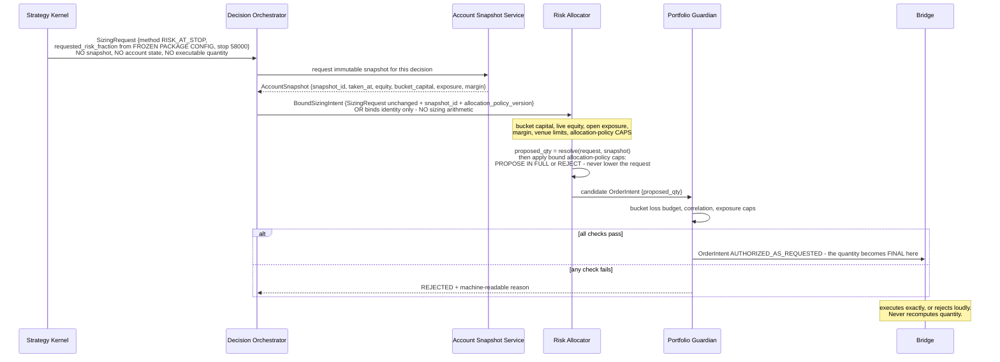

### The four stages, and who owns each

**Repaired 2026-08-22 (§0.6 R3).** v2.1 said in one place that K is pure `Bars + config` and in another that K binds an account snapshot and emits a sizing intent from which a quantity follows. Both cannot be true. The stages below remove the contradiction by naming a fourth owner — the **Decision Orchestrator** — for the responsibility that previously had none.

| Stage | Owner | Input | Output | Explicitly may not |
|---|---|---|---|---|
| **1 — Request** | **K (Strategy Kernel)** | Bars + frozen config + frozen instrument metadata. **No I/O, no account state** | **`SizingRequest`** — method, **one untrusted request constant from the frozen package**, stop, entry reference, provenance | Read or bind account or bucket state; emit any **account-derived, allocator-proposed, Guardian-authorized or executable** quantity or notional; emit an equity or leverage figure; know which bucket or account it will trade. *(Emitting `requested_fixed_qty` / `requested_fixed_notional` / `requested_risk_fraction` from the frozen configuration is **required**, not forbidden — they are request constants, not results.)* |
| **2 — Bind** | **OR (Decision Orchestrator)** | K's `SizingRequest`, verbatim | **`BoundSizingIntent`** — the request plus `snapshot_id`, `snapshot_taken_at`, `snapshot_deadline_ms`, `allocation_policy_version`, `bucket_id`, `deployment_identity_hash` | Alter any field of the `SizingRequest`; perform sizing arithmetic; hold strategy logic; choose a snapshot after seeing what quantity it would produce |
| **3 — Propose** | **RA (Risk Allocator)** | `BoundSizingIntent` + the named immutable snapshot | **`proposed_qty`** — the **only** quantity computation in the system — deterministic, versioned, **one implementation**, identical code in backtest and runtime, with the **bound allocation-policy caps applied as propose-in-full-or-reject** | Change the strategy's request; **lower a request to fit a cap** (a cap breach rejects); propose a partial quantity; recompute against a different snapshot |
| **4 — Authorize** | **P (Portfolio Guardian)** | The candidate `OrderIntent` carrying `proposed_qty` | **`AuthorizedQuantity`** — authorize in full or reject in full. **The final executable quantity does not exist before this stage completes** | Produce a different number; partially authorize; resize |

**Then, and only then, B executes exactly or rejects loudly.** A quantity that has not passed stage 4 has no executable status anywhere in the system, and no component may act on `proposed_qty` as though it were final.

### Method semantics, without making K an account authority

Each method is stated as **what K requests** and **what RA resolves**. In every case K emits a **snapshot-independent, untrusted request constant taken from the frozen strategy/package configuration**, and RA resolves it against the bound snapshot and then applies the **bound allocation-policy caps** — so K never needs to know the account, and the allocation policy never has to be inside the kernel's message.

**Where the number in the request comes from — corrected in the R1 correction pass.** Earlier text made K emit `risk_request_pct` while also saying the value was the one *"the allocation policy assigns"* and *"resolved at stage 2/3"*. Both cannot be true, and it made K a downstream reader of a policy it is forbidden to see. **The numeric request comes from the frozen strategy/package configuration, for every method including `RISK_AT_STOP`.** The **allocation policy contributes caps, not the request**: RA applies the bound policy's caps to the request and either proposes the requested economic result **in full** or **rejects**. Because **V2 has no resize path**, a cap breach **rejects** — it never silently lowers the request. **No numeric default for any request field is introduced anywhere in this document.**

| `sizing_method` | What **K** requests (snapshot-independent constant from the frozen package) | What **RA** resolves, then caps |
|---|---|---|
| **`RISK_AT_STOP`** | `requested_risk_fraction` — a **fraction declared in the frozen strategy/package configuration**, plus a **required** `stop_price` and `entry_reference_price`. **It is not read from, and not assigned by, the allocation policy** | `risk_capital = bucket_capital × requested_risk_fraction`; `per_unit_risk = |entry − stop| × contract_multiplier`; `proposed_qty = risk_capital / per_unit_risk`, then precision, `min_qty` and `min_notional` from the **frozen package metadata**. RA then applies the **bound allocation-policy caps** (risk-at-stop ceiling, leverage, exposure) and **either proposes the requested economic result in full or rejects** — a cap breach is `REJECTED`, never a quietly smaller order. **`per_unit_risk == 0` is a rejection, never a division** |
| **`FIXED_QTY`** | `requested_fixed_qty` in **instrument units**, declared in the frozen package — a *strategy-relative* constant, not an account allocation | Validates it against precision, `min_qty`, `min_notional`, then the bound allocation-policy caps. **RA may reject it; RA may not scale it.** If a cap binds, the outcome is `REJECTED`, not a smaller order |
| **`FIXED_NOTIONAL`** | `requested_fixed_notional` in **quote currency**, declared in the frozen package | `proposed_qty = requested_fixed_notional / (entry_reference_price × contract_multiplier)`, then the same rounding and cap checks. Same rule: **reject, never scale** |
| **`VOLATILITY_TARGET`** | `vol_target_params` — target volatility and the estimator, both declared in the frozen package and computed by K **from bars only** | Converts K's volatility-scaled exposure fraction into a quantity against bucket capital, then the same rounding and cap checks, with the same reject-never-scale rule |

**The invariant across all four:** K emits an **untrusted request constant** from the frozen package; **OR binds the immutable snapshot and the policy identity and performs no sizing arithmetic**; **RA is the only component that computes `proposed_qty`**, applying the bound allocation-policy caps and proposing in full or rejecting; **P authorizes that number unchanged or rejects it**. **No method gives K an account figure, no method lets OR compute, and no method gives RA a discretionary trim.**

### Source-defined sizing is a freeze-time classification, not a fifth method

**Stated once, and identically in §5.4, §6.2, A-10c, the contracts package (WP-P0-04) and the runtime wiring gate (WP-V2A-03) — completed in the R2 correction pass.** The R1 form listed `SOURCE_DEFINED` as a fifth `sizing_method` requiring a `source_defined_request` field, while stating in the same breath that a source-defined rule is compiled at freeze into one of the four native forms and that the compiled form is what K emits. Both cannot be true, and the field was never defined. The coherent rule:

1. **There are four executable methods and no fifth.** `sizing_method` ∈ {`RISK_AT_STOP`, `FIXED_QTY`, `FIXED_NOTIONAL`, `VOLATILITY_TARGET`}. Everything K can request, RA can resolve and P can authorize is one of these.
2. **`SOURCE_DEFINED` classifies the *source* of the rule, at package freeze.** It is recorded as `sizing_source_class` (§5.4) alongside the **source-rule provenance and identity**, the compiled `sizing_method`, the request constant that compilation produced, and the **package and kernel identity already in the provenance group** (`package_hash`, `kernel_version`) needed to reproduce that compilation. **It records no substitute-catalogue entry** — the versioned substitute catalogue (§6.2) belongs to the `NOT_EXPRESSIBLE` path in item 4, and a directly normalizable source rule has no entry there. It is **provenance carried for audit and lineage**; nothing branches on it, and it never reaches RA as an instruction.
3. **Normalizable → compiled.** A source rule expressible without account state compiles at freeze into exactly one native method and emits **that method's matching request field**. From that point it is indistinguishable, to OR, RA, P and B, from a natively declared request — which is the property that makes it safe.
4. **Not normalizable → `NOT_EXPRESSIBLE`.** A source rule that cannot be written down without reading account state **fails to freeze**. It is recorded `NOT_EXPRESSIBLE` in the Missing-Rule Ledger (§6.2), and that ledger entry names the **substitute-catalogue entry and version** used; the candidate proceeds on that **named catalogue substitute**, which is itself one of the four native methods with its own request constant. **This is the only path that requires a substitute-catalogue entry.** The gap travels with the candidate; it is never closed by letting K look at the account.
5. **No account-aware sizing ever runs inside K.** No source expression is evaluated at decision time, in any environment, for either path.
6. **The compiled request is capped like any other.** When a bound allocation-policy cap binds, a compiled source-defined request is **rejected, not scaled** — the same reject-never-scale rule as the four native methods, because it *is* one of them.

**Nothing here is new sizing capability.** Every economically expressible source rule that could be carried before is still carried, by the same four methods; what is removed is an undefined runtime field and a runtime discriminant that the freeze rule had already made impossible.

**Reading the `SizingRequest` in that diagram.** The request field carries a **value declared in the frozen strategy/package configuration**, deliberately shown without a literal percentage, because **this document sets no vNext or `LIMITED_LIVE` risk-at-stop value and introduces no numeric default**. The **0.5 % / 1.0 %** figures in finding **F-2** (§2) are **current-state evidence of today's divergence** — observations of what the existing MTC and Bridge code already do — and are **not proposed vNext defaults**; nothing may be promoted from that evidence into a policy value. The requested risk-at-stop fraction is also **a different quantity from the `LIMITED_LIVE` ≤ 1 % ceiling**: that 1 % is the **maximum capital allocated** to the first live strategy, whereas this field governs **loss-at-stop (risk-to-stop)**, which carries a **separate and lower cap that remains undefined and must be defined and evidenced before any live authorization** (owner clarification D-07, §0.5). Nothing in this example may be read as proposing a value for either cap; the example's purpose is only to show that **K states an untrusted request constant — which may be `requested_fixed_qty` — and, where applicable, a stop; K never states an account-derived, allocator-proposed, Guardian-authorized or executable quantity**.

### The ownership words, defined exactly

**Correction applied in v2.1 (RF-4), extended 2026-08-22 (§0.6 R3).** v2.0 left "requested" ambiguous and made the reference-quantity check a *test-only* tripwire. A test does not fail closed in production. v2.1 then defined three roles, but gave K the snapshot binding — which contradicted K's own definition. **Four roles are now defined so that only one component ever proposes a number, and the component that binds the snapshot is not the component that computes anything.**

| Component | Owns | Never does |
|---|---|---|
| **Kernel (K)** | **Requests.** Emits `SizingRequest`: method, **one untrusted request constant read from the frozen strategy/package configuration**, stop, entry reference, provenance. **It reads and binds no account or bucket state, and the constant it emits is never an executable, proposed, authorized or final quantity.** | Read or bind account or bucket state; emit an account-derived, allocator-proposed, Guardian-authorized or executable quantity or notional; carry `snapshot_id` or `allocation_policy_version` |
| **Decision Orchestrator (OR)** | **Binds** the request to exactly one immutable `AccountSnapshot` and one `allocation_policy_version`, producing `BoundSizingIntent`. **It binds identity; it performs no sizing arithmetic of any kind.** | Alter the request; compute, adjust or validate a quantity; retry against a second snapshot to obtain a different answer |
| **Risk Allocator (RA)** | **Computes and proposes the quantity — the only component that does.** `proposed_qty = resolve(request, snapshot)`, then the **bound allocation-policy caps** applied as propose-in-full-or-reject — deterministic, versioned, **one implementation**, identical code in backtest and runtime. | Change the strategy's request; lower a request to fit a cap; propose a partial quantity |
| **Portfolio Guardian (P)** | **Authorizes the quantity RA proposed, unchanged, or rejects it.** **`AuthorizedQuantity` is created here and nowhere else.** | Produce a different number; compute a quantity of its own |
| **Bridge (B)** | **Executes or rejects** the authorized intent, exactly. | Recompute a quantity |

"Authorize in full or reject in full" therefore means: **P authorizes the quantity RA proposed** — never a quantity K proposed, because K never proposes one, and never a quantity OR proposed, because OR computes nothing.

### Snapshot identity — producer, freshness owner, and the fail-closed rule

The **bound intent** and the **RA computation** must name **the same immutable account snapshot**, or the intent is refused.

```
AccountSnapshot
  snapshot_id            : content hash of the fields below
  taken_at               : bar-close timestamp
  account_equity
  bucket_id + bucket_capital
  open_exposure
  margin_state
  instrument_metadata_hash
```

**Who produces it, and who owns freshness — named 2026-08-22 (§0.6 R3), because "the snapshot" previously had no owner.**

| Responsibility | Owner | Rule |
|---|---|---|
| **Producing the snapshot** | The **Account Snapshot Service** in the **execution domain**, built on the Bridge's existing authoritative risk snapshot (`IBKR_PAPER_BRIDGE/docs/27_AUTHORITATIVE_RISK_SNAPSHOT_CONTRACT.md`) rather than a second source of account truth. **The research domain never produces one** — it has no credentials and no venue truth. In backtest and replay the `PortfolioSimulator` produces it from simulated state **through the same type and the same hash function** | One snapshot per decision, immutable once taken, content-addressed by `snapshot_id` |
| **Declaring the freshness deadline** | The **frozen strategy package**, as `snapshot_deadline_ms` per worker. It is package data, not a global constant, because a 1 D strategy and a 15 m strategy do not have the same tolerance | The deadline is bound by `runtime_policy_json` **inside `deployment_identity_hash`** (§6.7), so changing it mints a **new composite identity and resets that environment's evidence clock**, even though `package_hash` itself is unchanged. *(Corrected in the R1 correction pass: earlier wording placed `snapshot_deadline_ms` inside `package_hash`, contradicting §6.7's own component list.)* |
| **Enforcing the deadline** | **RA, at the moment it computes** — not OR at the moment it binds. Binding and computing can be separated by a queue, a retry or a restart, and only the enforcing side sees the real age | Age is measured from `snapshot_taken_at` to the RA computation instant |
| **Fail-closed behaviour** | **RA rejects and nothing is submitted.** There is no degraded mode, no "use the last good snapshot", and no automatic re-request that would let the system retry until it gets a snapshot it likes | Reject, surface, stop |

**Binding rules:**

1. **One snapshot per decision.** `BoundSizingIntent.snapshot_id` and the RA computation must carry the **identical** `snapshot_id`. The snapshot is immutable once taken.
2. **Mismatch is a runtime STOP, not a test failure.** If `BoundSizingIntent.snapshot_id != RA.snapshot_id`, the intent is **REJECTED** with machine-readable reason `SNAPSHOT_MISMATCH`, logged, surfaced on the dashboard, and **no order is submitted**. It is never reconciled by preferring one side.
3. **Staleness is also a STOP.** If `now − snapshot_taken_at > snapshot_deadline_ms` at the moment RA computes, reject with `SNAPSHOT_STALE`. **No snapshot at all is the same outcome**, with reason `SNAPSHOT_UNAVAILABLE`: absence of account truth is never treated as permission.
4. **Divergence within one snapshot is a defect, not a policy.** With `snapshot_id`, `allocation_policy_version` and allocator code hash equal, a **deterministic recomputation of the same allocator function** must reproduce `proposed_qty` within a stated tolerance. It does not compare against a second sizing implementation — none exists. Divergence rejects with `REFERENCE_DIVERGENCE` **and** fails the parity test suite. Both, not either.
5. **Different-snapshot operation is not permitted in V2.** Any future design where one stage binds one snapshot and another computes against a second requires its own versioned allocation policy, its own simulation and its own parity evidence — it is not an implementation detail.
6. **No snapshot shopping.** OR obtains **one** snapshot per decision and may not request another because the first produced an unwelcome result. A rejected decision is re-formed on the **next bar** with a fresh snapshot and a new `intent_id`, never retried inside the same bar against a different snapshot.

**Why this matters concretely.** Without rule 2, a risk request bound to a $10,000 account snapshot and an allocator proposal computed against a $5,000 bucket snapshot (0.025 BTC) both satisfy the schema, and the Guardian stamps the result `AUTHORIZED_AS_REQUESTED` — a label that would then be false. That is precisely the class of silent divergence F-2 documents, reintroduced one layer higher. Without rule 6, the same defect returns as a *legal* behaviour: retry until the account looks the way you wanted.

### Four properties that make this safe

1. **The Risk Allocator is one implementation, imported by both the portfolio backtest and the live worker.** If it is not simulated, this design is worse than v1 — the entire force of ChatGPT report 1's objection, satisfied by construction rather than by policy.
2. **V2 has no resize path.** The allocator's V2 policy is *single-strategy pass-through*: allocate the requested risk percentage against the bucket's capital, then authorize in full or reject in full. No discretionary trim exists.

   **Scope of the no-resizing rule — owner clarification, 2026-08-22 (register D-02, §0.5).** This rule governs **new-order sizing**: no component may substitute a different quantity for the one the Risk Allocator proposed. It is **not** a prohibition on a **separately authorized** emergency **reduction or closure of existing exposure**. Such an action, if it is ever built, is a **distinct, explicit, tested safety policy** with a machine-readable reason and its own simulated equivalent — **never silent resizing**, and never a runtime discretionary trim of a new order. **This clarification authorizes neither its implementation nor its use**; the design belongs to the V3 allocation-policy work (§17.3, WP-V3-10) and is the *distinction* recorded as Appendix E **O-11**. **Where it sits among the emergency operations — added 2026-08-22 (§0.6 R8):** an *automatic Guardian* emergency reduction or closure is the **fourth and only unbuilt** of the four emergency operations in §10.2. It is distinct from **DISARM**, from **KILL (cancel-and-latch)** and from an **authenticated operator FLATTEN**, all three of which are existing or planned V2 capabilities and none of which resizes anything. **Nothing in this document authorizes automatic emergency resizing in V2.**
3. **Snapshot identity fails closed at runtime** (rules 1–6 above), and is additionally covered by a **D026 RED/GREEN acceptance case**: a deliberate snapshot-drift and bucket-capital-divergence fixture must be shown RED without the guard and GREEN with it, before the guard counts as evidence.
4. **The Bridge must fail if it computes a quantity while an authorized intent is present.** This is acceptance criterion **A-9** and it is the mechanical guarantee that F-2 cannot recur.

**Migration note.** Today's Bridge originates the quantity (`risk.py:380-381`). During V2 that code path becomes reachable only when **no** authorized intent is present — i.e. never, once workers run kernels. It is not deleted in V2; it is fenced by a test that fails if both paths are live.

---

# 6. Research-to-live lifecycle

## 6.1 Source profiles — replacing "naked"

**[C-8]** v1 called a strategy "naked" after substituting a standard stop. Three reviewers independently objected, correctly: a substituted stop means the result is no longer source-faithful, and attributing its performance to the original idea is a category error.

| Profile | Definition | What it can prove |
|---|---|---|
| **`SOURCE_LITERAL`** | Only rules explicitly present in the source. Missing rules stay `NOT_SPECIFIED`. | If exits are absent, it cannot produce a trade P&L at all — only signal-level evidence. |
| **`SIGNAL_EDGE`** *(evaluation profile, not a strategy)* | Applied when `SOURCE_LITERAL` cannot form a lifecycle. Measures the **signal**: N-bar forward returns, MFE, MAE, directional hit rate, signal frequency, regime behaviour, cost-adjusted directional edge. | Whether the *idea* contains information. |
| **`SOURCE_COMPLETED_BASELINE`** | `SOURCE_LITERAL` + the minimum standardized substitutes needed to make it executable, drawn from the versioned catalogue. | Whether it is tradable at all. |
| **`MTC_ENRICHED`** | Baseline + deliberately enabled optional kernel modules. | Whether enrichment adds anything beyond the idea. |

Comparison chain, with deltas recorded at each step:

```
SIGNAL_EDGE  →  SOURCE_COMPLETED_BASELINE  →  MTC_ENRICHED
```

This finally answers the question the current pipeline cannot: **did the original strategy contain edge, or did our own machinery create most of it?**

## 6.2 The Missing-Rule Ledger

```
missing_rules:
  - rule: STOP_LOSS
    source_says: "not specified in transcript at 14:22"
    substitute: kdef.stop.atr.v1
    substitute_catalogue_version: 1.0.0
    affects_promotion: true
    edge_dependency: UNKNOWN | SOURCE_DEPENDENT | SUBSTITUTE_DEPENDENT
```

Rules:
1. A missing rule is **recorded, never inferred silently**.
2. Substitutes come from a **fixed versioned catalogue** (`kdef.stop.atr.v1`, `kdef.tp.r2.v1`, `kdef.risk.research_policy.v1`, …). A researcher may not invent one per candidate — that is how a source-faithful test quietly becomes a bespoke optimization. **Catalogue identifiers for risk substitutes are deliberately nonnumeric.** Any numeric research-risk value is stated **explicitly in the trial/evaluation artifact** that used it, so the number is auditable per run; it is **research-only** and **never becomes a `LIMITED_LIVE` or vNext policy default**. Live risk-at-stop policy is set solely by the allocation policy under D-07 (§0.5, §5), not by this catalogue.
3. **[C-8] An incomplete source is never auto-rejected.** v1's lifecycle diagram rejected a candidate when `SOURCE_LITERAL` showed no edge. That is wrong: a signal with no exit rules has no P&L to show. Route it to `SIGNAL_EDGE` instead.
4. A candidate whose edge depends on the substitute rather than the source is labelled **`SUBSTITUTE_DEPENDENT`**, with sensitivity reported. Still promotable — the label follows it to production.
5. A missing rule **never** blocks progression to forward shadow. It **does** block live capital until the substitute has its own forward evidence.
6. **A source sizing rule that cannot be normalized is a missing rule, recorded here** *(stated in the R2 correction pass; §5.4, §5.5)*. At package freeze, a source-defined sizing rule either **compiles into one of the four native methods** — `RISK_AT_STOP`, `FIXED_QTY`, `FIXED_NOTIONAL`, `VOLATILITY_TARGET` — with the frozen package recording `sizing_source_class = SOURCE_DEFINED`, the source-rule provenance and identity, the compiled method, the resulting request constant and the package/kernel identity under which it was compiled — **and no entry in this ledger and no substitute-catalogue entry, because a rule that normalizes is not a missing rule**; **or it does not freeze**, is recorded here as `rule: SIZING` with `edge_dependency` and **`NOT_EXPRESSIBLE`**, and the candidate proceeds on a **named catalogue substitute that is itself one of those four native methods**, the ledger entry naming that substitute's **catalogue ID and version** (`substitute`, `substitute_catalogue_version`) — **the only path on which a substitute-catalogue entry is required**. **There is no third outcome, no fifth runtime method, and no account-aware sizing expression evaluated inside the kernel.**

## 6.3 The lifecycle

**Ratified reading — map #54 fold (2026-08-23).** The lifecycle below is now read through the owner-ratified canonical state machine (wayfinder map [#54](https://github.com/bsemaay-tech/mtc-command-center/issues/54), tickets #59–#65; `WAYFINDER_LIFECYCLE_FOLD_2026-08-23.md`): **one pipeline, two named domains, one door.** The **RESEARCH FUNNEL** (`CAPTURED` → `TRIAGED` → `CANDIDATE` → `FROZEN` | `PARKED` | `REJECTED`, with `DECLINED` at triage; every rejection/park/decline re-entry-eligible under §6.9) begins **before candidate creation** — the dead-drop intake folder is replaced by recorded front-door states, and the `CAPTURED`→`TRIAGED` decision applies the owner-gated worthiness checklist (fold §5). `FROZEN` (steps 7/14b) is **the only door** to the **EVIDENCE LADDER** (`SHADOW` → `TESTNET` → `LIVE_CANDIDATE`, automatic bookkeeping → `LIVE` via the signed gate — **the only human signature in the machine** → the §6.9 tail). **Step 17's serial placement is abolished: portfolio-fit is a parallel evidence lane** whose verdict is an input to the live gate (the test's content belongs to the Bridge V2 map; this section fixes only its position). **Step 21 is superseded by the designed post-live tail (§6.9).** The plan vocabulary is the ONLY lifecycle vocabulary: the legacy 7-stage promotion ladder is retired via the fold's one-time mapping table (fold §4), the nine diagnostic labels survive as descriptive tags only (they say WHY, never WHERE), and `MTC_ENGINE_VALIDATED` is dropped as a state. Pre-freeze research artifacts are permanently navigational — no retroactive hash blessing. The diagram is retained as drawn; where it and this banner differ, the banner governs.

```mermaid
flowchart TD
    S1["1 Discovery - YouTube, transcripts, docs"] --> S2["2 Source-rule extraction + provenance"]
    S2 --> S3["3 SOURCE_LITERAL definition + Missing-Rule Ledger"]
    S3 --> DEC0{"Can it form a trade lifecycle?"}
    DEC0 -->|no| SE["3a SIGNAL_EDGE evaluation<br/>N-bar returns, MFE, MAE, hit rate"]
    DEC0 -->|yes| S4["4 Data quality + leakage checks"]
    SE --> DEC1{"Signal carries information?"}
    DEC1 -->|no| REJ["REJECTED - research note, evidence kept"]
    DEC1 -->|yes| S5
    S4 --> S5["5 SOURCE_COMPLETED_BASELINE"]
    S5 --> S6["6 MTC_ENRICHED - optional modules"]
    S6 --> FREEZE1["7 FREEZE baseline/enriched package_hash<br/>strategy semantics frozen - no clock yet"]
    FREEZE1 --> MINT1["7b MINT deployment_identity_hash<br/>allocator, policy, guardian, runtime,<br/>protection, adapter, costs bound<br/>THE FORWARD CLOCK STARTS HERE"]
    MINT1 --> SHADOW["8 FORWARD_SHADOW on THAT composite<br/>live bars, zero orders"]
    FREEZE1 --> S7["9 Optimization - trial identities only<br/>TrialRecord catalog, no promotable package"]
    S7 --> S8["10 Walk-forward folds + lockbox"]
    S8 --> S9["11 Buy-and-hold + excess alpha"]
    S9 --> S10["12 DSR p>=0.95 + BH-FDR"]
    S10 --> S11["13 CPCV / PBO / parameter stability"]
    S11 --> AB{"14 A/B: signal vs baseline vs enriched"}
    AB --> FREEZE2["14b FREEZE each SELECTED optimized package<br/>NEW package_hash - strategy semantics only"]
    FREEZE2 --> MINT2["14b-ii MINT its deployment_identity_hash<br/>NEW composite, NEW clock at zero"]
    MINT2 --> SHADOW2["14c FORWARD_SHADOW on the new composite<br/>the baseline window does NOT transfer"]
    SHADOW --> TPE{"15 TESTNET_PAPER_ELIGIBLE?"}
    SHADOW2 --> TPE
    TPE -->|safety criteria met| TESTNET["16 EXCHANGE_TESTNET execution fleet<br/>real order lifecycle, no real money"]
    TESTNET --> S12["17 Multi-strategy portfolio test"]
    S12 --> LC["18 LIVE_CANDIDATE - full statistics complete<br/>+ accepted family/human-observation leakage record"]
    LC --> GATE["19 Signed live gate - owner<br/>ALL FOURTEEN preconditions, one dated decision,<br/>bound to the exact deployment_identity_hash"]
    GATE --> LL["20 LIMITED_LIVE - 1 strategy<br/>&lt;=1% of account as MAXIMUM ALLOCATED CAPITAL<br/>separate LOWER loss-at-stop cap: UNSET - blocks live authorization"]
    LL --> S16["21 Scale up / suspend / retire"]
    style SE fill:#ef6c00,color:#fff
    style FREEZE1 fill:#6a1b9a,color:#fff
    style FREEZE2 fill:#6a1b9a,color:#fff
    style MINT1 fill:#4527a0,color:#fff
    style MINT2 fill:#4527a0,color:#fff
    style SHADOW fill:#2e7d32,color:#fff
    style SHADOW2 fill:#2e7d32,color:#fff
    style TESTNET fill:#2e7d32,color:#fff
    style GATE fill:#c62828,color:#fff
```

**Step 16 read exactly (D-01; named in the R2 correction pass).** The rung the owner states as *"paper/testnet"* (O-18) is **two environments, not one**, and the diagram's testnet node is only half of it. **`INTERNAL_PAPER` and `EXCHANGE_TESTNET` are both carried by `WP-V2B-07`, as two strictly separate evidence lanes** — separate identities, clocks, trade counters, artifacts and claims — satisfying live-gate preconditions **4** and **5** respectively (§6.4, F-16 rule 6). **Neither substitutes for the other**, and running one does not advance the other's clock. **No requirement, safeguard or work package was added to say this**, and neither environment is run or authorized by this document.

**Step 20 read exactly (owner clarification D-07, §0.5).** The **≤ 1 %** at `LIMITED_LIVE` is the **maximum capital allocated** to that single strategy. It is **not** a loss budget and **no loss budget may be inferred from it**. **Loss-at-stop (risk-to-stop) carries a separate and LOWER cap. That cap is UNSET in this document, and it must be defined and evidenced before any live authorization — while it is undefined, step 19 is not signable and step 20 may not begin.** No number is invented for it here.

### The freeze rule, stated without contradiction

**Repaired 2026-08-22 (§0.3 item 3), extended by §0.6 R2 and completed in the R1 correction pass.** Earlier wording implied one freeze that both preceded optimization and survived it. It cannot: optimization changes parameters, and a parameter change mints a new hash (§6.7). A second, subtler error survived that repair: it treated **`package_hash` alone** as the thing that starts an evidence clock. It is not. The corrected rule has four parts and no exception:

1. **The baseline/enriched package freezes early** — step 7. **`package_hash` freezes strategy semantics and is a component of lineage; on its own it starts no acceptance-bearing clock.** It is a legitimate promotable candidate in its own right.
2. **The forward clock starts when the composite identity is minted and admitted** — step 7b. An acceptance-bearing forward clock begins only when the full environment-specific **`deployment_identity_hash`** (§6.7) exists — strategy semantics **plus** allocator, allocation policy, Guardian code and policy, risk-bucket and economic policy, runtime policy, protection semantics, broker adapter and cost lineage — **and** an admission decision for that environment has been issued (§11.5). That composite is what step 8 shadows.
3. **Optimization does not produce a promotable package.** It produces **trial identities** (`trial_id`, `param_hash`, `evaluation_run_hash`) inside the catalog. A trial is an evaluation record, not a deployable artefact, and nothing may be promoted or shadowed directly from a trial row.
4. **Each *selected* optimized configuration is then frozen as a new package** — step 14b — receiving **its own `package_hash`**, and its own **`deployment_identity_hash`** at step 14b-ii, whose clock starts at zero. The baseline's shadow window does **not** transfer to it. **And the same rule runs the other way:** a material change to *any* bound component — the allocator, the allocation policy, a Guardian threshold, `snapshot_deadline_ms`, the broker adapter, the fee schedule — mints a **new composite** and **resets that environment's clock**, with `package_hash` unchanged. Earlier evidence remains readable as history, marked **`PRIOR_IDENTITY`**, and never counts toward a gate.

The calendar win is real but narrower than v2.0 implied: it comes from starting a clock on the *baseline* composite while the statistics run, and from starting each optimized package's clock the moment its composite is minted rather than after the whole battery completes — not from carrying one window across a changing artefact, and not from treating a strategy-only hash as if it were the system that traded.

## 6.4 Four forward environments — never conflated

**[C-9]** These produce different evidence and must be labelled distinctly in every promotion record.

| Environment | What runs | What it proves | What it does NOT prove |
|---|---|---|---|
| **`FORWARD_SHADOW`** | Live market data; kernel evaluates; **zero orders anywhere** | Out-of-sample signal behaviour on unseen bars, in real time | Nothing about fills, latency, rejects, or exchange behaviour |
| **`INTERNAL_PAPER`** | Locally simulated fills (`MockBroker`) | Bridge plumbing, state machine, restart/recovery | **Not** liquidity, slippage, or venue behaviour. Weakest execution evidence. |
| **`EXCHANGE_TESTNET`** | Real order lifecycle against the exchange test environment | Order acceptance, rejects, partial fills, protective-order behaviour, reconnects, reconciliation, backtest-vs-execution divergence | Real-money liquidity and adverse selection |
| **`LIMITED_LIVE`** | Real fills, tiny capital | Everything, at last | — |

### Who carries `INTERNAL_PAPER` and `EXCHANGE_TESTNET` — named in the R2 correction pass

**The distinctness rule above had no named carrier for `INTERNAL_PAPER`.** D-01 requires the four environments to stay distinct, and live-gate preconditions **4** (paper soak) and **5** (testnet proof) are two separate, non-substitutable conditions (F-16) — but no work package was stated to run the canonical paper soak, so the only lane anyone could point at was the testnet fleet. That is exactly the substitution D-01 forbids.

**`WP-V2B-07` is the explicit carrier of both, as two strictly separate evidence lanes.** No new requirement, safeguard or work package is created by saying so, and the existing dependency on WP-V2B-07 is unchanged:

| Lane | Environment | What it produces | Live-gate precondition |
|---|---|---|---|
| **Canonical paper soak** | **`INTERNAL_PAPER`** — locally simulated fills (`MockBroker`) | A **pre-registered plan** with an **immutable start date**; **8–16 weeks minimum**; **≥ 30 new forward trades**; **zero unexplained reconciliation breaks**; and **no restarted window unless a newly approved plan exists** | **4** |
| **Venue proof** | **`EXCHANGE_TESTNET`** — real order lifecycle against the exchange test environment | The existing lifecycle, native-stop, process-kill, break-glass and capacity evidence already specified for this package | **5** (and preconditions 7 and 12 via A-15b-iii) |

**The two lanes never merge.** Separate environment identities, separate clocks, separate trade counters, separate artifacts and separate claims. **Neither substitutes for the other**: a testnet week is not a paper-soak week, a testnet fill is not one of the 30 forward paper trades, and paper plumbing evidence proves nothing about venue behaviour (see the `INTERNAL_PAPER` row above — it is the **weakest execution evidence** in the set). Both are evidenced separately and consumed separately by **WP-V4-01**. **Neither environment is run by this document, and neither is authorized here.**

**Brownfield carrier — map #54 fold (ticket #59).** The `INTERNAL_PAPER` lane's carrier starts from the **existing, tested Bridge soak-window machine** (`bridge/engine/window.py`, RUNNING/DOWN/INTERRUPTED/RESET) and ADDS identity binding (`deployment_identity_hash`, `evidence_window_start`) — it is not built from scratch. **ARM/DISARM/KILL is named as the execution interlock of this environment table**; its mechanics remain the safety map's.

## 6.5 Eligibility states

**Repaired 2026-08-22 (§0.6 R5, R13).** The v2.1 table used unfalsifiable phrases — *"acceptable repaint behaviour"*, *"no catastrophic basic historical failure"* — which cannot be shown RED against a deliberate mutation and therefore cannot be evidence under D026. It also had **no carrier**: no work package produced an eligibility verdict, and nothing recorded one. Both are fixed below. The criteria are carried by **WP-P0-21**; the admission *decisions* are carried by **WP-V2A-10** (see §11.5).

| State | Requirements | Consumes |
|---|---|---|
| **`SHADOW_ELIGIBLE`** | Every check in the falsifiable table below passes: **deterministic replay**, **no unresolved lookahead**, **bounded repaint**, **data quality**, plus a frozen `package_hash` and a frozen `deployment_identity_hash` (§6.7) | Nothing but CPU |
| **`TESTNET_PAPER_ELIGIBLE`** | All of the above **plus**: valid sizing semantics (a `SizingRequest` that RA can resolve for the bound bucket, §5.5); valid protection semantics (`stop_semantics = STRATEGY_NATIVE` with a placeable reduce-only stop); Bridge-compatible lifecycle; reconciliation-safe execution; and the **basic-failure floor** below. **Does not require the full statistical battery.** | Exchange rate limits, reconciliation capacity, operator attention |
| **`LIVE_CANDIDATE`** | Full statistical battery complete (WF, lockbox, CPCV, PBO, DSR ≥ 0.95, BH-FDR, sensitivity) **and** sufficient forward evidence from shadow + testnet on the same **`deployment_identity_hash`** (§6.7) **and** an accepted **family/human-observation leakage record** (§6.6, WP-P0-22) | Owner review |
| **`LIMITED_LIVE_APPROVED`** | Signed live gate; **all fourteen** canonical hard preconditions evidenced in one dated decision against the exact `deployment_identity_hash` (F-16); D-07's two caps both stated and evidenced | Real capital |

### The falsifiable checks that replace the subjective phrases

Each row states the check, the objective threshold, and the **D026 fixture** that must be RED without the check and GREEN with it. **A check with no fixture is not a check.** Where a threshold is currently unset, it is marked `[OPEN]` and **blocks the state until it is set** — it does not default to permissive.

| Check | Objective test | Verdict rule | D026 fixture |
|---|---|---|---|
| **Deterministic replay** | Same bars + same config + same seed, run twice → **byte-identical intent stream hash** (§9.6 test 1) | Any byte difference ⇒ **FAIL** | A deliberate nondeterminism injected into the kernel (unordered iteration or unseeded RNG) must turn the check RED |
| **Lookahead** | **For each decision at bar `t`, re-run the candidate over the prefix ending at and including `t`** — that is, remove only the bars **strictly after `t`**, keeping the decision bar itself — and compare **the intent at `t`** with **the full-series intent at `t`**. *(Corrected in the R1 correction pass: the earlier wording truncated the series **from** the decision bar onwards rather than after it, which deletes the decision bar itself and therefore deletes the decision being tested. A check that removes its own subject cannot be RED for the right reason.)* | Any intent at `t` that differs between the prefix run and the full-series run ⇒ **FAIL, no tolerance** | A fixture strategy that reads `bar[t+1]` must turn the check RED |
| **Repaint** | Re-evaluate every historical bar **as if it were live**, replaying bar-by-bar, and diff the resulting signal series against the vectorized full-history series | **Zero** signal flips on **closed** bars ⇒ PASS. Any flip on a closed bar ⇒ **FAIL**. Flips on the **forming** bar are permitted **only** when the package declares `bar_close_only = true` and the runtime is proven to act on closed bars only. **"Acceptable repaint" is removed as a concept — repaint on a closed bar is never acceptable** | A fixture using a repainting indicator on closed bars must turn the check RED |
| **Data quality** | Per (symbol, timeframe) over the evaluation window: **zero duplicate timestamps**, **zero out-of-order timestamps**, **gap ratio ≤ `[OPEN]` threshold with every gap enumerated**, zero NaN/zero/negative OHLCV values, and a **recorded dataset hash** | Any duplicate or out-of-order bar ⇒ **FAIL**. Gaps above the threshold ⇒ **FAIL**. Threshold unset ⇒ **BLOCKED**, never PASS | A dataset with an injected duplicate bar and an injected 3-bar gap must turn the check RED |
| **Basic-failure floor** *(replaces "no catastrophic basic historical failure")* | Four counted properties over the evaluation window, each with a stated number rather than an adjective: **(a)** trade count ≥ `[OPEN]` minimum; **(b)** no single trade whose loss exceeds `[OPEN]` × the intended risk-at-stop unit — i.e. the stop demonstrably functioned; **(c)** zero simulated events the Bridge cannot express (unrepresentable order types, negative or sub-`min_qty` quantities, stops on the wrong side); **(d)** zero simulated liquidation or margin-call events under the frozen instrument metadata | Any (c) or (d) event ⇒ **FAIL**. (a) or (b) unmet ⇒ **FAIL**. Any threshold unset ⇒ **BLOCKED** | A fixture whose stop is placed on the wrong side of the position, and one whose quantity falls below `min_qty`, must each turn the check RED |
| **Unsimulated controls** | The candidate's enabled controls are compared against what the canonical simulator actually executed (§9.1, WP-P0-20) | Any enabled control that is neither simulated nor listed in `UNSIMULATED_CONTROLS` ⇒ **FAIL**. Any **required** control listed as unsimulated ⇒ **blocks promotion**, though not necessarily shadow | A fixture enabling a control the simulator does not model, with an empty manifest, must turn the check RED |

**Three rules about the verdicts themselves:**

1. **The verdict is a record, not an opinion.** Each check emits a machine-readable result — check id, threshold, measured value, PASS/FAIL/BLOCKED, dataset hash, `deployment_identity_hash`, timestamp — and the set of results is the input to the admission decision in §11.5.
2. **`BLOCKED` is not `FAIL` and is never `PASS`.** An unset threshold, a missing dataset hash or an unavailable check yields `BLOCKED`, which stops the state as firmly as a failure and names what is missing.
3. **A verdict binds to an identity.** Re-running against a different `deployment_identity_hash` produces a new verdict; the old one does not transfer (§6.7).

**[OWNER — Q17] Fleet sizing is capacity-driven, not a fixed number.** Start small and increase the testnet fleet only while exchange rate limits, event processing and reconciliation remain reliable. The binding constraints are measured, not guessed:

- shadow fleet: bounded by CPU and storage — effectively dozens;
- testnet fleet: bounded by exchange rate limits, worker isolation, reconciliation reliability and dashboard legibility;
- live: **one** strategy at ≤ 1 % of account as **maximum capital allocated** — loss-at-stop (risk-to-stop) carries a separate, lower cap that must be defined and evidenced before live authorization **[OWNER — Q11]**.

### Admission mechanics below the live gate — map #54 fold (tickets #61, #62, #63, #65)

**The Environment Admission Authority is an automatic component: automation of APPLICATION, owner control of DEFINITIONS.** There are **zero manual lifecycle transitions below the live gate** — the owner's charting stance at full strength. The rules that make that safe:

1. **Validity of an automatic admission.** An admission decision is valid only when (a) the gate's full check set is **frozen and versioned**; (b) **every check has a proven-can-fail D026 fixture**; (c) missing data or an unset threshold yields **BLOCKED, never PASS** (the doctrine above, reaffirmed); (d) the record names the **`check_set_version`** it applied. An admission missing any of the four is invalid, not merely weak.
2. **Criteria changes are owner-gated; applications never are.** Changing a check set, the slot-ranking rule, or the worthiness checklist is a register-change-control act with the owner's word. Applying them per candidate is the machine's job, forever.
3. **`LIVE_CANDIDATE` is automatic bookkeeping** — declared by the machine when the statistical battery and forward evidence complete; it consumes owner review only at the gate itself.
4. **Notification without bottleneck.** Every automatic admission produces a short plain-language notify-after message plus a dashboard feed entry; no acknowledgment is required; digest mode above an [OPEN] volume threshold. Surface design belongs to the dashboard map.
5. **No veto machinery.** Admissions execute immediately; the owner's standing power to demote or park any candidate (with recorded reason) IS the veto.
6. **Capacity-full produces a record, not silence.** When checks pass but capacity is full, the eligibility verdict is recorded AND an **`ADMISSION_WITHHELD_CAPACITY`** record is appended; the candidate stays at its rung, visibly eligible-and-waiting. When a slot opens, the highest-ranked waiting candidate admits automatically.
7. **Slot ranking: information value.** Family diversity first (the first candidate of an untested family beats another sibling of a family already on testnet), statistical strength second, waiting age as tiebreak; weights [OPEN]; the rule itself is owner-gated (rule 2). **No preemption — windows are sacred**: a running testnet candidate is never evicted; a slot frees only on window completion, failure/suspension/demotion, or an identity change (which revokes admission per §11.5 rule 5).
8. **Shadow is uncapped by policy** — a measured resource guard is the only limiter, and a guard trip produces the withheld-capacity record, never a silent refusal. Capacity figures everywhere are **measured and published, not asserted**: the Bridge V2 map's machinery measures on DL-20's dimensions, the safety map guards degradation thresholds, the lifecycle consumes the figure.
9. **Venue enablement is an infrastructure gate, not a lifecycle state.** Enabling a NEW venue (credentials, adapters, anything order-shaped) is a separate owner-gated act under the standing venue line, owned by the bridge/safety maps; strategy admission to a venue is automatic only once the venue itself is owner-enabled.
10. **Rejection records make "would it pass NOW?" mechanical.** Every `REJECTED` verdict records the failed gate, the `check_set_version`, the `evaluation_run_hash`, each failing check's value against its threshold, and issuer + timestamp. Re-entry is designed, automatic and itself a record — §6.9.
11. **Operator attention is never a required input below live** — only the §6.9 judged-decay page demands it.
12. **Backtest-vs-forward divergence is a standing check (map #67 fold).** Computed continuously per identity against the sim expectation; breach of its owner-gated [OPEN] tolerance **blocks further promotion** for that identity and notifies the owner — never auto-demotes (§9.7).
13. **Lockbox openings are records (map #67 fold).** A lockbox era opens automatically on earned mechanical criteria, always as a lifecycle-ledger record; an opened era is **SPENT** for that family — anything later computed on it is navigational only (§9.7).

## 6.6 Shadow leakage rules — what makes the parallel clock legitimate

**[C-2 — the error v1 made.]** Running shadow in parallel with optimization is only sound if shadow observations cannot influence the strategy being observed. Five binding rules:

1. **Freeze first, then mint the composite.** A `package_hash` is frozen *before* any shadow observation of it is collected, and the environment-specific **`deployment_identity_hash`** is minted before the clock starts (§6.3, §6.7). No exceptions. This applies identically to the early baseline package and to every optimized package selected later — each is frozen, composited and admitted before it is watched.
2. **Timestamp the window.** `evidence_window_start` is recorded when the composite identity is minted; every observation carries it **and the `deployment_identity_hash` it belongs to**.
3. **Never modify a running identity.** Any code, parameter, module or substitute change mints a **new `package_hash`**; any change to the allocator, allocation policy, Guardian policy, risk-bucket or economic policy, runtime policy, protection semantics, broker adapter or cost lineage mints a **new `deployment_identity_hash` with `package_hash` unchanged**. Either way a **new composite and a new clock** exist, the old window does not transfer, and the old window is marked `PRIOR_IDENTITY`.
4. **Mark contaminated data.** Shadow data reviewed by a human or an optimizer during the research phase is labelled `OBSERVED_DURING_RESEARCH` and is **navigational only** — it can never be cited as confirmation.
5. **Only untouched post-freeze periods count.** Confirmation evidence is the portion of the window nobody looked at while decisions were still open.

### Rules 6–8 — family-level and human-observation leakage (added 2026-08-22, §0.6 R6)

**The gap being closed.** Rules 1–5 close leakage **at the level of one package**. Appendix E **O-12** recorded the level above them as a real residual gap and did **not** repair it: observing package A can inform the parameters of sibling package B, and B's freeze then looks clean while its design was shaped by A's forward window. The same applies to a human who watches a family's shadow feed and then chooses which sibling to promote. **That gap is now a blocking control before the first `LIVE_CANDIDATE` decision, with a carrier (WP-P0-22) and objective evidence — it is no longer an acknowledged-but-open item.**

6. **Family lineage is recorded, not inferred.** Every package carries a **`family_id`** derived from its source provenance, producer and parameter neighbourhood — the taxonomy already present in `STRATEGY_RESEARCH_REGISTRY.json` and `TAG_DICTIONARY.json` seeds it (§10.3 mechanism 2). A package with no established `family_id` is `UNKNOWN`, and `UNKNOWN` **blocks** `LIVE_CANDIDATE`; it does not default to "unrelated".
7. **Sibling observation contaminates the sibling.** If any forward observation of package A was **available to the decision** that produced sibling package B — same `family_id`, and A's `evidence_window_start` earlier than B's freeze — then B's forward evidence carries `FAMILY_OBSERVED`, and the contaminated portion is **navigational only**, exactly as rule 4 treats direct observation. The contaminated portion is the intersection of A's observed window with B's evidence window, computed, not estimated.
8. **The untouched window is computed from a ledger, not asserted.** Every human view and every optimizer read of a shadow record appends to an **append-only observation ledger** — who or what, when, which `package_hash`, which `family_id`, which window. Confirmation evidence is the window that the ledger shows nobody read, and **an absent or incomplete ledger yields zero confirmation evidence** rather than a presumption of cleanliness.

**Objective evidence required before the first `LIVE_CANDIDATE`** (WP-P0-22 acceptance): the family lineage graph with every member's `family_id` resolved or explicitly `UNKNOWN`; the observation ledger; the computed untouched window per candidate; and a **D026 fixture** in which a deliberately contaminated sibling — one whose parameters were chosen after its sibling's window was read — is shown **RED** without the control and **GREEN** with it. **Candidate eligibility (WP-V2A-10), Promotion Authority (WP-V3-03) and live admission (WP-V4-01) all depend on this record.** **Succession adds no exception to these rules (map #54 fold, ticket #64):** a challenger produced from incumbent observations carries whatever `FAMILY_OBSERVED` contamination the rule-8 ledger computes, and its confirmation evidence is the post-freeze untouched window — exactly as rules 1, 7 and 8 already state.

## 6.7 Candidate identity and evidence binding

**[C-6, and Antigravity §8 adopted as the hash formula]**

**Identity is split into three levels (repaired 2026-08-22, §0.3 item 4).** v2.0 folded `dataset_manifest_sha` into `package_hash`, which made the *deployable* identity change whenever a *research dataset* changed — so the same shipped strategy had several hashes, and live evidence could not accumulate against one of them.

```
candidate_id        = QLC-<yyyymmdd>-<8 hex of source-provenance hash>   # family lineage, STABLE

package_hash        = SHA256( spec_json                                 # DEPLOYABLE STRATEGY SEMANTICS ONLY
                            ‖ kernel_code_sha
                            ‖ exact_params_json
                            ‖ modules_enabled_json
                            ‖ substitute_catalogue_versions_json
                            ‖ instrument_metadata_json )
                                                                        # what actually runs on live bars

evaluation_run_hash = SHA256( package_hash                              # HOW IT WAS EVALUATED
                            ‖ dataset_manifest_sha
                            ‖ cost_model_json                           # fees, slippage model id, funding
                            ‖ simulator_class + simulator_version
                            ‖ evaluation_config_json )                  # folds, lockbox, seeds,
                                                                        # search regime, preregistered space

trial_id            = <evaluation_run_hash>.<param_hash>.<seq>          # one optimization trial

deployment_identity_hash                                                # THE ECONOMIC / DEPLOYMENT IDENTITY
                    = SHA256( package_hash                              # strategy semantics (above)
                            ‖ allocator_code_sha
                            ‖ allocation_policy_version
                            ‖ guardian_code_sha
                            ‖ guardian_policy_json                      # authorize/reject rules, thresholds
                            ‖ risk_bucket_policy_json                   # bucket capital, caps, session rule
                            ‖ economic_policy_json                      # account guards: daily loss, max DD,
                                                                        #   consecutive-loss, exposure, leverage
                            ‖ runtime_policy_json                       # freshness thresholds, DEGRADED policy,
                                                                        #   snapshot_deadline_ms, worker isolation
                            ‖ protection_semantics_json                 # stop_semantics, reduce-only contract,
                                                                        #   same-bar collision policy
                            ‖ broker_adapter_id + broker_adapter_version
                            ‖ cost_lineage_json )                       # venue fee schedule, funding schedule,
                                                                        #   slippage model id and parameters

run_id              = <deployment_identity_hash>.<environment>.<seq>    # one execution in one environment
```

**Why the composite exists — repaired 2026-08-22 (§0.6 R2).** v2.1 bound forward and live evidence clocks to `package_hash` alone. But `package_hash` deliberately contains **only deployable strategy semantics**, so the allocator, the allocation policy, the Guardian and its thresholds, the risk-bucket and account-guard policy, the runtime freshness policy, the protection semantics, the broker adapter and the cost lineage could **all** change without minting a new identity. Six weeks of testnet evidence gathered under one allocator and one fee schedule would then be presented, unchanged, as evidence for a different economic system. **`deployment_identity_hash` is the thing that actually traded, and it is what forward and live evidence now binds to.**

**The canonical rule, stated once and governing every other statement in this document set.** *(Completed in the R1 correction pass — earlier text still carried package-hash-only clock claims in C-6, §0.3 item 3, the §6.3 lifecycle, DL-25 and Appendix D C2. Each of those is now marked superseded and extended by this rule.)*

1. **`package_hash` freezes strategy semantics and is a component of lineage.** It does **not**, by itself, start or own a forward evidence clock, and no document may say that it does.
2. **An acceptance-bearing forward clock starts only when the full environment-specific `deployment_identity_hash` is minted and admitted** for that environment (§6.3 step 7b / 14b-ii, §11.5).
3. **Economic, forward, promotion and live evidence binds to the composite.** Anything weaker is not acceptance evidence.
4. **Any material change to a bound component mints a new composite and resets that environment's clock.** Earlier evidence remains readable as history, marked **`PRIOR_IDENTITY`**, and never counts toward a gate.
5. **Historical statements are retained only when clearly marked superseded.** Where an older row (C-6, §0.3 item 3, DL-25, Appendix D C2) records what was decided at the time, it stays as history with an explicit pointer here; it is never quoted as the current rule.

`environment` is deliberately **outside** the hash: shadow, internal paper, testnet and limited live are **labels on the evidence**, not different identities. That is what allows one identity's evidence to be compared across environments.

**The binding rules:**

- **Strategy identity is `package_hash`.** It contains nothing about datasets, costs, simulators or evaluation configuration. Two evaluations of the same shipped strategy share it.
- **Evaluation identity is `evaluation_run_hash`.** Every evaluation result — backtest, walk-forward, lockbox, CPCV, DSR/BH-FDR — is reported under it and therefore always names its dataset, cost model, simulator and configuration. A dataset or cost-model change mints a new `evaluation_run_hash`; it does **not** mint a new package.
- **Economic/deployment identity is `deployment_identity_hash`, and it is what forward and live evidence binds to.** Shadow, internal paper, testnet and limited-live evidence belongs to the exact composite, because that is the system that ran. The evidence clock is per composite (§6.3, §6.6).
- **A change to anything inside `package_hash`** — parameters, modules, substitutes, kernel version, instrument metadata — mints a new package **and** therefore a new `deployment_identity_hash` (§6.6 rule 3).
- **A change to any other bound component mints a new `deployment_identity_hash` while leaving `package_hash` unchanged.** This is the case v2.1 could not express, and it is the common one: swapping the allocation policy, retuning a Guardian threshold, changing `snapshot_deadline_ms`, replacing the broker adapter or updating the fee schedule are all material identity changes.
- **A material identity change resets the applicable forward-evidence period.** Shadow, testnet and limited-live windows accumulated under the old composite **do not transfer** to the new one, for every environment whose behaviour the changed component can affect. The old windows remain readable as history and are marked `PRIOR_IDENTITY`; they are never counted toward a gate.
- **Which environments a change affects is declared, not assumed.** Each bound component names the environments its change invalidates — for example, a cost-lineage change invalidates every environment; a Guardian threshold change invalidates every environment in which the Guardian ran; a broker-adapter change invalidates testnet and live but not shadow, which places no orders. **The declaration is part of the component's schema and defaults to "all environments" when unstated.**
- **Six evidence classes bind to the composite:** `TrialRecord` rows (§11.2), deterministic replay artifacts (§11.3), **eligibility verdicts** (§6.5), **environment admission decisions** (§11.5), **promotion decision artifacts** (§11.5) and **rollback records** (§16 M9, WP-V2B-11). An artifact of any of these classes without a `deployment_identity_hash` is unusable as evidence.
- `candidate_id` aggregates packages **for navigation and family-level multiple-testing accounting only**, and `family_id` (§6.6 rule 6) aggregates them for leakage control.
- **What is stamped where:** the promotion decision artifact (§11.5) carries `package_hash`, the `evaluation_run_hash` that justified it, **and** the `deployment_identity_hash`; `OrderIntent`, every fill record and every dashboard log line carry **`package_hash` and `deployment_identity_hash`** — full provenance from intake to live fill, including the policy and adapter that shaped the fill.

Antigravity's formula collapses candidate and package into one identifier. Adopted as the **`package_hash`** definition; `candidate_id` is retained separately, because without it family lineage and cross-package multiple-testing accounting are lost.

## 6.8 Reducing research steps without weakening gates

The acceleration is structural, not a relaxation:

- **Fast screen (hours):** `SOURCE_LITERAL` / `SIGNAL_EDGE` → data and leakage checks → buy-and-hold → `SHADOW_ELIGIBLE`. Deliberately weak statistically; it earns the right to be *watched*, which risks nothing.
- **Freeze the baseline and start its clock.** The *baseline/enriched* package hash is frozen here, not after the statistics. Optimization then produces trial identities only; each **selected** optimized package is frozen separately and starts its **own** clock at zero (§6.3).
- **Slow battery (days, batched overnight):** optimization → WF/lockbox → DSR/BH-FDR → CPCV/PBO → A/B → `LIVE_CANDIDATE`.
- **Testnet runs in parallel** once `TESTNET_PAPER_ELIGIBLE` safety criteria are met — which do **not** include the full statistical battery.

No statistical gate is weakened. The gates simply stop blocking two activities that risk no capital, and F-22 says exactly why that matters: **both discovery and calendar-time forward evidence are scarce, and only one of them can be bought with compute.** Running the slow battery and the forward clock in parallel is what lets the plan work on both at once.
---

## 6.9 The post-live tail, re-entry and succession — ratified macro design (map #54 fold)

Owner-ratified 2026-08-23; full detail in the ticket resolutions ([tail #60](https://github.com/bsemaay-tech/mtc-command-center/issues/60), [re-entry #65](https://github.com/bsemaay-tech/mtc-command-center/issues/65), [succession #64](https://github.com/bsemaay-tech/mtc-command-center/issues/64)); this section is the normative summary. Every number named here is **[OPEN]** by design — unset means BLOCKED, never permissive.

**Suspension — two trigger buckets (applies at every ladder rung).** *Automatic-numeric:* pre-committed values (max daily loss, max total loss, drawdown beyond the backtest-implied distribution) the system enforces alone — breach ⇒ auto-`SUSPENDED` for NEW risk, no click, owner notified after. *Judged-decay:* the ambiguous "broken or drawdown?" case — **the only thing that pages the owner**, always through the written four-mechanism checklist (alpha crowding / regime drift / microstructure change / capacity saturation). `SUSPENDED` = **no new entries, nothing else**: existing positions keep their protective orders; actively closing anything is the safety map's separate **FLATTEN**.

**Resume — asymmetric authority.** Below `LIVE`: auto-resume when the numeric trigger clears. At `LIVE`: every resume is the owner's one-click, always — real money never re-arms itself. Flap escalation everywhere: repeated suspensions within an [OPEN] window stop auto-resuming and page the owner. Suspension time never counts toward any evidence window; the gap is recorded and visible; whether a very long gap invalidates prior evidence carries an [OPEN] threshold.

**Demotion.** Back down the ladder under the SAME `deployment_identity_hash`; the live window ends and stays queryable forever; fresh forward evidence accumulates from the demotion point; going live again requires the full signed gate.

**Retirement.** Terminal for the identity, not the idea: `RETIRED` ends that `deployment_identity_hash` forever. The family re-enters the funnel as a new package only when the owner names, in one sentence, the specific external thing that changed — logged next to the retirement note.

**Re-entry (whole funnel).** `REJECTED`, `DECLINED` and `PARKED` are all re-entry-eligible, never silently resurrected: five trigger classes — new data regime, new kernel version, new substitute catalogue, new enrichment modules, owner curiosity — where the four automatic classes fire on version/coverage changes of named artifacts. A firing trigger re-screens the pool through `SIGNAL_SCREEN_ONLY` (never acceptance-bearing, §6.8); survivors re-enter `CANDIDATE`; **every re-entry is a Registrar-appended record naming its trigger**, with notify-after. Identity per §6.7: `candidate_id` stable, fresh `evaluation_run_hash`, prior evidence never re-counted. The pool is unbounded — no expiry, no size cap, no new states.

**Succession.** The normal machine run twice: a challenger is an ordinary candidate whose family has a live member. Refresh is **triggered-only** (decay signals, demotions, the re-entry trigger classes, owner curiosity — no calendar cadence). The challenger climbs the **full ladder**; the incumbent holds its live slot throughout; the challenger's records name the incumbent `deployment_identity_hash` they challenge (`CHALLENGE` record). **The swap is atomic: one owner signature at the live gate admits the challenger AND closes the incumbent's live window** — never two live members of one family. The replaced incumbent demotes to `SHADOW` as a control by default (forever queryable; the owner may retire it instead). Position wind-down at the swap is the bridge/safety maps' mechanics, not lifecycle.

**Carrier assignment — map #79 fold ([gap disposition #92](https://github.com/bsemaay-tech/mtc-command-center/issues/92)).** New **WP-P0-31 Lifecycle Ledger and Registrar** builds the one append-only ledger, its derived current-state view and the research-side Registrar. The three other settled writers remain separate authorities but use that same append path: WP-V2A-10 for sub-live admissions, WP-V3-03 for promotion/mainnet admission, and WP-V2B-03 for mandatory post-live tail records after the relevant execution interlock acts. This assigns the map-#54 design to packages without changing any lifecycle rule or choosing any `[OPEN]` number.

# 7. MTC_V2 simplification decision

## 7.1 The owner's target, assessed

**[OWNER — Q1, Q5]** approved. Three corrections applied.

| Owner proposal | Verdict | Correction applied in v2 |
|---|---|---|
| Keep a small stable Python kernel with essential reusable position/exit behaviour | **Approved** | The kernel is a **new package that both engines are consolidated into** — not a trimmed copy of either. Consolidation means the semantics move; the old code is frozen as legacy and never deleted (Q5, Q13). Trimming `mtc_v2` alone would leave `02_MTC_BACKTEST/src/engine` alive and you would still have two. |
| Preserve advanced exits/filters/transforms as optional modules | **Approved** | Modules must be **counted and preregistered** — but the count does **not** enter the DSR calculation (C-10, §9.5). |
| Move account/portfolio kill switches to the Guardian | **Approved with a split** | Account-level (daily loss, max DD, consecutive losses, exposure) → Guardian. **Behavioural** limits (max trades/day, bar cooldown, equity-curve filter, MAE guard) stay in the kernel as modules — moving them would silently un-simulate them. |
| Retire unused WunderTrading active-path logic | **Approved — more urgent than framed** | It is not unused; it is a **live, unmonitored order path** (F-8). |
| Freeze the current implementation as legacy reference | **Approved** | Freeze by **git tag + content hash**, not folder rename. Zero tags exist today (F-17), so "frozen" currently has no mechanism. |

## 7.2 Are all current MTC_V2 capabilities still necessary?

Assessment of the ~200 keys in `mtc_v2/core/config.py`, **revised for the reduced core (C-11)**:

| Group | Keys | v1 verdict | **v2 verdict** |
|---|---|---|---|
| Sizing intent, one stop, one target, single-position lifecycle, opposite-signal exit, direction, identity | ~30 | core | **KEEP — mandatory core** |
| Instrument + execution profile | ~12 | core | **KEEP — moves to frozen package metadata** (closes F-2 Gap 3) |
| Multi-TP (`tp1_*`, `tp2_*`) | 3 | core | **MODULE** — contract carries legs from V2; execution V3 |
| Break-even | 3 | core | **MODULE** |
| Trailing | 4 | core | **MODULE** |
| Time exits (bars / EOD / EOW) | 5 | core | **MODULE** |
| Pyramiding / `max_entries` / basket | ~4 | core | **MODULE** |
| Flip / reversal / regime lock | ~3 | core | **MODULE** |
| Filter-block exits | 9 | module | **MODULE** — master toggle documented but unenforced (`config.py:131-135`); fix or delete the comment |
| Entry filters (14 families) | ~55 | module | **MODULE** |
| Transforms (confirm, L18b, level retest) | ~20 | module | **MODULE** |
| Behavioural limits (max trades/day, cooldown, recovery, equity-curve, MAE) | ~14 | split | **MODULE (kernel)** — simulated, never moved to the Guardian |
| Account guards (daily loss, max DD, consecutive losses) | ~6 | Guardian | **GUARDIAN** |
| Candle pattern + level proximity gates | 6 | module | **MODULE** |
| `tw_*` TradingView-parity research knobs | 7 | retire | **DECIDE IN CANONICALIZATION — corrected 2026-08-22 (§0.6 R12).** v2.1 said RETIRE on the strength of the blanket source comment at `config.py:56-57` (*"no runtime impact until semantic owners are implemented"*). **That comment is demonstrably stale for six keys** — `position_sizer.py:22,61-62`, `exits.py:294-298,302,334`, `runner.py:130-133,563,958,1296-1396` (F-8a, §3 D-12). **Those six change quantity rounding, break-even/trailing trigger bars, margin-call handling and re-entry timing**; for those, both branches must be **pinned by the golden suite (WP-P0-10)** and **reproduced by `LEGACY_COMPATIBLE` (WP-P0-11)**, and only `CORRECTED_VNEXT` (WP-P0-12) may change the behaviour. **The seventh, `tw_margin_call_split_entries`, is `[DRIFT/UNKNOWN]` — required and validated, read at `runner.py:133` and stamped at `:1057`, with no located behavioural consumer; the comment's no-impact claim is not yet disproven for this key — and it goes to WP-P0-09 / WP-P0-06 investigation rather than to a two-branch fixture.** All seven remain a **capability decision (WP-P0-09)**. **Not a cleanup, and not a mass deletion.** |
| `wt_*` WunderTrading | 13 | retire | **RETIRE [OWNER — Q3]** — genuinely consumerless in Python (F-8); the live path is the Pine `alert()` emission, removed by **WP-P0-23** under gate G2 |

**Result: mandatory core ≈ 30 keys; optional modules ≈ 130; retired ≈ 13 (`wt_*`), plus 7 `tw_*` keys whose disposition is decided in canonicalization rather than assumed.** A real reduction of the *mandatory* surface with no researched capability lost — and, after the R12 correction, **no economically live capability quietly deleted as cleanup either**.

## 7.3 `02_MTC_BACKTEST` — harvest then freeze

**[OWNER — Q5]** approved: harvest useful components, freeze the duplicate engine as legacy, do not delete.

**Harvest list** (best implementations of these concerns in the repository):

| Component | Path | Lines | Destination |
|---|---|---|---|
| Fee model | `src/engine/fee_model.py` | 347 | Simulator cost layer |
| Precision / rounding | `src/common/precision.py` | 344 | Kernel `instrument.py` |
| Timeframe handling | `src/common/timeframes.py` | 369 | Shared utilities |
| Fill semantics | `src/engine/fills.py` | 556 | Simulator fill layer |

**Do not harvest:** the Streamlit app (a fifth UI surface, coupled to its own engine), `optimizer_v0/search.py` (superseded by the `TrialRecord` contract, §11.1), or `engine/mtc_runner.py` itself.

**[C-6 / ChatGPT 1 §6] Harvesting is not merging.** Before any component moves, a **capability canonicalization table** must be completed for every economically meaningful capability:

| Field | Content |
|---|---|
| Capability | e.g. position sizing |
| Implementation A behaviour | `mtc_v2` semantics, cited to line |
| Implementation B behaviour | `02_MTC_BACKTEST` semantics, cited to line |
| Pine reference behaviour | cited to line |
| Disagreement | exact nature |
| **Desired canonical semantics** | decided, with reasoning |
| Chosen implementation | which code is reused, or "new" |
| Golden fixture | the scenario that pins it |

Order: **define the contract → characterize the old implementations → select semantics → reuse the best code if suitable → test.** Never "blend A and B until the tests pass". The kernel must be a deliberate definition of the trading model, not an accidental synthesis of history.

---

# 8. Pine-versus-Python decision

## 8.1 Verdict

**[OWNER — Q3]** ratified: **Python is canonical; Pine becomes visualization and observational divergence monitoring only, with all order-routing capability removed.**

Supporting evidence, stronger than the input documents stated:

- **Parity status is corpus-dependent and the corpora are not established as comparable** (F-7): 27/58 strict TW=Python on cases 103–162, against 437/439 on the 457-case `mtc_backtest` suite. Whatever the resolution, the current "two authoritative implementations" model has **no single accepted parity record** — and a model that cannot state its own parity in one number is not delivering two agreeing implementations. If the leading hypothesis holds (different Python implementations), the picture is worse for the *kernel*: the engine being retired scores 99.54 %, the one being kept scores 47 %.
- Pine can never be imported by the simulator *and* the live worker. Python can. That is what turns parity from aspiration into structure.
- `MTC_V2.pine:2020,2028` currently emits live order routing (F-8). "TradingView must not become a second controller" is not a principle to state; it is a defect to close.

**Precondition, restated and now satisfied by sequencing.** v1 said Python cannot be *appointed* canonical while `position_sizer.py` disagrees with Pine on `contract_multiplier` and `min_notional`. The two-milestone migration (Q15) resolves this properly: `LEGACY_COMPATIBLE` appoints the kernel while reproducing existing behaviour exactly; `CORRECTED_VNEXT` then closes F-2 Gaps 1–3 as documented, falsification-tested changes under a new semantic version. The defect is neither carried silently nor fixed invisibly.

## 8.2 Complexity, benefits, failure modes

| | Detail |
|---|---|
| **Benefit** | One implementation to test, audit and change. Removes the corpus-dependent parity ambiguity (F-7) from the critical path, along with an entire class of "which one is right" investigations. |
| **Benefit** | Python is importable by simulator, allocator and live worker → structural parity. |
| **Benefit** | An independent implementation that can only *complain* is a cheap, high-quality cross-check. |
| **Complexity** | Generating Pine from a Python spec is a real project (~2–4 weeks) and only pays off across many TradingView-hosted strategies. **[REC]** do not build a generator in V2; hand-maintain Pine for the 1–3 strategies you actually want to see, headed `VISUALIZATION ONLY — NOT A CONTROLLER`. |
| **Failure mode 1** | *Silent divergence.* Pine drifts; you make decisions from a chart that no longer matches production. **Mitigation:** the divergence alarm is a **scheduled comparison with a threshold and a notification**, not a human glancing at a chart. |
| **Failure mode 2** | *Second controller returns.* Someone repopulates the routing fields, or an old copy survives. **Mitigation:** delete the `alert()` **emission**, not merely the codes. A file with no `alert(` cannot route an order regardless of configuration. CI grep guard with an allowlist that is empty by default. |
| **Failure mode 3** | *Loss of an independent oracle.* TradingView's broker emulator is the only place your strategy has been executed by someone else's independent code. **Mitigation:** keep `12_PARITY_PINETS` frozen as a historical oracle corpus and use it as a kernel regression set — read-only, never regenerated. |

## 8.3 De-fanging TradingView — the concrete steps

**[OWNER — Q3]** approved **as a decision**. **This document does not authorize the change** (repaired 2026-08-22, §0.3 item 14).

Removing the Pine `alert()` emissions is a **routing and behaviour change on a protected surface**: it deletes the only live order path that exists outside the Bridge. Q3 settles *what should happen*; it does not settle *that it may be executed now*. Before any edit to `MTC_V2.pine` or `mtc_v2/core/config.py`:

- the change needs its **own T0 authorization from the owner**, naming the exact files and lines;
- it needs its **own audit round and acceptance record**, like any other protected-surface change;
- the freeze tag (step 1) must exist first, so the controller is recoverable;
- and the CI guard (step 6) must be able to fail, proven by a deliberate violation, before it counts as protection.

**The end state, stated before the steps — corrected in the R1 correction pass.** The earlier design removed the `alert()` emissions from a **new visualization copy** while leaving the original `MTC_V2.pine` **unchanged and still active**, and then demanded a whole-repo CI guard with an **empty allowlist**. Those two things cannot both hold: the original still contains `alert(`, so the guard would be RED forever and the package could never pass. Worse, the design's own success condition would have been *"the alert-capable controller is still the maintained active file"* — the opposite of de-fanging.

**The authorized end state is therefore:**

1. **The frozen tag and Git history preserve the original controller, unchanged and recoverable.** Nothing is deleted (Q5, Q13).
2. **The maintained active Pine source is transformed in place into visualization-only Pine.** `MTC_V2.pine` itself is the file that becomes visualization-only — or, if WP-P0-19's accepted design names a different active path, that path instead — but **exactly one maintained active Pine source exists either way**. An alert-capable original is **not** left active under any name.
3. **The two `alert()` emissions and the 13 `wt_*` inputs are removed from that active source.** The 13 consumerless Python `wt_*` keys in `mtc_v2/core/config.py:226-238` remain the **separately named exact scope** the package already approves.
4. **Across the entire active source tree, zero `.pine` files contain `alert(`, under an allowlist that is empty.** That is what makes the guard satisfiable.
5. **Rollback restores the controller from the immutable tag**, walked at least once.

The steps below are the **design** for that change, not a work order:

1. Freeze the current file by tag: `legacy/mtc-v2-pine-controller-2026-08-21`. History preserved per the standing instruction not to delete capability. **This tag is the only place the alert-capable controller continues to exist.**
2. **Transform the maintained active Pine source in place** into visualization-only Pine, headed *"VISUALIZATION ONLY — NOT A CONTROLLER"*. *(Earlier text said "copy to `visualization/MTC_V2_VIEW.pine`" and left the original active. If WP-P0-19's accepted design prefers a renamed active path, the rename is part of the same change — **what may not happen is two maintained active Pine sources, or an active source that still contains `alert(`**.)*
3. **Delete lines 2020 and 2028** (`alert(...)` emissions) **from the active source**, so that no active `.pine` file emits an order alert.
4. Delete the 13 `wt_*` inputs from the active Pine source, and the 13 dead `wt_*` keys from `mtc_v2/core/config.py:226-238`. **These are genuinely consumerless** — grepping `wt_` in `runner.py`, `exits.py` and `results.py` returns nothing (F-8).
5. **The 7 `tw_*` keys are a different case and are NOT part of this change — corrected 2026-08-22 (§0.6 R12).** v2.1 listed them here as "inert keys" to delete alongside the `wt_*` block. **They are not one inert group:** `mtc_v2/core/config.py:58-64` declares them, `:282-288` requires them, and `position_sizer.py:22,61-62`, `exits.py:294-298,302,334` and `runner.py:130-133,563,958,1296-1396` consume them — **six of the seven changing quantity rounding, break-even and trailing trigger bars, margin-call handling and re-entry timing, and the seventh (`tw_margin_call_split_entries`) read and stamped only, `[DRIFT/UNKNOWN]`** (F-8a, §3 D-12). Deleting the six is an **economic behaviour change** to the kernel; deleting the seventh is a change to a required, validated configuration surface whose behaviour is unestablished. **Neither is de-fanging Pine.** They are therefore routed to the kernel consolidation chain — decided in the capability canonicalization table (**WP-P0-09**), pinned on **both branches** by the golden suite (**WP-P0-10**), and reproduced exactly by `LEGACY_COMPATIBLE` (**WP-P0-11**) before `CORRECTED_VNEXT` (**WP-P0-12**) may change anything. **The blanket source comment at `config.py:56-57`, demonstrably stale for the six behavioural keys and unverified for the seventh, is itself part of what must be corrected there; this round corrects no code.**
6. Add a repo-guard check over the **entire active source tree**: any `.pine` file containing `alert(` must appear in an explicit allowlist, and **the allowlist is empty** — so the check passes only when **no active `.pine` file contains `alert(` anywhere**. The frozen tag is outside the active tree and is not scanned. **Per D026 the guard must be shown RED when an `alert(` is deliberately reintroduced anywhere in the active tree, and GREEN after its removal**, before it counts as protection.
7. Register the divergence alarm as a scheduled job with a threshold and a notification path (§12.3).

### Design and implementation are two packages, not one — repaired 2026-08-22 (§0.6 R7)

**The defect.** `WP-P0-19` produces the design above — the file and line list, the visualization-copy plan, the CI-guard specification, the divergence-alarm specification and a rollback path. It is explicitly **design only** and **writes no Pine and no config**. But other text treated it as though it performed the change: `WP-V4-07` listed *"WP-P0-19 executed"* as its dependency, and gate **G2** named *"WP-P0-19 execution"* as the thing it gates — describing an execution step that **no package defined**. A gate over an undefined package cannot be satisfied and cannot be refused.

**The split, now explicit:**

| | **WP-P0-19 — design** | **WP-P0-23 — implementation** |
|---|---|---|
| Produces | The authorization package: exact files and lines, the **in-place transformation plan naming the one maintained active Pine source**, CI-guard spec, alarm spec, rollback path | The actual edit: the frozen tag, **the active Pine source transformed in place to visualization-only**, the deleted `alert()` emissions, the deleted `wt_*` block, the CI guard in place |
| Touches Pine or config | **No** | **Yes — protected surface** |
| Tier | T2 | **T0** |
| Authorization | G1-IA | **G1-IA *and* G2 — its own exact-change owner authorization naming the files and lines, and its own audit round** |
| Evidence | The owner has a package specific enough to authorize or refuse | Freeze tag exists **before** the edit; **zero `.pine` files in the active tree contain `alert(` under an empty allowlist**, with the guard proven **RED when an `alert(` is deliberately reintroduced anywhere in the active tree and GREEN after removal**, per D026; the visualization-only source renders identically to the frozen original on a fixed chart and reference dataset; a **rollback path walked at least once**, restoring the controller from its tag |

**Until WP-P0-23 is separately authorized and accepted, the correct state is unchanged from v2.1:** the finding stands (F-8), the decision stands (Q3 / DL-07), and `MTC_V2.pine` is untouched — **which is precisely why the alert path is still live today and why the package's end state must remove it from the active tree rather than beside it.** **This document authorizes neither package, and this repair round edited no Pine.**

---

# 9. Backtest/live parity design

## 9.1 The parity principle

> **Every production control is either (a) executed by kernel or allocator code that the simulator imports, or (b) named in an explicit `UNSIMULATED_CONTROLS` manifest shipped with every backtest artifact.**

There is no third category. Today every control in the F-3 table sits in an implicit third category: enforced in production, absent from the research model, mentioned nowhere in the artifact.

**Corollary (Principle 6, §5.1):** anything that changes economics at runtime must be simulated identically. This is why two Antigravity sub-rules are rejected in §12.3 — feed staleness and correlation breach may **block**, never silently resize.

### 9.1a The canonical simulator must actually be migrated — added 2026-08-22 (§0.6 R4)

**The gap.** §9.1 states the principle and §9.2 states how each control *would* be reproduced, but **no work package migrated the engine that actually decides promotion**. `mega_walk_forward.simulate_slice` (`03_QUANTLENS/tools/mega_walk_forward.py:648`) is the canonical research engine per `AGENTS.md`, it simulates almost none of the production control set (F-3), and it is not a leaf.

**The dependent-tool inventory, classified — corrected in the R1 correction pass.** Earlier text listed eight tools and said they *"all reference it, so the whole validation battery inherits its economics."* That was too coarse: the eight are four different relationships, and a migration plan that treats them as one will either over-scope or miss a case.

| Class | Tools | Relationship to `simulate_slice` | What migration owes it |
|---|---|---|---|
| **Direct callers** | `multiwindow_oos.py`, `cpcv_validator.py`, `finalize_bootstrap_bh.py`, `reference_producer.py` | Call the canonical function. **These genuinely inherit its economics** | Re-based with the canonical path, or explicitly retired, or left on the legacy path with results stamped `SIGNAL_SCREEN_ONLY` |
| **Independent simulators** | `rigorous_walk_forward.py`, `rigorous_walk_forward_parallel.py` | **Define their own simulators.** They do **not** inherit `simulate_slice`'s economics; they have economics of their own, which are separately unmigrated | Named individually in the migration record with their own disposition. **Do not claim they inherit the canonical function** |
| **Patchers** | `variant_missing_knobs.py` | **Patches the mega engine** rather than calling the function as published | Migration must state what happens to the patch surface; a patcher can silently reintroduce unmigrated behaviour |
| **Reporting consumers** | `enrich_gate3_evidence.py` | **Describes the semantics** in reporting; it does not execute the simulation | Its descriptions must be updated to match the migrated semantics, and it is not a simulation dependency |

**These four classes are tracked separately everywhere.** No document may say the eight tools all reference or inherit the canonical function.

Meanwhile `TrialRecord` (§11.1), the Explorer (§11.4), deterministic replay (§11.3) and the Promotion Authority (§11.5) were all designed to sit **on top of** it and were treated as acceptance-bearing. **A perfectly catalogued, beautifully charted record of a simulation that models no sizing, no guards, no filters, post-hoc slippage and gap-free stop fills is a high-fidelity record of the wrong economics.**

**The rule, stated as a gate rather than an aspiration.**

1. **`WP-P0-20` migrates the canonical path *and* delivers the one shared allocator.** `simulate_slice` and the battery that depends on it are re-based on the kernel **K** and on the **one versioned shared Risk Allocator implementation**, following the four-stage sizing model §5.5 defines, so a research quantity and a runtime quantity are computed by the same code. It is a **T0** package because it decides what a promotion number means.

   **Corrected in the R1 correction pass — the previous sequencing did not close this gap.** The earlier text made WP-P0-20 merely *conform to a contract* and allowed a conforming stand-in stamped `ALLOCATOR_NOT_YET_SHARED` in the run manifest. A stamped stand-in still let WP-P0-20 pass its gate, and let `TrialRecord`, the Explorer and everything downstream proceed as though the shared allocator existed. **A label on a substitute is not the shared allocator.** The rule now is:

   - **WP-P0-20 delivers the one versioned shared Risk Allocator implementation/package**, and the canonical `mega_walk_forward.simulate_slice` path **imports and uses that exact implementation together with the kernel**. Import identity is proven by import, not asserted.
   - **A stand-in may exist only as a non-accepting development state.** Runs produced against a stand-in are stamped **`SIGNAL_SCREEN_ONLY`** (§9.4) and **can never satisfy A-7b or D-13**. There is no manifest stamp that makes a stand-in acceptance-bearing, and `ALLOCATOR_NOT_YET_SHARED` is **withdrawn as an accepting state**.
   - **WP-V2A-03 is runtime wiring, not first delivery.** It wires the **already accepted** shared allocator into the Decision Orchestrator and the live worker and proves **import identity / equivalence** between the research and runtime call sites. It may not be described as the package that first delivers the allocator implementation.
2. **Every enabled control is simulated or declared.** For each candidate run, the set of controls the package enables is diffed against the set the simulator executed. Anything enabled and not executed is written into **`UNSIMULATED_CONTROLS`** in the run manifest, with a reason. **There is no silent third category, and an empty manifest that has not been *computed* is a defect, not a pass.**
3. **Promotion is blocked when a required control lacks evidence.** Each control is classified `REQUIRED` or `INFORMATIONAL` in the frozen package. A `REQUIRED` control appearing in `UNSIMULATED_CONTROLS` **blocks promotion** — it does not merely annotate it. Execution-integrity properties (reconciliation, partial fills, restart recovery, order identity) remain correctly `INFORMATIONAL`, with the reason §9.2 already gives.
4. **Nothing downstream is acceptance-bearing until this lands, and the dependency graph now says so.** `TrialRecord` rows, Explorer views, replay artifacts and promotion decisions produced from the **unmigrated** engine remain valid as *navigation and screening* and are stamped `SIGNAL_SCREEN_ONLY` (§9.4) — they may **not** be cited as acceptance evidence for promotion, eligibility or any gate. **Corrected in the R1 correction pass:** earlier text said WP-P0-13 and WP-P0-14 *"may still be built before WP-P0-20 accepts"*, which let the catalog and the viewer proceed on the unmigrated path with nothing preventing their rows from being read as evidence. **WP-P0-20 is now a real dependency of WP-P0-13**; **WP-P0-14 depends on it transitively through WP-P0-13** and must **explicitly refuse to present rows from the unmigrated path as acceptance-bearing**, showing their `SIGNAL_SCREEN_ONLY` class on every surface that renders them. **WP-V3-02 (replay) and WP-V3-03 (promotion) keep their existing dependency on it.**
5. **Historical artifacts are not retro-blessed.** Migration changes what *future* runs mean. Existing artifacts keep their §9.4 lineage class, and no existing result becomes `FULL_KERNEL_SIMULATION` by virtue of the migration happening.

This is tracked as derived safeguard **D-13**.

## 9.2 How each production control is reproduced

| Control | Simulation approach | Note |
|---|---|---|
| Sizing **request** (`SizingRequest`) | Kernel `sizing.py`, identical code | Snapshot-independent request constants from the frozen package (§5.4); the kernel emits no account-derived or executable quantity |
| **Authorized quantity** | **Risk Allocator proposes it, identical code, inside a `PortfolioSimulator`; the simulated Guardian authorizes or rejects** | The seam that makes multi-strategy backtests honest. Vocabulary is fixed: **RA proposes · Guardian authorizes or rejects · Bridge executes or rejects** |
| Leverage caps | Kernel internal cap in K; account cap in the simulated Guardian | Three distinct caps, distinctly named |
| Initial SL | Kernel; simulator checks intrabar touch | **Gap modelling added:** if `open` is already beyond the stop, fill at `open`, not at the stop. Today mega fills at the stop regardless (F-3) — the most optimistic assumption in the pipeline |
| TP (single) | Kernel; simulator fills on touch | |
| Multi-TP | Kernel module emits legs; simulator fills each leg tracking remaining quantity | Requires **partial position state**, which mega cannot represent at all |
| Break-even | Kernel module emits a stop revision; simulator applies at bar close | Tighten-only, matching the Bridge's monotonic rule |
| Trailing | Kernel module emits revisions per bar | |
| Same-bar stop/target collision | **Explicit configured policy**: `STOP_FIRST` (recommended default), `TARGET_FIRST`, or `SUBBAR_UNKNOWN → mark trade ambiguous` | mega hardcodes stop-first by check order (lines 731/745) without naming it. Name it; put it in the artifact |
| Opposite-signal / filter-block / time exits | Kernel core and modules | |
| Behavioural limits | Kernel modules | |
| Account guards (daily loss, max DD, consecutive, exposure) | **`PortfolioSimulator`** wrapping per-strategy simulation, using the same Guardian policy objects as production | |
| Correlation limits | Simulated in `PortfolioSimulator` as a **veto**, matching runtime (§10.3) | |
| Fees | Real venue fee schedule from the frozen package, maker/taker aware | Replaces flat `COST_BPS = 8.0` |
| Slippage | **In the fill path**, as a model with a documented parameter | Post-hoc stress retained as an *additional* metric |
| Funding (perps) | Applied per funding interval to open positions | Bridge already has a `funding_events` ledger (v6). Same schedule both sides |
| Exchange minimums / precision | Frozen instrument metadata from the package | Closes F-2 Gap 3 |
| Native stop semantics | Simulated as a continuously active protective order | **[OWNER — Q7]** `STRATEGY_NATIVE`. Proof is staged (§5.4, §0.4 RF-T2-3): **V2A proves placement/amend/cancel semantics and process-kill survival locally**, against a deterministic adapter-emulator or replay with no credentials and no venue contact; the **real exchange-native drill runs on testnet in V2B (WP-V2B-07)** |
| Reconciliation, partial fills, restart recovery, order identity | **Not simulated — correctly** | Execution-integrity properties, not economics. Listed in `UNSIMULATED_CONTROLS` with the reason "execution integrity; no economic effect when functioning correctly" |

## 9.3 Kernel Economic Golden Suite

**[C-12]** v1's gate — the 858/858 entry golden plus one parity case — is **insufficient** to bless a kernel replacing five implementations. A kernel can reproduce every entry signal perfectly while changing sizing, stops, targets, break-even, trailing, pyramiding, time exits, fees and fill semantics. F-7 establishes that parity status is corpus-dependent and not yet comparable across corpora, so no existing corpus can serve as the acceptance gate on its own.

**[RF-1 consequence]** Corpus B (`parity_suite_350`, 457 cases, 437/439) is a **substantial existing lifecycle regression corpus** and must be treated as an asset, not overwritten. Where its cases overlap a golden family below, its recorded expectations are candidate fixtures — subject to the Parity Corpus Inventory establishing which implementation and version they describe, and to the 121 reused (non-executed) passes being excluded from any acceptance count.

Before the kernel is declared canonical, build small deterministic scenario fixtures covering **at least the 25 families below** — families 1–17 from v2.0, families 18–25 added in v2.1. **Twenty-five is the current binding count everywhere in this document**; any surviving "17-family" phrasing elsewhere is stale and 25 governs.

| # | Scenario family | Pins |
|---|---|---|
| 1 | Entry signal | the existing 858/858 golden — explicitly labelled **ENTRY SIGNAL GOLDEN**, not "complete strategy golden" |
| 2 | Direction / flip / regime lock | |
| 3 | **Position sizing** | risk-at-stop arithmetic |
| 4 | **Contract multiplier** | F-2 Gap 1 |
| 5 | **Minimum notional** | F-2 Gap 2 |
| 6 | **Rounding / qty step / min qty** | F-2 Gap 3 |
| 7 | SL calculation (ATR / percent / swing) | |
| 8 | TP calculation (ATR / percent / R) | |
| 9 | Multi-TP lifecycle incl. **partial TP1 fill** | |
| 10 | Break-even trigger and buffer | |
| 11 | Trailing activation and monotonicity | |
| 12 | Opposite-signal exit | |
| 13 | Time exit (bars / EOD / EOW) | |
| 14 | **Bar gaps through the stop** | the optimism in F-3 |
| 15 | **Same-bar SL/TP collision** | the unnamed policy in F-3 |
| 16 | Pyramiding / add / partial reduction | if retained |
| 17 | Fees, slippage, funding | |

**Families 18–25, added in v2.1** from the Codex audit design review (§7 Q2) and RF-4. The auditor's verdict was that 17 families are *a strong minimum, not enough to bless replacement of five implementations*. Accepted:

| # | Scenario family | Pins |
|---|---|---|
| 18 | **Snapshot drift / bucket-capital divergence** | RF-4. **D026 RED/GREEN required:** the fixture must be RED without the `SNAPSHOT_MISMATCH` guard and GREEN with it |
| 19 | **Allocator ↔ Guardian boundary** | authorize-or-reject with no resize path; `REFERENCE_DIVERGENCE` behaviour |
| 20 | **Short-side symmetry** | every long-side family mirrored; asymmetry must be deliberate and named |
| 21 | **NaN / zero / boundary precision** | zero stop distance, zero equity, quantity exactly at `min_qty`, notional exactly at `min_notional`, price at tick boundary |
| 22 | **Duplicate and reordered bars** | idempotent bar handling; a replayed bar must not re-emit an intent |
| 23 | **Cancellation and revision ordering** | monotonic stop revisions; stale-revision rejection |
| 24 | **`OrderIntent` idempotence** | the same `intent_id` submitted twice yields one economic effect |
| 25 | **Venue and session edge cases** | session boundaries, EOD/EOW rollover, funding-interval boundaries, venue minimum changes |

**Where implementations disagree, do not pick the easiest to migrate.** Procedure: *detect disagreement → document it → decide intended semantics → create an approved fixture → make the kernel satisfy the fixture.* The kernel reproduces **approved economics**, not one historical implementation.

## 9.4 Historical artifact classification

**[C-15]** v1 said all historical DSR/CPCV results are signal screens. Directionally right, too broad: shortlisted producers were additionally run through `MTCRunner` with a light-risk profile (`07_...RULES.md` §2 step 10), which models materially more than `simulate_slice`.

Every historical result is stamped with a lineage class:

| Class | Meaning |
|---|---|
| `SIGNAL_SCREEN_ONLY` | `mega_walk_forward.simulate_slice` — no sizing, no guards, no filters, post-hoc slippage |
| `PARTIAL_EXECUTION_MODEL` | `MTCRunner` light-risk profile — risk ON, filters/guards OFF |
| `FULL_KERNEL_SIMULATION` | New kernel + simulator, all enabled controls simulated. **Reachable only after WP-P0-20 (§9.1a); no existing artifact is reclassified into this class by the migration happening** |
| `PORTFOLIO_SIMULATION` | Above, plus `PortfolioSimulator` with allocator and Guardian |
| `UNCLASSIFIED` | Provenance not established — usable for navigation only |

Each record carries: simulator name and version, controls simulated, controls absent, fill and cost assumptions, and whether the result remains usable. This preserves valid historical work instead of discarding it wholesale.

**[OWNER — Q14]** Regardless of class, **no historical result below `FULL_KERNEL_SIMULATION` is a capital-ready performance estimate.**

## 9.5 Multiple testing, complexity and module count

**[C-10]** v1 proposed feeding `modules_enabled_count` into the DSR trial count. Two reviewers objected on statistical grounds and are right: module count is not equivalent to an independent trial. Three enabled modules over 200 parameter combinations is a far larger search than six fixed boolean modules at one configuration.

The corrected method:

1. **Preregister the complete search space** before the run, including which optional-module combinations will be explored.
2. **Count every configuration actually tried** — parameter combinations × module combinations × adaptive trials × repeated research iterations.
3. Apply **DSR and BH-FDR against the real trial family** at the existing `p ≥ 0.95` threshold (`mega_walk_forward.py:1695`).
4. Report **`modules_enabled_count` separately** as a complexity and interpretability metric, and optionally as a `STRATEGY_COMPLEXITY_SCORE` used for promotion ranking — never as an informal statistical penalty.
5. **Module-selection searches require nested validation or fresh lockbox evidence.** Choosing which modules to enable *is* a search, and it consumes the same statistical budget as choosing parameters.

## 9.6 The three parity tests

Run in CI; each must be capable of failing, and each must be shown RED against a deliberate mutation before it counts as evidence (repo rule **D026**, `AGENTS.md`).

1. **Kernel determinism.** Same bars + same config + same seed → byte-identical intent stream. Hash the stream.
2. **Simulator↔Worker equivalence.** The same historical bar sequence, fed to the backtest simulator and to a live worker in replay mode, must produce **identical `OrderIntent` streams** — including allocator output. This is the test that makes the architecture true. Nothing equivalent exists today.
3. **Execution divergence report.** Per live trade: intended vs authorized vs accepted vs filled price/quantity/time, with slippage attribution. The Bridge already stores enough to produce this; it is not surfaced.

---

## 9.7 Kernel and economic-honesty governance — map #67 fold (2026-08-23)

Owner-ratified 2026-08-23 (wayfinder map [#67](https://github.com/bsemaay-tech/mtc-command-center/issues/67), rapid-fire; detail in the ticket resolutions; deliverable artifacts in `WAYFINDER_KERNEL_FOLD_2026-08-23.md`). Normative summary; every number named here is **[OPEN]** — unset means BLOCKED.

**Reference-implementation doctrine ([#72](https://github.com/bsemaay-tech/mtc-command-center/issues/72)).** The canonical kernel (WP-P0-20) is seeded FROM **`mtc_v2/core`**, whose behaviour is the `LEGACY_COMPATIBLE` baseline (parity ground truth: 6/58 real divergences, nothing structural). Disposition of the rest — **harvest-then-freeze, nothing deleted**: the research simulator (`mega_walk_forward.py::simulate_slice()`) freezes first, replaced by the canonical simulator; then the `02_MTC_BACKTEST` port, after its genuinely-wired validation pipeline is harvested. The Bridge executor is not collapsed: it executes, never evaluates, consuming kernel intents via §5.4/§5.5, sizing behind the one shared allocator. **Pine becomes a frozen reference corpus + the owner's charting surface**: the parity suite is pinned once at a named version, the canonical kernel is thereafter self-authoritative via its own D026 fixtures, and **no standing parity obligation or package exists**. Doctrine: **only canonical-kernel outputs are ever acceptance-bearing; every non-canonical output, past or future, is navigational** (D-13 reaffirmed). Known divergences (6 parity + 2 scoped bugs) are seeded in the fold's register — each is REPRODUCE-THEN-CORRECT (`CORRECTED_VNEXT`) or a LEGACY-DEFECT that dies with its frozen implementation; nothing is silently absorbed. (Recorded correction: the 437/439 corpus figure tests the `02_MTC_BACKTEST` port, not the `mtc_v2` kernel.)

**The economic-honesty bar ([#73](https://github.com/bsemaay-tech/mtc-command-center/issues/73)).** The **control-parity checklist** (owner-gated versioned definition, v1 in the fold) tiers §9.1's rule: **REQUIRED in simulation** — the shared allocator, fees, funding, slippage, protective-order semantics; a sim run missing one produces **BLOCKED evidence**. **Declared-and-tolerated** — Guardian authorize/reject, partial fills, snapshot staleness: exactly the legitimate occupants of the `UNSIMULATED_CONTROLS` manifest, each carrying a named divergence metric measured at its ladder rung, a D026 fixture, and membership in the `evaluation_run_hash` configuration. **Costs are measured, never invented**: fees from the venue schedule, funding from venue history, slippage calibrated from our own accumulated fills (testnet then live), each versioned as §6.7 cost lineage in a research-side cost-model registry; recalibration is event-driven, never calendar. **Backtest-vs-forward divergence** is a standing measured check per identity (§6.5 row): breach **blocks further promotion** and notifies the owner — never auto-demotes.

**Carrier assignment — map #79 fold ([gap disposition #92](https://github.com/bsemaay-tech/mtc-command-center/issues/92)).** WP-P0-20 owns the versioned research-side cost-model registry; WP-V2B-07 feeds normalized paper/testnet fill-cost observations; WP-V3-05 feeds live observations later. WP-P0-21 computes the standing backtest-versus-forward divergence check; WP-V3-03 enforces its promotion block. Missing provenance or an unset owner-gated tolerance yields `BLOCKED`; no package invents a cost or threshold.

**The optimization regime ([#74](https://github.com/bsemaay-tech/mtc-command-center/issues/74)).** Each family gets a **versioned, owner-gated search-space definition** (space change = new version = new evaluation identity input). The multiple-testing **trial family is cumulative per candidate-family, forever** — re-optimizations extend the same ledger; the TrialRecord catalog makes it countable. Budgets: measured throughput (WP-P0-20 gate) + DSR's rising bar; one owner-gated per-sweep sanity ceiling [OPEN]; no other invented caps. **Optimizer mapping: deterministic grid/strided for acceptance-bearing sweeps; adaptive search only in `SIGNAL_SCREEN_ONLY`** until an adaptive accounting method is separately ratified. Refresh sweeps are ordinary sweeps under the same ledger (§6.9 succession + §6.6 leakage unchanged).

**The validation battery and the lockbox ([#75](https://github.com/bsemaay-tech/mtc-command-center/issues/75)).** The battery is an **owner-gated versioned definition** (v1 = walk-forward, lockbox, CPCV, PBO, DSR ≥ 0.95, BH-FDR, sensitivity); verdicts bind to `evaluation_run_hash` + battery version; **CPCV/PBO run inline in the canonical pipeline from the port harvest onward — no skippable offline stage**; a skipped element yields BLOCKED. **Lockbox**: eras defined per registered dataset version; **opening is automatic on earned mechanical criteria and always a lifecycle-ledger record; an opened era is SPENT for that family** — later results on it are navigational only.

**Historical evidence and the data doctrine ([#76](https://github.com/bsemaay-tech/mtc-command-center/issues/76)).** Legacy strategies re-enter through the machine's own door: the canonical kernel's arrival fires the `new kernel version` re-entry trigger (§6.9) — automatic re-screen, screens never evidence, no special rerun program. **Continuous venue-candle archiving is a standing owned service — WP-P0-30's earliest deliverable and the platform's most time-critical wave-1 candidate** (venue retention makes every gap permanent). **Dataset registry: registered-or-BLOCKED** — every backtest names a registered dataset version (bundle id + content hash + era boundaries), registration requires the quality checks to PASS (the existing `validate.py`-class tooling revived as the registrar's gate); unregistered or failed data blocks the run. A catalog claim without an existence + hash check is void. Minimum-data bar per strategy/timeframe: shape fixed, numbers [OPEN].

---

# 10. Multi-strategy and portfolio design

## 10.1 The Risk Bucket

One abstraction, instantiated per trading style. Not three screens.

```
RiskBucket
  bucket_id            : "day" | "swing" | "position" | ...
  capital_allocation   : % of account equity
  max_gross_exposure   : % of bucket capital
  max_bucket_leverage  : multiple
  max_daily_loss       : % of bucket capital
  max_drawdown         : % of bucket capital, with a defined peak reference
  max_concurrent       : integer
  correlation_cap      : max pairwise |rho| among active members
  session_rule         : none | flat_at_<utc_time> | flat_at_week_end
  evaluation_cadence   : bar close on the bucket's timeframe set
  members[]            : candidate_id + package_hash + weight
  venue_binding        : Hyperliquid subaccount / IBKR account
  allocation_policy_version
```

Screens, risk budgets and strategy groups all fall out of this one record. Adding "crypto majors" or "equity swing" later costs one config row, not one screen.

**Starting values — [OWNER — Q18]: an initial simulation hypothesis, not a live decision.**

| Parameter | Day | Swing | Position | Status |
|---|---|---|---|---|
| Capital allocation | 30 % | 50 % | 20 % | **Hypothesis — calibrate from measured evidence** |
| Timeframes | 5m / 15m | 1h / 4h | 1D | Reasonable |
| **Max bucket leverage** | **1×** | **1×** | **1×** | **[OWNER] every bucket starts at 1×.** Antigravity's proposed 2.0× for the day bucket is **rejected**: it contradicts the current envelope (`config/bridge.yaml`: `max_leverage: 1`, `max_effective_leverage: 1.0`) and no evidence supports it |
| Session rule | flat at 23:45 UTC, zero overnight | weekend hold permitted | multi-week hold | Adopted — the intraday-flat rule is genuinely useful for a day bucket |
| Max drawdown halt | 3 % → 24 h halt | 6 % → 48 h halt | 10 % → review | **Hypothesis — calibrate** |
| Trailing evaluation | 5m/15m close | 1h/4h close | 00:00 UTC close | Adopted |

**Global portfolio overlay (hard invariants, all `[OPEN]` pending calibration):** combined gross leverage ≤ 1.5×; minimum liquidation distance ≥ 25 %; portfolio daily loss ≤ 2.5 %. These are Antigravity's proposed numbers and are recorded as **defaults to calibrate**, not as policy.

## 10.2 Portfolio Guardian — V2 contract

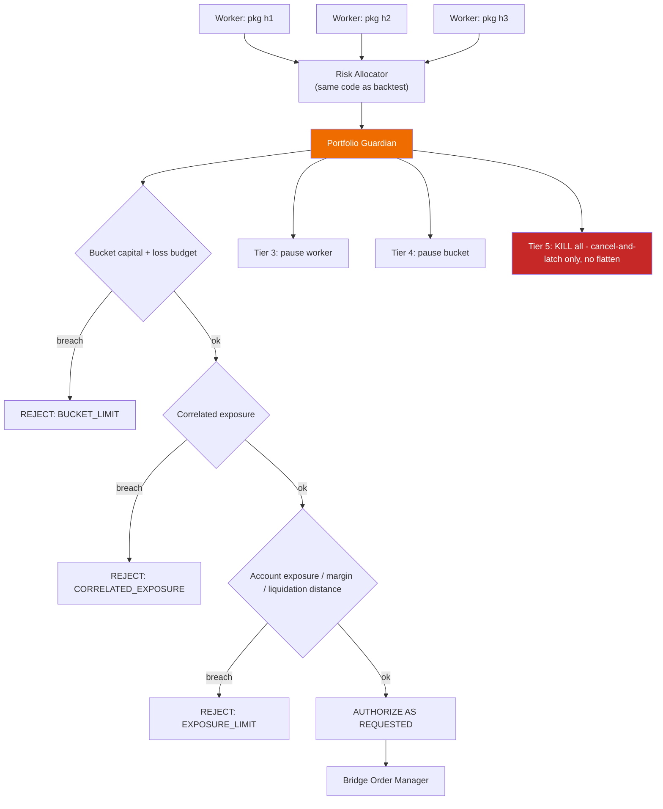

**[OWNER — Q16] V2 rules:**

1. **Authorize in full, or reject in full.** No resizing. There is no `RESIZED` authorization value in the V2 `OrderIntent` schema.
2. **Never increase size or widen a stop**, in any version.
3. **Fail closed.** No fresh account truth → no new entries. Existing native protective orders remain live at the venue.
4. **Every rejection carries a machine-readable reason** and appears in the decision stream and the dashboard.
5. **Guardian state is simulated** in `PortfolioSimulator` using the same policy objects, so a portfolio backtest reflects portfolio behaviour.
6. **Future resizing is a separately versioned `PortfolioAllocationPolicy`** with its own historical simulator, runtime implementation and parity tests — introduced no earlier than V3, and never as a runtime adjustment.
7. **What rule 1 covers — owner clarification, 2026-08-22 (register D-02, §0.5).** Rules 1 and 6 are about **sizing a new order**. They do **not** prohibit a **separately authorized emergency reduction or closure of existing exposure**. Any such capability is a **distinct, explicit, tested safety policy** — versioned, simulated, reason-carrying and separately authorized — and is **never** silent resizing. **Nothing here authorizes it to be built or used**, and no such capability exists in V2. The general question of whether reducing *existing* exposure may be treated differently from sizing *new* entries is Appendix E **O-11**, whose **distinction is now resolved** by this clarification while the **policy design remains open** under WP-V3-10.

### 10.2a Emergency operations — four distinct things, never one word

**Added 2026-08-22 (§0.6 R8); corrected in the R1 correction pass.** The document set used `DISARM`, `KILL`, `FLATTEN` and "emergency reduction" loosely and sometimes interchangeably — the Guardian tier ladder above labelled its top tier as a kill **that flattens**, as though the two were one action. **That label is corrected in the diagram to `KILL all — cancel-and-latch only, no flatten`.** Conflating them is how an operator who wanted to stop new orders ends up closing positions at market, or the reverse. **The four are defined below and kept separate everywhere: contract, API, dashboard, simulation and evidence.**

**What the running Bridge actually does today, stated accurately.** The first repair said the running Bridge *"treats them as separate"*. It does not. **The current Bridge exposes one `/api/kill` path with an optional `flatten` parameter** (`bridge/engine/engine.py:391-404` `kill(flatten: bool = False)` — latch `KILLED` and `cancel_all()`, flattening **only** when the caller passes the flag; `bridge/api/routes.py:113-129`). **There are no separate KILL and FLATTEN API operations in the running Bridge.** What the current code gets right is that flatten is **not** implicit; what it does not have is the **separation** — one path, one parameter, one confirmation. **The V2 plan creates that separation (WP-V2B-10); it does not describe something already there.**

| | **DISARM** | **KILL** | **FLATTEN** | **Automatic Guardian emergency reduction / closure** |
|---|---|---|---|---|
| **What it does** | Stops the system **originating new entries**. Existing positions, existing native protective orders and reconciliation all continue untouched | **Cancel-and-latch, protection-preserving.** Cancels **risk-increasing working orders — entries and adds** — and latches the app state to `KILLED` so nothing re-arms. **Valid reduce-only native protective orders for existing exposure are preserved, not cancelled.** **Does not close any position, and does not automatically flatten** | Closes existing exposure with reduce-only orders, on explicit operator command. **FLATTEN owns the controlled cancellation and replacement of protective orders where closing the position requires it** | Would reduce or close **existing** exposure automatically, on a Guardian rule, with no operator in the loop |
| **Owner** | **B** enforces; **D** requests | **B** enforces; **D** requests | **B** enforces; **D** requests | **P** would decide; **B** would enforce |
| **Phase availability** | Exists today (V1); carried through V2 | Exists today (V1) **as the single `/api/kill` path**, which currently cancels working orders indiscriminately; the **protection-preserving, entry-only cancellation semantics are new in V2B** | **Does not exist as an operation today** — today there is only an optional `flatten` parameter on the one `/api/kill` path. It **becomes a separately named operation with its own API path, confirmation and audit record** in V2B | **Does not exist and is not built in V2 or V3.** Design study only, WP-V3-10 |
| **Authorization** | Authenticated operator | Authenticated operator, typed confirmation | Authenticated operator, typed confirmation **and WebAuthn/FIDO2 step-up** (§12.5), on a path with **no single authenticator** (D-16) | Would need its **own** owner authorization, its own T0 audit and its own acceptance record — none of which exists |
| **Simulation / reconciliation / evidence** | State transition recorded; no economic effect to simulate | Cancellation set recorded; the **next reconcile cycle must confirm two things together** — **(a) zero risk-increasing working orders remain** (entries, adds) and **(b) every expected reduce-only protective order for existing exposure is still live at the venue**. **A residual risk-increasing order and a missing protective order both raise `PROTECTION_DRIFT`.** *(Corrected in the R1 correction pass: the earlier gate demanded "zero working orders remain" of every kind, which would have been satisfied only by cancelling the protection §10.2 rule 3 requires KILL to keep — the gate contradicted the command contract.)* | Reduce-only fills reconciled three ways; **drilled with timing evidence** against the live gate's five-minute full-flatten target (F-16 precondition 7); a chaos drill exercises the cancel/place failure path (§12.4 invariant 6) | Would require a **simulated equivalent in `PortfolioSimulator`** before it could exist at all, per Principle 6 |
| **Dashboard / API naming** | `DISARM` · `POST /api/disarm` | `KILL` · `POST /api/kill` — **the `flatten` parameter is retired in favour of the separate operation, so that "kill" never silently closes a position** | `FLATTEN` · `POST /api/flatten` — a distinct button, a distinct confirmation, a distinct audit record | Reserved. **No name is allocated on the live surface for an unbuilt capability** |

**Four rules that keep them separate:**

1. **KILL never flattens implicitly.** Stopping the machine and closing the book are different decisions with different consequences, and an operator under pressure must not get the second by asking for the first.
2. **FLATTEN is always attributable.** Every flatten records who, when, from which device, which authenticator, and which positions — and stamps `human_override = true` on the affected trades (§12.4).
3. **Native exchange stops remain live through DISARM and KILL** (§10.2 rule 3). The reduce-only stop at the venue is the protection that survives the process being gone; cancelling it is a FLATTEN-class decision, never a side effect. **This is why KILL's cancellation set is scoped to risk-increasing entry and add orders, and why its reconciliation gate proves protection is still there rather than proving nothing is there.** **FLATTEN owns the controlled cancel-and-replace of protective orders where closing the position requires it**, under its own confirmation, step-up authentication and audit record.
4. **Nothing here authorizes automatic emergency resizing in V2.** The fourth column is documented so that it cannot arrive by accident under another name. It is the capability the owner's **D-02 clarification** says is *not prohibited* if separately authorized — and "not prohibited" is not "authorized" (§5.5, §17.3, Appendix E O-11).

**Map-#96 amendment (2026-08-23) — the control set is ARM / DISARM / KILL / FLATTEN, and all four share one command lifecycle.** Owner-ratified through the [Safety, Operations & Production Readiness decision map (#96)](https://github.com/bsemaay-tech/mtc-command-center/issues/96), ticket [Decide: emergency-control and break-glass doctrine (#107)](https://github.com/bsemaay-tech/mtc-command-center/issues/107), whose resolution comment carries the detail. It refines the table above and reopens nothing in it.

- **ARM joins the set as the state the other three act against.** ARM **permits eligible automated new entries and places none itself** — arming is permission, never an order. **DISARM** blocks new risk while existing protection and exit handling continue. **KILL** persistently blocks new risk and cancels pending risk-increasing entry and add orders while valid reduce-only protection stays live. **FLATTEN** adds scope-wide reduce-only closure and **leaves the scope KILLED until an explicit recovery and reconciliation step**; it never re-arms anything.
- **Who may act.** Automated rules may **DISARM or suspend**. The Guardian **vetoes intent and never writes lifecycle state** (§10.4). **KILL and FLATTEN require an authenticated owner/operator request, and there is no automatic FLATTEN** — the fourth column above remains unbuilt, unnamed on the live surface and unauthorized.
- **Authorization ladder.** DISARM is immediate from an authenticated private session; **ARM** requires **fresh WebAuthn/FIDO2 plus confirmation**; **KILL** requires **fresh step-up plus a separated two-step confirmation**; **FLATTEN** requires the **strongest confirmation, naming the scope and the exposure being closed**. **Notifications contain no control buttons** — an alert is never a command surface.
- **One command lifecycle.** Every emergency command carries a **unique command ID** and moves `REQUESTED → ACKNOWLEDGED → RECONCILED`, or terminates `FAILED` or `UNKNOWN`. **An uncertain outcome is never auto-retried:** risky actions freeze until venue reconciliation resolves what actually happened.
- **None of this is deployed, and this amendment does not claim it is.** *(Sharpened 2026-08-24, map #123 fold, so the two axes are not conflated.)* **Everything above is planned V2 semantics.** What the **repository source** shows today is one `/api/kill` path with an optional `flatten` parameter and no `/api/flatten` (§10.2, plan WP-V2B-10 inputs). What the **deployed runtime** does is a **separate and unverified question**: repository evidence records schema **v4** with the v5–v9 safety mechanisms inactive — in which case `/api/kill?flatten=true` would only latch `KILLED` and block submissions, cancelling and flattening nothing — but **that is a repository-evidence statement, not a host observation**. Per **F-14, F-15 and §12.6.5 item 7 the deployed version, configuration and schema version remain UNVERIFIED**; **no host was contacted here and none may be**, and **no design, gate or evidence claim may rest on the deployed behaviour until it is independently verified under G9.**
- Every number this doctrine implies — confirmation timeouts, drill intervals, reconciliation deadlines — remains `[OPEN]`.

Carried by **WP-V2B-10**, with the authentication redundancy of **D-16** carried by **WP-V2B-06**.

**Worker isolation — [OWNER — Q4] HYBRID:**

| Environment | Isolation |
|---|---|
| `FORWARD_SHADOW` (large fleet) | **Shared isolated workers** — in-process tasks with enforced state separation. No orders, so a fault cannot move money. Cheap enough to run dozens. |
| `EXCHANGE_TESTNET`, `INTERNAL_PAPER`, `LIMITED_LIVE` | **One OS process per strategy or per risk bucket.** Real isolation, independently restartable, no container runtime to operate. |

**Account binding — [OWNER — Q6]:** decide after **WP-P0-28 (VEN-A)**'s official Hyperliquid verification *(carrier re-pointed 2026-08-24, map #123 fold, from the retired 2026-08-17 "Package 7" name that WP-P0-28 absorbed; the owner decision itself is unchanged)*, then prefer **one subaccount + separate API/agent wallet per independent strategy or risk bucket** where reliably supported. Fallback (virtual books inside one account) must be specified before it is needed, not during an incident.

## 10.3 Preventing false diversification

Three mechanisms, cheapest first. All three simulated in `PortfolioSimulator`.

**1. Promotion-time correlation gate.** Pairwise correlation of daily strategy returns, and — more sharply — **entry-timestamp overlap**, between a candidate and every current bucket member. Above threshold, the candidate competes for the *same* member slot rather than adding a new one.

**2. Family clustering.** Strategies from the same source, producer or parameter neighbourhood share a `family_id`; a bucket caps members per family. `STRATEGY_RESEARCH_REGISTRY.json` and `TAG_DICTIONARY.json` already carry the taxonomy to seed this.

**3. Runtime correlation gating** *(new in v2 — Antigravity §3, adopted with one rejection)*:

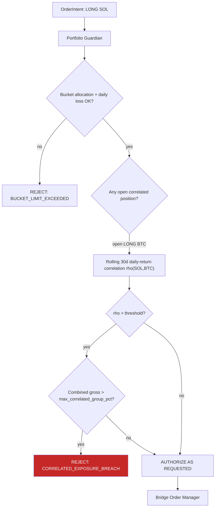

- Rolling 30-day daily-return correlation matrix across traded instruments, refreshed once daily at a fixed UTC time.
- If Strategy A requests `LONG X` while Strategy B holds `LONG Y` and ρ(X,Y) exceeds the threshold, combined gross exposure is treated as **one position** and bounded by `max_correlated_group_pct`.
- **REJECTED sub-clause:** Antigravity's "Downsize Intent Qty to Fit Remaining Cap". Silent trimming violates Principle 6 and Q16. Correlation breach → **reject**, or (later) an explicitly simulated allocation policy.
- **`[OPEN]` defaults:** ρ = 0.70 and `max_correlated_group_pct` = 25 % are Antigravity's proposals. Recorded as starting values requiring calibration against your own instrument set, not as policy.

**4. Live correlation monitor.** Rolling realised correlation of live P&L. The only one of the four that catches regime-driven convergence between strategies that were uncorrelated in-sample.

## 10.4 Execution-architecture critique decisions — map #79 fold (2026-08-23)

Owner-ratified through wayfinder map [#79](https://github.com/bsemaay-tech/mtc-command-center/issues/79); detail lives in the resolution comments for [Guardian policy](https://github.com/bsemaay-tech/mtc-command-center/issues/89), [reconciliation](https://github.com/bsemaay-tech/mtc-command-center/issues/90), [worker/window failure semantics](https://github.com/bsemaay-tech/mtc-command-center/issues/91) and [gap disposition](https://github.com/bsemaay-tech/mtc-command-center/issues/92). This is a responsibility and doctrine fold only. It reopens nothing from maps #37/#54/#67, leaves every number `[OPEN]`, and authorizes no implementation or operational action (D-12).

**Guardian judges the envelope, never the alpha.** Allowed inputs are bucket exposure/caps, correlation, snapshot freshness, venue state, the daily-loss ledger and protection placeability. Signal internals, PnL trajectory used as disguised resizing and unversioned inputs are forbidden. Every refusal is one of seven fail-closed classes: `BUCKET_CAP`, `CORRELATION`, `STALENESS`, `VENUE_STATE`, `DAILY_LOSS`, `PROTECTION_UNPLACEABLE`, `POLICY_ERROR`; a policy crash rejects as `POLICY_ERROR`. Guardian policy content is an owner-gated versioned definition and part of `deployment_identity_hash`. **Guardian daily-loss gating and the §6.9 tail consume one versioned threshold source; divergent numbers are impossible by contract.** The Guardian never writes lifecycle state. Repeated-veto flap thresholds remain `[OPEN]`.

**Reconciliation has two owners and one target truth.** Each worker owns scope-level comparison of its SQLite/store truth against venue truth. The supervisor owns the portfolio cross-check and divergence report per evidence window and on demand; that report feeds the cost-registry loop and paper-soak precondition. The target is three-way — intended/authorized, store and venue — with two-way explicitly interim until Guardian authorization exists. The inherited V1 two-way mechanism is brownfield input, not accepted proof: it must be re-proven under D026 before any ARM decision trusts it. Break response uses existing vocabulary: position or balance breaks suspend new risk and page; protective-order breaks enter `PROTECTION_DRIFT`/the existing KILL path and page; non-protective order-state breaks suspend new risk; fill-history breaks taint evidence and page only if they stand. A standing unexplained break blocks ARM, promotion and the affected evidence window; it never auto-KILLs.

**Failure preserves identity and evidence.** A worker process death never mints a new `deployment_identity_hash`; its gap is first-class ledger evidence and re-attachment requires reconciliation. Supervisor death is fail-closed for new risk while workers preserve existing protection and keep recording local SQLite truth; the watchdog pages, and portfolio reconciliation must pass before authorization resumes. Feed loss maps to `STALENESS` with no new entries while venue-side protection stays live; venue degradation maps to `VENUE_STATE` and no new entries while protection continues best-effort; venue-down invokes the evidence-window outage rule and names, but does not design, the safety-map break-glass interlock.

**Evidence windows are worker- and environment-scoped.** The map-#54 evidence doctrine remains canonical: clean recovery with intact reconciliation may continue the same identity's window; an unexplained break invalidates only the affected window. The existing global sticky 300-second rule is not ratified. WP-V2A-02 owns the conforming shared machinery; WP-V2A-08 and WP-V2B-07 consume and prove it. The outage threshold remains `[OPEN]`.

**Confirmed gap carriers.** WP-P0-31 carries the lifecycle ledger/Registrar; WP-V2A-02 + WP-V2B-03 + WP-V2B-07 carry staged reconciliation; WP-P0-20 + WP-V2B-07 + WP-V3-05 carry cost feedback; WP-V2B-04 activates the already-implemented schema through **v9**, including existing kill-evidence fields; WP-P0-04 defines the shared freshness contract, with WP-P0-30, WP-V2A-04 and WP-V2B-03 enforcing their domains; WP-P0-21 computes backtest-versus-forward divergence and WP-V3-03 enforces the block. The Decision Orchestrator remains inside WP-V2A-03/04/05, and protective-order placement remains with the execution seam and its paper/testnet proof. No further package is created.
---

# 11. Visual backtest and optimization explorer

## 11.1 The `TrialRecord` contract comes before any optimizer choice

**[C-3 — an error in v1.]** v1 recommended adopting Optuna partly because it is already installed. That reasoning is unsound: switching from exhaustive grids to adaptive search changes which trials are selected, reproducibility, the multiple-testing family, parallel execution behaviour and search-space coverage — and therefore changes **DSR and BH-FDR interpretation** (F-22, `mega_walk_forward.py:1695`).

Corrected sequence:

1. **Define `TrialRecord` as an optimizer-independent contract** in the contracts package.
2. **Both** the current grid engine and any Optuna-based engine write the same contract.
3. **Compare the two search regimes on frozen strategies and frozen datasets**, measuring: trials to reach the same best OOS metric, coverage of the space, reproducibility under re-run, and the resulting DSR/BH-FDR family size.
4. Only then decide whether Optuna becomes the primary optimizer.

Nothing about the explorer depends on that decision — which is the point of putting the contract first.

## 11.2 Scalable artifact model

**Tier 1 — Trial Catalog (every trial, always).** Columnar Parquet, partitioned:

```
trials/run_id=<...>/strategy=<...>/symbol=<...>/timeframe=<...>/part-000.parquet
```

| Column group | Columns |
|---|---|
| Identity | `run_id`, `candidate_id`, `package_hash`, **`deployment_identity_hash`** (§6.7 — the composite economic/deployment identity; **mandatory, and a row without it is unusable as evidence**), **`evaluation_run_hash`** (§6.7 — carries dataset, costs, simulator and evaluation configuration), `family_id` (§6.6 rule 6), `trial_id`, `param_hash`, `exit_mode` |
| Search lineage | `search_regime` (grid \| tpe \| random), `preregistered_space_hash`, `trial_index_in_family`, `family_size` |
| Parameters | one typed column per parameter (sparse, nullable) |
| Modules | `modules_enabled[]`, `modules_enabled_count` |
| Fold metrics | `fold_test_returns[]`, `fold_test_sharpes[]`, `fold_test_trades[]` |
| Lockbox metrics | `lockbox_return_pct`, `lockbox_sharpe`, `lockbox_maxdd`, `lockbox_trades`, `lockbox_pf`, `lockbox_expectancy_R`, `lockbox_win_rate` |
| Benchmark | `bh_return_pct`, `excess_alpha` |
| Statistics | `dsr_p_value`, `dsr_robust`, `bh_fdr_survivor`, `cpcv_pass_ratio`, `pbo` |
| Cost sensitivity | `net_after_slippage_pct`, `fee_bps_used`, `slippage_model_id` |
| Lineage | `simulator_class` (§9.4), `unsimulated_controls_hash` |
| Gate outcome | `classification`, `rejection_reasons[]` — **the "why was it rejected" column** |
| Flags | `is_pareto`, `is_top_k`, `is_robust`, `is_promoted`, `is_pinned`, `has_full_artifacts` |

**Size:** ~70 typed columns × 100,000 trials ≈ **10–25 MB Parquet** with dictionary encoding. Today's equivalent for a *single* iteration is 5.14 MB of unqueryable JSON. Strictly better in both size and capability.

**Tier 2 — Full Artifacts (selected trials only).**

```
artifacts/<package_hash>/
    trades.parquet        # entry/exit ts, price, qty, R, reason, MAE, MFE
    equity.parquet        # equity + drawdown + run-up
    intents.jsonl         # the OrderIntent stream - the parity evidence
    levels.parquet        # SL / TP1 / TP2 / BE / trail level per bar
    manifest.json         # package hash, data hash, kernel version, simulator class,
                          # UNSIMULATED_CONTROLS, allocation_policy_version
```

**Selection rule:** top-K by objective (K ≈ 20 per strategy×symbol×timeframe), the **Pareto front** on (return, max DD, trade count), everything `robust_final`, everything promoted, plus **anything the user pins**.

**Candles are never duplicated.** OHLCV is stored once per (symbol, timeframe) in the data bundle and referenced by hash. The chart joins trades to candles at read time.

**[OWNER — Q9] Retention: 20 GB budget, deterministic replay, explicit retention policy.**

- Full artifacts are evicted LRU beyond the budget, **except** promoted, pinned and Pareto trials, which are never evicted.
- The required historical datasets and engine versions to replay any retained trial are themselves retained.
- Eviction is logged; nothing disappears silently.

## 11.3 Deterministic replay — resolving the v1 contradiction

**[C-5 — an error in v1.]** v1's acceptance criterion A-13 promised any of 100,000 trials chartable in three clicks while storing full artifacts for ~200. Both are only possible with replay.

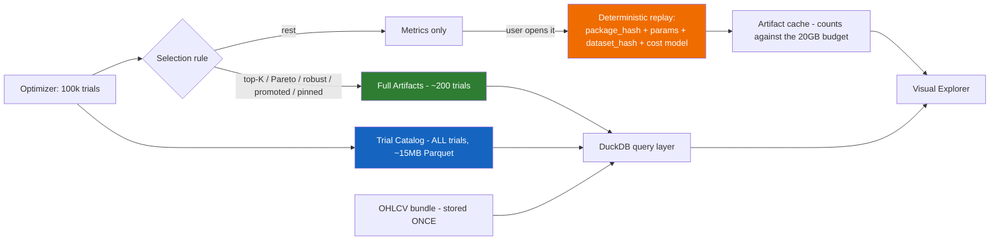

Guarantees, stated separately:

- **Every trial is immediately locatable and filterable** from the catalog.
- **Selected trials open immediately** from materialized artifacts.
- **Non-materialized trials trigger deterministic replay** using the exact kernel code hash, parameters, dataset hash and cost model, then are cached. **The replay artifact binds to the `deployment_identity_hash` it was produced under (§6.7); a replay whose composite identity differs from the row's is a new artifact, not a reconstruction of the old one.**
- **A maximum replay-time target is defined** (proposal: ≤ 60 s for a single strategy×symbol×timeframe; measured, then fixed).
- Replay is only possible because the kernel is deterministic (§9.6 test 1) — the same property that makes parity testable makes storage cheap.

## 11.4 Explorer, in two levels

**[C-21 / ChatGPT 1 §7]** v1 put the whole explorer in V3. Split it: the minimum viewer has immediate operational value once the catalog exists, and it reduces your dependence on AI-written morning summaries.

**MINIMUM EXPLORER — Phase 0 / V2.** A **research-domain, read-only viewer** over the trial catalog. It holds no credentials, touches no execution surface, and is **not** a change to the execution dashboard — which is why Phase 0's "no execution-dashboard rework" non-goal (§17.1) does not exclude it.

- strategy / symbol / timeframe filters
- candidate ranking table with `classification` and `rejection_reasons`
- exact parameter values for any row
- key statistics
- equity curve and drawdown curve
- basic candlestick chart with entry/exit markers
- direct navigation between variants

**ADVANCED EXPLORER — V3**

- **Parallel coordinates** — all tested parameters on vertical axes terminating at `OOS_Sharpe` and `dsr_p_value`; brush-and-select on any axis filters non-viable clusters
- **3-D parameter response surface with heatmap slicing** — Parameter A × Parameter B × OOS Sharpe, with:
  - **Plateau detection (robustness):** broad flat regions highlighted green — parameters that survive regime shift
  - **Needle detection (overfitting):** isolated sharp spikes surrounded by negative returns flagged red as overfit anomalies
- parameter importance
- Pareto scatter and robustness neighbourhoods
- side-by-side candidate comparison
- **`SIGNAL_EDGE` vs `SOURCE_COMPLETED_BASELINE` vs `MTC_ENRICHED` A/B view**
- walk-forward fold ribbon and lockbox segment
- gate report with pass/fail per gate

Plateau-versus-needle is the single most useful overfitting visual available for this data, and it comes almost free once the catalog exists.

**PRODUCTION CHART AND RESULT-VISUAL SURFACE — V3, `WP-V3-11`.** *Added 2026-08-22 (§0.6 R10).*

**The gap.** O-02 and O-29 promise a **TradingView-like** surface showing positions, entries, exits, SL, TP, Multi-TP and trailing stops as they actually moved, plus the full result statistic set. Before this round the only carriers were a **2–3 day library POC** (WP-P0-18), a **"basic candlestick chart with entry/exit markers"** in the Minimum Explorer (WP-P0-14), and WP-V3-01, whose named screens are all **parameter-space analytics** — parallel coordinates, response surfaces, importance, Pareto — and contain no trade-level chart at all. **A POC is not a product and a basic marker chart is not the promised surface**, so the owner's most visible requirement had no production owner.

`WP-V3-11` is that owner. It renders **real artifacts** — `trades.parquet`, `equity.parquet`, `levels.parquet` and `intents.jsonl` from §11.2 Tier 2, joined to the OHLCV bundle by hash — not mock data and not a demo dataset.

**Named visual state, each explicitly required:**

| Element | What must be visible |
|---|---|
| **Position** | Open/closed span shaded on the chart, direction, size, entry and exit markers with prices and timestamps |
| **Stop loss** | The stop **as a stepped series over time**, not a single line — every revision, with the reason for each |
| **Take profit** | The target series, including revisions |
| **Multi-TP** | Each leg (`leg_id`, price, `qty_fraction`, activation, `oco_group`) drawn separately, with **partial fills visibly reducing remaining quantity** |
| **Trailing stop** | The full trailing history as a stepped series, with the activation bar marked |
| **Break-even** | The break-even trigger bar and the resulting stop revision |
| **No-trade reasons** | Bars where an entry was blocked, with the machine-readable reason on hover — because a blocked system and a quiet market must never look the same (§5.1 principle 8) |

**Named result visuals and statistics, on real artifacts:** equity curve **versus buy-and-hold** on the same axes; drawdown and run-up curves; the walk-forward fold ribbon with the lockbox segment marked; per-fold and lockbox statistics (return, Sharpe, max DD, trades, profit factor, expectancy in R, win rate); DSR p-value, BH-FDR survivorship, CPCV pass ratio and PBO; cost sensitivity including `net_after_slippage_pct` and the fee/slippage model ids; the parameter set and the preregistered search space; `simulator_class`, `UNSIMULATED_CONTROLS` and `rejection_reasons`; and the `SIGNAL_EDGE` / `SOURCE_COMPLETED_BASELINE` / `MTC_ENRICHED` comparison.

**Two navigation requirements the owner asked for by name:** **one-click movement to promising variants** — from any chart, jump to the next variant by a chosen ranking without returning to a filter form — and **timeframe and strategy filtering** applied consistently across the chart, the statistics and the ranking table.

**What this package is not.** It is the **research-domain** surface: read-only, no credentials, no lifecycle actions, and it may not promote anything (that is WP-V3-03). The **execution-side** chart panels stay with WP-V2B-05, and drag-and-drop stays with WP-V2B-08 / WP-V3-07 / WP-V4-03 under their own gates. **The chart-library POC and its cleanup rule are unchanged**: WP-P0-18 still decides the library before this package commits to one, and retiring the POC remains a separate, explicitly owner-authorized act after its evidence is preserved (§13.2, plan §1.3).

## 11.5 Promotion authority is separate from the explorer

**[C-21]** Exploring a strategy and changing its lifecycle status are different actions with different consequences.

| Surface | May do | May not do |
|---|---|---|
| **Explorer** | read, filter, compare, chart, bookmark, pin, **prepare a promotion packet** | change any lifecycle status |
| **Environment Admission Authority** (WP-V2A-10) | issue `SHADOW_ELIGIBLE` and `TESTNET_ELIGIBLE` admission decisions from accepted eligibility evidence | admit anything to mainnet or `LIMITED_LIVE`; produce eligibility evidence itself |
| **Promotion Authority** (separate screen, separate confirmation) | `APPROVE`, `REJECT`, `REQUEST_MORE_EVIDENCE`; **and it alone admits to mainnet / `LIMITED_LIVE`** | anything else |

### Two admission authorities, because one of them cannot exist yet — repaired 2026-08-22 (§0.6 R5)

**The circularity.** v2.1 said the loader accepts *only* hashes traceable to a Promotion Authority decision artifact. But the Promotion Authority is **V3 (WP-V3-03)**, while the loader must admit packages for **`FORWARD_SHADOW` in V2A** and **`EXCHANGE_TESTNET` in V2B**. As written, either nothing could load until V3 — deleting the forward clocks that §6.8 depends on — or the rule would quietly be ignored the first time somebody needed to run a shadow package. **Neither is acceptable, and the fix is not to weaken the loader.**

**Staged admission.** Admission is split into three immutable, identity-bound decisions produced by two authorities, in order:

| Decision | Issued by | Available from | Requires | Admits to |
|---|---|---|---|---|
| **`SHADOW_ELIGIBLE`** | Environment Admission Authority | **V2A** | An accepted `SHADOW_ELIGIBLE` eligibility verdict set (§6.5, WP-P0-21) plus a frozen `package_hash` and `deployment_identity_hash` | `FORWARD_SHADOW` only — zero orders anywhere |
| **`TESTNET_ELIGIBLE`** | Environment Admission Authority | **V2B** | An accepted `TESTNET_PAPER_ELIGIBLE` verdict set, plus the sizing, protection, lifecycle and reconciliation criteria of §6.5 | `INTERNAL_PAPER` and `EXCHANGE_TESTNET` only |
| **`PROMOTED`** | **Promotion Authority, and only the Promotion Authority** | **V3** | The full statistical battery, forward evidence on the same `deployment_identity_hash`, the leakage record (§6.6, WP-P0-22), and the signed live gate for live capital | Mainnet and `LIMITED_LIVE` |

**Five rules that make staging safe rather than a loophole:**

1. **Every admission decision is immutable and identity-bound.** It names `package_hash`, `deployment_identity_hash`, the eligibility verdict set it consumed, the issuer, the timestamp, and the **exact environment set** it admits to. It is appended, never edited.
2. **Admission is produced *before* the loader is asked.** The loader consults an existing record; it never creates one, and it never infers one from the absence of a problem.
3. **The loader's admission check is empty and fail-closed by default.** With no admission record naming the requested environment for this exact `deployment_identity_hash`, the load is **refused** with a machine-readable reason. This is the same shape as the Pine CI guard: an allowlist that is empty until something is deliberately added to it.
4. **No decision widens another.** `SHADOW_ELIGIBLE` never admits to testnet; `TESTNET_ELIGIBLE` never admits to mainnet; and **nothing except a Promotion Authority decision admits to real capital.** An escalation is a new decision with new evidence, not a re-reading of an old one.
5. **A material identity change revokes admission.** Because the record binds `deployment_identity_hash`, any change under §6.7 leaves the new identity with **no** admission record — so it is refused until re-admitted. Revocation is automatic and silent-by-construction rather than a process someone has to remember.

Approval by either authority writes an **immutable decision artifact** first:

```
decision_id, candidate_id, package_hash, deployment_identity_hash,
authority ∈ {ENVIRONMENT_ADMISSION, PROMOTION}, decision, admits_to_environments[],
reason (required free text), evidence_references[], eligibility_verdict_set_id,
leakage_record_id, simulator_class, unsimulated_controls_hash,
timestamp, approver, previous_state, new_state
```

**Superseded — map #54 fold (tickets #61, #64).** The admission and promotion decision artifacts above are **record types in ONE append-only lifecycle ledger** (working name `LIFECYCLE_LEDGER`, a fresh artifact; the never-used `PROMOTION_REGISTRY.json` and `STRATEGY_REGISTRY.json` are retired from service — fold §3). The ledger is the **sole authority for lifecycle state, funnel through tail**; current state is always a derived view, never hand-edited. Its only writers: the research-side **Registrar** (all funnel transitions, human or automatic, through one locked, validated, backed-up gatekeeper), the **Environment Admission Authority** (automatic sub-live admissions, §6.5), the **Promotion Authority** (the sole owner signature — and at a succession swap that one signature admits the challenger AND closes the incumbent's live window, §6.9), and the **supervisor** (post-live tail: execution interlocks act first, the ledger append is automatic and mandatory — a suspension missing from the ledger is a defect). A shadow admission can never be mistaken for a promotion because every record names its issuer, the evidence it consumed, its identity keys and its `check_set_version` where one applied. The research/planning trust domain owns the ledger; the execution domain reads fail-closed and never writes lifecycle state. **The package loader accepts only identities traceable to a decision record of the appropriate authority for the requested environment** — which is what finally makes F-6 (an empty registry) impossible to repeat, without making the forward clocks impossible to start.

**Carrier correction — map #79 fold ([gap disposition #92](https://github.com/bsemaay-tech/mtc-command-center/issues/92)).** The storage, append gate, rebuildable current-state view and Registrar are **WP-P0-31**. WP-V2A-10, WP-V3-03 and WP-V2B-03 are the other three writers through that gate; they do not create separate registries or stores. This assigns ownership only and does not alter the four-writer doctrine above.

**This whole application is read-only with respect to trading and holds no credentials.**

---

## 11.6 Explorer decisions — map #78 fold (2026-08-23)

**[MAP #78 — owner-ratified 2026-08-23; detail lives in each ticket's resolution comment; D-12: nothing here authorizes implementation.]**

1. **Result charts show trade-truth, bounded (#84).** Minimum chart content = candles + entry/exit markers per trade + drawn protective levels (stop, take-profits, trailing path) + an aligned equity/drawdown pane + a chart-linked trade list. "TradingView-like" is BOUNDED to read-only evidence display: no drawing tools, no indicator *editing*, no alerts, no order entry. V3 additions: replay scrubbing, multi-candidate overlay comparison, parameter surfaces.
2. **Layout ratified from the prototype (#94):** **Inspector** — chart + right-rail per-trade evidence card (entry/exit/stop/TPs, R, duration, MAE/MFE, fees/funding) + a compact linked trade list (`prototype/result-chart-mock-94`, `ce7d227a`/`578f3cfd`). **Read-only display of the strategy's own indicators is IN scope** — requiring the indicator series to be carried in the §11.2 per-trial artifacts.
3. **Chart-library POC criteria (#84) — six, each failable:** (a) a full 2-year 15m window (~70k candles) with smooth pan/zoom; (b) ≥6 overlay series + hundreds of trade markers without jank; (c) a synchronized second pane with linked crosshair; (d) fully programmatic annotation from artifact JSON, zero manual steps; (e) license fit — self-hostable, offline, no external calls, private commercial use; (f) runs in the plain research-dashboard web stack. **Candidate order: Lightweight Charts → ECharts → the gated TV Charting Library only if the free options fail** (supersedes the earlier KLineChart comparator).
4. **Backbone (#82): a derived, rebuildable read index** over the lifecycle ledger + TrialRecord catalog + artifact stores + dataset registry — never authoritative, deletable and rebuildable at any time, every view freshness-stamped. **Two stages:** Stage 1 = extend the proven `mcc_readonly` + web-app layer with a ledger reader (zero new plumbing); Stage 2 = the index arrives WITH the TrialRecord catalog. **Host = the owner PC, local-only**; KVM2 (execution domain) never hosts research browsing.
5. **Phase-0 minimum vs Stage-2/V3 (#83):** P0 = family tree with lifecycle states; per-candidate "where is it and why" (rejection reasons + re-entry eligibility); screens-vs-evidence labelling; basic summary result views **including the TV-style KPI row**. **The trade-truth chart (+ indicator overlays + MAE/MFE/fees) is the FIRST Stage-2 addition, carried by WP-V3-11 — it leaves Phase-0 scope.** Daily home screen = the family tree + a ledger-derived "what changed since yesterday" strip. V3 analytics order: cross-candidate comparison → parameter importance → Pareto/parallel-coordinates/3-D surfaces.
6. **Navigation + search (#85):** a six-level spine on every screen — family → candidate → package → deployment identity → evidence window → trial — all nodes clickable; **rejection reasons and re-entry triggers are first-class spine nodes.** Faceted search, staged: Phase-0 = state + symbol + tag + free text; performance-range + provenance facets arrive with the Stage-2 index.
7. **Explorer display doctrine — new owner-gated definition, v1 (#83 + #85; registered in the fold doc §3):** (a) **no naked numbers** — every number/graph carries its evidence-class badge + legacy-vs-new flag + freshness stamp; (b) **labels are facets, never evidence** — diagnostic labels, advisory verdicts and provenance stamps filter/sort only, always badged, and an advisory verdict never renders beside scorecard numbers without its "advisory, not evidence" badge; (c) **history never hidden** — PRIOR_IDENTITY windows visible as grayed spine nodes, never merged; (d) legacy-vs-new is structural at index level, rendered differently everywhere; (e) replay-broken trials always carry a visible warning.

Fold record: `11_TRIAGE/WAYFINDER_EXPLORER_FOLD_2026-08-23.md`.

# 12. Dashboard and charting architecture

## 12.1 Two trust domains; one owner-facing entry point permitted

**[C-23]** Two *trust domains* are mandatory. Two *visible products* are an implementation choice, and for a non-technical single operator a single entry point is kinder.

| | Research / Command | Execution |
|---|---|---|
| Runs on | **Owner PC initially [OWNER — Q8]** | VPS, alongside the Bridge |
| Data | Parquet / DuckDB artifacts, registries | Bridge state DB + venue truth |
| Credentials | **none** | venue read + command authority |
| Auth | local | login + WebAuthn/FIDO2 step-up + roles |
| Writes | pins, notes, promotion packets | ARM / DISARM / KILL / pause; later SL/TP modification |
| Failure impact | a chart is wrong | **money moves** |

**Binding constraints on any shared front end:**

1. Separate backend processes, separate ports, separate origins, separate credentials.
2. The execution app must remain **independently reachable** when the research app is down or absent.
3. No shared session or token between domains.
4. A shared design-token and component library is a **build-time** dependency only.

A portal that links two isolated applications satisfies all four. A single process serving both does not.

## 12.2 Charting — decision gated behind a POC

**Amended by the map #78 fold (2026-08-23, §11.6):** the owner ratified **six failable POC pass criteria** for the result chart — ~70k-candle smooth pan/zoom; ≥6 overlays + hundreds of markers without jank; a synced second pane with linked crosshair; fully programmatic annotation from artifact JSON; self-hostable offline license fit; plain research-dashboard web stack — and the **candidate order Lightweight Charts → ECharts → the gated TV Charting Library only if the free options fail**, superseding the earlier KLineChart comparator (its dependency-inventory row is annotated in place). The POC executes under the explorer package's own authorization (D-12). Detail: map #78 ticket #84.

**Execution reuse amendment — map #95 fold (ticket #102).** The POC produces **one library verdict reused by both trust domains**; execution does not run a second library contest. Sharing is limited to the selected library and build-time components — never process, port, session, credential or data authority. The hand-coded #94 canvas (latest visual reference `2882b3f`) remains a disposable fake-data specification, not the production base. The strategy's own indicators may render read-only when their source and freshness are known. Before custom-building the TradingView-style analytics report, WP-V3-11 runs a separate focused comparison of permissively licensed tearsheet/report libraries with independently checked numbers; that comparison is not a second chart-library POC and authorizes no implementation.

**[OWNER — Q19]** Run a **2–3 day proof of concept** before selecting, comparing at minimum:

| Criterion | Why it decides |
|---|---|
| Entry/exit markers at scale | thousands of trades |
| SL / TP / Multi-TP overlays | multiple simultaneous level series |
| Trailing-stop history as a stepped series | the hardest common overlay |
| **Draggable horizontal levels** | this is what makes the execution UI cheap or expensive later |
| Touch / mobile behaviour | phone monitoring is a stated goal |
| Large trade-history performance | 100k-trial exploration |
| Maintenance activity and licence | long-term risk |
| Integration effort in this stack | real cost |

**Candidates:**

- **TradingView Lightweight Charts** — [github.com/tradingview/lightweight-charts](https://github.com/tradingview/lightweight-charts), Apache-2.0, ~17k ★, attribution required (satisfiable via `attributionLogo`). Series Primitives and Custom Series provide the extension points ([plugin docs](https://tradingview.github.io/lightweight-charts/docs/plugins/intro)). **Honest limitation:** no built-in draggable price line — an open request ([issue #1086](https://github.com/tradingview/lightweight-charts/issues/1086)). Hit-testing exists in the primitive API, so drag is achievable as a custom primitive; budget it as real work.
- **KLineChart** — Apache-2.0, overlay system, active. Also lacks a native draggable *position* line.

The POC measures the cost of building a draggable level in each, not which library has prettier candles. **[REC]** Lightweight Charts remains the favourite on licence, ecosystem and footprint; the POC exists to price the execution-UI consequence before it is locked in.

**Rejected:** TradingView Advanced Charts (not open source; requires application). "MG Exchange Chart" from the input documents — **`[OPEN]`**, provenance, licence and maintenance unverified; do not adopt an unverified charting project on a money-adjacent surface.

**[REC] Perspective** ([github.com/finos/perspective](https://github.com/finos/perspective), Apache-2.0, ~11.1k ★) for the **research** trial-catalog grid — WebAssembly, streaming, DuckDB data-model integration. Not needed on the execution surface, which shows tens of rows.

## 12.3 Freshness — seven states, adopted with one rejection

**[Antigravity §2, adopted with modification]** Every authoritative domain — market data, order state, fills, account truth, reconciler — feeds a state machine:

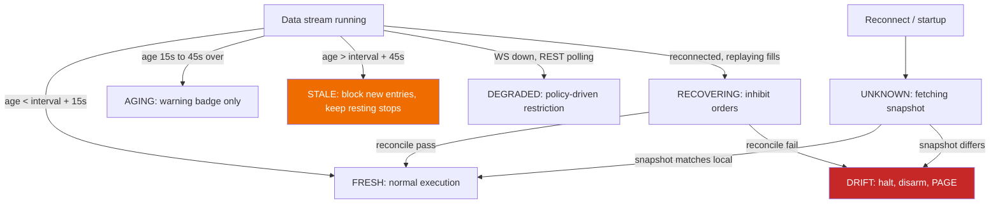

| State | Threshold | Execution behaviour | Operator signal |
|---|---|---|---|
| `FRESH` | age < interval + 15 s | full trading under normal risk policy | green |
| `AGING` | interval + 15 s … + 45 s | **warning only — no economic change** | yellow |
| `STALE` | age > interval + 45 s | **hard block** on new submissions; existing native stops remain live | yellow + auto-reconnect |
| `UNKNOWN` | startup or post-drop, pre-snapshot | **hard block**; workers paused | blue |
| `DRIFT` | local orders/positions ≠ venue snapshot | **halt engine, disarm all workers** | red + audible PAGE |
| `DEGRADED` | WebSocket dead, REST polling active | **per-worker policy**, declared in the package | orange |
| `RECOVERING` | socket back, replaying missed fills | inhibit new orders until watermark reconciliation completes | holding |

**Two REJECTED sub-clauses from the Antigravity specification:**

1. **`AGING` → "new entries with 50 % reduced position sizing".** Rejected. This silently changes trade economics based on transport health, with no backtest equivalent — a direct violation of Principle 6 and of Q16. Feed staleness may **warn or block**; it may never resize.
2. **`DEGRADED` → "trading permitted on higher timeframes only (≥ 1 h)"** as a global constant. Rejected as written; adopted as a **per-worker policy field declared in the frozen package**, because whether a 1 h strategy is safe on REST polling is a property of that strategy, not of the platform.

**Carrier assignment — map #79 fold ([gap disposition #92](https://github.com/bsemaay-tech/mtc-command-center/issues/92)).** WP-P0-04 owns the common state/event contract. WP-P0-30 emits market-feed freshness; WP-V2A-04 owns account-snapshot freshness; WP-V2B-03 aggregates order, fill, reconciler and portfolio freshness. The map-#79 failure decision maps feed loss to `STALENESS` and venue degradation to `VENUE_STATE`/no-new-entries without inventing a second state machine. Numerical boundaries remain `[OPEN]`; no state may silently resize.

## 12.4 Drag-and-drop SL/TP

**Map #95 gate — tickets #101/#102.** Stage-2 protective editing is not eligible until the Stage-1 control surface, Guardian, three-way reconciliation, protection-state read route, acknowledgement model and their failure evidence are accepted. Simulation remains network-isolated; any paper/testnet or live change is a governed protective-exit request through the same server-side validation, audit and reconciliation chain, never a direct chart-to-broker command. It may not increase worst-case loss, remove the last protection, exceed the position, disable reduce-only protection or create a new entry. **Manual new entries from the chart are NEVER.** Mobile ARM and mobile protective dragging are absent initially and require a separate later owner decision.

**Three modes, gated in this order.**

| Mode | Behaviour | Prerequisites | Phase |
|---|---|---|---|
| **Simulation** | Drag changes a *hypothetical* level; panel shows resulting R, risk $, portfolio impact. **No network call to any broker.** | accepted Stage-1 surface, Guardian, three-way reconciliation, protection-state read route and acknowledgement/failure evidence (§12.4 map-#95 gate) | V2/V3 |
| **Paper / testnet** | Drag produces a real `ExitIntent` against the testnet account, full audit trail | auth layer, reconciliation active, Bridge accepts external `ExitIntent` | V3 |
| **Live** | Same, with step-up authentication and typed confirmation | signed live gate (Q10), hardened auth, chaos-drilled rollback | V4 |

**[C-20 — Antigravity §1 adopted as the normative state machine]**

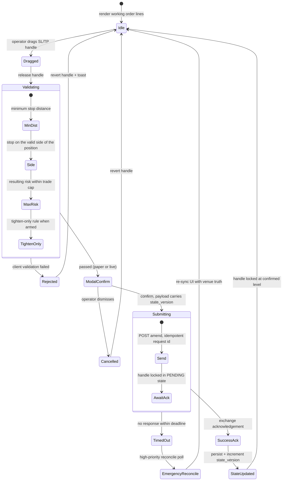

**Engineering invariants — all mandatory before any non-simulation mode:**

1. **Optimistic-UI inhibition.** A dragged level renders as a dashed `PENDING_EXCHANGE_ACK` line. Only an explicit acknowledgement converts it to solid `ACTIVE`. Showing the dragged position as the new stop before the venue confirms is actively dangerous.
2. **Versioned optimistic concurrency.** The payload carries the current `state_version`. If a fill or partial fill occurred while the modal was open, the server rejects with `STALE_STATE_VERSION`. This is the defence against two browser tabs and against reordered requests.
3. **Server-side validation.** The client's price is a *request*. The server re-derives validity: tighten-only for stops, minimum stop distance, tick/lot rounding, notional caps, Guardian authorization.
4. **Idempotency.** Client-generated `request_id`; replays return the original outcome. Extend the Bridge's existing order-identity discipline (`docs/23_ORDER_IDENTITY_CONTRACT.md`); do not reinvent it.
5. **Freshness deadline.** A request older than N seconds is rejected — a stop dragged against a stale chart is a wrong stop.
6. **Atomic failure escalation.** Where the venue lacks native modify and cancel-then-place is required, a failure on the place leg leaves the position naked: immediately re-place the prior level; if that fails within a short bounded window, execute `EMERGENCY_FLATTEN` and PAGE. **[REC]** prefer venue-native modify where Hyperliquid supports it; the cancel/place window must be exercised in a chaos drill (`tools_v2/observability/CHAOS_DRILLS_DESIGN.md` is the right home).
7. **Reconciliation confirmation.** The next reconcile cycle must confirm the venue's protective order matches the accepted revision; mismatch raises `PROTECTION_DRIFT`.
8. **Audit log.** who / when / from / to / reason / request_id / state_version / venue order id / outcome — append-only.

**[C-20 / ChatGPT 2 §7] Human-override accounting.** Every operator intervention stamps `human_override = true` on the affected trade, and performance reporting splits into **`PURE_STRATEGY_PERFORMANCE`** and **`OPERATOR_MODIFIED_PERFORMANCE`**. Without this split, a few manual saves make a mediocre strategy look promotable — and you would never know.

## 12.5 Execution dashboard content and access

The V2 proposal (`DASHBOARD_UNIFIED_ARCHITECTURE_PROPOSAL_20260818_V2.md`) and the accepted Package 3 prototype (`IBKR_PAPER_BRIDGE/dashboard_v2_prototype/`) remain UI-vocabulary inputs, not production architecture. **Map #95 tickets #100–#103 supersede any conflicting surface detail; §12.7 is normative** *(pointer repaired 2026-08-24, map #123 fold — that section was renumbered from §12.6)*. Non-negotiables:

1. **Three truth groups, four checkpoints** — strategy intent; Guardian authorization/rejection; execution reality split into bridge/store record and venue reality — never merged into one "current order" value.
2. **Staleness on every panel**, per §12.3.
3. **Block/reject reason always visible**, never buried in a gate list.
4. **Config/package integrity pill** — running `package_hash` vs the approved registry; mismatch → red `CONFIG DRIFT`.
5. **Reconciliation view** with a drift alarm and last-reconcile timestamp. Mandatory before any live capital.
6. **One notification channel** with dedup and a rate budget. Four channels train the operator to mute all four.
7. **Human-override marker** on any trade the operator touched.

The home surface is a fleet cockpit plus an exception strip, not a single-strategy chart landing page. Every unavailable datum is labelled honestly as **AVAILABLE NOW**, **CAPTURED — READ ROUTE MISSING**, **NOT BUILT**, **UNKNOWN** or **NOT APPLICABLE**; the UI never infers a missing truth. Every open-position row keeps current expected-versus-venue protection, match state and last-verification time visible; full protection history is drill-down evidence.

**[C-20 — Antigravity §7 adopted] Zero-trust access:**

```
[ Operator laptop / phone ]
        |
        v  encrypted WireGuard mesh
[ Tailscale overlay, device-authorized ]
        |
        v  WebAuthn / FIDO2 step-up for privileged actions
[ VPS: UFW default deny incoming ] --> [ 127.0.0.1:<port> execution API ]
        ^
        |  no public port exposed
[ public internet ] --X
```

- **Firewall:** `UFW default deny incoming`; no public port, including the dashboard port, 80 or 443.
- **Access path:** private Tailscale mesh only. Consistent with the existing `11_TRIAGE/DASHBOARD_V2_EXTERNAL_PATTERN_ADDENDUM_2026-08-17.md`.
- **Step-up authentication** via WebAuthn/FIDO2 hardware key or platform biometric for `ARM`, `KILL`, `FLATTEN`, and any future `DRAG_SL_TP`. This is strictly better than TOTP: it is phishing-resistant and origin-bound.
- **[REC] Keycloak and equivalent IAM servers are rejected** at one-operator scale — a full identity server is more attack surface than the problem it solves here.

### 12.5a Break-glass redundancy — the kill path must not have a single point of failure

**Added 2026-08-22 (§0.6 R17), tracked as derived safeguard D-16. History corrected in the R1 correction pass.** The earlier wording claimed that the design above placed **exactly one** WebAuthn/FIDO2 authenticator in front of `ARM`, `KILL` and `FLATTEN`. **That is not what the prior plan did.** Stated accurately:

- **The prior plan neither implemented nor specified a solitary authenticator.** §12.5 required **WebAuthn/FIDO2 step-up** on privileged actions. It said **nothing at all** about how many credentials are registered.
- **What it did not require is the gap:** it did **not** require **redundant authenticators**, and it did **not** require a **rehearsed out-of-band venue-side recovery path**. Neither obligation existed anywhere in the document set.
- **And the current Bridge has no WebAuthn path at all** — step-up authentication is a V2 design commitment, not an existing capability, so there is no deployed single-key design to describe either.

**D-16 remains justified on exactly that gap, and it is a stronger justification than the one it replaces.** Without an **explicit redundancy requirement**, a future **single-credential implementation** satisfying §12.5 to the letter would be fully compliant — and would be a single point of failure on the one control that stops the system, reachable only over a private mesh, on a host with no public port. Those network properties are correct against an attacker and unhelpful against an accident. The live gate's precondition 7 already demands three kill layers *"documented and drilled with timing evidence"* with a **five-minute full-flatten target** (F-16) — a target a single-credential implementation cannot honour on the day the credential is lost, broken, wiped or simply elsewhere.

**Two independent mechanisms are required, and neither substitutes for the other.**

**1 — At least two independently registered authenticators.**

- **Two or more** WebAuthn/FIDO2 credentials are registered against the operator account before any emergency command path is considered complete: **a primary and at least one backup, stored separately**, and **not both bound to the same device or the same platform authenticator** — two credentials on one phone is one credential.
- **Each registered authenticator is proven to work independently, in two stages.** Registration is not evidence. **Locally (WP-V2B-06):** each credential is exercised **alone** against the command surface, with the other absent, and the redundancy state machine is falsified. **At a venue (WP-V2B-07, gate G4):** a **`FLATTEN` on testnet completed with the backup alone**, the primary physically absent. **The local proof does not wait on the testnet package, and the testnet proof is not claimed by the local one.**
- **Losing one authenticator degrades the system to a named state, not to silence.** With one credential remaining, the dashboard shows a persistent `AUTH_REDUNDANCY_LOST` warning and re-registering a second is a blocking action before further live operation.
- **Registration and de-registration are themselves privileged, audited, append-only actions** — and de-registering the last-but-one credential requires explicit confirmation naming what it leaves behind.

**2 — Documented and drilled out-of-band venue-side access and flatten recovery.**

Both authenticators can be present and the path still be unusable: the mesh can be down, the VPS unreachable, the process wedged, or the dashboard broken. The out-of-band path answers *"how does the owner close positions when our own software cannot be reached at all"*.

- **A written runbook**, satisfying the live gate's precondition 12, covering: reaching the venue's own interface directly, cancelling working orders there, closing positions there, and revoking the API key — the third of precondition 7's three kill layers, which is the only one that does not depend on our software running. **The runbook is produced and accepted by WP-V2B-10, whose acceptance claims no drill.**
- **Credential and access prerequisites named in advance** — which venue account, which access method, where the recovery material is kept — **written as a prerequisite, never stored in this repository, and never created, requested or handled by any agent** (plan gate G6).
- **Drilled, with objective evidence**, on **testnet only**, **by WP-V2B-07** under gate G4: a dated record showing the operator flattening a real testnet position **entirely through the venue's own interface**, with the Bridge deliberately unreachable, and the **elapsed time measured** against the five-minute target. **An undrilled runbook is not a recovery path, on exactly the reasoning the live gate applies to kill switches** — which is why the runbook and the drill are **separate acceptances in separate packages** rather than one package obliged to drill before the testnet package exists.
- **Reconciliation afterwards is part of the drill**, not an afterthought: the system, once reachable again, must observe the venue-side closure and reconcile to it rather than fighting it or re-opening.

**Native exchange stops remain mitigation, not a substitute.** The `STRATEGY_NATIVE` reduce-only stop (Q7, D-03) means a position has protection while the process is dead — a real and important property, and the reason V2A proves it locally (WP-V2A-06) and V2B proves it at a venue (WP-V2B-07). But a resting stop protects **one** position at **one** price; it does not close a book, does not respond to an operator, and does not help when the exposure that must go is on the profitable side of the stop. **It reduces the cost of losing the command path; it does not remove the requirement to have one.**

**Carriers, ordering and gate dependency — reordered in the R1 correction pass to remove an acceptance cycle.** The earlier arrangement had the dashboard depend on the emergency operations, the emergency operations depend on the dashboard, the auth package require a testnet FLATTEN before the testnet package existed, and the testnet package sit outside the chain — a practical cycle in which nothing could be accepted first. **No package was added to fix it; the existing packages were reordered:**

| Order | Package | Depends on | What its acceptance may claim | What it may **not** claim |
|---|---|---|---|---|
| 1 | **WP-V2B-10** — emergency operations | **WP-V2B-01** | The **DISARM / KILL / FLATTEN semantics defined and implemented locally**, with FLATTEN **fail-closed and unavailable** until step-up auth exists; the **out-of-band runbook produced** | **No venue or testnet drill; no completed authentication** |
| 2 | **WP-V2B-06** — zero-trust access and two authenticators | **WP-V2B-10** | Private-mesh access, **step-up auth**, and **two independently registered authenticators proven to fail closed and to work independently, locally** | **No testnet FLATTEN** — the testnet package does not exist yet |
| 3 | **WP-V2B-05** — Execution Dashboard V2 | **WP-V2B-01**, **WP-V2B-10**, **WP-V2B-06** | Rendering command surfaces whose semantics are **already defined** and whose paths are **already protected** | Defining emergency semantics; supplying authentication |
| 4 | **WP-V2B-07** — testnet fleet | + **WP-V2B-10**, **WP-V2B-06**, **WP-V2B-05** | The **authorized testnet evidence**: backup-authenticator-only FLATTEN with the primary absent; the out-of-band venue-side closure with the Bridge unreachable; **elapsed time**; the subsequent reconciliation. Already carries **G4** and the testnet-credential boundary (**G6**) | Anything on mainnet |
| 5 | **WP-V4-01** — live-gate evidence pack | + **WP-V2B-07** drill evidence, and **WP-V2B-10** / **WP-V2B-06** | Consuming all of the above as evidence for preconditions 7 and 12 | Signing anything — only the owner signs |

All five are **T0** except as tiered in the delivery plan, and **gate G5 is not satisfiable without stages 1–4 complete.**

**Map-#96 amendment (2026-08-23, ticket [Decide: emergency-control and break-glass doctrine (#107)](https://github.com/bsemaay-tech/mtc-command-center/issues/107)) — what the out-of-band path must reach, and when it must be re-proven.** The break-glass path is an **independent venue-side path exercisable from both the approved phone and the approved laptop**, and it must be able to **cancel risk-increasing orders, close exposure reduce-only, and verify the resulting positions and orders at the venue** — recording evidence afterwards rather than depending on our own software to record it. **If the venue itself is unavailable, the scope remains KILLED and the flatten is reported unconfirmed**; nothing is assumed closed. The path is **proven before testnet eligibility, before live eligibility, after any relevant control or credential change, and after any incident**, and it is **re-drilled on a recurring interval whose value is `[OPEN]`**. **The runbook contains no secrets** — it names prerequisites and locations, never credential material (gate G6). This adds obligations to the runbook and the drill schedule; it changes no carrier, and the drill still belongs to **WP-V2B-07** under G4.

## 12.6 Safety, operations, credentials and live-readiness decisions — map #96 fold (2026-08-23)

Owner-ratified through the [Safety, Operations & Production Readiness decision map (#96)](https://github.com/bsemaay-tech/mtc-command-center/issues/96); the detail lives in the resolution comments for [Decide: emergency-control and break-glass doctrine (#107)](https://github.com/bsemaay-tech/mtc-command-center/issues/107), [Decide: incident, backup and recovery doctrine (#108)](https://github.com/bsemaay-tech/mtc-command-center/issues/108), [Decide: credentials and access architecture (#109)](https://github.com/bsemaay-tech/mtc-command-center/issues/109) and [Decide: the live-gate readiness register (#110)](https://github.com/bsemaay-tech/mtc-command-center/issues/110), with current-truth inputs from [Research: failure-mode catalog vs existing safety mechanisms (#105)](https://github.com/bsemaay-tech/mtc-command-center/issues/105) and [Research: ops baseline in the repo — deploy, rollback, backup, observability, credentials (#106)](https://github.com/bsemaay-tech/mtc-command-center/issues/106). **This is a doctrine and carrier fold only.** It reopens nothing from maps #37, #54, #67, #78 or #79, adds no requirement and no work package, leaves every unratified number `[OPEN]`, and authorizes no implementation, host contact, credential, deployment, testnet, live or trading action (D-12).

### 12.6.1 Emergency controls — where the doctrine lives

The ARM / DISARM / KILL / FLATTEN semantics, the authorization ladder, the `REQUESTED → ACKNOWLEDGED → RECONCILED` command lifecycle and the no-automatic-FLATTEN rule are stated in **§10.2a**, in place, as an amendment to the table that already governs them. The break-glass obligations — the independent venue-side path, its capabilities, the venue-unavailable rule and the proof occasions — are stated in **§12.5a**. Carriers are unchanged: **WP-V2B-10** defines and implements locally, **WP-V2B-06** supplies authentication and redundancy, **WP-V2B-05** renders, **WP-V2B-07** performs the authorized testnet drills, **WP-V4-01** consumes all of it as evidence.

### 12.6.2 Incident, backup and recovery — ratified doctrine

**Recovery is human-led and hours-scale.** There is **no second host and no automatic failover**; the exact recovery-time target is `[OPEN]` and is owner-set, not inferred.

**What is backed up.** Operational databases, ledgers, audit logs, approved configuration, deployment identity, release manifests and the essential runbooks. The **already-ratified cadence stands unchanged** — daily backups of every store, hourly synchronisation of critical ledgers during active windows (map #37, WP-P0-26). **Protected evidence is never auto-deleted**, and **no plaintext secret enters an ordinary backup**.

**A backup counts only when a restore has been proven.** An **isolated restore** must demonstrate integrity, readability and reconciliation before the copy is treated as protection. That proof is required **before any forward clock starts, after any backup or schema change, after any failed recovery, and periodically** — the recurring interval is `[OPEN]`.

**Failure responses, fail-closed.** Host or process failure **blocks new risk and pages the owner**; venue-side protection continues where the venue permits it. Recovery rebuilds from the **last accepted immutable release plus a verified backup**, and **portfolio reconciliation gates the return to operation**. An open-position emergency during an outage uses the break-glass path of §12.5a, not an improvised one.

**Storage is a safety surface.** **Low disk blocks new risk and alerts before failure**; **full disk is fail-closed**, never deletes protected evidence, preserves protection best-effort, and requires repair plus reconciliation before operation resumes. **No such code path or ratified implemented mechanism exists today** (§12.6.5); this is design, not description.

**Incident classes and monitoring.** Three classes: **safety/control**, **truth/evidence**, **availability**. Safety incidents and unexplained evidence incidents **page and suspend the affected risk**; serious safety or evidence incidents **require a postmortem before resumption**. External monitoring covers **heartbeat, feed and venue freshness, reconciliation, protection state, disk and backup health**. **An alert acknowledgement never clears the underlying fault**, and **alerts carry no secrets and no controls**. Timing and escalation values are `[OPEN]`.

### 12.6.3 Credentials and access — ratified doctrine

**Stages never share credentials.** Simulation and `INTERNAL_PAPER` hold **no exchange credential at all**; `EXCHANGE_TESTNET` uses **testnet-only** credentials; live uses **distinct agent wallets per risk bucket or worker**. **No credential is ever reused across stages.**

**Least privilege by construction.** A worker receives **only its own scoped credential**. The **dashboard, research surfaces, AI tooling and the notification path hold no exchange key**. The **master wallet stays offline and off KVM2**. **Until the venue's withdrawal restrictions are verified from a primary source, agent keys are treated as able to move funds** — the least-trust stance already recorded for WP-P0-28/WP-P0-29.

**Secrets have exactly one road in.** Secrets never enter **Git, issues, documents, logs, evidence, ordinary backups or AI prompts**. Provisioning is **owner-gated** and exposes the value **only to the process that requires it, through restricted operating-system storage**. **Agents verify presence and permissions; they never read or print a value** (gate G6).

**Access.** **Private mesh only, approved devices, named non-shared accounts.** **WebAuthn/FIDO2 plus an independent backup authenticator** (D-16), with **fresh step-up on dangerous controls**. **Research access and execution access remain separated** (O-33, §12.1).

**Lifecycle and compromise.** Creation, activation, rotation, revocation, expiry and destruction are **permanently audited**. Compromise triggers **immediate rotation**; **expiry warnings and a proven revocation drill are required before live**, and the **calendar rotation interval is `[OPEN]` pending the venue's verified rules**. On **suspected compromise the affected scope auto-DISARMS and the owner is alerted**; the owner then revokes, invokes KILL/FLATTEN or the venue route as needed, isolates, rotates, preserves evidence and reconciles. **Live eligibility is blocked until a clean recovery.** **There is still no automatic FLATTEN.**

### 12.6.4 Live-readiness register — ratified doctrine

**One canonical register is authoritative: `_AI_MEMORY/LIVE_TRADING_GATE.md`.** **No supporting document — brief, plan, dashboard, evidence pack or fold — may declare readiness.** The register keeps its **fourteen top-level categories** (F-16); map-#96 subproofs nest **under** them and create no fifteenth category and no competing count.

**Row status enum: `UNKNOWN`, `BLOCKED`, `IN PROGRESS`, `PROVEN`, `EXPIRED` — and only `PROVEN` counts.** Every row records its **carrier, scope, the exact evidence, the commit/deployment identity, the proof date, the invalidation condition and the current blocker**.

**The single-signature boundary.** **Paper, shadow and testnet eligibility is automatic** once the owner-approved definitions are proven — **no repeated owner signature per stage**. **Only the live transition receives an explicit owner signature**, and **this fold is not that signature and authorizes no actual stage action**.

**Coverage.** Strategy honesty · frozen identity · parity where applicable · paper and testnet evidence · reconciliation · Guardian · idempotency · emergency controls · break-glass · backup and restore · monitoring · disk-full · recovery and rollback · credentials · custody · venue review · incident response · signed capital limits. **Thresholds that the owner has not ratified stay `[OPEN]`.**

**What is not evidence.** Claims, dashboards, AI opinions and test summaries **alone do not count**. Evidence **binds to the exact artifact and environment that produced it**. **Failure-path tests require D026 RED/GREEN**, and **emergency, restore, revocation and recovery drills require dated results**.

**Invalidation.** A relevant change to strategy, code, policy, configuration, credential, venue, host or capital **invalidates the affected rows**. **Any hard row at `UNKNOWN`, `BLOCKED` or `EXPIRED` blocks the live signature.** A serious incident **suspends readiness until recovery and reconciliation**. **Current status: `NOT READY`.**

### 12.6.5 Current-truth blockers carried into the register

Recorded from [Research: failure-mode catalog vs existing safety mechanisms (#105)](https://github.com/bsemaay-tech/mtc-command-center/issues/105) and [Research: ops baseline in the repo — deploy, rollback, backup, observability, credentials (#106)](https://github.com/bsemaay-tech/mtc-command-center/issues/106) as **repository-evidence statements, not live inspections**, and as **readiness blockers, not permission to repair anything**:

1. **Repository evidence records the deployed Bridge as running schema v4** *(qualifier added 2026-08-24, map #123 fold; item 7 below is the controlling caveat)*. The v5–v9 safety mechanisms are **code-complete and tested but inactive on that deployed database** according to that evidence. Consequently, **if that evidence holds**, the deployed **`/api/kill?flatten=true`** path **only latches `KILLED` and blocks submissions — under v4 it does not cancel and does not flatten.** **This is a repository-evidence statement about the deployed runtime, not a verified observation of it, and it is separate from the planned V2 KILL/FLATTEN semantics (§10.2a), which are source-level design and are deployed nowhere.**
2. **There is no recurring backup and no repeatable restore drill for live KVM2 state.** One install-time archive was restored once.
3. **There is no active live monitoring or alerting.** Phase-Watch is inactive and the Telegram deployment is held.
4. **`Restart=no` and the absence of systemd install enablement are deliberate** — and **without monitoring, an outage could go unnoticed**.
5. **Rollback has never been proven as a real alternate-release rollback.**
6. **Disk-full has no current code path and no ratified implemented mechanism.**
7. **Deployment execution evidence is stranded off master**, and **master carries stale deployment wording** — consistent with F-14/F-15, where the deployed version, configuration and schema version remain **UNVERIFIED** and may not be assumed.
8. **There is zero functioning CI.** **OPS-C (WP-P0-27) is planned and unbuilt**, and no document may describe it as built.

### 12.6.6 Carriers

| Doctrine | Carrier |
|---|---|
| Emergency operations, uncertain commands, break-glass runbook | **WP-V2B-10** |
| Authentication, private access, authenticators, secret-delivery boundary | **WP-V2B-06** |
| Authorized-stage testnet and drill evidence | **WP-V2B-07** |
| Backup, restore, external dead-man, incident/recovery and disk/storage doctrine | **WP-P0-26 (OPS-A)** |
| Continuous checks and ops verification | **WP-P0-27 (OPS-C)** — planned, **not built** |
| Custody and operational credential-lifecycle boundary | **WP-P0-29 (VEN-C)** |
| Canonical live-readiness register and the sole owner signature | **WP-V4-01** |

**No package is added, removed or renumbered by this fold: the totals remain 60 requirements = 44 owner outcomes + 16 derived safeguards, and 76 work packages.**

**Map-95 read-only-seam repair (2026-08-23) — this table is the command-completion chain only.** Repaired at plan §6, WP-V2B-05 and WP-V2B-06 are each split into an independently acceptable read-only milestone and the command-completion milestone shown above. The read-only milestones (WP-V2B-05 read-only foundation; WP-V2B-06 read-only private access) depend only on WP-V2B-01, WP-V2B-03, WP-P0-30, WP-P0-18 and, for WP-V2B-06's milestone, the accepted WP-V2B-05 read-only milestone — never on WP-V2B-10. They are accepted before, and independently of, order 1–4 above. Order 1–4 itself is unchanged: WP-V2B-10 → WP-V2B-06 command-authentication completion → WP-V2B-05 command-surface completion → WP-V2B-07. See **§12.7 item 7** *(pointer repaired 2026-08-24, map #123 fold — the operator-surface section was renumbered from §12.6)*.

---

## 12.7 Operator-surface decisions — map #95 fold (2026-08-23)

**Renumbered 2026-08-24 (map #123 fold), from `§12.6` to `§12.7`.** The map-#96 safety fold and the map-#95 operator fold had both been written as `§12.6`, so the document carried **two sections with the same number** and every `§12.6` cross-reference was ambiguous. **The safety section keeps `§12.6`** — it is the older number, it owns the `§12.6.1 … §12.6.6` subsections that the plan and the register cite by name, and re-lettering those would have invalidated live pointers. **This section takes `§12.7`.** No content, decision, carrier or ticket reference changes; only the number does. **The map-#95 fold record `11_TRIAGE/WAYFINDER_OPERATOR_SURFACE_FOLD_2026-08-23.md` still points at the old `§12.6` number.** That record is a historical fold document and is **not amended**; read its pointer as this section.

**[MAP #95 — owner-ratified 2026-08-23 through tickets #100–#103; detail lives in each resolution comment; D-12: nothing here authorizes implementation or operation.]**

1. **Operator Display Doctrine v1 (#100; owner-gated definition).** Every screen separates the three truth groups/four checkpoints; never infers missing data; displays source, freshness and availability class; puts exceptions before normal detail; and preserves permanent history/auditability. Changing these definition-class rules requires the owner's word; applying the accepted version to screens is automatic.
2. **Minimum fleet cockpit (#100).** The home screen shows global safety/status, connection and reconciliation health, supervisor/watchdog health, a prominent exception strip and one row per strategy/risk bucket. Each row names identity/environment, position/exposure, current protection, latest intent, Guardian outcome, freshness and reconciliation state. Current protection is always visible; the full SL/TP/Multi-TP/trailing revision history lives in the detail timeline. `DRIFT`, missing protection, standing reconciliation breaks and supervisor/watchdog death are urgent exceptions. Numerical freshness and alert thresholds remain `[OPEN]`; map #96 designs notification and safety mechanics.
3. **Staged controls (#101).** ARM, DISARM, KILL and FLATTEN are represented at global, bucket and strategy scope; a safer parent state dominates every child. Global ARM establishes eligibility but never silently arms children. Controls remain visible with exact blockers. DISARM is immediate; ARM, KILL and FLATTEN use increasing confirmation/authentication strength as named in ticket #101, while map #96 designs the mechanics. Every attempt has an append-only record and the UI distinguishes `REQUESTED`, `ACKNOWLEDGED`, `RECONCILED` and `FAILED`; a click is never success.
4. **Execution chart (#102).** Operational truth only: candles; selected position/fill; working orders; current and historical protection; blocked/rejected events; visible freshness; and read-only strategy-owned indicators. VEN-E is the sole market-data authority; native and proxy history are labelled and never silently blended. The complete retained event record exists behind a bounded initially loaded window. Map #78's chart-library POC verdict is reused once across separate trust domains. The #94 canvas is disposable fake-data specification; a permissive tearsheet/report-library comparison precedes custom TV-style analytics.
5. **Mobile and remote doctrine (#103).** One responsive private web surface serves phone and computer; no separate native app initially. Mobile starts with a read-only 60-second incident view, then gains DISARM after accepted authentication evidence and KILL/FLATTEN only after map-#96 design plus the required local/testnet drill evidence. ARM and protective dragging stay laptop/desktop-only unless separately re-decided. Private mesh, approved devices, WebAuthn/FIDO2 and authenticator redundancy remain binding. Background resume forces a fresh snapshot and reconciliation before controls enable; offline/stale screens are visibly frozen and read-only. Notifications deep-link to authenticated incident detail but never contain trading controls or clear the underlying fault.
6. **Carrier boundary.** WP-V2B-03 builds the operator read model and truth/history feeds; WP-P0-30 supplies chart market data; WP-P0-18 selects the shared chart library; WP-V2B-10 defines command semantics; WP-V2B-06 supplies access/authentication; WP-V2B-05 renders the cockpit/chart/control requests; WP-V2B-08, WP-V3-07 and WP-V4-03 carry the three editing stages; WP-V4-06 carries mobile incident access and its staged remote safety controls. Map #96 owns safety/authentication/notification mechanics, not this section.
7. **Read-only dependency seam repair (2026-08-23, T2 audit repair; owner-authorized narrow repair round).** WP-V4-06 Stage 1 previously depended on the whole WP-V2B-05 package, which itself depended on WP-V2B-10 and WP-V2B-06 — so the purported read-only mobile stage inherited the command chain of §12.5 order 1–4. Under the new plan-wide staged-milestone rule (plan §0), WP-V2B-05 and WP-V2B-06 are each split, within their existing package rows, into an independently acceptable **read-only milestone** and a **command-completion milestone**: WP-V2B-05's read-only foundation depends only on WP-V2B-01, WP-V2B-03, WP-P0-30 and WP-P0-18; WP-V2B-06's read-only private access depends only on the accepted WP-V2B-05 read-only foundation. Neither depends on WP-V2B-10 or WP-V2B-06's command-authentication completion. **WP-V4-06 Stage 1 now depends only on those two accepted read-only milestones; Stage 2 depends on accepted Stage 1 plus the completed command-surface and command-authentication completion milestones and WP-V2B-10; Stage 3 is unchanged.** Later-stage dependencies do not block an earlier accepted read-only milestone. No package, requirement, owner decision or safeguard is added. See plan §6 (WP-V2B-05, WP-V2B-06, WP-V4-06) and fold record §8.

Fold record: `11_TRIAGE/WAYFINDER_OPERATOR_SURFACE_FOLD_2026-08-23.md`.

# 13. Open-source adoption

## 13.1 The permanent policy

**[REC]** To be added to `AGENTS.md`:

> **OSS-FIRST POLICY.** Before writing any component, search for a maintained open-source implementation. Prefer a library or adapter over a fork. Pin exact versions with hashes. Record licence, source URL and version in a dependency ledger. Prove it on a real artifact from this repository before adopting. **Independently validate every financial calculation against a second implementation.** Write custom code only for platform-specific strategy contracts, risk and allocation policy, execution and reconciliation, and safety behaviour.

Two gates added by this brief:

**Integration-mode gate [C-18].** Licence conclusions depend on *how* a project is used. Classify every candidate before judging it:

| Integration mode | Typical obligation profile |
|---|---|
| `EMBED_SOURCE` | strictest |
| `LINK_AS_DEPENDENCY` | strict |
| `SEPARATE_LOCAL_PROCESS` | materially weaker |
| `FILE_OR_API_INTEROP` | weakest |
| `POC_ONLY` / `ARCHITECTURE_REFERENCE` / `UI_REFERENCE` | none |

**"Reject as embedded dependency" does not mean "reject completely."** A licence unsuitable for linking may still permit standalone research tooling, independent comparison, a POC or a design reference.

This brief therefore states **no categorical legal conclusions**. Where a licence is likely incompatible with the intended distribution model, the entry reads *"requires a documented licensing review before adoption in this integration mode"* — legal risk can justify rejection, but this is an architecture document, not legal advice.

**Operational-cost gate.** Every new *service* (as opposed to library) must name who patches it, who monitors it, and what happens when it is down. For one non-technical operator this gate correctly rejects most infrastructure in the input research documents.

### 13.1a The full acceptance set — expanded 2026-08-22 (§0.6 R11)

**The gap.** O-16 asks for a **permanent** OSS-first policy with *"license, quality, maintenance, security and integration review"*. v2.1 delivered a one-paragraph policy, two gates and an adoption matrix — and **no carrier at all**: no work package owned the policy, produced the dependency ledger, or answered what happens when an adopted project is abandoned, compromised or has to be removed. A permanent policy with no owner and no exit is a preference, not a policy. **`WP-P0-24` is the carrier**, and the twelve criteria below are its acceptance evidence. They apply **before adoption**, **on every version bump**, and **at review cadence** thereafter.

| # | Criterion | What must be evidenced |
|---|---|---|
| **1** | **Provenance** | Canonical upstream URL, the exact commit or tag adopted, its published hash, and the path by which it was obtained. **A package obtained from a mirror or a re-upload is not adopted until the upstream original is confirmed** |
| **2** | **Licence** | Licence identifier and full text captured at the adopted version; **integration mode declared** per the C-18 gate; obligations that follow from that mode stated. Where the licence is likely incompatible with the intended distribution model, the entry reads *"requires a documented licensing review before adoption in this integration mode"* — this brief states no categorical legal conclusion |
| **3** | **Dependency and supply chain** | The full transitive dependency set at the adopted version, each pinned **with a hash**; the count of transitive dependencies recorded as a cost; any dependency that is itself unmaintained named. The Bridge's existing discipline is the standard — `requirements.in` plus a hash-pinned lock whose installer **refuses unpinned or unhashed requirements** (F-13) |
| **4** | **Vulnerability review** | Known advisories at the adopted version, checked against a named source and dated; unresolved advisories listed with severity and exposure in **this** integration mode. **"No advisories found" requires naming the source and the date, or it is not evidence** |
| **5** | **Maintainer and activity** | Number of active maintainers, release cadence, median time to close a security issue, and whether the project has a documented security-reporting path. A **single-maintainer** project on a money-adjacent surface is recorded as a named risk, not silently accepted |
| **6** | **Abandonment criteria, declared in advance** | The objective conditions that will classify the project **abandoned** — for example no release and no security response within a stated window, or an archived upstream repository. **Declared at adoption, so the decision is not made under pressure later** |
| **7** | **Update policy** | Who checks for updates, on what cadence, and how a version bump is tested against **this** repository's artifacts before it lands. A bump is a change with its own review, never an automatic action |
| **8** | **Incident response** | What happens on a published vulnerability, a compromised release, or a breaking upstream change: who is notified, what is disabled first, and the pinned-version fallback. For a money-adjacent dependency the first action is **disable or pin**, never "wait for the next release" |
| **9** | **Portability and export** | Data written by, or locked inside, the project must be exportable to an open format the rest of the system can read. **A dependency that can hold data hostage is not adopted on a money-adjacent surface** |
| **10** | **Replacement and rollback** | The named alternative, the estimated switching cost, and a **rollback path to the previous state** that has been walked at least once rather than assumed |
| **11** | **Evidence preservation** | Findings, measurements, benchmarks and the decision record are preserved **before** any retirement or removal, per the standing constraint (plan §1.3) |
| **12** | **Retirement and removal** | Stopping maintenance is **not** authorization to delete. Retirement or removal of an adopted component or a POC is a **separate, explicitly owner-authorized cleanup act**, performed only after criterion 11 is satisfied, and **no package may schedule its own automatic deletion** |

**Two rules about the ledger itself:** it is **append-only** — a superseded entry is marked superseded, never edited away, so the history of what was trusted when survives; and **every entry names the integration mode**, because criteria 2, 4, 8 and 9 all have different answers for `EMBED_SOURCE` than for `POC_ONLY`.

**Independent validation of financial calculations remains mandatory and is not one of the twelve** — it is the standing OSS-FIRST clause above, and QuantStats is the current example (§13.2): verify Sharpe, Sortino and Calmar against our own implementation before trusting a number.

## 13.2 Adoption matrix

Verified against primary sources on 2026-08-21.

| Project | Licence | Scale | Integration mode | Verdict |
|---|---|---|---|---|
| [**NautilusTrader**](https://github.com/nautechsystems/nautilus_trader) | LGPL-3.0-only | ~26.8k ★ | `POC_ONLY` in V3 | **[OWNER — Q12] POC first; do not replace the Bridge in V2.** Ships **stable** adapters for **both Hyperliquid and Interactive Brokers**, and documents that *"the same execution semantics and deterministic time model operate in both research and live systems."* That matches your multi-broker + parity requirement exactly. POC scope: an independent backtest of one promoted candidate as a second opinion. Any later production use requires a documented licensing review of the linking boundary. |
| [**Lightweight Charts**](https://github.com/tradingview/lightweight-charts) | Apache-2.0 (attribution) | ~17k ★ | `LINK_AS_DEPENDENCY` | **Favourite, decision gated on the Q19 POC** |
| **KLineChart** | Apache-2.0 | active | `LINK_AS_DEPENDENCY` | **POC comparator (Q19)** *(superseded 2026-08-23, map #78 fold: ratified comparator order is Lightweight Charts → ECharts → gated TV Charting Library last — §11.6, ticket #84)* |
| [**Perspective**](https://github.com/finos/perspective) | Apache-2.0 | ~11.1k ★ | `LINK_AS_DEPENDENCY` | **ADOPT — research only** |
| [**DuckDB**](https://github.com/duckdb/duckdb) | MIT | ~40.5k ★ | `LINK_AS_DEPENDENCY` | **ADOPT.** Queries Parquet directly; embedded, no service to operate |
| **Parquet / PyArrow** | Apache-2.0 | — | `LINK_AS_DEPENDENCY` | **ADOPT** — already declared |
| [**Optuna**](https://github.com/optuna/optuna) | MIT | — | `LINK_AS_DEPENDENCY` | **CANDIDATE — decision deferred to the §11.1 comparison.** Already installed; that is not a reason |
| [**optuna-dashboard**](https://github.com/optuna/optuna-dashboard) | MIT | ~800 ★ | `SEPARATE_LOCAL_PROCESS` | **OPTIONAL, ISOLATED, TIMEBOXED POC — not an adoption** (repaired 2026-08-22, §0.3 item 18). Timebox: **≤ 2 days**, and run it **only if** it saves work on the Minimum Explorer — i.e. only while the trial catalog is not yet queryable and the explorer is more than a week away. It requires an Optuna study to exist, which the current grid engine does not produce, so the setup cost is real and must be counted against the saving. It lives in an isolated temporary location outside the canonical trees. **Two maintained viewers are forbidden**: the moment the Minimum Explorer renders `TrialRecord`, **development and maintenance of this POC stop** — its **findings, measurements and decision record are preserved**, and **retirement or removal happens only through a separate, explicit owner-authorized cleanup act**. Stopping maintenance is **not** an authorization to delete, and nothing here schedules automatic deletion. If the explorer lands first, skip it entirely |
| [**QuantStats**](https://github.com/ranaroussi/quantstats) | Apache-2.0 | ~7.6k ★ | `LINK_AS_DEPENDENCY` | **ADOPT with independent validation** — verify Sharpe/Sortino/Calmar against your own implementation before trusting a number |
| **vectorbt (open edition)** | Apache-2.0 | — | `LINK_AS_DEPENDENCY` | **KEEP as an enrichment layer only** — already correctly scoped in `03_QUANTLENS/tools/vbt_enrichment.py`. Not a primary engine |
| [**hyperliquid-python-sdk**](https://github.com/hyperliquid-dex/hyperliquid-python-sdk) | MIT | ~1.8k ★ | `LINK_AS_DEPENDENCY` | **KEEP** — already the adapter |
| **FastAPI / Uvicorn / Pydantic** | MIT / BSD | — | `LINK_AS_DEPENDENCY` | **KEEP** |
| **Tailscale** | client BSD-3 / service | — | `SEPARATE_LOCAL_PROCESS` | **ADOPT** for private access (§12.5) |
| **Prometheus + Grafana** | Apache-2.0 | — | `SEPARATE_LOCAL_PROCESS` | **REJECT at current scale** — a second distributed system to patch and secure, attached to money. A lean built-in metrics endpoint is better here |
| **Temporal.io** | MIT | — | service | **REJECT at current scale** — durable execution for thousands of bots when you run one. Your durability need is met by an idempotent SQLite state machine plus reconciliation, which you have and which is audited |
| **ClickHouse / QuestDB / ArcticDB** | Apache-2.0 / Apache-2.0 / BSL-1.1 | — | service | **REJECT at current scale** — three databases for a workload DuckDB + Parquet handles on a laptop. ArcticDB's BSL adds a review requirement for zero benefit at your volume |
| **hftbacktest** | MIT | — | — | **REJECT** — L3 queue simulation for a bar-close strategy; the data alone is prohibitive |
| **QuickFIX / FIX** | various | — | — | **REJECT until a FIX venue is real** |
| **Hummingbot** | Apache-2.0 | — | — | **REJECT** — market-making runtime; not your use case |
| **Freqtrade / OctoBot** | GPL-3.0 | — | `ARCHITECTURE_REFERENCE` only | **Not suitable as an embedded dependency** given the intended distribution model; **usable as a design reference**. Any other use requires a documented licensing review |
| **QuantConnect LEAN** | Apache-2.0 | — | `SEPARATE_LOCAL_PROCESS` | **REJECT as core**; NautilusTrader is the better second-engine fit |
| **Jesse** | closed-source live plugin | — | `ARCHITECTURE_REFERENCE` | **REJECT for execution** — cannot depend on a proprietary execution plugin |
| **Qlib / MLflow / FinRL** | MIT / Apache-2.0 | — | — | **DEFER to V4+.** MLflow's run-tracking *idea* is worth stealing — the trial catalog is your version of it |
| **Keycloak** | Apache-2.0 | — | service | **REJECT at one-operator scale** — WebAuthn/FIDO2 + hardened single-user auth is smaller and stronger here |

## 13.3 What is still built in house

Strategy kernel, `SizingRequest` / `BoundSizingIntent` / `OrderIntent` / `ExitIntent` contracts, Risk Allocator and allocation policy, Portfolio Guardian, reconciliation semantics, Lifecycle Ledger and admission/promotion authority, and the two dashboards. These encode *your* decisions about money; adopting a library here means adopting someone else's risk philosophy silently.

---

# 14. Repository structure

## 14.1 The v1 recommendation, corrected

v1 recommended three repositories plus a contracts package, citing the 180,000-token onboarding chain. **[C-13]** Two reviewers correctly observed that this evidence proves a **context-routing** problem and does not, by itself, prove a Git-topology problem. A properly routed monorepo could reduce the same cost by the same amount.

**[OWNER — Q2a / Q2b]** the decision is now split and sequenced.

## 14.2 Direction of travel (owner-stated, unchanged)

Research, execution and versioned contracts are to be **separated gradually**, with the current repository ending as a **read-only archive**. What changes is only *when the topology is fixed and on what evidence*. **[Updated 2026-08-23, map #97 fold: the topology is now fixed for Phase 0–V3 — see the table below and §14.6. The "read-only archive" outcome belongs to the conditional-split path; under the ratified default it is the frozen-banner discipline of §16 M10/M12, and nothing is deleted on either path.]**

**Two different separations — clarified 2026-08-22 (§0.3 item 11). Do not conflate them again.**

| Separation | Status | Meaning |
|---|---|---|
| **Logical and trust-domain separation** | **BINDING NOW** | Research holds no credentials; execution is small, audited and authenticated; they communicate only through frozen, hash-verified packages and versioned contracts (§5.1 principle 7, §5.2, §12.1). Execution never imports research source. This constraint is **not** deferred, is **not** contingent on Q2b, and must be satisfied inside the current repository from Phase 0 onwards |
| **Separate Git repositories** | **DECIDED 2026-08-23 — Q2b, map #97 fold (§14.6)** | The packaging question is answered: **one stage-routed repository is the default through Phase 0–V3.** A split into separate repositories is a **later, conditional** option, considered only after stage-routing measurement and only if measured cost or the security/deployment boundary justifies it (§14.4, §14.6). *Until 2026-08-23 this row read "**DEFERRED — Q2b** … decided at the end of Phase 0 on measured evidence"; the measurement it required still gates the conditional split.* |

A single repository can satisfy the binding separation and today does not; three repositories can violate it if execution imports research source. The boundary is the requirement — the topology is an implementation of it.

## 14.3 Q2a — versioned contracts package, in place, now

**Approved. No migration required.**

```
MTC_COMMAND_CENTER/contracts/          # new, in the current repository
  pyproject.toml                       # versioned, semver, independently installable
  mtc_contracts/
    __init__.py                        # __version__
    identity.py                        # candidate_id, package_hash formula (§6.7)
    sizing.py                          # SizingRequest + BoundSizingIntent
    orders.py                          # OrderIntent, ExitIntent, qty_semantics, stop_semantics
    package.py                         # StrategyPackage + frozen instrument metadata
    risk.py                            # RiskBucket, allocation policy schema, guard policy schema
    trials.py                          # TrialRecord, artifact manifests
    lineage.py                         # simulator_class, UNSIMULATED_CONTROLS
  tests/
    test_compat.py                     # backward-compatibility matrix across versions
    test_consumers.py                  # research + execution consumer contract tests
```

Rules from day one:
1. **Semantic versioning**, changelog per release.
2. **Compatibility tests** across supported versions — a breaking change must fail a test, not surprise a consumer.
3. **Consumer contract tests** — both the simulator and the Bridge assert against the same schemas.
4. Consumers depend on a **released version**, never on a working-copy path.

**What "the Bridge is a consumer" means in Phase 0 — clarified 2026-08-22 (§0.3 item 10).** Phase 0 proves **schema and consumer compatibility only**:

- A consumer contract test may import the contracts package **alongside** the Bridge's own types and assert that Bridge payloads round-trip through the schemas, that field names and semantics agree, and that a breaking change fails a test.
- **No Bridge runtime code path changes in Phase 0.** The Bridge does not construct, consume or act on `OrderIntent` at runtime, its behaviour is byte-for-byte what it is today, and the V1 soak is unaffected.
- **Actual Bridge runtime wiring — the engine accepting an authorized `OrderIntent` and refusing to originate a quantity — is V2A work** (§17.2a), on a protected surface, under its own T0 authorization and audit.

Stated plainly: Phase 0 makes divergence *detectable*; V2A makes it *impossible*.

**Why this is the highest-value early step:** it is the only structural artefact that makes the five-recipe problem *detectable* if it starts to recur. A breaking change becomes a version bump instead of a silent divergence discovered six weeks later.

## 14.4 Q2b — stage-routed monorepo now, a measured conditional split later

**Map-#97 amendment (2026-08-23, [Decide: repository topology (#114)](https://github.com/bsemaay-tech/mtc-command-center/issues/114)) — read this before the sequence below.** The macro doctrine is **no longer undecided**. **Option A, the stage-routed monorepo, is the ratified default through Phase 0, V2 and V3.** Option B is retained below **as the conditional alternative it now is**, not as an equal candidate awaiting a coin toss: it is considered only after the stage-routing measurement exists and only if **measured cost** or the **security/deployment boundary** justifies it, and if triggered it targets **contracts + research + execution** with the present repository preserved **read-only**. The four-step sequence below is unchanged and still binding — **it is now the evidence path for the conditional trigger rather than for the macro choice**. Full doctrine, carriers and dated research inputs: **§14.6**.

*This section previously carried the heading "Q2b — topology deferred, decided on measurement". The deferral was true from 2026-08-21 until 2026-08-23 and is preserved as history in §21.1's Q2b row; it is not the current position.*

**Sequence:**

1. Implement stage-local context routing **in the current repository** (§15).
2. **Measure** default agent context per task class, cold-start time, and the actual per-task token cost. Record before/after.
3. Complete the migration inventory and classification (§16 M0–M1) so the true blast radius of a split is known.
4. **Then** evaluate the **conditional-split trigger** against measured evidence on: default onboarding tokens, cold-start time, cross-domain change complexity, CI complexity, contract-version drift risk, multi-repo PR overhead, local development complexity, publishing overhead, and migration cost. *(Reworded 2026-08-23, map #97 fold: this step read "**Then** choose topology against measured evidence". The macro choice is no longer open — Option A is the ratified default through Phase 0–V3 — so what this evidence decides is only whether the conditional split of §14.6.1 item 3 is ever triggered. The evidence list itself is unchanged, and an absent trigger is a valid terminal state.)*

**The two options — Option A is the ratified default, Option B the conditional alternative (map #97, §14.6):**

**Option A — stage-routed monorepo — RATIFIED DEFAULT through Phase 0–V3**

```
platform/
  10_RESEARCH/    20_KERNEL/    30_BACKTEST/    40_VALIDATION/
  50_PROMOTION/   60_EXECUTION/ 70_PAPER/       80_LIVE/
  90_DASHBOARD/   95_CONTRACTS/
```
with strict local `AGENTS.md` and stage-local context.

**Option B — three repositories + contracts package — CONDITIONAL, considered only on a measured trigger**

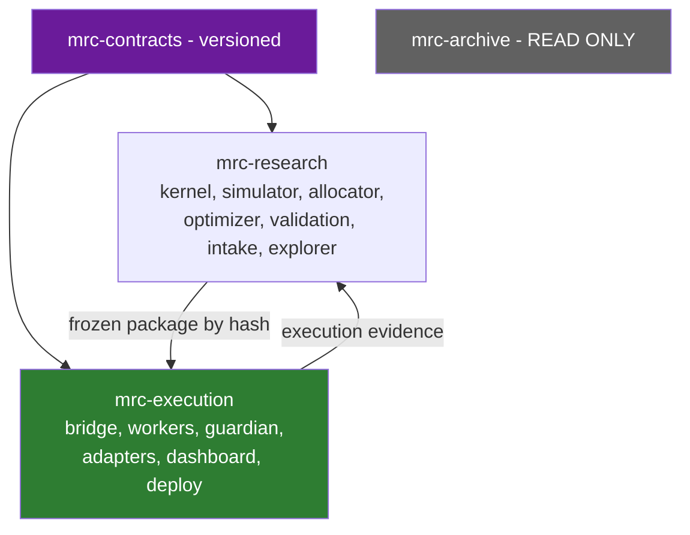

**Decision rule.** If routing drops the per-task cost from ~180k tokens to a few thousand inside the current repository, the split becomes an optimisation rather than a necessity — and is then judged on the security boundary alone, which is a narrower and easier question.

**Not blocked by this decision:** kernel consolidation, the contracts package, the trial catalog, context routing, tagging, **and the binding logical/trust-domain separation of research from execution (§14.2)** — that boundary applies inside the current repository regardless of which option wins. **[C-13]** repository topology must never block the kernel work.

## 14.5 Kernel home

Under either option the kernel is consumed by execution as a **pinned, hash-verified package**, exactly like a third-party dependency. Execution never imports research source.

**Map-#97 amendment (2026-08-23, [Decide: repository topology (#114)](https://github.com/bsemaay-tech/mtc-command-center/issues/114)).** Because the stage-routed monorepo is the ratified default (§14.4, §14.6), the kernel's home **through Phase 0–V3 is a routed stage inside this repository**. The consumption rule above is unchanged and is the reason the home was never load-bearing. What stays `[OPEN]` is narrower than before: **only where the kernel lands if the conditional split is later triggered** — the residual scope of §21.2 **O-7**.

## 14.6 Repository topology and delivery doctrine — map #97 fold (2026-08-23)

Owner-ratified through the [Repository, AI Context, Migration & Delivery decision map — topology on the table (queue 7/8) (#97)](https://github.com/bsemaay-tech/mtc-command-center/issues/97). The decision text lives in the resolution comments for [Decide: repository topology (#114)](https://github.com/bsemaay-tech/mtc-command-center/issues/114) and [Decide: versioning, migration and delivery doctrine (#116)](https://github.com/bsemaay-tech/mtc-command-center/issues/116); the AI-context half is **§15.5**, from [Decide: AI-context architecture (#115)](https://github.com/bsemaay-tech/mtc-command-center/issues/115). Current-state inputs come from [Research: repository topology and AI-context inventory (#112)](https://github.com/bsemaay-tech/mtc-command-center/issues/112) and [Research: context-loss and process-failure postmortem sweep (#113)](https://github.com/bsemaay-tech/mtc-command-center/issues/113); the applying record is [Fold: repo, context and delivery decisions into the planning set (#117)](https://github.com/bsemaay-tech/mtc-command-center/issues/117), written up as `WAYFINDER_REPOSITORY_CONTEXT_DELIVERY_FOLD_2026-08-23.md`. **This is a doctrine and carrier fold only.** It reopens nothing from maps #37, #54, #67, #78, #79 or #96, **adds no requirement and no work package, creates no tag, invents no number**, and authorizes no implementation, migration, host contact, credential, deployment, testnet, live or trading action (D-12).

### 14.6.1 Topology — ratified

1. **The stage-routed monorepo is the default through Phase 0, V2 and V3.** Option A of §14.4 is the answer, not a candidate.
2. **Research and execution remain strict logical and trust zones**, exactly as §14.2 already binds them, and **execution consumes only frozen, hash-verified packages**. This survives every topology and is not contingent on one.
3. **A later split is considered only after stage-routing measurement**, and **only if measured cost or the security/deployment boundary justifies it**. Absent a measured trigger there is no split to schedule.
4. **If triggered**, the target is **contracts + research + execution** repositories, with **the present repository preserved read-only**.
5. **Large run outputs and evidence leave ordinary Git storage** for **indexed, immutable, hash-verified artifact storage**; **Git keeps source, contracts, small manifests and pointers**. This direction is independent of the split question. **It is carried by existing packages — no new package is created for it:**
   - **WP-P0-01** classifies the existing large tracked **and untracked** artifacts, so the direction has a subject rather than an assumption. An artifact whose owner or purpose cannot be established is recorded `UNKNOWN`, and an `UNKNOWN` blocks any move or cleanup touching it.
   - **WP-P0-03** supplies the **bidirectional migration ledger** (`old_path → new_location → sha256 → status`, §16 M3), which is what makes any later relocation reversible and traceable.
   - **WP-P0-13** (trial catalog) and **WP-V3-02** (full artifact tier, deterministic replay, retention and protected classes) are the **existing destinations for new evidence** under the §11.2/§11.3 artifact tiers.
   - **WP-V2B-09** performs the **in-repository workflow cutover** so that **new** writes land at those destinations and **Git holds the hash and index pointers** rather than the payloads. **It deletes no history and de-tracks no historical path.**
   - **Any de-tracking or removal of a historical path remains a separately owner-authorized, exact-target act under gate G8**, performed only after freeze tags and evidence preservation. **No history rewrite is authorized by this doctrine or by any of the carriers above.**

   What remains open is the **artifact-store technology** and the **exact target lists** — to be settled against the §11.2/§11.3 tiers and the §16 M3 ledger at the recommended fresh G1 round. *(Amended 2026-08-23 within the map-#97 fold: this item previously read "Its executable carrier is not assigned by this fold", which left a ratified direction with no owner. The assignment above is a cross-reference and extension of existing carriers; no package, gate or tier is added.)*
6. **Migration deletes nothing.** **Inventory → freeze tags → a bidirectional ledger → rehearsal and rollback proof → mechanically checked checkout liveness** all precede any move or cleanup. Old source stays readable.

### 14.6.2 Versioning, migration and delivery — ratified

1. **Package, release and legacy tag namespaces are immutable, and existing tags never move** (§15.4).
2. **Master is protected.** Short-lived named branches and isolated worktrees are the normal working shape, and **rescue refs stay preserved until explicitly dispositioned**.
3. **Shared contracts are versioned and mismatched consumers fail closed.** Multi-version compatibility is built **only after measured need** — the §14.3 rules and the existing refuse-on-skew handshake are unchanged.
4. **The migration sequence is: inventory → classify → freeze → ledger → rehearse → verify → cut over → prove rollback → archive.** **Old source remains readable and is never silently deleted.** §16 already expresses this as M0 … M12; see the map-#97 amendment there.
5. **OPS-C activates CI progressively** (WP-P0-27). **The existing T0–T3 audit-tier policy applies once at work-package boundaries, with its existing immediate-T0 exception, exactly as `AGENTS.md` states it.** **No new reviewer count, audit class or stacked audit is created here** — this fold decides placement and cadence only.
6. **Mechanical guards block concurrent writers, and block cleanup, when ownership, process/scheduled-task dependency or checkout purpose is `UNKNOWN`.** An `UNKNOWN` is a stop, never a default-to-safe-looking-delete.

### 14.6.3 Dated research findings — ticket #112 and #113, not timeless facts

**Every figure below is a dated measurement taken on 2026-08-23** against ticket #112's recorded `origin/master` snapshot and the local workspace. They are **evidence for the doctrine above, not requirements, not thresholds, and not current-state claims for any later date.** Repository findings never become requirements (register §5, rule 4).

From [Research: repository topology and AI-context inventory (#112)](https://github.com/bsemaay-tech/mtc-command-center/issues/112):

- About **1.02 GiB** tracked, of which `MTC_COMMAND_CENTER` held about **97 %** of tracked bytes.
- `03_QUANTLENS` was about **828 MiB**. **Four dormant dated run-output trees totalled about 796 MiB — about 78 % of all tracked bytes**, and one **90 MiB** tree was **gitignored yet still tracked**. This is the direct evidence for §14.6.1 item 5.
- The main checkout held about **116 MiB of untracked agent-run logs**, and **6 of the 7 mandated onboarding files had uncommitted local edits** at measurement time.
- The mandated onboarding chain was about **654 KiB**; `GLOBAL_HANDOFF` + `NEXT_STEPS` were about **590 KiB** and **structurally regrow through append-only usage after manual rotation** — the evidence for §15.5's archive rule.
- **Tags: zero at measurement.** Remote branches **121** including pointer; local branches **164**; active worktrees **35**. **These counts are dated and volatile and must never be turned into permanent requirements** — they are the same class of fact as F-17's dated snapshot.
- `docs/DEPRECATED_FILES.md` and `docs/EXCLUDED_PROJECTS.md` were **byte-identical**; `docs/ACTIVE_FILES.md` and `docs/DECISIONS.md` **collided by name with different canonical `_AI_MEMORY` files** — the evidence for explicit canonical homes.
- The **frozen legacy repository** at `C:\LAB\tradingview-lab`, about **6.01 GiB**, **remained read-only and off-limits, and no content inside it was read.**
- **The architectural implication, stated as the ticket stated it:** large artifacts out of ordinary Git, lean routed context, explicit canonical homes, and **no cleanup based on git cleanliness or age alone**.

From [Research: context-loss and process-failure postmortem sweep (#113)](https://github.com/bsemaay-tech/mtc-command-center/issues/113) — **fourteen recorded process-failure patterns, ranked**:

- **Worst:** a **cleanup heuristic nearly queued the checkout backing the live scheduled task for removal**, because **no liveness check existed**. Owner review caught it. This is why §14.6.2 item 6 is a hard stop rather than a warning.
- **Second:** **two Lead sessions wrote the same shared transport artifacts concurrently**; loss was avoided by luck, and `SESSION_LOCK` was created **afterwards**.
- **Third:** repeated **Windows worktree-removal failures left git state and disk reality divergent**, including multi-gigabyte ACL-locked husks.
- **Cross-cutting:** **git clean/pushed/mtime cannot establish checkout liveness.** A **checked registry** must carry owner, worktree, path, write scope and process/scheduled-task dependency.
- **Canonical memory can drift when the real work lives on another branch or ref.** Close-out must reconcile **current master, the work branch and durable tracker state** before a claim is released (§15.5).
- **The existing audit tiers catch wrong conclusions better than evidence-authoring or process failures.** **Mechanical claim checks and literal execution verification belong at the delivery boundary** — which is why WP-P0-27 carries them and why **the settled tier policy is not changed and no stacked audit is added**.

### 14.6.4 Carriers — existing packages only

| Doctrine | Carrier |
|---|---|
| Stage-local context routing, the router/`CONTEXT_MAP`/glossary shape, and the **measurement** that is the conditional-split trigger evidence | **WP-P0-05** |
| CI activation and the **mechanical delivery guards** — claim, ownership and liveness checks | **WP-P0-27 (OPS-C)** — **planned, not built** |
| **In-repository** routed cutover — the terminal topology state through Phase 0–V3 | **WP-V2B-09** |
| **Only** a later, condition-triggered repository split, under gate **G7** | **WP-V5-04** |
| **Large run outputs and evidence out of ordinary Git** (item 5 above) — classification, ledger, destinations for new evidence, and the in-repository write-destination cutover | **WP-P0-01** classifies the existing large tracked/untracked artifacts · **WP-P0-03** supplies the bidirectional ledger · **WP-P0-13** and **WP-V3-02** are the existing catalog and artifact-tier destinations for new evidence · **WP-V2B-09** cuts the in-repository workflow over to those destinations and to Git-held hash/index pointers. **De-tracking or removing any historical path stays a separately authorized exact-target act under gate G8**, after freeze and evidence preservation; **no history rewrite.** Store technology and exact target lists remain `[OPEN]` |

**No package is added, removed or renumbered by this fold: the totals remain 60 requirements = 44 owner outcomes + 16 derived safeguards, and 76 work packages.** **This fold creates no tag** (§15.4).

---

# 15. Token-efficient AI-memory structure

## 15.1 Do this now, in place, and measure

**[C-14, OWNER — Q2b]** The 180,000-token cost exists today and must not wait for any migration.

## 15.2 Stage-local context routing

```
/AGENTS.md                    <= 6 KB   identity, safety invariants, where to go next. NOTHING else.
/CONTEXT_MAP.md               <= 2 KB   "working on X? read Y."
/DECISIONS.md                 <= 16 KB  one line per binding owner decision, dated, linked
```

Each stage folder carries exactly four small files:

| File | Content | Cap |
|---|---|---|
| `AGENTS.md` | stage rules only | 4–6 KB |
| `INPUTS.md` | what this stage consumes, with schema references | 2 KB |
| `OUTPUTS.md` | what it produces, with schema references | 2 KB |
| `TESTS.md` | how to verify a change here | 2 KB |
| `HANDOFF.md` | **current state only**, rotated at every close-out | **4 KB hard cap** |

**Default context for any task = root (≈ 24 KB incl. decisions) + one stage (≤ 18 KB) ≈ 42 KB ≈ 11,000 tokens** — a **~94 % reduction**.

**Measurement is part of the deliverable.** Record, per task class, the before and after context size and cold-start time. That measurement is the evidence base for Q2b — **and, since the map-#97 fold answered Q2b's macro axis on 2026-08-23, specifically for the conditional-split trigger of §14.6.1 item 3.** The deliverable and the caps above are unchanged.

## 15.3 History available, never loaded

- `GLOBAL_HANDOFF.md` and `NEXT_STEPS.md` become **append-only archives** under `history/`, headed *"do not read by default; grep on demand."*
- The 1,234 files in `11_TRIAGE/` move to `history/triage/` with a single generated `INDEX.md` — one line per file (date, topic, one-line summary). Agents grep the index, then read at most one file.
- `DECISIONS.md` is the **only** historical file loaded by default, because binding decisions are the only history that changes what an agent should do now.

## 15.4 Freeze mechanism

**[F-17: zero tags today.]** Three namespaces, introduced immediately:

| Namespace | Meaning |
|---|---|
| `pkg/<candidate_id>/<package_hash>` | a frozen, promotable strategy package |
| `release/<component>/<semver>` | a deployable component build |
| `legacy/<name>/<date>` | a frozen historical reference (e.g. the Pine controller) |

Without this, "frozen package" and "tagged commit" remain words the repository cannot honour — and `LIVE_TRADING_GATE.md` precondition 2 stays unsatisfiable.

**Map-#97 amendment (2026-08-23, [Decide: versioning, migration and delivery doctrine (#116)](https://github.com/bsemaay-tech/mtc-command-center/issues/116)).** The three namespaces above are **ratified and immutable as written** — `pkg/<candidate_id>/<package_hash>`, `release/<component>/<semver>` and `legacy/<name>/<date>`. **An existing tag never moves**, and a superseded freeze is answered with a new tag, never with a retarget. **This fold creates no tag** and does not change when the first tags appear: that remains §16 M2, under its own authorization.

## 15.5 AI-context architecture — map #97 fold (2026-08-23)

Owner-ratified in [Decide: AI-context architecture (#115)](https://github.com/bsemaay-tech/mtc-command-center/issues/115) under the [Repository, AI Context, Migration & Delivery decision map — topology on the table (queue 7/8) (#97)](https://github.com/bsemaay-tech/mtc-command-center/issues/97), on the dated inventory in [Research: repository topology and AI-context inventory (#112)](https://github.com/bsemaay-tech/mtc-command-center/issues/112) and the failure sweep in [Research: context-loss and process-failure postmortem sweep (#113)](https://github.com/bsemaay-tech/mtc-command-center/issues/113). **It settles the shape §15.1–§15.3 already proposed; it changes none of their caps and adds none.**

1. **Root `AGENTS.md` becomes a small router — when WP-P0-05 is separately authorized and implemented, and not before.** The `≤ 6 KB` cap of §15.2 is the existing cap and stands unchanged.
2. **`CONTEXT_MAP.md` routes an agent to exactly one relevant stage** — one, not a shortlist. Its `≤ 2 KB` cap is unchanged.
3. **Each stage carries small local rules, inputs, outputs, tests and a current handoff** — the five files and their existing caps in §15.2, unchanged.
4. **`CONTEXT.md` is a lazy, terminology-only glossary.** It is created **only where stable domain language actually needs one**, and it is **never a spec, a procedure or a handoff**. A `CONTEXT.md` that starts explaining how to do something has become the thing this rule exists to prevent.
5. **Historical handoffs become indexed, search-on-demand archives and are not loaded by default**; **current stage handoffs stay capped and current-only.** This is §15.3's rule, now ratified, and it is the answer to the measured fact that the two append-only handoff files regrow after every manual rotation (§14.6.3).
6. **Every write task uses a shared GitHub claim** carrying **issue, branch, worktree, paths and live-dependency status.** **`SESSION_LOCK` is a checked mirror and history, not the sole collision guard** — it was created *after* the concurrent-write near-miss, and a guard that only one of two sessions consults is not a guard.
7. **Canonical current-state reconciliation is mandatory at close-out:** current `master`, the work branch and durable tracker state are reconciled **before a claim is released**, because canonical memory drifts precisely when the real work lives on another ref.

**Carrier: WP-P0-05, which already owns this scope.** The mechanical half of item 6 — the claim, ownership and liveness checks that must actually run — is **WP-P0-27 (OPS-C), planned and unbuilt**.

**What this fold explicitly does NOT do.** It **does not edit `AGENTS.md`, `CLAUDE.md`, the `_AI_MEMORY` onboarding chain, or any stage directory.** Those are **future WP-P0-05 implementation changes** and each requires **separate owner authorization (`G1-IA`) and the T1 audit WP-P0-05 already carries**. **No new tier, reviewer count or audit class is created by saying so.** Deciding the shape of a router is not permission to move a single governance file.

---

# 16. Safe migration and archival plan

**Constraint respected throughout: the old repository is never deleted.**

```mermaid
flowchart TD
    M0["M0 INVENTORY - classify every file, move nothing"] --> M1["M1 CLASSIFY - canonical / legacy / duplicate / generated / evidence"]
    M1 --> M2["M2 FREEZE - tag everything evidence depends on"]
    M2 --> M3["M3 LEDGER - old path to new path to hash, append only"]
    M3 --> M4["M4 CONTRACTS - versioned package in place (Q2a)"]
    M4 --> M4b["M4b CONTEXT ROUTING + MEASUREMENT (Q2b input)"]
    M4b --> M5["M5 CANONICALIZATION TABLE - capability by capability"]
    M5 --> M6["M6 GOLDEN SUITE - 25 scenario families authored"]
    M6 --> M7a["M7a LEGACY_COMPATIBLE - kernel reproduces legacy exactly"]
    M7a --> M7b["M7b CORRECTED_VNEXT - documented fixes, new semver"]
    M7b --> M8["M8 PARITY VERIFICATION - three tests, falsified"]
    M8 --> M9["M9 BRIDGE MIGRATION RECORD - exact accepted commit"]
    M9 --> M9b["M9b BRIDGE MIGRATION EXECUTION - separately authorized, rehearsed, rollback proven"]
    M9b --> M10["M10 WORKFLOW CUTOVER - inside this repository only"]
    M10 --> M11["M11 BRANCH PRUNE - owner-approved exact targets"]
    M11 --> M12["M12 READ-ONLY ARCHIVAL - never deleted"]
    style M7a fill:#ef6c00,color:#fff
    style M7b fill:#1565c0,color:#fff
    style M12 fill:#616161,color:#fff
```

| Step | Actions | Exit criteria |
|---|---|---|
| **M0 Inventory** | Machine-readable inventory of all 8,031 tracked files: path, size, last-commit date, referenced-by count. **Plus — repaired 2026-08-22 (§0.4 RF-T2-5) — a read-only inventory of the untracked artefacts in the existing dirty checkout**, which the tracked-file count does not reach and which exist nowhere else: path, size, timestamp/age where available, likely owner and purpose, and evidence relevance. **The untracked count is volatile and is measured at execution**, never quoted from F-17's dated snapshot. Inputs are read-only inspection of **both** the existing dirty checkout and the clean isolated worktree that carries canonical `master`. **No file moves. Nothing untracked is moved, staged, deleted, overwritten or committed by this step.** | Inventory committed; every top-level directory has an owner label; **every untracked artefact in scope appears in the inventory with a classification — none silently ignored — and the measured untracked count is recorded with the command that produced it** |
| **M1 Classify — risk-based, not uniformly exhaustive** | **Repaired 2026-08-22 (§0.3 item 19).** Demanding a hand-decided label for all 8,031 files guarantees either months of work or a rubber-stamped file — the pattern `DESIGN_DEFECT_PATTERNS_2026-08-10.md` warns about. Two tiers instead. **Tier A — individually classified, no exceptions:** every path that is (a) **canonical** — anything a runtime, test or build imports; (b) **migration-relevant** — anything the kernel consolidation, contracts package or Bridge migration reads, replaces or supersedes; or (c) **evidence-bearing** — parity corpora, golden fixtures, promotion records, registries, audit verdicts, run artifacts and any branch holding unique evidence. Each gets `CANONICAL` / `LEGACY` / `DUPLICATE` / `EVIDENCE`, a named owner, and for `DUPLICATE` a named canonical twin. **Tier B — machine-grouped by recorded rule:** generated, vendored, cache and demonstrably irrelevant paths (`__pycache__`, build outputs, `.gitignore`d trees, editor artefacts) may be grouped by an explicit, committed pattern rule rather than file by file. Resolve F-10 (`05_PARITY` vs `12_PARITY_PINETS`) explicitly and individually — it is Tier A. **Untracked artefacts are classified on the same two-tier basis (§0.4 RF-T2-5), read-only:** each gets a likely owner, a purpose and a classification, and anything whose owner or purpose cannot be established is recorded **`UNKNOWN`** rather than guessed or grouped away. | **Zero unclassified Tier-A paths**, each with an owner; every `DUPLICATE` names its canonical twin; every Tier-B group names its matching rule, its file count, and a **sampled spot-check** confirming the rule did not swallow a Tier-A path; the Tier-A/Tier-B split rule itself is committed and reviewable; evidence-bearing branches listed; **no untracked artefact in scope is silently ignored, and every `UNKNOWN` blocks any cleanup, prune, move or migration that would affect it until its ownership is established** |
| **M2 Freeze** | Tag: current master; the Pine controller; the MTC_V2 kernel; `02_MTC_BACKTEST`; the parity oracle set; the accepted Bridge V1 candidate; every branch identified in M1 as evidence-bearing. | Tags exist and are pushed. **The repository's first tags (F-17).** |
| **M3 Ledger** | `MIGRATION_LEDGER.json`: `old_path → new_location → sha256 → status`. Append-only, resolvable in both directions. | Every `CANONICAL` file has a ledger row |
| **M4 Contracts** | Build `MTC_COMMAND_CENTER/contracts/` per §14.3. **[OWNER — Q2a]** | Package installable; compatibility and consumer tests green |
| **M4b Context routing** | Implement §15 in place, **in the shape §15.5 ratified**; **measure** before/after per task class. | Measured reduction recorded; **feeds the conditional-split trigger evaluation** — *updated 2026-08-23 (map #97 fold): this read "feeds the Q2b decision", whose macro axis is now answered (§14.4, §14.6)* |
| **M5 Canonicalization** | Complete the capability table (§7.3) for every economically meaningful capability. Decide intended semantics where implementations disagree. | Table complete and reviewed; no capability marked "whichever is easier" |
| **M6 Golden Suite** | Author the **25** scenario families (§9.3) as deterministic fixtures with expected outputs derived from the **decided** semantics. Family 18 additionally requires a D026 RED/GREEN snapshot-drift case. **Added 2026-08-22 (§0.6 R12): every fixture whose behaviour a *behaviourally active* `tw_*` key can change is authored on BOTH branches of that key** — default and enabled — because six of those keys are live (F-8a), not inert. That touches families 3 and 6 (quantity rounding, via `tw_audit_semantics_mode`), 10 and 11 (break-even and trailing trigger bar, via `tw_be_semantics_mode` / `tw_trailing_semantics_mode`) and 2 (re-entry and flip, via `tw_reversal_reentry_*`). **No new family is added; existing families gain a branch.** **`tw_margin_call_split_entries` is excluded from the both-branch obligation** — it is `[DRIFT/UNKNOWN]` with no located behavioural consumer, and a branch fixture is authored only if WP-P0-09 finds one. | All 25 families have fixtures; each fails against a deliberate mutation; **every family sensitive to a behaviourally active `tw_*` key carries both branches**; **`tw_margin_call_split_entries` carries an investigation record, not a fabricated branch** |
| **M7a `LEGACY_COMPATIBLE`** | Kernel + simulator reproduce frozen legacy behaviour **exactly**, including the known defects. Must reproduce the **entry-signal golden** (858/858 over 48,077 bars) bit-identically **and** the legacy branch of every applicable golden family. **[OWNER — Q1, Q15]** **Added 2026-08-22 (§0.6 R12): "legacy behaviour" includes the semantics of the six behaviourally active `tw_*` keys on both branches** — a kernel that reproduces only the default branch has reproduced half the legacy engine. **`tw_margin_call_split_entries` is excluded from that obligation while it remains `[DRIFT/UNKNOWN]` (F-8a).** | Bit-identical signal-file hash; every legacy-branch fixture green, **including both branches of each behaviourally active `tw_*` key**. **Any unexplained mismatch stops the migration.** |
| **M7b `CORRECTED_VNEXT`** | Apply documented fixes under a **new semantic version**: F-2 Gap 1 (contract multiplier), Gap 2 (min notional), Gap 3 (frozen instrument metadata), gap-aware stop fills, in-path slippage, named same-bar collision policy, real fee schedule. Each fix carries a defect record, before/after evidence, RED/GREEN falsification, and new expected golden artifacts. **[OWNER — Q15]** | Every intentional difference is documented and tested. **No undocumented behavioural difference exists between M7a and M7b.** |
| **M8 Parity verification** | The three §9.6 tests, each shown RED against a deliberate mutation (repo rule D026). | All green, all falsified, commands and real output recorded |
| **M9 Bridge migration RECORD** | **[C-16] Not "wholesale". Renamed and rescoped 2026-08-22 (§0.6 R14): M9 is a *record*, and a record performs nothing.** It must name: accepted source commit; included and excluded Bridge V2 packages; current audit status of each; baseline test results; configuration and schema version; deployment identity (**`deployment_identity_hash`**, §6.7); known inactive capabilities (F-14); post-migration reproduction criteria. Unaccepted or master-only V2 work stays separately classified. **Carried by WP-V2A-09 (T2, docs/evidence).** | Named commit; package inclusion list; baseline suite reproduced. **Exit is a complete, accurate record — not a migrated Bridge** |
| **M9b Bridge migration EXECUTION** | **New step, 2026-08-22 (§0.6 R14).** The step that actually moves the Bridge to the named commit and package set, and deploys it. It **consumes** M9's record as its plan and **may not restate it**. It requires: the **exact target** (commit, package inclusion list, configuration and schema version, host and deployment identity); **inputs** (M9 accepted, host-access authorization, a rehearsal on a copy); a **rollback path walked at least once, not asserted**; and **acceptance** (post-migration baseline suite reproduced against the named criteria, `deployment_identity_hash` recorded, deployed schema version independently verified). **Separately owner-authorized under gates G3 and G9. Bridge V1 is not touched: the deployed V1 candidate keeps soaking, and this step targets the V2 line only.** **Carried by WP-V2B-11 (T0).** | Rehearsed on a copy; rollback proven; baseline reproduced; deployed identity recorded. **Never performed during an armed window, never combined with another change** |
| **M10 Workflow cutover — *within the current repository*** | **Rescoped 2026-08-22 (§0.6 R14).** v2.1 said *"New structure becomes where work happens"* — but **Q2b defers the topology decision**, so "the new structure" was undefined and M10 was a cutover to a destination nobody had chosen. M10 now means only the **stage-local structure that Phase 0 actually builds inside this repository** (§15.2, WP-P0-05) plus the contracts package and tag/ledger discipline: work happens in the routed stage folders, the contracts package is consumed from a released version, and superseded locations carry the banner *"FROZEN — read-only reference."* **Anything that requires the topology answer — moving trees between repositories, creating a second repository, or archiving this one — is not M10. It is M12 and WP-V5-04, under gate G7, after the WP-P0-05 measurement.** **Carried by WP-V2B-09 (T1).** | One week of real work in the routed structure with no fallback; superseded locations banner as frozen read-only; **no repository created, moved or archived** |
| **M11 Branch prune** | **[C-17, OWNER — Q13]** Only after M0–M3. Prerequisites: active worktrees and processes inventoried; unmerged and unpushed commits identified; evidence-bearing branches tagged; ledger complete; **explicit owner authorization of exact deletion targets**. | Owner-approved target list; every deletion has a preserved tag |
| **M12 Archival** | Old repository archived read-only, full history intact, ledger cross-linked both ways. **Never deleted.** **Clarified 2026-08-22 (§0.6 R14): this step is contingent on the Q2b topology answer and is carried by WP-V5-04 under gate G7. If Q2b keeps one repository, there is no "old repository" to archive and M12 reduces to the read-only banners already applied in M10.** | Archive reachable; ledger resolves in both directions — **or**, if no split is chosen, a recorded decision that M12 is not applicable |

**Map-#97 amendment (2026-08-23, [Decide: versioning, migration and delivery doctrine (#116)](https://github.com/bsemaay-tech/mtc-command-center/issues/116)) — the ratified sequence, mapped onto the steps above.** The owner-ratified order is **inventory → classify → freeze → ledger → rehearse → verify → cut over → prove rollback → archive**, and **old source remains readable and is never silently deleted**. The table above already expresses it: **M0 inventory · M1 classify · M2 freeze · M3 ledger · M9b rehearsal, verification and a rollback walked rather than asserted · M10 cutover · M12 archival**. **No step is added, removed or renumbered.** Three things are now settled that the steps previously left to a deferred decision:

- **M10 and M12 read against a ratified default.** M10's dated rescoping note ("*Rescoped 2026-08-22 … Q2b defers the topology decision*") is **historical to that round and stays as written**. Its operative content is unchanged and now rests on an answer rather than a deferral: **M10 is the in-repository routed cutover (WP-V2B-09) and is the terminal topology state through Phase 0–V3**, while **M12 and WP-V5-04 under gate G7 carry only the later, condition-triggered split** (§14.4, §14.6). **M12's "if no split is chosen, M12 reduces to the read-only banners already applied in M10" branch is now the default path**, not the fallback.
- **`UNKNOWN` is a hard stop, mechanically.** M1 already blocks cleanup, prune, move and migration on any `UNKNOWN` classification. The ratified doctrine extends the same rule to **ownership, process/scheduled-task dependency and checkout purpose**, and requires the check to be **mechanical** rather than a reviewer's habit — because a cleanup heuristic once queued the checkout backing the **live scheduled task** for removal, and only owner review caught it (§14.6.3). **Git cleanliness, pushed state and mtime do not establish liveness.**
- **Tags and rescue refs.** M2's tags land in the immutable namespaces of §15.4 and **never move afterwards**; **rescue refs are preserved until explicitly dispositioned**, and M11's prune still requires the owner's exact target list under gate G8. **This fold creates no tag and prunes nothing.**

**Large artifacts.** The direction that run outputs and evidence leave ordinary Git storage for indexed, immutable, hash-verified artifact storage (§14.6.1 item 5) **is ratified doctrine, and it is carried by existing packages inside this same M0 … M12 chain — no step and no package is added.** **M1 classification (WP-P0-01)** covers the large tracked and untracked artifacts; **M3's ledger (WP-P0-03)** is the bidirectional record that makes any relocation reversible; **M10's cutover (WP-V2B-09)** points **new** writes at the §11.2/§11.3 artifact-tier destinations built by **WP-P0-13** and **WP-V3-02**, leaving hash and index pointers in Git. **This schedules no move of historical material and de-tracks nothing:** removing or de-tracking any historical path is a **separately owner-authorized, exact-target act under gate G8**, after M2's freeze tags and evidence preservation, and **no history rewrite is authorized**. The **store technology** and the **exact target lists** stay `[OPEN]` and are reconciled against the §11.2/§11.3 tiers and this section's M3 ledger at the recommended fresh G1 round.

**The two gates that make this safe.** M7a proves the migration moved nothing by accident. M7b proves every intentional change was intended. v1 collapsed these into one step and would have silently carried the F-2 sizing defect into the canonical kernel — the single most important correction in this revision.

---

# 17. Roadmap

## 17.1 Phase 0 — Foundation

| | |
|---|---|
| **Scope** | Contracts package in place (Q2a). Tag namespaces. Context routing + measurement (Q2b input). Migration M0–M6. Kernel consolidation M7a → M7b. `TrialRecord` contract and trial-catalog writer. **Minimum Explorer. Lifecycle Ledger and Registrar (WP-P0-31, map #79 fold), the sole append-only lifecycle authority used by later admission, promotion and supervisor writers.** Branch-freshness guard. **Added 2026-08-22 (§0.6):** the **canonical research-simulator migration, which also delivers the one shared Risk Allocator implementation** (WP-P0-20, T0, A-7b); the **objective eligibility criteria and fixtures** (WP-P0-21, A-7c); the **family/human-observation leakage control** (WP-P0-22, A-7d); the **Pine de-fang implementation** (WP-P0-23, T0, **separately authorized under G2** — in Phase 0 by sequence, not by permission); the **OSS lifecycle policy and dependency ledger** (WP-P0-24); and the **broker-boundary reuse/extend/replace decision** (WP-P0-25, **T0 under G3**, decision only — protected, cross-cutting architecture takes the highest tier even though it writes no code, and any later implementation is separately gated). |
| **Explicit non-goals** | No new trading features. No multi-strategy runtime. No broker work **— WP-P0-25 decides the broker boundary on paper and implements nothing**. **No Bridge behaviour change. No execution-dashboard rework** — clarified 2026-08-22 (§0.3 item 9): the non-goal is the *execution* surface, because the research-side **Minimum Explorer is explicitly in scope** above. Building a read-only research viewer is not "dashboard rework". **The V1 soak is untouched.** **No repository split, no topology migration and no topology implementation** — *reworded 2026-08-23 (map #97 fold): this read "No repository topology decision", which is stale, because the macro topology **is** decided (§14.4, §14.6): the stage-routed monorepo is the ratified default through Phase 0–V3. What Phase 0 excludes is the **act** — no second repository, no tree moved between repositories, no archival of this one; Phase 0 builds the routed structure in place (WP-P0-05) and produces the measurement that a later conditional-split trigger would be evaluated against.* No Bridge runtime wiring of the contracts package (§14.3). **No production chart surface — that is WP-V3-11, deliberately not pulled forward.** |
| **Dependencies** | Q1, Q2a, Q15 — all answered |
| **Risks** | Kernel consolidation changes behaviour silently → M7a is the mitigation and is non-negotiable |
| **Acceptance** | A-1 … A-7, **A-7b, A-7c, A-7d** |
| **Migration impact** | High — this is the migration |
| **OSS to evaluate** | Parquet/PyArrow, DuckDB (adopt); Optuna vs grid comparison (§11.1); optuna-dashboard **only as an optional ≤ 2-day isolated POC** (§13.2) — never a second maintained viewer; **retirement or removal is separately owner-authorized, after its findings, measurements and decision record are preserved** |
| **Owner decisions needed** | none outstanding |

## 17.2 Bridge V2 — delivered as **V2A then V2B**, never as one release

**Split added 2026-08-22 (§0.3 item 20).** The scope below is too large for a single delivery: it contains a protected-surface engine change, a new allocator, a new portfolio layer, a live schema migration, a new dashboard, a network-hardening change and two new forward environments. Shipping them together makes acceptance all-or-nothing and puts the riskiest item (schema activation) in the same window as the most novel one (the allocator). The table below is the **combined** V2 scope; §17.2a and §17.2b divide it, and the bounded work packages live in `MASTER_WORK_PACKAGE_AND_PARALLEL_DELIVERY_PLAN_2026-08-22.md`.

| | |
|---|---|
| **Scope** | Multi-worker supervisor — **hybrid isolation (Q4)**: shared isolated workers for the shadow fleet, one process per strategy/bucket for testnet and paper. Risk Allocator, shared by simulator and runtime. Portfolio Guardian, **authorize-or-reject only (Q16)**, with Risk Buckets. Worker identity and per-worker state. Frozen-package loader with hash verification. Schema activation v4→v9 behind its own T0 contract — corrected by the map-#79 fold because v9 kill-evidence fields already exist but were omitted from the old activation scope. Execution Dashboard V2 from the accepted Package 3 prototype. Zero-trust access + WebAuthn step-up. `FORWARD_SHADOW` on real feeds. `EXCHANGE_TESTNET` execution fleet, **capacity-driven (Q17), slot allocation under the §6.5 cohort rules (map #54 fold)** — and, as a **strictly separate lane inside the same package (WP-V2B-07)**, the **`INTERNAL_PAPER` canonical paper soak** that live-gate precondition 4 requires (§6.4, F-16 rule 6). Kernel↔Bridge integration behind `SizingRequest` → `BoundSizingIntent` → `OrderIntent` (§5.4, §5.5). Native strategy stop (Q7). Drag-and-drop **simulation mode only**. |
| **Explicit non-goals** | **No live Multi-TP execution (C-19).** No paper or live drag-and-drop. No IBKR. No equities. No mainnet. No embedded AI assistant. No advanced explorer. No Guardian resizing. |
| **Dependencies** | Phase 0 complete. **WP-P0-28 (VEN-A) exchange verification and account binding — Q6 is decided (subaccounts per risk bucket; virtual-books fallback specified pre-WP-V2B-03); the store decision is closed (hybrid — wayfinder ticket #41). Both re-pointed in the 2026-08-23 wayfinder fold from the retired "Package 7" / "Package 1 §A.2" names (C-31).** |
| **Risks** | Schema activation on a live store is the highest-risk operation in the plan → separate T0 contract, rehearsed on a copy, with rollback, never during an armed window |
| **Acceptance** | A-8 … A-15, **A-10c, A-12b, A-15b** |
| **Migration impact** | Moderate — Bridge migrates from an exact accepted commit (M9) |
| **OSS to evaluate** | none new, deliberately |
| **Owner decisions needed** | Q6 resolves after **WP-P0-28 (VEN-A)** *(re-pointed 2026-08-24, map #123 fold, from the retired "Package 7" name)* |

### 17.2a V2A — the intent seam and one worker

| | |
|---|---|
| **Scope** | Frozen-package loader with hash verification. Worker identity and per-worker state, **one worker first**. **Runtime wiring of the one shared Risk Allocator already delivered and accepted in Phase 0 by WP-P0-20**, with **import-identity / equivalence proof** that the research call site and the runtime call site use the same implementation — **V2A does not first deliver the allocator**. Kernel↔Bridge integration behind `SizingRequest` → `BoundSizingIntent` → `OrderIntent`: the Bridge accepts an authorized intent and **refuses to originate a quantity when one is present**. `AccountSnapshot` identity with fail-closed rejection. **Native strategy stop (Q7) — the contract and its semantics, proven locally only:** reduce-only placement / amendment / cancellation against a deterministic adapter-emulator or replay, the identical backtest model of a continuously active protective order, and a **local process-kill/restart harness** in which the emulator retains the protective order while the worker dies. **No credentials, no venue contact.** `FORWARD_SHADOW` on real feeds — zero orders anywhere. |
| **Explicit non-goals** | No Portfolio Guardian beyond a pass-through stub. No multi-bucket logic. **No schema activation.** **No testnet orders and no venue contact of any kind** — the real exchange-native protective-order and process-kill survival drill is **WP-V2B-07 in V2B**, under the testnet gate. No dashboard replacement. No drag-and-drop of any kind. |
| **Acceptance** | **A-9, A-10, A-10b, A-10c, A-12, A-12b** |
| **Added 2026-08-22 (§0.6)** | The **Decision Orchestrator** stage of §5.5 (part of WP-V2A-03/04/05, not a separate package) and the **Environment Admission Authority** (**WP-V2A-10**, T0), which issues the `SHADOW_ELIGIBLE` decision the loader requires before a shadow package may load. |
| **Why first** | It is the change that makes a backtest number mean something, it moves no money, and it can be proven entirely in replay. |
| **Protected surfaces** | Bridge engine and risk paths — T0, own authorization and audit |

### 17.2b V2B — portfolio, execution fleet and the operator surface

| | |
|---|---|
| **Scope** | Portfolio Guardian, **authorize-or-reject only (Q16)**, with Risk Buckets and simulated Guardian policy objects. Multi-worker supervisor under **hybrid isolation (Q4)**. `PortfolioSimulator` sharing allocator and Guardian code. Schema activation v4→v9 **behind its own T0 contract**, rehearsed on a copy, after the deployed schema version is independently verified (F-14); v9 activation includes the already-implemented kill-evidence fields and adds no new behaviour. Execution Dashboard V2 from the accepted Package 3 prototype. Zero-trust access + WebAuthn step-up. `EXCHANGE_TESTNET` execution fleet, **capacity-driven (Q17), slot allocation under the §6.5 cohort rules (map #54 fold)** — and, inside it, the **real exchange-native protective-order and process-kill survival drill** that V2A could only prove locally (§5.4, §0.4 RF-T2-3). **And, carried by the same package as a strictly separate evidence lane, the `INTERNAL_PAPER` canonical paper soak** — pre-registered plan, immutable start date, 8–16 weeks minimum, ≥ 30 new forward trades, zero unexplained reconciliation breaks, restart only under a newly approved plan (§6.4, F-16 precondition 4). **Two environments, two clocks, two sets of artifacts; neither substitutes for the other, and no package was added to carry this.** Drag-and-drop **simulation mode only**. |
| **Explicit non-goals** | Same as the V2 table above, plus: no live capital, no Guardian resizing, no paper/live drag-and-drop. |
| **Acceptance** | **A-8, A-11, A-13, A-14, A-14b, A-15, A-15b** |
| **Added 2026-08-22 (§0.6)** | The **emergency-operations contract** separating DISARM / KILL / FLATTEN and producing the out-of-band venue-side runbook (**WP-V2B-10**, T0, §10.2a, §12.5a); **two independently registered authenticators** on WP-V2B-06 (D-16); the **testnet drill evidence** — backup-only FLATTEN and out-of-band venue-side closure — on **WP-V2B-07** under G4; and the **Bridge migration and deployment execution** carrier (**WP-V2B-11**, T0, M9b, separately authorized under G3 + G9 — M9's record cannot perform a migration). **Ordering, corrected in the R1 correction pass: WP-V2B-01 → WP-V2B-10 → WP-V2B-06 → WP-V2B-05 → WP-V2B-07**, so the semantics are defined before they are protected, protected before they are rendered, and rendered before they are drilled at a venue. No package was added to achieve this. |
| **Dependencies** | V2A accepted. **WP-P0-28 (VEN-A) accepted — Q6 decided; store decision closed (hybrid, wayfinder ticket #41). Re-pointed in the 2026-08-23 wayfinder fold (C-31).** |
| **Gate between the halves** | V2B does not start until V2A's acceptance criteria are green **and** the schema-activation T0 contract is written and separately authorized. |

## 17.3 V3

| | |
|---|---|
| **Scope** | Advanced Explorer: parallel coordinates, 3-D response surfaces with plateau/needle detection, parameter importance, Pareto, comparison, `SIGNAL_EDGE`/baseline/enriched A/B. **Added 2026-08-22 (§0.6 R10): the production chart and result-visual surface (WP-V3-11) — named position, SL, TP, Multi-TP and trailing-stop visual state plus every promised result visual and statistic, on real artifacts, with one-click variant navigation and timeframe/strategy filtering.** Full artifact tier + deterministic replay + 20 GB retention (Q9). Promotion Authority + immutable decision artifacts. Portfolio backtesting with allocator and Guardian simulated. Correlation gates: promotion, runtime, live monitor. Live-vs-backtest divergence reporting. Missing-Rule Ledger in the promotion packet. **Multi-TP: testnet execution, partial fills, reconciliation.** Drag-and-drop **paper/testnet mode**. **NautilusTrader POC (Q12).** |
| **Explicit non-goals** | No live drag-and-drop. No new brokers in production. No ML. No Guardian resizing without a versioned, backtested allocation policy. **No emergency existing-exposure reduction capability is built here either: under the D-02 clarification (§0.5) that would be a distinct, separately authorized, explicit and tested safety policy, and V3 carries only the WP-V3-10 design study of Appendix E O-11 and O-12.** |
| **Dependencies** | Phase 0 trial catalog; V2 execution evidence flowing back; auth hardened |
| **Risks** | Explorer scope creep into a general BI tool → cap at the named screens |
| **Acceptance** | A-16 … A-20 |
| **OSS to evaluate** | Perspective, QuantStats (with independent validation), NautilusTrader POC |
| **Owner decisions needed** | Q18 calibration review after the first portfolio simulations |

## 17.4 V4

| | |
|---|---|
| **Scope** | Drag-and-drop **live mode** with the full §12.4 safety chain and human-override accounting. Signed live-trading gate **(Q10)**. **`LIMITED_LIVE`: one strategy, ≤ 1 % of account (Q11) — owner clarification 2026-08-22: the 1 % is the MAXIMUM CAPITAL ALLOCATED to that strategy; loss-at-stop / risk-to-stop carries a SEPARATE and LOWER cap that must be defined and evidenced before live authorization, and no number for it is set here (register D-07, §0.5).** Multi-bucket operation (day/swing/position) with calibrated allocations. Mobile monitoring. TradingView divergence alarm as a scheduled job. **Live Multi-TP after chaos and restart drills.** |
| **Explicit non-goals** | No IBKR. No scaling beyond the agreed live cohort. No second live strategy until the first has a full evidence cycle. |
| **Dependencies** | V3 complete; reconciliation active; auth hardened; **signed live gate with all FOURTEEN canonical hard preconditions evidenced together, in one dated decision, against the exact `deployment_identity_hash`** (corrected 2026-08-22, §0.6 R1/R2 — earlier text said "six") |
| **Risks** | First phase where a UI bug can move real money → step-up auth, server-side validation, `state_version` concurrency, acknowledgement-only success, chaos-drilled rollback |
| **Acceptance** | A-21 … A-24 |
| **Owner decisions needed** | Q10 signature; live-cohort expansion beyond one strategy; **the value of the separate, lower loss-at-stop cap under the D-07 clarification — it must be defined and evidenced before live authorization and is deliberately unset here** |

## 17.5 V5+ — multi-broker expansion

| | |
|---|---|
| **Scope** | IBKR adapter behind **the broker boundary WP-P0-25 decides** — the existing `Broker` / `PartialRecoveryBroker` / `FullReconciliationBroker` family reused, extended, or deliberately replaced (F-9a, §0.6 R16). **Corrected 2026-08-22: earlier text said "the same `BrokerAdapter` protocol", naming a protocol that does not exist while three that do were already in the Bridge.** Equity swing bucket with calendar, session and corporate-action handling. Multi-venue portfolio view. |
| **Explicit non-goals** | No FIX. No colocation. No HFT. |
| **Dependencies** | V4 stable with real money for a defined period; NautilusTrader POC verdict |
| **Risks** | Equities bring corporate actions, halts, sessions and PDT rules — genuinely new failure modes, not "a second adapter" |
| **OSS to evaluate** | NautilusTrader IBKR adapter (its strongest single argument); lighter IBKR clients as the alternative |
| **Owner decisions needed** | adopt Nautilus as the adapter layer, or write a second adapter |

---

# 18. Risks and failure modes

| # | Risk | Likelihood | Impact | Mitigation |
|---|---|---|---|---|
| R-1 | Kernel consolidation silently changes behaviour | High | Severe | M7a bit-identical gate + the **25-family** golden suite (§9.3); any unexplained mismatch stops the migration |
| R-2 | **M7b never happens** — `LEGACY_COMPATIBLE` ships and the known defects live on forever under a "we'll fix it later" | **High** | Severe | M7b is a **Phase 0 acceptance criterion (A-6)**, not a follow-up. Phase 0 is not complete without it |
| R-3 | Backtest/live drift never actually closes — Bridge keeps its own sizing "temporarily" | High | Severe | A-9: a Bridge that computes a quantity while an authorized intent is present is a **test failure** |
| R-4 | **The Risk Allocator is built but never simulated** — the worst outcome of the C-7 change | Medium | **Severe** | A-11: `PortfolioSimulator` importing the same allocator is a V2 acceptance criterion, not a V3 nicety. Without it, v2's design is worse than v1's |
| R-5 | TradingView second controller resurfaces | Medium | Severe | Delete `alert()` emission; CI grep guard with an empty allowlist |
| R-6 | Schema v4→v9 activation corrupts live state | Medium | Severe | Separate T0 contract; activate existing migrations only; rehearse on a copy of the real DB; rollback script; never during an armed window; **verify the deployed schema version first (F-14)** |
| R-7 | Shadow leakage contaminates forward evidence | **High** | High | §6.6 freeze-first rules; `OBSERVED_DURING_RESEARCH` marking; new hash resets the clock |
| R-8 | False diversification | High | High | Promotion gate + family caps + runtime veto + live monitor (§10.3), all simulated |
| R-9 | Explorer built before the writer changes | Medium | Medium | §11 ordering is mandatory: contract → writer → viewer |
| R-10 | Artifact storage growth | High | Medium | 20 GB budget + LRU eviction with protected classes + deterministic replay (Q9) |
| R-11 | Drag-and-drop ships without the safety chain | Medium | **Severe** | Three-mode gating; live blocked behind a signed gate; eight mandatory invariants |
| R-12 | Migration abandoned half-done | Medium | High | Ledger + one-week cutover proof + a named rollback point at every M-step |
| R-13 | Optional modules become invisible complexity | High | High | Preregistered search space; real trial family in DSR; complexity reported separately (§9.5) |
| R-14 | AI agents act on a stale branch | **Already occurring** | Medium | Branch-freshness check in the repo guard; master the only long-lived branch; prune only after M11 |
| R-15 | Adopting the input documents' institutional stack | Medium | Severe | §13 verdict + the operational-cost gate |
| R-16 | Lifecycle Ledger receives no valid admission/promotion record | High | Medium | The loader accepts only an identity traceable to the appropriate immutable decision record in WP-P0-31; its default allowlist is empty |
| R-17 | Slippage and gap optimism carried into live sizing | High | High | In-path slippage + gap-aware stop fills land in **M7b**, before any capital decision |
| R-18 | Bridge V1 soak disturbed by V2 work | Medium | High | V2 in separate branches/worktrees; V1 candidate frozen; standing rule unchanged |
| R-19 | **The topology question drifts forever.** *Restated 2026-08-23 (map #97 fold): the original risk was "Q2b never gets decided". **The macro doctrine is now decided** — stage-routed monorepo through Phase 0–V3 (§14.4, §14.6) — so the residual risk is narrower: the measured re-evaluation of the conditional split never happens, or a split is argued for without a measured trigger* | Medium | Low | M4b's measurement is a deliverable with a recorded result (WP-P0-05); **the split is condition-triggered, so an absent trigger is a valid terminal state, not a drift**; WP-V5-04 under gate G7 is the only carrier that may act on one |
| R-20 | Testnet fleet grows past reconciliation capacity | Medium | High | Q17: capacity-driven growth, with reconciliation reliability as the explicit stop condition |
| R-21 | Human overrides silently flatter strategy performance | Medium | Medium | `human_override = true`; `PURE_STRATEGY` vs `OPERATOR_MODIFIED` split (§12.4) |
| R-22 | **F-22 is misread as "the research is broken"** | Medium | Medium | It is not. The statistics are honest and correctly calibrated. It means **two constraints bind at once** — discovery of a statistically credible candidate, and calendar-time forward evidence. The lifecycle funds both in parallel; neither is treated as a substitute for the other |
---

# 19. Acceptance criteria

## Phase 0

- **A-1** The contracts package exists in the current repository, is semver-versioned, and is consumed from a **released version**, never a working-copy path. Compatibility tests and **consumer contract tests for both the simulator and the Bridge** are green. **Scope limit (§14.3):** the Bridge side is a *compatibility* assertion — schemas round-trip against Bridge payloads and a breaking change fails a test — with **no change to Bridge runtime behaviour**. Wiring the Bridge to act on `OrderIntent` is **A-9 in V2A**, not A-1.
- **A-2** Tag namespaces `pkg/`, `release/`, `legacy/` exist and are populated for every artefact identified as evidence-bearing in M1. The repository is no longer at zero tags.
- **A-3** Stage-local context routing is live and **measured**: default agent context per task class recorded before and after, with the reduction stated numerically.
- **A-4** Exactly one strategy kernel exists. `mtc_v2` and `02_MTC_BACKTEST/src/engine` are tagged legacy and referenced by no runtime import. The capability canonicalization table is complete.
- **A-5 (`LEGACY_COMPATIBLE`)** The kernel reproduces the **entry-signal golden** (858/858 over 48,077 BTCUSD 1h bars) bit-identically, **and** the legacy branch of every applicable golden-suite family, **including the known defects**.
- **A-6 (`CORRECTED_VNEXT`)** Every documented fix is applied under a new semantic version, each with a defect record, before/after evidence and RED/GREEN falsification. **No undocumented behavioural difference exists between A-5 and A-6.** Phase 0 is not complete until this passes.
- **A-7** The optimizer writes an optimizer-independent `TrialRecord`: one row per trial, Parquet, DuckDB-queryable, including `rejection_reasons`, `search_regime`, `family_size`, `simulator_class` and **`deployment_identity_hash`**. The Minimum Explorer renders it. **Scope limit (§9.1a):** until A-7b passes, rows produced from the unmigrated canonical engine are stamped `SIGNAL_SCREEN_ONLY` and are **not acceptance evidence** for any gate.
- **A-7b (canonical simulator migration, §0.6 R4 — corrected in the R1 correction pass)** The canonical promotion-deciding path — `mega_walk_forward.simulate_slice` and its **direct callers** (§9.1a) — **imports and runs the kernel together with the one versioned shared Risk Allocator implementation delivered by WP-P0-20**, following §5.5. **Import identity is proven by import, not by assertion or by a manifest stamp.** For every run, enabled controls are **either simulated by that code or enumerated in a computed `UNSIMULATED_CONTROLS` manifest**, and a control classified `REQUIRED` that appears in that manifest **blocks promotion**. Proven by a **D026** fixture in which a package enabling an unmodelled required control is shown promotable without the gate (RED) and blocked with it (GREEN). **An uncomputed empty manifest fails acceptance.** **A stand-in allocator cannot satisfy this criterion at all**: it is a non-accepting development state whose runs are stamped `SIGNAL_SCREEN_ONLY`, and the former `ALLOCATOR_NOT_YET_SHARED` accepting path is **withdrawn** — a labelled substitute is not the shared allocator. **Phase 0 is not complete without this, and no downstream artifact is acceptance-bearing before it.** *(Derived safeguard D-13. **WP-V2A-03 / A-10 then wire the same accepted implementation into the runtime and prove research↔runtime import identity**; that is runtime wiring, not the first delivery of the allocator.)*
- **A-7c (objective eligibility, §0.6 R5/R13)** The four eligibility states are decided by the **falsifiable checks in §6.5** — deterministic replay, lookahead, repaint, data quality, basic-failure floor, unsimulated controls — each with a stated threshold and each shown **RED against its named D026 fixture**. **No subjective phrase remains in the criteria**, an unset threshold yields `BLOCKED` rather than `PASS`, and every verdict binds to a `deployment_identity_hash`.
- **A-7d (leakage control, §0.6 R6)** Family lineage, the append-only observation ledger and the computed untouched window exist per §6.6 rules 6–8, with a **D026** fixture in which a deliberately contaminated sibling is RED without the control and GREEN with it. **Required before the first `LIVE_CANDIDATE` decision.** *(Derived safeguard D-15.)*

## Bridge V2

- **A-8** Two or more workers run concurrently under the hybrid isolation model (Q4), each with an immutable identity tuple and isolated state, on one release. Worker death preserves the same deployment identity and records its gap; re-attachment is refused until worker-level reconciliation passes. Supervisor death blocks new risk while workers retain protection, pages the watchdog, and requires a portfolio reconciliation pass before authorization resumes. A fault or evidence break in one worker cannot invalidate another worker's evidence window.
- **A-9** The Bridge executes an accepted `OrderIntent` exactly or rejects it loudly. **A test proves that a Bridge-originated quantity in the presence of an authorized intent fails.**
- **A-10** The **Risk Allocator computes and proposes the full `proposed_qty`**; the **Portfolio Guardian authorizes that quantity unchanged as `AuthorizedQuantity` or rejects it in full**. Neither component resizes an order, and no partial authorization exists anywhere in the path (vocabulary per §5.4–§5.5: K requests risk · RA proposes quantity · P authorizes or rejects · B executes or rejects). **A test proves the V2 `OrderIntent` schema has no `RESIZED` authorization value** and that no code path produces a partial authorization.
- **A-10b (snapshot fail-closed, RF-4; stages repaired §0.6 R3)** The **bound intent** and the allocator compute against one immutable `AccountSnapshot`. A **runtime** mismatch, stale snapshot or absent snapshot **rejects** with `SNAPSHOT_MISMATCH` / `SNAPSHOT_STALE` / `SNAPSHOT_UNAVAILABLE` and submits no order; divergence within one snapshot rejects with `REFERENCE_DIVERGENCE` **and** fails the parity suite. Proven by a **D026 RED/GREEN** snapshot-drift and bucket-capital-divergence fixture: RED without the guard, GREEN with it.
- **A-10c (sizing stage ownership, §0.6 R3 — corrected in the R1 correction pass)** The four stages of §5.5 are enforced by contract, not convention. **The contract test rejects the right class of field and only that class:**
  - **REJECTED by the schema:** a `SizingRequest` carrying `snapshot_id`, `allocation_policy_version`, any account or bucket figure, or any **account-derived, allocator-proposed, Guardian-authorized or executable** quantity or notional (`proposed_qty`, `authorized_qty`, `final_qty`, `notional_result`).
  - **REQUIRED by the schema, and a test proves they are NOT rejected:** the single matching **request constant from the frozen strategy/package configuration** — `requested_risk_fraction`, `requested_fixed_qty`, `requested_fixed_notional` or `vol_target_params`. *(The earlier wording rejected "a quantity or a notional result" outright, which would have made `FIXED_QTY` and `FIXED_NOTIONAL` unsatisfiable.)*
  - A test proves the Decision Orchestrator's output contains the kernel's request **byte-identically** and that **OR performs no sizing arithmetic**; that **no component other than RA computes a quantity**; that the **Guardian authorizes RA's number unchanged or rejects it**; and that **no executable quantity exists before Guardian authorization**.
  - **`RISK_AT_STOP` additionally proves the request's numeric source is the frozen package configuration, not the allocation policy**, and that RA applies the bound allocation-policy caps as **propose-in-full-or-reject**.
  - **Source-defined provenance, as two separate fixtures — restated in the R2 correction pass (§5.4, §5.5).** The R1 form required a `SOURCE_DEFINED` fixture while the schema it tested no longer has a `SOURCE_DEFINED` runtime method or a `source_defined_request` field, so the criterion could not be satisfied as written. It is replaced by two tests of the compile-at-freeze rule:
    - **(i) the compiled path.** A fixture whose sizing rule came from the source, was normalized at freeze, and carries `sizing_source_class = SOURCE_DEFINED` with a **compiled native `sizing_method` and that method's matching request field**, is shown to be **accepted by the schema**, resolved by RA exactly as the identical `NATIVE_DECLARED` request is, and **`REJECTED` rather than scaled when a bound allocation-policy cap binds**. A test additionally proves that **no component branches on `sizing_source_class`** and that a `sizing_method` value outside the four native methods is **rejected by the schema**.
    - **(ii) the `NOT_EXPRESSIBLE` path.** A fixture whose source rule requires account state is shown to **fail to freeze**, to be recorded `NOT_EXPRESSIBLE` in the Missing-Rule Ledger, and to proceed only on a **named catalogue substitute that is itself one of the four native methods**. **The Missing-Rule Ledger entry must carry — and the fixture must verify — both the substitute's catalogue ID (`substitute`) and its catalogue version (`substitute_catalogue_version`)** (§6.2 rule 6); a fallback whose catalogue version is not proven is not accepted. **Falsified per D026: the fixture is RED when either field is absent and GREEN only when both are present and verified.** **This substitute-catalogue requirement is exclusive to the `NOT_EXPRESSIBLE` path** — the directly normalizable compiled fixture in (i) carries **no substitute-catalogue entry** and none is required of it. **No account-aware sizing expression is evaluated inside K** on either path, proven by a test that no such evaluation path is reachable from K.
  - `RISK_AT_STOP`, `FIXED_QTY`, `FIXED_NOTIONAL` and `VOLATILITY_TARGET` — **the four executable methods, which is all of them** — each have a fixture showing **rejection rather than scaling** when a cap binds, and **`per_unit_risk == 0` rejects rather than divides**. Falsified per D026.
- **A-12b (environment admission, §0.6 R5/R13)** Shadow and testnet loading are admitted **only** by an immutable, identity-bound `SHADOW_ELIGIBLE` / `TESTNET_ELIGIBLE` decision issued from accepted eligibility evidence **before** the loader is asked. **A test proves the loader's admission allowlist is empty by default and refuses an unadmitted identity with a machine-readable reason**; that no admission decision widens another; that **only the Promotion Authority admits to mainnet or `LIMITED_LIVE`**; and that a change to `deployment_identity_hash` **revokes admission automatically**. Falsified per D026. *(Derived safeguard D-14.)*
- **A-11** `PortfolioSimulator` imports **the same allocator and the same Guardian policy objects** as the runtime. A portfolio backtest of ≥ 2 strategies produces results that differ from the sum of individual backtests in an explainable way.
- **A-12** Simulator↔Worker replay equivalence: identical `OrderIntent` streams — including allocator output — on identical bars. Falsified per D026.
- **A-13** Every Guardian rejection carries exactly one machine-readable class from `BUCKET_CAP`, `CORRELATION`, `STALENESS`, `VENUE_STATE`, `DAILY_LOSS`, `PROTECTION_UNPLACEABLE`, `POLICY_ERROR`, appears in the decision stream, and is visible on the dashboard. The Guardian contract rejects signal internals, PnL-trajectory resizing and unversioned inputs; an injected policy exception fails closed as `POLICY_ERROR`. Guardian policy content is owner-gated and identity-bound, and the Guardian cannot write lifecycle state.
- **A-14** Schema v9 is active on a **rehearsed** migration with a proven rollback, **after** the deployed schema version has been independently verified (F-14). The already-implemented kill-evidence fields are present; daily controls and exposure gates are demonstrably enforcing. No new runtime behaviour is smuggled into the activation.
- **A-14b (reconciliation and evidence-window conformance — map #79 fold).** The inherited V1 two-way reconciliation is shown RED against a deliberate break and GREEN after the guard before any ARM decision may trust it. V2 proves worker-level store-vs-venue reconciliation, supervisor portfolio cross-check, and — once Guardian exists — the three-way intended/authorized-vs-store-vs-venue record. A standing unexplained break blocks ARM, promotion and the affected evidence window but never auto-KILLs. Evidence windows are worker- and environment-scoped; a clean restart retains the gap and continues only after reconciliation, while an unexplained break invalidates only the affected window. Every numerical threshold remains `[OPEN]` until owner-ratified.
- **A-15** The execution dashboard shows **strategy intent, Guardian authorization/rejection, bridge/store record and venue reality as four separate checkpoints**, plus per-panel staleness, block reason, package-hash integrity, and the seven freshness states — with **no state that silently changes position size** — and renders `DISARM`, `KILL` and `FLATTEN` as three separate controls only after their semantics and authentication dependencies are accepted.
- **A-15a (operator-surface conformance — map #95 fold).** From one fleet cockpit the owner can distinguish strategy intent, Guardian outcome, bridge/store record and venue reality for every strategy/bucket; see current expected-versus-venue protection and last verification on every open position; identify every missing datum by one of the five honest availability labels; and open the permanent protection/action timeline. A fixture proves a captured-but-unrouted order history renders **CAPTURED — READ ROUTE MISSING**, a pre-Guardian authorization field renders **NOT BUILT**, and neither is inferred. Controls obey the global/bucket/strategy hierarchy; a parent safer state cannot be overridden; global ARM does not arm children; and every request advances only through `REQUESTED` → `ACKNOWLEDGED` → `RECONCILED` or `FAILED`. Operator Display Doctrine v1 is applied everywhere.
- **A-15b (emergency operations and break-glass redundancy, §0.6 R8/R17 — restructured in the R1 correction pass so its parts are provable in order)** This criterion is satisfied by **three separately evidenced stages**, because the earlier single-block form required a testnet drill before the testnet package existed and required completed authentication before the auth package existed — a practical acceptance cycle.
  - **A-15b-i (local, WP-V2B-10).** `DISARM`, `KILL` and `FLATTEN` are **three separate operations** with three separate API paths and three separate audit records. **Dashboard rendering belongs only to downstream WP-V2B-05 / A-15 and is not an acceptance condition here.** **A test proves `KILL` closes no position** — it cancels **risk-increasing entry and add orders**, latches, and **leaves valid reduce-only protective orders live** — and that the previous `flatten` parameter on the kill path no longer exists. **KILL's reconcile obligation is proven by a fixture that leaves a residual entry order and by a fixture that removes an expected protective order: both raise `PROTECTION_DRIFT`.** `FLATTEN` requires typed confirmation and is **fail-closed and unavailable until step-up authentication exists (A-15b-ii)**. The out-of-band venue-side runbook is **produced and reviewed**; **A-15b-i claims no drill and no completed authentication**. **No automatic emergency reduction of existing exposure exists**, proven by a test that no such code path is reachable.
  - **A-15b-ii (local, WP-V2B-06).** **At least two independently registered authenticators exist, not both bound to the same device or platform authenticator**, each proven to work independently **against the local command surface**; `AUTH_REDUNDANCY_LOST` appears when one is removed; de-registering the last-but-one requires explicit confirmation. **Step-up authentication is enforced on ARM, KILL and FLATTEN**, proven by tests that the action fails without it. **A-15b-ii requires no venue contact and no testnet FLATTEN.**
  - **A-15b-iii (testnet, WP-V2B-07, gate G4).** A **testnet `FLATTEN` completed using the backup authenticator alone with the primary absent**; the out-of-band venue-side runbook **drilled on testnet with the Bridge deliberately unreachable, elapsed time measured against the five-minute target**; and the subsequent reconciliation shown to **observe** the venue-side closure rather than fight it.
  - All three stages falsified per D026. *(Derived safeguard D-16; live-gate preconditions 7 and 12. **Gate G5 requires all three**, and WP-V4-01 consumes A-15b-iii's drill evidence.)*

## V3

- **A-16** From the explorer, any trial in a 100,000-trial run is **locatable and filterable immediately**; a materialized trial **opens immediately**; a non-materialized trial is produced by **deterministic replay within the stated time target** and then cached. *(Replaces v1's A-13, which was self-contradictory.)*
- **A-17** Every promotion packet contains the `SIGNAL_EDGE` / `SOURCE_COMPLETED_BASELINE` / `MTC_ENRICHED` comparison, the Missing-Rule Ledger, the `UNSIMULATED_CONTROLS` manifest and the `simulator_class`.
- **A-18** The **lifecycle ledger** contains ≥ 1 real `PROMOTED` record, produced from an **immutable decision record** created on the Promotion Authority screen — not from the explorer. *(Re-worded in the map #54 fold — the retired `PROMOTION_REGISTRY.json` is replaced by the ledger, §11.5.)* The package loader accepts only identities traceable to a decision artifact **of the authority appropriate to the requested environment** (§11.5): the Environment Admission Authority for shadow and testnet, the Promotion Authority for mainnet and `LIMITED_LIVE`. **Added 2026-08-22 (§0.6 R6): no promotion decision may be recorded without a referenced, accepted family/human-observation leakage record (§6.6 rules 6–8) — a promotion artifact whose `leakage_record_id` is absent or `UNKNOWN` is refused by the Promotion Authority, not merely flagged.**
- **A-19** Multi-TP executes end to end on testnet, including a partial TP1 fill reconciled correctly.
- **A-20** Drag-and-drop paper/testnet mode starts only after the strict §12.4 Stage-2 entry gate. It satisfies all eight §12.4 invariants, each proven by a test that fails without the control, plus a chaos drill proving the cancel/place failure path re-protects or escalates to flatten and pages the operator. A test proves the chart cannot create a new entry, increase worst-case loss, remove final protection, exceed position quantity or bypass the governed request path.

## V4

- **A-21 (repaired 2026-08-22, §0.6 R1/R2/R17)** The live-trading gate is signed and **every one of its fourteen canonical hard preconditions** (F-16) has **dated evidence, presented together in one decision, bound to a single `deployment_identity_hash`** (§6.7) — not to `package_hash` alone, because the allocator, Guardian policy, risk-bucket and account-guard policy, runtime policy, protection semantics, broker adapter and cost lineage all shape what the evidence means. **There is no partial credit and no substitution between preconditions**, and evidence gathered under a superseded identity is marked `PRIOR_IDENTITY` and does not count. **D-07's two caps — the ≤ 1 % maximum allocated capital and the separate, lower, evidenced loss-at-stop cap — are an additional named requirement alongside precondition 10, never a substitute for any precondition.** **D-16's break-glass evidence (two independently registered authenticators; the drilled out-of-band venue-side flatten with measured elapsed time) is required by preconditions 7 and 12.** **Added in the R2 correction pass (§6.4, F-16 rule 6): preconditions 4 and 5 are satisfied by two separate evidence lanes from WP-V2B-07 — the `INTERNAL_PAPER` canonical paper soak (pre-registered plan, immutable start date, 8–16 weeks minimum, ≥ 30 new forward trades, zero unexplained reconciliation breaks, restart only under a newly approved plan) and the `EXCHANGE_TESTNET` venue proof — presented as two distinct claims with distinct identities, clocks, counters and artifacts. Neither may be cited for the other, and a gate that evidences only one of them fails on the missing precondition.**
- **A-22** Live drag-and-drop requires WebAuthn/FIDO2 step-up, and a `STALE_STATE_VERSION` rejection is proven under a concurrent-fill test. Its initial surface is laptop/desktop only; this criterion cannot be cited as authorization for mobile ARM or mobile protective dragging, each of which requires a separate later owner decision.
- **A-23** Performance reporting splits `PURE_STRATEGY_PERFORMANCE` from `OPERATOR_MODIFIED_PERFORMANCE`.
- **A-24** `LIMITED_LIVE` runs one strategy at ≤ 1 % of account with daily three-way reconciliation and zero unexplained orphans. **Owner clarification, 2026-08-22 (register D-07, §0.5): the ≤ 1 % is the maximum capital allocated to that strategy. A separate and lower loss-at-stop / risk-to-stop cap must be defined and evidenced before live authorization, and A-24 is not satisfiable until that cap has a stated, evidenced value. No value is invented here.** **Added 2026-08-22 (§0.6 R1): A-24 additionally requires A-21 — all fourteen preconditions evidenced together against the exact `deployment_identity_hash`. The two caps do not stand in for any of the fourteen, and precondition 10's hard capital number still requires the owner's separate signature.**

---

# 20. Decision log

**This log is derived, not canonical.** §21.1 holds the canonical text of every owner decision; the `DL-` identifiers below exist so other documents can cite a stable id. Where a `DL-` row and §21.1 differ, **§21.1 governs** (§0.3 item 17).

**Owner-ratified 2026-08-21** (binding):

| ID | Decision |
|---|---|
| **DL-01** | One authoritative Python Strategy Kernel; five implementations consolidate into it. *(Q1)* |
| **DL-02** | Migration uses two milestones — `LEGACY_COMPATIBLE` then `CORRECTED_VNEXT`, fixes documented and falsification-tested. *(Q1, Q15)* |
| **DL-03** | Final shared-account quantity is resolved by the Risk Allocator / Portfolio Guardian, not the kernel. *(Q1)* |
| **DL-04** | Versioned contracts package defined **in place** in the current repository now. *(Q2a)* |
| **DL-05** | Repository topology deferred; context routing implemented and measured first. *(Q2b)* **Superseded on the macro axis 2026-08-23 by the map-#97 fold ([Decide: repository topology (#114)](https://github.com/bsemaay-tech/mtc-command-center/issues/114), §14.4, §14.6): the stage-routed monorepo is the default through Phase 0–V3, and a split is a later, condition-triggered option only. The routing-and-measurement sequencing this row records is unchanged and still binding — it is now the evidence path for that trigger. §21.1's Q2b row governs.** |
| **DL-06** | Research, execution and contracts separate gradually; the old repository ends as a read-only archive, never deleted. *(Q2)* **Clarified 2026-08-23 (map #97 fold, §14.6.1): the logical/trust separation is binding now and under every topology; "the old repository ends as a read-only archive" applies to the conditional-split path, and under the ratified default there is no second repository and the read-only outcome is the banner discipline of M10/M12. Nothing is deleted on either path.** |
| **DL-07** | Pine becomes visualization and observational divergence monitoring only; all order-routing capability removed. *(Q3)* |
| **DL-08** | Hybrid worker isolation: shared isolated workers for shadow, one process per strategy/bucket for paper and live. *(Q4)* |
| **DL-09** | `02_MTC_BACKTEST`: harvest, then freeze as legacy. Do not delete. *(Q5)* |
| **DL-10** | Account binding decided after **WP-P0-28 (VEN-A)** verification *(carrier re-pointed 2026-08-24, map #123 fold, from the retired "Package 7" name)*; prefer Hyperliquid subaccounts where reliably supported. *(Q6)* |
| **DL-11** | V2 stop semantics = `STRATEGY_NATIVE` — the strategy stop is the live reduce-only exchange order. *(Q7)* |
| **DL-12** | Research explorer runs on the owner PC initially. *(Q8)* |
| **DL-13** | Artifact budget 20 GB, with deterministic replay and an explicit retention policy. *(Q9)* |
| **DL-14** | Live-gate principle approved now; signature only when all evidence and conditions are complete. *(Q10)* |
| **DL-15** | First live deployment: one strategy, ≤ 1 % of account. *(Q11)* **Clarified 2026-08-22 (register D-07, §0.5): the 1 % is maximum allocated capital; loss-at-stop carries a separate, lower, still-undefined cap that must be evidenced before live authorization.** |
| **DL-16** | NautilusTrader proof of concept only; no Bridge replacement in V2. *(Q12)* |
| **DL-17** | Branch pruning only after inventory, tagging, evidence preservation and explicit approval of exact deletion targets. *(Q13)* |
| **DL-18** | Historical results are signal screens, not capital-ready performance estimates. *(Q14)* |
| **DL-19** | In V2 the Guardian may only authorize or reject; resizing arrives later as a separately versioned, backtested allocation policy. *(Q16)* |
| **DL-20** | Testnet fleet size is capacity-driven; grow only while rate limits, event processing and reconciliation remain reliable. *(Q17)* |
| **DL-21** | Bucket allocations 30/50/20 are an initial simulation hypothesis; every bucket starts at 1× leverage; calibrate from measured evidence. *(Q18)* |
| **DL-22** | A 2–3 day chart-library proof of concept precedes any charting commitment. *(Q19)* |

**Proposed by this brief** (not yet owner-ratified):

| ID | Decision |
|---|---|
| DL-23 | Kernel mandatory core reduced to ~30 config keys; Multi-TP, break-even, trailing, time exits, pyramiding, flip and filter-block exits become optional modules with identical historical and runtime code. |
| DL-24 | Four source profiles replace "naked": `SOURCE_LITERAL`, `SIGNAL_EDGE`, `SOURCE_COMPLETED_BASELINE`, `MTC_ENRICHED`. An incomplete source is never auto-rejected. |
| DL-25 | Promotion evidence binds to a frozen hash, never to `candidate_id`, which is family lineage only; evidence never merges across identities. **Superseded and extended 2026-08-22 (§0.6 R2, §6.7): `package_hash` freezes strategy semantics and is a component of lineage — it does not by itself start or own a forward evidence clock. Economic, forward, promotion and live evidence binds to the composite `deployment_identity_hash`, and a material change to any bound component mints a new composite and resets that environment's clock, with earlier evidence retained as `PRIOR_IDENTITY`.** |
| DL-26 | Shadow leakage rules: freeze before observation; timestamped windows; `OBSERVED_DURING_RESEARCH` marking; a changed package resets the clock. |
| DL-27 | Four forward environments never conflated: `FORWARD_SHADOW`, `INTERNAL_PAPER`, `EXCHANGE_TESTNET`, `LIMITED_LIVE`. |
| DL-28 | `TESTNET_PAPER_ELIGIBLE` does not require the full statistical battery — only the safety criteria in §6.5. |
| DL-29 | `TrialRecord` is optimizer-independent and precedes any optimizer choice; Optuna adoption is decided by measured comparison. |
| DL-30 | Module count is reported as complexity, never inserted into the DSR calculation; multiple-testing uses the preregistered, actually-tried family. |
| DL-31 | Historical artifacts are classified by engine lineage (`SIGNAL_SCREEN_ONLY` … `PORTFOLIO_SIMULATION`), not dismissed uniformly. |
| DL-32 | Two trust domains mandatory; one owner-facing entry point permitted; execution independently reachable. |
| DL-33 | Zero-trust access: no public port, private mesh only, WebAuthn/FIDO2 step-up for privileged actions. |
| DL-34 | Nothing may change position size at runtime unless the same code changes it in backtest. Feed staleness and correlation breach **block**; they never resize. |
| DL-35 | Promotion authority is separate from the explorer; approval produces an immutable decision artifact. |
| DL-36 | Licensing conclusions are integration-mode aware; no categorical legal claims. |
| DL-37 | Live Multi-TP execution is not a V2 acceptance requirement; the contract carries legs from V2. |
| DL-38 | Reject the institutional OSS stack at current scale; revisit only at genuine multi-host scale. |

---

# 21. Owner decisions

**This section is canonical.** §0.1 is a one-line index of it and §20 is a derived log with stable `DL-` identifiers. Where any of the three differ, **§21.1 governs**. Decisions are binding; they authorize analysis and planning, not implementation (see the STATUS block at the top of this document).

## 21.1 Answered and binding

| Q | Question | Decision |
|---|---|---|
| **Q1** | One authoritative kernel? | **YES.** Two milestones: `LEGACY_COMPATIBLE` exact reproduction, then `CORRECTED_VNEXT` with fixes documented and tested separately. Final shared-account allocation resolved by the Portfolio Guardian / Risk Allocator. |
| **Q2a** | Versioned contracts package now? | **YES**, in place inside the current repository. No repository migration required for this step. |
| **Q2b** | Repository topology? | **ANSWERED 2026-08-23 — [Decide: repository topology (#114)](https://github.com/bsemaay-tech/mtc-command-center/issues/114), map #97 fold (§14.6).** The **stage-routed monorepo is the default topology through Phase 0, V2 and V3.** Research and execution remain **strict logical and trust zones**, and execution consumes only frozen, hash-verified packages. **A later split is considered only after stage-routing measurement, and only if measured cost or the security/deployment boundary justifies it**; if triggered it targets **contracts + research + execution** repositories with the present repository preserved **read-only**. **Large run outputs and evidence leave ordinary Git storage** for indexed, immutable, hash-verified artifact storage, while Git keeps source, contracts, small manifests and pointers. **Any migration deletes nothing:** inventory, freeze tags, a bidirectional ledger, rehearsal and rollback proof, and mechanically checked checkout liveness precede any move or cleanup. *The original 2026-08-21 answer — "**DEFER.** Implement stage-local context routing first and measure the real reduction. Decide later on measured context, security, deployment and release-boundary evidence." — is preserved here as the historical decision it was; the sequencing it required is unchanged, and what changed is that the macro doctrine is no longer undecided.* **This answers the doctrine, not an authorization: no repository is created, moved, split or archived, and `G1-IA` and gate G7 are untouched.** |
| **Q3** | Demote Pine, cut order routing? | **YES.** Visualization and observational divergence monitoring only. Remove all order-routing capability. |
| **Q4** | Worker isolation? | **HYBRID.** Shared isolated workers acceptable for large-scale forward shadow; paper and live use one process per strategy or risk bucket. |
| **Q5** | Retire `02_MTC_BACKTEST`? | **YES.** Harvest useful components, then freeze the duplicate engine as legacy. Do not delete. |
| **Q6** | Subaccounts or virtual books? | **Decide after verification**, then prefer subaccounts where Hyperliquid supports them reliably. |
| **Q7** | Native or synthetic stop? | **Native exchange stop for V2.** |
| **Q8** | Explorer hosting? | **Owner PC initially.** |
| **Q9** | Artifact retention budget? | **20 GB**, with deterministic replay and a retention policy. |
| **Q10** | Sign the live gate? | **Not yet.** Approve the principle now; sign the final gate only after all evidence and conditions are complete. |
| **Q11** | Initial live capital? | **One strategy, ≤ 1 % of account initially.** **Owner clarification, 2026-08-22 (register D-07, §0.5): the ≤ 1 % is the MAXIMUM CAPITAL ALLOCATED to that strategy — it is not the loss budget. Loss-at-stop / risk-to-stop carries a SEPARATE and LOWER cap, which must be defined and evidenced before any live authorization. No number is set for it here, and none may be inferred from the 1 %.** |
| **Q12** | Multi-broker strategy? | **NautilusTrader proof of concept first; do not replace the Bridge in V2.** |
| **Q13** | Prune branches? (**137 local**; 237 local-plus-remote refs) | **YES**, but only after inventory, tagging, evidence preservation and explicit approval of exact deletion targets. The target list is built from the 137 local branches, not the 237 refs. |
| **Q14** | Historical results not capital-ready? | **YES.** Useful as signal screens; not capital-ready performance estimates. |
| **Q15** | Which migration milestone first? | **`LEGACY_COMPATIBLE` first**, including reproduction of known legacy behaviour. Fix afterwards in `CORRECTED_VNEXT` as separately versioned, documented, falsification-tested changes. |
| **Q16** | Guardian resize authority in V2? | **Authorize or reject only.** No resizing. Resizing may be introduced later as a separately versioned and backtested allocation policy. |
| **Q17** | Testnet fleet size? | **Capacity-driven.** Start small; increase only while exchange rate limits, event processing and reconciliation remain reliable. |
| **Q18** | Risk-bucket allocations? | **30/50/20 as an initial simulation hypothesis only, not a permanent live decision.** Every bucket starts at 1× leverage; calibrate from measured evidence. |
| **Q19** | Chart-library POC? | **YES.** 2–3 days comparing both libraries including draggable levels, Multi-TP, trailing history, touch support and integration cost, before selecting. |

## 21.2 Open — required later, not blocking now

| # | Question | When it becomes due | Current lean |
|---|---|---|---|
| **O-1** | ~~Repository topology: stage-routed monorepo or three repositories?~~ **ANSWERED on the macro axis 2026-08-23** — [Decide: repository topology (#114)](https://github.com/bsemaay-tech/mtc-command-center/issues/114), map #97 fold (§14.4, §14.6): **stage-routed monorepo through Phase 0–V3.** **What remains open is only the conditional-split trigger evaluation** — whether measured cost or the security/deployment boundary ever justifies the split | The trigger evaluation is due after the WP-P0-05 measurement exists; **an absent trigger is a valid terminal state, not an unanswered question** | Judge the split on measured cost and the security/deployment boundary alone. **The row keeps its `O-1` identifier and is not renumbered** |
| **O-2** | Optuna as primary optimizer, or keep grid search? | After the §11.1 comparison | Keep grid until measurement justifies the change — the DSR family definition depends on it |
| **O-3** | Chart library selection | After the Q19 POC | Lightweight Charts favoured on licence, ecosystem and footprint |
| **O-4** | Correlation threshold ρ and `max_correlated_group_pct` | First portfolio simulation | Calibrate against your own instrument set; 0.70 / 25 % are placeholders |
| **O-5** | Bucket allocations and drawdown halts | After the first portfolio simulations | Calibrate; 30/50/20 and 3/6/10 % are hypotheses |
| **O-6** | Global portfolio overlay values (gross ≤ 1.5×, liq. distance ≥ 25 %, daily loss ≤ 2.5 %) | Before multi-bucket operation | Placeholders requiring calibration |
| **O-7** | Kernel home under the chosen topology. **Narrowed 2026-08-23 (map #97 fold, §14.5): through Phase 0–V3 the kernel's home is a routed stage inside this repository; this row now covers only where it lands if the conditional split is later triggered** | With O-1's trigger evaluation | Consumed by execution as a pinned package either way |
| **O-8** | Replay-time target for non-materialized trials | During Phase 0 explorer work | Measure first, then fix the number |
| **O-9** | Live-cohort expansion beyond one strategy | After the first full live evidence cycle | Not before |
| **O-10** | Whether Pine is hand-maintained or generated | V4+ | Hand-maintain 1–3 strategies; do not build a generator in V2 |

---

# 22. Recommended next actions

Ordered. **Classification repaired 2026-08-22 (§0.3 item 13).** v2.0 called items 1–5 "documentation or read-only operations". That was wrong: creating tags, creating a package, changing context routing and adding a repo-guard check are all **writes to the repository**. Only item 4 is documentation-only. The `WRITE` / `READ-ONLY` column below is the corrected classification.

**Tier column repaired 2026-08-22 (§0.4 RF-T2-4).** The tiers below now match the delivery plan's work packages: item 2 → WP-P0-04, item 3 → WP-P0-05, item 5 → WP-P0-15, item 8 → WP-P0-17. **`MASTER_WORK_PACKAGE_AND_PARALLEL_DELIVERY_PLAN_2026-08-22.md` is canonical for package tiers**; where this table and that plan differ, the plan governs and this table is corrected against it. Every tier remains **provisional** and is re-classified against the `AGENTS.md` policy at the actual gate, where the **highest applicable tier wins**. **No tier here is an authorization** — see item 6's note, the G1-IA gate in the plan §9, and §0.4 RF-T2-2.

| # | Action | Nature | Tier |
|---|---|---|---|
| 1 | **Freeze what evidence depends on.** Create the first tags — current master, Pine controller, MTC_V2 kernel, `02_MTC_BACKTEST`, the parity oracle set, the accepted Bridge V1 candidate. Removes the F-17/D-7 contradiction the same day. Changes no code, but **creates and pushes Git refs**. | **WRITE — Git refs** (non-destructive, additive) | T2, half a day |
| 2 | **Build the contracts package skeleton in place (Q2a).** Schemas only, no consumers wired: `SizingRequest`, `BoundSizingIntent`, `OrderIntent`, `ExitIntent`, `StrategyPackage`, `AccountSnapshot`, identity/hash formulae (§6.7, including `evaluation_run_hash` and `deployment_identity_hash`), `TrialRecord`, lineage. Versioned from the first commit. | **WRITE — new files, new package** | **T1** *(matches WP-P0-04 — schemas that will later govern money-moving code)* |
| 3 | **Implement stage-local context routing and measure it (Q2b input), in the shape §15.5 ratified.** Highest return per hour, reversible, and its measurement is the evidence base for **O-1's remaining conditional-split trigger** *(narrowed 2026-08-23, map #97 fold — O-1's macro axis is answered)*. **Moves and rewrites governance files** (`AGENTS.md`, handoffs), so it is a write with a real blast radius on how every future agent behaves — **and it stays unauthorized until WP-P0-05 receives `G1-IA`; the map-#97 fold decided the shape and edited no governance file.** | **WRITE — governance/context files** | **T1** *(matches WP-P0-05 — a wrong edit misroutes every future agent)* |
| 4 | **Write the Kernel Consolidation Contract**: mandatory core vs modules (§5.3, §7.2), the capability canonicalization table template, and the **25** golden families (§9.3) — with M7a/M7b as the acceptance structure. | **DOCUMENTATION ONLY** | T2 |
| 5 | **Fix branch hygiene without deleting anything.** Do **not** "bring the working checkout to master" in place: the checkout is dirty, 60 commits behind (F-19) and holds untracked evidence. Instead **create a verified clean isolated worktree from `master`** for new work, confirm it is clean and at the intended commit before use, and **leave the current checkout untouched — including every untracked file in it — until M0/M1 has inventoried and classified that untracked material read-only** (§16 M0/M1; delivery-plan WP-P0-01). That dependency is real, not decorative: the untracked artefacts are the part of this checkout that exists nowhere else. Then add a branch-freshness check to the repo guard. **No pruning** until M11 and explicit target approval (Q13). | **WRITE — new worktree + repo-guard change**; explicitly **no destructive Git** | **T1** *(matches WP-P0-15 — it adds a check to the repo guard, which is product tooling, not documentation)* |
| 6 | **De-fang TradingView (Q3) — two packages, not one.** **(a) WP-P0-19, design only, T2:** produce the exact file/line list, the **in-place transformation plan naming the one maintained active Pine source**, the empty-allowlist CI-guard specification, the divergence-alarm specification and the rollback path. Writes no Pine and no config. **(b) WP-P0-23, implementation, T0:** tag the controller, **transform the active Pine source in place into visualization-only Pine**, delete the two `alert()` emissions and the **13 `wt_*`** inputs/keys, and land the CI guard so that **zero `.pine` files in the active tree contain `alert(` under an empty allowlist**. **The alert-capable original survives only in the frozen tag — it does not remain active.** **The 7 `tw_*` keys are excluded — they are live, not inert (F-8a, §0.6 R12), and belong to the kernel chain WP-P0-09 → WP-P0-12.** | (a) **DOCUMENTATION ONLY** · (b) **WRITE — protected surface. See the authorization note below.** | (a) T2 · (b) **T0** |
| 7 | **Change the writer before building any UI.** Emit `TrialRecord` (Parquet, one row per trial, with `rejection_reasons`, `search_regime` and `evaluation_run_hash`) and full artifacts for selected trials. | **WRITE — research surface** | T1 |
| 8 | **Optional, timeboxed `optuna-dashboard` POC.** ≤ 2 days, **only if** it demonstrably saves work on the Minimum Explorer. Isolated by construction — see §13.2. Not a decision to adopt Optuna (O-2). **Skip it entirely if the Minimum Explorer is already close.** Once the Minimum Explorer renders `TrialRecord`, development and maintenance stop; **stopping maintenance does not authorize deletion** — cleanup is a **separate, explicitly owner-authorized act performed after findings, measurements and the decision record are preserved.** | **WRITE — isolated local POC tooling** | **T1 if POC code is built.** If it is skipped and produces **only a documented skip decision**, that closure artefact alone is **T2** *(matches WP-P0-17)* |
| 9 | **Run the chart-library POC (Q19).** 2–3 days, draggable level in both candidates. Isolated by construction; the same rule as item 8 applies — evidence is preserved and **retirement or removal requires a separate, explicit owner-authorized cleanup**. | **WRITE — isolated POC code** | T1 |
| 10 | **Begin kernel consolidation** once items 2 and 4 are accepted, with M7a as a hard gate and M7b inside the same phase. | **WRITE — protected surface** | **T0** |
| 11 | **Keep Bridge V1 soaking, untouched.** Nothing above requires touching the frozen V1 candidate. | **NO ACTION — protective constraint** | — |

**Authorization note on item 6 — this document does not authorize it.** Deleting the `alert()` emissions changes **order-routing behaviour on a protected surface**. Q3 records the owner's *decision* that Pine should stop routing orders; it is not an implementation authorization. **Item 6(b) — WP-P0-23 — requires its own T0 authorization naming the exact files and lines, its own audit round, and its own acceptance record** before any line of `MTC_V2.pine` or `mtc_v2/core/config.py` is edited; **item 6(a) — WP-P0-19 — prepares that authorization package and may not perform the change.** Both still require G1-IA, and 6(b) additionally requires **G2**. The same applies to item 10. Until then the correct state is: the finding stands (F-8), the decision stands (Q3), and the file is unchanged. **Nothing in the 2026-08-22 fifth repair round edited Pine or any configuration.**

**Sequencing note.** Items 1, 2, 3, 5 can run in parallel and none touches trading logic — but all four write to the repository, so each needs the normal commit discipline and none is "safe because it is read-only". Item 4 is the only genuinely documentation-only item. Items 6 and 10 are the T0 items and are separately authorized. Item 10 should not start before item 4 is accepted. Bounded work packages, their dependencies and their parallel-safe peers are enumerated in `MASTER_WORK_PACKAGE_AND_PARALLEL_DELIVERY_PLAN_2026-08-22.md`.
---

# Appendix A — Evidence index

Every non-obvious claim, with its verification path. All verified in the audit session against the trees named in the header.

| Claim | Path |
|---|---|
| Five trade-logic implementations | `01_MTC_PROJECT/01_PINE/MTC_V2.pine`; `01_MTC_PROJECT/00_PYTHON/mtc_v2/core/`; `02_MTC_BACKTEST/src/engine/mtc_runner.py`; `03_QUANTLENS/tools/mega_walk_forward.py:648`; `IBKR_PAPER_BRIDGE/bridge/` |
| Engines are independent | **Insufficient alone:** `grep -rln "mtc_v2" 02_MTC_BACKTEST --include=*.py` → only `parity_compare.py`, `run_2025_audit.py`. **Strengthened (RF-C1):** independence established by structural inspection of runtime import graphs and code paths across all five implementations — no shared lifecycle package, no generated common source. Behaviour is intentionally mirrored, so they are separate *implementations*, not statistically independent evidence. |
| Sizing divergence — contract multiplier | `MTC_V2.pine:351` vs `mtc_v2/core/position_sizer.py:47` |
| Sizing divergence — min notional | `position_sizer.py:66-68` vs `MTC_V2.pine:341,360` |
| Sizing divergence — metadata source | `MTC_V2.pine:252,340-341` vs `mtc_v2/core/config.py:41-47` |
| Bridge originates quantity | `bridge/engine/types.py:27-34`; `bridge/engine/risk.py:37,380-381`; **`config/bridge.yaml:14`** (corrected from `:15`) |
| Bridge notional cap | **Declared** at `bridge/engine/risk.py:41,44`; **enforced** at `bridge/engine/risk.py:388-391` (`max_notional = equity * max_position_notional_pct * leverage`, reject `NOTIONAL_CAP`). v2.0 cited only the declarations. |
| Research engine control set | `mega_walk_forward.py:64,74,81,84,648-790` |
| Slippage post-hoc | `mega_walk_forward.py:776-779` |
| Stop fills at stop price, no gap model | `mega_walk_forward.py:731,745` |
| One position at a time | `mega_walk_forward.py:767` |
| Per-trial data discarded | `mega_walk_forward.py:1477-1482`; artifact `05_BACKTEST_RESULTS/MEGA_results_iter_10_20260602_042506_results.json` (3,655 cells, 5.14 MB, `trial_count` 64 with one `best_params`) |
| Trade events never persisted **by `mega_walk_forward.py`** | `mega_walk_forward.py:1355,1443` show creation and consumption. **Absence of a write path was established separately** by a full-file search for write/dump/to_csv calls touching `trade_events`. Other tools *do* persist trades — see the F-4 writer inventory. |
| DSR threshold p ≥ 0.95 | `mega_walk_forward.py:1695,1786` |
| Zero configs distinguishable from noise **in the 2026-05-30 sweep** | `03_QUANTLENS/_user_guide/07_BACKTEST_AND_OPTIMIZATION_RULES.md:287-294`. Line 294 is accurate text but sits under **“Appendix B — Overnight Evidence Snapshot (2026-05-30)”** (~93k configs). It does **not** support an all-time claim. |
| DSR < 0.50 observation exception | `_AI_MEMORY/FORWARD_PAPER_QUEUE.md` (2026-06-06 owner decision; best observed 0.492) |
| Empty registries | `05_REGISTRY/PROMOTION_REGISTRY.json`, `05_REGISTRY/STRATEGY_REGISTRY.json` |
| Populated research registries | `STRATEGY_RESEARCH_REGISTRY.json` (63), `TRIAGE_CANDIDATE_REGISTRY.json` (172 / 159 transcripts) |
| Parity 27/58 **— corpus-limited** | `12_PARITY_PINETS/parity_summary.md`, exact for cases 103–162 only. **Not** repository-wide: `02_MTC_BACKTEST/parity_suite_350/PARITY_STATUS_FINAL_20260304.md` reports 437/439 (99.54 %) on 457 cases, of which 121 are reuses. `01_MTC_PROJECT/reports/FACTORY_REGRESSION_SUITE_V1/full_current/FULL_FACTORY_SUITE_REPORT.md` reports 163 cases with 160 NOT_COMPARABLE. See F-7. |
| Golden is entry-signal only | `IBKR_PAPER_BRIDGE/docs/03_STATUS.md` |
| WunderTrading live alerts | `MTC_V2.pine:2020,2028`; dead config `mtc_v2/core/config.py:226-238` |
| **`tw_*` knobs are NOT inert as one group — six are behaviourally active, one is `[DRIFT/UNKNOWN]`** *(corrected 2026-08-22, §0.6 R12; stated key by key in the R1 correction pass)* | **Declared** `mtc_v2/core/config.py:58-64` (seven keys), **required** at `:282-288`, range-checked from `:470`. **Behaviourally consumed** at `position_sizer.py:22,61-62` (`tw_audit_semantics_mode`, quantity rounding), `exits.py:294-298,302,334` (`tw_be_semantics_mode` / `tw_trailing_semantics_mode`, trigger bar), `runner.py:563` (`tw_margin_call_mode`), `runner.py:958,1296-1396` (`tw_reversal_reentry_mode` / `_delay_bars`). **`tw_margin_call_split_entries` is read at `runner.py:133` and stamped at `:1057` only — no behavioural branch located in the canonical core.** The source comment at `config.py:56-57` claiming *"no runtime impact"* is **demonstrably stale for the six behavioural keys; its claim remains unverified for `tw_margin_call_split_entries`**. See F-8a and §3 D-12 |
| **The existing broker boundary** *(added 2026-08-22, §0.6 R16)* | `IBKR_PAPER_BRIDGE/bridge/broker/base.py:154` `Broker(Protocol)`, `:230` `PartialRecoveryBroker(Protocol)`, `:293` `FullReconciliationBroker(Protocol)` **including `funding_evidence` at `:320-323`, implemented by both concrete brokers *(added in the R1 correction pass)***, `:222` / `:285` the two `…Unavailable` reason-code types; `bridge/broker/hyperliquid.py:105` `HyperliquidBroker`; `bridge/broker/mock.py:68` `MockBroker`. See F-9a |
| **Canonical simulator has dependants of four different kinds** *(added 2026-08-22, §0.6 R4; classified in the R1 correction pass)* | `mega_walk_forward.py:648` `simulate_slice`. **Direct callers:** `multiwindow_oos.py`, `cpcv_validator.py`, `finalize_bootstrap_bh.py`, `reference_producer.py`. **Independent simulators (they define their own, and do NOT inherit this function's economics):** `rigorous_walk_forward.py`, `rigorous_walk_forward_parallel.py`. **Patcher of the mega engine:** `variant_missing_knobs.py`. **Reporting consumer that only describes the semantics:** `enrich_gate3_evidence.py`. Migrating it is not a leaf change, **and the four classes are not interchangeable** — see §9.1a |
| **Live gate has fourteen preconditions, not six** *(corrected 2026-08-22, §0.6 R1)* | `_AI_MEMORY/LIVE_TRADING_GATE.md:15-66`; the no-partial-credit rule at `:17`; standing rules at `:68-74`. See F-16 |
| **The running Bridge has ONE kill path with an optional `flatten` parameter — it does NOT have separate KILL and FLATTEN operations** *(added 2026-08-22, §0.6 R8; heading corrected in the R1 correction pass, which previously claimed the running Bridge already separates them)* | `bridge/engine/engine.py:391-404` — `kill(flatten: bool = False)` latches `KILLED` and calls `cancel_all()`, and flattens **only** when the flag is passed; `:406-412` `acknowledge_kill()` returns to `DISARMED`; `bridge/api/routes.py:113-129` exposes `/api/kill` and `/api/kill/ack` — **and no `/api/flatten`**; `bridge/app.py:109-110` sets `DISARMED` unless already `KILLED`. **Flatten is not implicit today, but it is also not a separate operation: the separation is created by the V2 plan (WP-V2B-10), not observed in the running Bridge.** See §10.2a |
| Unenforced filter-block master toggle | `mtc_v2/core/config.py:131-135` |
| Adapters are scaffolding | `07_ADAPTERS/README.md` |
| Duplicate parity **payload** (not directories) | md5 `08de2da65cc850a3feeeef72d1fd1ba9` for `parity_results.json` in both trees. **One file hash cannot establish directory identity**; `git diff --no-index --name-status` shows `MTC_V2_PARITY_CASES.csv` differs, `README_MIGRATION.md` exists only in `12_PARITY_PINETS`, and a `.pyc` only in `05_PARITY`. See F-10. |
| Two optimizers; Optuna already present | `02_MTC_BACKTEST/src/optimize/runner.py`; `src/optimizer_v0/search.py`; `02_MTC_BACKTEST/requirements.txt` |
| Schema v4 default | `bridge/store/db.py:263-264`; `bridge/app.py:108` |
| LLM gate dormant **in the default init path** | `bridge/app.py:158` (constructs `BridgeEngine` with no `llm_gate`); `bridge/engine/engine.py:62,114`; `config/bridge.yaml:39-50`. **Establishes the default constructor path only — not deployed runtime state.** See F-15. |
| Live gate unsigned | `_AI_MEMORY/LIVE_TRADING_GATE.md` |
| Bridge dependency surface | `IBKR_PAPER_BRIDGE/requirements.in` |
| Onboarding chain 709,001 bytes | `wc -c` over the nine files in F-18 |
| Branch 60 behind master | `git rev-list --left-right --count master...HEAD` |
| Packages 3/4/5a on master only | `git ls-tree -r master -- IBKR_PAPER_BRIDGE/dashboard_v2_prototype IBKR_PAPER_BRIDGE/tools_v2` |
| Unmerged prototype | commit `e0745285` |
| Zero tags | `git tag -l \| wc -l` → 0 |
| Repository size | `du -sh .` → 8.7 GB; `find . -type f -not -path "./.git/*" \| wc -l` → 67,105 |
| VPS deployment record | `_AI_MEMORY/GLOBAL_HANDOFF.md:153-165`; `_AI_MEMORY/DECISIONS.md:22` (D021) |
| Bridge V1 dashboard pages | `IBKR_PAPER_BRIDGE/bridge/static/index.html` |
| Documented lifecycle already isolates the producer | `07_...RULES.md` §2 step 2 |
| Light-risk MTCRunner validation gate | `07_...RULES.md` §2 step 10, §8 |

---

# Appendix B — Primary sources for open-source recommendations

Verified 2026-08-21.

| Project | URL | Licence | Scale / notes |
|---|---|---|---|
| NautilusTrader | https://github.com/nautechsystems/nautilus_trader | LGPL-3.0-only | ~26.8k ★; Hyperliquid and Interactive Brokers adapters listed **stable**; documents identical research/live execution semantics and deterministic time model |
| TradingView Lightweight Charts | https://github.com/tradingview/lightweight-charts | Apache-2.0, attribution required | ~17k ★ |
| Lightweight Charts plugin docs | https://tradingview.github.io/lightweight-charts/docs/plugins/intro | — | Series Primitives, Pane Primitives, Custom Series |
| Draggable price line (open request) | https://github.com/tradingview/lightweight-charts/issues/1086 | — | Not a built-in feature |
| Perspective (FINOS) | https://github.com/finos/perspective | Apache-2.0 | ~11.1k ★; WebAssembly; DuckDB data-model integration |
| DuckDB | https://github.com/duckdb/duckdb | MIT | ~40.5k ★; queries Parquet directly without loading |
| optuna-dashboard | https://github.com/optuna/optuna-dashboard | MIT | ~800 ★; history, parameter importance, parallel coordinates; SQLite/MySQL/Postgres |
| QuantStats | https://github.com/ranaroussi/quantstats | Apache-2.0 | ~7.6k ★; tear sheets, rolling stats, HTML reports |
| Hyperliquid Python SDK | https://github.com/hyperliquid-dex/hyperliquid-python-sdk | MIT | ~1.8k ★; already a direct dependency |

---

# Appendix C — Input documents: disposition

| Document | Disposition |
|---|---|
| `DASHBOARD_UNIFIED_ARCHITECTURE_PROPOSAL_20260818.md` (+ duplicate `(1)`) | **Largely endorsed.** Feature matrix and deferral reasoning are sound. One correction: it cites a prototype path not present on master (D-4). |
| `DASHBOARD_UNIFIED_ARCHITECTURE_PROPOSAL_20260818_V2.md` | **Historical UI-vocabulary input only — not production architecture and not the execution-dashboard specification.** Its reconciliation, freshness-clock, alert-taxonomy and anti-feature material informed this brief. The self-contained normative source is §§12.3–12.7, with map #95 **§12.7** superseding conflicts *(pointers repaired 2026-08-24, map #123 fold — the operator-surface section was renumbered from §12.6)*. Its scope is execution only — it does not cover research, lifecycle, kernel, parity or repository structure. |
| `Deepresearc 2/Gemini.md` | **Catalogue accepted, conclusion rejected.** Institutional HFT architecture for a bar-close retail system (§1.4). |
| `Deepresearc 2/Chatgbt.md` | **Same.** Its 30-project ranking is useful; its "NautilusTrader + Temporal + hftbacktest + Hummingbot as core" conclusion is over-scoped by roughly an order of magnitude for this operator. NautilusTrader survives as a POC (Q12). |
| `Deepreseach/` (grok, perplexity, deepseek, Manus) | **Already synthesized** into the V2 dashboard proposal; no unabsorbed material found. |
| `ARCHITECTURAL_ADDENDUM_AND_ENHANCEMENT_SPECIFICATION_2026-08-21.md` (Antigravity) | **Adopted with modification** — see Appendix D, items G1–G8. Its state machines and network hardening are adopted as normative specifications; two runtime auto-resize sub-clauses are rejected. |

---

# Appendix D — Peer-review disposition

43 points across four reviews. **32 ACCEPT, 11 ACCEPT-WITH-MODIFICATION, 0 outright reject** — with **six sub-clauses explicitly rejected inside accepted points** (marked ✗ — corrected from “five” in v2.1).

## D.1 Codex memo

| # | Point | Verdict | Where it landed |
|---|---|---|---|
| C1 | Separate strategy intent from final order quantity | **ACCEPT** | §4.2, §5.4, §5.5, C-7 |
| C2 | Forward evidence must belong to `package_hash` | **ACCEPT — as recorded in 2026-08-21; SUPERSEDED AND EXTENDED 2026-08-22 (§0.6 R2)** | §6.7, C-6. The reviewer's point — that forward evidence must belong to a frozen hash rather than to `candidate_id` — stands. **The specific binding does not: `package_hash` freezes strategy semantics only and does not by itself start or own a forward clock. Forward, promotion and live evidence binds to the composite `deployment_identity_hash`.** This row is retained as the historical disposition, not as the current rule |
| C3 | Correct the naked-strategy decision path; three states; no auto-reject | **ACCEPT** | §6.1–§6.3, C-8 |
| C4 | `LEGACY_COMPATIBLE` vs `CORRECTED_VNEXT` — legacy reproduction alone preserves defects | **ACCEPT** | §16 M7a/M7b, Q15, C-1. **Best single catch of the four reviews** |
| C5 | Classify historical results by engine lineage | **ACCEPT** | §9.4, C-15 |
| C6 | Keep the trial catalog independent from Optuna | **ACCEPT** | §11.1, C-3 |
| C7 | Do not penalize module count inside DSR | **ACCEPT** | §9.5, C-10 |
| C8 | Resolve the artifact-model contradiction (A-13) | **ACCEPT** | §11.3, A-16, C-5 |
| C9 | Do not finalize Lightweight Charts before a drag-and-drop POC | **ACCEPT W/ MOD** | §12.2, Q19. *Modification:* KLineChart also lacks a native draggable position line, so the POC measures **implementation cost of a draggable primitive**, not feature presence |
| C10 | Make the contracts repository a staged decision | **ACCEPT** | §14.3, §14.4, Q2a/Q2b |
| C11 | Move branch pruning much later | **ACCEPT** | §16 M11, Q13, C-17 |
| C12 | Do not describe Bridge migration as "wholesale" | **ACCEPT** | §16 M9, C-16 |
| C13 | Separate shadow / testnet / internal-paper / live terminology | **ACCEPT** | §6.4, C-9 |
| C14 | Prevent live shadow from contaminating forward evidence | **ACCEPT** | §6.6, C-2 |
| C15 | Qualify the licensing conclusions | **ACCEPT** | §13.1, C-18 |
| C16 | Reconsider mandatory Multi-TP delivery in Bridge V2 | **ACCEPT W/ MOD** | §17.2, A-19, C-19. *Modification:* the contract carries `tp_legs[]` from V2 so the schema never has to break later; only **execution** moves to V3 |

## D.2 ChatGPT report 1

| # | Point | Verdict | Where it landed |
|---|---|---|---|
| G1-1 | Add `SOURCE_SIGNAL_EDGE` as a distinct research profile | **ACCEPT** | §6.1. The honest way to evaluate a source that defines entries but no exit lifecycle |
| G1-2 | Make the Portfolio Guardian veto-only in V2 | **ACCEPT W/ MOD** | §5.5, §10.2, Q16. *Modification:* veto-only is the **V2 configuration**, not a permanent rule. The allocator seam exists from day one and is simulated; otherwise the V2 design would be worse than v1's. Permanent veto-only would foreclose portfolio allocation at 20 strategies across three books |
| G1-3 | Challenge whether the kernel core is still too large | **ACCEPT W/ MOD** | §5.3, §7.2, C-11. *Modification:* the floor must retain sizing, exactly one stop concept and one target concept — `RISK_AT_STOP` is undefined without a stop. Everything else becomes a module. ~50 keys → ~30 |
| G1-4 | Add `TESTNET_PAPER_ELIGIBLE` between shadow and capital eligibility | **ACCEPT** | §6.5, C-9. Moves paper execution earlier, not live |
| G1-5 | Expand the migration golden gate to trade-lifecycle parity | **ACCEPT** | §9.3, C-12. The 858/858 golden is now explicitly labelled **ENTRY SIGNAL GOLDEN** |
| G1-6 | Do not "merge" the two Python engines semantically | **ACCEPT** | §7.3 capability canonicalization table |
| G1-7 | Move a small backtest explorer into Phase 0 / V2 | **ACCEPT** | §11.4 Minimum Explorer, A-7 |
| G1-8 | Separate exploration from promotion authority | **ACCEPT** | §11.5, A-18, C-21 |
| G1-9 | Reword the claim that Bridge v5–v8 protections are inert on the deployed VPS | **ACCEPT** | F-14, C-4. **A correction to v1's own honesty standard** — an unverified runtime assertion built on a verified source finding |
| G1-10 | Make OSS licensing decisions integration-mode aware | **ACCEPT** | §13.1, C-18 |

## D.3 ChatGPT report 2

| # | Point | Verdict | Where it landed |
|---|---|---|---|
| G2-1 | Do not freeze the three-repository decision yet | **ACCEPT W/ MOD** | §14.4, Q2b, C-13. *Modification:* the contracts package is **not** deferred — it is the one piece that makes recurrence detectable, and it needs no migration (Q2a) |
| G2-2 | Strengthen the golden migration gate | **ACCEPT** | §9.3, §16 M6 |
| G2-3 | Reconsider final position-sizing ownership | **ACCEPT** | §5.5, C-7 |
| G2-4 | Separate `SOURCE_LITERAL` from strategies completed with default rules | **ACCEPT** | §6.1, C-8 |
| G2-5 | Do not use module count directly as a statistical penalty | **ACCEPT** | §9.5, C-10 |
| G2-6 | Add a middle tier between shadow and the long-term paper cohort | **ACCEPT** | §6.4, §6.5, Q17. Tier-B size is capacity-driven, not an arbitrary count |
| G2-7 | Do not tie drag-and-drop SL/TP to V4 as a whole | **ACCEPT W/ MOD** | §12.4, §17.3. *Modification:* simulation in V2/V3, paper/testnet in V3 once auth and reconciliation exist, live in V4. Their `human_override = true` flag and the `PURE_STRATEGY` / `OPERATOR_MODIFIED` performance split are adopted — both were missing from v1 |
| G2-8 | Two trust domains do not necessarily require two user experiences | **ACCEPT W/ MOD** | §12.1, C-23. *Modification:* one entry point permitted; ✗ **rejected** as one process or shared origin. Execution must stay independently reachable when research is down |
| G2-9 | Decouple AI context reduction from repository migration | **ACCEPT** | §15, §16 M4b, C-14 |

## D.4 Antigravity / Gemini enhancement specification

| # | Point | Verdict | Where it landed |
|---|---|---|---|
| G-1 | Formal drag-and-drop client-server state machine | **ACCEPT** | §12.4, adopted as the normative specification. `state_version` optimistic concurrency, `PENDING_EXCHANGE_ACK` inhibition and atomic failure escalation are exactly right |
| G-2 | Multi-domain freshness state machine (7 states) | **ACCEPT W/ MOD** | §12.3. ✗ **Rejected:** `AGING` → "new entries with 50 % reduced position sizing" — silently changes economics from transport health with no backtest equivalent (Principle 6, Q16). ✗ **Rejected as a global constant:** `DEGRADED` → "higher timeframes only"; adopted instead as a **per-worker policy declared in the frozen package** |
| G-3 | Pre-trade dynamic correlation gating | **ACCEPT W/ MOD** | §10.3. Fills a real gap — v1 had promotion-time gating and monitoring but no runtime enforcement. ✗ **Rejected:** "Downsize Intent Qty to Fit Remaining Cap" — correlation breach must **reject**, not silently trim. `[OPEN]` ρ = 0.70 and 25 % are unvalidated placeholders |
| G-4 | Structured risk buckets and capital allocation | **ACCEPT W/ MOD** | §10.1, Q18. Best concrete shape in the four reviews. ✗ **Rejected:** day-bucket 2.0× leverage — contradicts `config/bridge.yaml` (`max_leverage: 1`, `max_effective_leverage: 1.0`) with no supporting evidence. Every bucket starts at 1×. The 23:45 UTC intraday-flat rule is adopted |
| G-5 | 3-D response surfaces, plateau/needle detection, parallel coordinates | **ACCEPT** | §11.4. Plateau-green vs needle-red is the most useful overfitting visual available for this data and v1 described it only abstractly |
| G-6 | Quantitative mathematical acceptance gates | **ACCEPT** | §9.5, F-22. **Note:** the proposed `DSR ≥ 0.95` **already matches the implementation** (`mega_walk_forward.py:1695`) — this documents existing behaviour rather than raising the bar. The `DSR < 0.50` figure elsewhere in the repo is the owner's observation-only exception. The DSR **formula** must be verified against Bailey & López de Prado before it is written into a gate document; this brief cites the implementation, not the algebra |
| G-7 | Zero-trust network and infrastructure hardening | **ACCEPT** | §12.5. Tailscale + UFW deny-all + WebAuthn/FIDO2 step-up is strictly stronger than v1's "single-user auth + private path", and is phishing-resistant where TOTP is not. Consistent with `11_TRIAGE/DASHBOARD_V2_EXTERNAL_PATTERN_ADDENDUM_2026-08-17.md` |
| G-8 | Deterministic candidate identity hash formula | **ACCEPT W/ MOD** | §6.7. Adopted as the **`package_hash`** definition. ✗ **Rejected as the `candidate_id` definition** — collapsing candidate and package into one identifier loses family lineage and cross-package multiple-testing accounting, and conflicts with Codex C2. Both identifiers are retained |

## D.5 Cross-review conflicts and how they were adjudicated

| Conflict | Positions | Resolution |
|---|---|---|
| **Guardian resizing** | Codex C1, ChatGPT 2 G2-3 and Antigravity G-3 want the portfolio layer to compute or adjust quantity. ChatGPT 1 G1-2 wants veto-only to preserve parity | Both are right about different halves. The Risk Allocator seam exists and is **simulated by the same code** — which removes G1-2's objection by construction. V2 ships it in authorize-or-reject configuration **[OWNER — Q16]**; resizing arrives later only as a versioned, backtested `PortfolioAllocationPolicy` |
| **Repository topology** | v1 and Antigravity assume the three-repo split. Codex C10 and ChatGPT 2 G2-1 challenge it | Split into Q2a (contracts now, no migration) and Q2b (topology deferred, decided on measurement). **[OWNER]** ratified both. **Q2b's deferral was closed on 2026-08-23 by the map-#97 fold (§14.4, §14.6): the stage-routed monorepo is the default through Phase 0–V3, and the three-repository split survives only as a later, condition-triggered option — so the challengers' position prevailed on the macro axis** |
| **Runtime economic adjustment** | Antigravity G-2 and G-3 propose automatic resizing on stale feeds and correlation breaches | Rejected under Principle 6 and Q16. Both become **blocks**, not resizes |
| **DSR threshold** | Antigravity G-6 proposes ≥ 0.95; `FORWARD_PAPER_QUEUE.md` shows 0.50 in use | No conflict. 0.95 is already implemented (`mega_walk_forward.py:1695`); 0.50 is an owner exception for **observation only, never promotion**. Recorded as F-22 |
| **Naked terminology** | Codex C3, ChatGPT 1 G1-1 and ChatGPT 2 G2-4 propose three different but compatible taxonomies | Merged into four names: `SOURCE_LITERAL`, `SIGNAL_EDGE` (an evaluation profile, not a strategy), `SOURCE_COMPLETED_BASELINE`, `MTC_ENRICHED` |

## D.6 What no reviewer contradicted

All four *pre-audit* reviews left the core findings standing. The subsequent Codex Gate-5 audit then narrowed two of them — see Appendix E.

**Confirmed by the Gate-5 audit, unchanged:** the five implementations (F-1, confirmed structurally), the unsimulated control set (F-3, confirmed by full call-path trace), the armed Pine order path (F-8, confirmed exhaustively — only two `alert(` calls exist), the empty promotion registry (F-6), zero tags (F-17), and the 180,000-token onboarding chain (F-18, recomputed to 709,001 bytes exact).

**Narrowed by the Gate-5 audit:** F-7 (corpus-scoped, not repository-wide), F-22 (one sweep, not all-time), F-4 (`mega_walk_forward.py` only), F-2 (worked example corrected), F-10 (payload, not directories), F-15 (default init path, not runtime).

---

**END OF MAIN BODY — v2.1.  Appendices A–F follow and are part of this brief.**

*Sections 1–22 were prepared read-only. No code, logic, deployment, archive, order, or Git state was modified in preparing them; the 2026-08-22 repair rounds edited documentation only. The owner decisions in §21.1 are binding; everything else authorizes no implementation.*

---

# Appendix E — Gate-5 audit disposition (v2.0 → v2.1)

**Auditor:** Codex Slot B, `gpt-5.6-sol`, effort `xhigh`, account `fourth`, fresh session, read-only sandbox.
**Verdict:** `REQUEST_CHANGES` — 8 required findings, 8 deficient citations, 1 count error, 3 nits.
**Lead reproduction:** all 8 required findings were reproduced on real source before repair. **Zero unreproduced.** No finding was accepted on the auditor's assertion alone, and none was dropped.
**Full verdict:** `MTC_COMMAND_CENTER/11_TRIAGE/CODEX_AUDIT_MASTER_BRIEF_VERDICT_2026-08-21.md`. Transcript: `…_RUN_2026-08-21.log`.

## E.1 Required findings

| RF | Claim audited | Reproduction | Repair | Section |
|---|---|---|---|---|
| **RF-1** | "Exit and lifecycle parity proven nowhere, on any pair" | **CONFIRMED false.** `parity_suite_350/PARITY_STATUS_FINAL_20260304.md` reports 457 cases, 439 executable, 437 passes (99.54 %), of which 121 are reuses | F-7 rewritten as four scoped corpora; March/April contradiction recorded **OPEN**; Parity Corpus Inventory added as a Phase 0 task; evidence stays in the current repository | §2 F-7, §3 D-10, §8.1, §8.2, §9.3, App. A |
| **RF-2** | "Nothing has **ever** survived the strict gates" | **CONFIRMED overstated.** `07_…RULES.md:287-294` places the sentence under "Appendix B — Overnight Evidence Snapshot (2026-05-30)", ~93k configs | F-22 retitled and rescoped to that sweep; "ever" removed; Run/Result Inventory added as a Phase 0 task | §2 F-22, §1.1, §0.2 C-24, App. A |
| **RF-3** | "Factor of two from defaults alone → MTC 0.05 BTC" | **CONFIRMED false.** `config.py:46` sets `instrument_qty_step = 1.0`; `rounding.py:27-33` floors `0.05/1.0` to **0.0** | Worked example rebuilt with explicit BTC metadata (`qty_step = 0.001`), showing raw / rounded / post-cap for both systems; two defects separated — policy divergence and shipped-default hazard | §2 F-2 |
| **RF-4** | Sizing contract is coherent under authorize-or-reject | **CONFIRMED incoherent.** No rule bound kernel and allocator to one snapshot; the reference check was test-only and did not fail closed at runtime | Roles defined exactly (K requests risk · RA proposes quantity · P authorizes or rejects); immutable `AccountSnapshot` + `snapshot_id`; runtime `SNAPSHOT_MISMATCH` / `SNAPSHOT_STALE` / `REFERENCE_DIVERGENCE` rejections; D026 RED/GREEN case; A-10b added | §5.4, §5.5, §19 A-10b |
| **RF-5** | "No tool in the research toolchain persists per-trial records" | **CONFIRMED false, via a self-confirming grep.** `batch_candidate_processor.py:357-364` writes `"trades"`; `reference_producer.py` writes signals and trades CSVs; `run_quantlens_overnight_research.py:640-707` writes per-evaluation rows carrying `params_json`; `rigorous_walk_forward.py:536,551` writes per-cell records | Claim narrowed to `mega_walk_forward.py`; five-writer inventory added with unit of persistence and missing fields; Writer Inventory added as a Phase 0 task before `TrialRecord` design. The grep failure is recorded, not quietly fixed | §2 F-4, §11.1, App. A |
| **RF-6** | "Byte-identical 19 MB duplicate directories" | **CONFIRMED false.** `git diff --no-index --name-status` shows `MTC_V2_PARITY_CASES.csv` differs; `README_MIGRATION.md` only in `12_PARITY_PINETS`; a `.pyc` only in `05_PARITY` | Claim reduced to "the large result payload is duplicated"; differences tabulated; full path-list and per-file hash comparison required before any canonicalization | §2 F-10, §3 D-9, App. A |
| **RF-7** | "LLM gate … a code path that does not execute" | **CONFIRMED — the same source-to-runtime inference F-14 was corrected for** | F-15 retitled `[FACT — SOURCE PATH ONLY]`; deployed activation state stated UNKNOWN; `bridge/app.py:158` cited | §2 F-15, App. A |
| **RF-8** | 147 untracked; "237 branches" | **CONFIRMED stale and ambiguous.** Now 206 untracked; 137 local branches versus 237 local-plus-remote refs; tags still 0 | F-17 rebuilt as a dated snapshot with exact commands, counting semantics and volatility per metric; prune target list bound to the 137 | §2 F-17, §21 Q13 |

## E.2 Citation repairs

| # | Deficiency | Repair |
|---|---|---|
| 1 | Engine-independence grep too narrow | Marked insufficient alone; independence restated as established by structural import and code-path inspection |
| 2 | `config/bridge.yaml:15` | Corrected to **`:14`** (also in the F-2 body) |
| 3 | `risk.py:41,44` cited as the cap | Split into **declared** `:41,44` and **enforced** `:388-391` |
| 4 | `mega_walk_forward.py:1355,1443` cited as proof of non-persistence | Restated: those lines show creation and consumption; absence of a write path established by a separate full-file search |
| 5 | `07_…RULES.md:294` | Widened to `:287-294` with the snapshot heading quoted |
| 6 | "Parity 27/58" | Marked corpus-limited; the other three corpora listed |
| 7 | One md5 cited as directory identity | Restated as payload duplication, with the actual differences |
| 8 | Default-constructor evidence used as runtime state | Restated as default-init-path only |
| — | `mtc_v2/core/config.py:68-69` | Corrected to **`:66-67`** |

## E.3 Count error and nits

| Item | Repair |
|---|---|
| Appendix D said "five rejected sub-clauses"; six ✗ markers exist | Corrected to **six** in both the header and Appendix D |
| §5.5 referenced the quantity-fencing criterion as A-8 | Corrected to **A-9** |
| F-17 conflated local and remote branches | **137 local** versus **237 refs**, with commands |
| F-2 line references | `bridge.yaml:14`, `config.py:66-67` |

## E.4 Adopted from the audit's design review

- **Golden Suite families 18–25 added** (§9.3): snapshot drift, allocator↔Guardian boundary, short-side symmetry, NaN/zero/boundary precision, duplicate and reordered bars, cancellation and revision ordering, `OrderIntent` idempotence, venue and session edge cases. The auditor's judgement that 17 families were "a strong minimum, not enough" is accepted.
- **Corpus B reclassified as an asset** (§9.3): a 457-case lifecycle corpus is candidate fixture material, not something to overwrite — subject to the inventory, and to excluding its 121 reused passes from any acceptance count.

## E.5 Not accepted, with reasons

| Audit point | Disposition |
|---|---|
| "Blocking is strictly safer than reducing" is too categorical for **existing** exposure | **Partially accepted, as an open question.** The V2 rule stands unchanged — block, never silently resize (Q16) — because a runtime resize with no simulated equivalent breaks parity. The auditor is right that the reasoning is weaker for *reducing existing* exposure than for *sizing new* entries. Recorded as **O-11** for the V3 allocation-policy work, not resolved in that pass. **Updated 2026-08-22 (§0.5): the owner's D-02 clarification resolves the DISTINCTION — the no-resizing rule governs new-order sizing and does not prohibit a separately authorized, explicit, tested emergency reduction or closure of existing exposure. The V2 rule is unchanged, no such capability is authorized to be built or used, and the policy design remains open under O-11 / WP-V3-10.** |
| §6.6 does not fully close family-level or human-observation leakage | **Acknowledged, not repaired in that pass. REPAIRED 2026-08-22 (§0.6 R6).** The five freeze-first rules close package-level leakage. Family-level contamination — where observing package A informs the parameters of sibling package B — was a real residual gap, recorded as **O-12**. It is now closed by **§6.6 rules 6–8** (recorded `family_id`, `FAMILY_OBSERVED` contamination of siblings, and an append-only observation ledger from which the untouched window is **computed** rather than asserted), carried by **WP-P0-22**, evidenced by **A-7d**, tracked as derived safeguard **D-15**, and made a dependency of candidate eligibility, the Promotion Authority and live admission. |
| Appendix D summaries could not be checked against verbatim source reviews | **Acknowledged.** The four external review texts were supplied in-session and are not stored in the repository, so Appendix D is verifiable for internal traceability only. Recorded as a limitation, not repaired. |

## E.6 Open items created by this audit

| # | Item | Due |
|---|---|---|
| **O-11** | Whether reducing *existing* exposure may be treated differently from sizing *new* entries under the no-runtime-resize rule. **Distinction RESOLVED 2026-08-22 by the owner's D-02 clarification (§0.5, §5.5, §10.2 rule 7): it may — but only as a separately authorized, explicit, tested safety policy, never as silent resizing, and nothing authorizes building or using one. The remaining open part is the policy design itself.** | V3 allocation-policy design — **WP-V3-10, design only** |
| **O-12** | Family-level and human-observation leakage in the shadow-evidence rules. **CLOSED as an open item 2026-08-22 (§0.6 R6): the control is specified in §6.6 rules 6–8, carried by WP-P0-22, evidenced by A-7d and tracked as derived safeguard D-15. It remains due before the first `LIVE_CANDIDATE` promotion — what changed is that it now has a specification, a carrier, objective evidence and blocking dependencies, instead of being an acknowledged gap with none of those.** | Before the first `LIVE_CANDIDATE` promotion — **WP-P0-22** |
| **O-13** | Parity Corpus Inventory — resolves whether the March/April gap is a regression or a scope difference | Phase 0; blocks citing F-7 in any decision |
| **O-14** | Run/Result Inventory — can upgrade or refute F-22's scope | Phase 0 |
| **O-15** | Writer Inventory — precedes `TrialRecord` design | Phase 0 |

## E.7 Acceptance status

**ACCEPTED at gate G1 for the exact candidate commit `c81aacb83f89ebc2454ddc80b4fd619ae8fd57f5`, on 2026-08-23, in cycle C2-R1.** This is the canonical current acceptance record; the paragraphs below it that describe earlier rounds are historical and were true at their own dates.

**The C2-R1 acceptance record.**

| Field | Value |
|---|---|
| Gate and classification | **G1 — brief acceptance**, **T0** |
| Candidate accepted | **`c81aacb83f89ebc2454ddc80b4fd619ae8fd57f5`** |
| Parent / fixed point | `e71248a2576132b3e3363df00b7f2ce5425902aa` |
| Flagship slot 1 | fresh, independent, read-only **`claude-opus-5`**, **`xhigh`** — **PASS** |
| Flagship slot 2 | fresh, independent, read-only Codex **`gpt-5.6-sol`**, **`xhigh`** — **PASS** |
| Supplemental axes | Standards **PASS**, Spec **PASS** |
| Findings | **No unresolved required finding**; no optional nit applied |
| Final state | Audited worktree **clean** at the candidate commit |

**Scope of this acceptance, stated so it cannot be stretched.** It attaches to **that candidate commit and nothing else**. A later commit that merely records this status is **not itself an audited artefact** and must not be presented as one. **Acceptance is not implementation authorization**: `G1-IA` remains unsatisfied, **every work package remains NOT STARTED** and separately requires the owner's explicit authorization, and implementation, deployment, host contact, schema activation, credential use, testnet action, live action, repository push, trading and spending all remain **UNAUTHORIZED**. **No requirement, count, safeguard wording, work package, dependency, tier or gate changed** — the totals stay **60 = 44 + 16**, and the package count at that accepted candidate commit was **69**. *(Repaired 2026-08-24, map #123 fold: this sentence read as a current total. **69 is the historical, pre-wayfinder figure at `c81aacb8…`; the current canonical total is 76** — §0 STATUS block and §0.7 govern. Later folds added definitions after that commit without changing the requirement count.)*

**Historical provenance — the v2.0 round, recorded, not carried forward.** The Gate-5 round on **v2.0** was performed by Codex `gpt-5.6-sol` at `xhigh` in the then-current Slot-B position and returned `REQUEST_CHANGES` with eight required findings (§E.1). All eight were reproduced on real source and repaired. **That is a record of what happened on 2026-08-21. It is not an acceptance, and the Slot A / Slot B pairing it belonged to is not the current acceptance contract for this document.**

**The current acceptance contract.** Acceptance of the repaired brief and its companion documents is governed by the **current root `AGENTS.md`** — the **tier-required independent audit(s)**, at the **highest applicable tier at the actual gate**, with the auditor identity, effort and count that the policy in force names **at the time of that gate**. **This appendix does not decide a permanent tier and names no auditor model as the standing requirement**; a model identity written into prose here would go stale exactly as the previous wording did. **That contract was met on 2026-08-23 for candidate `c81aacb83f89ebc2454ddc80b4fd619ae8fd57f5`, as recorded above**; before that date this brief was correctly described as repaired but unaccepted, and any future material change to the document set requires a fresh acceptance against the policy then in force.

**Second repair round, 2026-08-22.** An owner-authorized T2 documentation round applied 21 further internal-consistency repairs (§0.3). **Third repair round, 2026-08-22.** An owner-authorized single T2 documentation round applied the five repairs in §0.4. **Fourth repair round, 2026-08-22.** An owner-authorized single T2 documentation round recorded the owner's acknowledgement of D-01…D-12 with the D-02 and D-07 clarifications, and removed a reserved future safeguard identifier from the register's change-control rule (§0.5). **No round changed this acceptance status.** All three are unaudited and were written by the authoring lineage; a re-auditor should treat §0.3, §0.4 and §0.5 as sets of claims by the party under audit.

**Owner acknowledgement is not audit acceptance.** The owner's **2026-08-22** acknowledgement of D-01 … D-12 and his **2026-08-23** acknowledgement of D-13 … D-16 **as written** — all 16 now acknowledged, all still **DERIVED**, all with unchanged text — sit on the owner-decision axis alone. Acknowledgement does not accept this document, does not authorize any package to be implemented (**G1-IA**), and does not authorize any deployment, host contact, schema activation, credential use, testnet or live action. **The G1 acceptance recorded at the top of this appendix is a separate act on a separate axis, and it likewise authorizes none of those things.** **AUDIT ACCEPTANCE: SATISFIED for candidate `c81aacb83f89ebc2454ddc80b4fd619ae8fd57f5` only. IMPLEMENTATION AUTHORIZED: NO.**

**Fifth repair round, 2026-08-22 (§0.6).** An owner-authorized documentation round repaired the **seventeen blockers R1 … R17 of the G1 architecture acceptance audit round 1 (T0)**, adding four derived safeguards (**D-13…D-16**, not owner-acknowledged **at that round's close — the owner acknowledged them as written on 2026-08-23, §0.7**) and ten work packages. **It did not change this acceptance status**, and like §0.3, §0.4 and §0.5 it is a set of claims by the party under audit. **Its own provenance is held to the standard this appendix applies to Gate-5:** no transcript or report of that G1 round exists at the frozen base commit and none is created here (Appendix F), so **claims about the audit event are session provenance and non-load-bearing**, while **R1 … R17 stand on the reproduced source facts recorded in §0.6.1**.

**Provenance of this appendix itself — stated plainly (§0.6 R15).** Appendix E is built on `CODEX_AUDIT_MASTER_BRIEF_VERDICT_2026-08-21.md` and its run log. **Neither file is present in the repository at the base commit of this repair round** (Appendix F). What that does and does not mean:

- **The eight required findings RF-1…RF-8 do not depend on the verdict file.** Each was **reproduced against real source** before repair, and each is independently re-checkable today from the paths cited in §E.1 and Appendix A. **They stand on the source, not on the report.**
- **The claims that *do* depend on the missing file are the ones about the audit as an event** — that it was performed by a named model at a named effort, that it returned `REQUEST_CHANGES`, that it raised exactly eight findings, eight citation deficiencies, one count error and three nits. **Those are now unverifiable from this repository and must be read as unverified provenance, not as reproducible record.** The header line naming auditor, verdict and file path is retained as a historical statement of what the authoring lineage recorded, and is **not load-bearing** for any finding, requirement, count or gate.
- **The same applies to Appendix D.** §E.5 already recorded that the four external review texts were supplied in-session and are not stored in the repository, so Appendix D is verifiable for internal traceability only. Appendix F extends that honesty to every other load-bearing citation rather than leaving it as one buried caveat.
- **Nothing is created to fix this.** Only five documents may change in this round, so no missing artefact is reconstructed, and a re-auditor should treat an absent artefact as absent rather than assume it exists elsewhere.

---

# Appendix F — Cited-artefact provenance inventory

**Added 2026-08-22 (§0.6 R15).** Every load-bearing cited audit, report, addendum and corpus, checked for presence **in the working tree of the named base commit of this repair round** — branch `codex/g1-architecture-repair-r1-20260822`, base `15788c59b4dffe90d88f5214d40246206647338c`, a clean checkout.

**How to read the status column.**

| Status | Meaning |
|---|---|
| **TRACKED** | Present in the clean checkout at the base commit, therefore tracked in Git and reproducible by anyone at that commit |
| **UNTRACKED** | Present on some working machine but not in the checkout at that commit. **None is recorded as UNTRACKED here**, because a clean checkout cannot observe another machine's untracked files — WP-P0-01 is the package that inventories them, and until it runs, "untracked" is a category this table can describe but not populate |
| **ABSENT** | **Not present at the base commit.** It may exist on another branch, on another machine, or nowhere. **This inventory does not assert which**, and absence here is the only fact it records |

**There are exactly three statuses.** *(Normalized in the R1 correction pass.)* TRACKED, UNTRACKED and ABSENT are the whole vocabulary. Reasons for absence — git-ignored by design, generated at runtime, held on another machine, never created — are **explanatory facts recorded in the consequence column**, never a fourth status. An artefact that is git-ignored is **ABSENT** at the base commit like any other artefact that is not there.

**The current round's own audit artefacts — stated plainly.** This repair round answers the **G1 architecture acceptance audit round 1 (T0)**. **No transcript, report or verdict file for that round is present at the frozen base commit `15788c59b4dffe90d88f5214d40246206647338c`, and none is commit-addressable in this five-file round** — this round may write to five documents and creates no audit artefact. Therefore:

- **The blockers R1 … R17 are not affected.** Each was reproduced against real source before repair and is re-checkable today from the paths cited in §0.6.1 and Appendix A. **They stand on the source facts, not on the report.**
- **Every claim about the audit *event*** — that it was performed, by whom, at what effort, with how many rounds, returning exactly seventeen blockers — is **session provenance**. It is **not commit-addressable, not reproducible from this repository, and not load-bearing** for any finding, requirement, count, tier, gate or acceptance criterion.
- **Nothing is created to close the gap.** No audit artefact is written, reconstructed or inferred, and a re-auditor should treat the absent transcript as absent rather than assume it exists elsewhere. This is exactly the standard §E.7 applies to the 2026-08-21 Gate-5 verdict.

**The four rules this inventory imposes.**

1. **An ABSENT artefact is not reproducible evidence.** Any claim that rests on it is **unverified provenance**, and this document says so at the point of citation rather than in a footnote.
2. **An ABSENT artefact is not load-bearing.** No requirement, count, tier, gate or acceptance criterion may depend on one. Where a dependency existed, it is either re-grounded on a TRACKED source or converted into an **explicit prerequisite** — a thing that must be produced or located before the dependent work proceeds.
3. **Nothing is reconstructed here.** This round may change five documents only, so no missing artefact is recreated, and no content is inferred from its filename.
4. **Volatile facts stay volatile.** Presence at one commit is not presence forever. A re-auditor re-runs this check at their own base commit rather than trusting this table's date.

## F.1 Audit, review and proposal documents

| Cited artefact | Cited in | Status at base commit | Consequence |
|---|---|---|---|
| `11_TRIAGE/CODEX_AUDIT_MASTER_BRIEF_VERDICT_2026-08-21.md` | §0.2 C-25, §1.2, Appendix **E** header | **ABSENT** | The **findings** RF-1…RF-8 stand on reproduced source (§E.1, Appendix A) and are unaffected. The **claims about the audit event** — auditor identity, effort, verdict, and the counts 8/8/1/3 — are **unverified provenance** and are not load-bearing (§E.7) |
| `…_RUN_2026-08-21.log` (the Gate-5 transcript) | Appendix **E** header | **ABSENT** | Same. Cited as a historical pointer only |
| **The transcripts, reports and verdict of the G1 architecture acceptance audit round 1 (T0)** — the review this round answers | §0.2 C-29, §0.6, §0.6.1, §0.6.2, §E.7 | **ABSENT** *(no such file exists at the frozen base, and this round creates none)* | The **blockers R1 … R17 stand on the reproduced source facts recorded in §0.6.1** and are re-checkable from the cited paths. Every claim about the audit **event** is **session provenance**: not commit-addressable, not reproducible from this repository, and **not load-bearing** for any finding, requirement, count, tier, gate or acceptance criterion |
| `DASHBOARD_UNIFIED_ARCHITECTURE_PROPOSAL_20260818.md` (+ the `(1)` duplicate) | §3 D-4, Appendix **C** | **ABSENT** | Its **disposition** in Appendix C is retained as a record of what was reviewed. **D-4's drift claim** — that it cites a prototype path not on master — cannot be re-verified here and is marked unverified. It carries no requirement |
| `DASHBOARD_UNIFIED_ARCHITECTURE_PROPOSAL_20260818_V2.md` | §§12.5–12.6, Appendix **C** | **ABSENT** | **Absent and non-authoritative.** No implementation prerequisite depends on locating it. WP-V2B-05 may use it only as optional UI vocabulary if it is later recovered; §§12.3–12.6 of this brief are the self-contained normative source |
| `ARCHITECTURAL_ADDENDUM_AND_ENHANCEMENT_SPECIFICATION_2026-08-21.md` (Antigravity) | §0.2 C-20, Appendix **C**, Appendix **D.4** | **ABSENT** | Everything adopted from it — the drag-and-drop state machine (§12.4), the seven freshness states (§12.3), runtime correlation gating (§10.3), risk buckets (§10.1), the zero-trust topology (§12.5) and the `package_hash` formula (§6.7) — **is written out in full in this brief** and does not depend on the source document. The **disposition table** in D.4 is unverified provenance |
| `11_TRIAGE/DASHBOARD_V2_EXTERNAL_PATTERN_ADDENDUM_2026-08-17.md` | §12.5 twice, Appendix **D.4 G-7** | **ABSENT** | Cited only for *consistency* with the Tailscale/UFW design, which stands on its own. **Consistency claim marked unverified**; no requirement depends on it |
| `Deepresearc 2/Gemini.md`, `Deepresearc 2/Chatgbt.md`, `Deepreseach/` (grok, perplexity, deepseek, Manus) | §1.4, Appendix **C** | **ABSENT** | §1.4 **rejects** their architectural conclusion, and §13.2 evaluates the named projects **against their own primary sources** (Appendix B), not against these files. Nothing load-bearing |
| The four peer-review texts behind Appendix **D** (Codex memo, ChatGPT 1, ChatGPT 2, Antigravity) | Appendix **D**, §1.2 | **ABSENT** — already recorded in §E.5 | Appendix D remains **verifiable for internal traceability only**: the changes C-1…C-24 are visible in this document, but the attribution to a specific reviewer point is not re-checkable |
| `tools_v2/observability/CHAOS_DRILLS_DESIGN.md` | §12.4 invariant 6 | **ABSENT** at base — F-19 records `tools_v2/` as **master-only** | Named as *"the right home"* for the chaos drill, which is a **placement recommendation, not evidence**. **Converted to a prerequisite** of WP-V3-07: the chaos drill needs a home, and where that is gets decided when the package is authorized |
| `11_TRIAGE/OWNER_DECISION_AUDIT_TIERS_2026-08-09.md` | Root `AGENTS.md` tier policy, quoted in plan §0 | **TRACKED** | Tier definitions are re-checkable |
| `11_TRIAGE/DESIGN_DEFECT_PATTERNS_2026-08-10.md` | §2 F-4, §2 F-7, §16 M1 | **TRACKED** | The self-confirming-check standard and pattern 1 are re-checkable |
| `00_AGENT_PROTOCOLS/MTC_REPO_GUARD_PROTOCOL.md` | The header's *"Authority of this document"* note | **TRACKED** — at `00_AGENT_PROTOCOLS/`, not the repository root | Path recorded here; the governance claim stands |

## F.2 Parity corpora and result artifacts

| Cited artefact | Cited in | Status at base commit | Consequence |
|---|---|---|---|
| `12_PARITY_PINETS/parity_summary.md` (Corpus A) | §2 F-7, §3 D-10, §8.1, Appendix A | **TRACKED** | 27/58 figure re-checkable |
| `02_MTC_BACKTEST/parity_suite_350/PARITY_STATUS_FINAL_20260304.md` (Corpus B) | §2 F-7, §9.3, Appendix A | **TRACKED** | 437/439 figure and the 121 reuses re-checkable |
| `01_MTC_PROJECT/reports/FACTORY_REGRESSION_SUITE_V1/full_current/FULL_FACTORY_SUITE_REPORT.md` (Corpus C) | §2 F-7, Appendix A | **ABSENT** | The **160 `NOT_COMPARABLE`** figure is **unverified at this commit**. F-7's conclusion does not depend on it — the corpus-comparability problem is established by Corpora A and B alone — but **WP-P0-06 must locate or reconstruct Corpus C, or record it as unavailable**, rather than quote the figure |
| `IBKR_PAPER_BRIDGE/docs/03_STATUS.md` (Corpus D, the 858/858 entry golden) | §2 F-7, §9.3, §16 M7a, §19 A-5, Appendix A | **TRACKED** | The golden and its explicit *"entry-signal parity only"* caveat are re-checkable. **This is the one parity artefact a hard acceptance criterion depends on, and it is present** |
| `01_MTC_PROJECT/05_PARITY/` and `12_PARITY_PINETS/` trees, `parity_results.json` in both | §2 F-10, §3 D-9, §16 M1 | **TRACKED** | The duplication and the directory differences are re-checkable |
| `05_BACKTEST_RESULTS/MEGA_results_iter_10_20260602_042506_results.json` | §2 F-4, Appendix A | **ABSENT** | *Status normalized in the R1 correction pass: this table has three statuses and "git-ignored" is not one of them.* The **status** is ABSENT at the base commit. The **explanation** is a separate fact: the path is git-ignored by design (`.gitignore:98`, F-5), so it is **never reproducible from Git** and may be present or absent depending on the machine — which is why no claim may rest on it. The F-4 finding stands on `mega_walk_forward.py:1477-1482`, which is TRACKED. **WP-P0-07 measures the artifact estate at execution time** rather than quoting this file |
| `03_QUANTLENS/_user_guide/07_BACKTEST_AND_OPTIMIZATION_RULES.md` | §2 F-3, F-22, F-18, Appendix A | **TRACKED** | The `:287-294` snapshot heading and the §8 "slippage included" drift claim are re-checkable |
| `11_TRIAGE/BACKTEST_OPTIMIZATION_RUNBOOK.md` | §2 F-18 | **TRACKED** | Byte count re-checkable |
| `_AI_MEMORY/FORWARD_PAPER_QUEUE.md` | §2 F-22, Appendix A | **TRACKED** | The DSR 0.492 observation exception is re-checkable |

## F.3 Source, memory and registry paths

| Cited artefact | Status at base commit | Note |
|---|---|---|
| `_AI_MEMORY/LIVE_TRADING_GATE.md` | **TRACKED** | **The fourteen preconditions are re-checkable.** The single most load-bearing citation in the document set (F-16, A-21, A-24, G5) rests on a tracked file |
| `_AI_MEMORY/GLOBAL_HANDOFF.md`, `NEXT_STEPS.md`, `DECISIONS.md`, `AI_RULES.md`, `START_HERE.md`, `LESSONS.md`, `PROJECT_MEMORY.md` | **TRACKED** | F-18's byte counts and the D021 VPS record are re-checkable |
| `05_REGISTRY/PROMOTION_REGISTRY.json`, `STRATEGY_REGISTRY.json`, `STRATEGY_RESEARCH_REGISTRY.json`, `TRIAGE_CANDIDATE_REGISTRY.json`, `RESEARCH_RUN_REGISTRY.json`, `TAG_DICTIONARY.json` | **TRACKED** | F-6 and F-21 re-checkable |
| `01_MTC_PROJECT/01_PINE/MTC_V2.pine`; `01_MTC_PROJECT/00_PYTHON/mtc_v2/core/*`; `02_MTC_BACKTEST/src/*`; `03_QUANTLENS/tools/mega_walk_forward.py`; `IBKR_PAPER_BRIDGE/bridge/*` | **TRACKED** | **Every F-1, F-2, F-3, F-4, F-8, F-8a, F-9a, F-14 and F-15 line citation rests on tracked source.** This is why the findings survive the absence of the audit reports |
| `IBKR_PAPER_BRIDGE/docs/21`–`31`, `RELEASE_EVIDENCE_CONTRACT.md`, `RUNTIME_BASELINE_CONTRACT.md` | **TRACKED** | The nine accepted safety contracts of F-13, and `docs/27` — the authoritative risk snapshot that §5.5's Account Snapshot Service builds on — are re-checkable |
| `MTC_COMMAND_CENTER/07_ADAPTERS/` | **TRACKED** — six READMEs and one Python file | F-9 re-checkable |
| `IBKR_PAPER_BRIDGE/dashboard_v2_prototype/`, `IBKR_PAPER_BRIDGE/tools_v2/` | **ABSENT** at base | Consistent with **F-19**, which records Packages 3/4/5a as present on `master` and absent from the working line. **This round did not read `master`, so their presence there is F-19's claim, re-stated, not re-verified.** WP-V2B-05's dependency on "the accepted Package 3 prototype" is therefore a **prerequisite to locate**, not an available input |
| `01_MTC_PROJECT/reports/` | **ABSENT** at base | The reason Corpus C is absent |

## F.4 What changed in the document set because of this inventory

1. **§E.7 now states which Appendix E claims are unverified provenance** and which stand on reproduced source.
2. **No requirement, count, tier, gate or acceptance criterion depends on an ABSENT artefact.** The one hard acceptance criterion that depended on a parity corpus (A-5, the 858/858 entry golden) depends on a **TRACKED** one.
3. **Three dependencies became explicit prerequisites** rather than assumed inputs: the Package 3 prototype for WP-V2B-05, Corpus C for WP-P0-06, and a home for the chaos drill in WP-V3-07.
4. **No artefact was created, reconstructed or inferred**, and the five-file limit of this round was not exceeded to satisfy any of the above.
5. **The current round's own audit provenance is held to the same standard** *(added in the R1 correction pass)*: the G1 architecture acceptance audit round 1 (T0) transcripts and reports are **ABSENT** at the frozen base and are **not commit-addressable in this round**. Claims about that audit event are **session provenance and non-load-bearing**; R1 … R17 stand on the reproduced source facts recorded in §0.6.

---

**END OF BRIEF — v2.1** *(main body §0–§22 plus Appendices A–F)*
