# MASTER ARCHITECTURE AND IMPLEMENTATION BRIEF — v2.1
## Trading Platform — Consolidated Audit, Target Architecture and Roadmap

**Version:** 2.1 — owner-ratified decisions, peer-reviewed, Gate-5 audited, **repaired but not yet accepted**
**Date:** 2026-08-21 (v2.0) · repaired 2026-08-22 (v2.1, four repair rounds)

> ## STATUS — read before using this document
> | Field | Value |
> |---|---|
> | **Document state** | **v2.1 REPAIRED** — the 2026-08-21 Gate-5 findings are repaired (Appendix E), a second owner-authorized T2 documentation round applied the repairs listed in §0.3, a third owner-authorized T2 documentation round applied the repairs listed in §0.4, and a **fourth owner-authorized T2 documentation round** applied the repairs listed in **§0.5** (owner acknowledgement of D-01…D-12, the D-02 and D-07 clarifications, and removal of a reserved future safeguard identifier). **The version remains v2.1; no repair round is an acceptance** |
> | **AUDIT ACCEPTANCE** | **PENDING.** No audit has accepted this document in its current repaired state. Acceptance is governed by the **current root `AGENTS.md`**: the **tier-required independent audit(s)** at the **highest applicable tier at the actual gate**, with the auditor identity, effort and count that policy names **at the time of that gate**. This document does **not** decide a permanent tier, an auditor count or a model identity. The 2026-08-21 Codex Slot-B `REQUEST_CHANGES` on **v2.0** is **historical provenance only** — it is neither an acceptance nor a standing acceptance contract. Appendix E §E.7 remains **Not accepted** and is the canonical acceptance record |
> | **IMPLEMENTATION AUTHORIZED** | **NO.** Nothing in this document authorizes code, migration, deployment, schema activation, host contact, credential use, broker action, TESTNET/MAINNET action, ARM, or an order |
> | **DECISIONS APPROVED** | **YES, for the owner decisions in §21.1 only.** Those are binding. Everything else is analysis and proposal |
> | **Companion documents** | Owner plan: `OWNER_MASTER_PLAN_2026-08-22.md` · Traceability: `REQUIREMENTS_TRACEABILITY_REGISTER_2026-08-22.md` · Work packages: `MASTER_WORK_PACKAGE_AND_PARALLEL_DELIVERY_PLAN_2026-08-22.md` · Starting point: `PROJECT_STARTING_POINT_AND_MAIN_OBJECTIVE_2026-08-22.md` (all in `MTC_COMMAND_CENTER/11_TRIAGE/`) |
**Author:** Claude (Opus 5) — Lead session, documentation-only architecture task (documents written and repaired; no code, logic, deployment or Git mutation)
**Supersedes:** v1.0 and v2.0 of the same filename. §0.2 lists every change. **v2.1 repairs the eight required findings of the Codex Slot-B Gate-5 audit** (`CODEX_AUDIT_MASTER_BRIEF_VERDICT_2026-08-21.md`), all reproduced on real source before repair — ledger in **Appendix E**.
**Repository audited:** `C:\LAB\Tradingview_LAB_CLEAN`
**Audited tree:** working checkout on branch `codex/bridge-help-wiki` (HEAD `59e79bb2`) **plus** `master` (`b5d95d26`) read via `git show`. The working checkout is **60 commits behind master** — see F-19.
**Mode:** documentation-only. This brief and its companion documents were **written and repaired in place** — that is a write to documentation files, not a read-only session. **No code was edited; no strategy, Pine or Bridge logic was changed; no configuration or schema was modified; nothing was deployed, archived, moved or ordered; no Git mutation was performed (no commit, branch, tag, push, reset, checkout, stash or clean); and no host, credential, exchange or broker was contacted.**

**Peer review incorporated:** four independent reviews of v1 — Codex (16 points), ChatGPT report 1 (10 points), ChatGPT report 2 (9 points), Antigravity/Gemini (8 enhancement specifications). Disposition of all 43 points is in **Appendix D**, with six sub-clauses explicitly rejected.

**Owner decisions incorporated:** Q1–Q19, ratified 2026-08-21. Full text in §21.

**Authority of this document:** the owner decisions in §21 are **binding**. Everything else is analysis and proposal, and authorizes no implementation. Existing repo governance (`AGENTS.md` two-tier model, audit tiers T0–T3, `MTC_REPO_GUARD_PROTOCOL.md`) continues to apply unchanged. No package, migration, deployment, schema activation, host contact, credential use, broker action, TESTNET/MAINNET action, ARM or order is authorized by this document.

---

## Legend

| Tag | Meaning |
|---|---|
| **[FACT]** | Verified against source, artifact or git in the audit session. File and line cited. |
| **[OWNER]** | Ratified owner decision. Binding. |
| **[REPORTED]** | Stated by the owner or a repo record; not independently verifiable from this machine. |
| **[DRIFT]** | A documentation claim that source or artifacts contradict. |
| **[REC]** | Professional recommendation of this brief's author. |
| **[OPEN]** | Genuinely undecided; needs an owner decision or an experiment. |

---

# 0. What is binding, and what changed from v1

## 0.1 Owner decisions — index only; §21.1 is canonical

**Nineteen owner questions were answered and ratified on 2026-08-21. Q2 is answered in two parts (Q2a, Q2b), so twenty binding entries exist.** This section is a one-line index. **The full decision text lives in §21.1 and §21.1 alone is canonical** — if this index and §21.1 ever differ, §21.1 governs. §20 restates the same decisions as a dated decision log with `DL-` identifiers for cross-referencing; it is also derived from §21.1.

| Q | One-line label | Where it lands |
|---|---|---|
| **Q1** | One authoritative Python Strategy Kernel; allocation resolved by Allocator/Guardian | §5, §7, §16 |
| **Q2a** | Versioned contracts package, in place, now | §14.3 |
| **Q2b** | Repository topology deferred; route and measure context first | §14.4, §15 |
| **Q3** | Pine becomes visualization and divergence monitoring only | §8.3 |
| **Q4** | Hybrid worker isolation | §10.2, §17.2 |
| **Q5** | Harvest then freeze the duplicate engine; do not delete | §7.3, §16 |
| **Q6** | Account binding decided after Package 7; subaccounts preferred | §10.2, §17.2 |
| **Q7** | Native exchange stop for V2 | §9.2, §5.4 |
| **Q8** | Research explorer on the owner PC initially | §12.1 |
| **Q9** | 20 GB artifact budget with replay and retention | §11.2 |
| **Q10** | Live-gate principle approved; signature deferred | §17.4, §19 |
| **Q11** | First live: one strategy, ≤ 1 % of account as **maximum capital allocated**; loss-at-stop (risk-to-stop) carries a separate, lower cap that must be defined and evidenced before live authorization | §17.4 |
| **Q12** | NautilusTrader POC only; no Bridge replacement in V2 | §13.2, §17.3 |
| **Q13** | Branch pruning only after inventory, tagging and explicit target approval | §16 |
| **Q14** | Historical results are signal screens, not capital-ready estimates | §2 F-3, §9.4 |
| **Q15** | `LEGACY_COMPATIBLE` first, then `CORRECTED_VNEXT` | §16 M7a/M7b |
| **Q16** | Guardian authorizes or rejects in V2; no resizing | §5.5, §10.2 |
| **Q17** | Capacity-driven testnet fleet size | §6.5, §17.2 |
| **Q18** | 30/50/20 is a simulation hypothesis; every bucket starts at 1× | §10.1 |
| **Q19** | Chart-library POC before any charting commitment | §12.2 |

## 0.2 Changes from v1 — for the auditor

Six of these are corrections of **errors in v1**, not refinements.

| # | Change | Driver | Type |
|---|---|---|---|
| C-1 | Migration split into `LEGACY_COMPATIBLE` → `CORRECTED_VNEXT`. v1's single bit-identical gate would have **preserved the F-2 sizing defect it identified**. | Codex §4, Q15 | **Error corrected** |
| C-2 | Shadow-leakage rules added: freeze package hash before shadow starts; timestamped evidence windows; `OBSERVED_DURING_RESEARCH` marking. v1 proposed parallel shadow + optimization with no leakage control. | Codex §14 | **Error corrected** |
| C-3 | `TrialRecord` contract defined before any optimizer choice. v1 recommended Optuna without noting that adaptive search changes the DSR/BH-FDR trial family. | Codex §6 | **Error corrected** |
| C-4 | F-14 wording corrected from "inert on the running database" to "not activated by the default initialization path; deployed state unverified". | ChatGPT 1 §9 | **Error corrected** |
| C-5 | Acceptance criterion A-13 reworded; deterministic on-demand replay added. v1's A-13 contradicted v1's own artifact model. | Codex §8 | **Error corrected** |
| C-6 | All promotion evidence binds to `package_hash`, never `candidate_id`. v1 attached forward evidence to `candidate_id`. | Codex §2 | **Error corrected** |
| C-7 | Position sizing split into `SizingIntent` (kernel) and `AuthorizedQuantity` (Risk Allocator). v1 gave the kernel the final quantity. | Codex §1, ChatGPT 2 §3, Q1, Q16 | Architectural improvement |
| C-8 | Source profiles replaced: `SOURCE_LITERAL` / `SIGNAL_EDGE` evaluation / `SOURCE_COMPLETED_BASELINE` / `MTC_ENRICHED`. v1's "naked" was wrong once a substitute stop was added. No auto-reject on an incomplete source. | Codex §3, ChatGPT 1 §1, ChatGPT 2 §4 | Correction |
| C-9 | Four forward **environments** and four **eligibility states** replace v1's two-lane model. `TESTNET_PAPER_ELIGIBLE` added before full statistics. | Codex §13, ChatGPT 1 §4, ChatGPT 2 §6, Q17 | Improvement |
| C-10 | Module count removed from the DSR calculation; preregistered search family used instead; complexity reported separately. | Codex §7, ChatGPT 2 §5 | Correction |
| C-11 | Kernel mandatory core reduced from ~50 config keys to ~30; Multi-TP, break-even, trailing, time exits, pyramiding, flip, filter-block exits become modules. | ChatGPT 1 §3 | Improvement |
| C-12 | Kernel Economic Golden Suite replaces v1's "entry golden + one parity case". Seventeen families in v2.0; **25 families since v2.1** (families 18–25 added from the Gate-5 design review, §9.3). | Codex §4, ChatGPT 1 §5, ChatGPT 2 §2 | **Gate strengthened** |
| C-13 | Repository topology deferred; contracts package defined in place now. | ChatGPT 2 §1, Codex §10, Q2a/Q2b | Sequencing |
| C-14 | AI context routing decoupled from migration — implemented now, in the current repo, and measured. | ChatGPT 2 §9, Q2b | Sequencing |
| C-15 | Historical artifacts classified by engine lineage rather than dismissed uniformly. | Codex §5 | Correction |
| C-16 | Bridge migration must name an exact accepted commit and package inclusion list — not "wholesale". | Codex §12 | Correction |
| C-17 | Branch pruning moved to after evidence preservation. | Codex §11, Q13 | Sequencing |
| C-18 | Licensing conclusions made integration-mode aware; categorical legal claims removed. | Codex §15, ChatGPT 1 §10 | Correction |
| C-19 | Multi-TP live execution removed from V2 acceptance; contract carries legs from V2. | Codex §16 | Scope |
| C-20 | Drag-and-drop client-server state machine, seven-state freshness machine, runtime correlation gating, plateau/needle detection, zero-trust network spec and the package-hash formula adopted as normative specifications. | Antigravity §1–§8 | Addition |
| C-21 | Promotion authority separated from the explorer; immutable decision artifact required. | ChatGPT 1 §8 | Improvement |
| C-22 | Chart library selection gated behind a POC. | Codex §9, Q19 | Sequencing |
| C-23 | Two trust domains mandatory; one owner-facing entry point permitted. | ChatGPT 2 §8 | Clarification |
| C-24 | New finding F-22 added: in the 2026-05-30 ~93k-configuration sweep, **zero configurations survived the strict gates**. | Audit follow-up | New evidence |
| C-25 | **v2.1 repair pass.** Eight reproduced findings from the Codex Slot-B Gate-5 audit repaired: F-7 corpus scoping + parity inventory (RF-1); F-22 rescoped to one sweep (RF-2); F-2 worked example corrected — shipped defaults floor to zero (RF-3); sizing snapshot identity made fail-closed at runtime (RF-4); F-4 narrowed + writer inventory (RF-5); F-10 payload-vs-directory (RF-6); F-15 runtime caveat (RF-7); F-17 timestamped with branch semantics (RF-8). Plus 8 citation repairs, the Appendix D count, and 3 nits. | Codex audit `CODEX_AUDIT_MASTER_BRIEF_VERDICT_2026-08-21.md` | **Errors corrected** |
| C-26 | **v2.1 second repair round (2026-08-22), owner-authorized T2 documentation task.** Twenty-one internal-consistency repairs applied in place; no evidence deleted, no citation weakened. Enumerated in §0.3. | Owner instruction, documentation-only round | **Errors corrected / clarifications** |
| C-27 | **v2.1 third repair round (2026-08-22), owner-authorized single T2 documentation round.** Five reproduced findings from a fresh independent T2 review repaired: acceptance policy and model identity (RF-T2-1); per-package implementation authorization and the new **G1-IA** gate (RF-T2-2); the V2A native-stop proof made local-only, with the real venue drill moved to V2B testnet (RF-T2-3); §22 tier alignment to the work plan (RF-T2-4); untracked-artefact inventory (RF-T2-5). Enumerated in §0.4. **No requirement added, no count changed, nothing accepted.** | Independent T2 review, documentation-only round | **Errors corrected / clarifications** |
| C-28 | **v2.1 fourth repair round (2026-08-22), owner-authorized single T2 documentation round.** The owner acknowledged all twelve derived safeguards **D-01…D-12** — ten as written, **D-02 and D-07 with clarifications** (new-order sizing vs. separately authorized emergency reduction of existing exposure; 1 % as maximum allocated capital with a separate lower loss-at-stop cap still to be defined and evidenced). Stale "not yet acknowledged" wording replaced across the document set, and a **reserved future derived-safeguard identifier removed** from the register's change-control rule. Enumerated in §0.5. **No requirement added, no requirement renumbered, no count changed (still 56 = 44 + 12), nothing accepted and no implementation authorized.** | Owner decision 2026-08-22, documentation-only round | **Clarifications** |

## 0.3 The second v2.1 repair round — what changed on 2026-08-22

Documentation-only. No finding was removed, no citation dropped, no source claim invented. Each item repaired an internal contradiction, a stale count, or a classification error that would have misled an implementer.

| # | Repair | Where |
|---|---|---|
| 1 | Status made explicit: repaired, **audit acceptance pending**, implementation **not** authorized | Header STATUS block; Appendix E §E.7 unchanged and still canonical |
| 2 | "The fourteen" decision heading corrected — the section carries Q1–Q19 including Q2a/Q2b | §0.1 |
| 3 | Lifecycle/package-freeze contradiction resolved: the baseline/enriched package freezes for early shadow; optimization mints **trial identities**; each selected optimized package receives a **new `package_hash` and its own evidence clock** | §6.3, §6.6, §6.7, §6.8 |
| 4 | Identity split: `package_hash` carries deployable strategy semantics only; **`evaluation_run_hash`** adds dataset, costs, simulator and evaluation configuration | §6.7, §11.2 |
| 5 | Duplicate sizing recipes eliminated: `kernel_reference_qty` redefined as a **replayable diagnostic**, never an independent runtime calculation | §5.4, §5.5 |
| 6 | One vocabulary everywhere: **RA proposes `AuthorizedQuantity` · Guardian authorizes or rejects · Bridge executes or rejects** | §4.2, §5.5, §9.2, §10.2 |
| 7 | Principle 1 narrowed to "a **strategy-lifecycle** rule not in the kernel does not exist" | §5.1 |
| 8 | Stale 17-family references replaced with **25** wherever the Golden Suite is cited | §9.3, §16 M6, §17.1, §18 R-1, §22 |
| 9 | Phase 0 non-goal clarified: no **execution-dashboard** rework; the research-side Minimum Explorer is in scope | §17.1, §11.4 |
| 10 | Phase 0 contracts acceptance clarified: schema and consumer **compatibility** may be tested without changing Bridge behaviour; **Bridge runtime wiring belongs to V2** | §14.3, §19 A-1 |
| 11 | Repository topology clarified: **logical and trust-domain separation is binding**; separate Git repositories remain deferred | §12.1, §14.2, §14.4 |
| 12 | "Forward evidence is the binding constraint" replaced by **dual constraints** — discovery of statistically credible candidates **and** calendar-time forward evidence | §1.1, §2 F-22, §6.8, §18 R-22 |
| 13 | Next-action classifications corrected — tagging, packages, routing and branch guards are **writes**; "bring the checkout to master" replaced by a **verified clean isolated worktree** approach | §22 |
| 14 | Removing the Pine order alerts stated as a **protected routing/behaviour change requiring its own T0 authorization and audit**; this document does not authorize it | §8.3, §22 item 6 |
| 15 | "deleted into" corrected to **"consolidated into"** | §7.1 |
| 16 | End marker corrected to **v2.1**; appendices explicitly placed | end of §22 / after Appendix E |
| 17 | Duplicated binding-decision presentation reduced: **§0.1 is an index, §21.1 is canonical**, §20 is a derived log | §0.1, §20, §21.1 |
| 18 | `optuna-dashboard` timeboxed as an **optional isolated POC**, adopted only if it demonstrably saves work — never a second maintained viewer; **its retirement or removal requires a separate owner-authorized cleanup after its findings, measurements and decision record are preserved** | §13.2, §17.1, §22 item 8 |
| 19 | Exhaustive file classification made **risk-based**: every canonical, migration-relevant and evidence-bearing path is classified individually; generated and irrelevant paths may be machine-grouped | §16 M0/M1 |
| 20 | **V2A / V2B sequencing** made explicit so V2 is not one oversized delivery | §17.2, §17.2a |
| 21 | Citations and evidence preserved throughout; no fact invented | whole document |

## 0.4 The third v2.1 repair round — 2026-08-22 (RF-T2-1 … RF-T2-5)

Documentation-only, owner-authorized, **one** T2 repair round answering a fresh independent T2 review of the repaired document set. **No requirement was added, no requirement wording was inflated, no count changed, nothing was accepted and no implementation was authorized.** The tracked total remains **56 = 44 owner outcomes (O-01…O-44) + 12 derived safeguards (D-01…D-12)**.

| RF | Finding | Repair | Where |
|---|---|---|---|
| **RF-T2-1** | The STATUS block and Appendix E §E.7 named an obsolete auditor model and presented the v2.0 Slot A / Slot B pairing as the **current** acceptance contract | Acceptance restated as **PENDING** until the **tier-required independent audit(s) under current root `AGENTS.md`** accept it, at the **highest applicable tier at the actual gate**; no permanent tier, auditor count or model identity is decided in prose; the v2.0 Codex Slot-B result is retained as **historical provenance only** | STATUS block, this §0.4, Appendix E §E.7; delivery-plan gate **G1** |
| **RF-T2-2** | Authorization language implied that only protected-surface packages need the owner's implementation authorization | **Every** work package requires **explicit owner implementation authorization**, protected or not. A new gate **G1-IA — Package implementation authorization** was added **after G1** in the delivery plan, applying to every package, with **G2–G9 unchanged and not renumbered**. Audit acceptance, dependency readiness and authorization remain three separate things; protected, host, testnet, live, credential and destructive actions additionally require their own gates | Delivery plan §0, §1, §9; register §1.1, §1.2 and D-12 |
| **RF-T2-3** | WP-V2A-06 implied venue contact inside V2A, a phase whose defining property is **zero orders and no venue contact** | V2A **keeps** the native reduce-only stop contract (Q7 / DL-11) and proves it **locally only**: placement / amendment / cancellation semantics against a deterministic adapter-emulator or replay, the identical backtest model of a continuously active protective order, and a **local process-kill/restart harness** where the emulator retains the protective order while the worker dies — **no credentials, no venue contact**. The **real exchange-native protective-order and process-kill survival drill moves to WP-V2B-07**, on testnet, under gate **G4** | §5.4, §9.2, §17.2a, §17.2b; delivery plan **WP-V2A-06** and **WP-V2B-07**; register **D-03** |
| **RF-T2-4** | §22's tier column disagreed with the delivery plan's package tiers | §22 item 2 (contracts) and item 3 (context routing) aligned to **T1**, matching WP-P0-04 / WP-P0-05. Item 5 aligned to **T1** because WP-P0-15 adds a **repo-guard check**, and WP-P0-15 itself is raised to T1. Item 8 aligned to the conditional wording — **T1 if POC code is built; T2 for the closure artefact alone if it is skipped and produces only a documented skip decision** — matching WP-P0-17. **The delivery plan's tier column is canonical for package tiers**; no other tier was changed | §22; delivery plan **WP-P0-15**, **WP-P0-17** |
| **RF-T2-5** | The repository inventory covered **tracked** files only, while the untracked user material in the existing dirty checkout is the material actually at risk — so WP-P0-15's stated dependency on it was not real | M0/M1 and WP-P0-01 now **also inventory and classify untracked artefacts, read-only**: path, size, timestamp/age where available, likely owner, purpose, classification and evidence relevance, with the **volatile count measured at execution** rather than quoted from a stale snapshot. Moving, staging, deleting, overwriting or committing any untracked item during inventory is **explicitly forbidden**; unknown ownership stays **UNKNOWN** and blocks any cleanup or migration affecting it | §16 M0/M1, §22 item 5; delivery plan **WP-P0-01** |

**What did not change in this round.** Audit acceptance is still **PENDING**; implementation is still **NOT AUTHORIZED**; the 56-requirement count, every requirement ID, the phase structure, the deferred topology decision, the Pine decision-versus-edit split, the RA/Guardian vocabulary, every hash formula and the **25** golden families are all untouched. **This round accepts nothing** — it is a repair by the party under audit and a re-auditor should read §0.4 as a set of claims, exactly as §E.7 says of §0.3.

## 0.5 The fourth v2.1 repair round — 2026-08-22 (owner acknowledgement of D-01 … D-12)

Documentation-only, owner-authorized, **one** T2 repair round recording an owner decision taken on 2026-08-22. **No requirement was added, no requirement wording was inflated, no requirement was renumbered, no count changed, nothing was accepted and no implementation was authorized.** The tracked total remains **56 = 44 original owner outcomes (O-01…O-44) + 12 owner-acknowledged derived safeguards (D-01…D-12)**. The document version remains **v2.1** and audit acceptance remains **PENDING**.

**The owner decision recorded.** The owner acknowledged **all twelve** derived safeguards. **Acknowledgement does not reclassify them**: D-01…D-12 remain **DERIVED** permanently and were never original owner requirements, and no document may present them back to the owner as things he asked for.

| # | Repair | Where |
|---|---|---|
| 1 | Stale "proposed for acknowledgement / not yet given" wording replaced with the recorded acknowledgement of **D-01…D-12**, with the DERIVED source type preserved and the 56 = 44 + 12 split unchanged | Register §1, §3 and its preamble; starting point §4; owner plan §2 |
| 2 | **D-02 clarification.** The no-resizing rule governs **new-order sizing**. It does **not** prohibit a **separately authorized** emergency reduction or closure of **existing** exposure, which would be a distinct, explicit, tested safety policy with a visible reason — never silent resizing. **This clarification authorizes neither the implementation nor the use of such a policy.** It resolves the *distinction* raised as Appendix E **O-11**; the detailed emergency-policy design remains future work under **WP-V3-10** | §5.5, §10.2, §17.3; Appendix **E.5**, **E.6 O-11**; register **D-02**; delivery plan **WP-V2B-01**, **WP-V2B-02**, **WP-V3-04**, **WP-V3-10** |
| 3 | **D-07 clarification.** The **1 %** is the **maximum capital allocated** to the first `LIMITED_LIVE` strategy. **Loss-at-stop / risk-to-stop carries a separate and LOWER cap, which must be defined and evidenced before any live authorization.** **No number is invented for it here** | §17.4, §19 **A-24**, §20 **DL-15**, §21.1 **Q11**; register **D-07**; delivery plan **WP-V4-01**, **WP-V4-02** |
| 4 | The register's change-control rule no longer prints a **reserved future safeguard identifier**. New derived safeguards continue **sequentially after the current D-01…D-12 range**, and the next identifier is assigned **only when a safeguard is actually added** | Register §6 rule 3 |
| 5 | The four authorization axes kept explicitly distinct — **owner acknowledgement / decision approval · implementation authorization (G1-IA) · audit acceptance (G1) · deployment and live authorization (G2…G9)** — with acknowledgement stated as supplying none of the other three | STATUS block, this §0.5, Appendix **E.7**; owner plan §9; register **D-12** and its acknowledgement note |

**What did not change in this round.** Audit acceptance is still **PENDING**; implementation is still **NOT AUTHORIZED**; O-01…O-44 keep their exact wording and numbering; D-01…D-12 keep their IDs and their DERIVED source type; the phase structure, the 59 work-package definitions, their tiers and their dependencies, the deferred topology decision, the Pine decision-versus-edit split, the RA/Guardian vocabulary, every hash formula and the **25** golden families are all untouched. **No work package started and none became done. This round accepts nothing** — it is a repair by the party under audit, and a re-auditor should read §0.5 as a set of claims, exactly as §E.7 says of §0.3 and §0.4.

---

# 1. Executive summary

## 1.1 The situation in five sentences

1. You do not have one trading system with some duplication — you have **five independent implementations of "what is a trade"**, and the one that decides which strategies get promoted simulates almost none of the controls the production system enforces.
2. The most valuable thing Bridge V2 can do is not add features; it is to make **one strategy kernel authoritative** and force every other layer to consume it, so a backtest number means something about live behaviour.
3. Your visual-explorer problem is not a charting problem — **the per-trial data you want to inspect is computed and thrown away**, so no chart could be built from current artifacts at any price.
4. The Bridge is genuinely good engineering — idempotent order identity, reconciliation, partial-fill protection, native reduce-only stops, fail-closed gates — and must be kept and extended, not replaced.
5. In the largest recorded sweep — **~93,000 configurations on 2026-05-30** — **zero configurations were distinguishable from noise** under the strict gates, and the strongest candidate recorded anywhere sits at DSR 0.492 against a 0.95 threshold (F-22). That is not a failure of the statistics. It shows that **two constraints bind at once, and neither substitutes for the other**: (a) **discovery** — the pipeline has not yet produced a statistically credible candidate, so better search, better data and better strategy sourcing still matter; and (b) **calendar-time forward evidence** — even a credible candidate needs live-clock evidence that compute cannot compress. The lifecycle in §6 is built to work both constraints in parallel: keep searching, and start forward clocks early and safely on whatever is already frozen.

## 1.2 What the four peer reviews changed

The reviews were worth running. They found six real errors in v1 (§0.2, C-1 to C-6) and one architectural improvement (C-7).

The most consequential catch: v1 identified the Pine/Python sizing divergence as a defect and then demanded the new kernel reproduce old behaviour bit-identically. Those cannot both be true. The two-milestone migration (Q15) resolves it.

**A subsequent Gate-5 audit (Codex `gpt-5.6-sol`, xhigh, 2026-08-21) returned REQUEST_CHANGES with eight required findings. All eight were reproduced on real source and repaired in v2.1** — see C-25 and Appendix E. Two of them narrowed claims that v2.0 stated too broadly:

- **F-7 was overstated.** A 457-case corpus reporting 99.54 % parity exists and v2.0 omitted it. Parity status is corpus-dependent and the corpora are not yet comparable (F-7, RF-1).
- **F-22 was overstated.** "Zero survivors" is one dated sweep, not an all-time result (F-22, RF-2).

**What survived every review, unchanged:** the five independent implementations (F-1), the unsimulated production control set in the promotion-deciding engine (F-3 — confirmed by full call-path trace), the discarded per-trial data in `mega_walk_forward.py` (F-4, narrowed), the armed Pine order path (F-8 — confirmed exhaustively), the empty promotion registry (F-6), zero tags (F-17) and the 180,000-token onboarding chain (F-18, recomputed exact).

## 1.3 Verdict on the owner's stated assumptions

| Statement | Verdict | Basis |
|---|---|---|
| "Crypto Paper Bridge V1 is running DISARMED on a Hostinger VPS" | **[REPORTED] — locally corroborated, not independently verified** | `_AI_MEMORY/GLOBAL_HANDOFF.md:153-165`; owner decision D021, `_AI_MEMORY/DECISIONS.md:22`. Host contact not authorized, so the *record* is confirmed, not the *runtime*. |
| "Work on Bridge V2 will begin" | **Correct — further along than it may appear** | Packages 1, 2, 3, 4, 5a, 7 already built/accepted on `master`. |
| "I want a modern dashboard covering research → live" | **Correct requirement; two trust domains mandatory, one entry point permitted** | §12.1 |
| "I want a TradingView alternative with drag-and-drop SL/TP" | **Correct as a later goal; simulation mode is safe now, live is V4** | §12.4 |
| "Crypto via Hyperliquid first, IBKR and equities later" | **Correct, and it changes the open-source verdict** | NautilusTrader ships **stable** adapters for both, single backtest/live code path. POC only (Q12). |
| "Must eventually run multiple strategies simultaneously" | **Correct; the hard part is ownership of the quantity, not concurrency** | `Signal` has no `qty`; Bridge originates its own. §5.5 fixes it. |
| "Day/swing/position may need separate screens, risk budgets, groups" | **Correct — model once as a Risk Bucket** | §10.1 |
| "The morning report is insufficient" | **Correct; the cause is upstream of the report** | F-4 |

## 1.4 What this brief rejects

The two external research documents (`Deepresearc 2/Gemini.md`, `Deepresearc 2/Chatgbt.md`) are well-researched catalogues whose **architectural conclusion is wrong for this system**. They optimise for microsecond latency, L3 queue position, VPIN toxicity, FIX connectivity, colocation, Temporal clusters and three specialist databases. This system trades **on bar close**, on 15m–1D bars, one position at a time, run by one non-technical operator on one VPS. Their stack implies at least six new production services to patch, monitor and secure.

Taken from them: NautilusTrader (as a POC and future adapter layer), Lightweight Charts, Perspective, DuckDB/Parquet, run-tracking discipline, licence analysis. Rejected at current scale: Temporal, ClickHouse, QuestDB, ArcticDB, hftbacktest, VPIN, QuickFIX, a Rust hot path, colocation, Hummingbot.
---

# 2. Verified current-state findings

Each finding is independently reproducible from the cited path. Line numbers are from the trees named in the header.

## F-1 [FACT] Five independent implementations of trade lifecycle logic

| # | Implementation | Location | Size | Last commit touching it |
|---|---|---|---|---|
| 1 | **Pine strategy** | `MTC_COMMAND_CENTER/01_MTC_PROJECT/01_PINE/MTC_V2.pine` | 2,079 lines | 2026-05-31 `77a10e65` |
| 2 | **MTC_V2 Python kernel** | `MTC_COMMAND_CENTER/01_MTC_PROJECT/00_PYTHON/mtc_v2/core/` | ~4,500 core lines (`runner.py` 1,698; `config.py` 698; `gates.py` 605; `exits.py` 587; `position_manager.py` 355; `position_sizer.py` 70) | 2026-05-31 `5923c20c` |
| 3 | **Second Python MTC engine** | `MTC_COMMAND_CENTER/02_MTC_BACKTEST/src/` | 15,526 lines (`engine/mtc_runner.py` **2,789**, plus its own `modules/risk/position_sizer.py`, `sl_calculator.py`, `tp_calculator.py`, eight filter modules) | 2026-06-06 `b5ed1afa` |
| 4 | **Research simulator** | `MTC_COMMAND_CENTER/03_QUANTLENS/tools/mega_walk_forward.py` → `simulate_slice()` line 648 | 1,857 lines | 2026-07-13 `bcecdce0` |
| 5 | **Live executor** | `IBKR_PAPER_BRIDGE/bridge/` | 46,906 lines incl. tests (`store/db.py` 6,894; `engine/orders.py` 3,663; `broker/hyperliquid.py` 2,265; `engine/reconcile.py` 1,665; `engine/risk.py` 730) | 2026-08-17 `d71bc073` |

**Independence verified:** `grep -rln "mtc_v2" MTC_COMMAND_CENTER/02_MTC_BACKTEST --include=*.py` returns only `parity_compare.py` and `run_2025_audit.py` — the engine itself imports none of it. No module under `IBKR_PAPER_BRIDGE/bridge/` imports MTC_V2.

**Interpretation.** #2 and #3 are two separately written Python ports of the same Pine strategy, both alive. #4 is a different economic model (F-3). #5 is a third sizing policy (F-2). Nothing forces them to agree; nothing tests, end to end, that they do.

## F-2 [FACT] Position sizing is computed three times, with three different answers

The Bridge's own design document found part of this (`IBKR_PAPER_BRIDGE/docs/30_V2_BACKEND_AND_DASHBOARD_DESIGN_DECISIONS.md` §A10). Both gaps reproduced against source; a third added.

**Gap 1 — contract multiplier. CONFIRMED.**
- Pine `MTC_V2.pine:351` — `raw_qty := risk_amount / (per_unit_risk * contract_multiplier)`
- Python `mtc_v2/core/position_sizer.py:47` — `raw_qty = risk_amount / per_unit_risk`
- The same Python function uses `contract_multiplier` in its leverage cap (lines 52-54) and its notional check (line 66). Present in the caps, absent from the quantity.
- **Consequence:** for any instrument with `contract_multiplier != 1`, Pine and Python return different sizes from identical inputs.

**Gap 2 — minimum notional. CONFIRMED.**
- Python rejects to `0.0` when `rounded_qty * entry * contract_multiplier < instrument.min_notional` (`position_sizer.py:66-68`).
- Pine gates only on `syminfo.mincontract` (`MTC_V2.pine:341,360`); no notional gate exists.

**Gap 3 — instrument metadata source. NEW.**
- Pine reads `contract_multiplier = syminfo.pointvalue`, `min_qty = syminfo.mincontract` (`MTC_V2.pine:340-341`), `qty_step = syminfo.mincontract` (line 252) — **TradingView's** symbol database.
- Python reads them from `InstrumentMetadata` supplied by config (`mtc_v2/core/config.py:41-47`).
- **Consequence:** even after Gaps 1 and 2 close, the two can disagree because they read different databases. **Instrument metadata must be frozen data inside the strategy package, never a runtime lookup.**

**Third owner — the Bridge.**
- `bridge/engine/types.py:27-34` — `Signal` carries `ts, symbol, direction, reason, ref_price, stop_loss, take_profit`. **No `qty`.**
- `bridge/engine/risk.py:380-381` — `raw_qty = risk_dollars / stop_distance; qty = round(raw_qty, size_decimals)`.
- `bridge/engine/risk.py:37` and `config/bridge.yaml:14` — `risk_pct_per_trade = 0.005`.
- `mtc_v2/core/config.py:66-67` — `risk_per_long_pct = risk_per_short_pct = 1.0` (percent → 0.01).

### Worked example — metadata-qualified, not "defaults alone"

**Correction applied in v2.1 (RF-3).** v2.0 claimed a "factor of two from defaults alone" and quoted MTC at 0.05 BTC. **That was wrong.** Under the *shipped* defaults MTC does not return 0.05 — it returns **zero**, because `instrument_qty_step` defaults to `1.0` (`mtc_v2/core/config.py:46`) and `floor_qty_to_step` (`mtc_v2/core/rounding.py:27-33`) floors `0.05 / 1.0` to 0 with `ROUND_DOWN`. The divergence is real; the illustration was not.

Stated correctly, with **explicit instrument metadata** — `contract_multiplier = 1`, `qty_step = 0.001`, `min_qty = 0`, `min_notional = 0` — on $10,000 equity, entry $60,000, stop $58,000 (stop distance $2,000):

| Stage | MTC_V2 kernel | Bridge `RiskEngine` |
|---|---|---|
| Risk percentage | 1.0 % (`config.py:66-67`) | 0.5 % (`risk.py:37`, `bridge.yaml:14`) |
| Risk dollars | $100 | $50 |
| **Raw quantity** | 100 / 2000 = **0.05 BTC** | 50 / 2000 = **0.025 BTC** |
| Leverage cap | `10000 × 1.0 / 60000` = 0.1667 → not binding | n/a at this stage |
| **Rounded quantity** | floor to 0.001 → **0.050 BTC** | round to 6 dp → **0.025000 BTC** |
| Notional | $3,000 | $1,500 |
| **Post-cap outcome** | $3,000 **exceeds** the Bridge envelope below | $1,500 passes |

Bridge notional cap: `max_notional = equity × max_position_notional_pct × leverage` = `10000 × 0.20 × 1` = **$2,000**, enforced at `bridge/engine/risk.py:388-391` (the values are declared at `:41,44`; the rejection happens at `:388-391`).

**Two distinct defects, not one:**

1. **Policy divergence** — 2× in risk appetite (1.0 % vs 0.5 %) under otherwise identical metadata, producing $3,000 vs $1,500 of notional. A future validator accepting an MTC quantity under today's envelope would **reject** the MTC request.
2. **Shipped-default hazard** — with the `mtc_v2` defaults as they stand (`qty_step = 1.0`), any crypto-scale quantity below 1.0 floors to **zero**. The kernel silently declines to trade rather than mis-sizing. Safe, but silent — and it means the shipped defaults are not usable metadata for any crypto instrument. This is a third, independent argument for **freezing instrument metadata into the strategy package** (Gap 3) rather than relying on config defaults.

**No clash exists today** — nothing is wired. A loaded gun, not a fired one. §5.5 disarms it.

## F-3 [FACT] The research engine that decides promotion does not simulate the production control set

`mega_walk_forward.py` is the canonical research engine per `AGENTS.md` §"DATA & LAUNCH". Its simulator is `simulate_slice()` (line 648).

| Aspect | `mega_walk_forward.simulate_slice` | MTC_V2 kernel | Bridge |
|---|---|---|---|
| Position sizing | **None.** Per-trade **percent** returns; equity = `np.cumprod(1 + arr)` (line 781). Implicitly 100 % of equity per trade. | risk-at-stop % + leverage cap + qty step + min qty + min notional | risk-at-stop % + its own caps |
| Leverage / margin | absent | `max_leverage_cap` | `max_leverage`, `max_effective_leverage`, wallet margin utilisation, liquidation distance |
| Exit modes | **four**: `fixed_2R`, `fixed_3R`, `trail_ema8`, `opposite_channel` (line 81) | ATR / Percent / R / **Multi-TP (TP1 fraction + TP2)**, break-even, ATR trailing, opposite-signal, 9 filter-block exits, time stop, EOD, EOW | one full-quantity TP + tightening stop updates |
| Break-even | absent | `use_break_even`, `be_trigger_r`, `be_buffer_r` | absent |
| Multi-TP | absent | `tp1_r_multiple`, `tp1_close_pct`, `tp2_r_multiple` | **cannot express** (single `take_profit` on `OrderPlan`) |
| Daily-loss guard | absent | `use_daily_loss_limit` | `max_daily_loss_pct` |
| Max-drawdown guard | absent | `use_max_drawdown_guard` | `max_intraday_drawdown_pct` |
| Consecutive-loss halt | absent | `use_consecutive_loss_halt` | `max_consecutive_losses` + `on_consecutive_loss: pause_auto_rearm` |
| Max trades per day | absent | `use_max_trades_per_day` | absent |
| Cooldown / recovery | absent | `use_trade_cooldown`, `cooldown_bars_after_exit`, `use_guard_recovery` | `cooldown_minutes_after_loss`, `max_auto_rearms_per_day` |
| Equity-curve filter / MAE guard | absent | `use_equity_curve_filter`, `use_mae_guard` | absent |
| Entry filters | absent (raw producer signal only) | 14 families | absent |
| Signal transforms | absent | `use_confirm_transform`, `use_l18b_confirmation`, `use_level_retest` | absent |
| Direction control | one `direction` per run | `enable_long` / `enable_short` / `allow_flip` / `regime_lock` | `direction` intersected with LLM regime |
| Pyramiding / basket | absent — `i = max(exit_idx + 1, i + 1)` (line 767) | `max_entries`, `merge_pyramid_stop` | absent |
| Costs | single round-trip `COST_BPS = 8.0` (lines 64, 775) | `02_MTC_BACKTEST/src/engine/fee_model.py` | real exchange fees |
| Slippage | **post-hoc only** — `net_after_slippage_pct` (lines 776-779), never in the fill path | — | real |
| Stop fills | fills **exactly at `stop_price`** whenever a bar touches it (lines 731, 745). **No gap modelling.** | — | real exchange trigger |
| Holding cap | hard `HOLDING_BAR_LIMIT = 96` bars (line 74), forced exit at close | `use_time_stop` (optional) | absent |

**[DRIFT]** `03_QUANTLENS/_user_guide/07_BACKTEST_AND_OPTIMIZATION_RULES.md` §8 states a *"Risk Gate — … commission & slippage included."* The engine includes commission as a flat 8 bps and excludes slippage from the fill path entirely.

**[OWNER — Q14]** Historical results produced by this engine remain useful as **signal screens** and are **not capital-ready performance estimates**. Per C-15, this classification is applied per artifact by engine lineage (§9.4), not uniformly to all historical work — some shortlisted producers were additionally run through `MTCRunner` with a light-risk profile, which models materially more.

## F-4 [FACT] Per-trial optimization data is computed and discarded

- `mega_walk_forward.py:1477-1482` persists per (strategy × symbol × timeframe) cell: `trial_count`, `trial_sr_std`, `trial_sr_max`, and `summary.best_params` — **the winning parameter set only**.
- Verified on a real artifact: `05_BACKTEST_RESULTS/MEGA_results_iter_10_20260602_042506_results.json` holds 3,655 cells; a representative cell reports `"trial_count": 64` and exactly one `best_params`.
- Trade detail exists **in memory only within this script**: `simulate_slice(..., return_trade_events=True)` is called once, line 1355, to feed `compute_regime_analysis` (line 1443). No write path for `trade_events` exists anywhere in `mega_walk_forward.py`.

### Correction applied in v2.1 (RF-5) — the generalisation was wrong, and it was wrong in a specific way

v2.0 claimed *"No tool in the research toolchain persists per-trial records"*, supported by `grep -rn "all_trials\|trials.append\|per_trial"` returning zero hits.

**That grep was a self-confirming check** — the exact failure mode `DESIGN_DEFECT_PATTERNS_2026-08-10.md` warns about, and the one this brief instructed its own auditors to hunt. The pattern could not match the persistence paths that actually exist, because none of them use those names. Recorded here rather than quietly fixed, because the lesson is worth more than the correction.

**Inventory of writers that do persist trade or evaluation data:**

| Writer | What it persists | Unit | What is still missing |
|---|---|---|---|
| `tools/batch_candidate_processor.py:357-364` | `{"candidate_id", "summary", "trades": trades_for_strategy}` → `<cid>_results.json` | per candidate | no parameter-sweep dimension; one config only |
| `tools/reference_producer.py:16-18,75,108` | `<cid>_signals.csv` (bar-level: ts, OHLC, indicators, entry, stop, target) and `<cid>_trades.csv` (entry/exit/return) | per candidate | one config; not linked to a trial family |
| `tools/rigorous_walk_forward.py:536,551` | one record per (candidate × symbol × timeframe) → `RIGOROUS_walk_forward_results.json` | per **cell** | no per-trial parameter rows; no trades |
| `tools/run_quantlens_overnight_research.py:640-707` | one row per dataset × candidate × parameter evaluation, flushed to `evaluations_path`, each row carrying `params_json` | per **evaluation** | closest existing analogue to a trial record; no trades, no equity series, no rejection taxonomy |
| `mega_walk_forward.py` | `best_params` + aggregate trial statistics only | per **cell** | **the per-trial rows and all trade/equity detail** |

**The corrected claim, narrowed to what the evidence supports:**

1. **`mega_walk_forward.py` — the canonical engine that produces the promotion-deciding artifacts — discards per-trial records and never writes trade detail.** That is the finding, and it stands.
2. Trade lists and bar-level signal series **do** exist for individual candidates via `reference_producer.py` and `batch_candidate_processor.py`, and per-evaluation rows exist in `run_quantlens_overnight_research.py`.
3. What does not exist anywhere is a **unified, queryable, per-trial record carrying parameters, gate outcomes, rejection reasons and links to trade artifacts** — which is exactly the gap `TrialRecord` (§11.1) fills.

**Required Phase 0 task — Writer Inventory.** Before `TrialRecord` is designed, complete the table above for every writer: unit of persistence, fields present, fields missing, format, and whether the writer should emit `TrialRecord` directly or be retired. Designing the schema without this risks duplicating producers that already work.

## F-5 [FACT] Artifact storage is at scale and unmanaged

- `03_QUANTLENS/05_BACKTEST_RESULTS/` = **2.2 GB**; `data/` = 742 MB; `research/` = 493 MB.
- Measured single result file: **5.14 MB** JSON for 3,655 cells.
- Whole-file JSON: no column pruning, no predicate pushdown, no partitioning.
- Correctly git-ignored (`.gitignore:98`). Working tree total: **8.7 GB / 67,105 files**.

## F-6 [FACT] The promotion registry has never been used

- `05_REGISTRY/PROMOTION_REGISTRY.json` → `promotions: []` (50 bytes).
- `05_REGISTRY/STRATEGY_REGISTRY.json` → `candidates: []` (97 bytes).
- Against: `STRATEGY_RESEARCH_REGISTRY.json` 63 strategies; `TRIAGE_CANDIDATE_REGISTRY.json` 172 candidates (159 with transcripts, 89 high-quality, 90 eligible for retriage); `RESEARCH_RUN_REGISTRY.json` 6 runs.
- **The promotion ladder has never been walked end to end.** Candidate identity has no persistent home.

## F-7 [FACT, CORPUS-SCOPED] Parity status differs sharply by corpus, and the corpora are not comparable as they stand

**Correction applied in v2.1 (RF-1).** v2.0 stated that exit and lifecycle parity is "proven nowhere, on any pair". **That statement was false as written.** It generalised one corpus across the whole repository and omitted a much larger suite reporting high parity. The corrected picture is below. No corpus is allowed to silently supersede another.

### Corpus A — `12_PARITY_PINETS/parity_summary.md`

| Field | Value |
|---|---|
| Generated | 2026-04-14 |
| Scope | cases `case_103`–`case_162`, 58 cases |
| Harness | `12_PARITY_PINETS/manual_tw_futures_audit.py`, which invokes `parity_compare.py` (`:487-514`) |
| Python implementation under test | `02_MTC_BACKTEST/parity_compare.py` — one of only two files in that tree that import `mtc_v2` (**hypothesis: the `mtc_v2` kernel; confirm before relying on it**) |

| Comparison | Strict pass |
|---|---|
| TradingView **=** PineTS | 33 / 58 (57 %) |
| TradingView **=** Python | **27 / 58 (47 %)** |
| PineTS **=** Python | 50 / 58 (86 %) |
| Overall (strict + soft) | 50 / 58 |

### Corpus B — `02_MTC_BACKTEST/parity_suite_350/PARITY_STATUS_FINAL_20260304.md`

| Field | Value |
|---|---|
| Generated | 2026-03-04 |
| Declared scope | *"Canonical parity report for `mtc_backtest` vs `MTC`"* — i.e. **the `02_MTC_BACKTEST` engine (implementation #3), not the `mtc_v2` kernel** |
| Total cases | 457 |
| Executable | 439 · **Executable passes 437 · 99.54 %** · clip-overlap effective 439/439 |
| Composition | `PASS` 316 · **`PASS(reuse)` 121** · `MISMATCH` 2 · `SKIP` 18 |
| Caveat | **121 of the 437 passes are reuses, not independently executed cases.** Independently executed passes are 316. |

### Corpus C — `01_MTC_PROJECT/reports/FACTORY_REGRESSION_SUITE_V1/full_current/FULL_FACTORY_SUITE_REPORT.md`

163 cases · 2 pass · 0 fail · **160 `NOT_COMPARABLE`** · 1 missing export · reference-oracle coverage 1.
**This suite exists but does not currently evaluate.** Under `DESIGN_DEFECT_PATTERNS_2026-08-10.md` pattern 1, an inability to evaluate is a STOP, not a pass and not a fail.

### Corpus D — the Bridge golden

`IBKR_PAPER_BRIDGE/docs/03_STATUS.md`: **858/858 entry signals over 48,077 BTCUSD 1h bars**, and explicitly *"The golden still proves entry-signal parity only; broader exit-execution parity is not claimed."*

### The contradiction — recorded OPEN, not resolved by assertion

**[OWNER-APPROVED, RF-1] Corpora A and B must not be reconciled by picking one.** They report 47 % and 99.54 % against what may or may not be the same thing.

- **Leading hypothesis (not yet established):** they test **different Python implementations**. Corpus B declares its subject as `mtc_backtest`; Corpus A routes through `parity_compare.py`, which imports `mtc_v2`. If so, this is **not a regression between March and April** — it is implementation #3 scoring 99.54 % and implementation #2 scoring 47 %, both against TradingView.
- **If that hypothesis holds, it carries a consequence the brief must not bury:** the engine slated for retirement under **[OWNER — Q5]** has the *better* recorded parity, and the kernel consolidation must therefore harvest Corpus B's evidence and semantics rather than discard them (§7.3, §9.3).
- **If the hypothesis fails and both test the same implementation**, a severe regression occurred between 2026-03-04 and 2026-04-14 and must be found before any kernel is declared canonical.

**Required Phase 0 task — Parity Corpus Inventory.** Before F-7 is cited in any decision, produce a table covering, for every corpus:

| Field |
|---|
| exact Pine implementation and version |
| exact Python implementation and version |
| PineTS version where applicable |
| generation date |
| data and case scope |
| oracle identity and tolerances |
| executable / skipped / not-comparable counts, with reuses separated from executions |
| unresolved mismatches, named |

**[OWNER — RF-1.5–1.8]** The inventory and all parity evidence stay **in the current repository** during Phase 0. No parity work moves and no new repository is created now; Q2b (topology) remains deferred. If parity ever moves, it moves through a hash-preserving migration ledger, and the old repository remains a read-only archive.

**What can be said today, precisely.** Entry-signal parity is proven for one strategy, one symbol, one timeframe (Corpus D). Beyond that, **parity status is corpus-dependent and the corpora are not yet comparable.** That uncertainty — not a blanket absence of parity — is the reason the Kernel Economic Golden Suite (§9.3) replaces v1's single-golden gate.

## F-8 [FACT] WunderTrading is a live order path that exists only in Pine

- `MTC_V2.pine` contains 24 WunderTrading references and **emits live routing alerts**:
  - line 2020 — `alert('{"code":"' + l25_entry_code + '","order_type":"' + wt_order_type + '","amount":' + … + '}', alert.freq_once_per_bar_close)`
  - line 2028 — `alert('{"code":"' + l25_exit_code + '","reduce_only":true}', …)`
- `mtc_v2/core/config.py:226-238` declares 13 `wt_*` keys with **no consumer** — grepping `wt_` in `runner.py`, `exits.py`, `results.py` returns nothing.
- `02_MTC_BACKTEST/src/` and `IBKR_PAPER_BRIDGE/bridge/` — **zero** references.

**Arming condition, verified precisely (`MTC_V2.pine:2010`):** the whole dispatch block is gated on
`l25_any_code_set = wt_enter_long_code != "" or wt_exit_long_code != "" or wt_enter_short_code != "" or wt_exit_short_code != "" or wt_exit_all_code != ""`.
All five default to `""`, so **with default inputs no alert fires.** The path is armed by *configuration*, not by default.

**That is the finding, stated exactly.** The arming action is typing one non-empty string into a text input on a chart, and there is **no second confirmation, no arming state, no audit record and no way for the Bridge to observe it**. A default-off switch with a one-step arming action and no counterparty visibility is not a safe default; it is an unguarded one. **[OWNER — Q3]** approved for removal (§8.3).

## F-9 [FACT] The adapter layer described in the docs does not exist

`MTC_COMMAND_CENTER/07_ADAPTERS/` contains six README files and one Python file (`liveops/dry_run_adapter.py`). Its own README: *"No adapter implementation exists in MVP-0."*

## F-10 [FACT] The large parity result payload is duplicated across two directories; the directories themselves are **not** identical

**Correction applied in v2.1 (RF-6).** v2.0 said the directories are "byte-identical 19 MB duplicates". One matching file hash cannot establish directory identity, and the directories do differ.

**Supported:** `md5sum` of `01_MTC_PROJECT/05_PARITY/parity_results.json` and `12_PARITY_PINETS/parity_results.json` are identical (`08de2da65cc850a3feeeef72d1fd1ba9`); both directories ~19 MB; no document marks either as canonical.

**Differences, from `git diff --no-index --name-status` across the two directories:**

| Status | Path |
|---|---|
| Modified | `MTC_V2_PARITY_CASES.csv` differs between the two |
| Only in `12_PARITY_PINETS` | `README_MIGRATION.md` |
| Only in `05_PARITY` | `__pycache__/manual_tw_futures_audit.cpython-314.pyc` (build artefact) |

**Consequence for cleanup:** treating these as interchangeable would discard `README_MIGRATION.md` and silently pick one of two differing `MTC_V2_PARITY_CASES.csv` files. **Before any canonicalization, compare the full relative-path list and a hash of every file in both trees**, and record which differences are meaningful versus build artefacts. Phase 0 M1 task, not a cleanup convenience.

## F-11 [FACT] Two optimizers exist side by side; Optuna is already a dependency

- `02_MTC_BACKTEST/src/optimize/runner.py` — Optuna TPE/Random with pruning.
- `02_MTC_BACKTEST/src/optimizer_v0/search.py` (830 lines) — hand-written grid/random calling `MTCRunner`.
- A third grid mechanism in `mega_walk_forward.py` (`GRIDS`, `param_set_total`).
- `02_MTC_BACKTEST/requirements.txt` already declares `optuna>=3.5.0`, `plotly>=5.18.0`, `streamlit>=1.30.0`, `pyarrow>=14.0.0`, `ccxt>=4.0.0`.

**Caveat added in v2 (C-3):** these are *different search regimes*, and DSR deflates by the trial family (F-22). Switching regimes silently changes the statistics. §11.1 defines `TrialRecord` before any optimizer choice.

## F-12 [FACT] MTC_V2 is dormant; all active development is in the Bridge

| Area | Last commit |
|---|---|
| `01_MTC_PROJECT/01_PINE` | 2026-05-31 |
| `01_MTC_PROJECT/00_PYTHON` | 2026-05-31 |
| `02_MTC_BACKTEST` | 2026-06-06 |
| `07_ADAPTERS` | 2026-06-06 |
| `03_QUANTLENS/tools` | 2026-07-13 |
| `08_DASHBOARD_APP` | 2026-07-13 |
| `IBKR_PAPER_BRIDGE/bridge` | **2026-08-17** |

## F-13 [FACT] The Bridge's engineering quality is high and its dependency surface is small

Direct dependencies (`IBKR_PAPER_BRIDGE/requirements.in`): `fastapi`, `uvicorn[standard]`, `pydantic>=2`, `pydantic-settings`, `pyyaml`, `httpx`, `hyperliquid-python-sdk`, `eth-account`, `anthropic`, `pytest`. Hash-pinned lock; the installer refuses unpinned or unhashed requirements. No Postgres, Redis, Docker or message broker.

Accepted safety contracts exist as document **and** code **and** tests: window state (`docs/21`), order state (`docs/22`), order identity (`docs/23`, `tests/test_order_identity.py` 3,209 lines), unknown submission (`docs/24`), partial-fill protection (`docs/25`), full reconciliation (`docs/26`), authoritative risk snapshot (`docs/27`), full TS-P1-007 daily controls (`docs/28`), exposure/leverage/liquidation (`docs/29`).

**The crown jewel, and the reason the execution core is not replaced.** [OWNER — Q12] confirms: NautilusTrader POC only; no Bridge replacement in V2.

## F-14 [FACT + UNVERIFIED RUNTIME] Several accepted Bridge capabilities are not activated by the default initialization path

**Verified from source:** `bridge/store/db.py:263-264` — `SCHEMA_VERSION_BASELINE = 4` is the `initialize()` default; `bridge/app.py:108` calls `store.initialize()` with no target. Under that default path the following are not enabled:

- partial-fill recovery (schema v5)
- full reconciliation (v6)
- authoritative risk snapshot (v6)
- full daily risk controls (v7)
- exposure / leverage / liquidation (v8)

**Correction to v1 (C-4).** v1 asserted these are inert "on the running database". That was an unverified runtime claim — no host contact occurred. **The actual schema version of the deployed Hostinger store must be independently verified before relying on, or dismissing, these controls.** Correct statement: *built, and not activated by the default initialization path; deployed activation state UNKNOWN.*

## F-15 [FACT — SOURCE PATH ONLY] The LLM gate is dormant in the audited default initialization path; deployed activation state is UNKNOWN

**Correction applied in v2.1 (RF-7).** v2.0 said the LLM gate "is dormant scaffolding … for a code path that does not execute". That repeated the exact source-to-runtime inference F-14 was corrected for, and the brief must apply its runtime-honesty standard consistently.

**Verified from source:**
- `bridge/engine/llm_gate.py` exists.
- `bridge/app.py:158` constructs `BridgeEngine` **without an `llm_gate` argument**.
- `bridge/engine/engine.py:62,114` therefore installs `NullLLMGate`.
- `config/bridge.yaml:39-50` sets `regime_enabled: false` and `veto_enabled: false`.
- `anthropic` remains a direct dependency in `requirements.in`.

**Correct statement:** *dormant in the audited default app-initialization path.* **Not established:** that the deployed process is running this tree, this constructor path, or this configuration. No host was inspected. **Deployed activation state must be independently verified before it is relied upon or dismissed** — the same caveat as F-14.

## F-16 [FACT] The live-trading gate is an unsigned draft

`_AI_MEMORY/LIVE_TRADING_GATE.md`: *"Status: DRAFT … not binding until Baris signs this document."* Six hard preconditions including an 8–16 week paper soak with ≥30 forward trades and daily three-way reconciliation.

**[OWNER — Q10]** The principle is approved now; the gate is signed only when all evidence and conditions are complete. Until signature, "allowed to trade real money" has no binding definition — and no live capital may be committed.

## F-17 [FACT — DATED SNAPSHOT] Repository hygiene metrics

**Correction applied in v2.1 (RF-8).** Volatile metrics are now timestamped, carry their exact command and counting semantics, and distinguish local branches from local-plus-remote refs. v2.0 stated "237 branches" without that distinction and quoted an untracked count that was already stale when written.

**Measured 2026-08-22, on branch `codex/bridge-help-wiki` (HEAD `59e79bb2`):**

| Metric | Value | Command | Volatility |
|---|---|---|---|
| **Local branches** | **137** | `git branch \| wc -l` | slow |
| **All branch refs (local + remote)** | **237** | `git branch -a \| wc -l` | slow |
| **Tags** | **0** | `git tag -l \| wc -l` | **stable — see below** |
| Untracked files | **206** | `git status --porcelain=v1 -uall \| grep -c "^??"` | **high — changes within a session** |
| Tracked files | 8,031 | `git ls-files \| wc -l` | low |
| Tracked Markdown | 2,948 files, 7.04 MB | `git ls-files '*.md'` + `wc -c` | low |
| `11_TRIAGE/` tracked files | 1,234 | `git ls-files 'MTC_COMMAND_CENTER/11_TRIAGE/*' \| wc -l` | low |
| Registered worktrees | 8 | `git worktree list \| wc -l` | medium |
| Working tree | 8.7 GB, 67,105 files | `du -sh .` / `find . -type f -not -path "./.git/*" \| wc -l` | medium |
| `.git` size | 476 MB | `du -sh .git` | low |

**Counting semantics matter here.** "237 branches" is 137 local plus their remote-tracking counterparts; the number of *distinct* branches a prune would target is 137, and the deletion-target list (M11) must be built from that, not from the ref count.

**The stable, load-bearing metric is zero tags.** It contradicts two binding requirements: `LIVE_TRADING_GATE.md:20-25` requires a *"frozen … tagged commit"*, and the Bridge V2 model requires *frozen approved packages*. The repository has no immutable freeze points, so both requirements are currently unsatisfiable — independent of any volatile count above.

## F-18 [FACT] The mandated AI onboarding chain costs ~180,000 tokens before any work begins

| File | Bytes |
|---|---|
| `AGENTS.md` | 30,887 |
| `_AI_MEMORY/START_HERE.md` | 6,881 |
| `_AI_MEMORY/LESSONS.md` | 7,587 |
| `_AI_MEMORY/AI_RULES.md` | 11,527 |
| `_AI_MEMORY/PROJECT_MEMORY.md` | 7,690 |
| `_AI_MEMORY/GLOBAL_HANDOFF.md` | **249,370** |
| `_AI_MEMORY/NEXT_STEPS.md` | **343,725** |
| `03_QUANTLENS/_user_guide/07_BACKTEST_AND_OPTIMIZATION_RULES.md` | 18,932 |
| `11_TRIAGE/BACKTEST_OPTIMIZATION_RUNBOOK.md` | 32,402 |
| **Total** | **709,001 bytes ≈ 180,000 tokens** |

**Scope correction (C-13/C-14).** This proves a **context-routing** problem. It does not, by itself, prove a Git-topology problem. §15 fixes the routing in place; §14.4 defers topology until the fix is measured. **[OWNER — Q2b]**

## F-19 [FACT] The working checkout is 60 commits behind master

`git rev-list --left-right --count master...HEAD` → `60  0`. Master contains Packages 3, 4, 5a — `IBKR_PAPER_BRIDGE/dashboard_v2_prototype/` (9 files), `tools_v2/analysis_package/` (7), `tools_v2/observability/` (7) — none in the working tree. `git diff HEAD master` over `01_MTC_PROJECT`, `02_MTC_BACKTEST`, `03_QUANTLENS`, `07_ADAPTERS` is **empty**, so every MTC/QuantLens finding holds for master unchanged.

**Already caused one error:** `DASHBOARD_UNIFIED_ARCHITECTURE_PROPOSAL_20260818.md` cites a prototype at `08_DASHBOARD_APP/apps/trading_bot_dashboard/`, which exists only on unmerged commit `e0745285`.

## F-20 [FACT] Bridge V1 dashboard surface

`bridge/static/index.html` — seven pages (Overview, Trading, Strategy & Risk, Journal, LLM, System, Help/System Map) plus `KILL`, served by the same loopback FastAPI process. `deploy/linux/` contains `install.sh`, `systemd/`, `logrotate/`, `rollback.sh`, `verify.sh`, `verify_lock.py`, `SECURITY_BASELINE.md`.

## F-21 [FACT] The research intake pipeline works and is the healthiest part of the research stack

- 172 triage candidates, 159 with transcripts, source URLs per candidate.
- 63 structured strategy folders, each with `producer_spec.json`, `07_deterministic_spec.md`, `PROMOTION_PACKET.md`, `FORWARD_PAPER_TRADE_PLAN.md`, `PARITY_REFERENCE_METRICS.md`, signals/trades CSVs.
- Real statistical machinery: `cpcv_validator.py`, `probabilistic_pbo.py`, `alpha_vs_buyhold.py`, `buy_hold_baseline.py`, `multiwindow_oos.py`, DSR + BH-FDR inside `mega_walk_forward.py`.

**Do not rebuild this.**

## F-22 [FACT, SWEEP-SCOPED] In the 2026-05-30 sweep, zero configurations survived the strict gates

**Correction applied in v2.1 (RF-2).** v2.0 titled this "nothing has **ever** survived". The cited sentence does not support an all-time claim — it is scoped to one dated sweep. Rescoped below.

- `mega_walk_forward.py:1695` — `r["dsr_robust"] = bool(dsr_p == dsr_p and dsr_p >= 0.95)`. The engine applies the academic-standard **DSR p ≥ 0.95** threshold, deflated by the expected maximum across the grid's parameter trials (`:1786`).
- **`07_BACKTEST_AND_OPTIMIZATION_RULES.md:287-294`** — the *"zero configs were distinguishable from noise"* sentence sits under the heading **"Appendix B — Overnight Evidence Snapshot (2026-05-30)"**, describing one run: *"20 strategy families × 5 timeframes × 17 symbols × wide grids (~93k configs), 8 workers, ~9 min."*
- **Exact scope of the claim:** in **that ~93,000-configuration sweep of 2026-05-30**, under strict full-search-space BH-FDR + DSR, zero configurations were distinguishable from noise.
- **Not established:** that no later run, no other engine, and no alternate parameterisation has ever produced a strict survivor. Establishing "ever" requires an exhaustive inventory of every run and result in `05_BACKTEST_RESULTS/` and `research/`, which this audit did not perform.
- The `DSR < 0.50` figure in `_AI_MEMORY/FORWARD_PAPER_QUEUE.md` is the owner's 2026-06-06 exception, admitting weaker candidates to **observation only, never promotion**. Best observed there: DSR 0.492 (MOMENTUM_CONTINUATION, TRX 4h).

**Interpretation — still load-bearing, now correctly bounded.** One large, well-constructed sweep produced no statistically distinguishable survivor, and the strongest candidate recorded anywhere in the repository sits at DSR 0.492 against a 0.95 threshold. That is strong evidence — though not proof — that:

1. More backtesting of the same kind is unlikely, on its own, to produce a survivor.
2. **Two constraints bind simultaneously.** *Discovery:* no statistically credible candidate has been produced yet, so search quality, data quality and strategy sourcing remain live problems — this is not solved by waiting. *Calendar-time forward evidence:* a credible candidate still needs live-clock evidence, which compute cannot compress. Neither constraint substitutes for the other, and the plan must fund both.
3. The correct optimisation is therefore to keep improving discovery **while** starting **many forward clocks in parallel, safely and early** — which is what §6 is built to do, and why `TESTNET_PAPER_ELIGIBLE` (C-9) matters alongside, not instead of, additional statistical work.
4. It independently supports the owner's 2026-06-06 exception: a weaker candidate under *observation* costs nothing and buys calendar time.

**Required Phase 0 task — Run/Result Inventory.** Enumerate every recorded run with its engine, date, configuration count and strict-survivor count. Only that inventory can upgrade this finding from "one sweep" to "ever", or refute it.

---

# 3. Contradictions and documentation drift

| # | Document claim | Source reality | Severity |
|---|---|---|---|
| D-1 | `07_...RULES.md` §8 "Risk Gate — commission & slippage included" | Slippage post-hoc only; commission a flat 8 bps | **High** |
| D-2 | Promotion ladder terminates in `APPROVED_FOR_MTC_V2_INTEGRATION`; "TradingView export remains the final release audit surface" (§9) | Actual execution path is the Hyperliquid Bridge consuming frozen packages; TradingView is not in it | **High** — the ladder points at an abandoned destination |
| D-3 | `07_ADAPTERS/README.md` describes six adapters | One file exists | Medium |
| D-4 | Unified proposal cites `08_DASHBOARD_APP/apps/trading_bot_dashboard/` | Not on master; only on unmerged `e0745285` | Medium |
| D-5 | `docs/27`–`docs/29` describe accepted risk contracts | Not activated by the default init path; deployed state unverified (F-14) | **High** |
| D-6 | Records treating MTC_V2 as the engine of record | Untouched since 2026-05-31; imported by neither the Bridge nor `02_MTC_BACKTEST`'s engine | Medium |
| D-7 | `LIVE_TRADING_GATE.md` requires a tagged commit | Zero tags | **High** — gate unsatisfiable as written |
| D-8 | `mega_walk_forward.py` default `BUNDLE_MANIFEST` → `C:\LAB\_MTC_V2_REPO_CLEANUP_ARCHIVE_20260529\…` | A legacy archive outside the repo; code warns loudly (lines 45-56) but does **not** hard-fail | Medium — silent-wrong-data path guarded only by a warning |
| D-9 | `05_PARITY` vs `12_PARITY_PINETS` treated as interchangeable | **The large `parity_results.json` payload is duplicated (identical md5); the directories are not identical** — `MTC_V2_PARITY_CASES.csv` differs, `README_MIGRATION.md` exists only in `12_PARITY_PINETS` (F-10, RF-6). Appendix E recorded this repair; the row itself still said "byte-identical" until the 2026-08-22 round | Low, but **must not** be canonicalized by assumption |
| D-10 | Docs describing Pine/Python parity as achieved discipline | Corpus-dependent: 27/58 strict TW=Python on cases 103–162 (2026-04-14) versus 437/439 on the 457-case `mtc_backtest` suite (2026-03-04). **The corpora are not established as comparable** (F-7). Neither reading supports "achieved discipline" without the corpus inventory. | **High** |
| D-11 | v1 of this brief asserted schema controls inert on the running database | Unverified runtime claim; corrected in F-14 | **Corrected in v2** |
---

# 4. Component responsibility matrix

## 4.1 Layers

For each economic control, exactly **one** component owns the decision, exactly **one** owns the enforcement, and every other layer may only observe, authorize or refuse.

| Layer | Name | Definition |
|---|---|---|
| **K** | Strategy Kernel | Deterministic, bar-driven, no I/O. Bars + config → **intent**. The only authority on economic *intent*. |
| **S** | Backtest Simulator | Runs K over historical bars; models fills, costs, equity. Contains **no** strategy logic. |
| **RA** | Risk Allocator | Converts `SizingIntent` + account/bucket state → `AuthorizedQuantity`. **Runs identically in backtest and at runtime.** *(New in v2 — C-7.)* |
| **P** | Portfolio Guardian | Account-level, cross-strategy. Budgets, correlation, kill switches. **V2: authorize or reject only** (Q16). |
| **B** | Bridge / Order Manager | Idempotency, submission, acknowledgement, fills, reconciliation, recovery. Executes accepted intent exactly, or rejects loudly. |
| **A** | Broker Adapter | Venue mechanics: precision, tick/lot, order types, reduce-only, error mapping. |
| **D** | Dashboard | Display; and, on the execution surface only, explicitly confirmed operator commands. |
| **X** | Retire | Should not exist in the target architecture. |

## 4.2 Matrix

| Capability | Today | Target owner | Rationale |
|---|---|---|---|
| Entry signal / producer logic | Pine, mtc_v2, mtc_runner, mega, bridge strategies | **K** | One implementation, five call sites |
| Signal transforms (confirmation, L18b, level retest) | Pine, mtc_v2 `confirmation.py`, mtc_runner `confirmation_layer.py` | **K module** | Changes *when* an entry is valid → economic intent |
| Entry gates and filters (14 families) | Pine, mtc_v2 `gates.py`, mtc_runner `modules/filters/*` | **K modules** | Same reason |
| Trade direction (long/short/both/flip/regime lock) | Pine, mtc_v2, mega, bridge `RiskConfig.direction` | **K** decides; **P** may narrow | Kernel owns strategy direction; portfolio may restrict, never widen |
| **Sizing *intent*** (risk %, method, stop) | four implementations, none agreeing | **K** emits `SizingIntent` | Risk appetite is strategy economics |
| **Final executable quantity** | Pine, mtc_v2, mtc_runner, bridge — all four claim it | **RA proposes `AuthorizedQuantity`; P authorizes or rejects it; B executes or rejects** | A strategy must not allocate a *shared* account. Exactly one component proposes a number. C-7. |
| Initial SL | Pine, mtc_v2 `exits.py`, mtc_runner `sl_calculator.py`, mega `stop`, bridge strategy | **K core** | The stop is the risk unit; sizing depends on it |
| TP (single: ATR / % / R) | Pine, mtc_v2, mtc_runner `tp_calculator.py`, mega `r_mult` | **K core** | Economic intent |
| **Multi-TP (TP1 fraction + TP2)** | Pine, mtc_v2, mtc_runner only. mega absent. Bridge structurally impossible | **K module**; **B** carries legs from V2, executes them from V3 | C-11 + C-19 |
| Break-even | Pine, mtc_v2, mtc_runner | **K module** → `ExitIntent`; **B** applies as tighten-only | Bridge already enforces monotonic tightening |
| Trailing stop | Pine, mtc_v2, mtc_runner, mega, bridge `Strategy.trail_level` | **K module** emits; **B** applies | `trail_level` leaves the Bridge strategy protocol |
| Opposite-signal exit | Pine, mtc_v2, mtc_runner; mega only `opposite_channel` | **K core** | |
| Filter-block exits (9 toggles) | Pine, mtc_v2, mtc_runner | **K module** | Master toggle documented but unenforced (`config.py:131-135`) — fix or delete the comment |
| Time exits (bars / EOD / EOW) | Pine, mtc_v2, mtc_runner; mega only a hidden 96-bar cap | **K module** | mega's cap is a silent, unconfigurable time stop on every strategy |
| Pyramiding / basket adds | Pine `max_entries`, mtc_v2 `PositionManager` | **K module** | Only meaningful when `max_entries > 1` |
| Daily-loss guard | mtc_v2 (per-strategy), bridge (account) | **P** (account) + optional **K module** (per-strategy) | Two different questions; name them differently |
| Max-drawdown guard | mtc_v2, bridge | **P** | Account-level truth |
| Consecutive-loss guard | mtc_v2, bridge | **P** | |
| Max trades per day | mtc_v2 | **K module** (behavioural) | Shapes the strategy, not the account |
| Cooldown / recovery | mtc_v2 (bars/signals), bridge (wall-clock) | **K module** for bar-based; **P** for wall-clock | Different clocks — never merge |
| Equity-curve filter / MAE guard | mtc_v2 | **K module** | Needs a simulated equity series → S must model equity (§9) |
| Correlation limits | nowhere at runtime | **P** — promotion gate, runtime veto, live monitor | §10.3 |
| Leverage caps | Pine/mtc_v2 sizing-internal; bridge account/venue | **K** internal cap; **P** account cap; **A** venue cap | Three genuinely different caps; keep all three, name them distinctly |
| Exposure / margin utilisation / liquidation distance | bridge only (v8) | **P** | Correct home; activation is a separate T0 contract |
| Order idempotency / identity | bridge | **B** | Correct today |
| Fill accounting / partial fills / overfill | bridge | **B** | Correct today |
| Reconciliation / restart recovery | bridge | **B** | Correct today |
| Native reduce-only SL/TP placement | bridge + adapter | **B** + **A** | Correct today. **[OWNER — Q7]** the strategy stop *is* the native stop in V2 |
| Precision / tick / lot / min-notional | Pine `syminfo`, mtc_v2 `InstrumentMetadata`, mtc_runner `common/precision.py`, bridge `LotUnit` | **A** publishes → **frozen into the package** → K, S, RA, B all read identical values | Closes F-2 Gap 3 |
| **WunderTrading routing fields** | Pine only (live); dead config in mtc_v2 | **X — RETIRE** | **[OWNER — Q3]** |
| TradingView `alert()` order routing | `MTC_V2.pine:2020,2028` | **X — RETIRE**; Pine keeps observational divergence only | **[OWNER — Q3]** |
| Promotion decision | documented only; registry empty | **Separate promotion authority**, not the explorer (C-21) | §11.4 |
| ARM / DISARM / KILL | bridge + V1 dashboard | **B** enforces; **D** requests with typed confirmation + step-up auth | §12.5 |

## 4.3 Current overlap

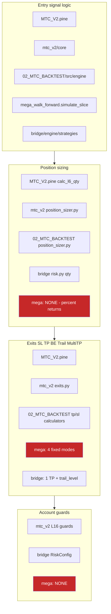

Red boxes: where the **promotion-deciding engine** has no equivalent of the production control.

---

# 5. Target architecture

## 5.1 Governing principles

1. **One kernel, many hosts.** Strategy economics live in exactly one Python package. Backtest, shadow, paper and live all *import* it. **A strategy-lifecycle rule not in the kernel does not exist** — account-level portfolio policy, allocation policy and execution-integrity rules deliberately live outside the kernel and are governed by §4.2.
2. **Intent is data, not code.** The kernel emits versioned intents. Every other layer consumes that data. This makes parity testable instead of aspirational.
3. **Strategies request risk; the portfolio allocates capital.** A strategy owns its risk appetite. It does not own a share of a shared account. *(New — C-7.)*
4. **Execution never invents economics.** The Bridge may reject, delay, or fail closed. It may never substitute a different quantity, stop, or target.
5. **The portfolio may refuse, not reshape.** In V2 the Guardian authorizes or rejects. Any future resizing is a versioned, backtested allocation policy — never a runtime adjustment. **[OWNER — Q16]**
6. **Anything that changes economics at runtime must be simulated identically.** Corollary, and the reason two Antigravity sub-rules are rejected (§12.3): transport health and correlation may **block**, never silently resize.
7. **Two trust domains.** Research holds no credentials. Execution is small, audited and authenticated. One owner-facing entry point is permitted; one process is not.
8. **Every no-trade state carries a machine-readable reason.** A blocked system and a quiet market must never look the same.
9. **Freeze by hash.** A promotable candidate is a content-addressed package. Different hash, different candidate, different evidence clock.

## 5.2 Target component diagram

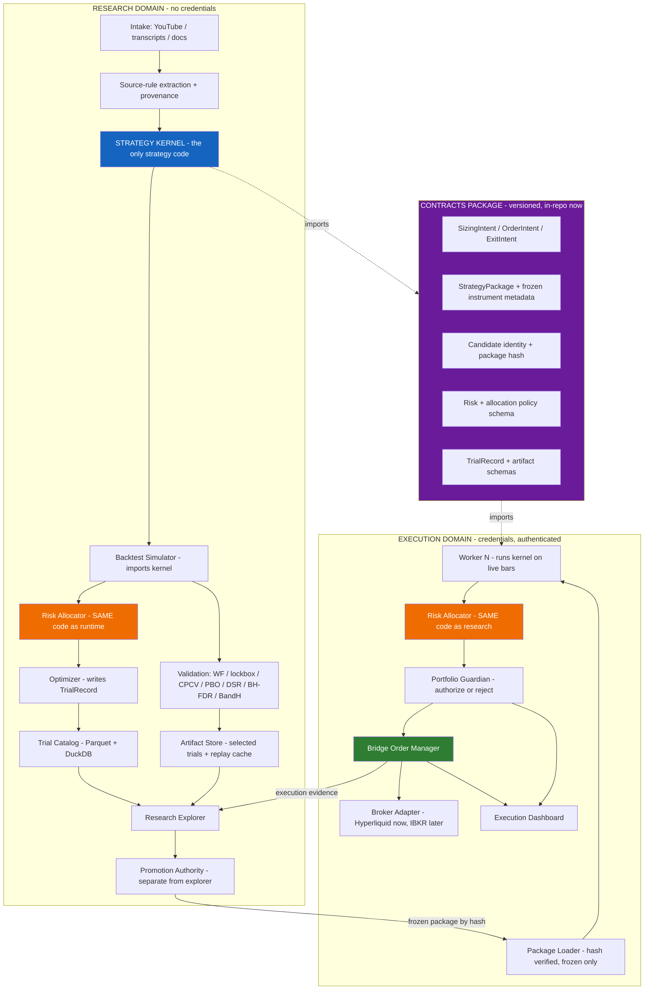

The two orange boxes are **the same code**. That is the mechanism, not a wish.

## 5.3 Strategy Kernel — reduced mandatory core

**[C-11]** The mandatory surface shrinks from ~50 config keys to **~30**. Nothing is deleted; capability moves from *always present* to *available when enabled*.

```
strategy_kernel/
  core/                          # MANDATORY - every strategy carries this
    types.py                     # Bar, Position, SizingIntent, OrderIntent, ExitIntent
    instrument.py                # FROZEN metadata: tick, lot, min_qty, min_notional, multiplier
    sizing.py                    # emits SizingIntent - ONE implementation
    stops.py                     # exactly one stop concept (ATR / percent / swing)
    targets.py                   # exactly one target concept (ATR / percent / R)
    lifecycle.py                 # single-position state machine, opposite-signal exit
    identity.py                  # candidate_id, package_hash, versions, provenance
    kernel.py                    # on_bar(bars, position, config) -> list[Intent]
  modules/                       # OPTIONAL, default OFF, individually testable
    targets_multi/               # Multi-TP: TP1 fraction + TP2 remainder
    breakeven/
    trailing/
    time_exits/                  # bars / EOD / EOW
    pyramiding/                  # adds, basket state, merge_pyramid_stop
    flip/                        # reversal behaviour
    filter_block_exits/          # the 9 toggles
    behaviour/                   # max trades/day, bar cooldown, equity-curve filter, MAE guard
    filters/                     # the 14 entry-filter families
    transforms/                  # confirmation, L18b, level retest
  signals/                       # producers: supertrend, range filter, keltner, research producers
```

**The rule that makes modules safe:** *if enabled, the exact same module code runs historically and at runtime.* Optional never means unsimulated.

**Why sizing, one stop and one target stay in core:** `RISK_AT_STOP` sizing is undefined without a stop, and a lifecycle with no target concept cannot express the most common source rule. Everything else genuinely can be a module.

## 5.4 Intent contracts

Three schemas, all versioned, all in the contracts package.

**`SizingIntent` — emitted by K.**

| Group | Fields |
|---|---|
| Method | `sizing_method` ∈ {`RISK_AT_STOP`, `FIXED_NOTIONAL`, `FIXED_QTY`, `VOLATILITY_TARGET`, `SOURCE_DEFINED`} |
| Request | `risk_request_pct` \| `notional` \| `qty` \| `vol_target_params` |
| Basis | `stop_price` (required for `RISK_AT_STOP`), `entry_reference_price` |
| Reference | **`allocator_reference_qty`** *(optional; replay, parity and audit only)* — produced by calling **the one shared Risk Allocator function** against the bound snapshot, never by a second sizing implementation living inside the kernel. **The kernel performs no independent account-quantity calculation at runtime, and this field is absent from production intents.** *(Renamed from `kernel_reference_qty` and redefined in the 2026-08-22 repair round — §0.3 item 5. The old name implied a second runtime recipe, which is exactly the F-2 defect one layer higher.)* |
| **Snapshot binding** | **`snapshot_id`** — content hash of the immutable `AccountSnapshot` (§5.5). RA must compute against the identical id or the intent is rejected `SNAPSHOT_MISMATCH`. |
| Provenance | `instrument_metadata_hash`, `kernel_version`, `snapshot_taken_at` |

**`OrderIntent` — produced by RA + P, consumed by B.**

| Group | Fields |
|---|---|
| Identity | `intent_id` (deterministic: `candidate_id + bar_ts + seq`), `candidate_id`, `package_hash`, `worker_id`, `revision` |
| Timing | `decision_bar_ts`, `emitted_at`, `valid_until_bar_ts` |
| Economics | `action` ∈ {`OPEN`,`ADD`,`REDUCE`,`CLOSE`,`MODIFY_STOP`,`MODIFY_TARGET`}, `direction`, `authorized_qty`, `qty_semantics` ∈ {**`DELTA`**, **`TARGET_TOTAL`**}, `qty_unit` ∈ {base, quote, contracts} |
| Authorization | `authorization` ∈ {`AUTHORIZED_AS_REQUESTED`, `REJECTED`}; **V2 has no `RESIZED` value** (Q16). `allocation_policy_version`, `snapshot_id` (must equal the `SizingIntent` value), `rejection_reason` ∈ {`SNAPSHOT_MISMATCH`, `SNAPSHOT_STALE`, `REFERENCE_DIVERGENCE`, `BUCKET_LIMIT`, `CORRELATED_EXPOSURE`, `EXPOSURE_LIMIT`, …} |
| Protection | `stop_price`, `stop_semantics` ∈ {**`STRATEGY_NATIVE`**, `STRATEGY_SYNTHETIC_PLUS_EMERGENCY_NATIVE`}; `tp_legs[]` each `{leg_id, price, qty_fraction, activation, oco_group}` |
| Reasons | `entry_reason`, `exit_reason`, `blocked_by[]` |

**[OWNER — Q7]** V2 sets `stop_semantics = STRATEGY_NATIVE`: the strategy's stop **is** the live reduce-only exchange order. It protects the position when the process or VPS is unavailable, and it is the simplest thing to reconcile.

**Where each half of that claim is proven (§0.4 RF-T2-3).** The **contract and its semantics belong to V2A** and stay there: placement, amendment and cancellation of a native reduce-only stop, and the identical backtest model of a continuously active protective order. But V2A's defining property is **zero orders and no venue contact**, so V2A proves the survival property **locally only** — against a deterministic adapter-emulator or replay, with a local process-kill/restart harness in which the emulator retains the protective order while the worker dies, using **no credentials and contacting no venue**. The claim "protection survives the process or VPS being unavailable **at a real exchange**" is proven in **V2B on testnet (WP-V2B-07)**, under the testnet gate. Neither proof substitutes for the other.

**[C-19]** `tp_legs[]` exists in the contract from V2. V2 *executes* a single leg end to end. Multi-leg execution is a V3 acceptance item.

`qty_semantics` and `stop_semantics` are the two fields most commonly assumed rather than stated, and both have cost real money in other systems. Both are mandatory and both are asserted in tests.

## 5.5 Sizing ownership — the change that makes multi-strategy safe

**The v1 model (superseded):** kernel computes final quantity; portfolio may scale it down.
**The v2 model [OWNER — Q1, Q16]:**

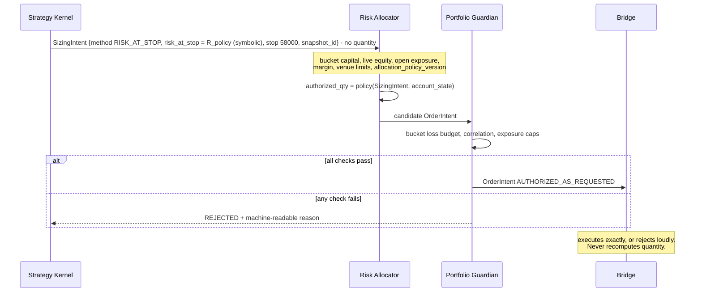

**Reading the `SizingIntent` in that diagram.** `R_policy` is a **symbolic placeholder for the risk-at-stop value the allocation policy defines**, carried with the intent and versioned by `allocation_policy_version`. It is deliberately **not** written as a literal percentage here, because **this document sets no vNext or `LIMITED_LIVE` risk-at-stop policy value**. The **0.5 % / 1.0 %** figures that appear in finding **F-2** (§2) are **current-state evidence of today's divergence** — observations of what the existing MTC and Bridge code already do — and are **not proposed vNext defaults**; nothing may be promoted from that evidence into a policy value. `R_policy` is also **a different quantity from the `LIMITED_LIVE` ≤ 1 % ceiling**: that 1 % is the **maximum capital allocated** to the first live strategy, whereas `R_policy` governs **loss-at-stop (risk-to-stop)**, which carries a **separate and lower cap that remains undefined and must be defined and evidenced before any live authorization** (owner clarification D-07, §0.5). Nothing in this example may be read as proposing a value for either cap; the example's purpose is only to show that **K states a risk request and a stop, and never a quantity**.

### The ownership words, defined exactly

**Correction applied in v2.1 (RF-4).** v2.0 left "requested" ambiguous and made the reference-quantity check a *test-only* tripwire. A test does not fail closed in production. The three roles are now defined so that only one component ever proposes a number.

| Component | Owns | Never does |
|---|---|---|
| **Kernel (K)** | **Requests risk.** Emits `SizingIntent`: method, risk percentage, stop, snapshot binding. **It computes no account quantity.** | Compute or propose an account quantity |
| **Risk Allocator (RA)** | **Proposes `AuthorizedQuantity`.** `authorized_qty = policy(SizingIntent, snapshot)` — deterministic, versioned, **one implementation**, identical code in backtest and runtime. | Change the strategy's risk request |
| **Portfolio Guardian (P)** | **Authorizes or rejects** the quantity RA proposed. | Produce a different number |
| **Bridge (B)** | **Executes or rejects** the authorized intent, exactly. | Recompute a quantity |

"Authorize in full or reject in full" therefore means: **P authorizes the quantity RA proposed** — never a quantity K proposed, because K never proposes one.

### Snapshot identity — the fail-closed rule

K and RA must compute against **the same immutable account snapshot**, or the intent is refused.

```
AccountSnapshot
  snapshot_id            : content hash of the fields below
  taken_at               : bar-close timestamp
  account_equity
  bucket_id + bucket_capital
  open_exposure
  margin_state
  instrument_metadata_hash
```

Binding rules:

1. **One snapshot per decision.** `SizingIntent.snapshot_id` and the RA computation must carry the **identical** `snapshot_id`. The snapshot is immutable once taken.
2. **Mismatch is a runtime STOP, not a test failure.** If `SizingIntent.snapshot_id != RA.snapshot_id`, the intent is **REJECTED** with machine-readable reason `SNAPSHOT_MISMATCH`, logged, surfaced on the dashboard, and **no order is submitted**. It is never reconciled by preferring one side.
3. **Staleness is also a STOP.** If the snapshot is older than a declared per-worker deadline at the moment RA computes, reject with `SNAPSHOT_STALE`.
4. **Divergence within one snapshot is a defect, not a policy.** With `snapshot_id`, `allocation_policy_version` and allocator code hash equal, a **deterministic recomputation of the same allocator function** must reproduce `authorized_qty` within a stated tolerance. It does not compare against a second sizing implementation — none exists. Divergence rejects with `REFERENCE_DIVERGENCE` **and** fails the parity test suite. Both, not either.
5. **Different-snapshot operation is not permitted in V2.** Any future design where K sizes against one snapshot and RA against another requires its own versioned allocation policy, its own simulation and its own parity evidence — it is not an implementation detail.

**Why this matters concretely.** Without rule 2, a kernel risk request formed against a $10,000 account snapshot and an allocator proposal computed against a $5,000 bucket snapshot (0.025 BTC) both satisfy the schema, and the Guardian stamps the result `AUTHORIZED_AS_REQUESTED` — a label that would then be false. That is precisely the class of silent divergence F-2 documents, reintroduced one layer higher.

### Four properties that make this safe

1. **The Risk Allocator is one implementation, imported by both the portfolio backtest and the live worker.** If it is not simulated, this design is worse than v1 — the entire force of ChatGPT report 1's objection, satisfied by construction rather than by policy.
2. **V2 has no resize path.** The allocator's V2 policy is *single-strategy pass-through*: allocate the requested risk percentage against the bucket's capital, then authorize in full or reject in full. No discretionary trim exists.

   **Scope of the no-resizing rule — owner clarification, 2026-08-22 (register D-02, §0.5).** This rule governs **new-order sizing**: no component may substitute a different quantity for the one the Risk Allocator proposed. It is **not** a prohibition on a **separately authorized** emergency **reduction or closure of existing exposure**. Such an action, if it is ever built, is a **distinct, explicit, tested safety policy** with a machine-readable reason and its own simulated equivalent — **never silent resizing**, and never a runtime discretionary trim of a new order. **This clarification authorizes neither its implementation nor its use**; the design belongs to the V3 allocation-policy work (§17.3, WP-V3-10) and is the *distinction* recorded as Appendix E **O-11**.
3. **Snapshot identity fails closed at runtime** (rules 1–5 above), and is additionally covered by a **D026 RED/GREEN acceptance case**: a deliberate snapshot-drift and bucket-capital-divergence fixture must be shown RED without the guard and GREEN with it, before the guard counts as evidence.
4. **The Bridge must fail if it computes a quantity while an authorized intent is present.** This is acceptance criterion **A-9** and it is the mechanical guarantee that F-2 cannot recur.

**Migration note.** Today's Bridge originates the quantity (`risk.py:380-381`). During V2 that code path becomes reachable only when **no** authorized intent is present — i.e. never, once workers run kernels. It is not deleted in V2; it is fenced by a test that fails if both paths are live.

---

# 6. Research-to-live lifecycle

## 6.1 Source profiles — replacing "naked"

**[C-8]** v1 called a strategy "naked" after substituting a standard stop. Three reviewers independently objected, correctly: a substituted stop means the result is no longer source-faithful, and attributing its performance to the original idea is a category error.

| Profile | Definition | What it can prove |
|---|---|---|
| **`SOURCE_LITERAL`** | Only rules explicitly present in the source. Missing rules stay `NOT_SPECIFIED`. | If exits are absent, it cannot produce a trade P&L at all — only signal-level evidence. |
| **`SIGNAL_EDGE`** *(evaluation profile, not a strategy)* | Applied when `SOURCE_LITERAL` cannot form a lifecycle. Measures the **signal**: N-bar forward returns, MFE, MAE, directional hit rate, signal frequency, regime behaviour, cost-adjusted directional edge. | Whether the *idea* contains information. |
| **`SOURCE_COMPLETED_BASELINE`** | `SOURCE_LITERAL` + the minimum standardized substitutes needed to make it executable, drawn from the versioned catalogue. | Whether it is tradable at all. |
| **`MTC_ENRICHED`** | Baseline + deliberately enabled optional kernel modules. | Whether enrichment adds anything beyond the idea. |

Comparison chain, with deltas recorded at each step:

```
SIGNAL_EDGE  →  SOURCE_COMPLETED_BASELINE  →  MTC_ENRICHED
```

This finally answers the question the current pipeline cannot: **did the original strategy contain edge, or did our own machinery create most of it?**

## 6.2 The Missing-Rule Ledger

```
missing_rules:
  - rule: STOP_LOSS
    source_says: "not specified in transcript at 14:22"
    substitute: kdef.stop.atr.v1
    substitute_catalogue_version: 1.0.0
    affects_promotion: true
    edge_dependency: UNKNOWN | SOURCE_DEPENDENT | SUBSTITUTE_DEPENDENT
```

Rules:
1. A missing rule is **recorded, never inferred silently**.
2. Substitutes come from a **fixed versioned catalogue** (`kdef.stop.atr.v1`, `kdef.tp.r2.v1`, `kdef.risk.research_policy.v1`, …). A researcher may not invent one per candidate — that is how a source-faithful test quietly becomes a bespoke optimization. **Catalogue identifiers for risk substitutes are deliberately nonnumeric.** Any numeric research-risk value is stated **explicitly in the trial/evaluation artifact** that used it, so the number is auditable per run; it is **research-only** and **never becomes a `LIMITED_LIVE` or vNext policy default**. Live risk-at-stop policy is set solely by the allocation policy under D-07 (§0.5, §5), not by this catalogue.
3. **[C-8] An incomplete source is never auto-rejected.** v1's lifecycle diagram rejected a candidate when `SOURCE_LITERAL` showed no edge. That is wrong: a signal with no exit rules has no P&L to show. Route it to `SIGNAL_EDGE` instead.
4. A candidate whose edge depends on the substitute rather than the source is labelled **`SUBSTITUTE_DEPENDENT`**, with sensitivity reported. Still promotable — the label follows it to production.
5. A missing rule **never** blocks progression to forward shadow. It **does** block live capital until the substitute has its own forward evidence.

## 6.3 The lifecycle

```mermaid
flowchart TD
    S1["1 Discovery - YouTube, transcripts, docs"] --> S2["2 Source-rule extraction + provenance"]
    S2 --> S3["3 SOURCE_LITERAL definition + Missing-Rule Ledger"]
    S3 --> DEC0{"Can it form a trade lifecycle?"}
    DEC0 -->|no| SE["3a SIGNAL_EDGE evaluation<br/>N-bar returns, MFE, MAE, hit rate"]
    DEC0 -->|yes| S4["4 Data quality + leakage checks"]
    SE --> DEC1{"Signal carries information?"}
    DEC1 -->|no| REJ["REJECTED - research note, evidence kept"]
    DEC1 -->|yes| S5
    S4 --> S5["5 SOURCE_COMPLETED_BASELINE"]
    S5 --> S6["6 MTC_ENRICHED - optional modules"]
    S6 --> FREEZE1["7 FREEZE baseline/enriched package_hash<br/>its own evidence clock starts"]
    FREEZE1 --> SHADOW["8 FORWARD_SHADOW on THAT hash<br/>live bars, zero orders"]
    FREEZE1 --> S7["9 Optimization - trial identities only<br/>TrialRecord catalog, no promotable package"]
    S7 --> S8["10 Walk-forward folds + lockbox"]
    S8 --> S9["11 Buy-and-hold + excess alpha"]
    S9 --> S10["12 DSR p>=0.95 + BH-FDR"]
    S10 --> S11["13 CPCV / PBO / parameter stability"]
    S11 --> AB{"14 A/B: signal vs baseline vs enriched"}
    AB --> FREEZE2["14b FREEZE each SELECTED optimized package<br/>NEW package_hash, NEW evidence clock"]
    FREEZE2 --> SHADOW2["14c FORWARD_SHADOW on the new hash<br/>the baseline window does NOT transfer"]
    SHADOW --> TPE{"15 TESTNET_PAPER_ELIGIBLE?"}
    SHADOW2 --> TPE
    TPE -->|safety criteria met| TESTNET["16 EXCHANGE_TESTNET execution fleet<br/>real order lifecycle, no real money"]
    TESTNET --> S12["17 Multi-strategy portfolio test"]
    S12 --> LC["18 LIVE_CANDIDATE - full statistics complete"]
    LC --> GATE["19 Signed live gate - owner"]
    GATE --> LL["20 LIMITED_LIVE - 1 strategy<br/>&lt;=1% of account as MAXIMUM ALLOCATED CAPITAL<br/>separate LOWER loss-at-stop cap: UNSET - blocks live authorization"]
    LL --> S16["21 Scale up / suspend / retire"]
    style SE fill:#ef6c00,color:#fff
    style FREEZE1 fill:#6a1b9a,color:#fff
    style FREEZE2 fill:#6a1b9a,color:#fff
    style SHADOW fill:#2e7d32,color:#fff
    style SHADOW2 fill:#2e7d32,color:#fff
    style TESTNET fill:#2e7d32,color:#fff
    style GATE fill:#c62828,color:#fff
```

**Step 20 read exactly (owner clarification D-07, §0.5).** The **≤ 1 %** at `LIMITED_LIVE` is the **maximum capital allocated** to that single strategy. It is **not** a loss budget and **no loss budget may be inferred from it**. **Loss-at-stop (risk-to-stop) carries a separate and LOWER cap. That cap is UNSET in this document, and it must be defined and evidenced before any live authorization — while it is undefined, step 19 is not signable and step 20 may not begin.** No number is invented for it here.

### The freeze rule, stated without contradiction

**Repaired 2026-08-22 (§0.3 item 3).** Earlier wording implied one freeze that both preceded optimization and survived it. It cannot: optimization changes parameters, and a parameter change mints a new hash (§6.7). The corrected rule has three parts and no exception:

1. **The baseline/enriched package freezes early** — step 7 — so a forward clock can start immediately on *that exact artefact*. It is a legitimate promotable candidate in its own right, and it is what step 8 shadows.
2. **Optimization does not produce a promotable package.** It produces **trial identities** (`trial_id`, `param_hash`, `evaluation_run_hash`) inside the catalog. A trial is an evaluation record, not a deployable artefact, and nothing may be promoted or shadowed directly from a trial row.
3. **Each *selected* optimized configuration is then frozen as a new package** — step 14b — receiving **its own `package_hash` and its own evidence clock, starting at zero.** The baseline's shadow window does **not** transfer to it. Two packages from one family therefore accumulate two independent forward records, which is exactly what §6.6 rule 3 requires.

The calendar win is real but narrower than v2.0 implied: it comes from starting a clock on the *baseline* while the statistics run, and from starting each optimized package's clock the moment it is selected rather than after the whole battery completes — not from carrying one window across a changing artefact.

## 6.4 Four forward environments — never conflated

**[C-9]** These produce different evidence and must be labelled distinctly in every promotion record.

| Environment | What runs | What it proves | What it does NOT prove |
|---|---|---|---|
| **`FORWARD_SHADOW`** | Live market data; kernel evaluates; **zero orders anywhere** | Out-of-sample signal behaviour on unseen bars, in real time | Nothing about fills, latency, rejects, or exchange behaviour |
| **`INTERNAL_PAPER`** | Locally simulated fills (`MockBroker`) | Bridge plumbing, state machine, restart/recovery | **Not** liquidity, slippage, or venue behaviour. Weakest execution evidence. |
| **`EXCHANGE_TESTNET`** | Real order lifecycle against the exchange test environment | Order acceptance, rejects, partial fills, protective-order behaviour, reconnects, reconciliation, backtest-vs-execution divergence | Real-money liquidity and adverse selection |
| **`LIMITED_LIVE`** | Real fills, tiny capital | Everything, at last | — |

## 6.5 Eligibility states

| State | Requirements | Consumes |
|---|---|---|
| **`SHADOW_ELIGIBLE`** | Deterministic rules; no unresolved lookahead; acceptable repaint behaviour; frozen package hash; data-quality checks passed | Nothing but CPU |
| **`TESTNET_PAPER_ELIGIBLE`** | All of the above **plus**: valid sizing semantics; valid protection semantics; Bridge-compatible lifecycle; reconciliation-safe execution; no catastrophic basic historical failure. **Does not require the full statistical battery.** | Exchange rate limits, reconciliation capacity, operator attention |
| **`LIVE_CANDIDATE`** | Full statistical battery complete (WF, lockbox, CPCV, PBO, DSR ≥ 0.95, BH-FDR, sensitivity) **and** sufficient forward evidence from shadow + testnet on the same `package_hash` | Owner review |
| **`LIMITED_LIVE_APPROVED`** | Signed live gate; all six preconditions evidenced | Real capital |

**[OWNER — Q17] Fleet sizing is capacity-driven, not a fixed number.** Start small and increase the testnet fleet only while exchange rate limits, event processing and reconciliation remain reliable. The binding constraints are measured, not guessed:

- shadow fleet: bounded by CPU and storage — effectively dozens;
- testnet fleet: bounded by exchange rate limits, worker isolation, reconciliation reliability and dashboard legibility;
- live: **one** strategy at ≤ 1 % of account as **maximum capital allocated** — loss-at-stop (risk-to-stop) carries a separate, lower cap that must be defined and evidenced before live authorization **[OWNER — Q11]**.

## 6.6 Shadow leakage rules — what makes the parallel clock legitimate

**[C-2 — the error v1 made.]** Running shadow in parallel with optimization is only sound if shadow observations cannot influence the strategy being observed. Five binding rules:

1. **Freeze first.** A `package_hash` is frozen *before* any shadow observation of it is collected. No exceptions. This applies identically to the early baseline package and to every optimized package selected later (§6.3) — each is frozen before it is watched.
2. **Timestamp the window.** `evidence_window_start` is recorded at freeze; every observation carries it.
3. **Never modify a running package.** Any code, parameter, module or substitute change mints a **new hash and a new clock**. The old window does not transfer.
4. **Mark contaminated data.** Shadow data reviewed by a human or an optimizer during the research phase is labelled `OBSERVED_DURING_RESEARCH` and is **navigational only** — it can never be cited as confirmation.
5. **Only untouched post-freeze periods count.** Confirmation evidence is the portion of the window nobody looked at while decisions were still open.

## 6.7 Candidate identity and evidence binding

**[C-6, and Antigravity §8 adopted as the hash formula]**

**Identity is split into three levels (repaired 2026-08-22, §0.3 item 4).** v2.0 folded `dataset_manifest_sha` into `package_hash`, which made the *deployable* identity change whenever a *research dataset* changed — so the same shipped strategy had several hashes, and live evidence could not accumulate against one of them.

```
candidate_id        = QLC-<yyyymmdd>-<8 hex of source-provenance hash>   # family lineage, STABLE

package_hash        = SHA256( spec_json                                 # DEPLOYABLE STRATEGY SEMANTICS ONLY
                            ‖ kernel_code_sha
                            ‖ exact_params_json
                            ‖ modules_enabled_json
                            ‖ substitute_catalogue_versions_json
                            ‖ instrument_metadata_json )
                                                                        # what actually runs on live bars

evaluation_run_hash = SHA256( package_hash                              # HOW IT WAS EVALUATED
                            ‖ dataset_manifest_sha
                            ‖ cost_model_json                           # fees, slippage model id, funding
                            ‖ simulator_class + simulator_version
                            ‖ evaluation_config_json )                  # folds, lockbox, seeds,
                                                                        # search regime, preregistered space

trial_id            = <evaluation_run_hash>.<param_hash>.<seq>          # one optimization trial
run_id              = <package_hash>.<environment>.<seq>                # one execution in one environment
```

**The binding rules:**

- **Deployable identity is `package_hash`.** It contains nothing about datasets, costs, simulators or evaluation configuration. Two evaluations of the same shipped strategy share it.
- **Every evaluation result — backtest, walk-forward, lockbox, CPCV, DSR/BH-FDR — is reported under an `evaluation_run_hash`**, and therefore always names its dataset, cost model, simulator and configuration. A dataset or cost-model change mints a new `evaluation_run_hash`; it does **not** mint a new package.
- **Forward and live evidence — shadow, internal paper, testnet, limited live — belongs to the exact `package_hash`**, because that is the artefact that ran. Its evidence clock is per package (§6.3, §6.6).
- **A change to anything inside `package_hash`** — parameters, modules, substitutes, kernel version, instrument metadata — **mints a new package, a new evidence clock, and invalidates the transfer of any prior forward window** (§6.6 rule 3).
- `candidate_id` aggregates packages **for navigation and family-level multiple-testing accounting only**.
- `package_hash` **and** the `evaluation_run_hash` that justified promotion are both stamped into the promotion decision artifact (§11.5); `package_hash` alone is stamped into `OrderIntent`, every fill record and every dashboard log line — full provenance from intake to live fill.

Antigravity's formula collapses candidate and package into one identifier. Adopted as the **`package_hash`** definition; `candidate_id` is retained separately, because without it family lineage and cross-package multiple-testing accounting are lost.

## 6.8 Reducing research steps without weakening gates

The acceleration is structural, not a relaxation:

- **Fast screen (hours):** `SOURCE_LITERAL` / `SIGNAL_EDGE` → data and leakage checks → buy-and-hold → `SHADOW_ELIGIBLE`. Deliberately weak statistically; it earns the right to be *watched*, which risks nothing.
- **Freeze the baseline and start its clock.** The *baseline/enriched* package hash is frozen here, not after the statistics. Optimization then produces trial identities only; each **selected** optimized package is frozen separately and starts its **own** clock at zero (§6.3).
- **Slow battery (days, batched overnight):** optimization → WF/lockbox → DSR/BH-FDR → CPCV/PBO → A/B → `LIVE_CANDIDATE`.
- **Testnet runs in parallel** once `TESTNET_PAPER_ELIGIBLE` safety criteria are met — which do **not** include the full statistical battery.

No statistical gate is weakened. The gates simply stop blocking two activities that risk no capital, and F-22 says exactly why that matters: **both discovery and calendar-time forward evidence are scarce, and only one of them can be bought with compute.** Running the slow battery and the forward clock in parallel is what lets the plan work on both at once.
---

# 7. MTC_V2 simplification decision

## 7.1 The owner's target, assessed

**[OWNER — Q1, Q5]** approved. Three corrections applied.

| Owner proposal | Verdict | Correction applied in v2 |
|---|---|---|
| Keep a small stable Python kernel with essential reusable position/exit behaviour | **Approved** | The kernel is a **new package that both engines are consolidated into** — not a trimmed copy of either. Consolidation means the semantics move; the old code is frozen as legacy and never deleted (Q5, Q13). Trimming `mtc_v2` alone would leave `02_MTC_BACKTEST/src/engine` alive and you would still have two. |
| Preserve advanced exits/filters/transforms as optional modules | **Approved** | Modules must be **counted and preregistered** — but the count does **not** enter the DSR calculation (C-10, §9.5). |
| Move account/portfolio kill switches to the Guardian | **Approved with a split** | Account-level (daily loss, max DD, consecutive losses, exposure) → Guardian. **Behavioural** limits (max trades/day, bar cooldown, equity-curve filter, MAE guard) stay in the kernel as modules — moving them would silently un-simulate them. |
| Retire unused WunderTrading active-path logic | **Approved — more urgent than framed** | It is not unused; it is a **live, unmonitored order path** (F-8). |
| Freeze the current implementation as legacy reference | **Approved** | Freeze by **git tag + content hash**, not folder rename. Zero tags exist today (F-17), so "frozen" currently has no mechanism. |

## 7.2 Are all current MTC_V2 capabilities still necessary?

Assessment of the ~200 keys in `mtc_v2/core/config.py`, **revised for the reduced core (C-11)**:

| Group | Keys | v1 verdict | **v2 verdict** |
|---|---|---|---|
| Sizing intent, one stop, one target, single-position lifecycle, opposite-signal exit, direction, identity | ~30 | core | **KEEP — mandatory core** |
| Instrument + execution profile | ~12 | core | **KEEP — moves to frozen package metadata** (closes F-2 Gap 3) |
| Multi-TP (`tp1_*`, `tp2_*`) | 3 | core | **MODULE** — contract carries legs from V2; execution V3 |
| Break-even | 3 | core | **MODULE** |
| Trailing | 4 | core | **MODULE** |
| Time exits (bars / EOD / EOW) | 5 | core | **MODULE** |
| Pyramiding / `max_entries` / basket | ~4 | core | **MODULE** |
| Flip / reversal / regime lock | ~3 | core | **MODULE** |
| Filter-block exits | 9 | module | **MODULE** — master toggle documented but unenforced (`config.py:131-135`); fix or delete the comment |
| Entry filters (14 families) | ~55 | module | **MODULE** |
| Transforms (confirm, L18b, level retest) | ~20 | module | **MODULE** |
| Behavioural limits (max trades/day, cooldown, recovery, equity-curve, MAE) | ~14 | split | **MODULE (kernel)** — simulated, never moved to the Guardian |
| Account guards (daily loss, max DD, consecutive losses) | ~6 | Guardian | **GUARDIAN** |
| Candle pattern + level proximity gates | 6 | module | **MODULE** |
| `tw_*` TradingView-parity research knobs | 7 | retire | **RETIRE** — `config.py:56-58` states they have *"no runtime impact until semantic owners are implemented"*. Dead switches on a protected surface are a liability. |
| `wt_*` WunderTrading | 13 | retire | **RETIRE [OWNER — Q3]** |

**Result: mandatory core ≈ 30 keys; optional modules ≈ 130; retired ≈ 20.** A real reduction of the *mandatory* surface with no researched capability lost.

## 7.3 `02_MTC_BACKTEST` — harvest then freeze

**[OWNER — Q5]** approved: harvest useful components, freeze the duplicate engine as legacy, do not delete.

**Harvest list** (best implementations of these concerns in the repository):

| Component | Path | Lines | Destination |
|---|---|---|---|
| Fee model | `src/engine/fee_model.py` | 347 | Simulator cost layer |
| Precision / rounding | `src/common/precision.py` | 344 | Kernel `instrument.py` |
| Timeframe handling | `src/common/timeframes.py` | 369 | Shared utilities |
| Fill semantics | `src/engine/fills.py` | 556 | Simulator fill layer |

**Do not harvest:** the Streamlit app (a fifth UI surface, coupled to its own engine), `optimizer_v0/search.py` (superseded by the `TrialRecord` contract, §11.1), or `engine/mtc_runner.py` itself.

**[C-6 / ChatGPT 1 §6] Harvesting is not merging.** Before any component moves, a **capability canonicalization table** must be completed for every economically meaningful capability:

| Field | Content |
|---|---|
| Capability | e.g. position sizing |
| Implementation A behaviour | `mtc_v2` semantics, cited to line |
| Implementation B behaviour | `02_MTC_BACKTEST` semantics, cited to line |
| Pine reference behaviour | cited to line |
| Disagreement | exact nature |
| **Desired canonical semantics** | decided, with reasoning |
| Chosen implementation | which code is reused, or "new" |
| Golden fixture | the scenario that pins it |

Order: **define the contract → characterize the old implementations → select semantics → reuse the best code if suitable → test.** Never "blend A and B until the tests pass". The kernel must be a deliberate definition of the trading model, not an accidental synthesis of history.

---

# 8. Pine-versus-Python decision

## 8.1 Verdict

**[OWNER — Q3]** ratified: **Python is canonical; Pine becomes visualization and observational divergence monitoring only, with all order-routing capability removed.**

Supporting evidence, stronger than the input documents stated:

- **Parity status is corpus-dependent and the corpora are not established as comparable** (F-7): 27/58 strict TW=Python on cases 103–162, against 437/439 on the 457-case `mtc_backtest` suite. Whatever the resolution, the current "two authoritative implementations" model has **no single accepted parity record** — and a model that cannot state its own parity in one number is not delivering two agreeing implementations. If the leading hypothesis holds (different Python implementations), the picture is worse for the *kernel*: the engine being retired scores 99.54 %, the one being kept scores 47 %.
- Pine can never be imported by the simulator *and* the live worker. Python can. That is what turns parity from aspiration into structure.
- `MTC_V2.pine:2020,2028` currently emits live order routing (F-8). "TradingView must not become a second controller" is not a principle to state; it is a defect to close.

**Precondition, restated and now satisfied by sequencing.** v1 said Python cannot be *appointed* canonical while `position_sizer.py` disagrees with Pine on `contract_multiplier` and `min_notional`. The two-milestone migration (Q15) resolves this properly: `LEGACY_COMPATIBLE` appoints the kernel while reproducing existing behaviour exactly; `CORRECTED_VNEXT` then closes F-2 Gaps 1–3 as documented, falsification-tested changes under a new semantic version. The defect is neither carried silently nor fixed invisibly.

## 8.2 Complexity, benefits, failure modes

| | Detail |
|---|---|
| **Benefit** | One implementation to test, audit and change. Removes the corpus-dependent parity ambiguity (F-7) from the critical path, along with an entire class of "which one is right" investigations. |
| **Benefit** | Python is importable by simulator, allocator and live worker → structural parity. |
| **Benefit** | An independent implementation that can only *complain* is a cheap, high-quality cross-check. |
| **Complexity** | Generating Pine from a Python spec is a real project (~2–4 weeks) and only pays off across many TradingView-hosted strategies. **[REC]** do not build a generator in V2; hand-maintain Pine for the 1–3 strategies you actually want to see, headed `VISUALIZATION ONLY — NOT A CONTROLLER`. |
| **Failure mode 1** | *Silent divergence.* Pine drifts; you make decisions from a chart that no longer matches production. **Mitigation:** the divergence alarm is a **scheduled comparison with a threshold and a notification**, not a human glancing at a chart. |
| **Failure mode 2** | *Second controller returns.* Someone repopulates the routing fields, or an old copy survives. **Mitigation:** delete the `alert()` **emission**, not merely the codes. A file with no `alert(` cannot route an order regardless of configuration. CI grep guard with an allowlist that is empty by default. |
| **Failure mode 3** | *Loss of an independent oracle.* TradingView's broker emulator is the only place your strategy has been executed by someone else's independent code. **Mitigation:** keep `12_PARITY_PINETS` frozen as a historical oracle corpus and use it as a kernel regression set — read-only, never regenerated. |

## 8.3 De-fanging TradingView — the concrete steps

**[OWNER — Q3]** approved **as a decision**. **This document does not authorize the change** (repaired 2026-08-22, §0.3 item 14).

Removing the Pine `alert()` emissions is a **routing and behaviour change on a protected surface**: it deletes the only live order path that exists outside the Bridge. Q3 settles *what should happen*; it does not settle *that it may be executed now*. Before any edit to `MTC_V2.pine` or `mtc_v2/core/config.py`:

- the change needs its **own T0 authorization from the owner**, naming the exact files and lines;
- it needs its **own audit round and acceptance record**, like any other protected-surface change;
- the freeze tag (step 1) must exist first, so the controller is recoverable;
- and the CI guard (step 6) must be able to fail, proven by a deliberate violation, before it counts as protection.

The steps below are the **design** for that change, not a work order:

1. Freeze the current file by tag: `legacy/mtc-v2-pine-controller-2026-08-21`. History preserved per the standing instruction not to delete capability.
2. Copy to `visualization/MTC_V2_VIEW.pine` with a header stating it is not a controller.
3. **Delete lines 2020 and 2028** (`alert(...)` emissions) from the visualization copy.
4. Delete the 13 `wt_*` inputs from the visualization copy, and the 13 dead `wt_*` keys from `mtc_v2/core/config.py:226-238`.
5. Delete the 7 inert `tw_*` keys (`config.py:56-58`) in the same change.
6. Add a repo-guard check: any `.pine` file containing `alert(` must appear in an explicit allowlist, empty by default; CI fails otherwise.
7. Register the divergence alarm as a scheduled job with a threshold and a notification path (§12.3).

---

# 9. Backtest/live parity design

## 9.1 The parity principle

> **Every production control is either (a) executed by kernel or allocator code that the simulator imports, or (b) named in an explicit `UNSIMULATED_CONTROLS` manifest shipped with every backtest artifact.**

There is no third category. Today every control in the F-3 table sits in an implicit third category: enforced in production, absent from the research model, mentioned nowhere in the artifact.

**Corollary (Principle 6, §5.1):** anything that changes economics at runtime must be simulated identically. This is why two Antigravity sub-rules are rejected in §12.3 — feed staleness and correlation breach may **block**, never silently resize.

## 9.2 How each production control is reproduced

| Control | Simulation approach | Note |
|---|---|---|
| Sizing intent | Kernel `sizing.py`, identical code | |
| **Authorized quantity** | **Risk Allocator proposes it, identical code, inside a `PortfolioSimulator`; the simulated Guardian authorizes or rejects** | The seam that makes multi-strategy backtests honest. Vocabulary is fixed: **RA proposes · Guardian authorizes or rejects · Bridge executes or rejects** |
| Leverage caps | Kernel internal cap in K; account cap in the simulated Guardian | Three distinct caps, distinctly named |
| Initial SL | Kernel; simulator checks intrabar touch | **Gap modelling added:** if `open` is already beyond the stop, fill at `open`, not at the stop. Today mega fills at the stop regardless (F-3) — the most optimistic assumption in the pipeline |
| TP (single) | Kernel; simulator fills on touch | |
| Multi-TP | Kernel module emits legs; simulator fills each leg tracking remaining quantity | Requires **partial position state**, which mega cannot represent at all |
| Break-even | Kernel module emits a stop revision; simulator applies at bar close | Tighten-only, matching the Bridge's monotonic rule |
| Trailing | Kernel module emits revisions per bar | |
| Same-bar stop/target collision | **Explicit configured policy**: `STOP_FIRST` (recommended default), `TARGET_FIRST`, or `SUBBAR_UNKNOWN → mark trade ambiguous` | mega hardcodes stop-first by check order (lines 731/745) without naming it. Name it; put it in the artifact |
| Opposite-signal / filter-block / time exits | Kernel core and modules | |
| Behavioural limits | Kernel modules | |
| Account guards (daily loss, max DD, consecutive, exposure) | **`PortfolioSimulator`** wrapping per-strategy simulation, using the same Guardian policy objects as production | |
| Correlation limits | Simulated in `PortfolioSimulator` as a **veto**, matching runtime (§10.3) | |
| Fees | Real venue fee schedule from the frozen package, maker/taker aware | Replaces flat `COST_BPS = 8.0` |
| Slippage | **In the fill path**, as a model with a documented parameter | Post-hoc stress retained as an *additional* metric |
| Funding (perps) | Applied per funding interval to open positions | Bridge already has a `funding_events` ledger (v6). Same schedule both sides |
| Exchange minimums / precision | Frozen instrument metadata from the package | Closes F-2 Gap 3 |
| Native stop semantics | Simulated as a continuously active protective order | **[OWNER — Q7]** `STRATEGY_NATIVE`. Proof is staged (§5.4, §0.4 RF-T2-3): **V2A proves placement/amend/cancel semantics and process-kill survival locally**, against a deterministic adapter-emulator or replay with no credentials and no venue contact; the **real exchange-native drill runs on testnet in V2B (WP-V2B-07)** |
| Reconciliation, partial fills, restart recovery, order identity | **Not simulated — correctly** | Execution-integrity properties, not economics. Listed in `UNSIMULATED_CONTROLS` with the reason "execution integrity; no economic effect when functioning correctly" |

## 9.3 Kernel Economic Golden Suite

**[C-12]** v1's gate — the 858/858 entry golden plus one parity case — is **insufficient** to bless a kernel replacing five implementations. A kernel can reproduce every entry signal perfectly while changing sizing, stops, targets, break-even, trailing, pyramiding, time exits, fees and fill semantics. F-7 establishes that parity status is corpus-dependent and not yet comparable across corpora, so no existing corpus can serve as the acceptance gate on its own.

**[RF-1 consequence]** Corpus B (`parity_suite_350`, 457 cases, 437/439) is a **substantial existing lifecycle regression corpus** and must be treated as an asset, not overwritten. Where its cases overlap a golden family below, its recorded expectations are candidate fixtures — subject to the Parity Corpus Inventory establishing which implementation and version they describe, and to the 121 reused (non-executed) passes being excluded from any acceptance count.

Before the kernel is declared canonical, build small deterministic scenario fixtures covering **at least the 25 families below** — families 1–17 from v2.0, families 18–25 added in v2.1. **Twenty-five is the current binding count everywhere in this document**; any surviving "17-family" phrasing elsewhere is stale and 25 governs.

| # | Scenario family | Pins |
|---|---|---|
| 1 | Entry signal | the existing 858/858 golden — explicitly labelled **ENTRY SIGNAL GOLDEN**, not "complete strategy golden" |
| 2 | Direction / flip / regime lock | |
| 3 | **Position sizing** | risk-at-stop arithmetic |
| 4 | **Contract multiplier** | F-2 Gap 1 |
| 5 | **Minimum notional** | F-2 Gap 2 |
| 6 | **Rounding / qty step / min qty** | F-2 Gap 3 |
| 7 | SL calculation (ATR / percent / swing) | |
| 8 | TP calculation (ATR / percent / R) | |
| 9 | Multi-TP lifecycle incl. **partial TP1 fill** | |
| 10 | Break-even trigger and buffer | |
| 11 | Trailing activation and monotonicity | |
| 12 | Opposite-signal exit | |
| 13 | Time exit (bars / EOD / EOW) | |
| 14 | **Bar gaps through the stop** | the optimism in F-3 |
| 15 | **Same-bar SL/TP collision** | the unnamed policy in F-3 |
| 16 | Pyramiding / add / partial reduction | if retained |
| 17 | Fees, slippage, funding | |

**Families 18–25, added in v2.1** from the Codex audit design review (§7 Q2) and RF-4. The auditor's verdict was that 17 families are *a strong minimum, not enough to bless replacement of five implementations*. Accepted:

| # | Scenario family | Pins |
|---|---|---|
| 18 | **Snapshot drift / bucket-capital divergence** | RF-4. **D026 RED/GREEN required:** the fixture must be RED without the `SNAPSHOT_MISMATCH` guard and GREEN with it |
| 19 | **Allocator ↔ Guardian boundary** | authorize-or-reject with no resize path; `REFERENCE_DIVERGENCE` behaviour |
| 20 | **Short-side symmetry** | every long-side family mirrored; asymmetry must be deliberate and named |
| 21 | **NaN / zero / boundary precision** | zero stop distance, zero equity, quantity exactly at `min_qty`, notional exactly at `min_notional`, price at tick boundary |
| 22 | **Duplicate and reordered bars** | idempotent bar handling; a replayed bar must not re-emit an intent |
| 23 | **Cancellation and revision ordering** | monotonic stop revisions; stale-revision rejection |
| 24 | **`OrderIntent` idempotence** | the same `intent_id` submitted twice yields one economic effect |
| 25 | **Venue and session edge cases** | session boundaries, EOD/EOW rollover, funding-interval boundaries, venue minimum changes |

**Where implementations disagree, do not pick the easiest to migrate.** Procedure: *detect disagreement → document it → decide intended semantics → create an approved fixture → make the kernel satisfy the fixture.* The kernel reproduces **approved economics**, not one historical implementation.

## 9.4 Historical artifact classification

**[C-15]** v1 said all historical DSR/CPCV results are signal screens. Directionally right, too broad: shortlisted producers were additionally run through `MTCRunner` with a light-risk profile (`07_...RULES.md` §2 step 10), which models materially more than `simulate_slice`.

Every historical result is stamped with a lineage class:

| Class | Meaning |
|---|---|
| `SIGNAL_SCREEN_ONLY` | `mega_walk_forward.simulate_slice` — no sizing, no guards, no filters, post-hoc slippage |
| `PARTIAL_EXECUTION_MODEL` | `MTCRunner` light-risk profile — risk ON, filters/guards OFF |
| `FULL_KERNEL_SIMULATION` | New kernel + simulator, all enabled controls simulated |
| `PORTFOLIO_SIMULATION` | Above, plus `PortfolioSimulator` with allocator and Guardian |
| `UNCLASSIFIED` | Provenance not established — usable for navigation only |

Each record carries: simulator name and version, controls simulated, controls absent, fill and cost assumptions, and whether the result remains usable. This preserves valid historical work instead of discarding it wholesale.

**[OWNER — Q14]** Regardless of class, **no historical result below `FULL_KERNEL_SIMULATION` is a capital-ready performance estimate.**

## 9.5 Multiple testing, complexity and module count

**[C-10]** v1 proposed feeding `modules_enabled_count` into the DSR trial count. Two reviewers objected on statistical grounds and are right: module count is not equivalent to an independent trial. Three enabled modules over 200 parameter combinations is a far larger search than six fixed boolean modules at one configuration.

The corrected method:

1. **Preregister the complete search space** before the run, including which optional-module combinations will be explored.
2. **Count every configuration actually tried** — parameter combinations × module combinations × adaptive trials × repeated research iterations.
3. Apply **DSR and BH-FDR against the real trial family** at the existing `p ≥ 0.95` threshold (`mega_walk_forward.py:1695`).
4. Report **`modules_enabled_count` separately** as a complexity and interpretability metric, and optionally as a `STRATEGY_COMPLEXITY_SCORE` used for promotion ranking — never as an informal statistical penalty.
5. **Module-selection searches require nested validation or fresh lockbox evidence.** Choosing which modules to enable *is* a search, and it consumes the same statistical budget as choosing parameters.

## 9.6 The three parity tests

Run in CI; each must be capable of failing, and each must be shown RED against a deliberate mutation before it counts as evidence (repo rule **D026**, `AGENTS.md`).

1. **Kernel determinism.** Same bars + same config + same seed → byte-identical intent stream. Hash the stream.
2. **Simulator↔Worker equivalence.** The same historical bar sequence, fed to the backtest simulator and to a live worker in replay mode, must produce **identical `OrderIntent` streams** — including allocator output. This is the test that makes the architecture true. Nothing equivalent exists today.
3. **Execution divergence report.** Per live trade: intended vs authorized vs accepted vs filled price/quantity/time, with slippage attribution. The Bridge already stores enough to produce this; it is not surfaced.

---

# 10. Multi-strategy and portfolio design

## 10.1 The Risk Bucket

One abstraction, instantiated per trading style. Not three screens.

```
RiskBucket
  bucket_id            : "day" | "swing" | "position" | ...
  capital_allocation   : % of account equity
  max_gross_exposure   : % of bucket capital
  max_bucket_leverage  : multiple
  max_daily_loss       : % of bucket capital
  max_drawdown         : % of bucket capital, with a defined peak reference
  max_concurrent       : integer
  correlation_cap      : max pairwise |rho| among active members
  session_rule         : none | flat_at_<utc_time> | flat_at_week_end
  evaluation_cadence   : bar close on the bucket's timeframe set
  members[]            : candidate_id + package_hash + weight
  venue_binding        : Hyperliquid subaccount / IBKR account
  allocation_policy_version
```

Screens, risk budgets and strategy groups all fall out of this one record. Adding "crypto majors" or "equity swing" later costs one config row, not one screen.

**Starting values — [OWNER — Q18]: an initial simulation hypothesis, not a live decision.**

| Parameter | Day | Swing | Position | Status |
|---|---|---|---|---|
| Capital allocation | 30 % | 50 % | 20 % | **Hypothesis — calibrate from measured evidence** |
| Timeframes | 5m / 15m | 1h / 4h | 1D | Reasonable |
| **Max bucket leverage** | **1×** | **1×** | **1×** | **[OWNER] every bucket starts at 1×.** Antigravity's proposed 2.0× for the day bucket is **rejected**: it contradicts the current envelope (`config/bridge.yaml`: `max_leverage: 1`, `max_effective_leverage: 1.0`) and no evidence supports it |
| Session rule | flat at 23:45 UTC, zero overnight | weekend hold permitted | multi-week hold | Adopted — the intraday-flat rule is genuinely useful for a day bucket |
| Max drawdown halt | 3 % → 24 h halt | 6 % → 48 h halt | 10 % → review | **Hypothesis — calibrate** |
| Trailing evaluation | 5m/15m close | 1h/4h close | 00:00 UTC close | Adopted |

**Global portfolio overlay (hard invariants, all `[OPEN]` pending calibration):** combined gross leverage ≤ 1.5×; minimum liquidation distance ≥ 25 %; portfolio daily loss ≤ 2.5 %. These are Antigravity's proposed numbers and are recorded as **defaults to calibrate**, not as policy.

## 10.2 Portfolio Guardian — V2 contract

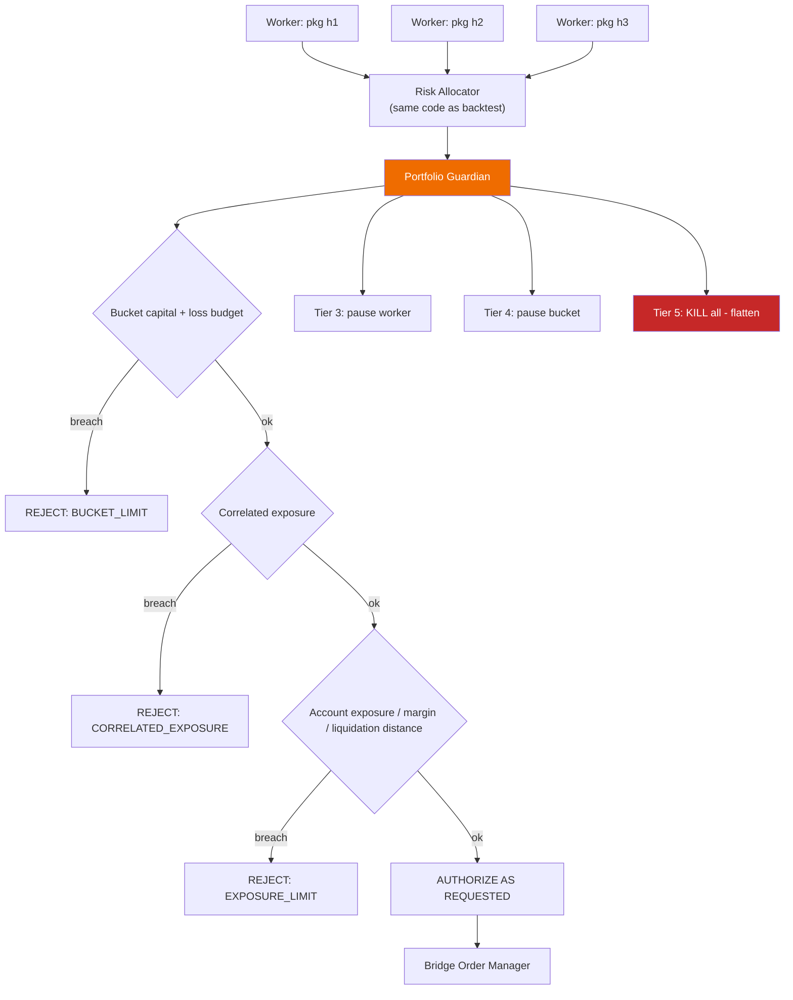

**[OWNER — Q16] V2 rules:**

1. **Authorize in full, or reject in full.** No resizing. There is no `RESIZED` authorization value in the V2 `OrderIntent` schema.
2. **Never increase size or widen a stop**, in any version.
3. **Fail closed.** No fresh account truth → no new entries. Existing native protective orders remain live at the venue.
4. **Every rejection carries a machine-readable reason** and appears in the decision stream and the dashboard.
5. **Guardian state is simulated** in `PortfolioSimulator` using the same policy objects, so a portfolio backtest reflects portfolio behaviour.
6. **Future resizing is a separately versioned `PortfolioAllocationPolicy`** with its own historical simulator, runtime implementation and parity tests — introduced no earlier than V3, and never as a runtime adjustment.
7. **What rule 1 covers — owner clarification, 2026-08-22 (register D-02, §0.5).** Rules 1 and 6 are about **sizing a new order**. They do **not** prohibit a **separately authorized emergency reduction or closure of existing exposure**. Any such capability is a **distinct, explicit, tested safety policy** — versioned, simulated, reason-carrying and separately authorized — and is **never** silent resizing. **Nothing here authorizes it to be built or used**, and no such capability exists in V2. The general question of whether reducing *existing* exposure may be treated differently from sizing *new* entries is Appendix E **O-11**, whose **distinction is now resolved** by this clarification while the **policy design remains open** under WP-V3-10.

**Worker isolation — [OWNER — Q4] HYBRID:**

| Environment | Isolation |
|---|---|
| `FORWARD_SHADOW` (large fleet) | **Shared isolated workers** — in-process tasks with enforced state separation. No orders, so a fault cannot move money. Cheap enough to run dozens. |
| `EXCHANGE_TESTNET`, `INTERNAL_PAPER`, `LIMITED_LIVE` | **One OS process per strategy or per risk bucket.** Real isolation, independently restartable, no container runtime to operate. |

**Account binding — [OWNER — Q6]:** decide after Package 7's official Hyperliquid verification, then prefer **one subaccount + separate API/agent wallet per independent strategy or risk bucket** where reliably supported. Fallback (virtual books inside one account) must be specified before it is needed, not during an incident.

## 10.3 Preventing false diversification

Three mechanisms, cheapest first. All three simulated in `PortfolioSimulator`.

**1. Promotion-time correlation gate.** Pairwise correlation of daily strategy returns, and — more sharply — **entry-timestamp overlap**, between a candidate and every current bucket member. Above threshold, the candidate competes for the *same* member slot rather than adding a new one.

**2. Family clustering.** Strategies from the same source, producer or parameter neighbourhood share a `family_id`; a bucket caps members per family. `STRATEGY_RESEARCH_REGISTRY.json` and `TAG_DICTIONARY.json` already carry the taxonomy to seed this.

**3. Runtime correlation gating** *(new in v2 — Antigravity §3, adopted with one rejection)*:

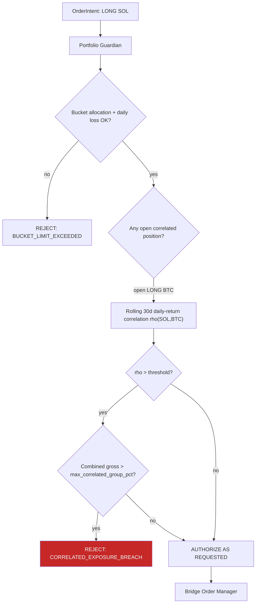

- Rolling 30-day daily-return correlation matrix across traded instruments, refreshed once daily at a fixed UTC time.
- If Strategy A requests `LONG X` while Strategy B holds `LONG Y` and ρ(X,Y) exceeds the threshold, combined gross exposure is treated as **one position** and bounded by `max_correlated_group_pct`.
- **REJECTED sub-clause:** Antigravity's "Downsize Intent Qty to Fit Remaining Cap". Silent trimming violates Principle 6 and Q16. Correlation breach → **reject**, or (later) an explicitly simulated allocation policy.
- **`[OPEN]` defaults:** ρ = 0.70 and `max_correlated_group_pct` = 25 % are Antigravity's proposals. Recorded as starting values requiring calibration against your own instrument set, not as policy.

**4. Live correlation monitor.** Rolling realised correlation of live P&L. The only one of the four that catches regime-driven convergence between strategies that were uncorrelated in-sample.
---

# 11. Visual backtest and optimization explorer

## 11.1 The `TrialRecord` contract comes before any optimizer choice

**[C-3 — an error in v1.]** v1 recommended adopting Optuna partly because it is already installed. That reasoning is unsound: switching from exhaustive grids to adaptive search changes which trials are selected, reproducibility, the multiple-testing family, parallel execution behaviour and search-space coverage — and therefore changes **DSR and BH-FDR interpretation** (F-22, `mega_walk_forward.py:1695`).

Corrected sequence:

1. **Define `TrialRecord` as an optimizer-independent contract** in the contracts package.
2. **Both** the current grid engine and any Optuna-based engine write the same contract.
3. **Compare the two search regimes on frozen strategies and frozen datasets**, measuring: trials to reach the same best OOS metric, coverage of the space, reproducibility under re-run, and the resulting DSR/BH-FDR family size.
4. Only then decide whether Optuna becomes the primary optimizer.

Nothing about the explorer depends on that decision — which is the point of putting the contract first.

## 11.2 Scalable artifact model

**Tier 1 — Trial Catalog (every trial, always).** Columnar Parquet, partitioned:

```
trials/run_id=<...>/strategy=<...>/symbol=<...>/timeframe=<...>/part-000.parquet
```

| Column group | Columns |
|---|---|
| Identity | `run_id`, `candidate_id`, `package_hash`, **`evaluation_run_hash`** (§6.7 — carries dataset, costs, simulator and evaluation configuration), `trial_id`, `param_hash`, `exit_mode` |
| Search lineage | `search_regime` (grid \| tpe \| random), `preregistered_space_hash`, `trial_index_in_family`, `family_size` |
| Parameters | one typed column per parameter (sparse, nullable) |
| Modules | `modules_enabled[]`, `modules_enabled_count` |
| Fold metrics | `fold_test_returns[]`, `fold_test_sharpes[]`, `fold_test_trades[]` |
| Lockbox metrics | `lockbox_return_pct`, `lockbox_sharpe`, `lockbox_maxdd`, `lockbox_trades`, `lockbox_pf`, `lockbox_expectancy_R`, `lockbox_win_rate` |
| Benchmark | `bh_return_pct`, `excess_alpha` |
| Statistics | `dsr_p_value`, `dsr_robust`, `bh_fdr_survivor`, `cpcv_pass_ratio`, `pbo` |
| Cost sensitivity | `net_after_slippage_pct`, `fee_bps_used`, `slippage_model_id` |
| Lineage | `simulator_class` (§9.4), `unsimulated_controls_hash` |
| Gate outcome | `classification`, `rejection_reasons[]` — **the "why was it rejected" column** |
| Flags | `is_pareto`, `is_top_k`, `is_robust`, `is_promoted`, `is_pinned`, `has_full_artifacts` |

**Size:** ~70 typed columns × 100,000 trials ≈ **10–25 MB Parquet** with dictionary encoding. Today's equivalent for a *single* iteration is 5.14 MB of unqueryable JSON. Strictly better in both size and capability.

**Tier 2 — Full Artifacts (selected trials only).**

```
artifacts/<package_hash>/
    trades.parquet        # entry/exit ts, price, qty, R, reason, MAE, MFE
    equity.parquet        # equity + drawdown + run-up
    intents.jsonl         # the OrderIntent stream - the parity evidence
    levels.parquet        # SL / TP1 / TP2 / BE / trail level per bar
    manifest.json         # package hash, data hash, kernel version, simulator class,
                          # UNSIMULATED_CONTROLS, allocation_policy_version
```

**Selection rule:** top-K by objective (K ≈ 20 per strategy×symbol×timeframe), the **Pareto front** on (return, max DD, trade count), everything `robust_final`, everything promoted, plus **anything the user pins**.

**Candles are never duplicated.** OHLCV is stored once per (symbol, timeframe) in the data bundle and referenced by hash. The chart joins trades to candles at read time.

**[OWNER — Q9] Retention: 20 GB budget, deterministic replay, explicit retention policy.**

- Full artifacts are evicted LRU beyond the budget, **except** promoted, pinned and Pareto trials, which are never evicted.
- The required historical datasets and engine versions to replay any retained trial are themselves retained.
- Eviction is logged; nothing disappears silently.

## 11.3 Deterministic replay — resolving the v1 contradiction

**[C-5 — an error in v1.]** v1's acceptance criterion A-13 promised any of 100,000 trials chartable in three clicks while storing full artifacts for ~200. Both are only possible with replay.

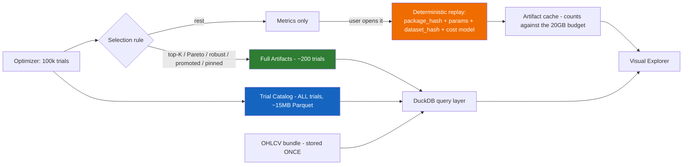

Guarantees, stated separately:

- **Every trial is immediately locatable and filterable** from the catalog.
- **Selected trials open immediately** from materialized artifacts.
- **Non-materialized trials trigger deterministic replay** using the exact kernel code hash, parameters, dataset hash and cost model, then are cached.
- **A maximum replay-time target is defined** (proposal: ≤ 60 s for a single strategy×symbol×timeframe; measured, then fixed).
- Replay is only possible because the kernel is deterministic (§9.6 test 1) — the same property that makes parity testable makes storage cheap.

## 11.4 Explorer, in two levels

**[C-21 / ChatGPT 1 §7]** v1 put the whole explorer in V3. Split it: the minimum viewer has immediate operational value once the catalog exists, and it reduces your dependence on AI-written morning summaries.

**MINIMUM EXPLORER — Phase 0 / V2.** A **research-domain, read-only viewer** over the trial catalog. It holds no credentials, touches no execution surface, and is **not** a change to the execution dashboard — which is why Phase 0's "no execution-dashboard rework" non-goal (§17.1) does not exclude it.

- strategy / symbol / timeframe filters
- candidate ranking table with `classification` and `rejection_reasons`
- exact parameter values for any row
- key statistics
- equity curve and drawdown curve
- basic candlestick chart with entry/exit markers
- direct navigation between variants

**ADVANCED EXPLORER — V3**

- **Parallel coordinates** — all tested parameters on vertical axes terminating at `OOS_Sharpe` and `dsr_p_value`; brush-and-select on any axis filters non-viable clusters
- **3-D parameter response surface with heatmap slicing** — Parameter A × Parameter B × OOS Sharpe, with:
  - **Plateau detection (robustness):** broad flat regions highlighted green — parameters that survive regime shift
  - **Needle detection (overfitting):** isolated sharp spikes surrounded by negative returns flagged red as overfit anomalies
- parameter importance
- Pareto scatter and robustness neighbourhoods
- side-by-side candidate comparison
- **`SIGNAL_EDGE` vs `SOURCE_COMPLETED_BASELINE` vs `MTC_ENRICHED` A/B view**
- walk-forward fold ribbon and lockbox segment
- gate report with pass/fail per gate

Plateau-versus-needle is the single most useful overfitting visual available for this data, and it comes almost free once the catalog exists.

## 11.5 Promotion authority is separate from the explorer

**[C-21]** Exploring a strategy and changing its lifecycle status are different actions with different consequences.

| Surface | May do | May not do |
|---|---|---|
| **Explorer** | read, filter, compare, chart, bookmark, pin, **prepare a promotion packet** | change any lifecycle status |
| **Promotion Authority** (separate screen, separate confirmation) | `APPROVE`, `REJECT`, `REQUEST_MORE_EVIDENCE` | anything else |

Approval writes an **immutable decision artifact** first:

```
decision_id, candidate_id, package_hash, decision, reason (required free text),
evidence_references[], simulator_class, unsimulated_controls_hash,
timestamp, approver, previous_state, new_state
```

The canonical `PROMOTION_REGISTRY.json` is then appended **from that artifact**. The package loader accepts **only** hashes that appear in registry entries derived from decision artifacts — which is what finally makes F-6 (an empty registry) impossible to ignore.

**This whole application is read-only with respect to trading and holds no credentials.**

---

# 12. Dashboard and charting architecture

## 12.1 Two trust domains; one owner-facing entry point permitted

**[C-23]** Two *trust domains* are mandatory. Two *visible products* are an implementation choice, and for a non-technical single operator a single entry point is kinder.

| | Research / Command | Execution |
|---|---|---|
| Runs on | **Owner PC initially [OWNER — Q8]** | VPS, alongside the Bridge |
| Data | Parquet / DuckDB artifacts, registries | Bridge state DB + venue truth |
| Credentials | **none** | venue read + command authority |
| Auth | local | login + WebAuthn/FIDO2 step-up + roles |
| Writes | pins, notes, promotion packets | ARM / DISARM / KILL / pause; later SL/TP modification |
| Failure impact | a chart is wrong | **money moves** |

**Binding constraints on any shared front end:**

1. Separate backend processes, separate ports, separate origins, separate credentials.
2. The execution app must remain **independently reachable** when the research app is down or absent.
3. No shared session or token between domains.
4. A shared design-token and component library is a **build-time** dependency only.

A portal that links two isolated applications satisfies all four. A single process serving both does not.

## 12.2 Charting — decision gated behind a POC

**[OWNER — Q19]** Run a **2–3 day proof of concept** before selecting, comparing at minimum:

| Criterion | Why it decides |
|---|---|
| Entry/exit markers at scale | thousands of trades |
| SL / TP / Multi-TP overlays | multiple simultaneous level series |
| Trailing-stop history as a stepped series | the hardest common overlay |
| **Draggable horizontal levels** | this is what makes the execution UI cheap or expensive later |
| Touch / mobile behaviour | phone monitoring is a stated goal |
| Large trade-history performance | 100k-trial exploration |
| Maintenance activity and licence | long-term risk |
| Integration effort in this stack | real cost |

**Candidates:**

- **TradingView Lightweight Charts** — [github.com/tradingview/lightweight-charts](https://github.com/tradingview/lightweight-charts), Apache-2.0, ~17k ★, attribution required (satisfiable via `attributionLogo`). Series Primitives and Custom Series provide the extension points ([plugin docs](https://tradingview.github.io/lightweight-charts/docs/plugins/intro)). **Honest limitation:** no built-in draggable price line — an open request ([issue #1086](https://github.com/tradingview/lightweight-charts/issues/1086)). Hit-testing exists in the primitive API, so drag is achievable as a custom primitive; budget it as real work.
- **KLineChart** — Apache-2.0, overlay system, active. Also lacks a native draggable *position* line.

The POC measures the cost of building a draggable level in each, not which library has prettier candles. **[REC]** Lightweight Charts remains the favourite on licence, ecosystem and footprint; the POC exists to price the execution-UI consequence before it is locked in.

**Rejected:** TradingView Advanced Charts (not open source; requires application). "MG Exchange Chart" from the input documents — **`[OPEN]`**, provenance, licence and maintenance unverified; do not adopt an unverified charting project on a money-adjacent surface.

**[REC] Perspective** ([github.com/finos/perspective](https://github.com/finos/perspective), Apache-2.0, ~11.1k ★) for the **research** trial-catalog grid — WebAssembly, streaming, DuckDB data-model integration. Not needed on the execution surface, which shows tens of rows.

## 12.3 Freshness — seven states, adopted with one rejection

**[Antigravity §2, adopted with modification]** Every authoritative domain — market data, order state, fills, account truth, reconciler — feeds a state machine:

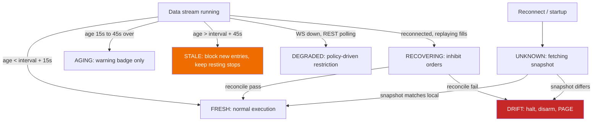

| State | Threshold | Execution behaviour | Operator signal |
|---|---|---|---|
| `FRESH` | age < interval + 15 s | full trading under normal risk policy | green |
| `AGING` | interval + 15 s … + 45 s | **warning only — no economic change** | yellow |
| `STALE` | age > interval + 45 s | **hard block** on new submissions; existing native stops remain live | yellow + auto-reconnect |
| `UNKNOWN` | startup or post-drop, pre-snapshot | **hard block**; workers paused | blue |
| `DRIFT` | local orders/positions ≠ venue snapshot | **halt engine, disarm all workers** | red + audible PAGE |
| `DEGRADED` | WebSocket dead, REST polling active | **per-worker policy**, declared in the package | orange |
| `RECOVERING` | socket back, replaying missed fills | inhibit new orders until watermark reconciliation completes | holding |

**Two REJECTED sub-clauses from the Antigravity specification:**

1. **`AGING` → "new entries with 50 % reduced position sizing".** Rejected. This silently changes trade economics based on transport health, with no backtest equivalent — a direct violation of Principle 6 and of Q16. Feed staleness may **warn or block**; it may never resize.
2. **`DEGRADED` → "trading permitted on higher timeframes only (≥ 1 h)"** as a global constant. Rejected as written; adopted as a **per-worker policy field declared in the frozen package**, because whether a 1 h strategy is safe on REST polling is a property of that strategy, not of the platform.

## 12.4 Drag-and-drop SL/TP

**Three modes, gated in this order.**

| Mode | Behaviour | Prerequisites | Phase |
|---|---|---|---|
| **Simulation** | Drag changes a *hypothetical* level; panel shows resulting R, risk $, portfolio impact. **No network call to any broker.** | none | V2/V3 |
| **Paper / testnet** | Drag produces a real `ExitIntent` against the testnet account, full audit trail | auth layer, reconciliation active, Bridge accepts external `ExitIntent` | V3 |
| **Live** | Same, with step-up authentication and typed confirmation | signed live gate (Q10), hardened auth, chaos-drilled rollback | V4 |

**[C-20 — Antigravity §1 adopted as the normative state machine]**

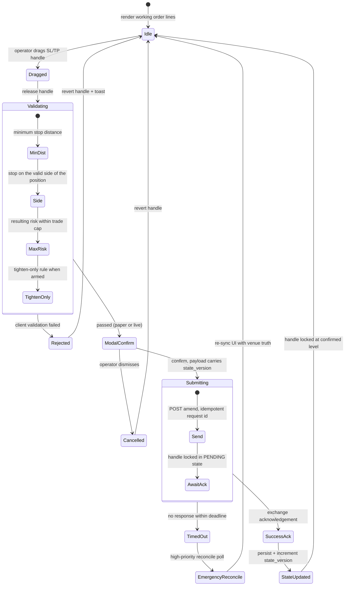

**Engineering invariants — all mandatory before any non-simulation mode:**

1. **Optimistic-UI inhibition.** A dragged level renders as a dashed `PENDING_EXCHANGE_ACK` line. Only an explicit acknowledgement converts it to solid `ACTIVE`. Showing the dragged position as the new stop before the venue confirms is actively dangerous.
2. **Versioned optimistic concurrency.** The payload carries the current `state_version`. If a fill or partial fill occurred while the modal was open, the server rejects with `STALE_STATE_VERSION`. This is the defence against two browser tabs and against reordered requests.
3. **Server-side validation.** The client's price is a *request*. The server re-derives validity: tighten-only for stops, minimum stop distance, tick/lot rounding, notional caps, Guardian authorization.
4. **Idempotency.** Client-generated `request_id`; replays return the original outcome. Extend the Bridge's existing order-identity discipline (`docs/23_ORDER_IDENTITY_CONTRACT.md`); do not reinvent it.
5. **Freshness deadline.** A request older than N seconds is rejected — a stop dragged against a stale chart is a wrong stop.
6. **Atomic failure escalation.** Where the venue lacks native modify and cancel-then-place is required, a failure on the place leg leaves the position naked: immediately re-place the prior level; if that fails within a short bounded window, execute `EMERGENCY_FLATTEN` and PAGE. **[REC]** prefer venue-native modify where Hyperliquid supports it; the cancel/place window must be exercised in a chaos drill (`tools_v2/observability/CHAOS_DRILLS_DESIGN.md` is the right home).
7. **Reconciliation confirmation.** The next reconcile cycle must confirm the venue's protective order matches the accepted revision; mismatch raises `PROTECTION_DRIFT`.
8. **Audit log.** who / when / from / to / reason / request_id / state_version / venue order id / outcome — append-only.

**[C-20 / ChatGPT 2 §7] Human-override accounting.** Every operator intervention stamps `human_override = true` on the affected trade, and performance reporting splits into **`PURE_STRATEGY_PERFORMANCE`** and **`OPERATOR_MODIFIED_PERFORMANCE`**. Without this split, a few manual saves make a mediocre strategy look promotable — and you would never know.

## 12.5 Execution dashboard content and access

The V2 proposal (`DASHBOARD_UNIFIED_ARCHITECTURE_PROPOSAL_20260818_V2.md`) and the accepted Package 3 prototype (`IBKR_PAPER_BRIDGE/dashboard_v2_prototype/`) are endorsed substantially unchanged. Non-negotiables:

1. **Three-layer truth** — desired (kernel) / accepted (allocator + Guardian + Bridge) / actual (venue) — never merged into one "current order" value. Already implemented in the prototype.
2. **Staleness on every panel**, per §12.3.
3. **Block/reject reason always visible**, never buried in a gate list.
4. **Config/package integrity pill** — running `package_hash` vs the approved registry; mismatch → red `CONFIG DRIFT`.
5. **Reconciliation view** with a drift alarm and last-reconcile timestamp. Mandatory before any live capital.
6. **One notification channel** with dedup and a rate budget. Four channels train the operator to mute all four.
7. **Human-override marker** on any trade the operator touched.

**[C-20 — Antigravity §7 adopted] Zero-trust access:**

```
[ Operator laptop / phone ]
        |
        v  encrypted WireGuard mesh
[ Tailscale overlay, device-authorized ]
        |
        v  WebAuthn / FIDO2 step-up for privileged actions
[ VPS: UFW default deny incoming ] --> [ 127.0.0.1:<port> execution API ]
        ^
        |  no public port exposed
[ public internet ] --X
```

- **Firewall:** `UFW default deny incoming`; no public port, including the dashboard port, 80 or 443.
- **Access path:** private Tailscale mesh only. Consistent with the existing `11_TRIAGE/DASHBOARD_V2_EXTERNAL_PATTERN_ADDENDUM_2026-08-17.md`.
- **Step-up authentication** via WebAuthn/FIDO2 hardware key or platform biometric for `ARM`, `KILL`, `FLATTEN`, and any future `DRAG_SL_TP`. This is strictly better than TOTP: it is phishing-resistant and origin-bound.
- **[REC] Keycloak and equivalent IAM servers are rejected** at one-operator scale — a full identity server is more attack surface than the problem it solves here.

---

# 13. Open-source adoption

## 13.1 The permanent policy

**[REC]** To be added to `AGENTS.md`:

> **OSS-FIRST POLICY.** Before writing any component, search for a maintained open-source implementation. Prefer a library or adapter over a fork. Pin exact versions with hashes. Record licence, source URL and version in a dependency ledger. Prove it on a real artifact from this repository before adopting. **Independently validate every financial calculation against a second implementation.** Write custom code only for platform-specific strategy contracts, risk and allocation policy, execution and reconciliation, and safety behaviour.

Two gates added by this brief:

**Integration-mode gate [C-18].** Licence conclusions depend on *how* a project is used. Classify every candidate before judging it:

| Integration mode | Typical obligation profile |
|---|---|
| `EMBED_SOURCE` | strictest |
| `LINK_AS_DEPENDENCY` | strict |
| `SEPARATE_LOCAL_PROCESS` | materially weaker |
| `FILE_OR_API_INTEROP` | weakest |
| `POC_ONLY` / `ARCHITECTURE_REFERENCE` / `UI_REFERENCE` | none |

**"Reject as embedded dependency" does not mean "reject completely."** A licence unsuitable for linking may still permit standalone research tooling, independent comparison, a POC or a design reference.

This brief therefore states **no categorical legal conclusions**. Where a licence is likely incompatible with the intended distribution model, the entry reads *"requires a documented licensing review before adoption in this integration mode"* — legal risk can justify rejection, but this is an architecture document, not legal advice.

**Operational-cost gate.** Every new *service* (as opposed to library) must name who patches it, who monitors it, and what happens when it is down. For one non-technical operator this gate correctly rejects most infrastructure in the input research documents.

## 13.2 Adoption matrix

Verified against primary sources on 2026-08-21.

| Project | Licence | Scale | Integration mode | Verdict |
|---|---|---|---|---|
| [**NautilusTrader**](https://github.com/nautechsystems/nautilus_trader) | LGPL-3.0-only | ~26.8k ★ | `POC_ONLY` in V3 | **[OWNER — Q12] POC first; do not replace the Bridge in V2.** Ships **stable** adapters for **both Hyperliquid and Interactive Brokers**, and documents that *"the same execution semantics and deterministic time model operate in both research and live systems."* That matches your multi-broker + parity requirement exactly. POC scope: an independent backtest of one promoted candidate as a second opinion. Any later production use requires a documented licensing review of the linking boundary. |
| [**Lightweight Charts**](https://github.com/tradingview/lightweight-charts) | Apache-2.0 (attribution) | ~17k ★ | `LINK_AS_DEPENDENCY` | **Favourite, decision gated on the Q19 POC** |
| **KLineChart** | Apache-2.0 | active | `LINK_AS_DEPENDENCY` | **POC comparator (Q19)** |
| [**Perspective**](https://github.com/finos/perspective) | Apache-2.0 | ~11.1k ★ | `LINK_AS_DEPENDENCY` | **ADOPT — research only** |
| [**DuckDB**](https://github.com/duckdb/duckdb) | MIT | ~40.5k ★ | `LINK_AS_DEPENDENCY` | **ADOPT.** Queries Parquet directly; embedded, no service to operate |
| **Parquet / PyArrow** | Apache-2.0 | — | `LINK_AS_DEPENDENCY` | **ADOPT** — already declared |
| [**Optuna**](https://github.com/optuna/optuna) | MIT | — | `LINK_AS_DEPENDENCY` | **CANDIDATE — decision deferred to the §11.1 comparison.** Already installed; that is not a reason |
| [**optuna-dashboard**](https://github.com/optuna/optuna-dashboard) | MIT | ~800 ★ | `SEPARATE_LOCAL_PROCESS` | **OPTIONAL, ISOLATED, TIMEBOXED POC — not an adoption** (repaired 2026-08-22, §0.3 item 18). Timebox: **≤ 2 days**, and run it **only if** it saves work on the Minimum Explorer — i.e. only while the trial catalog is not yet queryable and the explorer is more than a week away. It requires an Optuna study to exist, which the current grid engine does not produce, so the setup cost is real and must be counted against the saving. It lives in an isolated temporary location outside the canonical trees. **Two maintained viewers are forbidden**: the moment the Minimum Explorer renders `TrialRecord`, **development and maintenance of this POC stop** — its **findings, measurements and decision record are preserved**, and **retirement or removal happens only through a separate, explicit owner-authorized cleanup act**. Stopping maintenance is **not** an authorization to delete, and nothing here schedules automatic deletion. If the explorer lands first, skip it entirely |
| [**QuantStats**](https://github.com/ranaroussi/quantstats) | Apache-2.0 | ~7.6k ★ | `LINK_AS_DEPENDENCY` | **ADOPT with independent validation** — verify Sharpe/Sortino/Calmar against your own implementation before trusting a number |
| **vectorbt (open edition)** | Apache-2.0 | — | `LINK_AS_DEPENDENCY` | **KEEP as an enrichment layer only** — already correctly scoped in `03_QUANTLENS/tools/vbt_enrichment.py`. Not a primary engine |
| [**hyperliquid-python-sdk**](https://github.com/hyperliquid-dex/hyperliquid-python-sdk) | MIT | ~1.8k ★ | `LINK_AS_DEPENDENCY` | **KEEP** — already the adapter |
| **FastAPI / Uvicorn / Pydantic** | MIT / BSD | — | `LINK_AS_DEPENDENCY` | **KEEP** |
| **Tailscale** | client BSD-3 / service | — | `SEPARATE_LOCAL_PROCESS` | **ADOPT** for private access (§12.5) |
| **Prometheus + Grafana** | Apache-2.0 | — | `SEPARATE_LOCAL_PROCESS` | **REJECT at current scale** — a second distributed system to patch and secure, attached to money. A lean built-in metrics endpoint is better here |
| **Temporal.io** | MIT | — | service | **REJECT at current scale** — durable execution for thousands of bots when you run one. Your durability need is met by an idempotent SQLite state machine plus reconciliation, which you have and which is audited |
| **ClickHouse / QuestDB / ArcticDB** | Apache-2.0 / Apache-2.0 / BSL-1.1 | — | service | **REJECT at current scale** — three databases for a workload DuckDB + Parquet handles on a laptop. ArcticDB's BSL adds a review requirement for zero benefit at your volume |
| **hftbacktest** | MIT | — | — | **REJECT** — L3 queue simulation for a bar-close strategy; the data alone is prohibitive |
| **QuickFIX / FIX** | various | — | — | **REJECT until a FIX venue is real** |
| **Hummingbot** | Apache-2.0 | — | — | **REJECT** — market-making runtime; not your use case |
| **Freqtrade / OctoBot** | GPL-3.0 | — | `ARCHITECTURE_REFERENCE` only | **Not suitable as an embedded dependency** given the intended distribution model; **usable as a design reference**. Any other use requires a documented licensing review |
| **QuantConnect LEAN** | Apache-2.0 | — | `SEPARATE_LOCAL_PROCESS` | **REJECT as core**; NautilusTrader is the better second-engine fit |
| **Jesse** | closed-source live plugin | — | `ARCHITECTURE_REFERENCE` | **REJECT for execution** — cannot depend on a proprietary execution plugin |
| **Qlib / MLflow / FinRL** | MIT / Apache-2.0 | — | — | **DEFER to V4+.** MLflow's run-tracking *idea* is worth stealing — the trial catalog is your version of it |
| **Keycloak** | Apache-2.0 | — | service | **REJECT at one-operator scale** — WebAuthn/FIDO2 + hardened single-user auth is smaller and stronger here |

## 13.3 What is still built in house

Strategy kernel, `SizingIntent` / `OrderIntent` / `ExitIntent` contracts, Risk Allocator and allocation policy, Portfolio Guardian, reconciliation semantics, promotion registry and authority, and the two dashboards. These encode *your* decisions about money; adopting a library here means adopting someone else's risk philosophy silently.

---

# 14. Repository structure

## 14.1 The v1 recommendation, corrected

v1 recommended three repositories plus a contracts package, citing the 180,000-token onboarding chain. **[C-13]** Two reviewers correctly observed that this evidence proves a **context-routing** problem and does not, by itself, prove a Git-topology problem. A properly routed monorepo could reduce the same cost by the same amount.

**[OWNER — Q2a / Q2b]** the decision is now split and sequenced.

## 14.2 Direction of travel (owner-stated, unchanged)

Research, execution and versioned contracts are to be **separated gradually**, with the current repository ending as a **read-only archive**. What changes is only *when the topology is fixed and on what evidence*.

**Two different separations — clarified 2026-08-22 (§0.3 item 11). Do not conflate them again.**

| Separation | Status | Meaning |
|---|---|---|
| **Logical and trust-domain separation** | **BINDING NOW** | Research holds no credentials; execution is small, audited and authenticated; they communicate only through frozen, hash-verified packages and versioned contracts (§5.1 principle 7, §5.2, §12.1). Execution never imports research source. This constraint is **not** deferred, is **not** contingent on Q2b, and must be satisfied inside the current repository from Phase 0 onwards |
| **Separate Git repositories** | **DEFERRED — Q2b** | Whether that logical boundary is expressed as one stage-routed repository or three repositories is a packaging question, decided at the end of Phase 0 on measured evidence (§14.4) |

A single repository can satisfy the binding separation and today does not; three repositories can violate it if execution imports research source. The boundary is the requirement — the topology is an implementation of it.

## 14.3 Q2a — versioned contracts package, in place, now

**Approved. No migration required.**

```
MTC_COMMAND_CENTER/contracts/          # new, in the current repository
  pyproject.toml                       # versioned, semver, independently installable
  mtc_contracts/
    __init__.py                        # __version__
    identity.py                        # candidate_id, package_hash formula (§6.7)
    sizing.py                          # SizingIntent
    orders.py                          # OrderIntent, ExitIntent, qty_semantics, stop_semantics
    package.py                         # StrategyPackage + frozen instrument metadata
    risk.py                            # RiskBucket, allocation policy schema, guard policy schema
    trials.py                          # TrialRecord, artifact manifests
    lineage.py                         # simulator_class, UNSIMULATED_CONTROLS
  tests/
    test_compat.py                     # backward-compatibility matrix across versions
    test_consumers.py                  # research + execution consumer contract tests
```

Rules from day one:
1. **Semantic versioning**, changelog per release.
2. **Compatibility tests** across supported versions — a breaking change must fail a test, not surprise a consumer.
3. **Consumer contract tests** — both the simulator and the Bridge assert against the same schemas.
4. Consumers depend on a **released version**, never on a working-copy path.

**What "the Bridge is a consumer" means in Phase 0 — clarified 2026-08-22 (§0.3 item 10).** Phase 0 proves **schema and consumer compatibility only**:

- A consumer contract test may import the contracts package **alongside** the Bridge's own types and assert that Bridge payloads round-trip through the schemas, that field names and semantics agree, and that a breaking change fails a test.
- **No Bridge runtime code path changes in Phase 0.** The Bridge does not construct, consume or act on `OrderIntent` at runtime, its behaviour is byte-for-byte what it is today, and the V1 soak is unaffected.
- **Actual Bridge runtime wiring — the engine accepting an authorized `OrderIntent` and refusing to originate a quantity — is V2A work** (§17.2a), on a protected surface, under its own T0 authorization and audit.

Stated plainly: Phase 0 makes divergence *detectable*; V2A makes it *impossible*.

**Why this is the highest-value early step:** it is the only structural artefact that makes the five-recipe problem *detectable* if it starts to recur. A breaking change becomes a version bump instead of a silent divergence discovered six weeks later.

## 14.4 Q2b — topology deferred, decided on measurement

**Sequence:**

1. Implement stage-local context routing **in the current repository** (§15).
2. **Measure** default agent context per task class, cold-start time, and the actual per-task token cost. Record before/after.
3. Complete the migration inventory and classification (§16 M0–M1) so the true blast radius of a split is known.
4. **Then** choose topology against measured evidence on: default onboarding tokens, cold-start time, cross-domain change complexity, CI complexity, contract-version drift risk, multi-repo PR overhead, local development complexity, publishing overhead, and migration cost.

**The two options that will be compared:**

**Option A — stage-routed monorepo**

```
platform/
  10_RESEARCH/    20_KERNEL/    30_BACKTEST/    40_VALIDATION/
  50_PROMOTION/   60_EXECUTION/ 70_PAPER/       80_LIVE/
  90_DASHBOARD/   95_CONTRACTS/
```
with strict local `AGENTS.md` and stage-local context.

**Option B — three repositories + contracts package**

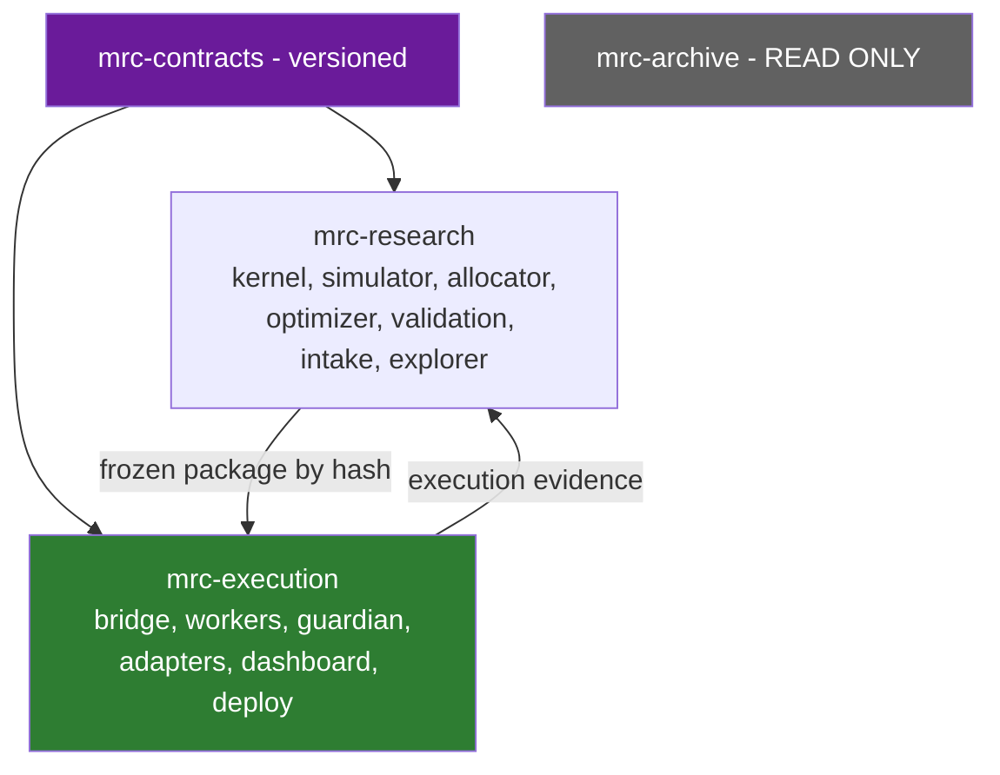

**Decision rule.** If routing drops the per-task cost from ~180k tokens to a few thousand inside the current repository, the split becomes an optimisation rather than a necessity — and is then judged on the security boundary alone, which is a narrower and easier question.

**Not blocked by this decision:** kernel consolidation, the contracts package, the trial catalog, context routing, tagging, **and the binding logical/trust-domain separation of research from execution (§14.2)** — that boundary applies inside the current repository regardless of which option wins. **[C-13]** repository topology must never block the kernel work.

## 14.5 Kernel home

`[OPEN]`, resolved by Q2b. Under either option the kernel is consumed by execution as a **pinned, hash-verified package**, exactly like a third-party dependency. Execution never imports research source.

---

# 15. Token-efficient AI-memory structure

## 15.1 Do this now, in place, and measure

**[C-14, OWNER — Q2b]** The 180,000-token cost exists today and must not wait for any migration.

## 15.2 Stage-local context routing

```
/AGENTS.md                    <= 6 KB   identity, safety invariants, where to go next. NOTHING else.
/CONTEXT_MAP.md               <= 2 KB   "working on X? read Y."
/DECISIONS.md                 <= 16 KB  one line per binding owner decision, dated, linked
```

Each stage folder carries exactly four small files:

| File | Content | Cap |
|---|---|---|
| `AGENTS.md` | stage rules only | 4–6 KB |
| `INPUTS.md` | what this stage consumes, with schema references | 2 KB |
| `OUTPUTS.md` | what it produces, with schema references | 2 KB |
| `TESTS.md` | how to verify a change here | 2 KB |
| `HANDOFF.md` | **current state only**, rotated at every close-out | **4 KB hard cap** |

**Default context for any task = root (≈ 24 KB incl. decisions) + one stage (≤ 18 KB) ≈ 42 KB ≈ 11,000 tokens** — a **~94 % reduction**.

**Measurement is part of the deliverable.** Record, per task class, the before and after context size and cold-start time. That measurement is the evidence base for Q2b.

## 15.3 History available, never loaded

- `GLOBAL_HANDOFF.md` and `NEXT_STEPS.md` become **append-only archives** under `history/`, headed *"do not read by default; grep on demand."*
- The 1,234 files in `11_TRIAGE/` move to `history/triage/` with a single generated `INDEX.md` — one line per file (date, topic, one-line summary). Agents grep the index, then read at most one file.
- `DECISIONS.md` is the **only** historical file loaded by default, because binding decisions are the only history that changes what an agent should do now.

## 15.4 Freeze mechanism

**[F-17: zero tags today.]** Three namespaces, introduced immediately:

| Namespace | Meaning |
|---|---|
| `pkg/<candidate_id>/<package_hash>` | a frozen, promotable strategy package |
| `release/<component>/<semver>` | a deployable component build |
| `legacy/<name>/<date>` | a frozen historical reference (e.g. the Pine controller) |

Without this, "frozen package" and "tagged commit" remain words the repository cannot honour — and `LIVE_TRADING_GATE.md` precondition 2 stays unsatisfiable.
---

# 16. Safe migration and archival plan

**Constraint respected throughout: the old repository is never deleted.**

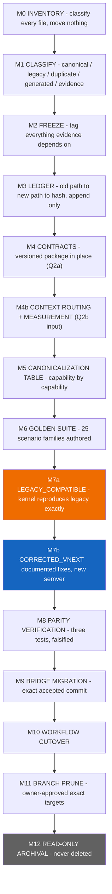

| Step | Actions | Exit criteria |
|---|---|---|
| **M0 Inventory** | Machine-readable inventory of all 8,031 tracked files: path, size, last-commit date, referenced-by count. **Plus — repaired 2026-08-22 (§0.4 RF-T2-5) — a read-only inventory of the untracked artefacts in the existing dirty checkout**, which the tracked-file count does not reach and which exist nowhere else: path, size, timestamp/age where available, likely owner and purpose, and evidence relevance. **The untracked count is volatile and is measured at execution**, never quoted from F-17's dated snapshot. Inputs are read-only inspection of **both** the existing dirty checkout and the clean isolated worktree that carries canonical `master`. **No file moves. Nothing untracked is moved, staged, deleted, overwritten or committed by this step.** | Inventory committed; every top-level directory has an owner label; **every untracked artefact in scope appears in the inventory with a classification — none silently ignored — and the measured untracked count is recorded with the command that produced it** |
| **M1 Classify — risk-based, not uniformly exhaustive** | **Repaired 2026-08-22 (§0.3 item 19).** Demanding a hand-decided label for all 8,031 files guarantees either months of work or a rubber-stamped file — the pattern `DESIGN_DEFECT_PATTERNS_2026-08-10.md` warns about. Two tiers instead. **Tier A — individually classified, no exceptions:** every path that is (a) **canonical** — anything a runtime, test or build imports; (b) **migration-relevant** — anything the kernel consolidation, contracts package or Bridge migration reads, replaces or supersedes; or (c) **evidence-bearing** — parity corpora, golden fixtures, promotion records, registries, audit verdicts, run artifacts and any branch holding unique evidence. Each gets `CANONICAL` / `LEGACY` / `DUPLICATE` / `EVIDENCE`, a named owner, and for `DUPLICATE` a named canonical twin. **Tier B — machine-grouped by recorded rule:** generated, vendored, cache and demonstrably irrelevant paths (`__pycache__`, build outputs, `.gitignore`d trees, editor artefacts) may be grouped by an explicit, committed pattern rule rather than file by file. Resolve F-10 (`05_PARITY` vs `12_PARITY_PINETS`) explicitly and individually — it is Tier A. **Untracked artefacts are classified on the same two-tier basis (§0.4 RF-T2-5), read-only:** each gets a likely owner, a purpose and a classification, and anything whose owner or purpose cannot be established is recorded **`UNKNOWN`** rather than guessed or grouped away. | **Zero unclassified Tier-A paths**, each with an owner; every `DUPLICATE` names its canonical twin; every Tier-B group names its matching rule, its file count, and a **sampled spot-check** confirming the rule did not swallow a Tier-A path; the Tier-A/Tier-B split rule itself is committed and reviewable; evidence-bearing branches listed; **no untracked artefact in scope is silently ignored, and every `UNKNOWN` blocks any cleanup, prune, move or migration that would affect it until its ownership is established** |
| **M2 Freeze** | Tag: current master; the Pine controller; the MTC_V2 kernel; `02_MTC_BACKTEST`; the parity oracle set; the accepted Bridge V1 candidate; every branch identified in M1 as evidence-bearing. | Tags exist and are pushed. **The repository's first tags (F-17).** |
| **M3 Ledger** | `MIGRATION_LEDGER.json`: `old_path → new_location → sha256 → status`. Append-only, resolvable in both directions. | Every `CANONICAL` file has a ledger row |
| **M4 Contracts** | Build `MTC_COMMAND_CENTER/contracts/` per §14.3. **[OWNER — Q2a]** | Package installable; compatibility and consumer tests green |
| **M4b Context routing** | Implement §15 in place; **measure** before/after per task class. | Measured reduction recorded; feeds the Q2b decision |
| **M5 Canonicalization** | Complete the capability table (§7.3) for every economically meaningful capability. Decide intended semantics where implementations disagree. | Table complete and reviewed; no capability marked "whichever is easier" |
| **M6 Golden Suite** | Author the **25** scenario families (§9.3) as deterministic fixtures with expected outputs derived from the **decided** semantics. Family 18 additionally requires a D026 RED/GREEN snapshot-drift case. | All 25 families have fixtures; each fails against a deliberate mutation |
| **M7a `LEGACY_COMPATIBLE`** | Kernel + simulator reproduce frozen legacy behaviour **exactly**, including the known defects. Must reproduce the **entry-signal golden** (858/858 over 48,077 bars) bit-identically **and** the legacy branch of every applicable golden family. **[OWNER — Q1, Q15]** | Bit-identical signal-file hash; every legacy-branch fixture green. **Any unexplained mismatch stops the migration.** |
| **M7b `CORRECTED_VNEXT`** | Apply documented fixes under a **new semantic version**: F-2 Gap 1 (contract multiplier), Gap 2 (min notional), Gap 3 (frozen instrument metadata), gap-aware stop fills, in-path slippage, named same-bar collision policy, real fee schedule. Each fix carries a defect record, before/after evidence, RED/GREEN falsification, and new expected golden artifacts. **[OWNER — Q15]** | Every intentional difference is documented and tested. **No undocumented behavioural difference exists between M7a and M7b.** |
| **M8 Parity verification** | The three §9.6 tests, each shown RED against a deliberate mutation (repo rule D026). | All green, all falsified, commands and real output recorded |
| **M9 Bridge migration** | **[C-16] Not "wholesale".** The migration record must name: accepted source commit; included and excluded Bridge V2 packages; current audit status of each; baseline test results; configuration and schema version; deployment identity; known inactive capabilities (F-14); post-migration reproduction criteria. Unaccepted or master-only V2 work stays separately classified. | Named commit; package inclusion list; baseline suite reproduced |
| **M10 Workflow cutover** | New structure becomes where work happens. Old location banner: *"FROZEN — read-only reference."* | One week of real work with no fallback |
| **M11 Branch prune** | **[C-17, OWNER — Q13]** Only after M0–M3. Prerequisites: active worktrees and processes inventoried; unmerged and unpushed commits identified; evidence-bearing branches tagged; ledger complete; **explicit owner authorization of exact deletion targets**. | Owner-approved target list; every deletion has a preserved tag |
| **M12 Archival** | Old repository archived read-only, full history intact, ledger cross-linked both ways. **Never deleted.** | Archive reachable; ledger resolves in both directions |

**The two gates that make this safe.** M7a proves the migration moved nothing by accident. M7b proves every intentional change was intended. v1 collapsed these into one step and would have silently carried the F-2 sizing defect into the canonical kernel — the single most important correction in this revision.

---

# 17. Roadmap

## 17.1 Phase 0 — Foundation

| | |
|---|---|
| **Scope** | Contracts package in place (Q2a). Tag namespaces. Context routing + measurement (Q2b input). Migration M0–M6. Kernel consolidation M7a → M7b. `TrialRecord` contract and trial-catalog writer. **Minimum Explorer.** Branch-freshness guard. |
| **Explicit non-goals** | No new trading features. No multi-strategy runtime. No broker work. **No Bridge behaviour change. No execution-dashboard rework** — clarified 2026-08-22 (§0.3 item 9): the non-goal is the *execution* surface, because the research-side **Minimum Explorer is explicitly in scope** above. Building a read-only research viewer is not "dashboard rework". **The V1 soak is untouched.** No repository topology decision. No Bridge runtime wiring of the contracts package (§14.3). |
| **Dependencies** | Q1, Q2a, Q15 — all answered |
| **Risks** | Kernel consolidation changes behaviour silently → M7a is the mitigation and is non-negotiable |
| **Acceptance** | A-1 … A-7 |
| **Migration impact** | High — this is the migration |
| **OSS to evaluate** | Parquet/PyArrow, DuckDB (adopt); Optuna vs grid comparison (§11.1); optuna-dashboard **only as an optional ≤ 2-day isolated POC** (§13.2) — never a second maintained viewer; **retirement or removal is separately owner-authorized, after its findings, measurements and decision record are preserved** |
| **Owner decisions needed** | none outstanding |

## 17.2 Bridge V2 — delivered as **V2A then V2B**, never as one release

**Split added 2026-08-22 (§0.3 item 20).** The scope below is too large for a single delivery: it contains a protected-surface engine change, a new allocator, a new portfolio layer, a live schema migration, a new dashboard, a network-hardening change and two new forward environments. Shipping them together makes acceptance all-or-nothing and puts the riskiest item (schema activation) in the same window as the most novel one (the allocator). The table below is the **combined** V2 scope; §17.2a and §17.2b divide it, and the bounded work packages live in `MASTER_WORK_PACKAGE_AND_PARALLEL_DELIVERY_PLAN_2026-08-22.md`.

| | |
|---|---|
| **Scope** | Multi-worker supervisor — **hybrid isolation (Q4)**: shared isolated workers for the shadow fleet, one process per strategy/bucket for testnet and paper. Risk Allocator, shared by simulator and runtime. Portfolio Guardian, **authorize-or-reject only (Q16)**, with Risk Buckets. Worker identity and per-worker state. Frozen-package loader with hash verification. Schema activation v4→v8 behind its own T0 contract. Execution Dashboard V2 from the accepted Package 3 prototype. Zero-trust access + WebAuthn step-up. `FORWARD_SHADOW` on real feeds. `EXCHANGE_TESTNET` execution fleet, **capacity-driven (Q17)**. Kernel↔Bridge integration behind `SizingIntent`/`OrderIntent`. Native strategy stop (Q7). Drag-and-drop **simulation mode only**. |
| **Explicit non-goals** | **No live Multi-TP execution (C-19).** No paper or live drag-and-drop. No IBKR. No equities. No mainnet. No embedded AI assistant. No advanced explorer. No Guardian resizing. |
| **Dependencies** | Phase 0 complete. Package 7 exchange reverification (Q6). Package 1 §A.2 store decision. |
| **Risks** | Schema activation on a live store is the highest-risk operation in the plan → separate T0 contract, rehearsed on a copy, with rollback, never during an armed window |
| **Acceptance** | A-8 … A-15 |
| **Migration impact** | Moderate — Bridge migrates from an exact accepted commit (M9) |
| **OSS to evaluate** | none new, deliberately |
| **Owner decisions needed** | Q6 resolves after Package 7 |

### 17.2a V2A — the intent seam and one worker

| | |
|---|---|
| **Scope** | Frozen-package loader with hash verification. Worker identity and per-worker state, **one worker first**. Risk Allocator as a pure, versioned function, **imported by the backtest simulator on day one**. Kernel↔Bridge integration behind `SizingIntent` / `OrderIntent`: the Bridge accepts an authorized intent and **refuses to originate a quantity when one is present**. `AccountSnapshot` identity with fail-closed rejection. **Native strategy stop (Q7) — the contract and its semantics, proven locally only:** reduce-only placement / amendment / cancellation against a deterministic adapter-emulator or replay, the identical backtest model of a continuously active protective order, and a **local process-kill/restart harness** in which the emulator retains the protective order while the worker dies. **No credentials, no venue contact.** `FORWARD_SHADOW` on real feeds — zero orders anywhere. |
| **Explicit non-goals** | No Portfolio Guardian beyond a pass-through stub. No multi-bucket logic. **No schema activation.** **No testnet orders and no venue contact of any kind** — the real exchange-native protective-order and process-kill survival drill is **WP-V2B-07 in V2B**, under the testnet gate. No dashboard replacement. No drag-and-drop of any kind. |
| **Acceptance** | **A-9, A-10, A-10b, A-12** |
| **Why first** | It is the change that makes a backtest number mean something, it moves no money, and it can be proven entirely in replay. |
| **Protected surfaces** | Bridge engine and risk paths — T0, own authorization and audit |

### 17.2b V2B — portfolio, execution fleet and the operator surface

| | |
|---|---|
| **Scope** | Portfolio Guardian, **authorize-or-reject only (Q16)**, with Risk Buckets and simulated Guardian policy objects. Multi-worker supervisor under **hybrid isolation (Q4)**. `PortfolioSimulator` sharing allocator and Guardian code. Schema activation v4→v8 **behind its own T0 contract**, rehearsed on a copy, after the deployed schema version is independently verified (F-14). Execution Dashboard V2 from the accepted Package 3 prototype. Zero-trust access + WebAuthn step-up. `EXCHANGE_TESTNET` execution fleet, **capacity-driven (Q17)** — and, inside it, the **real exchange-native protective-order and process-kill survival drill** that V2A could only prove locally (§5.4, §0.4 RF-T2-3). Drag-and-drop **simulation mode only**. |
| **Explicit non-goals** | Same as the V2 table above, plus: no live capital, no Guardian resizing, no paper/live drag-and-drop. |
| **Acceptance** | **A-8, A-11, A-13, A-14, A-15** |
| **Dependencies** | V2A accepted. Package 7 exchange reverification (Q6). Package 1 §A.2 store decision. |
| **Gate between the halves** | V2B does not start until V2A's acceptance criteria are green **and** the schema-activation T0 contract is written and separately authorized. |

## 17.3 V3

| | |
|---|---|
| **Scope** | Advanced Explorer: parallel coordinates, 3-D response surfaces with plateau/needle detection, parameter importance, Pareto, comparison, `SIGNAL_EDGE`/baseline/enriched A/B. Full artifact tier + deterministic replay + 20 GB retention (Q9). Promotion Authority + immutable decision artifacts. Portfolio backtesting with allocator and Guardian simulated. Correlation gates: promotion, runtime, live monitor. Live-vs-backtest divergence reporting. Missing-Rule Ledger in the promotion packet. **Multi-TP: testnet execution, partial fills, reconciliation.** Drag-and-drop **paper/testnet mode**. **NautilusTrader POC (Q12).** |
| **Explicit non-goals** | No live drag-and-drop. No new brokers in production. No ML. No Guardian resizing without a versioned, backtested allocation policy. **No emergency existing-exposure reduction capability is built here either: under the D-02 clarification (§0.5) that would be a distinct, separately authorized, explicit and tested safety policy, and V3 carries only the WP-V3-10 design study of Appendix E O-11 and O-12.** |
| **Dependencies** | Phase 0 trial catalog; V2 execution evidence flowing back; auth hardened |
| **Risks** | Explorer scope creep into a general BI tool → cap at the named screens |
| **Acceptance** | A-16 … A-20 |
| **OSS to evaluate** | Perspective, QuantStats (with independent validation), NautilusTrader POC |
| **Owner decisions needed** | Q18 calibration review after the first portfolio simulations |

## 17.4 V4

| | |
|---|---|
| **Scope** | Drag-and-drop **live mode** with the full §12.4 safety chain and human-override accounting. Signed live-trading gate **(Q10)**. **`LIMITED_LIVE`: one strategy, ≤ 1 % of account (Q11) — owner clarification 2026-08-22: the 1 % is the MAXIMUM CAPITAL ALLOCATED to that strategy; loss-at-stop / risk-to-stop carries a SEPARATE and LOWER cap that must be defined and evidenced before live authorization, and no number for it is set here (register D-07, §0.5).** Multi-bucket operation (day/swing/position) with calibrated allocations. Mobile monitoring. TradingView divergence alarm as a scheduled job. **Live Multi-TP after chaos and restart drills.** |
| **Explicit non-goals** | No IBKR. No scaling beyond the agreed live cohort. No second live strategy until the first has a full evidence cycle. |
| **Dependencies** | V3 complete; reconciliation active; auth hardened; **signed live gate with all six preconditions evidenced** |
| **Risks** | First phase where a UI bug can move real money → step-up auth, server-side validation, `state_version` concurrency, acknowledgement-only success, chaos-drilled rollback |
| **Acceptance** | A-21 … A-24 |
| **Owner decisions needed** | Q10 signature; live-cohort expansion beyond one strategy; **the value of the separate, lower loss-at-stop cap under the D-07 clarification — it must be defined and evidenced before live authorization and is deliberately unset here** |

## 17.5 V5+ — multi-broker expansion

| | |
|---|---|
| **Scope** | IBKR adapter behind the same `BrokerAdapter` protocol. Equity swing bucket with calendar, session and corporate-action handling. Multi-venue portfolio view. |
| **Explicit non-goals** | No FIX. No colocation. No HFT. |
| **Dependencies** | V4 stable with real money for a defined period; NautilusTrader POC verdict |
| **Risks** | Equities bring corporate actions, halts, sessions and PDT rules — genuinely new failure modes, not "a second adapter" |
| **OSS to evaluate** | NautilusTrader IBKR adapter (its strongest single argument); lighter IBKR clients as the alternative |
| **Owner decisions needed** | adopt Nautilus as the adapter layer, or write a second adapter |

---

# 18. Risks and failure modes

| # | Risk | Likelihood | Impact | Mitigation |
|---|---|---|---|---|
| R-1 | Kernel consolidation silently changes behaviour | High | Severe | M7a bit-identical gate + the **25-family** golden suite (§9.3); any unexplained mismatch stops the migration |
| R-2 | **M7b never happens** — `LEGACY_COMPATIBLE` ships and the known defects live on forever under a "we'll fix it later" | **High** | Severe | M7b is a **Phase 0 acceptance criterion (A-6)**, not a follow-up. Phase 0 is not complete without it |
| R-3 | Backtest/live drift never actually closes — Bridge keeps its own sizing "temporarily" | High | Severe | A-9: a Bridge that computes a quantity while an authorized intent is present is a **test failure** |
| R-4 | **The Risk Allocator is built but never simulated** — the worst outcome of the C-7 change | Medium | **Severe** | A-11: `PortfolioSimulator` importing the same allocator is a V2 acceptance criterion, not a V3 nicety. Without it, v2's design is worse than v1's |
| R-5 | TradingView second controller resurfaces | Medium | Severe | Delete `alert()` emission; CI grep guard with an empty allowlist |
| R-6 | Schema v4→v8 activation corrupts live state | Medium | Severe | Separate T0 contract; rehearse on a copy of the real DB; rollback script; never during an armed window; **verify the deployed schema version first (F-14)** |
| R-7 | Shadow leakage contaminates forward evidence | **High** | High | §6.6 freeze-first rules; `OBSERVED_DURING_RESEARCH` marking; new hash resets the clock |
| R-8 | False diversification | High | High | Promotion gate + family caps + runtime veto + live monitor (§10.3), all simulated |
| R-9 | Explorer built before the writer changes | Medium | Medium | §11 ordering is mandatory: contract → writer → viewer |
| R-10 | Artifact storage growth | High | Medium | 20 GB budget + LRU eviction with protected classes + deterministic replay (Q9) |
| R-11 | Drag-and-drop ships without the safety chain | Medium | **Severe** | Three-mode gating; live blocked behind a signed gate; eight mandatory invariants |
| R-12 | Migration abandoned half-done | Medium | High | Ledger + one-week cutover proof + a named rollback point at every M-step |
| R-13 | Optional modules become invisible complexity | High | High | Preregistered search space; real trial family in DSR; complexity reported separately (§9.5) |
| R-14 | AI agents act on a stale branch | **Already occurring** | Medium | Branch-freshness check in the repo guard; master the only long-lived branch; prune only after M11 |
| R-15 | Adopting the input documents' institutional stack | Medium | Severe | §13 verdict + the operational-cost gate |
| R-16 | Promotion registry stays empty | High | Medium | The registry write is the **only** mechanism producing a hash the loader will accept |
| R-17 | Slippage and gap optimism carried into live sizing | High | High | In-path slippage + gap-aware stop fills land in **M7b**, before any capital decision |
| R-18 | Bridge V1 soak disturbed by V2 work | Medium | High | V2 in separate branches/worktrees; V1 candidate frozen; standing rule unchanged |
| R-19 | **Q2b never gets decided** — routing improves, the topology question drifts forever | Medium | Low | M4b's measurement is a deliverable with a recorded result; the decision is scheduled at the end of Phase 0 |
| R-20 | Testnet fleet grows past reconciliation capacity | Medium | High | Q17: capacity-driven growth, with reconciliation reliability as the explicit stop condition |
| R-21 | Human overrides silently flatter strategy performance | Medium | Medium | `human_override = true`; `PURE_STRATEGY` vs `OPERATOR_MODIFIED` split (§12.4) |
| R-22 | **F-22 is misread as "the research is broken"** | Medium | Medium | It is not. The statistics are honest and correctly calibrated. It means **two constraints bind at once** — discovery of a statistically credible candidate, and calendar-time forward evidence. The lifecycle funds both in parallel; neither is treated as a substitute for the other |
---

# 19. Acceptance criteria

## Phase 0

- **A-1** The contracts package exists in the current repository, is semver-versioned, and is consumed from a **released version**, never a working-copy path. Compatibility tests and **consumer contract tests for both the simulator and the Bridge** are green. **Scope limit (§14.3):** the Bridge side is a *compatibility* assertion — schemas round-trip against Bridge payloads and a breaking change fails a test — with **no change to Bridge runtime behaviour**. Wiring the Bridge to act on `OrderIntent` is **A-9 in V2A**, not A-1.
- **A-2** Tag namespaces `pkg/`, `release/`, `legacy/` exist and are populated for every artefact identified as evidence-bearing in M1. The repository is no longer at zero tags.
- **A-3** Stage-local context routing is live and **measured**: default agent context per task class recorded before and after, with the reduction stated numerically.
- **A-4** Exactly one strategy kernel exists. `mtc_v2` and `02_MTC_BACKTEST/src/engine` are tagged legacy and referenced by no runtime import. The capability canonicalization table is complete.
- **A-5 (`LEGACY_COMPATIBLE`)** The kernel reproduces the **entry-signal golden** (858/858 over 48,077 BTCUSD 1h bars) bit-identically, **and** the legacy branch of every applicable golden-suite family, **including the known defects**.
- **A-6 (`CORRECTED_VNEXT`)** Every documented fix is applied under a new semantic version, each with a defect record, before/after evidence and RED/GREEN falsification. **No undocumented behavioural difference exists between A-5 and A-6.** Phase 0 is not complete until this passes.
- **A-7** The optimizer writes an optimizer-independent `TrialRecord`: one row per trial, Parquet, DuckDB-queryable, including `rejection_reasons`, `search_regime`, `family_size` and `simulator_class`. The Minimum Explorer renders it.

## Bridge V2

- **A-8** Two or more workers run concurrently under the hybrid isolation model (Q4), each with an immutable identity tuple and isolated state, on one release.
- **A-9** The Bridge executes an accepted `OrderIntent` exactly or rejects it loudly. **A test proves that a Bridge-originated quantity in the presence of an authorized intent fails.**
- **A-10** The **Risk Allocator computes and proposes the full `AuthorizedQuantity`**; the **Portfolio Guardian authorizes that quantity in full or rejects it in full**. Neither component resizes an order, and no partial authorization exists anywhere in the path (vocabulary per §5.4–§5.5: K requests risk · RA proposes quantity · P authorizes or rejects · B executes or rejects). **A test proves the V2 `OrderIntent` schema has no `RESIZED` authorization value** and that no code path produces a partial authorization.
- **A-10b (snapshot fail-closed, RF-4)** Kernel and allocator compute against one immutable `AccountSnapshot`. A **runtime** mismatch or stale snapshot **rejects** with `SNAPSHOT_MISMATCH` / `SNAPSHOT_STALE` and submits no order; divergence within one snapshot rejects with `REFERENCE_DIVERGENCE` **and** fails the parity suite. Proven by a **D026 RED/GREEN** snapshot-drift and bucket-capital-divergence fixture: RED without the guard, GREEN with it.
- **A-11** `PortfolioSimulator` imports **the same allocator and the same Guardian policy objects** as the runtime. A portfolio backtest of ≥ 2 strategies produces results that differ from the sum of individual backtests in an explainable way.
- **A-12** Simulator↔Worker replay equivalence: identical `OrderIntent` streams — including allocator output — on identical bars. Falsified per D026.
- **A-13** Every Guardian rejection carries a machine-readable reason, appears in the decision stream, and is visible on the dashboard.
- **A-14** Schema v8 is active on a **rehearsed** migration with a proven rollback, **after** the deployed schema version has been independently verified (F-14). Daily controls and exposure gates demonstrably enforcing.
- **A-15** The execution dashboard shows desired / accepted / actual as three separate columns, plus per-panel staleness, block reason, package-hash integrity, and the seven freshness states — with **no state that silently changes position size**.

## V3

- **A-16** From the explorer, any trial in a 100,000-trial run is **locatable and filterable immediately**; a materialized trial **opens immediately**; a non-materialized trial is produced by **deterministic replay within the stated time target** and then cached. *(Replaces v1's A-13, which was self-contradictory.)*
- **A-17** Every promotion packet contains the `SIGNAL_EDGE` / `SOURCE_COMPLETED_BASELINE` / `MTC_ENRICHED` comparison, the Missing-Rule Ledger, the `UNSIMULATED_CONTROLS` manifest and the `simulator_class`.
- **A-18** `PROMOTION_REGISTRY.json` contains ≥ 1 real entry, produced from an **immutable decision artifact** created on the Promotion Authority screen — not from the explorer. The package loader accepts only hashes traceable to such an artifact.
- **A-19** Multi-TP executes end to end on testnet, including a partial TP1 fill reconciled correctly.
- **A-20** Drag-and-drop paper mode satisfies all eight §12.4 invariants, each proven by a test that fails without the control, plus a chaos drill proving the cancel/place failure path re-protects or escalates to flatten and pages the operator.

## V4

- **A-21** The live-trading gate is signed and every one of its six preconditions has dated evidence bound to a single `package_hash`.
- **A-22** Live drag-and-drop requires WebAuthn/FIDO2 step-up, and a `STALE_STATE_VERSION` rejection is proven under a concurrent-fill test.
- **A-23** Performance reporting splits `PURE_STRATEGY_PERFORMANCE` from `OPERATOR_MODIFIED_PERFORMANCE`.
- **A-24** `LIMITED_LIVE` runs one strategy at ≤ 1 % of account with daily three-way reconciliation and zero unexplained orphans. **Owner clarification, 2026-08-22 (register D-07, §0.5): the ≤ 1 % is the maximum capital allocated to that strategy. A separate and lower loss-at-stop / risk-to-stop cap must be defined and evidenced before live authorization, and A-24 is not satisfiable until that cap has a stated, evidenced value. No value is invented here.**

---

# 20. Decision log

**This log is derived, not canonical.** §21.1 holds the canonical text of every owner decision; the `DL-` identifiers below exist so other documents can cite a stable id. Where a `DL-` row and §21.1 differ, **§21.1 governs** (§0.3 item 17).

**Owner-ratified 2026-08-21** (binding):

| ID | Decision |
|---|---|
| **DL-01** | One authoritative Python Strategy Kernel; five implementations consolidate into it. *(Q1)* |
| **DL-02** | Migration uses two milestones — `LEGACY_COMPATIBLE` then `CORRECTED_VNEXT`, fixes documented and falsification-tested. *(Q1, Q15)* |
| **DL-03** | Final shared-account quantity is resolved by the Risk Allocator / Portfolio Guardian, not the kernel. *(Q1)* |
| **DL-04** | Versioned contracts package defined **in place** in the current repository now. *(Q2a)* |
| **DL-05** | Repository topology deferred; context routing implemented and measured first. *(Q2b)* |
| **DL-06** | Research, execution and contracts separate gradually; the old repository ends as a read-only archive, never deleted. *(Q2)* |
| **DL-07** | Pine becomes visualization and observational divergence monitoring only; all order-routing capability removed. *(Q3)* |
| **DL-08** | Hybrid worker isolation: shared isolated workers for shadow, one process per strategy/bucket for paper and live. *(Q4)* |
| **DL-09** | `02_MTC_BACKTEST`: harvest, then freeze as legacy. Do not delete. *(Q5)* |
| **DL-10** | Account binding decided after Package 7 verification; prefer Hyperliquid subaccounts where reliably supported. *(Q6)* |
| **DL-11** | V2 stop semantics = `STRATEGY_NATIVE` — the strategy stop is the live reduce-only exchange order. *(Q7)* |
| **DL-12** | Research explorer runs on the owner PC initially. *(Q8)* |
| **DL-13** | Artifact budget 20 GB, with deterministic replay and an explicit retention policy. *(Q9)* |
| **DL-14** | Live-gate principle approved now; signature only when all evidence and conditions are complete. *(Q10)* |
| **DL-15** | First live deployment: one strategy, ≤ 1 % of account. *(Q11)* **Clarified 2026-08-22 (register D-07, §0.5): the 1 % is maximum allocated capital; loss-at-stop carries a separate, lower, still-undefined cap that must be evidenced before live authorization.** |
| **DL-16** | NautilusTrader proof of concept only; no Bridge replacement in V2. *(Q12)* |
| **DL-17** | Branch pruning only after inventory, tagging, evidence preservation and explicit approval of exact deletion targets. *(Q13)* |
| **DL-18** | Historical results are signal screens, not capital-ready performance estimates. *(Q14)* |
| **DL-19** | In V2 the Guardian may only authorize or reject; resizing arrives later as a separately versioned, backtested allocation policy. *(Q16)* |
| **DL-20** | Testnet fleet size is capacity-driven; grow only while rate limits, event processing and reconciliation remain reliable. *(Q17)* |
| **DL-21** | Bucket allocations 30/50/20 are an initial simulation hypothesis; every bucket starts at 1× leverage; calibrate from measured evidence. *(Q18)* |
| **DL-22** | A 2–3 day chart-library proof of concept precedes any charting commitment. *(Q19)* |

**Proposed by this brief** (not yet owner-ratified):

| ID | Decision |
|---|---|
| DL-23 | Kernel mandatory core reduced to ~30 config keys; Multi-TP, break-even, trailing, time exits, pyramiding, flip and filter-block exits become optional modules with identical historical and runtime code. |
| DL-24 | Four source profiles replace "naked": `SOURCE_LITERAL`, `SIGNAL_EDGE`, `SOURCE_COMPLETED_BASELINE`, `MTC_ENRICHED`. An incomplete source is never auto-rejected. |
| DL-25 | All promotion evidence binds to `package_hash`; `candidate_id` is family lineage only; evidence never merges across hashes. |
| DL-26 | Shadow leakage rules: freeze before observation; timestamped windows; `OBSERVED_DURING_RESEARCH` marking; a changed package resets the clock. |
| DL-27 | Four forward environments never conflated: `FORWARD_SHADOW`, `INTERNAL_PAPER`, `EXCHANGE_TESTNET`, `LIMITED_LIVE`. |
| DL-28 | `TESTNET_PAPER_ELIGIBLE` does not require the full statistical battery — only the safety criteria in §6.5. |
| DL-29 | `TrialRecord` is optimizer-independent and precedes any optimizer choice; Optuna adoption is decided by measured comparison. |
| DL-30 | Module count is reported as complexity, never inserted into the DSR calculation; multiple-testing uses the preregistered, actually-tried family. |
| DL-31 | Historical artifacts are classified by engine lineage (`SIGNAL_SCREEN_ONLY` … `PORTFOLIO_SIMULATION`), not dismissed uniformly. |
| DL-32 | Two trust domains mandatory; one owner-facing entry point permitted; execution independently reachable. |
| DL-33 | Zero-trust access: no public port, private mesh only, WebAuthn/FIDO2 step-up for privileged actions. |
| DL-34 | Nothing may change position size at runtime unless the same code changes it in backtest. Feed staleness and correlation breach **block**; they never resize. |
| DL-35 | Promotion authority is separate from the explorer; approval produces an immutable decision artifact. |
| DL-36 | Licensing conclusions are integration-mode aware; no categorical legal claims. |
| DL-37 | Live Multi-TP execution is not a V2 acceptance requirement; the contract carries legs from V2. |
| DL-38 | Reject the institutional OSS stack at current scale; revisit only at genuine multi-host scale. |

---

# 21. Owner decisions

**This section is canonical.** §0.1 is a one-line index of it and §20 is a derived log with stable `DL-` identifiers. Where any of the three differ, **§21.1 governs**. Decisions are binding; they authorize analysis and planning, not implementation (see the STATUS block at the top of this document).

## 21.1 Answered and binding

| Q | Question | Decision |
|---|---|---|
| **Q1** | One authoritative kernel? | **YES.** Two milestones: `LEGACY_COMPATIBLE` exact reproduction, then `CORRECTED_VNEXT` with fixes documented and tested separately. Final shared-account allocation resolved by the Portfolio Guardian / Risk Allocator. |
| **Q2a** | Versioned contracts package now? | **YES**, in place inside the current repository. No repository migration required for this step. |
| **Q2b** | Repository topology? | **DEFER.** Implement stage-local context routing first and measure the real reduction. Decide later on measured context, security, deployment and release-boundary evidence. |
| **Q3** | Demote Pine, cut order routing? | **YES.** Visualization and observational divergence monitoring only. Remove all order-routing capability. |
| **Q4** | Worker isolation? | **HYBRID.** Shared isolated workers acceptable for large-scale forward shadow; paper and live use one process per strategy or risk bucket. |
| **Q5** | Retire `02_MTC_BACKTEST`? | **YES.** Harvest useful components, then freeze the duplicate engine as legacy. Do not delete. |
| **Q6** | Subaccounts or virtual books? | **Decide after verification**, then prefer subaccounts where Hyperliquid supports them reliably. |
| **Q7** | Native or synthetic stop? | **Native exchange stop for V2.** |
| **Q8** | Explorer hosting? | **Owner PC initially.** |
| **Q9** | Artifact retention budget? | **20 GB**, with deterministic replay and a retention policy. |
| **Q10** | Sign the live gate? | **Not yet.** Approve the principle now; sign the final gate only after all evidence and conditions are complete. |
| **Q11** | Initial live capital? | **One strategy, ≤ 1 % of account initially.** **Owner clarification, 2026-08-22 (register D-07, §0.5): the ≤ 1 % is the MAXIMUM CAPITAL ALLOCATED to that strategy — it is not the loss budget. Loss-at-stop / risk-to-stop carries a SEPARATE and LOWER cap, which must be defined and evidenced before any live authorization. No number is set for it here, and none may be inferred from the 1 %.** |
| **Q12** | Multi-broker strategy? | **NautilusTrader proof of concept first; do not replace the Bridge in V2.** |
| **Q13** | Prune branches? (**137 local**; 237 local-plus-remote refs) | **YES**, but only after inventory, tagging, evidence preservation and explicit approval of exact deletion targets. The target list is built from the 137 local branches, not the 237 refs. |
| **Q14** | Historical results not capital-ready? | **YES.** Useful as signal screens; not capital-ready performance estimates. |
| **Q15** | Which migration milestone first? | **`LEGACY_COMPATIBLE` first**, including reproduction of known legacy behaviour. Fix afterwards in `CORRECTED_VNEXT` as separately versioned, documented, falsification-tested changes. |
| **Q16** | Guardian resize authority in V2? | **Authorize or reject only.** No resizing. Resizing may be introduced later as a separately versioned and backtested allocation policy. |
| **Q17** | Testnet fleet size? | **Capacity-driven.** Start small; increase only while exchange rate limits, event processing and reconciliation remain reliable. |
| **Q18** | Risk-bucket allocations? | **30/50/20 as an initial simulation hypothesis only, not a permanent live decision.** Every bucket starts at 1× leverage; calibrate from measured evidence. |
| **Q19** | Chart-library POC? | **YES.** 2–3 days comparing both libraries including draggable levels, Multi-TP, trailing history, touch support and integration cost, before selecting. |

## 21.2 Open — required later, not blocking now

| # | Question | When it becomes due | Current lean |
|---|---|---|---|
| **O-1** | Repository topology: stage-routed monorepo or three repositories? | End of Phase 0, on M4b measurement | Decide on evidence; if routing solves the cost, judge the split on the security boundary alone |
| **O-2** | Optuna as primary optimizer, or keep grid search? | After the §11.1 comparison | Keep grid until measurement justifies the change — the DSR family definition depends on it |
| **O-3** | Chart library selection | After the Q19 POC | Lightweight Charts favoured on licence, ecosystem and footprint |
| **O-4** | Correlation threshold ρ and `max_correlated_group_pct` | First portfolio simulation | Calibrate against your own instrument set; 0.70 / 25 % are placeholders |
| **O-5** | Bucket allocations and drawdown halts | After the first portfolio simulations | Calibrate; 30/50/20 and 3/6/10 % are hypotheses |
| **O-6** | Global portfolio overlay values (gross ≤ 1.5×, liq. distance ≥ 25 %, daily loss ≤ 2.5 %) | Before multi-bucket operation | Placeholders requiring calibration |
| **O-7** | Kernel home under the chosen topology | With O-1 | Consumed by execution as a pinned package either way |
| **O-8** | Replay-time target for non-materialized trials | During Phase 0 explorer work | Measure first, then fix the number |
| **O-9** | Live-cohort expansion beyond one strategy | After the first full live evidence cycle | Not before |
| **O-10** | Whether Pine is hand-maintained or generated | V4+ | Hand-maintain 1–3 strategies; do not build a generator in V2 |

---

# 22. Recommended next actions

Ordered. **Classification repaired 2026-08-22 (§0.3 item 13).** v2.0 called items 1–5 "documentation or read-only operations". That was wrong: creating tags, creating a package, changing context routing and adding a repo-guard check are all **writes to the repository**. Only item 4 is documentation-only. The `WRITE` / `READ-ONLY` column below is the corrected classification.

**Tier column repaired 2026-08-22 (§0.4 RF-T2-4).** The tiers below now match the delivery plan's work packages: item 2 → WP-P0-04, item 3 → WP-P0-05, item 5 → WP-P0-15, item 8 → WP-P0-17. **`MASTER_WORK_PACKAGE_AND_PARALLEL_DELIVERY_PLAN_2026-08-22.md` is canonical for package tiers**; where this table and that plan differ, the plan governs and this table is corrected against it. Every tier remains **provisional** and is re-classified against the `AGENTS.md` policy at the actual gate, where the **highest applicable tier wins**. **No tier here is an authorization** — see item 6's note, the G1-IA gate in the plan §9, and §0.4 RF-T2-2.

| # | Action | Nature | Tier |
|---|---|---|---|
| 1 | **Freeze what evidence depends on.** Create the first tags — current master, Pine controller, MTC_V2 kernel, `02_MTC_BACKTEST`, the parity oracle set, the accepted Bridge V1 candidate. Removes the F-17/D-7 contradiction the same day. Changes no code, but **creates and pushes Git refs**. | **WRITE — Git refs** (non-destructive, additive) | T2, half a day |
| 2 | **Build the contracts package skeleton in place (Q2a).** Schemas only, no consumers wired: `SizingIntent`, `OrderIntent`, `ExitIntent`, `StrategyPackage`, identity/hash formulae (§6.7, including `evaluation_run_hash`), `TrialRecord`, lineage. Versioned from the first commit. | **WRITE — new files, new package** | **T1** *(matches WP-P0-04 — schemas that will later govern money-moving code)* |
| 3 | **Implement stage-local context routing and measure it (Q2b input).** Highest return per hour, reversible, and its measurement is the evidence base for O-1. **Moves and rewrites governance files** (`AGENTS.md`, handoffs), so it is a write with a real blast radius on how every future agent behaves. | **WRITE — governance/context files** | **T1** *(matches WP-P0-05 — a wrong edit misroutes every future agent)* |
| 4 | **Write the Kernel Consolidation Contract**: mandatory core vs modules (§5.3, §7.2), the capability canonicalization table template, and the **25** golden families (§9.3) — with M7a/M7b as the acceptance structure. | **DOCUMENTATION ONLY** | T2 |
| 5 | **Fix branch hygiene without deleting anything.** Do **not** "bring the working checkout to master" in place: the checkout is dirty, 60 commits behind (F-19) and holds untracked evidence. Instead **create a verified clean isolated worktree from `master`** for new work, confirm it is clean and at the intended commit before use, and **leave the current checkout untouched — including every untracked file in it — until M0/M1 has inventoried and classified that untracked material read-only** (§16 M0/M1; delivery-plan WP-P0-01). That dependency is real, not decorative: the untracked artefacts are the part of this checkout that exists nowhere else. Then add a branch-freshness check to the repo guard. **No pruning** until M11 and explicit target approval (Q13). | **WRITE — new worktree + repo-guard change**; explicitly **no destructive Git** | **T1** *(matches WP-P0-15 — it adds a check to the repo guard, which is product tooling, not documentation)* |
| 6 | **De-fang TradingView (Q3).** Tag the controller, create the visualization copy, delete the `alert()` emissions and the `wt_*`/`tw_*` keys, add the CI guard. | **WRITE — protected surface. See the authorization note below.** | **T0** |
| 7 | **Change the writer before building any UI.** Emit `TrialRecord` (Parquet, one row per trial, with `rejection_reasons`, `search_regime` and `evaluation_run_hash`) and full artifacts for selected trials. | **WRITE — research surface** | T1 |
| 8 | **Optional, timeboxed `optuna-dashboard` POC.** ≤ 2 days, **only if** it demonstrably saves work on the Minimum Explorer. Isolated by construction — see §13.2. Not a decision to adopt Optuna (O-2). **Skip it entirely if the Minimum Explorer is already close.** Once the Minimum Explorer renders `TrialRecord`, development and maintenance stop; **stopping maintenance does not authorize deletion** — cleanup is a **separate, explicitly owner-authorized act performed after findings, measurements and the decision record are preserved.** | **WRITE — isolated local POC tooling** | **T1 if POC code is built.** If it is skipped and produces **only a documented skip decision**, that closure artefact alone is **T2** *(matches WP-P0-17)* |
| 9 | **Run the chart-library POC (Q19).** 2–3 days, draggable level in both candidates. Isolated by construction; the same rule as item 8 applies — evidence is preserved and **retirement or removal requires a separate, explicit owner-authorized cleanup**. | **WRITE — isolated POC code** | T1 |
| 10 | **Begin kernel consolidation** once items 2 and 4 are accepted, with M7a as a hard gate and M7b inside the same phase. | **WRITE — protected surface** | **T0** |
| 11 | **Keep Bridge V1 soaking, untouched.** Nothing above requires touching the frozen V1 candidate. | **NO ACTION — protective constraint** | — |

**Authorization note on item 6 — this document does not authorize it.** Deleting the `alert()` emissions changes **order-routing behaviour on a protected surface**. Q3 records the owner's *decision* that Pine should stop routing orders; it is not an implementation authorization. Item 6 requires its **own T0 authorization, its own audit round, and its own acceptance record** before any line of `MTC_V2.pine` or `mtc_v2/core/config.py` is edited. The same applies to item 10. Until then the correct state is: the finding stands (F-8), the decision stands (Q3), and the file is unchanged.

**Sequencing note.** Items 1, 2, 3, 5 can run in parallel and none touches trading logic — but all four write to the repository, so each needs the normal commit discipline and none is "safe because it is read-only". Item 4 is the only genuinely documentation-only item. Items 6 and 10 are the T0 items and are separately authorized. Item 10 should not start before item 4 is accepted. Bounded work packages, their dependencies and their parallel-safe peers are enumerated in `MASTER_WORK_PACKAGE_AND_PARALLEL_DELIVERY_PLAN_2026-08-22.md`.
---

# Appendix A — Evidence index

Every non-obvious claim, with its verification path. All verified in the audit session against the trees named in the header.

| Claim | Path |
|---|---|
| Five trade-logic implementations | `01_MTC_PROJECT/01_PINE/MTC_V2.pine`; `01_MTC_PROJECT/00_PYTHON/mtc_v2/core/`; `02_MTC_BACKTEST/src/engine/mtc_runner.py`; `03_QUANTLENS/tools/mega_walk_forward.py:648`; `IBKR_PAPER_BRIDGE/bridge/` |
| Engines are independent | **Insufficient alone:** `grep -rln "mtc_v2" 02_MTC_BACKTEST --include=*.py` → only `parity_compare.py`, `run_2025_audit.py`. **Strengthened (RF-C1):** independence established by structural inspection of runtime import graphs and code paths across all five implementations — no shared lifecycle package, no generated common source. Behaviour is intentionally mirrored, so they are separate *implementations*, not statistically independent evidence. |
| Sizing divergence — contract multiplier | `MTC_V2.pine:351` vs `mtc_v2/core/position_sizer.py:47` |
| Sizing divergence — min notional | `position_sizer.py:66-68` vs `MTC_V2.pine:341,360` |
| Sizing divergence — metadata source | `MTC_V2.pine:252,340-341` vs `mtc_v2/core/config.py:41-47` |
| Bridge originates quantity | `bridge/engine/types.py:27-34`; `bridge/engine/risk.py:37,380-381`; **`config/bridge.yaml:14`** (corrected from `:15`) |
| Bridge notional cap | **Declared** at `bridge/engine/risk.py:41,44`; **enforced** at `bridge/engine/risk.py:388-391` (`max_notional = equity * max_position_notional_pct * leverage`, reject `NOTIONAL_CAP`). v2.0 cited only the declarations. |
| Research engine control set | `mega_walk_forward.py:64,74,81,84,648-790` |
| Slippage post-hoc | `mega_walk_forward.py:776-779` |
| Stop fills at stop price, no gap model | `mega_walk_forward.py:731,745` |
| One position at a time | `mega_walk_forward.py:767` |
| Per-trial data discarded | `mega_walk_forward.py:1477-1482`; artifact `05_BACKTEST_RESULTS/MEGA_results_iter_10_20260602_042506_results.json` (3,655 cells, 5.14 MB, `trial_count` 64 with one `best_params`) |
| Trade events never persisted **by `mega_walk_forward.py`** | `mega_walk_forward.py:1355,1443` show creation and consumption. **Absence of a write path was established separately** by a full-file search for write/dump/to_csv calls touching `trade_events`. Other tools *do* persist trades — see the F-4 writer inventory. |
| DSR threshold p ≥ 0.95 | `mega_walk_forward.py:1695,1786` |
| Zero configs distinguishable from noise **in the 2026-05-30 sweep** | `03_QUANTLENS/_user_guide/07_BACKTEST_AND_OPTIMIZATION_RULES.md:287-294`. Line 294 is accurate text but sits under **“Appendix B — Overnight Evidence Snapshot (2026-05-30)”** (~93k configs). It does **not** support an all-time claim. |
| DSR < 0.50 observation exception | `_AI_MEMORY/FORWARD_PAPER_QUEUE.md` (2026-06-06 owner decision; best observed 0.492) |
| Empty registries | `05_REGISTRY/PROMOTION_REGISTRY.json`, `05_REGISTRY/STRATEGY_REGISTRY.json` |
| Populated research registries | `STRATEGY_RESEARCH_REGISTRY.json` (63), `TRIAGE_CANDIDATE_REGISTRY.json` (172 / 159 transcripts) |
| Parity 27/58 **— corpus-limited** | `12_PARITY_PINETS/parity_summary.md`, exact for cases 103–162 only. **Not** repository-wide: `02_MTC_BACKTEST/parity_suite_350/PARITY_STATUS_FINAL_20260304.md` reports 437/439 (99.54 %) on 457 cases, of which 121 are reuses. `01_MTC_PROJECT/reports/FACTORY_REGRESSION_SUITE_V1/full_current/FULL_FACTORY_SUITE_REPORT.md` reports 163 cases with 160 NOT_COMPARABLE. See F-7. |
| Golden is entry-signal only | `IBKR_PAPER_BRIDGE/docs/03_STATUS.md` |
| WunderTrading live alerts | `MTC_V2.pine:2020,2028`; dead config `mtc_v2/core/config.py:226-238` |
| Inert `tw_*` knobs | `mtc_v2/core/config.py:56-58` |
| Unenforced filter-block master toggle | `mtc_v2/core/config.py:131-135` |
| Adapters are scaffolding | `07_ADAPTERS/README.md` |
| Duplicate parity **payload** (not directories) | md5 `08de2da65cc850a3feeeef72d1fd1ba9` for `parity_results.json` in both trees. **One file hash cannot establish directory identity**; `git diff --no-index --name-status` shows `MTC_V2_PARITY_CASES.csv` differs, `README_MIGRATION.md` exists only in `12_PARITY_PINETS`, and a `.pyc` only in `05_PARITY`. See F-10. |
| Two optimizers; Optuna already present | `02_MTC_BACKTEST/src/optimize/runner.py`; `src/optimizer_v0/search.py`; `02_MTC_BACKTEST/requirements.txt` |
| Schema v4 default | `bridge/store/db.py:263-264`; `bridge/app.py:108` |
| LLM gate dormant **in the default init path** | `bridge/app.py:158` (constructs `BridgeEngine` with no `llm_gate`); `bridge/engine/engine.py:62,114`; `config/bridge.yaml:39-50`. **Establishes the default constructor path only — not deployed runtime state.** See F-15. |
| Live gate unsigned | `_AI_MEMORY/LIVE_TRADING_GATE.md` |
| Bridge dependency surface | `IBKR_PAPER_BRIDGE/requirements.in` |
| Onboarding chain 709,001 bytes | `wc -c` over the nine files in F-18 |
| Branch 60 behind master | `git rev-list --left-right --count master...HEAD` |
| Packages 3/4/5a on master only | `git ls-tree -r master -- IBKR_PAPER_BRIDGE/dashboard_v2_prototype IBKR_PAPER_BRIDGE/tools_v2` |
| Unmerged prototype | commit `e0745285` |
| Zero tags | `git tag -l \| wc -l` → 0 |
| Repository size | `du -sh .` → 8.7 GB; `find . -type f -not -path "./.git/*" \| wc -l` → 67,105 |
| VPS deployment record | `_AI_MEMORY/GLOBAL_HANDOFF.md:153-165`; `_AI_MEMORY/DECISIONS.md:22` (D021) |
| Bridge V1 dashboard pages | `IBKR_PAPER_BRIDGE/bridge/static/index.html` |
| Documented lifecycle already isolates the producer | `07_...RULES.md` §2 step 2 |
| Light-risk MTCRunner validation gate | `07_...RULES.md` §2 step 10, §8 |

---

# Appendix B — Primary sources for open-source recommendations

Verified 2026-08-21.

| Project | URL | Licence | Scale / notes |
|---|---|---|---|
| NautilusTrader | https://github.com/nautechsystems/nautilus_trader | LGPL-3.0-only | ~26.8k ★; Hyperliquid and Interactive Brokers adapters listed **stable**; documents identical research/live execution semantics and deterministic time model |
| TradingView Lightweight Charts | https://github.com/tradingview/lightweight-charts | Apache-2.0, attribution required | ~17k ★ |
| Lightweight Charts plugin docs | https://tradingview.github.io/lightweight-charts/docs/plugins/intro | — | Series Primitives, Pane Primitives, Custom Series |
| Draggable price line (open request) | https://github.com/tradingview/lightweight-charts/issues/1086 | — | Not a built-in feature |
| Perspective (FINOS) | https://github.com/finos/perspective | Apache-2.0 | ~11.1k ★; WebAssembly; DuckDB data-model integration |
| DuckDB | https://github.com/duckdb/duckdb | MIT | ~40.5k ★; queries Parquet directly without loading |
| optuna-dashboard | https://github.com/optuna/optuna-dashboard | MIT | ~800 ★; history, parameter importance, parallel coordinates; SQLite/MySQL/Postgres |
| QuantStats | https://github.com/ranaroussi/quantstats | Apache-2.0 | ~7.6k ★; tear sheets, rolling stats, HTML reports |
| Hyperliquid Python SDK | https://github.com/hyperliquid-dex/hyperliquid-python-sdk | MIT | ~1.8k ★; already a direct dependency |

---

# Appendix C — Input documents: disposition

| Document | Disposition |
|---|---|
| `DASHBOARD_UNIFIED_ARCHITECTURE_PROPOSAL_20260818.md` (+ duplicate `(1)`) | **Largely endorsed.** Feature matrix and deferral reasoning are sound. One correction: it cites a prototype path not present on master (D-4). |
| `DASHBOARD_UNIFIED_ARCHITECTURE_PROPOSAL_20260818_V2.md` | **Endorsed as the execution-dashboard specification.** Its reconciliation, freshness-clock, alert-taxonomy and anti-feature sections are the strongest material in the input set and are not improved upon here. Its scope is execution only — it does not cover research, lifecycle, kernel, parity or repository structure. |
| `Deepresearc 2/Gemini.md` | **Catalogue accepted, conclusion rejected.** Institutional HFT architecture for a bar-close retail system (§1.4). |
| `Deepresearc 2/Chatgbt.md` | **Same.** Its 30-project ranking is useful; its "NautilusTrader + Temporal + hftbacktest + Hummingbot as core" conclusion is over-scoped by roughly an order of magnitude for this operator. NautilusTrader survives as a POC (Q12). |
| `Deepreseach/` (grok, perplexity, deepseek, Manus) | **Already synthesized** into the V2 dashboard proposal; no unabsorbed material found. |
| `ARCHITECTURAL_ADDENDUM_AND_ENHANCEMENT_SPECIFICATION_2026-08-21.md` (Antigravity) | **Adopted with modification** — see Appendix D, items G1–G8. Its state machines and network hardening are adopted as normative specifications; two runtime auto-resize sub-clauses are rejected. |

---

# Appendix D — Peer-review disposition

43 points across four reviews. **32 ACCEPT, 11 ACCEPT-WITH-MODIFICATION, 0 outright reject** — with **six sub-clauses explicitly rejected inside accepted points** (marked ✗ — corrected from “five” in v2.1).

## D.1 Codex memo

| # | Point | Verdict | Where it landed |
|---|---|---|---|
| C1 | Separate strategy intent from final order quantity | **ACCEPT** | §4.2, §5.4, §5.5, C-7 |
| C2 | Forward evidence must belong to `package_hash` | **ACCEPT** | §6.7, C-6 |
| C3 | Correct the naked-strategy decision path; three states; no auto-reject | **ACCEPT** | §6.1–§6.3, C-8 |
| C4 | `LEGACY_COMPATIBLE` vs `CORRECTED_VNEXT` — legacy reproduction alone preserves defects | **ACCEPT** | §16 M7a/M7b, Q15, C-1. **Best single catch of the four reviews** |
| C5 | Classify historical results by engine lineage | **ACCEPT** | §9.4, C-15 |
| C6 | Keep the trial catalog independent from Optuna | **ACCEPT** | §11.1, C-3 |
| C7 | Do not penalize module count inside DSR | **ACCEPT** | §9.5, C-10 |
| C8 | Resolve the artifact-model contradiction (A-13) | **ACCEPT** | §11.3, A-16, C-5 |
| C9 | Do not finalize Lightweight Charts before a drag-and-drop POC | **ACCEPT W/ MOD** | §12.2, Q19. *Modification:* KLineChart also lacks a native draggable position line, so the POC measures **implementation cost of a draggable primitive**, not feature presence |
| C10 | Make the contracts repository a staged decision | **ACCEPT** | §14.3, §14.4, Q2a/Q2b |
| C11 | Move branch pruning much later | **ACCEPT** | §16 M11, Q13, C-17 |
| C12 | Do not describe Bridge migration as "wholesale" | **ACCEPT** | §16 M9, C-16 |
| C13 | Separate shadow / testnet / internal-paper / live terminology | **ACCEPT** | §6.4, C-9 |
| C14 | Prevent live shadow from contaminating forward evidence | **ACCEPT** | §6.6, C-2 |
| C15 | Qualify the licensing conclusions | **ACCEPT** | §13.1, C-18 |
| C16 | Reconsider mandatory Multi-TP delivery in Bridge V2 | **ACCEPT W/ MOD** | §17.2, A-19, C-19. *Modification:* the contract carries `tp_legs[]` from V2 so the schema never has to break later; only **execution** moves to V3 |

## D.2 ChatGPT report 1

| # | Point | Verdict | Where it landed |
|---|---|---|---|
| G1-1 | Add `SOURCE_SIGNAL_EDGE` as a distinct research profile | **ACCEPT** | §6.1. The honest way to evaluate a source that defines entries but no exit lifecycle |
| G1-2 | Make the Portfolio Guardian veto-only in V2 | **ACCEPT W/ MOD** | §5.5, §10.2, Q16. *Modification:* veto-only is the **V2 configuration**, not a permanent rule. The allocator seam exists from day one and is simulated; otherwise the V2 design would be worse than v1's. Permanent veto-only would foreclose portfolio allocation at 20 strategies across three books |
| G1-3 | Challenge whether the kernel core is still too large | **ACCEPT W/ MOD** | §5.3, §7.2, C-11. *Modification:* the floor must retain sizing, exactly one stop concept and one target concept — `RISK_AT_STOP` is undefined without a stop. Everything else becomes a module. ~50 keys → ~30 |
| G1-4 | Add `TESTNET_PAPER_ELIGIBLE` between shadow and capital eligibility | **ACCEPT** | §6.5, C-9. Moves paper execution earlier, not live |
| G1-5 | Expand the migration golden gate to trade-lifecycle parity | **ACCEPT** | §9.3, C-12. The 858/858 golden is now explicitly labelled **ENTRY SIGNAL GOLDEN** |
| G1-6 | Do not "merge" the two Python engines semantically | **ACCEPT** | §7.3 capability canonicalization table |
| G1-7 | Move a small backtest explorer into Phase 0 / V2 | **ACCEPT** | §11.4 Minimum Explorer, A-7 |
| G1-8 | Separate exploration from promotion authority | **ACCEPT** | §11.5, A-18, C-21 |
| G1-9 | Reword the claim that Bridge v5–v8 protections are inert on the deployed VPS | **ACCEPT** | F-14, C-4. **A correction to v1's own honesty standard** — an unverified runtime assertion built on a verified source finding |
| G1-10 | Make OSS licensing decisions integration-mode aware | **ACCEPT** | §13.1, C-18 |

## D.3 ChatGPT report 2

| # | Point | Verdict | Where it landed |
|---|---|---|---|
| G2-1 | Do not freeze the three-repository decision yet | **ACCEPT W/ MOD** | §14.4, Q2b, C-13. *Modification:* the contracts package is **not** deferred — it is the one piece that makes recurrence detectable, and it needs no migration (Q2a) |
| G2-2 | Strengthen the golden migration gate | **ACCEPT** | §9.3, §16 M6 |
| G2-3 | Reconsider final position-sizing ownership | **ACCEPT** | §5.5, C-7 |
| G2-4 | Separate `SOURCE_LITERAL` from strategies completed with default rules | **ACCEPT** | §6.1, C-8 |
| G2-5 | Do not use module count directly as a statistical penalty | **ACCEPT** | §9.5, C-10 |
| G2-6 | Add a middle tier between shadow and the long-term paper cohort | **ACCEPT** | §6.4, §6.5, Q17. Tier-B size is capacity-driven, not an arbitrary count |
| G2-7 | Do not tie drag-and-drop SL/TP to V4 as a whole | **ACCEPT W/ MOD** | §12.4, §17.3. *Modification:* simulation in V2/V3, paper/testnet in V3 once auth and reconciliation exist, live in V4. Their `human_override = true` flag and the `PURE_STRATEGY` / `OPERATOR_MODIFIED` performance split are adopted — both were missing from v1 |
| G2-8 | Two trust domains do not necessarily require two user experiences | **ACCEPT W/ MOD** | §12.1, C-23. *Modification:* one entry point permitted; ✗ **rejected** as one process or shared origin. Execution must stay independently reachable when research is down |
| G2-9 | Decouple AI context reduction from repository migration | **ACCEPT** | §15, §16 M4b, C-14 |

## D.4 Antigravity / Gemini enhancement specification

| # | Point | Verdict | Where it landed |
|---|---|---|---|
| G-1 | Formal drag-and-drop client-server state machine | **ACCEPT** | §12.4, adopted as the normative specification. `state_version` optimistic concurrency, `PENDING_EXCHANGE_ACK` inhibition and atomic failure escalation are exactly right |
| G-2 | Multi-domain freshness state machine (7 states) | **ACCEPT W/ MOD** | §12.3. ✗ **Rejected:** `AGING` → "new entries with 50 % reduced position sizing" — silently changes economics from transport health with no backtest equivalent (Principle 6, Q16). ✗ **Rejected as a global constant:** `DEGRADED` → "higher timeframes only"; adopted instead as a **per-worker policy declared in the frozen package** |
| G-3 | Pre-trade dynamic correlation gating | **ACCEPT W/ MOD** | §10.3. Fills a real gap — v1 had promotion-time gating and monitoring but no runtime enforcement. ✗ **Rejected:** "Downsize Intent Qty to Fit Remaining Cap" — correlation breach must **reject**, not silently trim. `[OPEN]` ρ = 0.70 and 25 % are unvalidated placeholders |
| G-4 | Structured risk buckets and capital allocation | **ACCEPT W/ MOD** | §10.1, Q18. Best concrete shape in the four reviews. ✗ **Rejected:** day-bucket 2.0× leverage — contradicts `config/bridge.yaml` (`max_leverage: 1`, `max_effective_leverage: 1.0`) with no supporting evidence. Every bucket starts at 1×. The 23:45 UTC intraday-flat rule is adopted |
| G-5 | 3-D response surfaces, plateau/needle detection, parallel coordinates | **ACCEPT** | §11.4. Plateau-green vs needle-red is the most useful overfitting visual available for this data and v1 described it only abstractly |
| G-6 | Quantitative mathematical acceptance gates | **ACCEPT** | §9.5, F-22. **Note:** the proposed `DSR ≥ 0.95` **already matches the implementation** (`mega_walk_forward.py:1695`) — this documents existing behaviour rather than raising the bar. The `DSR < 0.50` figure elsewhere in the repo is the owner's observation-only exception. The DSR **formula** must be verified against Bailey & López de Prado before it is written into a gate document; this brief cites the implementation, not the algebra |
| G-7 | Zero-trust network and infrastructure hardening | **ACCEPT** | §12.5. Tailscale + UFW deny-all + WebAuthn/FIDO2 step-up is strictly stronger than v1's "single-user auth + private path", and is phishing-resistant where TOTP is not. Consistent with `11_TRIAGE/DASHBOARD_V2_EXTERNAL_PATTERN_ADDENDUM_2026-08-17.md` |
| G-8 | Deterministic candidate identity hash formula | **ACCEPT W/ MOD** | §6.7. Adopted as the **`package_hash`** definition. ✗ **Rejected as the `candidate_id` definition** — collapsing candidate and package into one identifier loses family lineage and cross-package multiple-testing accounting, and conflicts with Codex C2. Both identifiers are retained |

## D.5 Cross-review conflicts and how they were adjudicated

| Conflict | Positions | Resolution |
|---|---|---|
| **Guardian resizing** | Codex C1, ChatGPT 2 G2-3 and Antigravity G-3 want the portfolio layer to compute or adjust quantity. ChatGPT 1 G1-2 wants veto-only to preserve parity | Both are right about different halves. The Risk Allocator seam exists and is **simulated by the same code** — which removes G1-2's objection by construction. V2 ships it in authorize-or-reject configuration **[OWNER — Q16]**; resizing arrives later only as a versioned, backtested `PortfolioAllocationPolicy` |
| **Repository topology** | v1 and Antigravity assume the three-repo split. Codex C10 and ChatGPT 2 G2-1 challenge it | Split into Q2a (contracts now, no migration) and Q2b (topology deferred, decided on measurement). **[OWNER]** ratified both |
| **Runtime economic adjustment** | Antigravity G-2 and G-3 propose automatic resizing on stale feeds and correlation breaches | Rejected under Principle 6 and Q16. Both become **blocks**, not resizes |
| **DSR threshold** | Antigravity G-6 proposes ≥ 0.95; `FORWARD_PAPER_QUEUE.md` shows 0.50 in use | No conflict. 0.95 is already implemented (`mega_walk_forward.py:1695`); 0.50 is an owner exception for **observation only, never promotion**. Recorded as F-22 |
| **Naked terminology** | Codex C3, ChatGPT 1 G1-1 and ChatGPT 2 G2-4 propose three different but compatible taxonomies | Merged into four names: `SOURCE_LITERAL`, `SIGNAL_EDGE` (an evaluation profile, not a strategy), `SOURCE_COMPLETED_BASELINE`, `MTC_ENRICHED` |

## D.6 What no reviewer contradicted

All four *pre-audit* reviews left the core findings standing. The subsequent Codex Gate-5 audit then narrowed two of them — see Appendix E.

**Confirmed by the Gate-5 audit, unchanged:** the five implementations (F-1, confirmed structurally), the unsimulated control set (F-3, confirmed by full call-path trace), the armed Pine order path (F-8, confirmed exhaustively — only two `alert(` calls exist), the empty promotion registry (F-6), zero tags (F-17), and the 180,000-token onboarding chain (F-18, recomputed to 709,001 bytes exact).

**Narrowed by the Gate-5 audit:** F-7 (corpus-scoped, not repository-wide), F-22 (one sweep, not all-time), F-4 (`mega_walk_forward.py` only), F-2 (worked example corrected), F-10 (payload, not directories), F-15 (default init path, not runtime).

---

**END OF MAIN BODY — v2.1.  Appendices A–E follow and are part of this brief.**

*Sections 1–22 were prepared read-only. No code, logic, deployment, archive, order, or Git state was modified in preparing them; the 2026-08-22 repair round edited this document only. The owner decisions in §21.1 are binding; everything else authorizes no implementation.*

---

# Appendix E — Gate-5 audit disposition (v2.0 → v2.1)

**Auditor:** Codex Slot B, `gpt-5.6-sol`, effort `xhigh`, account `fourth`, fresh session, read-only sandbox.
**Verdict:** `REQUEST_CHANGES` — 8 required findings, 8 deficient citations, 1 count error, 3 nits.
**Lead reproduction:** all 8 required findings were reproduced on real source before repair. **Zero unreproduced.** No finding was accepted on the auditor's assertion alone, and none was dropped.
**Full verdict:** `MTC_COMMAND_CENTER/11_TRIAGE/CODEX_AUDIT_MASTER_BRIEF_VERDICT_2026-08-21.md`. Transcript: `…_RUN_2026-08-21.log`.

## E.1 Required findings

| RF | Claim audited | Reproduction | Repair | Section |
|---|---|---|---|---|
| **RF-1** | "Exit and lifecycle parity proven nowhere, on any pair" | **CONFIRMED false.** `parity_suite_350/PARITY_STATUS_FINAL_20260304.md` reports 457 cases, 439 executable, 437 passes (99.54 %), of which 121 are reuses | F-7 rewritten as four scoped corpora; March/April contradiction recorded **OPEN**; Parity Corpus Inventory added as a Phase 0 task; evidence stays in the current repository | §2 F-7, §3 D-10, §8.1, §8.2, §9.3, App. A |
| **RF-2** | "Nothing has **ever** survived the strict gates" | **CONFIRMED overstated.** `07_…RULES.md:287-294` places the sentence under "Appendix B — Overnight Evidence Snapshot (2026-05-30)", ~93k configs | F-22 retitled and rescoped to that sweep; "ever" removed; Run/Result Inventory added as a Phase 0 task | §2 F-22, §1.1, §0.2 C-24, App. A |
| **RF-3** | "Factor of two from defaults alone → MTC 0.05 BTC" | **CONFIRMED false.** `config.py:46` sets `instrument_qty_step = 1.0`; `rounding.py:27-33` floors `0.05/1.0` to **0.0** | Worked example rebuilt with explicit BTC metadata (`qty_step = 0.001`), showing raw / rounded / post-cap for both systems; two defects separated — policy divergence and shipped-default hazard | §2 F-2 |
| **RF-4** | Sizing contract is coherent under authorize-or-reject | **CONFIRMED incoherent.** No rule bound kernel and allocator to one snapshot; the reference check was test-only and did not fail closed at runtime | Roles defined exactly (K requests risk · RA proposes quantity · P authorizes or rejects); immutable `AccountSnapshot` + `snapshot_id`; runtime `SNAPSHOT_MISMATCH` / `SNAPSHOT_STALE` / `REFERENCE_DIVERGENCE` rejections; D026 RED/GREEN case; A-10b added | §5.4, §5.5, §19 A-10b |
| **RF-5** | "No tool in the research toolchain persists per-trial records" | **CONFIRMED false, via a self-confirming grep.** `batch_candidate_processor.py:357-364` writes `"trades"`; `reference_producer.py` writes signals and trades CSVs; `run_quantlens_overnight_research.py:640-707` writes per-evaluation rows carrying `params_json`; `rigorous_walk_forward.py:536,551` writes per-cell records | Claim narrowed to `mega_walk_forward.py`; five-writer inventory added with unit of persistence and missing fields; Writer Inventory added as a Phase 0 task before `TrialRecord` design. The grep failure is recorded, not quietly fixed | §2 F-4, §11.1, App. A |
| **RF-6** | "Byte-identical 19 MB duplicate directories" | **CONFIRMED false.** `git diff --no-index --name-status` shows `MTC_V2_PARITY_CASES.csv` differs; `README_MIGRATION.md` only in `12_PARITY_PINETS`; a `.pyc` only in `05_PARITY` | Claim reduced to "the large result payload is duplicated"; differences tabulated; full path-list and per-file hash comparison required before any canonicalization | §2 F-10, §3 D-9, App. A |
| **RF-7** | "LLM gate … a code path that does not execute" | **CONFIRMED — the same source-to-runtime inference F-14 was corrected for** | F-15 retitled `[FACT — SOURCE PATH ONLY]`; deployed activation state stated UNKNOWN; `bridge/app.py:158` cited | §2 F-15, App. A |
| **RF-8** | 147 untracked; "237 branches" | **CONFIRMED stale and ambiguous.** Now 206 untracked; 137 local branches versus 237 local-plus-remote refs; tags still 0 | F-17 rebuilt as a dated snapshot with exact commands, counting semantics and volatility per metric; prune target list bound to the 137 | §2 F-17, §21 Q13 |

## E.2 Citation repairs

| # | Deficiency | Repair |
|---|---|---|
| 1 | Engine-independence grep too narrow | Marked insufficient alone; independence restated as established by structural import and code-path inspection |
| 2 | `config/bridge.yaml:15` | Corrected to **`:14`** (also in the F-2 body) |
| 3 | `risk.py:41,44` cited as the cap | Split into **declared** `:41,44` and **enforced** `:388-391` |
| 4 | `mega_walk_forward.py:1355,1443` cited as proof of non-persistence | Restated: those lines show creation and consumption; absence of a write path established by a separate full-file search |
| 5 | `07_…RULES.md:294` | Widened to `:287-294` with the snapshot heading quoted |
| 6 | "Parity 27/58" | Marked corpus-limited; the other three corpora listed |
| 7 | One md5 cited as directory identity | Restated as payload duplication, with the actual differences |
| 8 | Default-constructor evidence used as runtime state | Restated as default-init-path only |
| — | `mtc_v2/core/config.py:68-69` | Corrected to **`:66-67`** |

## E.3 Count error and nits

| Item | Repair |
|---|---|
| Appendix D said "five rejected sub-clauses"; six ✗ markers exist | Corrected to **six** in both the header and Appendix D |
| §5.5 referenced the quantity-fencing criterion as A-8 | Corrected to **A-9** |
| F-17 conflated local and remote branches | **137 local** versus **237 refs**, with commands |
| F-2 line references | `bridge.yaml:14`, `config.py:66-67` |

## E.4 Adopted from the audit's design review

- **Golden Suite families 18–25 added** (§9.3): snapshot drift, allocator↔Guardian boundary, short-side symmetry, NaN/zero/boundary precision, duplicate and reordered bars, cancellation and revision ordering, `OrderIntent` idempotence, venue and session edge cases. The auditor's judgement that 17 families were "a strong minimum, not enough" is accepted.
- **Corpus B reclassified as an asset** (§9.3): a 457-case lifecycle corpus is candidate fixture material, not something to overwrite — subject to the inventory, and to excluding its 121 reused passes from any acceptance count.

## E.5 Not accepted, with reasons

| Audit point | Disposition |
|---|---|
| "Blocking is strictly safer than reducing" is too categorical for **existing** exposure | **Partially accepted, as an open question.** The V2 rule stands unchanged — block, never silently resize (Q16) — because a runtime resize with no simulated equivalent breaks parity. The auditor is right that the reasoning is weaker for *reducing existing* exposure than for *sizing new* entries. Recorded as **O-11** for the V3 allocation-policy work, not resolved in that pass. **Updated 2026-08-22 (§0.5): the owner's D-02 clarification resolves the DISTINCTION — the no-resizing rule governs new-order sizing and does not prohibit a separately authorized, explicit, tested emergency reduction or closure of existing exposure. The V2 rule is unchanged, no such capability is authorized to be built or used, and the policy design remains open under O-11 / WP-V3-10.** |
| §6.6 does not fully close family-level or human-observation leakage | **Acknowledged, not repaired in this pass.** The five freeze-first rules close package-level leakage. Family-level contamination — where observing package A informs the parameters of sibling package B — is a real residual gap, recorded as **O-12**. |
| Appendix D summaries could not be checked against verbatim source reviews | **Acknowledged.** The four external review texts were supplied in-session and are not stored in the repository, so Appendix D is verifiable for internal traceability only. Recorded as a limitation, not repaired. |

## E.6 Open items created by this audit

| # | Item | Due |
|---|---|---|
| **O-11** | Whether reducing *existing* exposure may be treated differently from sizing *new* entries under the no-runtime-resize rule. **Distinction RESOLVED 2026-08-22 by the owner's D-02 clarification (§0.5, §5.5, §10.2 rule 7): it may — but only as a separately authorized, explicit, tested safety policy, never as silent resizing, and nothing authorizes building or using one. The remaining open part is the policy design itself.** | V3 allocation-policy design — **WP-V3-10, design only** |
| **O-12** | Family-level and human-observation leakage in the shadow-evidence rules | Before the first `LIVE_CANDIDATE` promotion |
| **O-13** | Parity Corpus Inventory — resolves whether the March/April gap is a regression or a scope difference | Phase 0; blocks citing F-7 in any decision |
| **O-14** | Run/Result Inventory — can upgrade or refute F-22's scope | Phase 0 |
| **O-15** | Writer Inventory — precedes `TrialRecord` design | Phase 0 |

## E.7 Acceptance status

**Not accepted.** No audit has accepted this document in its current repaired state.

**Historical provenance — the v2.0 round, recorded, not carried forward.** The Gate-5 round on **v2.0** was performed by Codex `gpt-5.6-sol` at `xhigh` in the then-current Slot-B position and returned `REQUEST_CHANGES` with eight required findings (§E.1). All eight were reproduced on real source and repaired. **That is a record of what happened on 2026-08-21. It is not an acceptance, and the Slot A / Slot B pairing it belonged to is not the current acceptance contract for this document.**

**The current acceptance contract.** Acceptance of the repaired brief and its companion documents is governed by the **current root `AGENTS.md`** — the **tier-required independent audit(s)**, at the **highest applicable tier at the actual gate**, with the auditor identity, effort and count that the policy in force names **at the time of that gate**. **This appendix does not decide a permanent tier and names no auditor model as the standing requirement**; a model identity written into prose here would go stale exactly as the previous wording did. Until the tier-required audit(s) accept it with no unresolved reproduced finding, this brief is **repaired but unaccepted**.

**Second repair round, 2026-08-22.** An owner-authorized T2 documentation round applied 21 further internal-consistency repairs (§0.3). **Third repair round, 2026-08-22.** An owner-authorized single T2 documentation round applied the five repairs in §0.4. **Fourth repair round, 2026-08-22.** An owner-authorized single T2 documentation round recorded the owner's acknowledgement of D-01…D-12 with the D-02 and D-07 clarifications, and removed a reserved future safeguard identifier from the register's change-control rule (§0.5). **No round changed this acceptance status.** All three are unaudited and were written by the authoring lineage; a re-auditor should treat §0.3, §0.4 and §0.5 as sets of claims by the party under audit.

**Owner acknowledgement is not audit acceptance.** The owner's 2026-08-22 acknowledgement of the twelve derived safeguards sits on the owner-decision axis alone. It does not accept this document, does not authorize any package to be implemented (**G1-IA**), and does not authorize any deployment, host contact, schema activation, credential use, testnet or live action. **AUDIT ACCEPTANCE: PENDING. IMPLEMENTATION AUTHORIZED: NO.**

---

**END OF BRIEF — v2.1** *(main body §0–§22 plus Appendices A–E)*
