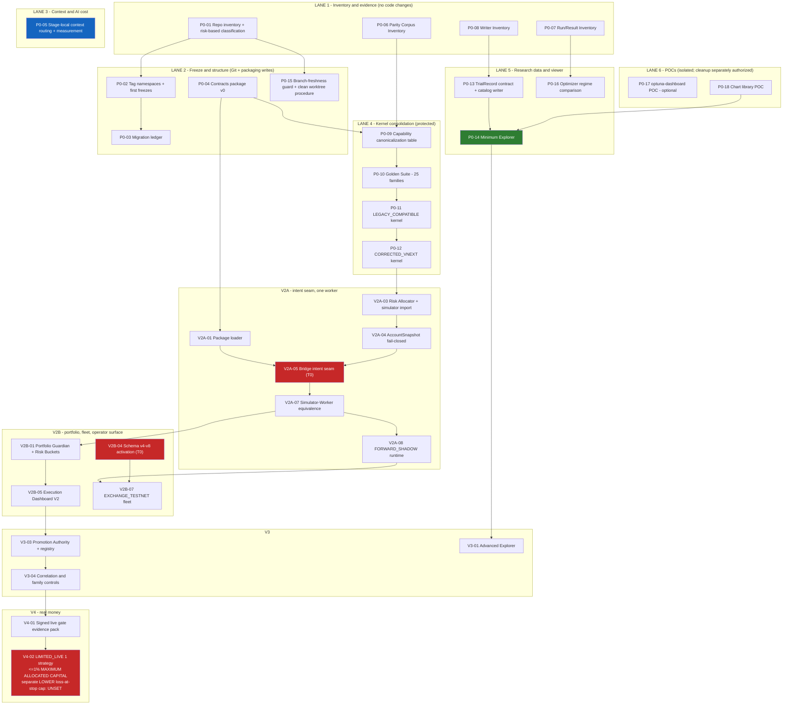

# MASTER WORK PACKAGE AND PARALLEL DELIVERY PLAN

**Date:** 2026-08-22
**Status:** **PLANNING ONLY. NO WORK PACKAGE IS AUTHORIZED TO START.**
**Audit acceptance of the governing technical brief:** **PENDING** (`MASTER_ARCHITECTURE_AND_IMPLEMENTATION_BRIEF_2026-08-21.md` v2.1 — repaired, unaccepted).
**Implementation authorized:** **NO.**
**Companions:** `OWNER_MASTER_PLAN_2026-08-22.md` · `PROJECT_STARTING_POINT_AND_MAIN_OBJECTIVE_2026-08-22.md` · `REQUIREMENTS_TRACEABILITY_REGISTER_2026-08-22.md` · the technical brief.

---

## 0. How to read this document

This plan breaks the work into **bounded packages** so that no single delivery is large enough to become unreviewable, and so that independent work can run in parallel without colliding. It assigns **no dates and no capacity**. Nobody has measured how long any of this takes on this codebase with these tools; inventing an estimate would be a fabrication, and the repository has been burned by confident numbers before.

**Every package below is a proposal.** Starting one requires, at the time it starts, **all three of the following, which are separate things and never imply one another**: the technical brief accepted by the tier-required independent audit(s) under the current root `AGENTS.md` (**G1**); the package's own dependencies accepted; and **the owner's explicit implementation authorization for that specific package** (**G1-IA**).

**G1-IA applies to every package in this plan, protected or not** — a package is not authorized because it is small, documentation-only, unprotected, or because its dependencies happen to be green. Packages touching protected surfaces, the host, testnet, live capital, credentials or destructive Git **additionally** require their own specific gates (G2–G9, §9).

**Field definitions used in every package:**

| Field | Meaning |
|---|---|
| **Objective** | The one thing this package delivers |
| **Inputs** | What must exist before it can start |
| **Outputs** | The concrete artefacts it produces |
| **Depends on** | Packages that must be accepted first |
| **Parallel-safe with** | Packages that may run at the same time **once this package's own dependencies have passed** — a named package here is not a claim that either one may start early, and no package is parallel-safe until its dependencies are accepted |
| **Protected surfaces** | Files or systems where a mistake is expensive or irreversible |
| **Audit tier (provisional)** | As defined by the AUDIT TIER POLICY in `AGENTS.md`: **T0** — two independent flagships (`claude-opus-5` and Codex `gpt-5.6-sol`) at **xhigh**, max 3 repair rounds · **T1** — one flagship at **high**, plus a GLM-5.2 second opinion **only if** the flagship raises findings or the diff exceeds ~300 lines, max 2 rounds · **T2** — a **single docs/evidence reviewer**, single round (GLM-5.2 preferred, DeepSeek acceptable, a flagship at medium effort only if neither is available) · **T3** — **implementer self-verification only, no model audit**. The **highest applicable tier wins** (`T0 > T1 > T2 > T3`), and a T2 finding touching deployed-artefact identity escalates **that finding only** to a single-flagship T1 verification. These classifications are provisional and the owner may raise any of them |
| **Acceptance gate** | What must be true and evidenced before the package is called done |
| **Non-goals** | What this package explicitly does **not** do — the fence that keeps it bounded |

**How completely each package is specified.** Phase 0 and V2 packages (§4, §5, §6) are stated with **all nine fields**, because they are the packages closest to authorization. The V3, V4 and V5+ rows (§7, §8) are deliberately **high-level envelopes** — objective, dependency, provisional tier, acceptance gate and non-goals only. **Each of those rows must be expanded into the full nine-field contract, and re-tiered against the policy above, before it may be authorized or started.** A table row is not an implementable package.

---

## 1. Standing constraints that apply to every package

1. **Bridge V1 keeps soaking, isolated and untouched.** No package below modifies the deployed V1 candidate, its configuration or its host. V2 work happens in separate branches and worktrees. If a package cannot proceed without touching V1, it stops and asks.
2. **Documentation, contracts and context routing are separated from protected work.** A package that only writes documents, defines schemas or reorganizes context never appears in the same package as a change to the kernel, Pine, the Bridge or the runtime.
3. **Nothing is deleted, and nothing deletes itself.** Legacy code is frozen and tagged. Branch pruning happens only with an owner-approved exact target list. **This includes proofs of concept:** a POC is built in an isolated temporary location outside the canonical trees, and it is retired or removed **only under an explicit authorized cleanup act, after its evidence — findings, measurements, decision record — has been preserved.** No package may schedule its own automatic deletion.
4. **Every gate must be able to fail.** A test, guard or check counts as evidence only when it has been shown RED against a deliberate mutation and GREEN after (repo rule D026).
5. **No package may claim completion on a self-confirming check.** The check that "found nothing" must be shown capable of finding something.
6. **Read-only means read-only.** Creating a tag, adding a file, or changing a routing file is a **write**, and is classified as one in this plan.
7. **Every work package requires the owner's explicit implementation authorization before it starts — not only the protected ones.** Audit acceptance of the brief (G1), acceptance of a package's dependencies, and authorization to build that package (**G1-IA**, §9) are three separate acts, and none of them produces another. Protected-surface, host, testnet, live, credential and destructive-Git work needs its specific gate **in addition** to G1-IA, never instead of it. A tier classification is not an authorization either.

---

## 2. Dependency diagram

Red = highest-risk protected work, each needing its own authorization. Blue = highest return per hour. Green = the first thing that gives the owner something to look at.

**WP-V4-02 read exactly (owner clarification D-07, brief §0.5).** The **≤ 1 %** is the **maximum capital allocated** to the single `LIMITED_LIVE` strategy — **not** a loss budget, and no loss budget may be inferred from it. **Loss-at-stop (risk-to-stop) carries a separate and LOWER cap, which is UNSET here and must be defined and evidenced before any live authorization; while it is undefined, WP-V4-01 is not signable and WP-V4-02 may not start.** This plan invents no number for it.

## 3. Parallel lanes

**The lanes group work by the files and systems it touches. They are not a claim that all six start at once.** Only **dependency-ready** packages may run concurrently: a package may begin when its own `Depends on` entries have been accepted, and not before. Several lanes are gated or serialized by their content, not merely by their file paths:

- **Lane 3 (P0-05) changes shared governance** — `AGENTS.md`, handoff files and the routing every future agent reads. It is not isolated from anything. It **lands serially**, as one package, with the before/after measurement taken around it.
- **Lane 4 cannot start on day one.** P0-09 waits for the contracts package (P0-04) and the parity truth (P0-06); the kernel chain P0-09 → P0-10 → P0-11 → P0-12 is strictly serial within itself.
- **Lane 5 respects contract ownership.** The `TrialRecord` schema belongs to P0-04; P0-13 consumes it and does not redefine it. P0-14 additionally waits on P0-13 and P0-18.
- **Lane 2 is partly gated** — P0-02 waits on P0-01, and P0-03 waits on both.

**What a first wave can legitimately contain:** the independent inventories (P0-01, P0-06, P0-07, P0-08), the contracts package (P0-04), the branch-freshness procedure (P0-15), the AI-context measurement and design work (P0-05, landed as a single serial change), and the isolated proofs of concept (P0-17, P0-18). Everything else waits for a dependency.

| Lane | Packages | Touches | Concurrency constraint |
|---|---|---|---|
| **1 — Inventory and evidence** | P0-01, P0-06, P0-07, P0-08 | Reads everything, writes only new inventory documents | Additive documentation; no known file overlap with the other lanes. Downstream packages depend on its outputs |
| **2 — Freeze and structure** | P0-02, P0-03, P0-04, P0-15 | Git refs, a new `contracts/` package, repo-guard config | Internally ordered (P0-01 → P0-02 → P0-03); P0-04 and P0-15 are independent. Lane 4 and V2A depend on P0-04 |
| **3 — Context and AI cost** | P0-05 | `AGENTS.md`, handoff files, stage folders | **Shared governance — lands serially.** It changes how every agent reads the repo. One package, landed once, measured before and after |
| **4 — Kernel consolidation** | P0-09 → P0-12 | The kernel, both legacy engines, Pine as reference | **Gated:** starts only after P0-04 and P0-06. Strictly serial internally. No other package may edit the kernel while it runs |
| **5 — Research data and viewer** | P0-13, P0-14, P0-16 | Research tools, new catalog writer, new read-only viewer | Consumes the `TrialRecord` schema **owned by P0-04**; must not redefine it. P0-14 waits on P0-13 and P0-18 |
| **6 — Isolated POCs** | P0-17, P0-18 | Isolated temporary/POC locations, outside canonical trees | Independent of the other lanes. **Retirement is a separate authorized act, not automatic** — see §1.3 and the packages themselves |

**The one lane that must not run in parallel with itself:** Lane 4. Two agents editing kernel semantics at once is how an accidental synthesis of two engines gets created — the exact failure §7.3 of the brief warns against.

**No package claims to be free of shared state that has not been demonstrated.** Where isolation has not been proven by the repository inventory (WP-P0-01), the correct reading of a `Parallel-safe with` entry is "no overlap is known", not "no overlap exists".

---

# 4. Phase 0 — Foundation

### WP-P0-01 · Repository inventory and risk-based classification
- **Objective:** know exactly what is in the repository — **tracked and untracked alike** — and label everything that matters.
- **Inputs:** **read-only inspection of the existing dirty user-owned checkout, including all of its untracked material**, and read-only inspection of a **clean isolated worktree carrying canonical `master`** (see WP-P0-15 for the procedure, which may be produced in parallel). Both are inputs; the clean worktree alone cannot see what the dirty checkout holds.
- **Outputs:**
  - machine-readable inventory of all 8,031 tracked files (path, size, last-commit date, referenced-by count);
  - **a read-only inventory and classification of every untracked artefact in the existing checkout** — path, size, timestamp/age where available, likely owner, likely purpose, classification, and evidence relevance. **The untracked count is volatile and is measured at execution time with the command recorded**; the "206 untracked" figure in WP-P0-15's inputs is a dated snapshot (brief F-17), never the working number;
  - a Tier-A classification (`CANONICAL` / `LEGACY` / `DUPLICATE` / `EVIDENCE`) for every canonical, migration-relevant and evidence-bearing path, tracked or untracked;
  - Tier-B machine-grouping rules for generated and irrelevant paths, with the rules committed;
  - a list of evidence-bearing branches.
- **Depends on:** nothing.
- **Parallel-safe with:** everything in Phase 0.
- **Protected surfaces:** none — **no file moves**. **The untracked material is the sensitive part: it exists nowhere else and is not recoverable from Git.**
- **Audit tier:** T2.
- **Acceptance gate:** zero unclassified Tier-A paths; every `DUPLICATE` names its canonical twin; every Tier-B group names its rule, count and a sampled spot-check proving the rule swallowed no Tier-A path; `05_PARITY` vs `12_PARITY_PINETS` resolved individually with a full path-list and per-file hash comparison; **and, for untracked material: every untracked artefact in scope appears in the inventory with a classification — proven by reconciling the inventory row count against a freshly measured untracked listing, so that nothing is silently ignored — with the enumeration shown capable of finding an artefact it was not told about. Anything whose owner or purpose cannot be established is recorded `UNKNOWN` rather than guessed, and an `UNKNOWN` blocks any cleanup, prune, move or migration that would affect it until ownership is established.**
- **Non-goals:** no moves, no deletions, no branch pruning, no canonicalization decisions. **Specifically for untracked material: this package may not move, stage (`git add`), delete, overwrite, rename or commit any untracked item, and may not `checkout`, `reset`, `clean` or `stash` anything. It reads and records; it changes nothing.**

### WP-P0-02 · Tag namespaces and the first freezes
- **Objective:** give the repository immutable freeze points, which it has never had.
- **Inputs:** WP-P0-01 Tier-A classification and evidence-bearing branch list.
- **Outputs:** `pkg/`, `release/`, `legacy/` namespaces in use; tags on current master, the Pine controller, the MTC_V2 kernel, `02_MTC_BACKTEST`, the parity oracle set, the accepted Bridge V1 candidate, and every evidence-bearing branch.
- **Depends on:** WP-P0-01.
- **Parallel-safe with:** Lanes 1, 3, 5, 6.
- **Protected surfaces:** Git refs. **Additive only — no ref is moved or deleted.**
- **Audit tier:** T2.
- **Acceptance gate:** tags exist and are pushed; the count of tags is no longer zero; the live-gate precondition "frozen, tagged commit" becomes satisfiable in principle.
- **Non-goals:** no pruning, no history rewriting, no force-push, no deletion of anything.

### WP-P0-03 · Migration ledger
- **Objective:** make every future move reversible and traceable in both directions.
- **Inputs:** WP-P0-01, WP-P0-02.
- **Outputs:** append-only `MIGRATION_LEDGER.json` — `old_path → new_location → sha256 → status`.
- **Depends on:** WP-P0-01, WP-P0-02. · **Parallel-safe with:** Lanes 3, 5, 6.
- **Protected surfaces:** none. · **Audit tier:** T2.
- **Acceptance gate:** every Tier-A `CANONICAL` file has a ledger row; the ledger resolves in both directions on a sampled check.
- **Non-goals:** performing any move.

### WP-P0-04 · Contracts package v0 (Q2a)
- **Objective:** one versioned home for the schemas that every other component must agree on.
- **Inputs:** technical brief §5.4, §6.7, §11.2.
- **Outputs:** `MTC_COMMAND_CENTER/contracts/` — `SizingIntent`, `OrderIntent`, `ExitIntent`, `StrategyPackage`, identity formulae (`candidate_id`, `package_hash`, `evaluation_run_hash`, `trial_id`, `run_id`), `RiskBucket` and allocation-policy schemas, `TrialRecord`, lineage types; semver, changelog, compatibility tests, consumer contract tests for the simulator and the Bridge.
- **Depends on:** nothing. · **Parallel-safe with:** all Phase 0 lanes.
- **Protected surfaces:** none — **the Bridge's runtime behaviour does not change**; the Bridge side is a compatibility assertion only.
- **Audit tier:** T1 (schemas that will later govern money-moving code).
- **Acceptance gate:** package installable from a released version, never a path; compatibility and consumer tests green; **a deliberate breaking change proven to fail a test**.
- **Non-goals:** **no Bridge runtime wiring** (that is WP-V2A-05); no consumers migrated; no optimizer chosen.

### WP-P0-05 · Stage-local context routing and measurement (Q2b input)
- **Objective:** cut the ~180,000-token onboarding cost, and produce the measurement that decides the topology question.
- **Inputs:** current `AGENTS.md`, `_AI_MEMORY/`, `11_TRIAGE/`.
- **Outputs:** capped root `AGENTS.md`, `CONTEXT_MAP.md`, `DECISIONS.md`; per-stage `AGENTS.md` / `INPUTS.md` / `OUTPUTS.md` / `TESTS.md` / `HANDOFF.md`; `GLOBAL_HANDOFF.md` and `NEXT_STEPS.md` moved to `history/` as grep-on-demand archives; a generated `11_TRIAGE/INDEX.md`; **a before/after measurement per task class of default context size and cold-start time**.
- **Depends on:** nothing. · **Parallel-safe with:** everything, but **land it once** — it changes how all other agents read the repository.
- **Protected surfaces:** governance files. A wrong edit here misroutes every future agent.
- **Audit tier:** T1.
- **Acceptance gate:** measured reduction recorded numerically, before and after, per task class; no binding rule lost in the move — proven by a checklist of every rule in the old files mapped to its new home.
- **Non-goals:** no repository split; no decision on topology; no deletion of history.

### WP-P0-06 · Parity Corpus Inventory *(closes Appendix E open item O-13)*
- **Objective:** establish what each parity corpus actually tested, so F-7 can be cited in a decision.
- **Inputs:** all four corpora named in brief §2 F-7.
- **Outputs:** a table per corpus: exact Pine implementation and version, exact Python implementation and version, PineTS version, generation date, data and case scope, oracle identity and tolerances, executable/skipped/not-comparable counts with reuses separated from executions, and every unresolved mismatch named.
- **Depends on:** nothing. · **Parallel-safe with:** everything.
- **Protected surfaces:** none — read-only over evidence. · **Audit tier:** T1.
- **Acceptance gate:** the March/April question answered — either "different implementations, not a regression" with evidence, or "a regression, here it is". **Until this closes, no parity number may be quoted as repository-wide.**
- **Non-goals:** no corpus regenerated, moved, merged or overwritten; no new repository.

### WP-P0-07 · Run/Result Inventory *(closes Appendix E open item O-14)*
- **Objective:** establish whether "zero strict survivors" is one sweep or the all-time record.
- **Inputs:** `05_BACKTEST_RESULTS/`, `research/`, run registries.
- **Outputs:** every recorded run with engine, date, configuration count and strict-survivor count.
- **Depends on:** nothing. · **Parallel-safe with:** everything. · **Protected surfaces:** none. · **Audit tier:** T2.
- **Acceptance gate:** F-22's scope either upgraded to "ever" with evidence, or refuted, or explicitly left bounded with the gap named.
- **Non-goals:** no re-running of research; no promotion of anything found.

### WP-P0-08 · Writer Inventory *(closes Appendix E open item O-15)*
- **Objective:** know what already persists trial and trade data before designing a schema that might duplicate it.
- **Inputs:** every writer in `03_QUANTLENS/tools/` and the research toolchain.
- **Outputs:** per writer — unit of persistence, fields present, fields missing, format, and a verdict: emit `TrialRecord` directly, or retire.
- **Depends on:** nothing. · **Parallel-safe with:** everything. · **Protected surfaces:** none. · **Audit tier:** T2.
- **Acceptance gate:** the table is complete and the search that produced it is shown capable of finding a writer it was not told about.
- **Non-goals:** no writer changed (that is WP-P0-13).

### WP-P0-09 · Capability canonicalization table
- **Objective:** decide, capability by capability, what the kernel's semantics **should** be — before any code moves.
- **Inputs:** WP-P0-04 (contracts), WP-P0-06 (parity truth), both Python engines, Pine.
- **Outputs:** for every economically meaningful capability: implementation A behaviour cited to line, implementation B behaviour cited to line, Pine reference cited to line, the exact disagreement, the **decided** canonical semantics with reasoning, the chosen implementation, and the golden fixture that pins it.
- **Depends on:** WP-P0-04, WP-P0-06. · **Parallel-safe with:** Lanes 1, 3, 5, 6.
- **Protected surfaces:** none yet — this is analysis. · **Audit tier:** **T0** (it decides the trading model).
- **Acceptance gate:** table complete and reviewed; **no capability marked "whichever is easier to migrate"**.
- **Non-goals:** no code written; no blending of two implementations until tests pass.

### WP-P0-10 · Kernel Economic Golden Suite — 25 families
- **Objective:** build the gate that can actually catch a silent behaviour change.
- **Inputs:** WP-P0-09 decided semantics; Corpus B cases as candidate fixtures, with its 121 reused passes excluded from any count.
- **Outputs:** deterministic fixtures for all 25 families (brief §9.3), each with expected outputs derived from the decided semantics; family 18 additionally as a D026 RED/GREEN snapshot-drift case.
- **Depends on:** WP-P0-09. · **Parallel-safe with:** Lanes 1, 3, 5, 6.
- **Protected surfaces:** none — fixtures only. · **Audit tier:** **T0**.
- **Acceptance gate:** all 25 families have fixtures; **each fixture shown RED against a deliberate mutation** and GREEN otherwise.
- **Non-goals:** no kernel code; no overwriting of the existing parity corpora.

### WP-P0-11 · Kernel `LEGACY_COMPATIBLE` (M7a)
- **Objective:** prove the consolidation moved nothing by accident.
- **Inputs:** WP-P0-09, WP-P0-10, frozen legacy tags from WP-P0-02.
- **Outputs:** one kernel package reproducing frozen legacy behaviour **exactly, including the known defects**.
- **Depends on:** WP-P0-09, WP-P0-10, WP-P0-02. · **Parallel-safe with:** Lanes 1, 3, 5, 6 — **not** with any other kernel package.
- **Protected surfaces:** **the strategy kernel.** · **Audit tier:** **T0**.
- **Acceptance gate:** entry-signal golden reproduced bit-identically (858/858 over 48,077 bars); the legacy branch of every applicable golden family green; **any unexplained mismatch stops the migration**.
- **Non-goals:** no defect fixed here; no behaviour improved; no legacy code deleted.

### WP-P0-12 · Kernel `CORRECTED_VNEXT` (M7b)
- **Objective:** fix the known defects deliberately, under a new version, with evidence.
- **Inputs:** WP-P0-11.
- **Outputs:** new semantic version applying: contract multiplier, minimum notional, frozen instrument metadata, gap-aware stop fills, in-path slippage, a **named** same-bar collision policy, a real fee schedule. Each with a defect record, before/after evidence, RED/GREEN falsification and new expected golden artifacts.
- **Depends on:** WP-P0-11. · **Parallel-safe with:** Lanes 1, 3, 5, 6.
- **Protected surfaces:** **the strategy kernel.** · **Audit tier:** **T0**.
- **Acceptance gate:** **no undocumented behavioural difference exists between P0-11 and P0-12.** Phase 0 is not complete without this.
- **Non-goals:** no new features; no optimization; no runtime wiring.

### WP-P0-13 · `TrialRecord` contract and trial-catalog writer
- **Objective:** stop throwing away the data the owner wants to look at.
- **Inputs:** WP-P0-04 schema, WP-P0-08 writer inventory.
- **Outputs:** optimizer-independent `TrialRecord` emission — one row per trial, Parquet, DuckDB-queryable, carrying `rejection_reasons`, `search_regime`, `family_size`, `simulator_class`, `evaluation_run_hash`; full artifacts for selected trials per the selection rule.
- **Depends on:** WP-P0-04, WP-P0-08. · **Parallel-safe with:** Lane 4, Lane 6.
- **Protected surfaces:** research tooling (not money-adjacent). · **Audit tier:** T1.
- **Acceptance gate:** a real run produces a queryable catalog; a trial that was rejected can be found **by its rejection reason**.
- **Non-goals:** no UI; no optimizer switch; no change to statistical thresholds.

### WP-P0-14 · Minimum Explorer
- **Objective:** give the owner something to look at, and reduce dependence on AI-written summaries.
- **Inputs:** WP-P0-13 catalog; WP-P0-18 charting verdict.
- **Outputs:** read-only research viewer — filters, ranking table with `classification` and `rejection_reasons`, exact parameters per row, key statistics, equity and drawdown curves, basic candlestick chart with entry/exit markers, navigation between variants.
- **Depends on:** WP-P0-13, WP-P0-18. · **Parallel-safe with:** Lane 4.
- **Protected surfaces:** none. **Research domain, no credentials, read-only with respect to trading.**
- **Audit tier:** T1.
- **Acceptance gate:** the owner can answer "what was tried and why was it rejected" without asking an AI.
- **Non-goals:** **no promotion actions of any kind**; no execution data; no advanced visualizations; this is not the execution dashboard.

### WP-P0-15 · Branch-freshness guard and clean-worktree procedure
- **Objective:** stop agents working on stale branches, without deleting anything.
- **Inputs:** current repo state (dirty checkout, 60 commits behind master, 206 untracked files — **a dated snapshot from brief F-17; the live untracked count is volatile and is measured at execution by WP-P0-01**).
- **Outputs:** a documented procedure for creating a **verified clean isolated worktree** from a named commit (verify clean, verify commit, then work); a branch-freshness check in the repo guard.
- **Depends on:** nothing. · **Parallel-safe with:** everything.
- **Protected surfaces:** repo-guard configuration. · **Audit tier:** **T1** — repaired 2026-08-22 (brief §0.4 RF-T2-4): this package **adds a check to the repo guard**, which is non-economic product tooling every future agent runs against, not a documentation artefact. The written procedure alone would be T2; the guard change governs, by the highest-applicable-tier rule.
- **Acceptance gate:** the guard fires on a deliberately stale branch, shown RED without the check and GREEN with it; the current dirty checkout is left untouched — **including every untracked file in it** — until WP-P0-01 has inventoried and classified that untracked material.
- **Non-goals:** **no branch pruning, no reset, no stash, no clean, no force-push, no discarding of untracked work.**

### WP-P0-16 · Optimizer regime comparison (grid vs Optuna)
- **Objective:** decide the optimizer on measurement, not on what is already installed.
- **Inputs:** WP-P0-13 catalog; frozen strategies and datasets; WP-P0-07.
- **Outputs:** measured comparison — trials to reach the same best out-of-sample metric, space coverage, reproducibility under re-run, and the resulting DSR/BH-FDR family size.
- **Depends on:** WP-P0-13. · **Parallel-safe with:** Lane 4, Lane 6. · **Protected surfaces:** none. · **Audit tier:** T1.
- **Acceptance gate:** a recommendation with numbers behind it; the effect on the multiple-testing family stated explicitly.
- **Non-goals:** no adoption without a separate decision (**brief §21.2 open item O-2**).

### WP-P0-17 · `optuna-dashboard` POC — **optional, isolated, not automatically deleted**
- **Objective:** only if it saves work — a stopgap view while the Minimum Explorer is built.
- **Inputs:** an Optuna study, which the current grid engine does not produce.
- **Outputs:** a local viewer built in an **isolated temporary/POC location outside the canonical trees**, or a written decision to skip it; either way, a recorded finding.
- **Depends on:** nothing. · **Parallel-safe with:** everything. · **Protected surfaces:** none.
- **Audit tier:** **T1 if POC code is built** — repaired 2026-08-22 (brief §0.4 RF-T2-4): a local viewer is non-economic product code, not documentation. **If the package is skipped and produces only a documented skip decision, that closure artefact alone is T2.** The tier is fixed by what the package actually produces, and the higher classification applies the moment any code is written.
- **Acceptance gate:** **timebox ≤ 2 days.** If the setup cost approaches the saving, or the Minimum Explorer is within about a week, **skip it and record that decision**.
- **Non-goals:** **never becomes a second maintained viewer** — once WP-P0-14 lands it is no longer developed or maintained, and it is **not** deleted automatically. **Retirement or removal is a separate, explicitly authorized cleanup act performed only after its evidence has been preserved** (§1.3). It is not an Optuna adoption decision.

### WP-P0-18 · Chart-library POC (Q19)
- **Objective:** price the cost of a draggable level before locking in a library.
- **Inputs:** brief §12.2 criteria.
- **Outputs:** a working draggable horizontal level in **both** candidate libraries; a comparison across markers at scale, SL/TP/Multi-TP overlays, stepped trailing history, touch behaviour, large trade-history performance, maintenance and licence, and integration effort.
- **Depends on:** nothing. · **Parallel-safe with:** everything. · **Protected surfaces:** none. · **Audit tier:** T1.
- **Acceptance gate:** a recommendation with the drag implementation cost measured, not estimated. Timebox 2–3 days.
- **Non-goals:** no production UI; no adoption of an unverified charting project on a money-adjacent surface.

### WP-P0-19 · Pine de-fang design and T0 authorization package *(design only)*
- **Objective:** prepare — not perform — the removal of the Pine order-routing path.
- **Inputs:** brief §8.3; WP-P0-02 freeze tag on the controller.
- **Outputs:** the exact file and line list to change, the visualization-copy plan, the CI guard specification with an empty allowlist, the divergence-alarm specification, and a rollback path.
- **Depends on:** WP-P0-02. · **Parallel-safe with:** everything. · **Protected surfaces:** none — **this package writes no Pine and no config**.
- **Audit tier:** T2 for the design; the change itself is **T0**.
- **Acceptance gate:** the owner has a package specific enough to authorize or refuse.
- **Non-goals:** **it does not perform the change.** Executing it requires its own T0 authorization and its own audit round (see §9).

---

# 5. V2A — the intent seam and one worker

*Gate into V2A: Phase 0 acceptance criteria green; brief accepted (G1); **owner implementation authorization for each package started (G1-IA)**; and, for protected-surface work, its own specific gate in addition.*

### WP-V2A-01 · Frozen package loader
- **Objective:** execution loads only frozen, hash-verified packages.
- **Inputs:** WP-P0-04 identity formulae and contracts release; WP-P0-02 tag namespaces and the frozen artefacts they pin.
- **Outputs:** a loader that verifies `package_hash` and refuses anything unverified or unregistered; a machine-readable refusal taxonomy; a D026 RED/GREEN tamper fixture.
- **Depends on:** WP-P0-04, WP-P0-02.
- **Parallel-safe with:** WP-V2A-03 — **only once both packages' own dependencies have been accepted; not parallel-safe before that.**
- **Protected surfaces:** the Bridge process boundary — this is the admission control that decides which code may run against an account.
- **Audit tier:** **T0** (admission control for everything the runtime executes).
- **Acceptance gate:** a tampered package is refused and the refusal reason is machine-readable, proven **RED without the check and GREEN with it** per D026.
- **Non-goals:** no promotion registry yet (V3); no execution behaviour change; no deployment; no change to the deployed V1 instance.

### WP-V2A-02 · Worker identity and per-worker state — **one worker**
- **Objective:** a single strategy worker with an immutable identity tuple and isolated state.
- **Inputs:** WP-V2A-01 loader; WP-P0-04 identity formulae.
- **Outputs:** the immutable identity tuple; an isolated per-worker state store; a restart and recovery path with its fixture.
- **Depends on:** WP-V2A-01.
- **Parallel-safe with:** WP-V2A-03 — **only after WP-V2A-01 and WP-P0-12 respectively have been accepted; not parallel-safe before that.**
- **Protected surfaces:** Bridge runtime and per-worker state — the process that will later hold live positions.
- **Audit tier:** **T0** (runtime identity and state on the live execution path).
- **Acceptance gate:** one worker runs, restarts and recovers with its identity and state intact, proven by a falsified restart fixture that fails without the isolation.
- **Non-goals:** no multi-worker supervisor (V2B); no orders on any venue; no schema activation.

### WP-V2A-03 · Risk Allocator, shared by simulator and runtime
- **Objective:** one deterministic, versioned function that proposes `AuthorizedQuantity`, imported by both the backtest simulator and the live worker.
- **Inputs:** WP-P0-12 kernel; WP-P0-04 contracts.
- **Outputs:** the allocator; its V2 pass-through policy; **the backtest simulator importing it on day one**.
- **Depends on:** WP-P0-12, WP-P0-04.
- **Parallel-safe with:** WP-V2A-01, WP-V2A-02 — **only once WP-P0-12 and WP-P0-04 have been accepted; not parallel-safe before that.**
- **Protected surfaces:** sizing — money-adjacent. · **Audit tier:** **T0**.
- **Acceptance gate:** the same code path demonstrably runs in backtest and runtime; **an allocator that is not simulated fails acceptance** — this is the single highest-risk regression in the whole design.
- **Non-goals:** no resizing policy; no discretionary trim; no Guardian logic; **the allocator proposes a full quantity and never a partial one.**

### WP-V2A-04 · `AccountSnapshot` identity and fail-closed rejection
- **Objective:** kernel and allocator compute against one immutable snapshot, or nothing is submitted.
- **Inputs:** WP-V2A-03 allocator; WP-P0-04 contracts.
- **Outputs:** the immutable `AccountSnapshot` type with `snapshot_id`; the runtime `SNAPSHOT_MISMATCH` / `SNAPSHOT_STALE` / `REFERENCE_DIVERGENCE` rejection paths; the D026 snapshot-drift and bucket-capital-divergence fixtures.
- **Depends on:** WP-V2A-03.
- **Parallel-safe with:** WP-V2A-01 — **only once WP-V2A-03 has been accepted; not parallel-safe before that.**
- **Protected surfaces:** sizing and submission path. · **Audit tier:** **T0**.
- **Acceptance gate:** runtime `SNAPSHOT_MISMATCH`, `SNAPSHOT_STALE` and `REFERENCE_DIVERGENCE` rejections submit no order, proven by a **D026 RED/GREEN** snapshot-drift and bucket-capital-divergence fixture.
- **Non-goals:** no reconciliation of a mismatch by preferring one side — ever.

### WP-V2A-05 · Bridge intent seam — **the protected change**
- **Objective:** the Bridge executes an authorized `OrderIntent` exactly, or rejects loudly, and never originates a quantity when an authorized intent is present.
- **Inputs:** WP-V2A-01 to WP-V2A-04.
- **Outputs:** the seam; the fence test; the machine-readable rejection taxonomy.
- **Depends on:** WP-V2A-01, WP-V2A-02, WP-V2A-03, WP-V2A-04. · **Parallel-safe with:** **nothing** — it is serialized against every other V2A package and may not start until all four dependencies are accepted.
- **Protected surfaces:** **the Bridge engine and risk paths — the live execution core.**
- **Audit tier:** **T0, with its own owner authorization.**
- **Acceptance gate:** a test proves that a Bridge-originated quantity in the presence of an authorized intent **fails**; the existing Bridge test suite reproduces its baseline unchanged.
- **Non-goals:** no schema activation; no orders on any venue; **no change to the deployed V1 instance.**

### WP-V2A-06 · Native strategy stop semantics (Q7) — **local proof only, zero venue contact**
- **Objective:** define and prove the native reduce-only stop contract — the strategy's stop **is** the live reduce-only exchange order — **entirely locally**. **Scope repaired 2026-08-22 (brief §0.4 RF-T2-3):** the contract stays in V2A; the *real venue* proof moves to WP-V2B-07. V2A's defining property is **zero orders, no testnet, no venue contact**, and this package does not breach it.
- **Inputs:** WP-V2A-05 intent seam; the brief §5.4 and §9.2 stop semantics; a **local deterministic adapter-emulator or recorded replay** of venue order behaviour. **No credentials of any kind, no network path to any venue.**
- **Outputs:** native reduce-only stop **placement, amendment and cancellation** semantics defined and implemented against the emulator/replay; the **identical backtest model** of a continuously active protective order; a **local process-kill/restart harness** in which the emulator retains the protective order while the worker process is killed, and the worker on restart re-attaches to it rather than duplicating or orphaning it; the recorded divergence report between emulated and simulated protection.
- **Depends on:** WP-V2A-05. · **Parallel-safe with:** **nothing in V2A** until WP-V2A-05 is accepted.
- **Protected surfaces:** order placement (the code path that will later reach a venue, exercised here only against the emulator). · **Audit tier:** **T0**.
- **Acceptance gate:** placement/amend/cancel semantics behave as specified against the deterministic emulator; the backtest models the stop identically as a continuously active protective order; **the local process-kill/restart harness shows the protective order surviving the worker's death and being re-attached on restart**, falsified per D026 (RED without the mechanism, GREEN with it); and a test proves **no credential is read and no venue network call is reachable from this package**.
- **Non-goals:** **no venue contact, no testnet, no credentials, no orders anywhere** — the real exchange-native protective-order and process-kill survival drill is **WP-V2B-07** under gate G4, and an emulator result is **never** presented as a real-venue result. No Multi-TP execution; no synthetic-stop fallback in V2.

### WP-V2A-07 · Simulator↔Worker replay equivalence
- **Objective:** the test that makes the architecture true rather than aspirational.
- **Inputs:** WP-V2A-03 allocator, WP-V2A-05 seam, frozen historical bars.
- **Outputs:** a harness feeding identical historical bars to the simulator and to a worker in replay mode; a recorded divergence report; the D026 falsification.
- **Depends on:** WP-V2A-05. · **Parallel-safe with:** **nothing in V2A** until WP-V2A-05 is accepted.
- **Protected surfaces:** none directly — but it is the **gate** on which every downstream money-adjacent package depends, so a false pass here is expensive.
- **Audit tier:** **T0**.
- **Acceptance gate:** **identical `OrderIntent` streams including allocator output**, falsified per D026.
- **Non-goals:** no live data; no venue contact; no orders.

### WP-V2A-08 · `FORWARD_SHADOW` runtime
- **Objective:** start forward clocks safely on frozen packages.
- **Inputs:** WP-V2A-07 equivalence evidence; frozen packages with verified `package_hash`; real market feeds, read-only.
- **Outputs:** the shadow runtime; timestamped observation records bound to `package_hash`; `OBSERVED_DURING_RESEARCH` marking; evidence windows measured from freeze.
- **Depends on:** WP-V2A-07. · **Parallel-safe with:** WP-V2A-09 — **only once WP-V2A-07 and WP-V2A-05 respectively are accepted.**
- **Protected surfaces:** none — **zero orders anywhere, no credentials, read-only feeds.**
- **Audit tier:** **T1** — non-economic because the runtime places **zero orders on any venue**. **If any package ever gives this path order-placing capability, it becomes T0.**
- **Acceptance gate:** a frozen package accumulates timestamped observations bound to its `package_hash`, with `OBSERVED_DURING_RESEARCH` marking applied correctly and evidence windows recorded from freeze; the zero-order property proven by a test that fails if an order path is reachable.
- **Non-goals:** no orders, no credentials in the research domain, no promotion.

### WP-V2A-09 · Bridge migration record (M9)
- **Objective:** replace "wholesale migration" with a named, evidenced record.
- **Inputs:** WP-V2A-05 outcome; the accepted V1 candidate identity; the V2 package audit statuses; the baseline test suite.
- **Outputs:** accepted source commit; included and excluded V2 packages; audit status of each; baseline test results; configuration and schema version; deployment identity; known inactive capabilities; post-migration reproduction criteria.
- **Depends on:** WP-V2A-05. · **Parallel-safe with:** WP-V2A-08, once its own dependency is accepted.
- **Protected surfaces:** none — **this package writes a record only; it changes no code, configuration or deployment.**
- **Audit tier:** **T2** (docs/evidence, single reviewer, single round). **Identity escalation applies:** any finding touching deployed-artefact identity — commit SHAs, `package_hash`, schema version, deployment identity, release manifest — escalates **that finding alone** to a single-flagship T1 verification, never a full multi-model round.
- **Acceptance gate:** every claim binds to an exact commit and package identity; the baseline suite is reproduced.
- **Non-goals:** no deployment; no host contact; no schema activation; no migration performed.

---

# 6. V2B — portfolio, execution fleet and the operator surface

*Gate into V2B: V2A accepted; **owner implementation authorization for each package started (G1-IA)**; **and** the schema-activation T0 contract written and separately authorized.*

### WP-V2B-01 · Portfolio Guardian and Risk Buckets
- **Objective:** account-level authority that may only authorize or reject.
- **Inputs:** WP-V2A-07 equivalence evidence; WP-P0-04 `RiskBucket` and allocation-policy schemas; the owner's bucket definitions.
- **Outputs:** the Guardian authorize-or-reject decision path; risk-bucket definitions with per-bucket capital and limits; a machine-readable rejection-reason taxonomy; the schema test that forbids partial authorization.
- **Depends on:** WP-V2A-07. · **Parallel-safe with:** **nothing in V2B** until WP-V2A-07 is accepted; WP-V2B-02, WP-V2B-03 and WP-V2B-05 all depend on it.
- **Protected surfaces:** account-level risk — the authority over every order's fate. · **Audit tier:** **T0**.
- **Acceptance gate:** a test proves the V2 `OrderIntent` schema has **no `RESIZED` value** and no code path produces a partial authorization; every rejection carries a machine-readable reason.
- **Non-goals:** no resizing; no allocation policy; no correlation gating yet; **the Guardian never proposes a quantity — it authorizes the allocator's proposal in full or rejects it in full.** **Scope of "no resizing" (owner D-02 clarification, 2026-08-22, brief §0.5): the rule governs NEW-ORDER SIZING. This package builds no emergency reduction or closure of existing exposure — such a capability would be a distinct, separately authorized, explicit and tested safety policy, and neither this package nor the clarification authorizes building or using one.**

### WP-V2B-02 · `PortfolioSimulator` with shared Guardian policy objects
- **Objective:** portfolio backtests that reflect portfolio behaviour.
- **Inputs:** WP-V2B-01 Guardian policy objects; WP-V2A-03 allocator; ≥ 2 frozen strategies and their datasets.
- **Outputs:** a portfolio simulator importing the **same** allocator and Guardian objects as the runtime; a documented explanation of where portfolio results diverge from the sum of individual backtests.
- **Depends on:** WP-V2B-01. · **Parallel-safe with:** WP-V2B-03, WP-V2B-05 — **only once WP-V2B-01 is accepted.**
- **Protected surfaces:** none directly, but it is **the only place portfolio risk policy is proved before it governs money**; a wrong simulation licenses a wrong live policy.
- **Audit tier:** **T0**.
- **Acceptance gate:** a ≥ 2-strategy portfolio backtest differs from the sum of individual backtests **in an explainable way**, using the same allocator and Guardian objects as runtime.
- **Non-goals:** no live multi-strategy operation; no runtime resizing **of new-order sizing (owner D-02 clarification, 2026-08-22, brief §0.5) — and no simulated or real emergency reduction of existing exposure either, which would be a separately authorized, explicit, tested safety policy outside this package**; no correlation policy (WP-V3-04).

### WP-V2B-03 · Multi-worker supervisor (hybrid isolation, Q4)
- **Objective:** run two or more strategy workers concurrently on one release under the Q4 hybrid isolation model, without letting a fault in one reach another.
- **Inputs:** WP-V2A-02 worker identity and state model; WP-V2B-01 Guardian; the Q4 isolation decision (§10.2 of the brief).
- **Outputs:** the supervisor; per-worker isolated state and lifecycle control; a fault-injection drill showing containment.
- **Depends on:** WP-V2B-01. · **Parallel-safe with:** WP-V2B-02 — **only once WP-V2B-01 is accepted.**
- **Protected surfaces:** the live runtime and the isolation boundary between workers that hold positions.
- **Audit tier:** **T0** (a breach of worker isolation is a money-moving failure).
- **Acceptance gate:** two or more workers run concurrently on one release, each with isolated state; **a fault in one cannot move another's money**, proven by a fault-injection test that fails without the isolation.
- **Non-goals:** no container runtime; no orchestration platform; no live capital.

### WP-V2B-04 · Schema activation v4 → v8 — **highest-risk operation in the plan**
- **Objective:** switch on the accepted risk contracts that the default init path does not enable.
- **Inputs:** **independent verification of the deployed schema version first**; WP-V2A-09 migration record; a copy of the real database; owner and host-access authorization.
- **Outputs:** its own T0 contract; a rehearsal on a copy of the real database; a proven rollback; an activation record.
- **Depends on:** WP-V2A-09; owner authorization; **host access authorization**.
- **Parallel-safe with:** **nothing.** It runs alone, in its own window, combined with no other change.
- **Protected surfaces:** **the live state database.** · **Audit tier:** **T0, separate authorization, separate audit.**
- **Acceptance gate:** rehearsed migration with proven rollback; **never performed during an armed window**; daily controls and exposure gates demonstrably enforcing afterwards.
- **Non-goals:** no combining with any other change; no "while we are in there" edits.

### WP-V2B-05 · Execution Dashboard V2
- **Objective:** the operator surface, built from the accepted Package 3 prototype.
- **Inputs:** WP-V2B-01 Guardian decision stream and rejection taxonomy; the accepted Package 3 prototype; the runtime state and reconciliation feeds.
- **Outputs:** the dashboard — three-column desired/authorized/actual view, per-panel staleness, block reasons, package-hash integrity pill, reconciliation view with drift alarm, one deduplicated notification channel, and the **ARM / DISARM / KILL command paths**.
- **Depends on:** WP-V2B-01. · **Parallel-safe with:** WP-V2B-02, WP-V2B-03 — **only once WP-V2B-01 is accepted.**
- **Protected surfaces:** the **command surface (ARM/DISARM/KILL)** and the operator's picture of live state.
- **Audit tier:** **T0 for the whole package.** The package contains the command paths, and by the highest-applicable-tier rule that classification governs every part of it — the read-only panels are not audited separately at a lower tier.
- **Acceptance gate:** desired / authorized / actual shown as three separate columns; per-panel staleness; block reason always visible; package-hash integrity pill; reconciliation view with drift alarm; **no state that silently changes position size**; one notification channel with dedup.
- **Non-goals:** no research features; no shared session with the research app; no drag-and-drop beyond simulation.

### WP-V2B-06 · Zero-trust access and step-up authentication
- **Objective:** make the operator surface reachable only by the owner, with a second factor on every dangerous command.
- **Inputs:** WP-V2B-05 dashboard and its command paths; the private-mesh design in the brief §17.
- **Outputs:** private-mesh-only exposure with no public port; WebAuthn/FIDO2 step-up on ARM, KILL and FLATTEN; the tests that prove each action fails without it.
- **Depends on:** WP-V2B-05. · **Parallel-safe with:** **nothing** until WP-V2B-05 is accepted.
- **Protected surfaces:** network and auth — the boundary that decides who may command the system. · **Audit tier:** **T0**.
- **Acceptance gate:** no public port including 80/443; private mesh only; WebAuthn/FIDO2 step-up required for ARM, KILL and FLATTEN, proven by a test that the action fails without it.
- **Non-goals:** no identity server; no TOTP as the primary factor.

### WP-V2B-07 · `EXCHANGE_TESTNET` execution fleet (capacity-driven, Q17)
- **Objective:** exercise the real order lifecycle on testnet, size the fleet from measured venue behaviour, and **carry out the real exchange-native protective-order and process-kill survival drill that WP-V2A-06 could only prove against a local emulator** (brief §0.4 RF-T2-3).
- **Inputs:** WP-V2B-04 activated schema; WP-V2A-08 shadow evidence; **WP-V2A-06's accepted local stop semantics and its emulator/replay expectations, as the baseline the real venue is compared against**; **explicit testnet authorization and testnet-scoped credentials supplied by the owner.**
- **Outputs:** the testnet fleet; a measured capacity record (rate limits, event-processing latency, reconciliation reliability); the full lifecycle evidence set; **the real-venue protective-order drill record — a native reduce-only stop placed on testnet, the worker process killed, the stop shown still live at the exchange, and the worker on restart re-attaching to it rather than duplicating or orphaning it — plus a named comparison against WP-V2A-06's emulated result, with every divergence recorded rather than reconciled away.**
- **Depends on:** WP-V2B-04, WP-V2A-08; **WP-V2A-06** for the stop contract it validates. · **Parallel-safe with:** **nothing** — it is the only package permitted to contact a venue in V2B, and it runs alone.
- **Protected surfaces:** venue interaction and credential handling. · **Audit tier:** **T0; requires testnet authorization.**
- **Acceptance gate:** real order lifecycle exercised — acceptance, rejects, partial fills, protective orders, reconnects, reconciliation — with fleet size increased only while rate limits, event processing and reconciliation stay reliable; **and the real exchange-native protective order demonstrably survives a process kill on testnet, with restart re-attachment proven and every divergence from the WP-V2A-06 emulated baseline named. This is the first and only place that survival claim is proven against a real venue.**
- **Non-goals:** no real money; no mainnet keys anywhere near this; **no agent creates, requests or stores a credential.**

### WP-V2B-08 · Drag-and-drop, **simulation mode only**
- **Objective:** let the owner drag a level and see the consequence, with nothing leaving the machine.
- **Inputs:** WP-V2B-05 dashboard and chart surface; WP-P0-18 charting verdict.
- **Outputs:** draggable hypothetical levels with computed R, risk and portfolio impact; the test proving no broker call is reachable from this path.
- **Depends on:** WP-V2B-05. · **Parallel-safe with:** WP-V2B-06 — **only once WP-V2B-05 is accepted.**
- **Protected surfaces:** none — **simulation only, no order path, no network call to any broker.**
- **Audit tier:** **T1** — non-economic **because it is simulation-only**. **Paper, testnet or live dragging is a different package at T0** (WP-V3-07, WP-V4-03).
- **Acceptance gate:** dragging changes a hypothetical level and shows resulting R, risk and portfolio impact, with **no network call to any broker**, proven by a test that fails if such a call becomes reachable.
- **Non-goals:** no paper mode, no live mode, no `ExitIntent` emission.

### WP-V2B-09 · Workflow cutover (M10)
- **Objective:** move real day-to-day work into the new structure and prove it holds without a fallback.
- **Inputs:** the landed Phase 0 structure (WP-P0-02, WP-P0-03, WP-P0-05); the migration ledger.
- **Outputs:** one week of real work performed in the new structure; a frozen read-only banner on the old location; the cutover record naming what moved and what did not.
- **Depends on:** WP-P0-03, WP-P0-05. · **Parallel-safe with:** everything in V2B — it touches workflow and structure, not the runtime.
- **Protected surfaces:** none in the runtime; the repository's working structure and the old location, **which is preserved, not removed.**
- **Audit tier:** **T1** — a workflow and product cutover, not a money-moving change, but broader than a documentation edit because it changes where every future contributor works.
- **Acceptance gate:** one week of real work in the new structure with no fallback; the old location banners as frozen read-only reference.
- **Non-goals:** no deletion of the old location; no history rewrite; no branch pruning.

---

# 7. V3 — evidence, promotion and the advanced explorer

| WP | Objective | Depends on | Tier | Acceptance gate | Non-goals |
|---|---|---|---|---|---|
| **WP-V3-01** | Advanced Explorer: parallel coordinates, 3-D response surfaces with plateau/needle detection, parameter importance, Pareto, side-by-side comparison, A/B view, fold ribbon, gate report | WP-P0-14 | T1 | The named screens exist and load a 100,000-trial run | Not a general BI tool; no promotion actions |
| **WP-V3-02** | Full artifact tier, deterministic replay, 20 GB retention with LRU and protected classes | WP-P0-13 | T1 | Any trial locatable and filterable immediately; materialized trials open immediately; others replay within a **measured then fixed** time target and cache | No unbounded storage; no silent eviction |
| **WP-V3-03** | Promotion Authority, immutable decision artifacts, populated registry | WP-V2B-05 | **T0** | `PROMOTION_REGISTRY.json` has ≥ 1 real entry produced from an immutable decision artifact on a **separate screen**; the loader accepts only hashes traceable to such an artifact | The explorer may never change lifecycle status |
| **WP-V3-04** | Correlation and family controls — promotion gate, family caps, runtime veto, live monitor — **all simulated** | WP-V3-03, WP-V2B-02 | **T0** | A correlation breach **rejects**; it never silently trims; the same policy runs in `PortfolioSimulator` | No runtime resizing. **Per the owner D-02 clarification (brief §0.5) that rule is about new-order sizing; this package still builds no emergency reduction of existing exposure, which would be a separately authorized, explicit, tested policy** |
| **WP-V3-05** | Live-vs-backtest divergence reporting | WP-V2B-07 | T1 | Per live trade: intended vs authorized vs accepted vs filled, with slippage attribution | No automatic action on divergence |
| **WP-V3-06** | Multi-TP execution on testnet, partial fills, reconciliation | WP-V2B-07 | **T0** | End-to-end on testnet including a partial TP1 fill reconciled correctly | No live Multi-TP |
| **WP-V3-07** | Drag-and-drop paper/testnet mode | WP-V2B-06, WP-V3-06 | **T0** | All eight §12.4 invariants proven by tests that fail without the control, plus a chaos drill of the cancel/place failure path | No live mode |
| **WP-V3-08** | NautilusTrader POC — independent second-opinion backtest of one promoted candidate | WP-V3-03 | T1 | A documented comparison and a licensing review of the integration mode | No production dependency; no Bridge replacement |
| **WP-V3-09** | Missing-Rule Ledger inside the promotion packet | WP-V3-03 | T1 | Every packet carries the ledger, the A/B comparison, `UNSIMULATED_CONTROLS` and `simulator_class` | No inferred rules |
| **WP-V3-10** | Allocation-policy design study (future resizing), Appendix E open items O-11 and O-12. **O-11's *distinction* is resolved by the owner's D-02 clarification (brief §0.5): the no-resizing rule governs new-order sizing, and a separately authorized emergency reduction or closure of existing exposure is not prohibited by it. The *policy design* remains open here, as does O-12** | WP-V3-04 | T2 | A written design with its own simulation and parity requirements | **Does not implement resizing, and does not implement or authorize any emergency existing-exposure reduction — design only** |

---

# 8. V4 and V5+ — real money, then more venues

| WP | Objective | Depends on | Tier | Acceptance gate | Non-goals |
|---|---|---|---|---|---|
| **WP-V4-01** | Live-gate evidence pack, ready for the owner's signature | WP-V3-04 | **T0** | All six preconditions have dated evidence **bound to a single `package_hash`**; the gate document is signable; **and, per the owner D-07 clarification (brief §0.5), the evidence pack states both caps separately — the ≤ 1 % MAXIMUM ALLOCATED CAPITAL and a SEPARATE, LOWER loss-at-stop / risk-to-stop cap with an evidenced value. The gate is not signable while that lower cap is undefined** | Nobody signs it but the owner. **This package invents no number for the loss-at-stop cap; it evidences and proposes one for the owner's decision** |
| **WP-V4-02** | `LIMITED_LIVE` — one strategy, ≤ 1 % of account **as MAXIMUM ALLOCATED CAPITAL, with the separate, lower, evidenced loss-at-stop cap from WP-V4-01 enforced alongside it (owner D-07 clarification, brief §0.5)** | WP-V4-01 signed | **T0 + explicit live authorization** | Daily three-way reconciliation, zero unexplained orphans; **both caps enforced and separately reported, never conflated** | No second strategy until the first has a full evidence cycle. **No live start while the lower loss-at-stop cap is undefined or unevidenced** |
| **WP-V4-03** | Live drag-and-drop with the full safety chain | WP-V3-07, WP-V4-02 | **T0** | WebAuthn step-up enforced; `STALE_STATE_VERSION` rejection proven under a concurrent-fill test | No optimistic UI on a live level |
| **WP-V4-04** | Human-override accounting | WP-V4-02 | T1 | Reporting splits `PURE_STRATEGY_PERFORMANCE` from `OPERATOR_MODIFIED_PERFORMANCE` | No merging of the two |
| **WP-V4-05** | Multi-bucket operation with calibrated allocations | WP-V4-02 | **T0** | Allocations and halts calibrated from measured evidence, not from the 30/50/20 hypothesis | No leverage above 1× without evidence |
| **WP-V4-06** | Mobile monitoring | WP-V2B-06 | T1 | Read and alert on a phone over the private mesh | No trading commands from mobile in this package |
| **WP-V4-07** | TradingView divergence alarm as a scheduled job | WP-P0-19 executed | T1 | Threshold, schedule and notification path; a deliberate divergence fires it | Pine remains a non-controller |
| **WP-V4-08** | Live Multi-TP after chaos and restart drills | WP-V3-06, WP-V4-02 | **T0** | Drills pass before any live leg | No shortcuts from testnet to live |
| **WP-V5-01** | IBKR adapter behind the same `BrokerAdapter` protocol | V4 stable for a defined period | **T0** | Adapter parity with the Hyperliquid path on the same contracts | No FIX, no colocation |
| **WP-V5-02** | Equity swing bucket — calendar, sessions, corporate actions, halts | WP-V5-01 | **T0** | The genuinely new failure modes are modelled, not assumed away | Not "just a second adapter" |
| **WP-V5-03** | Multi-venue portfolio view | WP-V5-01 | T1 | One portfolio truth across venues | No merging of venue-specific risk semantics |
| **WP-V5-04** | Repository topology migration — **only if Q2b chooses the split** | WP-P0-05 measurement; owner decision | **T0** | Hash-preserving migration ledger; old repository read-only, never deleted | Never a prerequisite for kernel work |

---

# 9. Approval gates — what needs the owner's explicit word

**Decision approval is not implementation authorization.** These are separate acts, and one never implies the next.

**G1-IA was inserted after G1 on 2026-08-22 (brief §0.4 RF-T2-2). G2–G9 keep their existing numbers and meanings — nothing was renumbered.**

| Gate | Applies to | What it requires |
|---|---|---|
| **G1 — Brief acceptance** | Everything | The technical brief accepted by the **tier-required independent audit(s) under the current root `AGENTS.md`** — highest applicable tier at the actual gate, auditor identity/effort/count per the policy in force at that time — with no unresolved reproduced finding. **Currently PENDING.** The 2026-08-21 `REQUEST_CHANGES` on brief v2.0 is historical provenance and neither accepts nor pre-commits this gate |
| **G1-IA — Package implementation authorization** | **Every package in this plan, without exception** | The owner's **explicit authorization to implement that specific package**, given at the time it starts. **Independent of G1 and of dependency readiness:** an accepted brief does not authorize a package, an accepted dependency does not authorize its successor, and an unprotected or documentation-only classification does not exempt a package from this gate. Packages that also touch protected surfaces, the host, testnet, live capital, credentials or destructive Git require **G2–G9 in addition**, never instead. **None given.** |
| **G2 — Pine / order-routing change** | WP-P0-19 execution, WP-V4-07 | **Its own T0 authorization and audit round.** Q3 records the decision; it does not authorize the edit |
| **G3 — Bridge schema or runtime change** | WP-V2A-05, WP-V2A-06, WP-V2B-04 | Owner authorization naming the exact change; T0 audit; rehearsal and rollback for anything touching stored state; never during an armed window |
| **G4 — Testnet** | WP-V2B-07, WP-V3-06, WP-V3-07 | Explicit testnet authorization; credentials scoped to testnet only |
| **G5 — Mainnet / live capital** | WP-V4-02 onward | The **signed** live-trading gate with all six preconditions evidenced against one `package_hash`; owner signature is the only trigger |
| **G6 — Broker accounts and credentials** | WP-V2B-07, WP-V5-01 | Owner action. No agent creates, requests or stores a credential |
| **G7 — Repository topology** | WP-V5-04 | The Q2b decision, made on WP-P0-05's measurement |
| **G8 — Destructive Git** | Branch prune (M11), archival (M12), any history rewrite | Owner-approved **exact deletion target list**, every target preserved by tag first. Force-push, reset, clean and stash on shared refs remain forbidden without a specific instruction |
| **G9 — Host contact** | WP-V2B-04 prerequisite verification, any deployment | Owner authorization per session; the deployed state is currently **unverified** and must not be assumed |

---

# 10. What this plan deliberately does not contain

- **No dates.** None have been measured.
- **No capacity claims.** Nobody has measured throughput for this work on this codebase.
- **No effort estimates presented as facts.** The two timeboxes that appear (WP-P0-17 ≤ 2 days, WP-P0-18 2–3 days) are **limits on spending**, not predictions of completion.
- **No authorization.** Every package is a proposal until the owner says otherwise, gate by gate.
