# MASTER WORK PACKAGE AND PARALLEL DELIVERY PLAN

**Date:** 2026-08-22
**Status:** **PLANNING ONLY. NO WORK PACKAGE IS AUTHORIZED TO START. EVERY PACKAGE — AND EVERY NAMED MILESTONE AND STAGE WITHIN ONE — IS NOT STARTED.**
**Audit acceptance of the governing technical brief (G1):** **HISTORICAL — SATISFIED on 2026-08-23** for the exact candidate commit **`c81aacb83f89ebc2454ddc80b4fd619ae8fd57f5`** (parent `e71248a2576132b3e3363df00b7f2ce5425902aa`, cycle C2-R1) — two fresh independent read-only `xhigh` flagship **PASS** verdicts, Standards and Spec axes **PASS**, no unresolved required finding (`MASTER_ARCHITECTURE_AND_IMPLEMENTATION_BRIEF_2026-08-21.md` v2.1 §0.7, Appendix E §E.7). **The acceptance attaches to that candidate commit only.** **G1 acceptance does not satisfy G1-IA and starts no package.** **Since that commit the governing set has been materially amended** — nine owner-ratified wayfinder folds and the bounded 2026-08-24 three-round G1 audit cycle, with repair passes before rounds 2 and 3, indexed in **brief §0.8** and in §0 below — **and a fresh `G1` acceptance of the amended set has NOT been granted at the time this candidate is written. No accepting audit verdict is claimed anywhere in this plan, and none may be inferred; a later status-only record may record an accepted exact SHA.** *(Framing corrected 2026-08-24, G1 final repair before audit round 3.)*
**Implementation authorized:** **NO. `G1-IA` is UNSATISFIED** — every package still needs the owner's explicit implementation authorization, and implementation, deployment, host contact, credentials, testnet, live action, push, trading and spending all remain unauthorized.
**Owner acknowledgement of derived safeguards:** all **16** acknowledged — **D-01…D-12** on 2026-08-22, **D-13…D-16** on **2026-08-23 as written**. They remain **DERIVED**, their text is unchanged, and **acknowledgement authorizes nothing here.**
**Companions:** `OWNER_MASTER_PLAN_2026-08-22.md` · `PROJECT_STARTING_POINT_AND_MAIN_OBJECTIVE_2026-08-22.md` · `REQUIREMENTS_TRACEABILITY_REGISTER_2026-08-22.md` · the technical brief.

---

## 0. How to read this document

This plan breaks the work into **bounded packages** so that no single delivery is large enough to become unreviewable, and so that independent work can run in parallel without colliding. It assigns **no dates and no capacity**. Nobody has measured how long any of this takes on this codebase with these tools; inventing an estimate would be a fabrication, and the repository has been burned by confident numbers before.

**Every package below is a proposal.** Starting one requires, at the time it starts, **all three of the following, which are separate things and never imply one another**: the technical brief accepted by the tier-required independent audit(s) under the current root `AGENTS.md` (**G1**); the package's own dependencies accepted; and **the owner's explicit implementation authorization for that specific package** (**G1-IA**).

**G1-IA applies to every package in this plan, protected or not** — a package is not authorized because it is small, documentation-only, unprotected, or because its dependencies happen to be green. Packages touching protected surfaces, the host, testnet, live capital, credentials or destructive Git **additionally** require their own specific gates (G2–G9, §9).

**Field definitions used in every package:**

| Field | Meaning |
|---|---|
| **Objective** | The one thing this package delivers |
| **Inputs** | What must exist before it can start |
| **Outputs** | The concrete artefacts it produces |
| **Depends on** | Packages that must be accepted first |
| **Parallel-safe with** | Packages that may run at the same time **once this package's own dependencies have passed** — a named package here is not a claim that either one may start early, and no package is parallel-safe until its dependencies are accepted |
| **Protected surfaces** | Files or systems where a mistake is expensive or irreversible |
| **Audit tier (provisional)** | As defined by the AUDIT TIER POLICY in `AGENTS.md`: **T0** — two independent flagships (`claude-opus-5` and Codex `gpt-5.6-sol`) at **xhigh**, max 3 repair rounds · **T1** — one flagship at **high**, plus a GLM-5.2 second opinion **only if** the flagship raises findings or the diff exceeds ~300 lines, max 2 rounds · **T2** — a **single docs/evidence reviewer**, single round (GLM-5.2 preferred, DeepSeek acceptable, a flagship at medium effort only if neither is available) · **T3** — **implementer self-verification only, no model audit**. The **highest applicable tier wins** (`T0 > T1 > T2 > T3`), and a T2 finding touching deployed-artefact identity escalates **that finding only** to a single-flagship T1 verification. These classifications are provisional and the owner may raise any of them |
| **Acceptance gate** | What must be true and evidenced before the package is called done |
| **Non-goals** | What this package explicitly does **not** do — the fence that keeps it bounded |

**Staged-milestone dependency rule.** A package row is accepted as a whole unless this plan explicitly splits it into two or more named milestones within that same row. An explicitly named milestone may satisfy a downstream package's `Depends on` entry, in place of the whole package, only when the package row states that milestone's own inputs, outputs, dependencies, tier/gate and non-goals separately from the rest of the package. Accepting a milestone accepts nothing else in the package: it does not accept the package as a whole, does not authorize a later milestone or stage in the same or any other package, and does not bypass that milestone's own stage-specific G1-IA. A later milestone's or later stage's dependencies never block an earlier milestone that is itself fully specified and independently accepted. This creates no general loophole: a package or stage this plan has not explicitly split into named milestones must still be accepted as a whole before it satisfies any downstream dependency.

**How completely each package is specified.** Phase 0 and V2 packages (§4, §5, §6) are stated with **all nine fields**, because they are the packages closest to authorization. The V3, V4 and V5+ rows (§7, §8) are deliberately **high-level envelopes** — objective, dependency, provisional tier, acceptance gate and non-goals only. **Each of those rows must be expanded into the full nine-field contract, and re-tiered against the policy above, before it may be authorized or started.** A table row is not an implementable package.

**Package count and the 2026-08-22 fifth repair round.** This plan defines **76 work packages** *(69 before the wayfinder fold rounds below)*: `WP-P0-01` … `WP-P0-31` (§4, 31 packages), `WP-V2A-01` … `WP-V2A-10` (§5, 10), `WP-V2B-01` … `WP-V2B-11` (§6, 11), `WP-V3-01` … `WP-V3-11` (§7, 11), `WP-V4-01` … `WP-V4-09` (§8, 9) and `WP-V5-01` … `WP-V5-04` (§8, 4). **Ten of them were added by the fifth repair round** answering the **G1 architecture acceptance audit round 1 (T0)** blockers R1 … R17 (brief §0.6) — *the round was previously mislabelled with a G3 gate identifier; G3 and G3-K are future protected implementation gates (§9) and no round of either has been held*: **WP-P0-20** (canonical simulator migration, R4), **WP-P0-21** (objective eligibility criteria, R13), **WP-P0-22** (leakage control, R6), **WP-P0-23** (Pine de-fang implementation, R7), **WP-P0-24** (OSS lifecycle policy, R11), **WP-P0-25** (broker-boundary decision, R16), **WP-V2A-10** (Environment Admission Authority, R5), **WP-V2B-10** (emergency operations, R8), **WP-V2B-11** (Bridge migration and deployment execution, R14) and **WP-V3-11** (production chart and result-visual surface, R10). **No existing package was renumbered, and adding a package authorizes nothing.**

**The sixth round — the wayfinder decision fold, 2026-08-23 — added six packages, every one decided by the owner through the wayfinder decision map (GitHub issue #37; full record: `WAYFINDER_DECISION_FOLD_2026-08-23.md`).** The additions: **WP-P0-26** (OPS-A — evidence survivability and the dead-man watchdog, tickets #38/#39), **WP-P0-27** (OPS-C — continuous-check home, #43), **WP-P0-28** (VEN-A — exchange verification and account binding, #40), **WP-P0-29** (VEN-C — wallet custody and treasury policy, #42/#48), **WP-P0-30** (VEN-E — venue market data, #44) and **WP-V4-09** (tax and records export, #48). The same round amended thirteen existing packages in place, each amendment marked *"(wayfinder fold 2026-08-23, ticket #nn)"* at its site. **No owner outcome or safeguard changed, the requirement count stays 60, no existing package was renumbered, and adding a package authorizes nothing.** These amendments are material to the G1-accepted set: a fresh G1 acceptance round is recommended before G1-IA for any package this round added or amended.

**The execution-critique wayfinder fold, 2026-08-23 (map #79; record `WAYFINDER_EXECUTION_CRITIQUE_FOLD_2026-08-23.md`), added one package and amended existing carriers.** New **WP-P0-31 Lifecycle Ledger and Registrar** makes the map-#54 ledger design executable without reopening it. Existing packages gain explicit ownership for Guardian policy, worker- and portfolio-level reconciliation, evidence-window failure semantics, cost feedback, common freshness, backtest-versus-forward divergence and schema v9 activation. **The requirement count stays 60; the package count becomes 76; no existing package is renumbered. All numbers remain `[OPEN]`, and D-12 means this planning amendment authorizes no implementation, host contact, credentials, testnet, live or trading action.** The amendment is material to the G1-accepted set; a fresh G1 acceptance round is recommended before G1-IA for any package it adds or amends.

**The safety-operations wayfinder fold, 2026-08-23 (map #96; record `WAYFINDER_SAFETY_OPERATIONS_FOLD_2026-08-23.md`), added no package and removed none.** It assigns the ratified emergency-control, incident/backup/recovery, credential/access and live-readiness doctrine to **existing** carriers — **WP-P0-26** (backup/restore, external dead-man, incident/recovery, disk/storage), **WP-P0-27** (continuous checks and ops verification, **planned and not built**), **WP-P0-29** (custody and operational credential lifecycle), **WP-V2B-06** (private access, authenticators, secret-delivery boundary), **WP-V2B-07** (authorized-stage testnet and drill evidence), **WP-V2B-10** (exact emergency operations, uncertain commands, break-glass runbook) and **WP-V4-01** (the canonical live-readiness register and the sole owner signature). **The requirement count stays 60 = 44 + 16 and the package count stays 76; nothing is renumbered.** Every unratified number remains `[OPEN]`, the register's fourteen top-level categories are preserved, and **D-12 means this planning amendment authorizes no implementation, host contact, credential, deployment, testnet, live or trading action.** The amendment is material to the G1-accepted set; a fresh G1 acceptance round is recommended before G1-IA for any package it amends.

**The repository, context and delivery wayfinder fold, 2026-08-23 — the [Repository, AI Context, Migration & Delivery decision map — topology on the table (queue 7/8) (#97)](https://github.com/bsemaay-tech/mtc-command-center/issues/97), applied by [Fold: repo, context and delivery decisions into the planning set (#117)](https://github.com/bsemaay-tech/mtc-command-center/issues/117); record `WAYFINDER_REPOSITORY_CONTEXT_DELIVERY_FOLD_2026-08-23.md` — added no package and removed none.** It applies the owner's ratified topology, AI-context and delivery doctrine to **existing** carriers — **WP-P0-05** (stage-local context routing, the router/`CONTEXT_MAP`/glossary shape, and the measurement that is the conditional-split trigger evidence), **WP-P0-27** (progressive CI activation and the mechanical delivery guards, **planned and not built**), **WP-V2B-09** (the **in-repository** routed cutover, which under the ratified default is the terminal topology state through Phase 0–V3) and **WP-V5-04** (**only** a later, condition-triggered repository split, under gate **G7**). **The ratified direction that large run outputs and evidence leave ordinary Git storage** (brief §14.6.1 item 5) is likewise assigned to **existing** carriers: **WP-P0-01** classifies the existing large tracked and untracked artifacts, **WP-P0-03** supplies the bidirectional migration ledger, **WP-P0-13** and **WP-V3-02** are the existing catalog and artifact-tier destinations for **new** evidence, and **WP-V2B-09** cuts the in-repository workflow over to those destinations with Git holding hash and index pointers — while **de-tracking or removing any historical path remains a separately owner-authorized exact-target act under gate G8**, after freeze and evidence preservation, with **no history rewrite**; the **store technology and the exact target lists stay `[OPEN]`**. **The requirement count stays 60 = 44 OWNER + 16 DERIVED and the package count stays 76; nothing is added, removed or renumbered.** **No gate is added, moved or renumbered, no audit tier or reviewer count is created, and the existing T0–T3 policy — applied once at work-package boundaries, with its existing immediate-T0 exception — is unchanged.** The tag namespaces `pkg/<candidate_id>/<package_hash>`, `release/<component>/<semver>` and `legacy/<name>/<date>` are preserved and immutable, **and this fold creates no tag.** Every unratified number remains `[OPEN]`, and **D-12 means this planning amendment authorizes no implementation, governance-file edit, migration, host contact, credential, deployment, testnet, live or trading action.** The amendment is **material** to the G1-accepted set; a fresh G1 acceptance round is recommended before G1-IA for any package it amends.

**The operator-surface wayfinder fold, 2026-08-23 (map #95; record `WAYFINDER_OPERATOR_SURFACE_FOLD_2026-08-23.md`), adds no package and changes no requirement.** It assigns the ratified operator-display, control, chart and mobile decisions from tickets #100–#103 to existing carriers. **The counts remain 60 requirements and 76 packages; no package is renumbered. Numerical thresholds and map-#96 safety/authentication/notification mechanics remain `[OPEN]`. D-12 means this planning amendment authorizes no implementation, host contact, credential, testnet, live or trading action.** The amendment is material to the G1-accepted set; a fresh G1 acceptance round is recommended before G1-IA for any package it amends.

**The map-95 read-only-seam repair, 2026-08-23, adds no package and changes no requirement.** It repairs the WP-V4-06 Stage 1 dependency problem the second fresh T2 audit found (fold record `WAYFINDER_OPERATOR_SURFACE_FOLD_2026-08-23.md` §8): Stage 1 depended on the whole WP-V2B-05 package, which itself depended on WP-V2B-10 and WP-V2B-06, so the read-only mobile stage inherited the command chain. WP-V2B-05 and WP-V2B-06 are each split, under the new staged-milestone rule above, into an independently acceptable read-only milestone and a command-completion milestone (§6). WP-V4-06 Stage 1 now depends only on the two read-only milestones. **The counts remain 60 requirements and 76 packages; no package is renumbered or added.** The fresh T2 audit confirmed the seam but returned `REQUEST_CHANGES` on legacy criterion A-15; the owner then explicitly stopped the audit loop and directed the narrow A-15 correction, which is present. **No accepting audit verdict is claimed.**

**The final red-team wayfinder fold, 2026-08-24 (map #123; record `WAYFINDER_FINAL_RED_TEAM_FOLD_2026-08-24.md`), adds no package and removes none.** It applies the owner-resolved findings of the final red-team review — "where did we reinvent a wheel, and where does the plan still contradict itself?" — as **coherence repairs and reuse-first amendments on existing carriers**: the stale current-facing 69-package count repaired to **76** with the R1/R2 figures marked historical; the "all six lanes" sentence repaired to **seven**; **WP-P0-14**'s dependency moved off **WP-P0-18** onto **WP-P0-31**, with the chart output confirmed out of Phase 0; unratified map-#96 readiness numbers restated as **`[OPEN]` draft proposals** with their qualitative requirements intact; planned/source KILL semantics separated from **unverified** deployed schema-v4 runtime truth; **WP-P0-30 → WP-P0-21** and **WP-V4-01 → WP-P0-26/27/29** declared as the dependencies they already were; **WP-V4-01** distinguished from G5's live consumers and **G5's applies-to enumerated exactly**; **WP-V3-05** and **WP-V4-09** split into two named milestones each under the §0 staged-milestone rule; and reuse-first defaults named for **WP-P0-14** (Perspective), **WP-V3-11** (QuantStats, independently validated) and **WP-V2B-03** (extend the existing `/api/snapshot`, WebSocket and stores — no parallel transport, no second truth store). **The requirement count stays 60 = 44 OWNER + 16 DERIVED and the package count stays 76; no package, gate, audit tier, requirement, safeguard or owner decision is added, removed, reworded or renumbered.** One question, **OPEN-01** — zero-build vanilla-JS execution UI versus a framework/build step for optional table/query libraries — is deliberately left `[OPEN]`. Every unratified number remains `[OPEN]`, and **D-12 means this planning amendment authorizes no implementation, host contact, credential, deployment, testnet, live or trading action.** The amendment is material to the G1-accepted set; a fresh G1 acceptance round is recommended before G1-IA for any package it amends.

**The G1 round-1 focused planning repair, 2026-08-24, adds no package and removes none.** It applies the reproduced required repairs of a fresh **T0 G1 audit** as **coherence and authorization-axis corrections on existing carriers**: **WP-V2B-07** gains a named **Milestone 0 pre-eligibility break-glass drill** so that the map-#96 rule *"the break-glass drills are proven before testnet eligibility"* stops waiting on the `TESTNET_ELIGIBLE` decision it is required to precede, with **WP-V2A-10** carrying the matching issuance precondition; **WP-V3-11**'s stale **WP-V3-01** dependency is removed so its dependency row agrees with its own *first Stage-2 deliverable* ordering statement, and §2's arrow is corrected to match; **WP-V3-05 Milestone 2** and **WP-V4-09 Milestone 2** are stated to require **their own exact milestone-scoped `G1-IA`**, inherited from nothing; **WP-P0-31** is split into three named milestones so the legacy `SEED_IMPORT` and the sole-writer end state the map-#54 fold requires are actually carried, with any deletion separately owner-authorized under **`G8`** against an exact enumerated target list; and **WP-P0-26**'s unratified **`~15 minutes`** watchdog figure is withdrawn as an active contract and restated as an **`[OPEN]`, measured-then-owner-ratified** bound with the phone-delivery duty unchanged. **The requirement count stays 60 = 44 OWNER + 16 DERIVED and the package count stays 76; no package, gate, audit tier, lifecycle state, environment, requirement, safeguard or owner decision is added, removed, reworded or renumbered, and no protected gate is weakened.** **`OPEN-01` stays `[OPEN]` and undecided.** Every unratified number remains `[OPEN]`, and **D-12 means this planning amendment authorizes no implementation, host contact, credential, deployment, testnet, live or trading action; every package and milestone remains NOT STARTED.** The amendment is material to the G1-accepted set; a fresh G1 acceptance round is recommended before G1-IA for any package or milestone it touches. **No accepting audit verdict, no G1 acceptance and no `G1-IA` is claimed by this repair.**

**The G1 final planning repair before audit round 3 of 3, 2026-08-24 — adds no package and removes none.** It applies the reproduced required repairs of the fresh **T0 G1 audit** found in audit round 2, before the third and final audit round permitted by the cap, as **coherence, authorization-axis, citation and truth-boundary corrections on existing carriers**. In this plan: **`WP-P0-31`'s milestone graph is made acyclic** — the five canonical ledger consumers (`WP-P0-14`, `WP-V2A-01`, `WP-V2A-10`, `WP-V2B-03`, `WP-V3-03`) are retargeted from the bare package onto **`WP-P0-31 Milestone 1`**, which is the core ledger interface they actually read, and **Milestone 3 names those five consumers exactly** instead of an open-ended "the consumers' own owning packages" (§2 item 5); **`WP-V2B-05` and `WP-V2B-06` Milestones A and B each gain their own exact milestone-scoped `G1-IA` and their own gate line**; **`WP-V3-05` Milestone 1 and `WP-V4-09` Milestone 1 gain explicit milestone-specific Acceptance fields, and `WP-V3-05` Milestone 2's is made explicit**; **the phrase "every gate its dependencies carry" is removed from `WP-V3-05` Milestone 2 and `WP-V4-09` Milestone 2**, which now require their own `G1-IA` and only the gates their own actions trigger, as read-only consumers of separately produced records carrying **no `G5` act of their own**; **`WP-V4-06` gains a full three-stage contract** (§8) with each stage's own inputs, outputs, dependencies, tier/gates, acceptance, non-goals and exact stage-scoped `G1-IA`, preserving **no mobile ARM and no mobile protective dragging**; **`WP-V5-03` is given its legitimate carrier reference** to `O-14`'s later-venue multi-venue portfolio-view outcome; **`WP-V2B-10`'s KILL baseline is corrected and re-anchored** — the false `engine.py:391-404` / `cancel_all()` / "cancels all working orders indiscriminately" statement is replaced with the verified source behaviour, while the still-true one-endpoint fact is preserved; **every stale broker pointer is re-anchored** against candidate baseline `01e0725890e456d079bca8967625ccb09c66b889`; **`WP-P0-28`'s authenticated eligibility read is mapped to gate `G6` for that step**, closing a `T0`-with-no-gate defect without authorizing the step or re-tiering the package; and **`WP-P0-26`'s KVM2 backup/monitor/systemd claims are restated as repository-recorded rather than directly observed**, with deployed state **`UNVERIFIED`** pending `G9`. **The requirement count stays 60 = 44 OWNER + 16 DERIVED and the package count stays 76; no package, gate, audit tier, lifecycle state, environment, requirement, safeguard, milestone, stage or owner decision is added, removed, reworded or renumbered, and no protected gate is weakened.** **`OPEN-01` stays `[OPEN]` and undecided**, every unratified number remains `[OPEN]`, **`D-12` and the `G1` / `G1-IA` / `G2`–`G9` separation remain binding, and every package, milestone and stage remains NOT STARTED.** The amendment is material to the G1-accepted set; a fresh G1 acceptance round is recommended before `G1-IA` for any package, milestone or stage it touches. **No accepting audit verdict, no `G1` acceptance and no `G1-IA` is claimed by this repair.**

**The R1 and R2 correction passes added no package and removed none.** They corrected scope, tiers, gate mappings and dependencies only, and **the count was 69 at the close of those passes — a historical, pre-wayfinder figure, not the current total, which is 76** *(map #123 fold, 2026-08-24)*. The R2 pass in particular: made the `SizingRequest` contract internally satisfiable (WP-P0-04, WP-V2A-03), mapped **WP-V3-06** and **WP-V3-07** to **G3** alongside G4 so the §9 cumulative rule is true, and named **WP-V2B-07** as the explicit carrier of the **`INTERNAL_PAPER` canonical paper soak** as a lane strictly separate from its `EXCHANGE_TESTNET` venue proof — **using the existing package and the existing dependency, creating no requirement, no safeguard and no package.** *(The 69 stated above is the count as those passes closed, before the 2026-08-23 wayfinder folds; the canonical current total is **76**.)*

---

## 1. Standing constraints that apply to every package

1. **Bridge V1 stays isolated and untouched, and any separately authorized V1 soak stays isolated too.** *(Reworded 2026-08-24, map #123 fold: this constraint read "Bridge V1 keeps soaking", which asserted a running soak this plan has never verified. The deployed state is **UNVERIFIED** — brief F-14/F-15 — so **this plan neither verifies a soak nor starts one**, and no soak here counts as live-gate precondition 4 evidence, which is `WP-V2B-07` Lane A's alone.)* No package below modifies the deployed V1 candidate, its configuration or its host. V2 work happens in separate branches and worktrees. If a package cannot proceed without touching V1, it stops and asks.
2. **Documentation, contracts and context routing are separated from protected work.** A package that only writes documents, defines schemas or reorganizes context never appears in the same package as a change to the kernel, Pine, the Bridge or the runtime.
3. **Nothing is deleted, and nothing deletes itself.** Legacy code is frozen and tagged. Branch pruning happens only with an owner-approved exact target list. **This includes proofs of concept:** a POC is built in an isolated temporary location outside the canonical trees, and it is retired or removed **only under an explicit authorized cleanup act, after its evidence — findings, measurements, decision record — has been preserved.** No package may schedule its own automatic deletion.
4. **Every gate must be able to fail.** A test, guard or check counts as evidence only when it has been shown RED against a deliberate mutation and GREEN after (repo rule D026).
5. **No package may claim completion on a self-confirming check.** The check that "found nothing" must be shown capable of finding something.
6. **Read-only means read-only.** Creating a tag, adding a file, or changing a routing file is a **write**, and is classified as one in this plan.
7. **Every work package requires the owner's explicit implementation authorization before it starts — not only the protected ones.** Audit acceptance of the brief (G1), acceptance of a package's dependencies, and authorization to build that package (**G1-IA**, §9) are three separate acts, and none of them produces another. Protected-surface, host, testnet, live, credential and destructive-Git work needs its specific gate **in addition** to G1-IA, never instead of it. A tier classification is not an authorization either.

---

## 2. Dependency diagram

```mermaid
flowchart TD
    subgraph L1["LANE 1 - Inventory and evidence (no code changes)"]
        P01["P0-01 Repo inventory + risk-based classification"]
        P06["P0-06 Parity Corpus Inventory"]
        P07["P0-07 Run/Result Inventory"]
        P08["P0-08 Writer Inventory"]
    end
    subgraph L2["LANE 2 - Freeze and structure (Git + packaging writes)"]
        P02["P0-02 Tag namespaces + first freezes"]
        P03["P0-03 Migration ledger"]
        P04["P0-04 Contracts package v0"]
        P15["P0-15 Branch-freshness guard + clean worktree procedure"]
    end
    subgraph L3["LANE 3 - Context and AI cost"]
        P05["P0-05 Stage-local context routing + measurement"]
    end
    subgraph L4["LANE 4 - Kernel consolidation (protected)"]
        P09["P0-09 Capability canonicalization table"]
        P10["P0-10 Golden Suite - 25 families"]
        P11["P0-11 LEGACY_COMPATIBLE kernel"]
        P12["P0-12 CORRECTED_VNEXT kernel"]
    end
    subgraph L5["LANE 5 - Research data and viewer"]
        P20["P0-20 Canonical simulator migration<br/>+ the ONE shared Risk Allocator (T0)"]
        P13["P0-13 TrialRecord contract + catalog writer"]
        P14["P0-14 Minimum Explorer"]
        P16["P0-16 Optimizer regime comparison"]
        P21["P0-21 Objective eligibility criteria + fixtures"]
        P22["P0-22 Family/human-observation leakage control"]
        P31["P0-31 Lifecycle Ledger + Registrar (T0)"]
    end
    subgraph L6["LANE 6 - POCs (isolated; cleanup separately authorized)"]
        P17["P0-17 optuna-dashboard POC - optional"]
        P18["P0-18 Chart library POC"]
    end
    subgraph L7["LANE 7 - Policy and protected Pine change"]
        P24["P0-24 OSS lifecycle policy + dependency ledger"]
        P25["P0-25 Broker boundary decision (T0, G3, no code)"]
        P19["P0-19 Pine de-fang DESIGN (T2)"]
        P23["P0-23 Pine de-fang IMPLEMENTATION (T0, G2)"]
    end
    subgraph V2A["V2A - intent seam, one worker"]
        A01["V2A-01 Package loader"]
        A03["V2A-03 Risk Allocator + simulator import"]
        A04["V2A-04 AccountSnapshot fail-closed"]
        A05["V2A-05 Bridge intent seam (T0)"]
        A07["V2A-07 Simulator-Worker equivalence"]
        A10["V2A-10 Environment Admission Authority (T0)"]
        A08["V2A-08 FORWARD_SHADOW runtime"]
        A09["V2A-09 Bridge migration RECORD (T2)"]
    end
    subgraph V2B["V2B - portfolio, fleet, operator surface"]
        B01["V2B-01 Portfolio Guardian + Risk Buckets"]
        B04["V2B-04 Schema v4-v9 activation (T0)"]
        B05["V2B-05 Execution Dashboard V2"]
        B10["V2B-10 Emergency ops DISARM/KILL/FLATTEN (T0)"]
        B06["V2B-06 Zero-trust + 2 authenticators (T0)"]
        B07["V2B-07 INTERNAL_PAPER soak<br/>+ EXCHANGE_TESTNET fleet<br/>two separate evidence lanes"]
        B11["V2B-11 Bridge migration + deployment (T0)"]
    end
    subgraph V3["V3"]
        C03["V3-03 Promotion Authority + registry"]
        C01["V3-01 Advanced Explorer"]
        C11["V3-11 Production chart + result visuals"]
        C02["V3-02 Full artifacts + deterministic replay"]
        C04["V3-04 Correlation and family controls"]
    end
    subgraph V4["V4 - real money"]
        D01["V4-01 Live gate evidence pack<br/>ALL FOURTEEN preconditions"]
        D02["V4-02 LIMITED_LIVE 1 strategy<br/>&lt;=1% MAXIMUM ALLOCATED CAPITAL<br/>separate LOWER loss-at-stop cap: UNSET"]
    end
    P01 --> P02 --> P03
    P01 --> P15
    P06 --> P09
    P08 --> P13
    P07 --> P16
    P04 --> P09
    P09 --> P10 --> P11 --> P12
    P12 --> P20
    P08 --> P20
    P20 --> P13
    P13 --> P14
    P13 --> P31
    P31 --> P14
    P04 --> P21
    P12 --> P21
    P04 --> P22
    P13 --> P22
    P02 --> P19 --> P23
    P04 --> A01
    P31 --> A01
    P12 --> A03
    P20 --> A03
    A01 --> A05
    A03 --> A04 --> A05 --> A07 --> A08
    P21 --> A10
    P22 --> A10
    P31 --> A10
    A01 --> A10 --> A08
    A10 --> B07
    A07 --> B01
    A08 --> B07
    B04 --> B07
    B01 --> B10 --> B06 --> B05
    B10 --> B07
    B06 --> B07
    B05 --> B07
    A05 --> A09 --> B11
    B04 --> B11
    B05 --> C03
    P22 --> C03
    P20 --> C03
    P31 --> C03
    P20 --> C02
    P14 --> C01
    C02 --> C11
    C03 --> C04 --> D01 --> D02
    B10 --> D01
    B06 --> D01
    B07 --> D01
    style A05 fill:#c62828,color:#fff
    style B04 fill:#c62828,color:#fff
    style B11 fill:#c62828,color:#fff
    style P23 fill:#c62828,color:#fff
    style D02 fill:#c62828,color:#fff
    style P05 fill:#1565c0,color:#fff
    style P14 fill:#2e7d32,color:#fff
    style P20 fill:#6a1b9a,color:#fff
    style A10 fill:#ef6c00,color:#fff
```

Red = highest-risk protected work, each needing its own authorization. Blue = highest return per hour. Green = the first thing that gives the owner something to look at. Purple = the migration that decides what a promotion number means **and delivers the one shared Risk Allocator** (brief §9.1a). Orange = the admission authority that removes the loader/Promotion-Authority circularity (brief §11.5).

**Map-95 read-only-seam repair, 2026-08-23:** the arrow chain `B01 → B10 → B06 → B05` above is the **command-completion** path only. WP-V2B-05 and WP-V2B-06 are each split (§6) into an independently acceptable read-only milestone that this diagram does not show separately, and a command-completion milestone that keeps the arrows exactly as drawn. WP-V2B-06's read-only milestone **directly depends on the accepted WP-V2B-05 read-only milestone**; only their underlying **package** dependencies (B01, B03, P0-18, P0-30) exclude WP-V2B-10. See WP-V4-06 (§8) for the downstream consumer of the read-only milestones.

**Two dependency corrections applied in the R1 correction pass, and why.**

1. **`P0-20 → P0-13`.** WP-P0-20 is now a **real dependency** of the trial-catalog writer, not merely something it should wait for in spirit. WP-P0-14 inherits it **transitively through WP-P0-13**. Previously the catalog and the viewer could be built and accepted on the unmigrated engine, with nothing structural preventing their rows from being read as acceptance evidence.
2. **`B01 → B10 → B06 → B05 → B07 → D01`.** The command-surface chain previously ran `B01 → B05 → B10 → B06` while WP-V2B-10's own acceptance required a testnet drill and WP-V2B-06's required a testnet `FLATTEN` — so the dashboard waited on semantics that waited on the dashboard, and both waited on a venue package that sat outside the chain. **That was a practical acceptance cycle. It is resolved by reordering the existing packages; no package was added.** Semantics are defined (B10), then protected (B06), then rendered (B05), then drilled at a venue (B07), then consumed as live-gate evidence (D01).
3. **Map-95 read-only-seam repair (2026-08-23, this repair round).** Items 1–2 above, and the reordering `B01 → B10 → B06 → B05` they produced, govern **command-surface completion**. They do not describe the read-only milestones added by this repair: WP-V2B-05's read-only foundation milestone and WP-V2B-06's read-only private-access milestone are each independently acceptable and do not depend on WP-V2B-10. See the staged-milestone rule in §0 and the split package contracts in §6.
4. **`C01 → C11` removed; `C02 → C11` drawn (2026-08-24, G1 round-1 repair).** The diagram previously chained `P14 → C01 → C11`, making the production chart wait on the advanced explorer — while **WP-V3-11's own row states that it is the FIRST Stage-2 deliverable, ahead of WP-V3-01's analytics screens** (map #78 fold, brief §11.6 item 5). The ordering statement and the arrow contradicted each other. **The arrow is corrected to match the ordering statement, not the other way round:** WP-V3-11 hangs off the artifacts and replay tier (`C02`), which is the lower-Stage input it actually consumes, and it keeps its `WP-P0-18` library verdict (not drawn in this diagram). **`P14 → C01` is unchanged, and no package, gate, tier or requirement is added, removed, renumbered or re-tiered.** See the WP-V3-11 row in §7.
5. **The `WP-P0-31` arrows are `Milestone 1` arrows, and `Milestone 3`'s dependency list is exact (2026-08-24, G1 final repair before audit round 3).** The diagram draws `P31 → P14`, `P31 → A01`, `P31 → A10` and `P31 → C03` at package granularity (and `WP-V2B-03`, which is not drawn, carried the same edge). **Read every one of them as an edge into `WP-P0-31` Milestone 1 — the core append-only ledger, its append interface and its rebuildable derived view — which is the only part of that package those five consumers read.** The §0 staged-milestone rule makes an **unqualified** package dependency wait for **whole-package** acceptance, so while those five rows said bare `WP-P0-31` they waited on Milestone 3, whose own repair step waited on them: a cycle. **The five consumer rows now name `WP-P0-31 Milestone 1` explicitly (§4, §5, §6, §7), and Milestone 3 names its five consumers exactly instead of "the consumers' own owning packages".** **`Milestone 2` — the legacy `SEED_IMPORT` — is named as a dependency only where seeded legacy history is genuinely required, which today is `Milestone 3` alone; no consumer needs it to read or append a new record.** The resulting milestone-aware graph is acyclic and mechanically checkable: `M1 → M2 → M3` and `M1 → {WP-P0-14, WP-V2A-01, WP-V2A-10, WP-V2B-03, WP-V3-03} → M3`. **`Milestone 3` keeps `G3`, its own exact milestone-scoped `G1-IA` and the separately owner-authorized exact-target `G8` act, all unchanged. No package, gate, tier, milestone or requirement is added, removed, renumbered or re-tiered.**

**WP-V4-02 read exactly (owner clarification D-07, brief §0.5).** The **≤ 1 %** is the **maximum capital allocated** to the single `LIMITED_LIVE` strategy — **not** a loss budget, and no loss budget may be inferred from it. **Loss-at-stop (risk-to-stop) carries a separate and LOWER cap, which is UNSET here and must be defined and evidenced before any live authorization; while it is undefined, WP-V4-01 is not signable and WP-V4-02 may not start.** This plan invents no number for it.

**And the two caps are not the gate.** *Added 2026-08-22 (brief §0.6 R1).* Gate **G5** requires **all fourteen** canonical hard preconditions of `_AI_MEMORY/LIVE_TRADING_GATE.md:15-66`, evidenced **together, in one dated decision, against one `deployment_identity_hash`**, with **no partial credit and no substitution between them**. D-07's two caps are an **additional named requirement alongside precondition 10** — satisfying them satisfies no precondition on its own, and precondition 10's hard capital number still requires the owner's separate signature.

## 3. Parallel lanes

**The lanes group work by the files and systems it touches. They are not a claim that all seven start at once.** *(Repaired 2026-08-24, map #123 fold: the lane table below has carried **seven** lanes since Lane 7 was added on 2026-08-22, while this sentence still said "all six".)* Only **dependency-ready** packages may run concurrently: a package may begin when its own `Depends on` entries have been accepted, and not before. Several lanes are gated or serialized by their content, not merely by their file paths:

- **Lane 3 (P0-05) changes shared governance** — `AGENTS.md`, handoff files and the routing every future agent reads. It is not isolated from anything. It **lands serially**, as one package, with the before/after measurement taken around it.
- **Lane 4 cannot start on day one.** P0-09 waits for the contracts package (P0-04) and the parity truth (P0-06); the kernel chain P0-09 → P0-10 → P0-11 → P0-12 is strictly serial within itself.
- **Lane 5 respects contract ownership.** The `TrialRecord` schema belongs to P0-04; P0-13 consumes it and does not redefine it. P0-14 additionally waits on P0-13 and **P0-31 Milestone 1** *(repaired 2026-08-24, map #123 fold: it previously waited on P0-18, whose charting verdict stopped gating it when the chart left Phase 0; **milestone named exactly 2026-08-24, G1 final repair before audit round 3** — see §2 item 5)*. **Added 2026-08-22:** P0-20 waits on the kernel (P0-12) and the writer inventory (P0-08); P0-21 waits on P0-04 and P0-12; P0-22 waits on P0-04 and P0-13. **Corrected in the R1 correction pass: P0-13 additionally waits on P0-20**, so the catalog is written against the migrated canonical engine and the one shared allocator, and **P0-14 inherits that dependency transitively**. The lane is therefore ordered **P0-20 → P0-13 → {P0-31 → P0-14, P0-16, P0-22}** *(the P0-31 step inserted 2026-08-24, map #123 fold, because P0-14 now reads the Lifecycle Ledger; P0-31's own dependencies, WP-P0-04 and WP-P0-13, are unchanged)*.
- **Lane 2 is partly gated** — P0-02 waits on P0-01, and P0-03 waits on both.
- **Lane 7 is new (2026-08-22) and is two unrelated halves.** P0-24 and P0-25 are **policy and decision work that writes no product code** — **but P0-25 is T0 under G3 (corrected in the R1 correction pass): protected, cross-cutting architecture takes the highest applicable tier even when the package edits nothing, and "writes no code" is a statement about blast radius, not about tier.** P0-19 → P0-23 is the **Pine chain**, where the design is T2 and the implementation is **T0 behind gate G2** — it is grouped here so that nobody reads a protected Pine edit as part of the documentation lane.

**What a first wave can legitimately contain:** the independent inventories (P0-01, P0-06, P0-07, P0-08), the contracts package (P0-04), the branch-freshness procedure (P0-15), the AI-context measurement and design work (P0-05, landed as a single serial change), the isolated proofs of concept (P0-17, P0-18), and the two policy/decision packages (P0-24, P0-25). Everything else waits for a dependency. **P0-25 has no dependencies and may sit in the first wave, but it is T0 under G3 (R1 correction pass) — "early and unblocked" is not "lightweight", and it carries a full T0 audit and its own owner authorization like any other T0 package.**

| Lane | Packages | Touches | Concurrency constraint |
|---|---|---|---|
| **1 — Inventory and evidence** | P0-01, P0-06, P0-07, P0-08 | Reads everything, writes only new inventory documents | Additive documentation; no known file overlap with the other lanes. Downstream packages depend on its outputs |
| **2 — Freeze and structure** | P0-02, P0-03, P0-04, P0-15 | Git refs, a new `contracts/` package, repo-guard config | Internally ordered (P0-01 → P0-02 → P0-03); P0-04 and P0-15 are independent. Lane 4 and V2A depend on P0-04 |
| **3 — Context and AI cost** | P0-05 | `AGENTS.md`, handoff files, stage folders | **Shared governance — lands serially.** It changes how every agent reads the repo. One package, landed once, measured before and after |
| **4 — Kernel consolidation** | P0-09 → P0-12 | The kernel, both legacy engines, Pine as reference | **Gated:** starts only after P0-04 and P0-06. Strictly serial internally. No other package may edit the kernel while it runs |
| **5 — Research data, evidence integrity and viewer** | P0-13, P0-14, P0-16, **P0-20**, **P0-21**, **P0-22** | Research tools, the canonical simulator and its dependent battery, **the one shared Risk Allocator implementation**, new catalog writer, eligibility and leakage evidence stores, new read-only viewer | Consumes the `TrialRecord` schema **owned by P0-04**; must not redefine it. **P0-20 is T0, rewrites the canonical simulator and delivers the shared allocator, and P0-13 now depends on it** — so the lane is ordered **P0-20 → P0-13 → {P0-31 → P0-14, P0-16, P0-22}**, and no package may change research economics while P0-20 runs. **P0-14 also waits on P0-31 Milestone 1's ledger read interface** *(repaired 2026-08-24, map #123 fold — it previously waited on P0-18; **milestone named exactly 2026-08-24, G1 final repair before audit round 3**, see §2 item 5)*. P0-21 and P0-22 are additive stores and are parallel-safe with each other |
| **6 — Isolated POCs** | P0-17, P0-18 | Isolated temporary/POC locations, outside canonical trees | Independent of the other lanes. **Retirement is a separate authorized act, not automatic** — see §1.3 and the packages themselves |
| **7 — Policy, decisions and the Pine change** | **P0-24**, **P0-25**, P0-19, **P0-23** | P0-24/P0-25: documents and a dependency ledger, no product code — **P0-25 is nonetheless T0 under G3, because it decides protected cross-cutting architecture**. P0-19: documents. **P0-23: the maintained active Pine source and `mtc_v2/core/config.py` — protected** | P0-24 and P0-25 are parallel-safe with everything. **P0-19 → P0-23 is strictly serial, and P0-23 runs alone against the Pine and kernel-config surface**, never concurrently with Lane 4, because both touch `mtc_v2/core/config.py` |

**The two lanes that must not run in parallel with themselves:** Lane 4, because two agents editing kernel semantics at once is how an accidental synthesis of two engines gets created — the exact failure §7.3 of the brief warns against — and, for the same reason at the research layer, **P0-20 inside Lane 5**.

**One cross-lane collision, stated explicitly.** **P0-23 (Lane 7) and P0-09 → P0-12 (Lane 4) both touch `mtc_v2/core/config.py`.** P0-23 deletes the 13 consumerless `wt_*` keys; the kernel chain decides and reproduces the 7 `tw_*` keys, which are **not inert** (brief F-8a, §0.6 R12) — **six are behaviourally active with verified consumers, and `tw_margin_call_split_entries` is `[DRIFT/UNKNOWN]`: required, validated, read at `runner.py:133` and stamped at `:1057`, with no behavioural branch located in the canonical core.** **None of the seven is mass-deleted**; the six carry a both-branch obligation and the seventh carries an investigation obligation. **They are serialized against each other**, and whichever runs second re-establishes its baseline against the other's result rather than assuming it.

**No package claims to be free of shared state that has not been demonstrated.** Where isolation has not been proven by the repository inventory (WP-P0-01), the correct reading of a `Parallel-safe with` entry is "no overlap is known", not "no overlap exists".

---

# 4. Phase 0 — Foundation

### WP-P0-01 · Repository inventory and risk-based classification
- **Objective:** know exactly what is in the repository — **tracked and untracked alike** — and label everything that matters.
- **Inputs:** **read-only inspection of the existing dirty user-owned checkout, including all of its untracked material**, and read-only inspection of a **clean isolated worktree carrying canonical `master`** (see WP-P0-15 for the procedure, which may be produced in parallel). Both are inputs; the clean worktree alone cannot see what the dirty checkout holds.
- **Outputs:**
  - machine-readable inventory of all 8,031 tracked files (path, size, last-commit date, referenced-by count);
  - **a read-only inventory and classification of every untracked artefact in the existing checkout** — path, size, timestamp/age where available, likely owner, likely purpose, classification, and evidence relevance. **The untracked count is volatile and is measured at execution time with the command recorded**; the "206 untracked" figure in WP-P0-15's inputs is a dated snapshot (brief F-17), never the working number;
  - a Tier-A classification (`CANONICAL` / `LEGACY` / `DUPLICATE` / `EVIDENCE`) for every canonical, migration-relevant and evidence-bearing path, tracked or untracked;
  - Tier-B machine-grouping rules for generated and irrelevant paths, with the rules committed;
  - a list of evidence-bearing branches.
- **Depends on:** nothing.
- **Parallel-safe with:** everything in Phase 0.
- **Protected surfaces:** none — **no file moves**. **The untracked material is the sensitive part: it exists nowhere else and is not recoverable from Git.**
- **Audit tier:** T2.
- **Acceptance gate:** zero unclassified Tier-A paths; every `DUPLICATE` names its canonical twin; every Tier-B group names its rule, count and a sampled spot-check proving the rule swallowed no Tier-A path; `05_PARITY` vs `12_PARITY_PINETS` resolved individually with a full path-list and per-file hash comparison; **and, for untracked material: every untracked artefact in scope appears in the inventory with a classification — proven by reconciling the inventory row count against a freshly measured untracked listing, so that nothing is silently ignored — with the enumeration shown capable of finding an artefact it was not told about. Anything whose owner or purpose cannot be established is recorded `UNKNOWN` rather than guessed, and an `UNKNOWN` blocks any cleanup, prune, move or migration that would affect it until ownership is established.**
- **Non-goals:** no moves, no deletions, no branch pruning, no canonicalization decisions. **Specifically for untracked material: this package may not move, stage (`git add`), delete, overwrite, rename or commit any untracked item, and may not `checkout`, `reset`, `clean` or `stash` anything. It reads and records; it changes nothing.**

### WP-P0-02 · Tag namespaces and the first freezes
- **Objective:** give the repository immutable freeze points, which it has never had.
- **Inputs:** WP-P0-01 Tier-A classification and evidence-bearing branch list.
- **Outputs:** `pkg/`, `release/`, `legacy/` namespaces in use; tags on current master, the Pine controller, the MTC_V2 kernel, `02_MTC_BACKTEST`, the parity oracle set, the accepted Bridge V1 candidate, and every evidence-bearing branch.
- **Depends on:** WP-P0-01.
- **Parallel-safe with:** Lanes 1, 3, 5, 6.
- **Protected surfaces:** Git refs. **Additive only — no ref is moved or deleted.**
- **Audit tier:** T2.
- **Acceptance gate:** tags exist and are pushed; the count of tags is no longer zero; the live-gate precondition "frozen, tagged commit" becomes satisfiable in principle.
- **Non-goals:** no pruning, no history rewriting, no force-push, no deletion of anything.

### WP-P0-03 · Migration ledger
- **Objective:** make every future move reversible and traceable in both directions.
- **Inputs:** WP-P0-01, WP-P0-02.
- **Outputs:** append-only `MIGRATION_LEDGER.json` — `old_path → new_location → sha256 → status`.
- **Depends on:** WP-P0-01, WP-P0-02. · **Parallel-safe with:** Lanes 3, 5, 6.
- **Protected surfaces:** none. · **Audit tier:** T2.
- **Acceptance gate:** every Tier-A `CANONICAL` file has a ledger row; the ledger resolves in both directions on a sampled check.
- **Non-goals:** performing any move.

### WP-P0-04 · Contracts package v0 (Q2a)
- **Objective:** one versioned home for the schemas that every other component must agree on.
- **Inputs:** technical brief §5.4, §6.7, §11.2.
- **Outputs:** `MTC_COMMAND_CENTER/contracts/` — **`SizingRequest`** (snapshot-independent, kernel-emitted) and **`BoundSizingIntent`** (orchestrator-bound) replacing the single `SizingIntent`, `OrderIntent`, `ExitIntent`, `StrategyPackage`, `AccountSnapshot`, identity formulae (`candidate_id`, `package_hash`, `evaluation_run_hash`, **`deployment_identity_hash`**, `trial_id`, `run_id`, `family_id`), `RiskBucket` and allocation-policy schemas, `TrialRecord`, **eligibility-verdict and environment-admission record types**, lineage types; semver, changelog, compatibility tests, consumer contract tests for the simulator and the Bridge. *Scope extended 2026-08-22 (brief §0.6 R2, R3, R5): the composite deployment identity and the two-message sizing split are schema decisions and therefore belong here, not to a downstream consumer.*
  - **`SizingRequest` field classes, stated exactly (R1 correction pass, brief §5.4).** The schema **requires** exactly one **snapshot-independent request constant from the frozen strategy/package configuration** — `requested_risk_fraction` \| `requested_fixed_qty` \| `requested_fixed_notional` \| `vol_target_params` — matching `sizing_method`. It **rejects** `snapshot_id`, `allocation_policy_version`, any account or bucket figure, and any **account-derived, allocator-proposed, Guardian-authorized or executable** quantity or notional. **The `requested_…` fields are request constants, not results, and the contract test must prove they are accepted while the result class is rejected** — the earlier "no quantity, no notional" wording made `FIXED_QTY` and `FIXED_NOTIONAL` unsatisfiable. Names may vary consistently; the `requested_…` prefix marks the class.
  - **Four methods, and source-defined as provenance — corrected in the R2 correction pass (brief §5.4, §5.5, §6.2 rule 6).** `sizing_method` has **exactly four executable normalized values — `RISK_AT_STOP`, `FIXED_QTY`, `FIXED_NOTIONAL`, `VOLATILITY_TARGET`** — and the schema **rejects any other value**. **`SOURCE_DEFINED` is not one of them**: it is a **freeze-time source/provenance classification**, carried as **`sizing_source_class` ∈ {`NATIVE_DECLARED`, `SOURCE_DEFINED`}** in the provenance group, on which **no component may branch** and which never selects or alters `sizing_method` or the request value. A source rule that normalizes is **compiled at freeze** into one of the four native methods, and the frozen package records the provenance class, the **source-rule provenance and identity**, the compiled method, the resulting request constant and the **package and kernel identity already in the provenance group** (`package_hash`, `kernel_version`) under which it was compiled — **and no substitute-catalogue entry, which this path neither carries nor requires**; a source rule needing account state **does not freeze**, is recorded **`NOT_EXPRESSIBLE`** in the Missing-Rule Ledger with the **substitute-catalogue ID and version** used for the fallback, and the candidate takes that **named catalogue substitute, itself one of the four** — **the only path on which a substitute-catalogue entry is required**. **The previously named `source_defined_request` field is removed from the schema** — it described a runtime shape the compile-at-freeze rule makes impossible, nothing could emit it, and it made the R1 contract unsatisfiable against A-10c. **This changes no sizing capability: every request expressible before is one of the four.**
- **Depends on:** nothing. · **Parallel-safe with:** all Phase 0 lanes.
- **Protected surfaces:** none — **the Bridge's runtime behaviour does not change**; the Bridge side is a compatibility assertion only.
- **Audit tier:** T1 (schemas that will later govern money-moving code).
- **Acceptance gate:** package installable from a released version, never a path; compatibility and consumer tests green; **a deliberate breaking change proven to fail a test**.
- **Decided rows added in the wayfinder fold (2026-08-23):**
  - **Environment identity — excluded from the hashes by explicit recorded decision (ticket #45).** Python version, dependency lockfile and OS **do not enter** `package_hash`, `evaluation_run_hash` or `deployment_identity_hash`. Compensating rule, part of this package's contract: every evidence artifact **additionally records its environment lineage** (Python version, lockfile hash, OS) alongside the hashes; **any environment change — and the Windows-dev vs Linux-prod pair — must pass a bit-identical golden-suite re-run (WP-P0-11 goldens) before evidence continues; a golden divergence IS a material identity change** with the brief §6.7 clock consequences.
  - **Allocator/Guardian concurrency — deterministic serial batch (ticket #46).** Per bar close, all sizing requests touching one bucket are processed by the single allocator in one deterministic order (sorted by worker identity), atomically: snapshot checked, headroom debited, intent bound. Double-spend of bucket headroom is impossible by construction and replay (O-30) reproduces the identical outcome. Contract rule here; enforcement proof in WP-V2A-03.
  - **Contract version-skew — refuse mismatch, co-deploy (ticket #46).** Kernel and Bridge declare their contract version at handshake; a mismatch **refuses to bind, fail-closed**. Deploys update both sides together; N/N-1 compatibility engineering is explicitly deferred unless multi-host deployment ever arrives.
  - **Execution-critique contracts — map #79 fold (tickets #89/#91/#92).** This package defines the shared seven-state freshness vocabulary for market, order, fill, account and reconciler truth; the worker/environment-scoped evidence-window and gap-record shapes; the three-way reconciliation record (`INTENDED_OR_AUTHORIZED` vs `STORE` vs `VENUE`, with two-way explicitly interim before Guardian authorization exists); the seven Guardian veto classes; and the lifecycle-ledger event and writer-identity types consumed by WP-P0-31. **This package defines shapes only and enforces none of them.** Every numerical threshold remains `[OPEN]` and an unset threshold is fail-closed.
- **Non-goals:** **no Bridge runtime wiring** (that is WP-V2A-05); no consumers migrated; no optimizer chosen.

### WP-P0-05 · Stage-local context routing and measurement (Q2b input)
- **Objective:** cut the ~180,000-token onboarding cost, and produce the measurement that decides the topology question.
- **Inputs:** current `AGENTS.md`, `_AI_MEMORY/`, `11_TRIAGE/`.
- **Outputs:** capped root `AGENTS.md`, `CONTEXT_MAP.md`, `DECISIONS.md`; per-stage `AGENTS.md` / `INPUTS.md` / `OUTPUTS.md` / `TESTS.md` / `HANDOFF.md`; `GLOBAL_HANDOFF.md` and `NEXT_STEPS.md` moved to `history/` as grep-on-demand archives; a generated `11_TRIAGE/INDEX.md`; **a before/after measurement per task class of default context size and cold-start time**.
- **Depends on:** nothing. · **Parallel-safe with:** everything, but **land it once** — it changes how all other agents read the repository.
- **Protected surfaces:** governance files. A wrong edit here misroutes every future agent.
- **Audit tier:** T1.
- **Repository/context amendment (map #97 fold, 2026-08-23, tickets [Decide: AI-context architecture (#115)](https://github.com/bsemaay-tech/mtc-command-center/issues/115) and [Decide: repository topology (#114)](https://github.com/bsemaay-tech/mtc-command-center/issues/114) — brief §15.5, §14.6):** this package **owns the ratified context-routing shape and the measurement**, and the owner has now settled what shape it must build. **Root `AGENTS.md` becomes a small router** — **only when this package is separately authorized (`G1-IA`) and implemented**. **`CONTEXT_MAP.md` routes an agent to exactly one relevant stage**, not a shortlist. **Each stage carries small local rules, inputs, outputs, tests and a current handoff** — the five files already listed under *Outputs*, at the caps brief §15.2 already sets; **no cap is added or changed here and no new number is introduced**. **`CONTEXT.md` is a lazy, terminology-only glossary, created only where stable domain language needs one, and never a spec, procedure or handoff.** **Historical handoffs become indexed, search-on-demand archives that are not loaded by default; current stage handoffs stay capped and current-only** — the already-listed `history/` move plus the generated index. **Every write task uses a shared GitHub claim carrying issue, branch, worktree, paths and live-dependency status, with `SESSION_LOCK` as a checked mirror and history rather than the sole collision guard**; the mechanical half of that check — claim, ownership and liveness verification that actually runs — is **WP-P0-27, planned and unbuilt**. **Canonical current-state reconciliation is mandatory at close-out:** current `master`, the work branch and durable tracker state are reconciled **before a claim is released**. **The measurement is unchanged and its role is narrowed:** with the topology doctrine ratified (stage-routed monorepo through Phase 0–V3), the before/after numbers are the **evidence base for the later conditional-split trigger**, not for the macro choice. **The fold decided the shape and edited no governance file: `AGENTS.md`, `CLAUDE.md`, the `_AI_MEMORY` onboarding chain and every stage directory are untouched by it, and changing any of them remains this package's separately authorized work at its existing T1 tier — no new tier, reviewer count or audit class is created.**
- **Acceptance gate:** measured reduction recorded numerically, before and after, per task class; no binding rule lost in the move — proven by a checklist of every rule in the old files mapped to its new home.
- **Non-goals:** no repository split; **no re-decision of topology** *(map #97 fold: the doctrine is ratified in brief §14.6; this package supplies the measurement and builds nothing outside this repository)*; no deletion of history.

### WP-P0-06 · Parity Corpus Inventory *(closes Appendix E open item O-13)*
- **Objective:** establish what each parity corpus actually tested, so F-7 can be cited in a decision.
- **Inputs:** all four corpora named in brief §2 F-7.
- **Outputs:** a table per corpus: exact Pine implementation and version, exact Python implementation and version, PineTS version, generation date, data and case scope, oracle identity and tolerances, executable/skipped/not-comparable counts with reuses separated from executions, and every unresolved mismatch named.
- **Depends on:** nothing. · **Parallel-safe with:** everything.
- **Protected surfaces:** none — read-only over evidence. · **Audit tier:** T1.
- **Acceptance gate:** the March/April question answered — either "different implementations, not a regression" with evidence, or "a regression, here it is". **Until this closes, no parity number may be quoted as repository-wide.**
- **Non-goals:** no corpus regenerated, moved, merged or overwritten; no new repository.

### WP-P0-07 · Run/Result Inventory *(closes Appendix E open item O-14)*
- **Objective:** establish whether "zero strict survivors" is one sweep or the all-time record.
- **Inputs:** `05_BACKTEST_RESULTS/`, `research/`, run registries.
- **Outputs:** every recorded run with engine, date, configuration count and strict-survivor count.
- **Depends on:** nothing. · **Parallel-safe with:** everything. · **Protected surfaces:** none. · **Audit tier:** T2.
- **Acceptance gate:** F-22's scope either upgraded to "ever" with evidence, or refuted, or explicitly left bounded with the gap named.
- **Non-goals:** no re-running of research; no promotion of anything found.

### WP-P0-08 · Writer Inventory *(closes Appendix E open item O-15)*
- **Objective:** know what already persists trial and trade data before designing a schema that might duplicate it.
- **Inputs:** every writer in `03_QUANTLENS/tools/` and the research toolchain.
- **Outputs:** per writer — unit of persistence, fields present, fields missing, format, and a verdict: emit `TrialRecord` directly, or retire.
- **Depends on:** nothing. · **Parallel-safe with:** everything. · **Protected surfaces:** none. · **Audit tier:** T2.
- **Acceptance gate:** the table is complete and the search that produced it is shown capable of finding a writer it was not told about.
- **Non-goals:** no writer changed (that is WP-P0-13).

### WP-P0-09 · Capability canonicalization table
- **Objective:** decide, capability by capability, what the kernel's semantics **should** be — before any code moves.
- **Inputs:** WP-P0-04 (contracts), WP-P0-06 (parity truth), both Python engines, Pine.
- **Outputs:** for every economically meaningful capability: implementation A behaviour cited to line, implementation B behaviour cited to line, Pine reference cited to line, the exact disagreement, the **decided** canonical semantics with reasoning, the chosen implementation, and the golden fixture that pins it.
- **Depends on:** WP-P0-04, WP-P0-06. · **Parallel-safe with:** Lanes 1, 3, 5, 6.
- **Protected surfaces:** none yet — this is analysis. · **Audit tier:** **T0** (it decides the trading model).
- **Decided rows added in the wayfinder fold (2026-08-23, ticket #45):**
  - **Missed-decision policy — freshness-conditional.** On restart after downtime the kernel **always catches up internal state** by replaying missed bars (indicator state stays identical to the backtest twin). The missed decision itself is acted on **only if the signal is still within the freshness bound the existing freshness state machine defines; otherwise it is never acted on late** — it is skipped and logged as an *explained divergence* the daily three-way reconciliation expects, and the first actionable decision is the next bar close. Exact bound values are decided in this table's row. Consumer obligations: WP-V2A-08 (shadow runtime) and the WP-P0-30 feed (candle backfill on reconnect).
  - **Time discipline — venue clock, UTC, NTP.** The venue's own candle timestamps are the authoritative bar identity; everything internal runs UTC (no local timezone or DST in any ledger, artifact or hash; display conversion only); the host must be NTP-synced with a drift-alarm threshold recorded as a host requirement and checked by the WP-P0-26 watchdog; the local clock is used only to measure staleness relative to venue timestamps (§12.3 semantics unchanged).
- **Acceptance gate:** table complete and reviewed; **no capability marked "whichever is easier to migrate"**.
- **Non-goals:** no code written; no blending of two implementations until tests pass.

### WP-P0-10 · Kernel Economic Golden Suite — 25 families
- **Objective:** build the gate that can actually catch a silent behaviour change.
- **Inputs:** WP-P0-09 decided semantics; Corpus B cases as candidate fixtures, with its 121 reused passes excluded from any count.
- **Outputs:** deterministic fixtures for all 25 families (brief §9.3), each with expected outputs derived from the decided semantics; family 18 additionally as a D026 RED/GREEN snapshot-drift case.
- **Depends on:** WP-P0-09. · **Parallel-safe with:** Lanes 1, 3, 5, 6.
- **Protected surfaces:** none — fixtures only. · **Audit tier:** **T0**.
- **Acceptance gate:** all 25 families have fixtures; **each fixture shown RED against a deliberate mutation** and GREEN otherwise.
- **Non-goals:** no kernel code; no overwriting of the existing parity corpora.

### WP-P0-11 · Kernel `LEGACY_COMPATIBLE` (M7a)
- **Objective:** prove the consolidation moved nothing by accident.
- **Inputs:** WP-P0-09, WP-P0-10, frozen legacy tags from WP-P0-02.
- **Outputs:** one kernel package reproducing frozen legacy behaviour **exactly, including the known defects**.
- **Depends on:** WP-P0-09, WP-P0-10, WP-P0-02. · **Parallel-safe with:** Lanes 1, 3, 5, 6 — **not** with any other kernel package.
- **Protected surfaces:** **the strategy kernel.** · **Audit tier:** **T0**.
- **Acceptance gate:** entry-signal golden reproduced bit-identically (858/858 over 48,077 bars); the legacy branch of every applicable golden family green; **any unexplained mismatch stops the migration**.
- **Non-goals:** no defect fixed here; no behaviour improved; no legacy code deleted.

### WP-P0-12 · Kernel `CORRECTED_VNEXT` (M7b)
- **Objective:** fix the known defects deliberately, under a new version, with evidence.
- **Inputs:** WP-P0-11.
- **Outputs:** new semantic version applying: contract multiplier, minimum notional, frozen instrument metadata, gap-aware stop fills, in-path slippage, a **named** same-bar collision policy, a real fee schedule, **and — added in the wayfinder fold (2026-08-23, ticket #48) — the funding-cost model of brief §9.2 (applied per funding interval, `funding_events` ledger semantics), so the §9.2 design has a named implementer; the fold rule is that every §9.2 control-table row names its package carrier, and this row closes the funding one.** Each with a defect record, before/after evidence, RED/GREEN falsification and new expected golden artifacts.
- **Depends on:** WP-P0-11. · **Parallel-safe with:** Lanes 1, 3, 5, 6.
- **Protected surfaces:** **the strategy kernel.** · **Audit tier:** **T0**.
- **Acceptance gate:** **no undocumented behavioural difference exists between P0-11 and P0-12.** Phase 0 is not complete without this.
- **Non-goals:** no new features; no optimization; no runtime wiring.

### WP-P0-13 · `TrialRecord` contract and trial-catalog writer
- **Objective:** stop throwing away the data the owner wants to look at.
- **Inputs:** WP-P0-04 schema, WP-P0-08 writer inventory, **WP-P0-20's migrated canonical path and the one shared Risk Allocator it delivers**.
- **Outputs:** optimizer-independent `TrialRecord` emission — one row per trial, Parquet, DuckDB-queryable, carrying `rejection_reasons`, `search_regime`, `family_size`, `simulator_class`, `evaluation_run_hash` and **`deployment_identity_hash`**; full artifacts for selected trials per the selection rule.
- **Depends on:** WP-P0-04, WP-P0-08, **WP-P0-20**. · **Parallel-safe with:** Lane 4, Lane 6.
  - **Why WP-P0-20 is a real dependency, added in the R1 correction pass (brief §0.6 R4, §9.1a).** Earlier text said this package "may still be built before WP-P0-20 accepts". That let the catalog be produced by the unmigrated engine with nothing structural stopping its rows from being cited as evidence. **The catalog is the evidence surface; it is written against the migrated canonical path or its rows are not acceptance-bearing.**
- **Protected surfaces:** research tooling (not money-adjacent). · **Audit tier:** T1.
- **Acceptance gate:** a real run produces a queryable catalog; a trial that was rejected can be found **by its rejection reason**; **every row carries a `simulator_class` and a `deployment_identity_hash`, and a row produced from the unmigrated path is stamped `SIGNAL_SCREEN_ONLY`** — proven by a fixture in which an unmigrated-path row is shown unable to pass as acceptance evidence.
- **Non-goals:** no UI; no optimizer switch; no change to statistical thresholds; **no row emitted without a lineage class**.

### WP-P0-14 · Minimum Explorer
**Amended by the map #78 fold (2026-08-23, brief §11.6):** Phase-0 scope is FIXED to the owner's four-item minimum — family tree with lifecycle states (ledger-read), per-candidate "where is it and why" (rejection reasons + re-entry eligibility), screens-vs-evidence labelling, and basic summary result views **including the TV-style KPI row**. The **"basic candlestick chart with entry/exit markers" output LEAVES Phase-0** — the trade-truth chart is the first Stage-2 deliverable (WP-V3-11), so the WP-P0-18 charting verdict **no longer gates this package**. Home screen = family tree + a ledger-derived "what changed since yesterday" strip. Stage-1 backbone = extend the existing `mcc_readonly` + web-app layer with a ledger reader (zero new plumbing; #82). Acceptance additions: the viewer implements the **explorer display doctrine v1** (brief §11.6 item 7) and the six-level navigation spine with first-class rejection/re-entry nodes, plus the Phase-0 search facets (state/symbol/tag/free-text). Tickets #82/#83/#85.

**Reuse amendment (map #123 fold, 2026-08-24 — ticket #123).** The viewer's **default table, grid and filter surface is the already-adopted Perspective component**, consumed under the OSS lifecycle governance **WP-P0-24** defines — provenance, licence and integration mode, pinned dependency chain, dated vulnerability review, abandonment criteria, portability and a walked replacement/rollback path. **Custom UI code is written only for the gaps that component does not cover** — the lifecycle-state family tree, the six-level navigation spine with first-class rejection/re-entry nodes, and the ledger-derived "what changed" strip. **This adopts nothing new and authorizes nothing**: it names the existing adopted component as the default and puts the burden of proof on writing a custom grid instead. Whether any further table/query library is worth a build step is the open question **OPEN-01**, which stays `[OPEN]`.

- **Objective:** give the owner something to look at, and reduce dependence on AI-written summaries.
- **Inputs:** WP-P0-13 catalog; **WP-P0-31 Milestone 1's Lifecycle Ledger read interface** — the source of the family tree's lifecycle states, the rejection/re-entry nodes and the "what changed since yesterday" strip *(dependency repaired 2026-08-24, map #123 fold: the map-#78 amendment above moved the chart out of Phase 0, so the WP-P0-18 charting verdict is no longer an input, and the ledger reader the amendment already relies on is now named as one; **milestone named exactly 2026-08-24, G1 final repair before audit round 3** — this viewer needs the core ledger and its derived read view, which is Milestone 1, and needs neither the seeded legacy history of Milestone 2 nor the retirement of Milestone 3)*.
- **Outputs:** read-only research viewer — filters, ranking table with `classification` and `rejection_reasons`, exact parameters per row, key statistics, equity and drawdown curves, navigation between variants. **No candlestick chart and no entry/exit-marker rendering: that output left Phase 0 with the map-#78 amendment and is WP-V3-11's.**
- **Depends on:** WP-P0-13, **WP-P0-31 Milestone 1** — **and therefore transitively on WP-P0-20, through WP-P0-13** (R1 correction pass). **WP-P0-18 is no longer a dependency** *(map #123 fold, 2026-08-24)*. *(Retargeted from the bare package to **Milestone 1** on 2026-08-24, G1 final repair before audit round 3: an unqualified package dependency waits for whole-package acceptance under the §0 staged-milestone rule, and WP-P0-31 Milestone 3 depends on this package's own repair — so a bare `WP-P0-31` entry here made the two wait on each other. Milestone 1 delivers the read interface this viewer actually consumes. **No package, gate, tier or requirement is added, removed, renumbered or re-tiered.**)* · **Parallel-safe with:** Lane 4.
- **Protected surfaces:** none. **Research domain, no credentials, read-only with respect to trading.**
- **Audit tier:** T1.
- **Acceptance gate:** the owner can answer "what was tried and why was it rejected" without asking an AI. **Added in the R1 correction pass: the viewer explicitly refuses to present rows from the unmigrated path as acceptance-bearing** — every row displays its `simulator_class`, a `SIGNAL_SCREEN_ONLY` row is visibly marked as screening-only wherever it appears, and a fixture proves that such a row cannot be surfaced as promotion or gate evidence.
- **Non-goals:** **no promotion actions of any kind**; no execution data; no advanced visualizations; this is not the execution dashboard; **no unlabelled row**.

### WP-P0-15 · Branch-freshness guard and clean-worktree procedure
- **Objective:** stop agents working on stale branches, without deleting anything.
- **Inputs:** current repo state (dirty checkout, 60 commits behind master, 206 untracked files — **a dated snapshot from brief F-17; the live untracked count is volatile and is measured at execution by WP-P0-01**).
- **Outputs:** a documented procedure for creating a **verified clean isolated worktree** from a named commit (verify clean, verify commit, then work); a branch-freshness check in the repo guard.
- **Depends on:** nothing. · **Parallel-safe with:** everything.
- **Protected surfaces:** repo-guard configuration. · **Audit tier:** **T1** — repaired 2026-08-22 (brief §0.4 RF-T2-4): this package **adds a check to the repo guard**, which is non-economic product tooling every future agent runs against, not a documentation artefact. The written procedure alone would be T2; the guard change governs, by the highest-applicable-tier rule.
- **Acceptance gate:** the guard fires on a deliberately stale branch, shown RED without the check and GREEN with it; the current dirty checkout is left untouched — **including every untracked file in it** — until WP-P0-01 has inventoried and classified that untracked material.
- **Non-goals:** **no branch pruning, no reset, no stash, no clean, no force-push, no discarding of untracked work.**

### WP-P0-16 · Optimizer regime comparison (grid vs Optuna)
- **Objective:** decide the optimizer on measurement, not on what is already installed.
- **Inputs:** WP-P0-13 catalog; frozen strategies and datasets; WP-P0-07.
- **Outputs:** measured comparison — trials to reach the same best out-of-sample metric, space coverage, reproducibility under re-run, and the resulting DSR/BH-FDR family size.
- **Depends on:** WP-P0-13. · **Parallel-safe with:** Lane 4, Lane 6. · **Protected surfaces:** none. · **Audit tier:** T1.
- **Acceptance gate:** a recommendation with numbers behind it; the effect on the multiple-testing family stated explicitly.
- **Non-goals:** no adoption without a separate decision (**brief §21.2 open item O-2**).

### WP-P0-17 · `optuna-dashboard` POC — **optional, isolated, not automatically deleted**
- **Objective:** only if it saves work — a stopgap view while the Minimum Explorer is built.
- **Inputs:** an Optuna study, which the current grid engine does not produce.
- **Outputs:** a local viewer built in an **isolated temporary/POC location outside the canonical trees**, or a written decision to skip it; either way, a recorded finding.
- **Depends on:** nothing. · **Parallel-safe with:** everything. · **Protected surfaces:** none.
- **Audit tier:** **T1 if POC code is built** — repaired 2026-08-22 (brief §0.4 RF-T2-4): a local viewer is non-economic product code, not documentation. **If the package is skipped and produces only a documented skip decision, that closure artefact alone is T2.** The tier is fixed by what the package actually produces, and the higher classification applies the moment any code is written.
- **Acceptance gate:** **timebox ≤ 2 days.** If the setup cost approaches the saving, or the Minimum Explorer is within about a week, **skip it and record that decision**.
- **Non-goals:** **never becomes a second maintained viewer** — once WP-P0-14 lands it is no longer developed or maintained, and it is **not** deleted automatically. **Retirement or removal is a separate, explicitly authorized cleanup act performed only after its evidence has been preserved** (§1.3). It is not an Optuna adoption decision.

### WP-P0-18 · Chart-library POC (Q19)
**Amended by the map #78 fold (2026-08-23, brief §11.6):** pass criteria are the owner's six failable criteria (brief §12.2 amendment; ticket #84); candidate order **Lightweight Charts → ECharts → the gated TV Charting Library last**. Target screen = the ratified **Inspector** layout from the prototype (`prototype/result-chart-mock-94`). Because the chart left Phase-0 (WP-P0-14 amendment), this POC's timing may slide toward Stage 2 alongside WP-V3-11; it still executes under the explorer package's own authorization (D-12). *(Completed 2026-08-24, map #123 fold: **WP-P0-14 no longer lists this package as an input or a dependency** — the amendment said the verdict no longer gates it while the dependency line still named it.)*

**Map #95 amendment (ticket #102):** this package returns **one chart-library verdict reused by both research and execution**. The two domains may share the selected library and build-time components only; they do not share a process, port, session, credential or data authority. Its POC also measures the mobile/touch chart-drilldown criterion from ticket #103. The hand-coded #94 canvas at visual-reference commit `2882b3f748e184085f93226f527a964b84439b35` is disposable fake-data specification, not a production dependency. Strategy-owned indicators are read-only. This package does not choose a tearsheet/report library; that focused comparison belongs to WP-V3-11.

- **Objective:** price the cost of a draggable level before locking in a library.
- **Inputs:** brief §12.2 criteria.
- **Outputs:** a working draggable horizontal level in **both** candidate libraries; a comparison across markers at scale, SL/TP/Multi-TP overlays, stepped trailing history, touch behaviour, large trade-history performance, maintenance and licence, and integration effort.
- **Depends on:** nothing. · **Parallel-safe with:** everything. · **Protected surfaces:** none. · **Audit tier:** T1.
- **Acceptance gate:** a recommendation with the drag implementation cost measured, not estimated. Timebox 2–3 days.
- **Non-goals:** no production UI; no adoption of an unverified charting project on a money-adjacent surface.

### WP-P0-19 · Pine de-fang design and T0 authorization package *(design only)*
- **Objective:** prepare — not perform — the removal of the Pine order-routing path.
- **Inputs:** brief §8.3; WP-P0-02 freeze tag on the controller.
- **Outputs:** the exact file and line list to change; the **in-place transformation plan** — which **single** maintained active Pine source becomes visualization-only, and how, so that **exactly one maintained active Pine source exists afterwards and it contains no `alert(`**; the CI guard specification with an empty allowlist **scoped to the whole active source tree**; the divergence-alarm specification; and a rollback path from the freeze tag. *(Corrected in the R1 correction pass: the earlier "visualization-copy plan" left the alert-capable original active, which no empty-allowlist guard could ever pass.)*
- **Depends on:** WP-P0-02. · **Parallel-safe with:** everything. · **Protected surfaces:** none — **this package writes no Pine and no config**.
- **Audit tier:** T2 for the design; **the change itself is WP-P0-23 at T0** — repaired 2026-08-22 (brief §0.6 R7): the execution step previously had no package, so gate G2 pointed at nothing.
- **Acceptance gate:** the owner has a package specific enough to authorize or refuse. **It must also state, explicitly, that the 7 `tw_*` keys are OUT of scope and belong to the kernel chain** (brief F-8a, §8.3 step 5) — an earlier design listed them here as inert cleanup, which was false.
- **Non-goals:** **it does not perform the change.** Executing it is **WP-P0-23**, which requires its own T0 authorization and its own audit round (see §9, gate G2).

### WP-P0-20 · Canonical research-simulator migration **and delivery of the one shared Risk Allocator** *(new 2026-08-22, brief §0.6 R4 · derived safeguard D-13; scope corrected in the R1 correction pass)*

> **Amended (map #67 fold 2026-08-23, tickets #72/#73/#75 — brief §9.7).** The migration's **seed is named: `mtc_v2/core`**, whose behaviour is the `LEGACY_COMPATIBLE` baseline (parity-proven; the known-divergence register in `WAYFINDER_KERNEL_FOLD_2026-08-23.md` lists what the baseline must take a position on). **Acceptance additions:** (a) the control-parity checklist v1 exists and the migrated simulator implements its **REQUIRED tier** (allocator, fees, funding, slippage, protective-order semantics); (b) the statistical-battery definition v1 exists; (c) the plan for the `02_MTC_BACKTEST` port harvest includes **CPCV/PBO inline unification** — the offline validation stage does not survive the harvest. Freeze order after green: research simulator first, then the port; nothing deleted.

> **Amended (map #79 fold 2026-08-23, ticket #92 — brief §10.4).** This package also owns the **versioned research-side cost-model registry** already required by §9.7: venue fees and funding provenance plus normalized paper/testnet and later live fill-cost observations. WP-V2B-07 supplies paper/testnet observations; WP-V3-05 supplies live observations. A recalibration creates new cost lineage and therefore a new `deployment_identity_hash`; it is event-driven, never silently calendar-driven. Acceptance additionally proves that an unregistered or provenance-broken cost model cannot produce acceptance-bearing evidence.
- **Objective:** make the engine that decides promotion simulate the economics the production system actually enforces — **by running the kernel together with the one versioned shared Risk Allocator implementation, which this package delivers** — so that a promotion number means something.
- **Inputs:** WP-P0-12 `CORRECTED_VNEXT` kernel; WP-P0-08 writer inventory; WP-P0-04 contracts (`SizingRequest` / `BoundSizingIntent`, `UNSIMULATED_CONTROLS`, lineage types); the current canonical path `03_QUANTLENS/tools/mega_walk_forward.py:648 simulate_slice` **and its dependants, classified — because they are four different relationships, not one** *(corrected in the R1 correction pass; brief §9.1a)*:
  - **direct callers of the canonical function** — `multiwindow_oos.py`, `cpcv_validator.py`, `finalize_bootstrap_bh.py`, `reference_producer.py`;
  - **independent simulators that define their own and do NOT inherit `simulate_slice`'s economics** — `rigorous_walk_forward.py`, `rigorous_walk_forward_parallel.py`;
  - **a patcher of the mega engine** — `variant_missing_knobs.py`;
  - **a reporting consumer that only describes the semantics** — `enrich_gate3_evidence.py`.

  **Earlier text said all eight "reference" the function and that the whole battery "inherits" its economics. That is not accurate and this package may not repeat it.**
- **Outputs:**
  - **the one versioned shared Risk Allocator implementation/package** — deterministic, semver'd, with the four-stage sizing model of brief §5.5, the same method semantics and the same reject-never-scale rule;
  - the canonical simulation path re-based so that **`mega_walk_forward.simulate_slice` imports and uses that exact implementation together with the kernel** — proven by import identity, not by assertion;
  - **the sequencing, corrected in the R1 correction pass.** The earlier arrangement had this package merely *conform to a contract* while WP-V2A-03 later delivered the implementation, with a stand-in stamped `ALLOCATOR_NOT_YET_SHARED` permitted in between. **A stamped stand-in still passed this package's gate and let WP-P0-13, WP-P0-14 and everything downstream proceed as though the shared allocator existed — so R4 was not closed.** The rule now: **WP-P0-20 delivers and binds the shared allocator; WP-V2A-03 is runtime/Decision-Orchestrator wiring of that already-accepted implementation plus an import-identity/equivalence proof, and is not the first delivery.** **A stand-in may exist only as a non-accepting development state**: its runs are stamped **`SIGNAL_SCREEN_ONLY`**, it **can never satisfy brief A-7b or D-13**, and **`ALLOCATOR_NOT_YET_SHARED` is withdrawn as an accepting manifest state**;
  - a **computed** `UNSIMULATED_CONTROLS` manifest per run, with a reason per entry;
  - a `REQUIRED` / `INFORMATIONAL` classification per control, carried in the frozen package;
  - the **promotion block**: a `REQUIRED` control appearing in the manifest prevents promotion;
  - a migration record naming, **per dependent tool and per class above**, whether it was re-based, retired, patched, updated as reporting, or left on the legacy path with its results stamped `SIGNAL_SCREEN_ONLY`;
  - a before/after comparison on at least one real frozen candidate, showing where the economics changed and why.
- **Depends on:** WP-P0-12, WP-P0-08, WP-P0-04.
- **Parallel-safe with:** Lanes 1, 2, 3, 6, 7 — **not** with WP-P0-16, and **not** with itself. **WP-P0-13 now depends on it outright**, so their ordering is a dependency rather than a parallel-safety note. Nothing else may change research economics while it runs.
- **Protected surfaces:** **the canonical research engine, the one shared Risk Allocator implementation, and the validation tools that call the engine.** Not money-adjacent at runtime, but it decides which strategies reach money **and it produces the sizing code the runtime will import**.
- **Audit tier:** **T0** — it decides the trading model's research counterpart **and delivers the shared allocator**, on the same reasoning that makes WP-P0-09 T0.
- **Acceptance gate:** **brief A-7b.** **The canonical path is shown to import and run the one shared Risk Allocator implementation delivered here, together with the kernel — proven by import, not asserted.** Enabled controls are either simulated by that code or enumerated in a **computed** manifest; a `REQUIRED` control in the manifest **blocks promotion**, proven by a **D026** fixture that is RED without the gate and GREEN with it; the before/after comparison is recorded with the economic differences named; and the dependent-tool disposition record is complete **per class**. **An empty `UNSIMULATED_CONTROLS` manifest that was not computed fails acceptance.** **A stand-in allocator cannot satisfy this gate at all** — a run against a stand-in is `SIGNAL_SCREEN_ONLY` and non-accepting, and there is no manifest stamp that converts it. *(**WP-V2A-03** then proves research↔runtime **import identity** for the same accepted implementation; that is its gate, and this package may not claim it.)*
- **Operating model and throughput — added in the wayfinder fold (2026-08-23, ticket #47):** the **two-tier funnel is the explicit operating model**: cheap vectorized screening remains fully legal, labeled `SIGNAL_SCREEN_ONLY`, and its numbers are **never acceptance-bearing evidence**; survivors run the full kernel + shared allocator, and **only those trials produce promotion-deciding evidence**. **The acceptance gate additionally requires**: a **measured full-kernel trials-per-hour figure on named reference hardware**, the **extrapolated wall-clock for an O-28-scale (100,000-trial) sweep under the funnel**, and an explicit **feasible/infeasible statement** — infeasibility escalates to the owner before acceptance. **Research compute runs on the owner PC** (restartable batch, no clock semantics; it stays off the KVM2 clock host); cloud burst compute is a later, separately gated option considered only if the measured figure demands it.
- **Rollback:** the legacy `simulate_slice` path is **retained, frozen and tagged** (WP-P0-02 namespaces), never deleted, so any historical artifact remains reproducible under its original lineage class.
- **Authority boundary:** research domain only. **No credentials, no venue, no execution surface, no change to any Bridge code path.** Delivering the shared allocator **library** is not wiring it into the runtime — that is WP-V2A-03 under G3.
- **Non-goals:** no re-running or re-blessing of historical results — existing artifacts keep their brief §9.4 lineage class and **nothing becomes `FULL_KERNEL_SIMULATION` retroactively**; no optimizer change; no statistical threshold change; no new research features; **no runtime wiring of the allocator**.

### WP-P0-21 · Objective eligibility criteria and D026 fixtures *(new 2026-08-22, brief §0.6 R13 · derived safeguard D-14)*
- **Objective:** replace the unfalsifiable words in the eligibility states with checks that can be shown RED.
- **Inputs:** brief §6.5 check table; WP-P0-04 contracts; WP-P0-12 kernel; frozen datasets with recorded hashes.
- **Outputs:** an executable check suite for **deterministic replay, lookahead, repaint, data quality, the basic-failure floor and unsimulated controls**, each emitting a machine-readable verdict record (check id, threshold, measured value, `PASS` / `FAIL` / `BLOCKED`, dataset hash, `deployment_identity_hash`, timestamp); a **D026 fixture per check**; and a written list of the thresholds still `[OPEN]`, each named as a blocker rather than defaulted.
- **Execution-critique amendment (map #79 fold, ticket #92):** compute the standing **backtest-versus-forward divergence** check per `deployment_identity_hash`, with the owner-gated tolerance left `[OPEN]`; emit its evidence record for WP-V3-03 to enforce. This package measures and reports; it does not promote, demote or authorize.
- **Depends on:** WP-P0-04, WP-P0-12. · **Parallel-safe with:** WP-P0-22 and Lanes 1, 2, 3, 6, 7.
- **Protected surfaces:** none — it produces evidence, and admits nothing. · **Audit tier:** **T1**.
- **Acceptance gate:** **brief A-7c.** Every check has a stated threshold and a fixture **shown RED without the check and GREEN with it**; **no subjective phrase survives in the criteria**; an unset threshold yields `BLOCKED` and never `PASS`; and every verdict binds to a `deployment_identity_hash`. The divergence check is likewise D026-falsified, and a missing `[OPEN]` tolerance yields `BLOCKED`, never an invented default.
- **Rollback:** the check suite is purely additive and holds no state that anything depends on until WP-V2A-10 consumes it; rollback is disabling the suite, which returns the system to "no eligibility evidence" — and **no eligibility evidence means no admission**, which is the fail-closed default rather than a regression.
- **Authority boundary:** it **produces verdicts and admits nothing.** Admission is WP-V2A-10.
- **Non-goals:** no admission decisions; no loader change; no promotion; **no threshold invented to make a check pass** — an unset threshold is reported, not chosen.

### WP-P0-22 · Family-lineage and human-observation leakage control *(new 2026-08-22, brief §0.6 R6 · derived safeguard D-15 · closes Appendix E open item O-12)*
- **Objective:** close the leakage level above the package — sibling contamination and human observation — **before** the first `LIVE_CANDIDATE` decision rather than after it.
- **Inputs:** WP-P0-04 identity and lineage types; WP-P0-13 trial catalog; `STRATEGY_RESEARCH_REGISTRY.json` and `TAG_DICTIONARY.json` as the taxonomy seed; brief §6.6 rules 6–8.
- **Outputs:** a resolved `family_id` per package with an explicit `UNKNOWN` where lineage cannot be established; the **append-only observation ledger** (who or what, when, which `package_hash`, which `family_id`, which window); the **computed untouched window** per candidate; and `FAMILY_OBSERVED` marking of contaminated sibling evidence.
- **Depends on:** WP-P0-04, WP-P0-13. · **Parallel-safe with:** WP-P0-21 and Lanes 1, 2, 3, 6, 7.
- **Protected surfaces:** none directly — **but it is the gate that decides whether forward evidence means anything**, so a false pass here is expensive in exactly the way WP-V2A-07's is.
- **Audit tier:** **T1**.
- **Acceptance gate:** **brief A-7d.** The lineage graph resolves or explicitly marks `UNKNOWN`; the ledger is append-only and its enumeration is **shown capable of finding an observation it was not told about**; the untouched window is **computed from the ledger, not asserted**; **an absent or incomplete ledger yields zero confirmation evidence**; and a **D026** fixture in which a deliberately contaminated sibling is RED without the control and GREEN with it.
- **Rollback:** the observation ledger is **append-only and is never rolled back** — losing it would destroy the only basis for computing an untouched window. Rollback of the *control* is disabling the marking logic, which yields **zero confirmation evidence** rather than unmarked-and-therefore-clean evidence.
- **Authority boundary:** research domain, read-only with respect to trading.
- **Non-goals:** no promotion decisions; no change to the §6.6 package-level rules 1–5; **no retroactive cleaning of already-contaminated evidence** — contaminated is recorded, not laundered.

### WP-P0-23 · Pine de-fang **implementation** *(new 2026-08-22, brief §0.6 R7 — the execution step WP-P0-19 only designs)*
- **Objective:** remove the only live order path outside the Bridge, exactly as WP-P0-19 specified and not one line further.
- **Inputs:** **WP-P0-19 accepted**; WP-P0-02 freeze tag on the controller; **the owner's exact-change authorization naming the files and lines** (gate G2).
- **The authorized end state, stated first (corrected in the R1 correction pass; brief §8.3).** The earlier version removed the alerts only from a **new visualization copy** and left the alert-capable original **active**, while still demanding a whole-repo empty-allowlist guard. **That combination cannot pass, and its success condition was the opposite of de-fanging.** The end state is: **the frozen tag and history preserve the original controller; the maintained active `MTC_V2.pine` is transformed in place into visualization-only Pine** — or the exact active path WP-P0-19's accepted design names, but **exactly one maintained active Pine source either way** — **with the two `alert()` emissions and the 13 `wt_*` inputs removed; and across the entire active source tree, zero `.pine` files contain `alert(` under an empty allowlist.** **The alert-capable original does not remain active.**
- **Outputs:** the frozen `legacy/mtc-v2-pine-controller-…` tag verified present **before** any edit; the **maintained active Pine source transformed in place** and headed *"VISUALIZATION ONLY — NOT A CONTROLLER"*; the two `alert()` emissions (`MTC_V2.pine:2020,2028`) **deleted from the active source**; the 13 `wt_*` inputs removed from that active source; the **13 consumerless Python `wt_*` keys removed from `mtc_v2/core/config.py:226-238`** — the separately named exact scope this package already approves; and the repo-guard check requiring any `.pine` file **anywhere in the active source tree** that contains `alert(` to appear in an **allowlist that is empty**.
- **Depends on:** WP-P0-19, WP-P0-02. · **Parallel-safe with:** **nothing that touches `mtc_v2/core/config.py`** — it is serialized against the whole Lane 4 kernel chain (§3).
- **Protected surfaces:** **the maintained active Pine source and `mtc_v2/core/config.py` — order-routing behaviour on a protected surface.**
- **Audit tier:** **T0, with its own owner authorization (G2) and its own audit round.**
- **Acceptance gate:** the freeze tag exists **before** the edit; **a grep over the entire active source tree returns zero `.pine` files containing `alert(`, with the allowlist empty**; the guard is proven **RED when an `alert(` is deliberately reintroduced anywhere in the active tree and GREEN after its removal**, per D026; the visualization-only source renders identically to the frozen original on a fixed chart and reference dataset; the 13 `wt_*` inputs and the 13 Python `wt_*` keys are gone; and **the rollback path is walked at least once**, restoring the controller from its tag.
- **Rollback:** restore the active Pine source and `mtc_v2/core/config.py` from the freeze tag. **Proven by walking it, not by asserting it.**
- **Authority boundary:** **the 7 `tw_*` keys are explicitly OUT of scope** — six are behaviourally active and the seventh is `[DRIFT/UNKNOWN]` (brief F-8a), and all belong to WP-P0-09 → WP-P0-12. Touching them here would be an undocumented economic or configuration change under cover of a routing cleanup.
- **Non-goals:** no other Pine edit; **no deletion of the original controller from history** — it is frozen and kept in the tag (Q5, Q13); **no second maintained active Pine source**; no divergence alarm (that is WP-V4-07).

### WP-P0-24 · OSS lifecycle policy, dependency ledger and exit path *(new 2026-08-22, brief §0.6 R11 — the carrier O-16 never had)*
- **Objective:** give the permanent open-source-first policy an owner, an evidence format and an exit, instead of leaving it as a preference.
- **Inputs:** brief §13.1 and §13.1a twelve criteria; §13.2 adoption matrix; Appendix B primary sources; `IBKR_PAPER_BRIDGE/requirements.in` and its hash-pinned lock as the existing standard.
- **Outputs:** the policy text proposed for `AGENTS.md`; an **append-only dependency ledger** with one entry per adopted component covering all twelve criteria — provenance, licence and integration mode, transitive dependencies pinned with hashes, dated vulnerability review with its named source, maintainer and activity, **declared-in-advance abandonment criteria**, update policy, incident response, portability and export, replacement and rollback, evidence preservation, and the **separately owner-authorized** retirement path; and the ledger back-filled for every component §13.2 already marks ADOPT or KEEP.
- **Depends on:** nothing. · **Parallel-safe with:** everything.
- **Protected surfaces:** none — **it proposes an `AGENTS.md` addition and does not apply one.** Amending root governance is a separate change under its own authorization.
- **Audit tier:** **T1** — it governs what may enter a money-adjacent dependency surface, which is more than a documentation artefact even though it ships no product code.
- **Acceptance gate:** every currently adopted component has a complete ledger entry; **each entry names its integration mode**, because criteria 2, 4, 8 and 9 differ by mode; **abandonment criteria are stated as objective conditions, not as judgement**; the rollback path for at least one adopted component has been **walked, not assumed**; and a **superseded entry is shown marked superseded rather than edited away**.
- **Rollback:** the ledger is **append-only** — a superseded entry is marked superseded, never edited away, so there is nothing to roll back and the history of what was trusted when survives. The proposed `AGENTS.md` text is a proposal until separately applied, so it has no state to revert.
- **Authority boundary:** it may **reject** an adoption; it may **not authorize** one, and it may not retire or remove anything (§1.3).
- **Non-goals:** no adoption or removal decisions executed here; no `AGENTS.md` edit performed; no legal conclusion — where a licence is doubtful the entry reads *"requires a documented licensing review before adoption in this integration mode"*.

### WP-P0-25 · Broker-boundary decision: reuse, extend, or deliberately replace *(new 2026-08-22, brief §0.6 R16 — decision only, no implementation)*
- **Objective:** decide what happens to the **broker boundary that already exists** before any new adapter protocol is named anywhere.
- **Inputs:** the existing protocols — `IBKR_PAPER_BRIDGE/bridge/broker/base.py:156` `Broker`, `:234` `PartialRecoveryBroker`, `:347` `FullReconciliationBroker` (**whose method inventory includes `funding_evidence` at `base.py:374-378`, implemented by both `HyperliquidBroker` and `MockBroker` — added in the R1 correction pass, because an incomplete inventory of an existing seam is what makes inventing a new one look reasonable**), `:226` `PartialRecoveryUnavailable` / `:339` `FullReconciliationUnavailable`, the two `…Unavailable` reason-code types — and the concrete `HyperliquidBroker` (`bridge/broker/hyperliquid.py:115`) and `MockBroker` (`bridge/broker/mock.py:70`); the accepted TS-P1-004 and TS-P1-005 contracts (`docs/25`, `docs/26`) and their tests; brief §4.1 layer **A**, §5.4 protection semantics, §17.5, F-9 and F-9a; the V2A surfaces that will need it (account snapshot, protection semantics).
  - **Pointer provenance, re-anchored 2026-08-24 (G1 final repair before audit round 3).** Every line reference above is **verified against planning candidate baseline `01e0725890e456d079bca8967625ccb09c66b889`**. *(They previously read `:154` / `:230` / `:293` / `:320-323` / `:222` / `:285` / `hyperliquid.py:105` / `mock.py:68`, which were accurate when first recorded and have since drifted; the symbols, the protocols and the decision this package must make are unchanged.)* **These pointers locate repository source at that candidate baseline. They are not a claim about the deployed runtime**, whose version, configuration and schema version remain **`UNVERIFIED`** pending `G9` (brief F-14/F-15). **This package's acceptance requires the pointers to be re-verified against the exact commit in force when it starts**, exactly as it already requires them to be cited by file and line rather than described generically.
- **Outputs:** a written decision — **reuse as-is**, **extend**, or **deliberately replace or rename** — with reasoning and cited line references; the exact surface V2A and V5 will need mapped onto that decision; and, if *replace* is chosen, an explicit statement of what happens to the accepted TS-P1-004 / TS-P1-005 contracts, their tests and their reason codes.
- **Depends on:** nothing. · **Parallel-safe with:** everything.
- **Protected surfaces:** **the broker boundary as an architectural decision.** The package **writes no code and renames nothing** — but the surface it decides is protected and cross-cutting: every future venue integration, the V2A account-snapshot and protection-semantics surfaces, and the accepted TS-P1-004 / TS-P1-005 contracts all cross it.
- **Audit tier:** **T0, mapped to gate G3 — corrected in the R1 correction pass.** It was previously T1 on the reasoning that it edits no runtime code. **Blast radius, not edit count, sets the tier: protected, cross-cutting architecture takes the highest applicable tier, and the highest-applicable-tier rule then governs.** The G3 mapping is **decision-only now**; **any later implementation against the chosen boundary is separately gated** under its own authorization (WP-V5-01).
- **Acceptance gate:** the decision names the existing protocols by file and line rather than describing them generically, **and its method inventory is complete — including `FullReconciliationBroker.funding_evidence` (`base.py:374-378` at candidate baseline `01e0725890e456d079bca8967625ccb09c66b889`, re-anchored 2026-08-24 from the stale `:320-323`, and re-verified against the exact commit in force when this package starts)**; **the existing structural `Protocol` seam is the stated starting point**; **each of the three options is priced against minimum-code and OSS-first (O-17)**; the chosen option states what happens to the existing accepted contracts and tests; and **no document anywhere continues to name a `BrokerAdapter` protocol that does not exist** unless this decision creates one.
- **Rollback:** none needed — **the package writes no code and changes nothing that runs.** Reversing the decision is superseding the written record with a new one, which is a normal decision act, not a rollback.
- **Authority boundary:** a decision, not an implementation. **WP-V5-01 implements against whatever this decides**, under its own T0 authorization.
- **Non-goals:** **no code, no rename, no new protocol file, no adapter written**; no IBKR work; no change to the Hyperliquid adapter.

### WP-P0-26 · OPS-A — evidence survivability (backup, restore, retention) and the dead-man watchdog *(new 2026-08-23, wayfinder fold, tickets #38 and #39)*
- **Objective:** make the evidence stores and the forward clocks survivable — backups that restore, and a watchdog that tells the owner when a watched process dies — **before any forward clock exists to lose**. *(Reworded 2026-08-24, G1 round-1 repair: this read "tells the owner **within minutes**", which restates a timing contract the owner has not ratified. **The delivery duty is binding; the detect-to-delivery bound is `[OPEN]`, measured and owner-ratified before it binds** — see Outputs and the Acceptance gate below.)*
- **Inputs:** the #38 and #39 resolutions (the policy); the evidence-store inventory (worker stores, ledgers, admission records, run artifacts); harvestable existing assets (`02_MTC_BACKTEST` `backup_restore.py` + runbook, `health_alerts.py`, the QuantLens watchdog family); the hosting decision (KVM2 + owner PC as the two locations).
- **Outputs:** the backup/restore/retention implementation per #38 — automated second-location copy for every evidence store (cross-copy VPS ↔ owner PC; text-class also to GitHub), daily backups with hourly ledger/admission sync during active windows, protected classes never deleted, bulk logs archive-then-verify under a size budget, deletions only by owner-approved exact list; a **restore drill proven RED/GREEN** (a deliberately damaged copy shown unrecoverable without the backup, recovered with it); the **external dead-man watchdog** per #39 — watched processes emit heartbeats and a checker **outside the watched host** detects silence and **delivers a push to the owner's phone** (technology chosen inside this package). **The functional obligation is binding: silence on a watched process must reach the owner's phone.** **The detect-to-delivery time bound is `[OPEN]` — an owner-gated value that is measured on the chosen candidate's real behaviour and then ratified by the owner before it binds as a contract** *(restated 2026-08-24, G1 round-1 repair: this line previously carried an active **`~15 minutes`** contract, which is an unratified figure written as a settled requirement — no owner ratification of it exists. **The number is not lowered, raised or replaced; it is withdrawn as a binding value and left to be measured and ratified**, exactly as every other unratified value in this plan is treated. **The phone-delivery duty is unchanged and is not `[OPEN]`.**)*; the host NTP/drift-alarm check (#45); the functional uptime wording (#39) recorded as host requirements.
- **Safety-operations amendment (map #96 fold, ticket #108 — brief §12.6.2):** this package additionally carries the **incident, recovery and storage doctrine**. **(a) Recovery is human-led and hours-scale, with no second host and no automatic failover; the exact recovery-time target is `[OPEN]`.** **(b) Backup scope** is stated: operational databases, ledgers, audit logs, approved configuration, deployment identity, release manifests and the essential runbooks — **the already-ratified daily all-store and hourly active-window critical-ledger cadence is preserved unchanged**, **protected evidence is never auto-deleted**, and **no plaintext secret enters an ordinary backup**. **(c) A backup counts only after an isolated restore proves integrity, readability and reconciliation**; that proof is required **before any forward clock, after any backup or schema change, after any failed recovery, and on a recurring interval that is `[OPEN]`**. **(d) Host or process failure blocks new risk and pages the owner** while venue-side protection continues where possible; **recovery rebuilds from the last accepted immutable release plus a verified backup, and portfolio reconciliation gates the return**; an open-position emergency uses the WP-V2B-10 break-glass path. **(e) Low disk blocks new risk and alerts before failure; full disk is fail-closed, never deletes protected evidence, preserves protection best-effort, and requires repair plus reconciliation** — **no such code path or ratified implemented mechanism exists today**, so this is design, not description. **(f) Incident classes** — safety/control, truth/evidence, availability — with **safety and unexplained evidence incidents paging and suspending the affected risk**, **serious safety or evidence incidents requiring a postmortem before resumption**, and **external monitoring covering heartbeat, feed/venue freshness, reconciliation, protection, disk and backup health**; **an alert acknowledgement never clears the fault**, and **alerts carry no secrets and no controls**. Timing and escalation values are `[OPEN]`. **What the repository records, which this package must not paper over — and must not overstate as a host observation** *(qualified 2026-08-24, G1 final repair before audit round 3: this paragraph was headed "Current truth" and read as directly observed fact about KVM2. **Nobody contacted the host and nobody is authorized to**, so none of it can be an observation; every claim below rests on **repository records** — brief §12.6.5, F-14 and F-15 — and the **deployed state remains `UNVERIFIED` pending `G9`.** The claims themselves are unchanged; only the axis they are asserted on is corrected, and **nothing here is weakened: an `UNVERIFIED` state is treated as unproven, never as satisfied**.)*: **repository records report** that there is **no recurring backup and no repeatable restore drill for live KVM2 state** (one install-time archive was restored once), **no active live monitoring or alerting** (Phase-Watch inactive, Telegram deployment held), **`Restart=no` with no systemd install enablement** as a deliberate choice whose outage risk is unmonitored, and **no rollback ever proven as a real alternate-release rollback.** **These are repository-recorded claims, not verified deployed state.** **They are carried as readiness blockers exactly as before** — a blocker that rests on a record is still a blocker, and **no register row may move toward `PROVEN` on the strength of either the record or its unverified status.** **The current deployed backup, monitoring, restart and rollback configuration is `UNVERIFIED` and is established under `G9` or it stays `UNKNOWN`**; **nothing here authorizes contacting the host to find out.**
- **Depends on:** nothing. · **Parallel-safe with:** everything in Phase 0.
- **Protected surfaces:** the evidence stores it copies (read-only reads; restore drills run on copies, never the live store). Host installation steps touch KVM2 and are separately authorized under the usual host-access gate.
- **Audit tier:** **T1** for the tooling and policy; **any step executing on the KVM2 host is T0 for that step** under the highest-applicable-tier rule. **That step is mapped to gate `G9` (host contact)** *(mapping stated 2026-08-24, G1 final repair before audit round 3, under the §9 rule that a `T0` step must appear against a gate; the Protected-surfaces line above already required "the usual host-access gate" in prose, so this names the gate that was already meant. **`G9` applies in addition to `G1-IA`, never instead of it; the step requires the owner's authorization per session; the deployed state is `UNVERIFIED` and must not be assumed; the package's `T1` tier is unchanged, and nothing here is authorized.**)*
- **Acceptance gate:** the restore drill is RED/GREEN per D026 (an un-backed-up loss is shown unrecoverable; the backed-up copy restores byte-identically); the watchdog is proven by **killing a watched heartbeat and receiving the push on the owner's phone — the functional delivery requirement, which is binding and is what this gate tests**; **the detect-to-delivery elapsed time is measured on the candidate technology's real behaviour and recorded, and that measurement is put to the owner, whose ratification of an exact bound is required before any time bound is enforceable as acceptance** *(restated 2026-08-24, G1 round-1 repair: this gate previously read "within the bound", enforcing the withdrawn unratified `~15 minutes` figure. **Until the owner ratifies an exact value the bound stays `[OPEN]`, no `[OPEN]` value counts as satisfied by default, and this package may neither claim nor be failed against a timing bound nobody has ratified.** No number is invented, lowered or raised.)*; **no forward clock (WP-V2A-08 shadow window or WP-V2B-07 lane) may start before this package is accepted** — that clock-gating edge is part of this gate, not advice.
- **Rollback:** tooling is additive; removing it restores the prior (unprotected) state. Nothing here mutates an evidence store.
- **Authority boundary:** it copies and watches; it never deletes (deletions only by owner-approved exact list), never mutates a watched process, and never trades.
- **Non-goals:** no CI (WP-P0-27); no venue data (WP-P0-30); no dashboard; no change to what counts as evidence.

### WP-P0-27 · OPS-C — continuous-check home (repo-root CI) *(new 2026-08-23, wayfinder fold, ticket #43)*
- **Objective:** give every guard the plan creates a place to run automatically — the repository currently has **no functioning CI at all** (no root workflows; the two `02_MTC_BACKTEST` workflows are inert imported artifacts that never ran in this repo).
- **Inputs:** the #43 resolution; the existing Bridge pytest suite; the inert `02_MTC_BACKTEST/.github/workflows/{parity.yml,tests.yml}` as reference only.
- **Outputs:** repo-root `.github/workflows/` on GitHub-hosted runners (no secrets — the guards are local RED/GREEN fixtures with no venue contact); day-one job running the Bridge suite plus light lint; the progressive required-check policy — **checks required on PRs into master; direct Lead pushes remain allowed (standing delegation unchanged) but a red master run notifies immediately and master never stays red (fix forward or revert)**; failure notification wired (GitHub email day one, the WP-P0-26 paging channel when it lands); the plan guards (WP-P0-10 golden suite, WP-P0-23 no-`alert(` guard, WP-P0-21 admission fixtures, §9.6 parity set, contract tests) plug in as their packages deliver them; the two inert workflows recorded as inert and retired with the Q5 engine, unported.
- **Safety-operations amendment (map #96 fold, tickets #106 and #108 — brief §12.6.2, §12.6.5):** this package is the **continuous-check and ops-verification home** for the checks the safety doctrine relies on — restore-proof freshness, drill currency, credential-expiry warnings, monitoring health and the guards other packages deliver. **It is planned and unbuilt: the repository has zero functioning CI, and no document, dashboard, register row or evidence pack may describe OPS-C as built, running or protecting anything until this package is accepted.** Until then, every check the doctrine names is manual and its register row stays `UNKNOWN` or `BLOCKED`, never `PROVEN`.
- **Delivery-doctrine amendment (map #97 fold, 2026-08-23, ticket [Decide: versioning, migration and delivery doctrine (#116)](https://github.com/bsemaay-tech/mtc-command-center/issues/116) — brief §14.6.2):** **OPS-C activates CI progressively** — the day-one job plus the progressive required-check policy already stated above **is** that activation, and no big-bang enablement is introduced. **This package additionally owns the mechanical delivery guards**, because ticket [Research: context-loss and process-failure postmortem sweep (#113)](https://github.com/bsemaay-tech/mtc-command-center/issues/113) established that the existing audit tiers catch wrong conclusions well and evidence-authoring or process failures poorly, so those checks belong at the delivery boundary rather than in another review round. The guards: **block concurrent writers** by checking the shared claim (issue, branch, worktree, paths, live-dependency status) that WP-P0-05's close-out discipline produces, with `SESSION_LOCK` as a checked mirror rather than the sole guard; and **block cleanup whenever ownership, process/scheduled-task dependency or checkout purpose is `UNKNOWN`** — **`UNKNOWN` is a stop, and git cleanliness, pushed state and mtime do not establish liveness.** Each guard is D026 RED/GREEN like every other guard here. **The existing T0–T3 audit-tier policy is unchanged and applies once at work-package boundaries with its existing immediate-T0 exception; this fold decides placement and cadence only and creates no reviewer count, audit class or stacked audit.** **The package remains planned and unbuilt** — until it is accepted, every guard named here is manual and no document, dashboard or register row may describe it as running.
- **Depends on:** nothing. · **Parallel-safe with:** everything in Phase 0.
- **Protected surfaces:** none (workflow YAML and repo settings; no runtime code).
- **Audit tier:** **T1** (it governs whether guards actually run).
- **Acceptance gate:** the root workflow runs green on the Bridge suite; a deliberately broken test is shown to turn the run red and trigger the notification (D026); the required-check setting on PRs is demonstrated; **WP-P0-10 and WP-P0-23 may not claim continuous protection before this package is accepted**.
- **Rollback:** delete the workflow files; nothing else changes.
- **Authority boundary:** CI reports and gates merges; it deploys nothing and touches no host.
- **Non-goals:** no self-hosted runner (kept off the clock host by decision); no scheduled data jobs (WP-P0-30 owns the collector); no porting of the retired engine's workflows.

### WP-P0-28 · VEN-A — exchange verification and account binding *(new 2026-08-23, wayfinder fold, ticket #40; absorbs the retired 2026-08-17 "Package 7" role and the #48 universe policy)*
- **Objective:** close the venue-fact gaps the Q6 decision rests on, and turn the decided account-binding model into implementable specs — **the owner has decided Q6: subaccounts preferred, one subaccount + own agent wallet per risk bucket by default; virtual books are the specified fallback.**
- **Inputs:** the #40 resolution; the old Package 7 record (master `887ec60f`, 16/19 VERIFIED, rows h/j UNKNOWN, row s ACCOUNT-LEVEL-ONLY); `wayfinder_research/HYPERLIQUID_ACCOUNT_STRUCTURE_2026-08-23.md`; the #48 universe-policy decision.
- **Outputs:** the refreshed venue verification record closing the remaining UNKNOWNs (same-symbol netting/hedge-mode wording; cross+isolated margin coexistence; testnet volume-gate behaviour; agent-wallet expiry duration; whether IP restriction exists on the venue); the **authenticated account-eligibility check as its own owner-authorized step** (the venue line gates it — nothing authenticated without the owner's explicit word); the **account-binding implementation spec** (subaccount-per-bucket, one agent wallet per subaccount, per-strategy where capacity allows under the 10→50 cap); the **virtual-books fallback spec** — activation triggers (volume-gate ineligibility, cap exhaustion, venue restriction), venue-net decomposition into per-book positions, and the opposing-same-symbol-intents rule; the **per-unit-versus-venue-net reconciliation design**; and the **instrument universe policy** (#48): versioned per-bucket symbol allowlists under the risk-split edit rule, delisting-while-position-open as an identity-ending event under the no-orphan menu, and venue spec-change handling (metadata refresh gates the next order; a tick/decimal mismatch refuses to place orders, fail-closed).
- **Depends on:** nothing for the documentation half; the eligibility check additionally requires the owner's explicit authorization. · **Parallel-safe with:** everything in Phase 0.
- **Protected surfaces:** none in the documentation half; the eligibility check reads account state and is the only authenticated act.
- **Audit tier:** **T2** for the verification/spec documents; **the authenticated eligibility step is T0 for that step** (account work).
- **Gate mapping for the authenticated eligibility-read step — stated 2026-08-24 (G1 final repair before audit round 3).** The documentation half of this package is **T2 and carries no protected gate**. **The authenticated account-eligibility read is a separately owner-authorized `T0` step, and it is hereby mapped to gate `G6` (broker accounts and credentials)** — the gate that governs account and credential acts — **for that step only**. *(Until this round the step was described as "its own owner-authorized step" and as `T0` "for that step" while appearing against **no** gate anywhere in §9, which is precisely the "T0 classification with no gate" defect §9's coverage rule exists to catch. **The mapping is added; the step is not authorized, and the package is not re-tiered** — the documentation half stays `T2`.)* **`G6` requires, for this step:** the **owner's own action and explicit authorization naming this exact read**, given at the time it happens; **no agent creates, requests, reads, prints or stores a credential of any kind**; the read is **read-only account eligibility and nothing else** — no order, no subaccount creation, no agent-wallet creation, no transfer; **and a `T0` audit for that step**, separate from the `T2` review of the documents. **`G6` applies in addition to `G1-IA`, never instead of it.** **This mapping authorizes nothing:** the step remains **unauthorized and NOT STARTED**, and the venue line still gates it — nothing authenticated happens without the owner's explicit word.
- **Acceptance gate:** every previously-UNKNOWN row is VERIFIED with a primary-source quote or explicitly re-flagged UNKNOWN (never filled from secondary sources); the fallback spec exists and is accepted **before WP-V2B-03 starts** (hard edge); the binding and reconciliation specs name their consumer packages; the universe policy names its kernel/Guardian consumer rows.
- **Rollback:** documents; superseded by a newer record, never edited away.
- **Authority boundary:** it verifies and specifies; it creates no subaccount, no credential, no order path. **Nothing here relies on the unconfirmed "agents cannot withdraw" claim** (least-trust stance per WP-P0-29).
- **Non-goals:** no venue contact beyond the one owner-authorized eligibility read; no custody (WP-P0-29); no market data (WP-P0-30).

### WP-P0-29 · VEN-C — wallet custody and treasury policy *(new 2026-08-23, wayfinder fold, tickets #42 and #48)*
- **Objective:** give the keys that can move money at least the design depth the dashboard login already has (D-16) — a custody runbook, a treasury policy and a venue due-diligence record, all owner-signed, **before any credential exists**.
- **Inputs:** the #42 resolution (hardware master wallet, two-location seed backup, restore drill before first mainnet deposit; five treasury principles; rotation = incident + cadence-after-verification); the #48 incapacity decision; WP-P0-28's verification record (withdrawal boundary, expiry, IP restriction); live-gate precondition 11 as the checklist being expanded into a runbook.
- **Outputs:** the **custody runbook** — generation ceremony for the dedicated fresh master wallet on a hardware signer, storage medium, the two physical seed-backup locations, the loss-recovery path, the empty-wallet restore drill (proven before the first mainnet deposit), agent-wallet generation/storage/rotation (incident-driven plus a calendar cadence proposed after the venue's expiry behaviour is verified); the **treasury policy** encoding the five principles — venue-balance minimization with a sweep threshold, owner-only master-key-only manual transfers with address verification, **least-trust on agent keys until the withdrawal boundary is primary-source-confirmed**, a written USDC-depeg stance with thresholds and named actions, and the **O-16-style twelve-criterion due-diligence record on the venue itself** (owner-reviewed before the first mainnet deposit, refreshed on a proposed cadence); the **sealed incapacity one-pager** (#48) for a trusted person — pointers only, no keys — whose **existence is required before the first `LIMITED_LIVE` position** (an additional named live-gate requirement alongside the fourteen preconditions, on the same footing as D-07's caps); the standalone-second-master-account fallback variant recorded as custody topology.
- **Safety-operations amendment (map #96 fold, ticket #109 — brief §12.6.3):** this package additionally owns the **operational credential-lifecycle boundary** as policy. **Stage separation is absolute:** simulation and `INTERNAL_PAPER` hold **no exchange credential**, `EXCHANGE_TESTNET` uses **testnet-only** credentials, live uses **distinct agent wallets per risk bucket or worker**, and **no credential is reused across stages**. **Least privilege:** a worker receives only its own scoped credential; the **dashboard, research surfaces, AI tooling and the notification path hold no exchange key**; the **master wallet stays offline and off KVM2**; and **until the venue's withdrawal restrictions are primary-source verified, agent keys are treated as able to move funds** (the least-trust stance this package already carries). **Secret handling:** secrets never enter **Git, issues, documents, logs, evidence, ordinary backups or AI prompts**; **owner-gated provisioning exposes a value only to the process that requires it through restricted operating-system storage**; and **agents verify presence and permissions but never read or print a value** (gate G6). **Lifecycle:** creation, activation, rotation, revocation, expiry and destruction are **permanently audited**; **compromise triggers immediate rotation**; **expiry warnings and a proven revocation drill are required before live**; the **calendar rotation interval stays `[OPEN]` pending the verified venue rules from WP-P0-28**. **Compromise response:** suspected compromise **auto-DISARMS the affected scope and alerts the owner**, after which the owner revokes, invokes KILL/FLATTEN or the venue route as needed, isolates, rotates, preserves evidence and reconciles; **live eligibility is blocked until a clean recovery**, and **there is no automatic FLATTEN**. This remains policy: **no credential is created, stored or handled inside this package.**
- **Depends on:** WP-P0-28 (for the venue-mapping facts). · **Parallel-safe with:** everything in Phase 0 except its input.
- **Protected surfaces:** none — **no credential is created, stored or handled inside this package**; it writes the procedures under which WP-V2B-07 later creates the first testnet credentials under its own gate.
- **Audit tier:** **T2** (owner-signed policy documents). Any later act executing a custody step is tiered by that act.
- **Acceptance gate:** every precondition-11 item maps to a runbook section or an explicitly recorded venue-mapping difference; the five treasury principles each have a concrete proposed number or named procedure for the owner's signature; the due-diligence record covers all twelve O-16 criteria; **accepted before WP-V2B-07 starts** (hard edge); owner signature on the set.
- **Rollback:** documents; superseded, never edited away.
- **Authority boundary:** policy only. No purchase (the hardware signer is bought by the owner when he chooses), no wallet creation, no deposit, no venue contact.
- **Non-goals:** no credential of any kind; no venue verification (WP-P0-28); no dashboard-auth work (WP-V2B-06 owns D-16's authenticators).

### WP-P0-30 · VEN-E — venue market data: native collector and the live/shadow feed *(new 2026-08-23, wayfinder fold, ticket #44)*

> **Amended (map #67 fold 2026-08-23, ticket #76 — brief §9.7).** The **continuous native collector is this package's EARLIEST deliverable and the platform's most time-critical wave-1 candidate**: until it runs, every day permanently loses venue candles against the retention window. G1-IA is still required to start (D-12) — the flag changes priority, not authorization. (The #76 resolution prose says "VEN-C"; the referent — the venue market-data package — is this one, VEN-E; correction recorded in the fold §7.) The package additionally carries the **dataset registry's venue-data side**: registered-or-BLOCKED per brief §9.7, quality gates already named in this package's outputs.
- **Objective:** own venue market data end to end — the native historical archive (which is **permanently lossy without a collector**: the venue serves only a rolling retention window, empirically ≈ 5000 candles per interval — 15m ≈ 52 days, 1h ≈ 207 days, 4h ≈ 2.3 years, 1d ≈ 13.7 years) and the live/shadow feed WP-V2A-08 consumes.
- **Inputs:** the #44 resolution and its recorded retention probes; `wayfinder_research/HYPERLIQUID_CANDLE_DATA_2026-08-23.md`; the existing proven ccxt cursor downloader (`02_MTC_BACKTEST/src/data/download.py` pattern); WP-P0-21's data-quality checks; the hosting decision (KVM2) and WP-P0-26's watchdog.
- **Outputs:** the **continuous native collector** (15m/1h/4h/1d) on KVM2 — live WebSocket subscription plus a daily `candleSnapshot` cursor job for gap-fill and reconciliation, **watched by the WP-P0-26 dead-man watchdog** (falling behind an interval's retention window is a permanent hole); the archive on disk under WP-P0-26's second-location backup policy; the **live/shadow feed infrastructure** — subscribe, reconnect policy, candleSnapshot gap-backfill on reconnect, bar-close semantics, quality gates reusing WP-P0-21 checks; the **dual-track history rule** — native data where the window suffices, the labeled Binance-perp proxy beyond it; the **venue-provenance field** stamped on every research artifact (native vs proxy); the **one-time divergence study** quantifying proxy-vs-native differences on the overlapping window once enough native history accumulates; the rule that **every promotion/eligibility verdict states which venue's data produced it** — no silent proxy evidence.
- **Execution-critique amendment (map #79 fold, ticket #92):** market-feed health emits the common WP-P0-04 freshness states and evidence, while account freshness stays with WP-V2A-04 and portfolio/order/fill aggregation stays with WP-V2B-03. This package may warn or block according to the frozen policy; it never resizes an order.
- **Operator-surface amendment (map #95 fold, ticket #102):** VEN-E is the **sole market-data authority for the execution chart**; no second collector or silent data blend is permitted. Native and proxy candles carry visible provenance. The chart consumer receives the complete retained archive behind a bounded initial window plus freshness/evidence metadata; absence is reported honestly rather than reconstructed or inferred.
- **Depends on:** WP-P0-26 (watchdog + backup for the archive), **WP-P0-21** *(added 2026-08-24, map #123 fold: this package's quality gates "reuse WP-P0-21 checks" and its inputs already name them, so the dependency was real and unstated — it is declared, not created)*. · **Parallel-safe with:** everything in Phase 0 except its inputs.
- **Protected surfaces:** none at authoring time; **collector deployment executes on KVM2 and is T0 for that step** under host-access authorization.
- **Audit tier:** **T1** for the collector/feed code; host-install steps **T0**; the divergence study T2. **The host-install steps are mapped to gate `G9` (host contact)** *(mapping stated 2026-08-24, G1 final repair before audit round 3, under the §9 rule that a `T0` step must appear against a gate; the Protected-surfaces line above already required host-access authorization in prose, so this names the gate that was already meant. **`G9` applies in addition to `G1-IA`, never instead of it; the step requires the owner's authorization per session; the package's `T1` tier is unchanged, and nothing here is authorized.**)*
- **Acceptance gate:** the collector survives a forced disconnect with a proven gap-backfill (D026 RED/GREEN on a deliberately dropped window); archive rows carry venue provenance; the feed's bar-close semantics match the #45 time-discipline rows; **accepted before WP-V2A-08 starts** (hard edge — A08 consumes a proven feed, not an ad-hoc one); given the retention loss this package belongs among the earliest G1-IA candidates.
- **Freshness acceptance addition:** deliberate `AGING`, `STALE`, `UNKNOWN`, `DRIFT`, `DEGRADED` and `RECOVERING` transitions produce the shared machine-readable states; no state silently changes position size; numerical boundaries remain owner-gated and `[OPEN]` until separately ratified.
- **Rollback:** stop the collector; the archive is append-only and retained.
- **Authority boundary:** unauthenticated public reads only (the venue line); zero orders; zero credentials.
- **Non-goals:** no research re-runs; no re-blessing of proxy-based artifacts (they keep their lineage class and provenance label); no exchange verification (WP-P0-28).

### WP-P0-31 · Lifecycle Ledger and Registrar *(new 2026-08-23, map #79 fold, ticket #92)*
- **Objective:** make the map-#54 lifecycle design executable through one append-only authority for the complete candidate history, from research intake through the post-live tail.
- **Inputs:** WP-P0-04 lifecycle-event, identity and writer contracts; WP-P0-13 TrialRecord catalog; brief §6.3, §6.9 and §11.5; the ratified map-#54 lifecycle fold and map-#79 carrier decision.
- **Outputs:** the versioned append-only `LIFECYCLE_LEDGER`; one validated, locked, backed-up append interface; a derived current-state view that can always be rebuilt; and the research-side **Registrar** for funnel transitions and re-entry records. Every record names the writer authority, prior and next state, `candidate_id`, applicable package/deployment identity, reason or trigger, evidence references and timestamp. Exactly four writer classes are admitted: Registrar, Environment Admission Authority, Promotion Authority and Multi-worker Supervisor. Existing never-used promotion/strategy registry names are migration inputs only, never parallel authorities.
- **Carrier completion, 2026-08-24 (G1 round-1 repair) — no package added, removed or renumbered.** The contract above delivered the **new** ledger and stopped there, while the map-#54 fold §4c also requires the **existing scattered lifecycle registries to be seeded into it** and §4c's closing rule requires that **"after the import, no field outside the ledger is authoritative for lifecycle state"**. Neither the import nor the end state that makes that rule true was carried anywhere, so "one append-only authority" could have been accepted while the legacy writers kept running beside it. **This package's outputs therefore also include, as the named staged milestones below: the legacy lifecycle-registry seed import (`SEED_IMPORT`) with provenance, idempotence and reconciliation; and — only after that import is accepted — the exact-target legacy-registry retirement, the full `read_model` / consumer repair onto the derived view, and the proof that no canonical lifecycle writer remains outside the ledger.** **Each milestone carries its own exact milestone-scoped `G1-IA`, and any deletion is a separately owner-authorized act under gate `G8` against an exact enumerated target list, after backup and rollback evidence and after consumer cutover. Nothing is deleted silently, and nothing is deleted at all inside milestones 1 and 2.**
- **Depends on:** WP-P0-04, WP-P0-13. · **Parallel-safe with:** research readers after the event contract is accepted; not parallel-safe with any other attempt to create a lifecycle authority.
- **Protected surfaces:** lifecycle and admission identity — downstream loaders and live gates rely on this history. · **Audit tier:** **T0** under the highest-applicable-tier rule, even though the package itself places no orders.
- **Acceptance gate:** replaying the append-only history reconstructs the exact current state; attempted edit/delete, duplicate transition, illegal transition and unauthorized writer are each shown RED without the guard and GREEN with it under D026; a missing append from any mandatory writer is detectable; a derived view can be destroyed and rebuilt without loss; every `REJECTED`, `DECLINED`, `PARKED`, re-entry, admission, promotion, suspension, demotion, retirement and succession record retains its evidence and identity lineage.
- **Rollback:** stop new appends and rebuild the derived view from the retained event stream; ledger history is never deleted or rewritten.
- **Authority boundary:** the ledger records lifecycle authority but never creates it. The Registrar owns research-funnel transitions only; WP-V2A-10 admits sub-live environments, WP-V3-03 alone promotes to mainnet/`LIMITED_LIVE`, and WP-V2B-03 reports the post-live tail after the relevant execution interlock acts.
- **Non-goals:** no strategy evaluation, admission, promotion, execution, ARM, DISARM, KILL, FLATTEN, host contact, credentials or threshold choice. Adding this package is a planning act and authorizes no implementation.

**WP-P0-31 staged-milestone split (2026-08-24, G1 round-1 repair — under the staged-milestone rule in §0; one package, three named milestones, no package added or renumbered).** The nine fields above are the whole package; the three milestones below are the only parts of it that may satisfy a downstream `Depends on` entry separately, and each states its own inputs, outputs, dependencies, tier/gate and non-goals as that rule requires. **Accepting one milestone accepts nothing else in this package and authorizes no later milestone.**

- **Milestone 1 — core append-only ledger and Registrar.** *Inputs:* WP-P0-04 lifecycle-event, identity and writer contracts; WP-P0-13 TrialRecord catalog; brief §6.3, §6.9, §11.5; the ratified map-#54 lifecycle fold and map-#79 carrier decision. *Outputs:* the versioned append-only `LIFECYCLE_LEDGER`, the one validated, locked, backed-up append interface, the rebuildable derived current-state view, and the research-side Registrar — exactly as the Outputs field above states, with the four admitted writer classes. *Depends on:* WP-P0-04, WP-P0-13. *Tier/gate:* **T0**, gate **G3**, **plus its own exact milestone-scoped `G1-IA`**. *Acceptance:* the whole Acceptance-gate field above, evaluated against an empty-then-populated ledger. *Non-goals:* **imports nothing from any legacy registry, retires nothing and deletes nothing**; no legacy field is read as authoritative and none is written.
- **Milestone 2 — legacy lifecycle-registry seed import (`SEED_IMPORT`).** *Inputs:* Milestone 1 accepted; the map-#54 fold §4a state-mapping table, §4b diagnostic-label rules and §4c scattered-store dispositions; the existing lifecycle-bearing registries named there, **read-only**. *Outputs:* one `SEED_IMPORT` record per seeded item, marked `migrated_2026`, each carrying **provenance** (the exact source store, field and value it was derived from, and the mapping-table row applied), the `migrated-conflict` marking with **both** values retained wherever two source writers disagree — **neither value wins silently** — and a **reconciliation report** accounting for every source row as seeded, deliberately not-seeded with its recorded reason, or unresolved. **The import is idempotent:** re-running it produces no duplicate record and no state change, proven by re-run. *Depends on:* Milestone 1. *Tier/gate:* **T0**, gate **G3**, **plus its own exact milestone-scoped `G1-IA`**. *Acceptance:* the reconciliation report balances against a freshly measured source-row count, with the enumeration shown capable of finding a source row it was not told about; a deliberately conflicting pair is shown to produce `migrated-conflict` carrying both values (D026 RED without the rule, GREEN with it); a second identical run appends nothing; and **an unmappable or ambiguous source row is recorded `UNKNOWN` rather than guessed, and an `UNKNOWN` blocks Milestone 3 for that exact target.** *Non-goals:* **reads the legacy stores and writes only into the ledger — it edits, retires, de-tracks and deletes nothing**; it changes no consumer and no `read_model`.
- **Milestone 3 — legacy retirement, consumer repair and the sole-writer proof.** *Inputs:* Milestone 2 accepted, its reconciliation report balanced with no `UNKNOWN` against any target on the list; the **exact enumerated target list** of legacy lifecycle-state fields and registries proposed for retirement; the consumer inventory for each target. *Outputs:* every `read_model` and downstream consumer of a retired target **repaired onto the ledger's derived view first**, with the cutover evidenced per consumer; the retirement of each exact enumerated target, **each preserved by tag and by a restorable backup before it is touched, with the rollback path walked rather than asserted**; and the **sole-writer proof — a check demonstrating that no canonical lifecycle writer remains outside the ledger**, shown RED against a deliberately reintroduced outside writer and GREEN after its removal (D026). *Depends on:* **Milestone 2**, and the following **exact, mechanically enumerable list** of the canonical Lifecycle Ledger consumers whose `read_model` this milestone repairs — **`WP-P0-14`, `WP-V2A-01`, `WP-V2A-10`, `WP-V2B-03`, `WP-V3-03`**. *(Stated exactly 2026-08-24, G1 final repair before audit round 3. This entry previously read "the consumers' own owning packages for the repair each requires", which is an open-ended dependency that cannot be mechanically checked; worse, each of those five consumers then carried a bare `WP-P0-31` dependency, which under the §0 staged-milestone rule waits for **whole-package** acceptance — so this milestone and its five consumers each waited on the other. **The repair is on both sides:** those five consumers now depend on **Milestone 1** only, which is what they actually read, and this milestone names them exactly. **If the accepted Milestone 2 reconciliation report or the consumer inventory identifies any further consumer of an enumerated retirement target, that consumer is added to this list by an amendment to this milestone, and the amended exact list requires fresh owner authorization before any retirement proceeds against it — the list is never left open-ended, and an unenumerated consumer blocks its target.** No package, gate, tier or requirement is added, removed, renumbered or re-tiered.)* *Tier/gate:* **T0**, gate **G3**, **plus its own exact milestone-scoped `G1-IA`** — and, **for any deletion or de-tracking of a legacy target, a separate owner authorization under gate `G8` naming that exact enumerated target list**, granted after the backup, the walked rollback and the consumer-cutover evidence exist. **`G8` is required in addition to `G1-IA`, never instead of it.** *Acceptance:* every consumer of every retired target reads the derived view and is shown to do so; the sole-writer check is RED/GREEN per D026; each retired target has its tag, its restorable backup and its walked rollback recorded before retirement; **and no target outside the owner-approved enumerated list is touched.** *Non-goals:* **no silent deletion of anything, ever**; no history rewrite; no deletion of ledger history, which is never deleted or rewritten; no retirement of a target whose consumers have not been repaired and evidenced first; **and no new package** — this milestone creates no carrier of its own.

---

# 5. V2A — the intent seam and one worker

*Gate into V2A: Phase 0 acceptance criteria green; brief accepted (G1); **owner implementation authorization for each package started (G1-IA)**; and, for protected-surface work, its own specific gate in addition.*

### WP-V2A-01 · Frozen package loader
- **Objective:** execution loads only frozen, hash-verified packages.
- **Inputs:** WP-P0-04 identity formulae and contracts release; WP-P0-02 tag namespaces and the frozen artefacts they pin; **WP-P0-31 Milestone 1's Lifecycle Ledger decision-record reader** *(milestone named exactly 2026-08-24, G1 final repair before audit round 3: the loader reads decision records through the core ledger's derived view, which is Milestone 1; it requires neither Milestone 2's seeded legacy history nor Milestone 3's retirement)*.
- **Outputs:** a loader that verifies `package_hash` **and `deployment_identity_hash`** (brief §6.7) and refuses anything unverified or unadmitted; **an admission check whose decision source is pluggable and whose allowlist is EMPTY and FAIL-CLOSED by default** — no admission record for this exact identity and this exact environment, no load; a machine-readable refusal taxonomy; a D026 RED/GREEN tamper fixture.
- **Depends on:** WP-P0-04, WP-P0-02, **WP-P0-31 Milestone 1** *(retargeted from the bare package 2026-08-24, G1 final repair before audit round 3 — see the WP-P0-31 milestone-dependency note in §2; no package, gate, tier or requirement is added, removed, renumbered or re-tiered)*.
- **Parallel-safe with:** WP-V2A-03 — **only once both packages' own dependencies have been accepted; not parallel-safe before that.**
- **Protected surfaces:** the Bridge process boundary — this is the admission control that decides which code may run against an account.
- **Audit tier:** **T0** (admission control for everything the runtime executes).
- **Acceptance gate:** a tampered package is refused and the refusal reason is machine-readable, proven **RED without the check and GREEN with it** per D026. **Added 2026-08-22 (brief §0.6 R5): a package with a valid hash but NO admission record is also refused, proven by its own RED/GREEN fixture — the empty default allowlist is the point, and a loader that admits by default has failed acceptance.**
- **Non-goals:** no Promotion Authority yet (V3); **the loader consults existing WP-P0-31 Milestone 1 Lifecycle Ledger decision records and never creates one** — issuing them is WP-V2A-10 and WP-V3-03; no execution behaviour change; no deployment; no change to the deployed V1 instance.

### WP-V2A-02 · Worker identity and per-worker state — **one worker**
- **Objective:** a single strategy worker with an immutable identity tuple and isolated state.
- **Inputs:** WP-V2A-01 loader; WP-P0-04 identity, freshness, evidence-window and reconciliation contracts; the inherited V1 two-way reconciliation mechanism as brownfield input to reproduce, not trust.
- **Outputs:** the immutable identity tuple; an isolated per-worker state store — **per the wayfinder fold store decision (2026-08-23, ticket #41): a per-worker SQLite store as the worker's source of truth (the hybrid model — supervisor-side derived registry/snapshot belongs to WP-V2B-03; central Postgres remains a later, separately gated escalation)**; a restart and recovery path with its fixture; **and, per the map-#79 fold (tickets #90/#91/#92), worker-level reconciliation of store truth against venue truth plus a worker- and environment-scoped evidence-window machine.** Process death never mints a new identity: the gap is first-class evidence, and re-attachment or window continuation is allowed only after reconciliation passes. The current global sticky 300-second rule is an unratified brownfield value; the conforming threshold remains `[OPEN]`.
- **Depends on:** WP-V2A-01.
- **Parallel-safe with:** WP-V2A-03 — **only after WP-V2A-01 and WP-P0-12 respectively have been accepted; not parallel-safe before that.**
- **Protected surfaces:** Bridge runtime and per-worker state — the process that will later hold live positions.
- **Audit tier:** **T0** (runtime identity and state on the live execution path).
- **Acceptance gate:** one worker runs, restarts and recovers with its identity and state intact, proven by a falsified restart fixture that fails without the isolation. The inherited V1 reconciliation is re-proven under D026 before any ARM decision may trust it; a deliberate store/venue break is detected; a process gap is retained as evidence; re-attachment fails closed until reconciliation passes; and no worker or environment can continue another's evidence window.
- **Non-goals:** no multi-worker supervisor (V2B); no orders on any venue; no schema activation.

### WP-V2A-03 · Runtime wiring of the shared Risk Allocator, plus the Decision Orchestrator
- **Objective:** wire the **already accepted** one shared Risk Allocator — delivered by **WP-P0-20** — into the Decision Orchestrator and the live worker, and **prove by import identity that the research call site and the runtime call site use the same implementation**.
- **Scope corrected in the R1 correction pass.** This package was previously described as the **first delivery** of the allocator, with WP-P0-20 merely conforming to a contract and a stand-in permitted in between. **That is what let a stand-in pass WP-P0-20's gate.** **WP-P0-20 delivers and binds the implementation; WP-V2A-03 wires it and proves equivalence. It may not be described as first delivery.**
- **Inputs:** **WP-P0-20's accepted shared Risk Allocator implementation and migrated canonical simulator**; WP-P0-12 kernel; WP-P0-04 contracts.
- **Outputs:** the allocator **imported unchanged into the runtime**; its V2 pass-through policy applied at the runtime call site; **the import-identity / equivalence proof** between the research and runtime call sites; **the Decision Orchestrator binding stage** of brief §5.5 — the component that turns K's snapshot-independent `SizingRequest` into a `BoundSizingIntent` carrying `snapshot_id` and `allocation_policy_version`, and that **computes nothing itself**.
- **Depends on:** **WP-P0-20**, WP-P0-12, WP-P0-04.
- **Parallel-safe with:** WP-V2A-01, WP-V2A-02 — **only once WP-P0-20, WP-P0-12 and WP-P0-04 have been accepted; not parallel-safe before that.**
- **Protected surfaces:** sizing — money-adjacent. · **Audit tier:** **T0**.
- **Acceptance gate:** **the same implementation demonstrably runs in backtest and runtime, proven by import identity rather than assertion**; **an allocator that is not simulated fails acceptance** — this is the single highest-risk regression in the whole design; **a stand-in cannot satisfy this gate**. **Added 2026-08-22 (brief §0.6 R3), corrected in the R1 correction pass — brief A-10c:** a test proves a `SizingRequest` carrying `snapshot_id`, `allocation_policy_version`, any account or bucket figure, or any **account-derived, allocator-proposed, Guardian-authorized or executable** quantity or notional **is rejected by the schema**, **and that the legitimate frozen-package request constants — `requested_risk_fraction`, `requested_fixed_qty`, `requested_fixed_notional`, `vol_target_params` — are accepted, not rejected**; that the Orchestrator's output contains the kernel's request **byte-identically** and that the Orchestrator performs **no sizing arithmetic**; that **no component other than the allocator computes a quantity** and the Guardian authorizes it **unchanged** or rejects; that the `RISK_AT_STOP` numeric request comes from the **frozen strategy/package configuration, not from allocation policy**, with RA applying the bound policy caps as **propose-in-full-or-reject**; and — **corrected in the R2 correction pass (brief §5.4, §5.5, A-10c)** — that **`sizing_method` accepts exactly the four executable normalized methods `RISK_AT_STOP`, `FIXED_QTY`, `FIXED_NOTIONAL` and `VOLATILITY_TARGET`, and the schema rejects any other value**, with **source-defined provenance proven by two separate fixtures**: **(i)** a **compiled** source-defined fixture carrying `sizing_source_class = SOURCE_DEFINED` plus a native `sizing_method` and that method's matching request field is **accepted**, resolved exactly as the identical `NATIVE_DECLARED` request, and **`REJECTED` rather than scaled when a cap binds**, with a test proving **no component branches on `sizing_source_class`**; and **(ii)** a source rule requiring account state **fails to freeze**, is recorded **`NOT_EXPRESSIBLE`** and proceeds only on a **named catalogue substitute that is itself one of the four**, and **whose Missing-Rule-Ledger entry carries, and is verified by the fixture to carry, BOTH the substitute's catalogue ID (`substitute`) and its catalogue version (`substitute_catalogue_version`) — D026 RED when either field is absent, GREEN only when both are present and verified** (brief §6.2 rule 6, A-10c); **this substitute-catalogue requirement is exclusive to the `NOT_EXPRESSIBLE` path — the compiled fixture in (i) carries no substitute-catalogue entry and none is required of it** — with **no account-aware sizing expression reachable inside K** on either path. Each of `RISK_AT_STOP`, `FIXED_QTY`, `FIXED_NOTIONAL` and `VOLATILITY_TARGET` — **all four, which is all of them** — **REJECTS rather than scales** when a cap binds, with `per_unit_risk == 0` rejecting rather than dividing.
- **Rollback:** the runtime wiring is additive in V2A — the Bridge's existing `risk.py` quantity path remains present and fenced (brief §5.5 migration note), so reverting is removal of the new path, not restoration of a deleted one. **The allocator implementation itself belongs to WP-P0-20 and is not rolled back here.**
- **Authority boundary:** the allocator **proposes**; only the Guardian authorizes (WP-V2B-01). **No executable quantity exists before that.** **This package wires an accepted implementation; it does not author or re-author one.**
- **Concurrency enforcement — added in the wayfinder fold (2026-08-23, ticket #46):** this package proves the WP-P0-04 deterministic-serial-batch rule at runtime — a fixture with two workers proposing against one bucket at the same bar close shows ordered atomic processing (worker-identity order), no headroom double-spend, and a replay reproducing the identical outcome.
- **Non-goals:** **no first delivery of the allocator — that is WP-P0-20**; no resizing policy; no discretionary trim; no Guardian logic; **the allocator proposes a full quantity and never a partial one**; **the Orchestrator performs no sizing arithmetic and holds no strategy logic.**

### WP-V2A-04 · `AccountSnapshot` identity and fail-closed rejection
- **Objective:** kernel and allocator compute against one immutable snapshot, or nothing is submitted.
- **Inputs:** WP-V2A-03 allocator; WP-P0-04 contracts.
- **Outputs:** the immutable `AccountSnapshot` type with `snapshot_id`; the runtime `SNAPSHOT_MISMATCH` / `SNAPSHOT_STALE` / `REFERENCE_DIVERGENCE` rejection paths; the D026 snapshot-drift and bucket-capital-divergence fixtures.
- **Depends on:** WP-V2A-03.
- **Parallel-safe with:** WP-V2A-01 — **only once WP-V2A-03 has been accepted; not parallel-safe before that.**
- **Protected surfaces:** sizing and submission path. · **Audit tier:** **T0**.
- **Acceptance gate:** runtime `SNAPSHOT_MISMATCH`, `SNAPSHOT_STALE` and `REFERENCE_DIVERGENCE` rejections submit no order, proven by a **D026 RED/GREEN** snapshot-drift and bucket-capital-divergence fixture.
- **Non-goals:** no reconciliation of a mismatch by preferring one side — ever.

### WP-V2A-05 · Bridge intent seam — **the protected change**
- **Objective:** the Bridge executes an authorized `OrderIntent` exactly, or rejects loudly, and never originates a quantity when an authorized intent is present.
- **Inputs:** WP-V2A-01 to WP-V2A-04.
- **Outputs:** the seam; the fence test; the machine-readable rejection taxonomy.
- **Depends on:** WP-V2A-01, WP-V2A-02, WP-V2A-03, WP-V2A-04. · **Parallel-safe with:** **nothing** — it is serialized against every other V2A package and may not start until all four dependencies are accepted.
- **Protected surfaces:** **the Bridge engine and risk paths — the live execution core.**
- **Audit tier:** **T0, with its own owner authorization.**
- **Acceptance gate:** a test proves that a Bridge-originated quantity in the presence of an authorized intent **fails**; the existing Bridge test suite reproduces its baseline unchanged.
- **Non-goals:** no schema activation; no orders on any venue; **no change to the deployed V1 instance.**

### WP-V2A-06 · Native strategy stop semantics (Q7) — **local proof only, zero venue contact**
- **Objective:** define and prove the native reduce-only stop contract — the strategy's stop **is** the live reduce-only exchange order — **entirely locally**. **Scope repaired 2026-08-22 (brief §0.4 RF-T2-3):** the contract stays in V2A; the *real venue* proof moves to WP-V2B-07. V2A's defining property is **zero orders, no testnet, no venue contact**, and this package does not breach it.
- **Inputs:** WP-V2A-05 intent seam; the brief §5.4 and §9.2 stop semantics; a **local deterministic adapter-emulator or recorded replay** of venue order behaviour. **No credentials of any kind, no network path to any venue.**
- **Outputs:** native reduce-only stop **placement, amendment and cancellation** semantics defined and implemented against the emulator/replay; the **identical backtest model** of a continuously active protective order; a **local process-kill/restart harness** in which the emulator retains the protective order while the worker process is killed, and the worker on restart re-attaches to it rather than duplicating or orphaning it; the recorded divergence report between emulated and simulated protection.
- **Depends on:** WP-V2A-05. · **Parallel-safe with:** **nothing in V2A** until WP-V2A-05 is accepted.
- **Protected surfaces:** order placement (the code path that will later reach a venue, exercised here only against the emulator). · **Audit tier:** **T0**.
- **Acceptance gate:** placement/amend/cancel semantics behave as specified against the deterministic emulator; the backtest models the stop identically as a continuously active protective order; **the local process-kill/restart harness shows the protective order surviving the worker's death and being re-attached on restart**, falsified per D026 (RED without the mechanism, GREEN with it); and a test proves **no credential is read and no venue network call is reachable from this package**.
- **Non-goals:** **no venue contact, no testnet, no credentials, no orders anywhere** — the real exchange-native protective-order and process-kill survival drill is **WP-V2B-07** under gate G4, and an emulator result is **never** presented as a real-venue result. No Multi-TP execution; no synthetic-stop fallback in V2.

### WP-V2A-07 · Simulator↔Worker replay equivalence
- **Objective:** the test that makes the architecture true rather than aspirational.
- **Inputs:** WP-V2A-03 allocator, WP-V2A-05 seam, frozen historical bars.
- **Outputs:** a harness feeding identical historical bars to the simulator and to a worker in replay mode; a recorded divergence report; the D026 falsification.
- **Depends on:** WP-V2A-05. · **Parallel-safe with:** **nothing in V2A** until WP-V2A-05 is accepted.
- **Protected surfaces:** none directly — but it is the **gate** on which every downstream money-adjacent package depends, so a false pass here is expensive.
- **Audit tier:** **T0**.
- **Acceptance gate:** **identical `OrderIntent` streams including allocator output**, falsified per D026.
- **Non-goals:** no live data; no venue contact; no orders.

### WP-V2A-08 · `FORWARD_SHADOW` runtime
- **Objective:** start forward clocks safely on frozen packages.
- **Inputs:** WP-V2A-07 equivalence evidence; **WP-V2A-10 `SHADOW_ELIGIBLE` admission decisions**; frozen packages with verified `package_hash` **and `deployment_identity_hash`**; **the WP-P0-30 (VEN-E) live/shadow feed — added in the wayfinder fold (2026-08-23, ticket #44): the feed is a proven input this package consumes, not something it builds ad hoc, and WP-P0-30 must be accepted first**.
- **Outputs:** the shadow runtime; timestamped observation records bound to **`deployment_identity_hash`** (brief §6.7, repaired 2026-08-22 — binding to `package_hash` alone let the allocator, Guardian policy, runtime policy and cost lineage change underneath an accumulating clock); `OBSERVED_DURING_RESEARCH` marking; **observation-ledger entries per WP-P0-22**; evidence windows measured from freeze; and consumption of WP-V2A-02's worker/environment-scoped gap and recovery semantics — clean recovery plus reconciliation may continue the same identity's window, while an unexplained break invalidates that worker's window only.
- **Depends on:** WP-V2A-07, **WP-V2A-10**, **WP-P0-30 (the feed, wayfinder fold)**, **WP-P0-26 (no forward clock before OPS-A, wayfinder fold)**. · **Parallel-safe with:** WP-V2A-09 — **only once their own dependencies are accepted.** *(Wayfinder fold, tickets #45/#39: this runtime carries the missed-decision consumer obligation — state catch-up by replay, freshness-conditional action, skip logged as explained divergence — and shadow baseline windows follow the evidence-based outage rule: clean recovery with intact reconciliation continues a window; an unexplained evidence break kills that worker's window only.)*
- **Protected surfaces:** none — **zero orders anywhere, no credentials, read-only feeds.**
- **Audit tier:** **T1** — non-economic because the runtime places **zero orders on any venue**. **If any package ever gives this path order-placing capability, it becomes T0.**
- **Acceptance gate:** a frozen package accumulates timestamped observations bound to its **`deployment_identity_hash`**, with `OBSERVED_DURING_RESEARCH` marking applied correctly and evidence windows recorded from freeze; **a package with no `SHADOW_ELIGIBLE` admission record does not load**, proven by a fixture; **a material identity change is shown to reset the applicable evidence period rather than continuing the old window**; a clean restart is shown to preserve identity and retain the gap while refusing continuation until reconciliation passes; a gap in one worker cannot invalidate another worker's window; and the zero-order property is proven by a test that fails if an order path is reachable.
- **Rollback:** stop the runtime. It holds no positions and places no orders, so there is nothing to unwind; observation records are append-only and are retained.
- **Authority boundary:** it **consumes** admission decisions and issues none.
- **Non-goals:** no orders, no credentials in the research domain, no promotion, **no admission decisions**.

### WP-V2A-09 · Bridge migration **record** (M9) — *a record, not a migration*
- **Objective:** replace "wholesale migration" with a named, evidenced record. **Clarified 2026-08-22 (brief §0.6 R14): this package plans and evidences; WP-V2B-11 is what actually migrates and deploys. A record-only package cannot perform a cutover, and earlier text left that step undefined.**
- **Inputs:** WP-V2A-05 outcome; the accepted V1 candidate identity; the V2 package audit statuses; the baseline test suite.
- **Outputs:** accepted source commit; included and excluded V2 packages; audit status of each; baseline test results; configuration and schema version; **deployment identity recorded as `deployment_identity_hash`** (brief §6.7); known inactive capabilities; post-migration reproduction criteria; **and the rollback plan WP-V2B-11 will be required to walk.**
- **Depends on:** WP-V2A-05. · **Parallel-safe with:** WP-V2A-08, once its own dependency is accepted.
- **Protected surfaces:** none — **this package writes a record only; it changes no code, configuration or deployment.**
- **Audit tier:** **T2** (docs/evidence, single reviewer, single round). **Identity escalation applies:** any finding touching deployed-artefact identity — commit SHAs, `package_hash`, `deployment_identity_hash`, schema version, deployment identity, release manifest — escalates **that finding alone** to a single-flagship T1 verification, never a full multi-model round.
- **Acceptance gate:** every claim binds to an exact commit and package identity; the baseline suite is reproduced. **The exit is a complete, accurate record — not a migrated Bridge.**
- **Authority boundary:** planning and evidence only. **It authorizes nothing and moves nothing.**
- **Non-goals:** no deployment; no host contact; no schema activation; **no migration performed — that is WP-V2B-11 under gates G3 and G9.**

### WP-V2A-10 · Environment Admission Authority — staged, immutable, identity-bound admission *(new 2026-08-22, brief §0.6 R5 · derived safeguard D-14)*
- **Objective:** remove the loader / Promotion-Authority circularity by issuing shadow and testnet admission **before** the loader is asked, without weakening the loader.
- **Inputs:** WP-P0-21 eligibility verdict records; WP-P0-22 leakage records; **WP-P0-31 Milestone 1's Lifecycle Ledger append interface and derived view** *(milestone named exactly 2026-08-24, G1 final repair before audit round 3: this authority appends and reads through the core ledger, which is Milestone 1; seeded legacy history — Milestone 2 — is not required to issue a new admission decision, and Milestone 3's retirement is not required at all)*; WP-V2A-01 loader and its empty-by-default admission check; WP-P0-04 identity types; brief §6.5 and §11.5.
- **Outputs:**
  - the **`SHADOW_ELIGIBLE`** decision (V2A) and the **`TESTNET_ELIGIBLE`** decision (available from V2B), each **immutable, append-only and identity-bound**, naming `package_hash`, `deployment_identity_hash`, the eligibility verdict set consumed, the leakage record, the issuer, the timestamp and **the exact environment set admitted to**;
    - **Issuance precondition on `TESTNET_ELIGIBLE`, added 2026-08-24 (G1 round-1 repair):** a `TESTNET_ELIGIBLE` decision is **issuable only once WP-V2B-07's Milestone 0 pre-eligibility break-glass drill records are accepted** (§6), which is what makes the map-#96 rule *"the break-glass drills are proven before testnet eligibility"* executable instead of circular. **This is a precondition on that one decision, not a `Depends on` entry of this package** — this authority's dependencies are unchanged, it consumes no drill artifact, and it still produces none of the evidence it consumes. **`SHADOW_ELIGIBLE` is unaffected.**
  - immutable admission-event records appended through **WP-P0-31 Milestone 1's one Lifecycle Ledger**, structurally distinguished from promotion records by writer authority, decision type and admitted environment, so a shadow admission can never be read as a promotion;
  - **automatic revocation** on any change to `deployment_identity_hash`;
  - a machine-readable refusal taxonomy for the loader to surface.
- **Depends on:** WP-P0-21, WP-P0-22, **WP-P0-31 Milestone 1** *(retargeted from the bare package 2026-08-24, G1 final repair before audit round 3 — see the WP-P0-31 milestone-dependency note in §2; no package, gate, tier or requirement is added, removed, renumbered or re-tiered)*, WP-V2A-01.
- **Parallel-safe with:** WP-V2A-02 — **only once its own dependencies are accepted.** **Not** parallel-safe with WP-V2A-01, whose admission check it completes.
- **Protected surfaces:** **admission control — the decision about which code is allowed to run in which environment.** It is one step upstream of the loader and carries the same weight.
- **Audit tier:** **T0** (admission control on the path to an account, on the same reasoning as WP-V2A-01).
- **Acceptance gate:** **brief A-12b.** The loader's allowlist is **empty by default** and refuses an unadmitted identity with a machine-readable reason, proven RED/GREEN per D026; **no decision widens another** — `SHADOW_ELIGIBLE` is shown unable to admit to testnet and `TESTNET_ELIGIBLE` unable to admit to mainnet, each by a fixture; **only the Promotion Authority admits to mainnet or `LIMITED_LIVE`**, proven by a test that this authority cannot issue such a decision at all; the decision is immutably appended through WP-P0-31 Milestone 1 and reconstructs in the ledger's derived view; an attempted edit fails; and a **change to `deployment_identity_hash` revokes admission automatically**, proven by a fixture.
- **Rollback:** admission records are append-only. Rollback is issuing a **revocation record**, never editing or deleting a decision — and a revoked identity returns to "not admitted", which is the fail-closed default.
- **Authority boundary:** **it may admit to `FORWARD_SHADOW`, `INTERNAL_PAPER` and `EXCHANGE_TESTNET` only. It may never admit to mainnet or `LIMITED_LIVE`, and it does not produce the eligibility evidence it consumes.**
- **Non-goals:** no promotion; no live or mainnet admission of any kind; no eligibility checks of its own (those are WP-P0-21); **no override path** — an admission that cannot be justified by an accepted verdict set is simply not issued.

---

# 6. V2B — portfolio, execution fleet and the operator surface

*Gate into V2B: V2A accepted; **owner implementation authorization for each package started (G1-IA)**; **and** the schema-activation T0 contract written and separately authorized.*

### WP-V2B-01 · Portfolio Guardian and Risk Buckets
- **Objective:** account-level authority that may only authorize or reject.
- **Inputs:** WP-V2A-07 equivalence evidence; WP-P0-04 `RiskBucket` and allocation-policy schemas; the owner's bucket definitions.
- **Outputs:** the Guardian authorize-or-reject decision path; risk-bucket definitions with per-bucket capital and limits; a machine-readable rejection-reason taxonomy; the schema test that forbids partial authorization; **added in the wayfinder fold (2026-08-23, tickets #46 and #48): bucket policies as versioned artifacts under risk-split change management — risk-increasing edits are owner-authorized, applied atomically at a bar boundary, logged, and acknowledged as the material deployment-identity change the plan already makes them (§6.7 clock consequences — so they happen between evidence windows by design); risk-reducing emergency tightening is allowed any time through the authenticated step-up path, always logged; and the per-bucket symbol allowlist consumer rule (allowlists versioned like bucket policy; the Guardian rejects an intent for a symbol outside its bucket's allowlist).** WP-V2B-05 renders these edit surfaces under its existing authentication chain.
- **Guardian-policy amendment (map #79 fold, ticket #89):** the Guardian judges only the risk envelope. Allowed inputs are bucket exposure/caps, correlation, snapshot freshness, venue state, the daily-loss ledger and protection placeability. It may not consume signal internals, PnL trajectory as disguised resizing, or any unversioned input. Its seven fail-closed veto classes are `BUCKET_CAP`, `CORRELATION`, `STALENESS`, `VENUE_STATE`, `DAILY_LOSS`, `PROTECTION_UNPLACEABLE`, `POLICY_ERROR`; a policy crash is `POLICY_ERROR` and rejects. Policy content is an owner-gated versioned definition and a material deployment-identity component. Guardian daily-loss gating and the §6.9 tail consume one versioned threshold source, so divergent numbers are impossible by contract. The Guardian never writes lifecycle state; repeated-veto flap thresholds remain `[OPEN]` and feed the Lifecycle Ledger through the supervisor only after the settled lifecycle rules act.
- **Depends on:** WP-V2A-07. · **Parallel-safe with:** **nothing in V2B** until WP-V2A-07 is accepted; WP-V2B-02, WP-V2B-03, **WP-V2B-10** and WP-V2B-05 all depend on it — **and since the R1 correction pass the command-surface chain runs WP-V2B-01 → WP-V2B-10 → WP-V2B-06 → WP-V2B-05**.
- **Protected surfaces:** account-level risk — the authority over every order's fate. · **Audit tier:** **T0**.
- **Acceptance gate:** a test proves the V2 `OrderIntent` schema has **no `RESIZED` value** and no code path produces a partial authorization; every rejection carries exactly one machine-readable class from the seven-class taxonomy; a policy exception is shown to reject as `POLICY_ERROR`; forbidden signal/PnL/unversioned inputs are rejected by contract; and each class contributes to the per-class veto-rate evidence.
- **Non-goals:** no resizing; no allocation policy; no correlation gating yet; **the Guardian never proposes a quantity — it authorizes the allocator's proposal in full or rejects it in full.** **Scope of "no resizing" (owner D-02 clarification, 2026-08-22, brief §0.5): the rule governs NEW-ORDER SIZING. This package builds no emergency reduction or closure of existing exposure — such a capability would be a distinct, separately authorized, explicit and tested safety policy, and neither this package nor the clarification authorizes building or using one.**

### WP-V2B-02 · `PortfolioSimulator` with shared Guardian policy objects
- **Objective:** portfolio backtests that reflect portfolio behaviour.
- **Inputs:** WP-V2B-01 Guardian policy objects; WP-V2A-03 allocator; ≥ 2 frozen strategies and their datasets.
- **Outputs:** a portfolio simulator importing the **same** allocator and Guardian objects as the runtime; a documented explanation of where portfolio results diverge from the sum of individual backtests.
- **Depends on:** WP-V2B-01. · **Parallel-safe with:** WP-V2B-03 once WP-V2B-01 is accepted, and with WP-V2B-05 **once WP-V2B-05's own chain (WP-V2B-10 → WP-V2B-06) is accepted too.**
- **Protected surfaces:** none directly, but it is **the only place portfolio risk policy is proved before it governs money**; a wrong simulation licenses a wrong live policy.
- **Audit tier:** **T0**.
- **Acceptance gate:** a ≥ 2-strategy portfolio backtest differs from the sum of individual backtests **in an explainable way**, using the same allocator and Guardian objects as runtime.
- **Non-goals:** no live multi-strategy operation; no runtime resizing **of new-order sizing (owner D-02 clarification, 2026-08-22, brief §0.5) — and no simulated or real emergency reduction of existing exposure either, which would be a separately authorized, explicit, tested safety policy outside this package**; no correlation policy (WP-V3-04).

### WP-V2B-03 · Multi-worker supervisor (hybrid isolation, Q4)
- **Objective:** run two or more strategy workers concurrently on one release under the Q4 hybrid isolation model, without letting a fault in one reach another.
- **Inputs:** WP-V2A-02 worker identity, worker-level reconciliation and state model; WP-V2B-01 Guardian; **WP-P0-31 Milestone 1's Lifecycle Ledger append interface and derived view** *(milestone named exactly 2026-08-24, G1 final repair before audit round 3: the supervisor appends post-live tail events through the core ledger, which is Milestone 1; it needs neither Milestone 2's seeded legacy history nor Milestone 3's retirement)*; the Q4 isolation decision (§10.2 of the brief); **added in the wayfinder fold (2026-08-23, tickets #40 and #41): WP-P0-28's accepted account-binding spec AND virtual-books fallback spec (Q6 — the fallback must be specified before this package starts, never during an incident), and the hybrid store decision's supervisor half — this package builds the supervisor-owned central store holding only the worker registry/identity tuples and the derived aggregate portfolio snapshot (never an independent truth; explicit freshness/reconciliation policy).**
- **Outputs:** the supervisor; per-worker isolated state and lifecycle control; a fault-injection drill showing containment; **the portfolio-wide cross-check and divergence report per evidence window and on demand, feeding WP-P0-20's cost-registry loop and WP-V2B-07's paper-soak precondition**; aggregate order/fill/account/reconciler freshness in the common WP-P0-04 vocabulary; and mandatory post-live lifecycle events appended through WP-P0-31 Milestone 1 after the relevant execution interlock acts. Target reconciliation is three-way (`INTENDED_OR_AUTHORIZED` vs `STORE` vs `VENUE`); before Guardian exists, two-way is explicitly interim and may not be labelled complete.
- **Operator-read-model amendment (map #95 fold, tickets #100/#102):** this package also produces the read model and permanent history feeds consumed by WP-V2B-05: strategy intent; Guardian authorization/rejection; bridge/store order and fill records; venue order/fill/protection reality; current and historical SL/TP/Multi-TP/trailing protection; block/reject events; source; freshness; reconciliation state; and one of the five honest availability classes. A missing read route remains `CAPTURED — READ ROUTE MISSING`; a capability that does not exist remains `NOT BUILT`; neither may be inferred.
- **Reuse amendment (map #123 fold, 2026-08-24 — ticket #123):** the read model and history feeds above are delivered by **extending the Bridge's existing `/api/snapshot` endpoint and its existing WebSocket push**, and by **extending the existing decision, order, fill and trade stores** with the scoped history and V2 fields this package needs. **No parallel transport and no second truth store is created**: there is one snapshot/push path and one store lineage, and a second one would reproduce at the operator layer exactly the multiple-implementations failure this project exists to end. This names the existing seam; it authorizes no Bridge change (D-12), and every schema-activation step remains WP-V2B-04's under G3/G9.
- **Depends on:** WP-V2B-01, **WP-P0-31 Milestone 1** *(retargeted from the bare package 2026-08-24, G1 final repair before audit round 3 — see the WP-P0-31 milestone-dependency note in §2; no package, gate, tier or requirement is added, removed, renumbered or re-tiered)*, **WP-P0-28 (VEN-A — wayfinder fold hard edge: the binding and fallback specs must be accepted first)**. · **Parallel-safe with:** WP-V2B-02 — **only once WP-V2B-01 is accepted.** It is **not** on the command-surface chain (WP-V2B-10 → WP-V2B-06 → WP-V2B-05) and does not wait on it.
- **Protected surfaces:** the live runtime and the isolation boundary between workers that hold positions.
- **Audit tier:** **T0** (a breach of worker isolation is a money-moving failure).
- **Acceptance gate:** two or more workers run concurrently on one release, each with isolated state; **a fault in one cannot move another's money**, proven by a fault-injection test that fails without the isolation. Supervisor death blocks new risk while workers preserve existing protection and keep recording local SQLite truth, pages the watchdog, and requires portfolio reconciliation before authorization resumes. A standing unexplained reconciliation break blocks ARM, promotion and the affected evidence-window validity; it never auto-KILLs. Missing mandatory lifecycle appends are detected as defects.
- **Non-goals:** no container runtime; no orchestration platform; no live capital; no automatic KILL or lifecycle-policy invention.

### WP-V2B-04 · Schema activation v4 → v9 — **highest-risk operation in the plan**
- **Objective:** switch on the accepted risk contracts that the default init path does not enable.
- **Inputs:** **independent verification of the deployed schema version first**; WP-V2A-09 migration record; a copy of the real database; owner and host-access authorization. **Map-#79 correction (tickets #87/#92): v9's kill-evidence fields already exist in code and tests but were omitted from the old v4→v8 plan boundary.**
- **Outputs:** its own T0 contract; a rehearsal on a copy of the real database; a proven rollback; an activation record.
- **Depends on:** WP-V2A-09; owner authorization; **host access authorization**.
- **Parallel-safe with:** **nothing.** It runs alone, in its own window, combined with no other change.
- **Protected surfaces:** **the live state database.** · **Audit tier:** **T0, separate authorization, separate audit.**
- **Acceptance gate:** v4→v9 rehearsed on a copy with proven rollback; **never performed during an armed window**; schema v9 active afterwards, including the existing kill-evidence fields; daily controls and exposure gates demonstrably enforcing afterwards.
- **Non-goals:** no combining with any other change; no "while we are in there" edits; no new kill behaviour or schema invention — activation of already-implemented v9 only.

### WP-V2B-05 · Execution Dashboard V2
- **Objective:** the private operator surface and shared responsive-web foundation, using the earlier Package 3 prototype only as UI vocabulary and implementing the owner-ratified Map-#95 doctrine. WP-V4-06 alone owns mobile incident access and every mobile command-enablement stage. **Repaired in the map-95 read-only-seam repair (2026-08-23):** under the staged-milestone rule (§0) this package is now two independently acceptable milestones — **read-only foundation** and **command-surface completion** — so a downstream read-only stage can depend on the truth surface without inheriting the command chain.

**Milestone A — Read-only foundation.**
- **Inputs:** WP-V2B-01 Guardian decision stream and rejection taxonomy; **WP-V2B-03's operator read model and truth/history feeds**; **WP-P0-30's chart market-data feed**; **WP-P0-18's one shared chart-library verdict**; and the earlier Package 3 prototype as non-normative visual input.
- **Outputs:** the fleet cockpit and exception strip; one row per strategy/risk bucket; the three truth groups/four checkpoints; all five honest availability labels; source/freshness/reconciliation state; always-visible current protection with permanent history drill-down; package-hash and `deployment_identity_hash` integrity; one deduplicated notification channel; an execution chart with the ticket-#102 layers; and the shared responsive components and read-only feeds that WP-V2B-06's read-only private-access milestone later exposes through private, approved-device access. It applies **Operator Display Doctrine v1** everywhere. **It exposes no command surface and requires no command semantics or authentication from WP-V2B-10 or WP-V2B-06.**
- **Depends on:** WP-V2B-01, **WP-V2B-03**, **WP-P0-30**, **WP-P0-18**. **Does not depend on WP-V2B-10 or WP-V2B-06.** · **Parallel-safe with:** WP-V2B-02 — only once these dependencies are accepted.
- **Acceptance gate:** the owner can see intent, Guardian outcome, store reality and venue reality without inference; current expected-versus-venue protection and last verification are visible on every open position; missing truth uses the correct one of the five availability labels; exception-first ordering and permanent action/protection history are proven; per-source freshness, block reason and identity integrity remain visible; and **a test proves no ARM/DISARM/KILL/FLATTEN control is rendered or reachable from this milestone's build.** This gate claims no command semantics, no authentication and no venue drill.
- **Tier/gates (milestone-level, under the existing whole-package/highest-tier rule at §0):** **T0**, gate **G3** (the operator surface is a protected Bridge-facing surface, read-only or not), **plus this milestone's own exact milestone-scoped `G1-IA`** — the owner's explicit implementation authorization naming **this milestone**, given at the time it starts. *(Stated 2026-08-24, G1 final repair before audit round 3: this line named a tier only. The §0 staged-milestone rule requires every named, independently acceptable milestone to carry its own stage-specific `G1-IA`, and **a milestone inherits authorization from nothing** — not from the package, not from Milestone B, and not from an accepted dependency. **Accepted dependency readiness is required but dependency authorization and dependency gates are never inherited.** No package, gate, tier or requirement is added, removed, renumbered or re-tiered.)*
- **Non-goals (milestone-level):** no command of any kind; no command semantics; no command authentication; no mobile access; no venue or broker path; **and no claim that any other package's or milestone's authorization stands in for this milestone's `G1-IA`.**

**Milestone B — Command-surface completion.**
- **Inputs:** the accepted Milestone A; **WP-V2B-10's accepted command semantics and hierarchy**; **WP-V2B-06's accepted access/authentication and resume contract**.
- **Outputs:** the **ARM / DISARM / KILL / FLATTEN request surfaces** at global/bucket/strategy scope for the laptop/desktop surface, each rendering semantics already defined by WP-V2B-10 and authentication already supplied by WP-V2B-06. **This package enables no mobile command.**
- **Depends on:** the accepted Milestone A, **WP-V2B-10**, **WP-V2B-06**. · **Parallel-safe with:** nothing on the command surface until these are accepted.
  - **Reordered in the R1 correction pass (brief §0.6 R8/R17).** This package previously came **before** WP-V2B-10 and WP-V2B-06, while both of those named it as a dependency — a practical acceptance cycle. **It now renders command surfaces that are already defined and already protected**, which is also the only order in which its own acceptance is honest.
- **Acceptance gate:** parent-safe state dominates children; global ARM never silently arms a child; every command displays `REQUESTED`, `ACKNOWLEDGED`, `RECONCILED` or `FAILED`; and a click is never displayed as success before acknowledgement and reconciliation. **KILL and FLATTEN remain distinct and a test proves KILL cannot close a position.** This gate renders accepted semantics; it does not invent emergency behaviour, authentication or venue evidence.
- **Tier/gates (milestone-level, under the existing whole-package/highest-tier rule at §0):** **T0**, gate **G3** (the ARM/DISARM/KILL/FLATTEN command surface), **plus this milestone's own exact milestone-scoped `G1-IA`** — the owner's explicit implementation authorization naming **this milestone**, given at the time it starts. *(Stated 2026-08-24, G1 final repair before audit round 3, for the same reason as Milestone A. **Accepting Milestone A authorizes nothing here**, and neither does accepting `WP-V2B-10` or `WP-V2B-06`: **accepted dependency readiness is required, but dependency authorization and dependency gates are never inherited.** No package, gate, tier or requirement is added, removed, renumbered or re-tiered.)*
- **Non-goals (milestone-level):** no definition of emergency semantics; no supplying authentication; no venue evidence; no mobile command; **and no claim that Milestone A's acceptance, or `WP-V2B-10`'s or `WP-V2B-06`'s authorization, stands in for this milestone's `G1-IA`.**

**Package-level (governs both milestones).**
- **Protected surfaces:** the **command surface (ARM / DISARM / KILL / FLATTEN, Milestone B only)** and the operator's picture of live state.
- **Audit tier:** **T0 for the whole package.** Milestone A is independently acceptable on its own read-only scope; Milestone B additionally contains the command paths, and by the highest-applicable-tier rule that classification governs it fully.
- **Rollback:** the dashboard is additive alongside the V1 surface (F-20) until cutover; rollback is reverting to the V1 surface, which is not modified by this package.
- **Authority boundary:** it **requests** commands; the Bridge enforces them. **The dashboard never decides an economic outcome.**
- **Non-goals:** no research features; no shared session with the research app; no manual entry; no independent chart-library choice; no native mobile app; **no mobile incident-access milestone and no mobile command of any kind — WP-V4-06 owns the read-only mobile stage and every later mobile safety-command gate**; no mobile ARM or mobile protective dragging; no drag-and-drop beyond simulation; **it renders the emergency-operation semantics and does not define them** (WP-V2B-10).

### WP-V2B-06 · Zero-trust access and step-up authentication
- **Objective:** make the operator surface reachable only by the owner, with a second factor on every dangerous command **and no single point of failure on the path that stops the system**. **Repaired in the map-95 read-only-seam repair (2026-08-23):** under the staged-milestone rule (§0) this package is now two independently acceptable milestones — **read-only private access** and **command-authentication completion** — so a downstream read-only stage can depend on private, authenticated read access without inheriting WP-V2B-10's command semantics.

**Milestone A — Read-only private access.**
- **Inputs:** the accepted WP-V2B-05 read-only foundation milestone; the private-mesh, approved-device and session portion of brief §12.5; ticket #103's mobile/access doctrine.
- **Outputs:** private-mesh-only exposure with no public port, restricted to approved devices; separate read-only sessions distinct from any command session; a background/resumed client that fetches a fresh snapshot and reconciles before anything renders as current; offline, stale or uncertain state visibly frozen and read-only; control-free notifications that deep-link to authenticated read-only detail and never clear the underlying exception. **It exposes no dangerous command path of any kind and does not require WP-V2B-10.**
- **Depends on:** the accepted WP-V2B-05 read-only foundation milestone. **Does not depend on WP-V2B-10.** · **Parallel-safe with:** the WP-V2B-05 read-only foundation milestone once it is accepted.
- **Acceptance gate — local, no venue contact:** no public port including 80/443; private mesh only, restricted to approved devices; a test proves a background/resumed client shows nothing as current before a fresh reconcile; a test proves offline/stale state renders read-only with no command reachable; notifications are shown to carry no control and to not clear the underlying exception. This gate claims no command semantics and no authentication step-up.
- **Tier/gates (milestone-level, under the existing whole-package/highest-tier rule at §0):** **T0**, because private network/access is protected even though read-only; gate **G3** (the access boundary that decides who may reach the operator surface); **plus this milestone's own exact milestone-scoped `G1-IA`** — the owner's explicit implementation authorization naming **this milestone**, given at the time it starts. *(Stated 2026-08-24, G1 final repair before audit round 3: this line named a tier only, while the §0 staged-milestone rule requires every named, independently acceptable milestone to carry its own stage-specific `G1-IA`. **A milestone inherits authorization from nothing** — not from the package, not from Milestone B, and not from the accepted `WP-V2B-05` read-only foundation milestone it depends on: **accepted dependency readiness is required, dependency authorization and dependency gates are not inherited.** **`G6` does not attach to this milestone** — it registers no authenticator and handles no credential; that is Milestone B's and the owner's act. No package, gate, tier or requirement is added, removed, renumbered or re-tiered.)*
- **Non-goals (milestone-level):** no dangerous command; no step-up command authentication; no authenticator registration/redundancy proof; no credential handling by agents; no venue or testnet contact; **and no claim that `WP-V2B-05` Milestone A's acceptance stands in for this milestone's `G1-IA`.**

**Milestone B — Command-authentication completion.**
- **Inputs:** the accepted Milestone A; **WP-V2B-10's accepted DISARM / KILL / FLATTEN definitions and their local command paths**; the break-glass requirement in **§12.5a**.
- **Outputs:** WebAuthn/FIDO2 step-up on ARM, KILL and FLATTEN; the tests that prove each action fails without it; **and, added 2026-08-22 (brief §0.6 R17, derived safeguard D-16): at least two independently registered authenticators — a primary and at least one backup, stored separately and not both bound to the same device or platform authenticator — with an `AUTH_REDUNDANCY_LOST` state when only one remains, and append-only audited registration and de-registration.** **It is this milestone that makes WP-V2B-10's fail-closed FLATTEN available at all.** Mobile DISARM becomes eligible only once this milestone is accepted; mobile KILL/FLATTEN additionally wait on map-#96 mechanics and the required local/testnet drills (WP-V4-06).
- **Depends on:** the accepted Milestone A, **WP-V2B-10**. · **Parallel-safe with:** nothing on the command surface until these are accepted.
  - **Reordered in the R1 correction pass (brief §0.6 R17).** This package previously depended on **WP-V2B-05**, which depended on it in turn through WP-V2B-10 — and its gate required a **testnet `FLATTEN`** before the testnet package existed. **Both are removed: it now depends only on Milestone A and WP-V2B-10, and its own acceptance is entirely local.**
- **Acceptance gate — local, and it claims no venue contact.** WebAuthn/FIDO2 step-up required for ARM, KILL and FLATTEN, proven by a test that the action fails without it — i.e. **auth and redundancy proven fail-closed**. **Plus (D-16): two or more credentials are registered, and each is proven to work independently against the local command surface with the other absent**; the `AUTH_REDUNDANCY_LOST` state is shown to appear when a credential is removed; and de-registering the last-but-one credential is shown to require explicit confirmation naming what it leaves behind. **The testnet `FLATTEN` performed with the backup alone is WP-V2B-07's evidence under gate G4, not this milestone's** — requiring it here would have demanded a venue drill before the testnet package existed.
- **Tier/gates (milestone-level, under the existing whole-package/highest-tier rule at §0):** **T0**, gate **G3** (step-up authentication on the command path), gate **G6** (**the owner registers the two authenticators; no agent creates, requests, stores, reads or prints a credential**), **plus this milestone's own exact milestone-scoped `G1-IA`** — the owner's explicit implementation authorization naming **this milestone**, given at the time it starts. *(Stated 2026-08-24, G1 final repair before audit round 3, for the same reason as Milestone A. **Accepting Milestone A authorizes nothing here**, and neither does accepting `WP-V2B-10`: **accepted dependency readiness is required, dependency authorization and dependency gates are not inherited.** `G6` was already this package's gate in §9 and is named here at milestone granularity, not created. No package, gate, tier or requirement is added, removed, renumbered or re-tiered.)*
- **Non-goals (milestone-level):** no venue or testnet drill; no agent credential creation, request, storage or handling; no public access; **and no claim that Milestone A's acceptance, or `WP-V2B-10`'s authorization, stands in for this milestone's `G1-IA`.**

**Package-level (governs both milestones).**
- **Protected surfaces:** network and auth — the boundary that decides who may command the system. · **Audit tier:** **T0 for the whole package.**
- **Safety-operations amendment (map #96 fold, ticket #109 — brief §12.6.3):** the access half of the credential doctrine lands here. **Private mesh only, approved devices, named non-shared accounts**; **WebAuthn/FIDO2 plus an independent backup authenticator** — the D-16 pair, with the backup **independent of the primary's device and platform authenticator**; **fresh step-up on every dangerous control**, per the §10.2a ladder (**ARM** — fresh step-up plus confirmation; **KILL** — fresh step-up plus a separated two-step confirmation; **FLATTEN** — the strongest confirmation, naming scope and exposure); and **research access separated from execution access** (O-33). This package also holds the **secret-delivery boundary** on the operator side: **no secret in Git, issues, documents, logs, evidence, ordinary backups or AI prompts**, delivery **only to the process that requires it through restricted operating-system storage**, and **agents verify presence and permissions without ever reading or printing a value**. **Notifications carry no control buttons** — the notification path is not a command surface and holds no key. All of it stays **local proof**: no venue contact and no drill (WP-V2B-07 owns those).
- **Rollback:** authentication changes are configuration plus credential registration; rollback is restoring the previous configuration with **both credentials still registered** — rollback may never reduce the system below two authenticators (Milestone B). Milestone A's rollback is reverting mesh/session configuration; neither milestone's rollback touches WP-V2B-10.
- **Authority boundary:** **no agent creates, requests, stores or handles a credential** (gate G6). Registration is an owner action.
- **Non-goals:** no identity server; no TOTP as the primary factor; **no reduction to a single authenticator for convenience**; **no venue contact and no testnet drill on either milestone**; the out-of-band venue-side runbook is **WP-V2B-10** and its drill is **WP-V2B-07**, not this package.

### WP-V2B-07 · `INTERNAL_PAPER` canonical paper soak **and** `EXCHANGE_TESTNET` execution fleet (capacity-driven, Q17) — **two strictly separate evidence lanes in one package**

**Read this package as two lanes, named explicitly in the R2 correction pass (brief §6.3 step 16, §6.4, F-16 rule 6).** D-01 requires `FORWARD_SHADOW`, `INTERNAL_PAPER`, `EXCHANGE_TESTNET` and `LIMITED_LIVE` to stay distinct, and the live gate's preconditions **4** (paper soak) and **5** (testnet proof) are two separate conditions with no partial credit and no substitution. **No package ran the canonical paper soak**, so the testnet fleet was the only lane anyone could point at — which is precisely the substitution D-01 forbids. **This package is now the explicit carrier of both.** **No requirement, safeguard or work package was created to do this: at that historical R2 close the totals remained 60 requirements and 69 packages; the current canonical package total is 76, nothing was renumbered, and the existing dependency on WP-V2B-07 is unchanged.**

| Lane | Environment | Venue contact | Live-gate precondition |
|---|---|---|---|
| **Lane A — canonical paper soak** | **`INTERNAL_PAPER`** (locally simulated fills, `MockBroker`) | **None. No credentials.** | **4** |
| **Lane B — venue proof** | **`EXCHANGE_TESTNET`** (real order lifecycle on the exchange test environment) | Yes, under **G4** with owner-supplied testnet-scoped credentials under **G6** | **5**, plus 7 and 12 via A-15b-iii |

**The separation is absolute.** Separate environment identities, separate clocks, separate trade counters, separate artifacts and separate claims. **Neither lane substitutes for the other, in either direction**: a testnet week is not a paper-soak week, a testnet fill is not one of the 30 new forward paper trades, and paper plumbing evidence says nothing about liquidity, slippage or venue behaviour. **No artifact may be counted in both lanes, and no lane's shortfall may be covered by the other's surplus.**

**Draft-value note (map #123 fold, 2026-08-24).** The numeric readiness values quoted for Lane A throughout this package — **8–16 weeks**, **≥ 30 new forward trades**, and the zero-break threshold's measurement window — are the **unratified draft values recorded in `_AI_MEMORY/LIVE_TRADING_GATE.md`**, which is itself an unsigned draft (brief F-16). Per the map-#96 fold they stay **`[OPEN]` as draft proposals** until the owner ratifies them. **The qualitative requirements are unchanged and binding**: a pre-registered plan fixed before the clock starts, an immutable start date, a minimum window, a minimum count of new forward trades on this environment alone, zero unexplained reconciliation breaks, and no resumption without a newly approved plan. **This fold invents, lowers and raises no number.**

- **Objective:** run **two separate forward-evidence lanes on one frozen deployment identity, without conflating them** — **(A)** the **`INTERNAL_PAPER` canonical paper soak** that live-gate precondition 4 requires, and **(B)** the **`EXCHANGE_TESTNET` execution fleet**: exercise the real order lifecycle on testnet, size the fleet from measured venue behaviour, **carry out the real exchange-native protective-order and process-kill survival drill that WP-V2A-06 could only prove against a local emulator** (brief §0.4 RF-T2-3), **and perform the authorized break-glass testnet evidence for D-16**.
- **Inputs — Lane A (`INTERNAL_PAPER`):** the **`TESTNET_ELIGIBLE` admission decision**, which admits to `INTERNAL_PAPER` and `EXCHANGE_TESTNET` and to nothing else (WP-V2A-10, brief §11.5) — **and which the Environment Admission Authority may issue only once Milestone 0 below is accepted** *(2026-08-24, G1 round-1 repair)*; the frozen **`deployment_identity_hash`** the soak will be evidenced against; **a pre-registered soak plan approved before the window opens**, naming the immutable start date, the strategy set, the reconciliation procedure and the stop conditions — **and, per the wayfinder fold (2026-08-23, tickets #39 and #45): the soak host, named explicitly as a re-decision at plan time (KVM2 is the default from the hosting decision; a dedicated box is justified only by measured contention evidence; the owner PC is never a clock host), and the frozen environment (Python version, lockfile hash, OS — any mid-window change goes through the golden gate and is logged)**; the `MockBroker` fill source (brief §6.4); **WP-V2A-02's D026-re-proven worker reconciliation and window machinery plus WP-V2B-03's portfolio divergence report.** **No credentials and no venue path of any kind.** *(Both lanes follow the evidence-based outage rule of ticket #39: a restart with clean recovery and an intact daily reconciliation chain continues the window and stands as restart/recovery evidence; only an unexplained or unbridgeable evidence break kills it — the never-resume rule then applies exactly as written.)*
- **Inputs — Lane B (`EXCHANGE_TESTNET`):** WP-V2B-04 activated schema; WP-V2A-08 shadow evidence; **WP-V2A-06's accepted local stop semantics and its emulator/replay expectations, as the baseline the real venue is compared against**; **WP-V2B-10's accepted emergency semantics and out-of-band runbook**; **WP-V2B-06's accepted step-up authentication and two registered authenticators**; **WP-V2B-05's accepted command surface**; **explicit testnet authorization and testnet-scoped credentials supplied by the owner**; **the accepted Milestone 0 milestone, and the `TESTNET_ELIGIBLE` admission decision that becomes issuable once it is accepted** *(2026-08-24, G1 round-1 repair — Milestone 0's records are consumed here as a precondition and as the baseline this lane's own later drills are compared against, never as this lane's evidence)*.
- **Outputs — Lane A (`INTERNAL_PAPER` canonical paper soak, live-gate precondition 4):** the **pre-registered soak plan as an immutable artifact**, recorded **before** the window opens and naming its **immutable start date**; a soak window of **8–16 weeks minimum**, measured from that date on the `INTERNAL_PAPER` clock alone; **at least 30 new forward trades**, counted only from trades opened after the start date on this environment, with **no trade counted that also appears in any other lane or environment**; the **daily three-way reconciliation record** across intended/authorized decisions, worker/supervisor store truth and simulated statement for the whole window, with **zero unexplained reconciliation breaks**; normalized paper fill-cost observations supplied to WP-P0-20's cost-model registry; and, if the window is stopped or restarted, a **new pre-registered plan approved before any restart, with the abandoned window retained as history and never counted**. Every artifact is stamped `INTERNAL_PAPER` and bound to the `deployment_identity_hash` it was produced under; **a material identity change resets this lane's clock and counter** (brief §6.7), independently of Lane B.
- **Outputs — Lane B (`EXCHANGE_TESTNET` venue proof, live-gate precondition 5):** the testnet fleet; a measured capacity record (rate limits, event-processing latency, reconciliation reliability); the full lifecycle evidence set; daily three-way intended/authorized-vs-store-vs-venue records and normalized testnet fill-cost observations supplied to WP-P0-20's cost-model registry; **the real-venue protective-order drill record — a native reduce-only stop placed on testnet, the worker process killed, the stop shown still live at the exchange, and the worker on restart re-attaching to it rather than duplicating or orphaning it — plus a named comparison against WP-V2A-06's emulated result, with every divergence recorded rather than reconciled away**; **and the break-glass drill records (D-16, added here in the R1 correction pass): a testnet `FLATTEN` completed with the BACKUP authenticator alone while the primary is absent; an out-of-band venue-side closure performed entirely through the venue's own interface with the Bridge deliberately unreachable; the elapsed time for each, measured against the live gate's five-minute full-flatten target; and the subsequent reconciliation shown to observe the venue-side closure rather than fight it or re-open.**
- **Safety-operations amendment (map #96 fold, tickets #107 and #109 — brief §12.5a, §12.6.1, §12.6.3):** this package remains the **only authorized-stage consumer of drill evidence**, and the map-#96 doctrine adds to what its Lane B drill set must produce and when it must be reproduced. **Break-glass:** the independent venue-side path is drilled **from both the approved phone and the approved laptop**, showing it can **cancel risk-increasing orders, close exposure reduce-only and verify the resulting positions and orders at the venue**, with evidence recorded afterwards rather than depending on our software; **if the venue is unavailable, the drill records the scope as remaining KILLED and the flatten as unconfirmed** rather than assuming closure. **Command lifecycle:** the drill records show unique command IDs moving `REQUESTED → ACKNOWLEDGED → RECONCILED`, or terminating `FAILED`/`UNKNOWN`, and demonstrate that **an uncertain outcome is not auto-retried** — risky actions freeze until venue reconciliation resolves the truth. **Credentials:** Lane B consumes **testnet-only credentials supplied by the owner** and additionally produces the **revocation drill evidence** required before live eligibility (#109); **Lane A holds no credential of any kind**. **Occasions:** the emergency and break-glass drills are proven **before testnet eligibility, before live eligibility, after any relevant control or credential change and after any incident**, and repeated on a **recurring interval whose value is `[OPEN]`**. Nothing here widens the gate set — **G4 and G6 already govern this package**, and every drill remains **testnet-only**. ***"Before testnet eligibility" is made executable by Milestone 0 below (2026-08-24, G1 round-1 repair).*** This amendment required the two independent break-glass drills **before** testnet eligibility, while both of this package's evidence lanes take **`TESTNET_ELIGIBLE` as an input** — so the drills waited on the decision they were required to precede, and neither could ever go first. **Milestone 0 is the narrowly authorized pre-eligibility drill that resolves it; the later occasions — before live eligibility, after a relevant control or credential change, after an incident, and on the `[OPEN]` recurring interval — are unchanged and are carried by Lane B inside Milestone 1.**
- **Depends on:** WP-V2B-04, WP-V2A-02, WP-V2A-08, **WP-V2A-10**, **WP-V2B-03**, **WP-P0-29 (VEN-C — wayfinder fold hard edge: custody runbook and treasury policy accepted before this package creates the first credentials)**, **WP-P0-26 (no forward clock before OPS-A)** (the `TESTNET_ELIGIBLE` admission decision without which nothing loads for testnet — added 2026-08-22, brief §0.6 R5; **and, stated in the R2 correction pass, without which nothing loads for `INTERNAL_PAPER` either, because that one decision admits to those two environments and to nothing else**); **WP-V2A-06** for the stop contract it validates; **and, added in the R1 correction pass, WP-V2B-10, WP-V2B-06 and WP-V2B-05** — because this is the package that performs their venue-side evidence. · **Parallel-safe with:** **nothing** — it is the only package permitted to contact a venue in V2B, and it runs alone. *(The two lanes inside it may overlap in calendar time; their clocks, counters, artifacts and claims never merge.)*
- **Protected surfaces:** venue interaction and credential handling **on Lane B**; the forward-evidence record the live gate rests on, **on both lanes**. · **Audit tier:** **T0 for the whole package; requires testnet authorization.** Gates **G4** (testnet) and **G6** (credentials) already apply and are unchanged. **Lane A contacts no venue and consumes no credential, but that is a statement about blast radius, not a lower tier: the highest-applicable-tier rule governs the package, and Lane A is not audited or authorized separately.**
- **Acceptance gate — Lane A (`INTERNAL_PAPER`, live-gate precondition 4):** the soak plan was **pre-registered and immutable before the window opened**, proven by an artifact predating the start date; the window ran **8–16 weeks minimum from that immutable start date**; **≥ 30 new forward trades** were opened on `INTERNAL_PAPER` after it, **counted from this environment's counter alone**; **zero unexplained reconciliation breaks** across the whole window on the daily three-way diff; and **no window was restarted except under a newly approved pre-registered plan, with the abandoned window retained and excluded from the count**. The counter and the clock are shown, by fixture, to **exclude every `EXCHANGE_TESTNET` and `FORWARD_SHADOW` artifact** and to **reset on a material `deployment_identity_hash` change**.
- **Acceptance gate — Lane B (`EXCHANGE_TESTNET`, live-gate precondition 5):** real order lifecycle exercised — acceptance, rejects, partial fills, protective orders, reconnects, reconciliation — with fleet size increased only while rate limits, event processing and reconciliation stay reliable; **and the real exchange-native protective order demonstrably survives a process kill on testnet, with restart re-attachment proven and every divergence from the WP-V2A-06 emulated baseline named. This is the first and only place that survival claim is proven against a real venue.** **Plus the break-glass evidence (brief A-15b-iii): backup-authenticator-only `FLATTEN` with the primary absent; the out-of-band venue-side closure with the Bridge unreachable; elapsed time recorded for both; and the subsequent reconciliation shown to observe the venue-side closure.**
- **Acceptance gate — separation, and it is not satisfied by either lane alone:** every artifact this package emits names **exactly one** environment; **no artifact and no trade is counted in both lanes**; the two lanes are presented to WP-V4-01 as **two distinct claims against preconditions 4 and 5**; and a **D026 fixture proves the separation can fail** — an `EXCHANGE_TESTNET` trade deliberately offered to the paper-soak counter, and a paper artifact deliberately offered as venue evidence, are each **RED without the control and GREEN with it**. **A lane that is short of its own criteria is not made whole by the other lane's surplus.**
- **Non-goals:** no real money; no mainnet keys anywhere near this; **no agent creates, requests or stores a credential**; **no mainnet drill of any kind**; **no order, credential or venue path of any kind on Lane A**; **no merging, pooling, averaging or cross-crediting of the two lanes' clocks, trade counters, reconciliation records or claims**; **no restart of the paper-soak window on the existing plan** — a restart requires a newly approved pre-registered plan and starts the count again; and **no substitution of `EXCHANGE_TESTNET` evidence for live-gate precondition 4, or of `INTERNAL_PAPER` evidence for precondition 5**. **Neither environment is run or authorized by this document.**

**WP-V2B-07 staged-milestone split (2026-08-24, G1 round-1 repair — under the staged-milestone rule in §0; one package, two named milestones, no package added, removed or renumbered).** The map-#96 amendment above requires the two independent break-glass drills **before testnet eligibility**, while Lanes A and B both take **`TESTNET_ELIGIBLE`** as an input. As written, neither could go first. **The repair is a staged milestone inside this existing package, not a new lifecycle state, not a new environment and not a relaxation of any gate:** the drills become a narrowly authorized pre-eligibility milestone, and the admission decision is issued afterwards for the evidence lanes that genuinely need it. **Accepting Milestone 0 accepts nothing else in this package, authorizes no lane, starts no clock and is not itself a `TESTNET_ELIGIBLE` decision.**

- **Milestone 0 — pre-eligibility break-glass drill (bootstrap).** *Inputs:* every Lane B input this package already names — WP-V2B-04's activated schema; WP-V2A-06's accepted local stop semantics and emulator/replay expectations as the baseline; WP-V2B-10's accepted emergency semantics and out-of-band runbook; WP-V2B-06's accepted step-up authentication and **two independently registered authenticators**; WP-V2B-05's accepted command surface; WP-P0-29's accepted custody runbook and treasury policy; WP-P0-26's accepted evidence-survivability tooling; and **explicit testnet authorization with testnet-scoped credentials supplied by the owner** — **except that it neither consumes, requires nor implies a `TESTNET_ELIGIBLE` decision.** The exposure the drill closes is a **drill-only testnet position established at the venue through the owner's own testnet interface** and observed by reconciliation. *Outputs:* the **two independent break-glass drill records (D-16, brief A-15b-iii)**, each proven **RED/GREEN per D026** — **(i)** a testnet **`FLATTEN` completed with the BACKUP authenticator alone while the primary is absent**, and **(ii)** an **out-of-band venue-side closure performed entirely through the venue's own interface with the Bridge deliberately unreachable** — each **drilled from both the approved phone and the approved laptop** per the map-#96 doctrine, showing that risk-increasing orders can be cancelled, exposure closed reduce-only and the resulting positions and orders verified at the venue; the **elapsed time for each, measured and recorded** against the live gate's stated full-flatten target *(that target's numeric value stays `[OPEN]` as an unratified draft proposal; the duty to state one and to time the drill against it is not `[OPEN]` and is binding)*; the **subsequent reconciliation shown to observe the venue-side closure** rather than fight it or re-open; and, **if the venue is unavailable, a record that the scope remains KILLED and the flatten unconfirmed** rather than an assumption of closure. *Depends on:* every `Depends on` entry this package already names — including **WP-V2A-10** as the accepted admission authority — **with the single exception that this milestone does not depend on, and may not be given, a `TESTNET_ELIGIBLE` decision.** *Tier/gate:* **T0** — the package tier is unchanged and this milestone is not tiered lower — plus, **cumulatively and in full: gate `G4` (testnet), gate `G6` (owner-supplied testnet-scoped credentials), and its own exact milestone-scoped `G1-IA` naming this milestone and this drill scope.** **No gate is weakened, removed, substituted or made conditional, and this milestone creates no gate of its own.** *Acceptance:* **both drill records exist and are RED/GREEN per D026** — each drill shown to fail without the control it proves and to pass with it; **each drill performed from both approved devices**; **each elapsed time measured and recorded** against the stated full-flatten target, with the target's value `[OPEN]` and the timing duty met; **the post-drill reconciliation shown to observe the venue-side closure**; and **a fixture proving this milestone loaded no candidate package and emitted no artifact stamped `INTERNAL_PAPER` or `EXCHANGE_TESTNET` evidence for either lane**. **This gate claims no lane evidence, no paper soak, no fleet capacity measurement and no live readiness.** *Non-goals:* **it is not an evidence lane** — it starts no clock, opens no soak window, counts no trade toward Lane A's forward-trade count, and emits **no Lane A or Lane B artifact**; **it loads no candidate package** — no admitted identity, no strategy-originated order, and **the loader's empty fail-closed default allowlist is untouched, so D-14 is not weakened**; **it creates no lifecycle state and no environment** — `INTERNAL_PAPER` and `EXCHANGE_TESTNET` are the only environments this package touches and both keep their existing definitions; no mainnet, no live capital, no real money, no automatic FLATTEN, and **no agent creates, requests, reads, prints or stores a credential**.
- **Milestone 1 — the two evidence lanes.** *Inputs, outputs, dependencies, tier/gate, acceptance and non-goals:* **exactly as stated in the Lane A and Lane B fields above**, unchanged by this split, **plus the accepted Milestone 0 milestone and the `TESTNET_ELIGIBLE` decision its acceptance makes issuable.** *Tier/gate:* **T0**, gates **G4** and **G6**, plus its own exact milestone-scoped **`G1-IA`**. *Non-goals:* as stated above, **plus: a Milestone 0 drill record satisfies the map-#96 *before-testnet-eligibility* occasion and nothing else. It is not Lane A or Lane B evidence and it is not the before-live-eligibility drill — Lane B still performs and records its own drill set for that occasion, under this milestone's own Lane B acceptance gate, which is unchanged. Milestone 0's acceptance is not acceptance of either lane.**

**The admission edge, stated so it is executable.** **Only once both Milestone 0 drill records are accepted may the Environment Admission Authority (WP-V2A-10) issue the `TESTNET_ELIGIBLE` decision that Milestone 1's lanes consume.** Milestone 0 neither requires that decision nor implies it, and issuing it remains WP-V2A-10's act under its own contract — **acceptance of Milestone 0 is a precondition on that one decision, never an admission in itself and never an authorization for anything else.**

### WP-V2B-08 · Drag-and-drop, **simulation mode only**
- **Objective:** let the owner drag a level and see the consequence, with nothing leaving the machine.
- **Inputs:** WP-V2B-05 dashboard and chart surface; WP-P0-18 charting verdict.
- **Outputs:** draggable hypothetical levels with computed R, risk and portfolio impact; the test proving no broker call is reachable from this path.
- **Strict-entry-gate amendment (map #95 fold, ticket #101):** even this network-isolated simulation waits until the Stage-1 surface, Guardian, three-way reconciliation, protection read route, venue-acknowledgement model and their failure evidence are accepted. This is an honesty/readiness gate, not permission to contact a venue.
- **Depends on:** WP-V2B-05, **WP-V2B-07 for the accepted acknowledgement/failure evidence named by the strict entry gate**. · **Parallel-safe with:** later analytical surfaces only after both dependencies are accepted.
- **Protected surfaces:** none — **simulation only, no order path, no network call to any broker.**
- **Audit tier:** **T1** — non-economic **because it is simulation-only**. **Paper, testnet or live dragging is a different package at T0** (WP-V3-07, WP-V4-03).
- **Acceptance gate:** dragging changes a hypothetical level and shows resulting R, risk and portfolio impact, with **no network call to any broker**, proven by a test that fails if such a call becomes reachable.
- **Non-goals:** no paper mode, no live mode, no `ExitIntent` emission.

### WP-V2B-09 · Workflow cutover (M10)
- **Objective:** move real day-to-day work into the new structure and prove it holds without a fallback.
- **Inputs:** the landed Phase 0 structure (WP-P0-02, WP-P0-03, WP-P0-05); the migration ledger.
- **Outputs:** one week of real work performed in the new structure; a frozen read-only banner on the old location; the cutover record naming what moved and what did not.
- **Depends on:** WP-P0-03, WP-P0-05. · **Parallel-safe with:** everything in V2B — it touches workflow and structure, not the runtime.
- **Protected surfaces:** none in the runtime; the repository's working structure and the old location, **which is preserved, not removed.**
- **Audit tier:** **T1** — a workflow and product cutover, not a money-moving change, but broader than a documentation edit because it changes where every future contributor works.
- **Acceptance gate:** one week of real work in the new structure with no fallback; the old location banners as frozen read-only reference.
- **Scope correction, 2026-08-22 (brief §0.6 R14).** *"The new structure"* here means **only the stage-local structure Phase 0 actually builds inside this repository** (brief §15.2, WP-P0-05) plus the contracts package and the tag/ledger discipline. It **cannot** mean a repository topology, because **Q2b defers that decision** — a cutover to an undecided destination is not a package. Anything requiring the topology answer is **WP-V5-04 under gate G7**, not this package.
- **Topology amendment (map #97 fold, 2026-08-23, ticket [Decide: repository topology (#114)](https://github.com/bsemaay-tech/mtc-command-center/issues/114) — brief §14.4, §14.6, §16):** the scope correction above is unchanged and is now stronger, because the destination is no longer undecided. **The owner has ratified the stage-routed monorepo as the default topology through Phase 0, V2 and V3**, so **this package's in-repository routed cutover is the terminal topology state for that whole span**, not an interim move toward a pending split. The migration order it sits inside — **inventory → classify → freeze → ledger → rehearse → verify → cut over → prove rollback → archive** — is the existing M0 … M12 chain (brief §16), and **this package is the cut-over step only**. **Cleanup remains blocked while ownership, process/scheduled-task dependency or checkout purpose is `UNKNOWN`** (WP-P0-27's mechanical guard); the old location is banner-marked, never removed. **The ratified direction that large run outputs and evidence leave ordinary Git storage for indexed, immutable, hash-verified artifact storage** (brief §14.6.1 item 5) **is carried by existing packages, and this package carries the workflow half of it:** the cutover points **new** write destinations at the §11.2/§11.3 artifact tiers built by **WP-P0-13** and **WP-V3-02**, so that **Git holds the hash and index pointers** rather than the payloads. It rests on **WP-P0-01**'s classification of the existing large tracked and untracked artifacts and on **WP-P0-03**'s bidirectional ledger. **It silently deletes nothing and de-tracks nothing:** historical paths keep their frozen read-only banner, and **removing or de-tracking any of them is a separately owner-authorized, exact-target act under gate G8** after freeze and evidence preservation — **no history rewrite**. The **store technology and the exact target lists remain `[OPEN]`.** **A later repository split, if a measured trigger ever fires, is WP-V5-04 under gate G7 — unchanged.**
- **Rollback:** the previous locations are **banner-marked, not removed**, so reverting is resuming work in them. Nothing is deleted at any point.
- **Non-goals:** no deletion of the old location; no history rewrite; no branch pruning; **no repository created, moved, split or archived**; **no relocation, de-tracking or removal of historical artifacts** — this package redirects **new** writes only, and any historical-path removal is a separately owner-authorized exact-target act under **G8** *(map #97 fold)*.

### WP-V2B-10 · Emergency operations — DISARM / KILL / FLATTEN, and the out-of-band recovery path *(new 2026-08-22, brief §0.6 R8 and R17 · brief §10.2a, §12.5a)*
- **Objective:** make the four emergency operations four distinct, separately authorized, separately evidenced things — and **write** the runbook that lets the owner close positions when our own software cannot be reached at all.
- **Inputs:** the existing Bridge **source** behaviour, re-anchored and corrected below, as the baseline this package **separates and completes at the operator/API layer** — not as a separation that already exists, and **not** replaced wholesale; WP-V2B-01 Guardian; brief §10.2a table; the live gate's preconditions 7 and 12 (brief F-16).
  - **Source baseline, corrected and re-anchored 2026-08-24 (G1 final repair before audit round 3), verified against planning candidate baseline `01e0725890e456d079bca8967625ccb09c66b889`.** *(The previous text read "`bridge/engine/engine.py:391-404` `kill(flatten: bool = False)` — latch `KILLED` and `cancel_all()`", with `acknowledge_kill()` at `:406-412` and routes at `113-129`. **The engine and acknowledgement pointers are wrong at this candidate, the route span is overbroad because it runs into the acknowledgement route, and the `cancel_all()` claim is wrong on the merits**: `engine.py:391-404` is the DISARM region, and `Engine.kill()` does not call `cancel_all()` anywhere. The corrected statement is below; **the still-true fact — one endpoint, no separate `/api/flatten` — is preserved.** These pointers describe **repository source at that candidate baseline** and imply nothing about deployed runtime identity.)*
    - **One endpoint, still true.** `POST /api/kill` takes an optional `flatten` query parameter at **`IBKR_PAPER_BRIDGE/bridge/api/routes.py:113-123`**, with `POST /api/kill/ack` at **`:125`**; **there is no separate `/api/flatten` path.**
    - **`Engine.kill()` begins at `IBKR_PAPER_BRIDGE/bridge/engine/engine.py:421`** (`acknowledge_kill()` at **`:539`**). **It does not call `cancel_all()`.** On an **older store schema** — where `store.kill_evidence_enabled()` is false — it **latches `KILLED` durably and performs no broad mutation at all**, returning at **`engine.py:450-455`**: it cancels nothing and flattens nothing.
    - **With schema-v9 kill evidence enabled, the source already implements selective, protection-preserving semantics.** The kill episode **cancels the orders it has classified as risk-increasing** at **`IBKR_PAPER_BRIDGE/bridge/engine/orders.py:1787-1797`**; with an **open position and no `flatten`** it **requires and preserves qualifying owned reduce-only protection and returns `SAFE_RETAINED`** at **`orders.py:1853-1874`**, failing closed as `UNRESOLVED / EXACT_OWNED_PROTECTION_MISSING` when that protection is absent; and **controlled flatten begins at `orders.py:1882`** only when the caller passed the flag.
    - **What this package therefore is, stated honestly.** **The source is not indiscriminate**, and no document may say it is. What the source does **not** have is a **distinct authenticated FLATTEN operation with its own API path, its own confirmation and its own audit record**, nor the operator-facing separation, scope/precedence model, command lifecycle and activation/evidence contract this package defines. **Those remain real V2 work.** **The deployed schema and runtime remain `UNVERIFIED` pending `G9`** (brief F-14/F-15, §12.6.5 item 7), so **whether the enabled v9 path above is what runs anywhere is a separate and unanswered question.**
- **Outputs:**
  - **scope and precedence — map #95 fold (ticket #101):** ARM, DISARM, KILL and FLATTEN exist at global, bucket and strategy scope; the safer parent state always wins; global ARM establishes eligibility but never silently arms children; blocked controls stay visible with their exact blocker; DISARM is immediate; ARM, KILL and FLATTEN carry increasing confirmation/authentication strength whose exact mechanics remain map #96; every attempt appends an audit record and separates `REQUESTED`, `ACKNOWLEDGED`, `RECONCILED` and `FAILED`;
  - **DISARM** — stops origination of new entries; positions, native protective orders and reconciliation continue untouched;
  - **KILL** — **cancel-and-latch with no automatic flatten**, scoped to **risk-increasing entry and add orders**, **preserving valid reduce-only native protective orders for existing exposure**; the `flatten` parameter is **retired from the kill path** so that "kill" can never silently close a position;
  - **FLATTEN** — a separately named, separately confirmed, step-up-authenticated operator operation with its own API path, its own audit record and `human_override = true` on affected trades. **FLATTEN owns the controlled cancellation and replacement of protective orders where closing the position requires it.** **Until WP-V2B-06 supplies step-up authentication, FLATTEN is fail-closed and unavailable** — present in the contract, refusing to execute;
  - the **reconciliation obligations** for each: **KILL's next reconcile cycle must confirm both that zero risk-increasing working orders remain and that every expected reduce-only protective order is still live at the venue, raising `PROTECTION_DRIFT` on either a residual entry order or a missing protective order** *(corrected in the R1 correction pass — the earlier "zero working orders of every kind" gate could only be satisfied by cancelling the protection §10.2 rule 3 requires KILL to keep)*; FLATTEN's fills reconcile three ways;
  - the **out-of-band venue-side runbook** (D-16, brief §12.5a): reaching the venue's own interface, cancelling there, closing there, and revoking the API key — the one kill layer that does not depend on our software running. **This package produces and accepts the runbook; it does not drill it;**
  - a written statement that the **fourth** operation — automatic Guardian emergency reduction or closure of existing exposure — **is not built, is not named on the live surface, and is not authorized**;
  - **the no-orphan disposition policy — added in the wayfinder fold (2026-08-23, ticket #46), the lifecycle rule for §6.3:** a position never becomes ownerless. Every identity-ending event (superseded identity, suspended or retired strategy, delisting-while-open per the universe policy, or a KILL-latched restart) requires an explicit disposition from a **closed menu** — (a) authenticated operator FLATTEN; (b) adopt-under-successor, only if the successor identity has passed admission, with P&L counted to the successor from adoption forward and prior evidence stamped `PRIOR_IDENTITY`; (c) exits-only run-off under the old identity (protective orders and exit logic keep running, no new entries, its evidence joins no new claim). **Absent an explicit operator choice, exits-only run-off is the automatic state.** **A KILL latch survives restart** — exposure stays protected under KILL's reduce-only semantics, and unlatching requires an explicit disposition from the menu. Named before the first `LIMITED_LIVE` position exists.
- **Safety-operations amendment (map #96 fold, ticket #107 — brief §10.2a, §12.5a):** the control set this package defines is **ARM / DISARM / KILL / FLATTEN**, sharing one command lifecycle. *(This does not touch the §10.2a fourth column — automatic Guardian emergency reduction remains unbuilt, unnamed on the live surface and unauthorized.)* **ARM** is stated here as the state the other three act against: it **permits eligible automated new entries and places none itself**. **DISARM** blocks new risk while existing protection and exit handling continue. **KILL** **persistently** blocks new risk and cancels pending risk-increasing entry and add orders while valid reduce-only protection stays live — unchanged from the cancel-and-latch semantics above, with persistence across restart already required by the no-orphan rule. **FLATTEN** adds **scope-wide reduce-only closure and leaves the scope KILLED until an explicit recovery and reconciliation step**; it never re-arms. **Who may act:** automated rules may **DISARM or suspend**; the **Guardian vetoes intent and never writes lifecycle state**; **KILL and FLATTEN require an authenticated owner/operator request**, and **there is still no automatic FLATTEN**. **Authorization ladder** (implemented against WP-V2B-06's authentication): DISARM immediate from an authenticated private session; **ARM** fresh WebAuthn/FIDO2 plus confirmation; **KILL** fresh step-up plus a **separated two-step confirmation**; **FLATTEN** the strongest confirmation, **naming the scope and the exposure**. **Notifications contain no control buttons.** **Uncertain commands:** every command carries a **unique command ID** and moves `REQUESTED → ACKNOWLEDGED → RECONCILED` or terminates `FAILED`/`UNKNOWN`; **uncertainty is never auto-retried** and **risky actions freeze until venue reconciliation**. **Break-glass runbook additions:** an **independent venue-side path exercisable from the approved phone and the approved laptop**, able to **cancel risk-increasing orders, close reduce-only and verify positions/orders at the venue**, recording evidence afterwards; **if the venue is unavailable the scope stays KILLED and the flatten is reported unconfirmed**; the runbook names its **proof occasions** — before testnet eligibility, before live eligibility, after a relevant control or credential change, and after an incident — with a **recurring drill interval that is `[OPEN]`**; and **the runbook contains no secrets**. **Current truth this package must not overstate, and must not overstate in the other direction either** *(sharpened 2026-08-24, map #123 fold)*: **the KILL / FLATTEN separation defined above is a planned, source-level V2 target and nothing in it is deployed.** Against the **source** as read in this repository at candidate baseline `01e0725890e456d079bca8967625ccb09c66b889`, the kill path is one `POST /api/kill` with an optional `flatten` parameter and **no separate `/api/flatten`** — **and, per the corrected Inputs above (2026-08-24, G1 final repair before audit round 3), that source is not indiscriminate: with schema-v9 kill evidence enabled it already cancels classified risk-increasing orders and already requires and preserves qualifying owned protection, while on an older schema it only latches `KILLED` and mutates nothing.** **What this package creates is the distinct authenticated FLATTEN operation and API path, the operator-facing separation, the scope/precedence model, the command lifecycle and the activation/evidence contract — not semantics the source lacks entirely.** Against the **deployed runtime**, repository evidence records schema **v4**, with the v5–v9 safety mechanisms code-complete and tested but inactive — in which case `/api/kill?flatten=true` would only latch `KILLED` and block submissions, neither cancelling nor flattening. **That deployed statement is a repository-evidence claim, not a verified fact:** consistent with brief F-14/F-15 and §12.6.5 item 7, **the deployed version, configuration and schema version remain UNVERIFIED**, no host was contacted, and **no package may treat the deployed behaviour as established** — it is verified first (G9) or it is `UNKNOWN`. **This package still performs no drill and contacts no venue** (WP-V2B-07 owns those), and all numeric values remain `[OPEN]`.
- **Depends on:** **WP-V2B-01.** *(Reordered in the R1 correction pass: it previously also depended on WP-V2B-05, which in turn waited on it — a practical acceptance cycle. **The semantics come first; the dashboard renders them afterwards.**)* **The testnet drills are WP-V2B-07's outputs under gate G4**, not deferred obligations of this package.
- **Parallel-safe with:** **nothing on the command surface.** It defines the semantics **WP-V2B-06 protects and WP-V2B-05 renders**, so the three are serialized **WP-V2B-10 → WP-V2B-06 → WP-V2B-05**.
- **Protected surfaces:** **the command and order-cancellation paths, and the credentials the out-of-band runbook names as prerequisites.**
- **Audit tier:** **T0.** Gate **G3** for the engine and API change. *(**G4 and G6 no longer attach to this package**: it performs no drill and touches no credential — those gates apply to WP-V2B-07, which does.)*
- **Acceptance gate:** **brief A-15b-i — local, and it claims no venue drill, completed authentication or dashboard rendering.** Three separate operations, three separate API paths and three separate audit records; **a test proves KILL closes no position, that it cancels risk-increasing entry and add orders only, that valid reduce-only protective orders survive it, and that the previous `flatten` parameter no longer exists**; **the KILL reconcile obligation proven by two fixtures — one leaving a residual entry order, one removing an expected protective order — each shown to raise `PROTECTION_DRIFT`**; FLATTEN requires typed confirmation and is **proven fail-closed and unavailable while step-up authentication is absent**; the out-of-band runbook exists and is reviewed; and **a test proves no automatic emergency-reduction code path is reachable**. All falsified per D026. **This gate may not claim a venue or testnet drill, completed authentication, or dashboard controls; those controls belong to downstream WP-V2B-05.**
- **Rollback:** the separation is additive at the API layer — the existing `kill` behaviour is preserved behind the new `KILL` semantics until the retirement of the `flatten` parameter is accepted, so rollback restores the current single path. **The runbook is a document and carries no rollback risk.**
- **Authority boundary:** **it defines and separates; it authorizes nothing.** It does not build, name or enable automatic emergency reduction. **No agent creates, requests or stores a credential** — the runbook names prerequisites the owner satisfies.
- **Non-goals:** **no automatic emergency reduction or closure of existing exposure of any kind**; no change to the Guardian's authorize-or-reject rule; **no drill of any kind — testnet or mainnet — and no claim of one**; **no authentication implementation (WP-V2B-06)** and **no dashboard rendering (WP-V2B-05)**; no credential handling by any agent; no storage of recovery material in this repository.

### WP-V2B-11 · Bridge migration and deployment **execution** (M9b) *(new 2026-08-22, brief §0.6 R14 — the step WP-V2A-09 only records)*
- **Objective:** actually move the Bridge V2 line to the commit and package set WP-V2A-09 named, and deploy it — under its own authorization, rehearsed, with a rollback that has been walked.
- **Inputs:** **WP-V2A-09's accepted record, consumed as the plan and not restated**; WP-V2B-04 activated schema; **independent verification of the deployed state** (brief F-14, F-15 — the deployed version, configuration and schema version are currently **UNKNOWN** and may not be assumed); a copy of the real database; **the owner's explicit deployment authorization and host-access authorization**.
- **Outputs:** the concrete target — exact commit, package inclusion list, configuration and schema version, host, and the resulting **`deployment_identity_hash`**; a **rehearsal on a copy**; a **rollback path walked at least once, not asserted**; the deployment record; and the post-deployment reproduction of the baseline suite against WP-V2A-09's stated criteria.
- **Depends on:** WP-V2A-09, WP-V2B-04; **owner deployment authorization; host-access authorization.**
- **Parallel-safe with:** **nothing.** It runs alone, in its own window, combined with no other change — the same rule WP-V2B-04 carries, for the same reason.
- **Protected surfaces:** **the deployed host and the running Bridge process.**
- **Audit tier:** **T0, separate authorization, separate audit.** Gates **G3** and **G9**.
- **Acceptance gate:** the deployed state is **independently verified before** anything is changed; the migration is **rehearsed on a copy** and the **rollback walked**; the baseline suite reproduces against the named criteria afterwards; the `deployment_identity_hash` is recorded; and it is **never performed during an armed window**.
- **Rollback:** the proven rollback path from the rehearsal, executable without a further authorization round, restoring the previously deployed identity.
- **Authority boundary:** **Bridge V1 is not touched.** The deployed V1 candidate is left exactly as it stands, whatever that turns out to be (§1.1, 2026-08-24 rewording); this package targets the V2 line only, and if it cannot proceed without touching V1 it **stops and asks** (§1.1).
- **V1 end-of-life note — added in the wayfinder fold (2026-08-23, ticket #48):** Bridge V1 decommissions only **after the V2 workflow cutover (WP-V2B-09/M10) is accepted AND the owner explicitly says so**; before any teardown, V1's accumulated evidence — the KVM2 instance's database and the dormant local `bridge.db` (last written 2026-07-13) — is archived under WP-P0-26's protected-class backup. Until then §1.1 stands: V1 stays isolated and untouched, and this plan neither verifies nor starts a soak on it *(2026-08-24 rewording)*.
- **Non-goals:** **no repository topology change** — that is WP-V5-04 under G7; no schema activation (that is WP-V2B-04, which runs first and separately); no "while we are in there" edits; no live capital; no mainnet trading enabled by this package.

---

# 7. V3 — evidence, promotion and the advanced explorer

| WP | Objective | Depends on | Tier | Acceptance gate | Non-goals |
|---|---|---|---|---|---|
| **WP-V3-01** | Advanced Explorer: parallel coordinates, 3-D response surfaces with plateau/needle detection, parameter importance, Pareto, side-by-side comparison, A/B view, fold ribbon, gate report *(map #78 fold 2026-08-23: build order ratified — cross-candidate comparison first, parameter importance second, Pareto/parallel-coordinates/3-D surfaces last; the Stage-2 read index also brings the performance-range and provenance search facets — brief §11.6)* | WP-P0-14 | T1 | The named screens exist and load a 100,000-trial run | Not a general BI tool; no promotion actions |
| **WP-V3-02** | Full artifact tier, deterministic replay, 20 GB retention with LRU and protected classes | WP-P0-13, **WP-P0-20** | T1 | Any trial locatable and filterable immediately; materialized trials open immediately; others replay within a **measured then fixed** time target and cache. **Added 2026-08-22 (brief §0.6 R2/R4): every replay artifact binds to the `deployment_identity_hash` it was produced under, and a replay under a different composite identity is a new artifact rather than a reconstruction** | No unbounded storage; no silent eviction; **no replay presented as acceptance evidence while it derives from the unmigrated canonical engine** |
| **WP-V3-03** | Promotion Authority and immutable decision artifacts appended through the one WP-P0-31 Milestone 1 Lifecycle Ledger. **It alone admits to mainnet and `LIMITED_LIVE`; shadow and testnet admission belong to WP-V2A-10** (brief §11.5) | WP-V2B-05, **WP-P0-20**, **WP-P0-21**, **WP-P0-22**, **WP-P0-31 Milestone 1** *(retargeted from the bare package 2026-08-24, G1 final repair before audit round 3: the Promotion Authority appends through the core ledger, which is Milestone 1, and requires neither Milestone 2's seeded legacy history nor Milestone 3's retirement — see the WP-P0-31 milestone-dependency note in §2. No package, gate, tier or requirement is added, removed, renumbered or re-tiered)* | **T0** | The Lifecycle Ledger has ≥ 1 real `PROMOTED` record produced from an immutable decision artifact on a **separate screen**; the loader accepts only identities traceable to a decision artifact **of the authority appropriate to the requested environment**. **Added 2026-08-22 (brief §0.6 R4/R6): a promotion artifact whose `leakage_record_id` is absent or `UNKNOWN` is REFUSED, not flagged; and a `REQUIRED` control appearing in `UNSIMULATED_CONTROLS` BLOCKS promotion. Map-#79 addition:** WP-P0-21's standing backtest-versus-forward divergence breach blocks further promotion for that identity and notifies the owner; it never auto-demotes, and an unset tolerance is BLOCKED | The explorer may never change lifecycle status; **the Promotion Authority may not issue shadow or testnet admission, and no promotion may rest on evidence from the unmigrated canonical engine** |
| **WP-V3-04** | Correlation and family controls — promotion gate, family caps, runtime veto, live monitor — **all simulated** | WP-V3-03, WP-V2B-02 | **T0** | A correlation breach **rejects**; it never silently trims; the same policy runs in `PortfolioSimulator` | No runtime resizing. **Per the owner D-02 clarification (brief §0.5) that rule is about new-order sizing; this package still builds no emergency reduction of existing exposure, which would be a separately authorized, explicit, tested policy** |
| **WP-V3-05** | Live-vs-backtest divergence reporting and live fill-cost feedback to WP-P0-20's versioned cost-model registry | **Split into two named milestones — see the WP-V3-05 staged-milestone split below §7.** Milestone 1 (pre-live machinery) depends on WP-V2B-07 and **WP-P0-20**; Milestone 2 (post-live acceptance proof) additionally depends on **WP-V4-02** | T1 | Per live trade: intended vs authorized vs accepted vs filled, with slippage attribution; normalized cost observations carry venue, fee/funding/slippage provenance and deployment identity before registry ingestion | No automatic action on divergence; no silent cost-model recalibration |
| **WP-V3-06** | Multi-TP execution on testnet, partial fills, reconciliation | WP-V2B-07 | **T0** | End-to-end on testnet including a partial TP1 fill reconciled correctly | No live Multi-TP |
| **WP-V3-07** | Governed protective-exit dragging in paper/testnet, never a direct chart-to-broker command *(map #95 fold, ticket #101)* | WP-V2B-08, WP-V2B-06, WP-V3-06 | **T0** | The strict Stage-2 entry gate is satisfied; all eight §12.4 invariants are proven RED/GREEN; tests prove the request cannot create an entry, increase worst-case loss, remove final protection, exceed position quantity, disable reduce-only protection or bypass server-side validation/audit/reconciliation; the cancel/place failure chaos drill re-protects or escalates as specified | No live mode; no manual entry; no mobile drag |
| **WP-V3-08** | NautilusTrader POC — independent second-opinion backtest of one promoted candidate | WP-V3-03 | T1 | A documented comparison and a licensing review of the integration mode | No production dependency; no Bridge replacement |
| **WP-V3-09** | Missing-Rule Ledger inside the promotion packet | WP-V3-03 | T1 | Every packet carries the ledger, the A/B comparison, `UNSIMULATED_CONTROLS` and `simulator_class` | No inferred rules |
| **WP-V3-10** | Allocation-policy design study (future resizing), Appendix E open item **O-11**. **O-11's *distinction* is resolved by the owner's D-02 clarification (brief §0.5): the no-resizing rule governs new-order sizing, and a separately authorized emergency reduction or closure of existing exposure is not prohibited by it. The *policy design* remains open here.** **Scope reduced 2026-08-22 (brief §0.6 R6): O-12 is NO LONGER carried here. Family-level and human-observation leakage is specified in brief §6.6 rules 6–8, carried by WP-P0-22 in Phase 0, and evidenced by A-7d — it could not remain a T2 design study sitting AFTER promotion when it must be closed BEFORE the first `LIVE_CANDIDATE` decision** | WP-V3-04 | T2 | A written design with its own simulation and parity requirements | **Does not implement resizing, and does not implement or authorize any emergency existing-exposure reduction — design only.** **No longer carries the leakage control** |
| **WP-V3-11** | **Production chart and result-visual surface** *(new 2026-08-22, brief §0.6 R10 · brief §11.4)* — the surface O-02 and O-29 promise, on **real artifacts** from the §11.2 Tier-2 store, not a POC and not a basic marker chart. *(Map #78 fold 2026-08-23, brief §11.6: the owner ratified the **Inspector** layout — chart + per-trade evidence rail + compact linked list; ADDED read-only display of the strategy's own indicators, requiring indicator series carried in the §11.2 per-trial artifacts; ADDED per-trade MAE/MFE and fees/funding rows from the honest-accounting data; this surface is the FIRST Stage-2 deliverable after the trial catalog, ahead of WP-V3-01's analytics screens; the owner's daily TV-KPI summary row ships earlier inside WP-P0-14's result views.)* Named visual state: position span, entries, exits, **stop loss as a stepped series with a reason per revision**, take profit, **each Multi-TP leg separately with partial fills visibly reducing remaining quantity**, **full trailing-stop history as a stepped series with its activation bar**, break-even trigger and revision, and **blocked-entry bars with their machine-readable reason**. Named result visuals and statistics: equity versus buy-and-hold on the same axes, drawdown and run-up, the walk-forward fold ribbon with the lockbox segment, per-fold and lockbox statistics, DSR / BH-FDR / CPCV / PBO, cost sensitivity, the parameter set and preregistered space, `simulator_class`, `UNSIMULATED_CONTROLS`, `rejection_reasons`, and the `SIGNAL_EDGE` / baseline / enriched A/B. Plus **one-click navigation to promising variants** and **consistent timeframe/strategy filtering** across chart, statistics and ranking | **WP-P0-18 (library verdict), WP-V3-02 (artifacts and replay)** — *`WP-V3-01` removed as a dependency 2026-08-24 (G1 round-1 repair). This row's own map-#78 text makes this surface the **FIRST Stage-2 deliverable, ahead of `WP-V3-01`'s analytics screens**, so depending on `WP-V3-01` contradicted the ordering the same row states, and §2's `C01 → C11` arrow is corrected to `C02 → C11` to match. **The lower-Stage dependencies it actually consumes are preserved unchanged** — the chart-library verdict (`WP-P0-18`) and the artifact/replay tier (`WP-V3-02`), which itself carries `WP-P0-13` → `WP-P0-20`, so the trial catalog and the migrated canonical engine remain upstream of this surface. **No package, gate, tier, requirement or owner decision is added, removed, renumbered or re-tiered, and `WP-V3-01` keeps its own `WP-P0-14` dependency.*** | T1 | Every named element above renders **from real artifacts**, not mock data; the trailing and stop series are **stepped and revision-accurate**, verified against `levels.parquet` and the `intents.jsonl` stream; a partial TP1 fill is shown reducing remaining quantity; a blocked bar shows its reason; one-click variant navigation and the filters work across all three panes together | **Research domain, read-only with respect to trading, no credentials.** No promotion actions — that is WP-V3-03. Not the execution dashboard — that is WP-V2B-05. No drag-and-drop — that is WP-V2B-08 / WP-V3-07 / WP-V4-03. **Does not select the chart library** — WP-P0-18 does, and its cleanup rule is unchanged |

**WP-V3-05 staged-milestone split (map #123 fold, 2026-08-24 — under the staged-milestone rule in §0; one package, two named milestones, no package added or renumbered).** The row above bundled machinery that can be built and proved before live with acceptance evidence that cannot exist until live trades do.

- **Milestone 1 — pre-live divergence and cost machinery.** *Inputs:* WP-V2B-07's paper and testnet fill and reconciliation records, WP-P0-20's versioned cost-model registry contract. *Outputs:* the per-trade intended-vs-authorized-vs-accepted-vs-filled comparison, the slippage attribution, and the normalized cost-observation format carrying venue, fee/funding/slippage provenance and deployment identity. *Depends on:* WP-V2B-07, WP-P0-20. *Tier/gate:* **T1**, **plus this milestone's own exact milestone-scoped `G1-IA`** — the owner's explicit implementation authorization naming **this milestone**, given at the time it starts, inherited from nothing; **no `G5`** — it touches no live capital. *Acceptance:* **per pre-live trade drawn from `WP-V2B-07`'s accepted `INTERNAL_PAPER` and `EXCHANGE_TESTNET` records, the intended / authorized / accepted / filled comparison reproduces with its slippage attribution**; **every normalized cost observation carries its venue, its fee / funding / slippage provenance and the `deployment_identity_hash` it was produced under before the registry will ingest it**, proven by a **D026 RED/GREEN fixture in which an observation missing any one of those fields is refused**; **each observation names exactly one environment and no paper observation is presented as a testnet one or the reverse**; and **no live-trade claim is made or implied by any artifact this milestone produces.** *(Acceptance field added 2026-08-24, G1 final repair before audit round 3: the §0 staged-milestone rule requires each named milestone to state its own acceptance, and this milestone had none of its own — the row's package-level gate mixes pre-live machinery with post-live proof, so it could not serve as this milestone's acceptance. **The content is drawn from the existing row and adds no new obligation, threshold or number.**)* *Non-goals:* no live-trade claim, no acceptance asserted from paper or testnet data about live behaviour; **and no claim that another package's or milestone's authorization stands in for this milestone's `G1-IA`.**
- **Milestone 2 — post-live acceptance proof.** *Inputs:* Milestone 1 accepted, plus **real `LIMITED_LIVE` trades recorded by WP-V4-02 under WP-V4-02's own separate authorization**. *Outputs:* the same comparison and attribution demonstrated on live trades, with live cost observations ingested into the registry. *Depends on:* Milestone 1, **WP-V4-02**. *Tier/gate:* **T1**, **plus this milestone's own exact milestone-scoped `G1-IA`** — the owner's explicit implementation authorization naming this milestone, given at the time it starts — **and only those gates triggered by this milestone's own actions.** **It is a read-only consumer of records `WP-V4-02` produced separately, it takes no live action and moves no capital, so it carries no `G5` act of its own.** **Accepted dependency readiness is required — Milestone 1 accepted and `WP-V4-02` having recorded real live activity under its own separate authorization — but dependency authorization and dependency gates are never inherited.** *(Corrected 2026-08-24, G1 final repair before audit round 3: the phrase "**and, cumulatively, every gate its own dependencies carry**" is removed. It read as gate inheritance in the wrong direction — `WP-V4-02` carries `G5` because it commits live capital, and importing that gate here would have described this read-only milestone as a live-capital act while, in the other direction, "inheriting" a dependency's gates is exactly the authorization transfer the §0 rule and `G1-IA` forbid. **A milestone carries its own `G1-IA` plus the gates its own actions trigger — no more, no less.** No package, gate, tier or requirement is added, removed, renumbered or re-tiered, and no gate is weakened.)* *(Corrected 2026-08-24, G1 round-1 repair: this line previously read "it **inherits WP-V4-02's live authorization** rather than carrying a G5 act of its own", which is a per-milestone `G1-IA` bypass. **A milestone inherits no authorization from anything** — not from Milestone 1's acceptance, not from `WP-V4-02`'s live authorization, and not from an accepted dependency, exactly as the §0 staged-milestone rule and gate `G1-IA` already require. **It may consume the live trade records `WP-V4-02` produced, but consuming separately authorized data is not inheriting the authority that produced it.** It takes no live action and moves no capital, so **it carries no `G5` act of its own** — that is a statement about what this milestone does, never a reduction of what it must be authorized for. **No package, gate, tier or requirement is added, removed, renumbered or re-tiered.)* *Acceptance:* **on real `LIMITED_LIVE` trades that `WP-V4-02` has already recorded, the same intended / authorized / accepted / filled comparison and slippage attribution reproduce**, with each live trade's row traceable to the exact trade record it was derived from; **every live cost observation ingested into `WP-P0-20`'s registry carries its venue, its fee / funding / slippage provenance and the `deployment_identity_hash` it was produced under**, refused by the same D026 RED/GREEN fixture when any of those fields is absent; **live observations are labelled `LIMITED_LIVE` and are never pooled with, or substituted for, `INTERNAL_PAPER` or `EXCHANGE_TESTNET` observations**; and **the milestone is shown to read those records only — a fixture proves no order, cancel, amend or capital-moving call is reachable from this milestone's build.** *(Acceptance field made explicit 2026-08-24, G1 final repair before audit round 3. The acceptance content already existed in this milestone's Outputs and in the package row; the §0 staged-milestone rule requires it to be stated as this milestone's own field, so it is. **No new obligation, threshold or number is introduced.**)* *Non-goals:* **no automatic action on divergence and no silent cost-model recalibration** — unchanged from the row above and binding on both milestones; **and no claim that WP-V4-02's authorization, or any other package's, stands in for this milestone's `G1-IA`.**

**Accepting Milestone 1 accepts nothing about live behaviour**, and Milestone 2's dependence on live trades never blocks Milestone 1.

**WP-V3-11 map-#95 amendment (ticket #102).** Before a custom TradingView-style analytics report is built, this package runs a focused comparison of permissively licensed tearsheet/report libraries and independently verifies their numbers against source artifacts. It uses WP-P0-18's already-selected chart library rather than reopening the chart contest. The #94 hand-coded canvas remains a disposable visual specification and is not a production base.

**WP-V3-11 reuse amendment (map #123 fold, 2026-08-24 — ticket #123).** That comparison **starts from the already-adopted QuantStats**, under WP-P0-24's OSS lifecycle governance. Its Sharpe, Sortino and Calmar outputs are **independently validated against this platform's own computation on the same source artifacts before any of them is displayed** — an adopted library's number is an input to be checked, never evidence on its own, and a mismatch is a finding, not a rounding. **Custom statistics code is written only for what the library does not support, or for what the validation measurably rejects**, and that rejection is recorded with the artifact it was measured on. This adopts nothing new, replaces no ratified metric definition, and authorizes no implementation (D-12).

---

# 8. V4 and V5+ — real money, then more venues

| WP | Objective | Depends on | Tier | Acceptance gate | Non-goals |
|---|---|---|---|---|---|
| **WP-V4-01** | Live-gate evidence pack, ready for the owner's signature | WP-V3-04, **WP-P0-22** (leakage record), **WP-V2B-10** (emergency semantics and the out-of-band runbook), **WP-V2B-06** (two authenticators, proven locally) and — **added in the R1 correction pass — WP-V2B-07** (the testnet drill evidence for D-16: backup-only `FLATTEN` with the primary absent, and the out-of-band venue-side closure with the Bridge unreachable, both timed). *Previously the drill evidence was attributed to B10 and B06, neither of which may contact a venue.* **Extended in the R2 correction pass: the same existing dependency on WP-V2B-07 now delivers TWO separate evidence lanes — the `INTERNAL_PAPER` canonical paper soak for precondition 4 and the `EXCHANGE_TESTNET` venue proof for precondition 5 — consumed here as two distinct claims. No dependency and no package was added**. **Evidence dependencies declared 2026-08-24 (map #123 fold): WP-P0-26 (OPS-A — backup, restore, external dead-man, incident/recovery and disk/storage evidence), WP-P0-27 (OPS-C — the continuous checks and ops verification the register's rows rest on, planned and unbuilt), and WP-P0-29 (VEN-C — custody and operational credential-lifecycle evidence). The map-#96 fold already routed those carriers' output into this register; declaring them here states a dependency that already existed and creates no package, gate or requirement — and while WP-P0-27 is unbuilt, the rows relying on it stay `UNKNOWN` or `BLOCKED`, never `PROVEN`** | **T0** | **All FOURTEEN canonical hard preconditions** of `_AI_MEMORY/LIVE_TRADING_GATE.md:15-66` have dated evidence, **presented together in one decision, bound to a single `deployment_identity_hash`** — corrected 2026-08-22 (brief §0.6 R1/R2): the earlier text said "six preconditions" and bound them to `package_hash` alone. **There is no partial credit and no substitution between preconditions**, and evidence gathered under a superseded identity is marked `PRIOR_IDENTITY` and does not count. The gate document is signable; **and, per the owner D-07 clarification (brief §0.5), the evidence pack states both caps separately — the ≤ 1 % MAXIMUM ALLOCATED CAPITAL and a SEPARATE, LOWER loss-at-stop / risk-to-stop cap with an evidenced value. Those two caps sit ALONGSIDE precondition 10; they satisfy no precondition on their own, and precondition 10's hard capital number still requires the owner's signature. The gate is not signable while the lower cap is undefined**. **Added in the R2 correction pass (brief §6.4, F-16 rule 6): preconditions 4 and 5 are evidenced from WP-V2B-07's two separate lanes and presented as two distinct claims — the `INTERNAL_PAPER` canonical paper soak (pre-registered plan, immutable start date, 8–16 weeks minimum, ≥ 30 new forward trades, zero unexplained reconciliation breaks, restart only under a newly approved plan) for precondition 4, and the `EXCHANGE_TESTNET` venue proof for precondition 5. Neither may be cited for the other, and the pack is not complete while either lane is missing**. *(Draft-value note, 2026-08-24 map #123 fold: the **8–16 weeks** and **≥ 30 new forward trades** figures are the unsigned gate document's own **unratified draft** values and stay **`[OPEN]` as draft proposals** per the map-#96 fold. The qualitative requirement — a pre-registered immutable plan, a minimum window and a minimum count of new forward trades on that environment alone, zero unexplained breaks, and no restart without a new approved plan — is unchanged and binding. No number is invented, lowered or raised.)* **Safety-operations amendment (map #96 fold, ticket #110 — brief §12.6.4): this package assembles evidence into the ONE canonical live-readiness register, `_AI_MEMORY/LIVE_TRADING_GATE.md`, and no supporting document — brief, plan, dashboard, evidence pack or fold — may declare readiness. The register keeps its FOURTEEN top-level categories; map-#96 subproofs nest under them and create no fifteenth category. Every row carries a status from the enum `UNKNOWN`, `BLOCKED`, `IN PROGRESS`, `PROVEN`, `EXPIRED` — only `PROVEN` counts — plus its carrier, scope, exact evidence, commit/deployment identity, proof date, invalidation condition and current blocker. Paper, shadow and testnet eligibility is AUTOMATIC once the owner-approved definitions are proven, with no repeated owner signature; ONLY the live transition takes the owner's explicit signature, and no fold or acceptance supplies it. Coverage spans strategy honesty, frozen identity, parity where applicable, paper and testnet evidence, reconciliation, Guardian, idempotency, emergency controls, break-glass, backup and restore, monitoring, disk-full, recovery and rollback, credentials, custody, venue review, incident response and signed capital limits, with unratified thresholds `[OPEN]`. Claims, dashboards, AI opinions and test summaries alone are not evidence; evidence binds to the exact artifact and environment; failure-path tests require D026 RED/GREEN; and emergency, restore, revocation and recovery drills require dated results. A relevant strategy, code, policy, configuration, credential, venue, host or capital change invalidates the affected rows; any hard row at `UNKNOWN`, `BLOCKED` or `EXPIRED` blocks the signature; a serious incident suspends readiness until recovery and reconciliation. Current status: `NOT READY`, and the known blockers of brief §12.6.5 — deployed schema v4 with the v5–v9 safety mechanisms inactive, no recurring backup or repeatable restore drill for live KVM2 state, no active monitoring or alerting, unproven alternate-release rollback, no disk-full mechanism, deployment evidence stranded off master, and zero functioning CI — are carried as register blockers, not as authorization to repair them** | Nobody signs it but the owner. **This package invents no number for the loss-at-stop cap; it evidences and proposes one for the owner's decision.** **It may not mark a precondition satisfied by a substitute** |
| **WP-V4-02** | `LIMITED_LIVE` — one strategy, ≤ 1 % of account **as MAXIMUM ALLOCATED CAPITAL, with the separate, lower, evidenced loss-at-stop cap from WP-V4-01 enforced alongside it (owner D-07 clarification, brief §0.5)** | WP-V4-01 signed | **T0 + explicit live authorization** | Daily three-way reconciliation, zero unexplained orphans; **both caps enforced and separately reported, never conflated** | No second strategy until the first has a full evidence cycle. **No live start while the lower loss-at-stop cap is undefined or unevidenced** |
| **WP-V4-03** | Live governed protective-exit dragging with the full safety chain | WP-V3-07, WP-V4-02 | **T0** | WebAuthn step-up enforced; `STALE_STATE_VERSION` rejection proven under a concurrent-fill test; the same no-new-entry/no-risk-increase/final-protection/reduce-only/quantity invariants remain enforced and every request reconciles | No optimistic UI; no manual entry; laptop/desktop only initially; mobile ARM or drag requires a separate later owner decision |
| **WP-V4-04** | Human-override accounting | WP-V4-02 | T1 | Reporting splits `PURE_STRATEGY_PERFORMANCE` from `OPERATOR_MODIFIED_PERFORMANCE` | No merging of the two |
| **WP-V4-05** | Multi-bucket operation with calibrated allocations | WP-V4-02 | **T0** | Allocations and halts calibrated from measured evidence, not from the 30/50/20 hypothesis | No leverage above 1× without evidence |
| **WP-V4-06** | Responsive mobile incident view plus staged remote safety controls *(map #95 fold, ticket #103; read-only-seam repaired 2026-08-23)* | **Stage-specific — Stage 1:** the accepted **WP-V2B-05 read-only foundation milestone** plus the accepted **WP-V2B-06 read-only private-access milestone** (§6) — neither of which depends on WP-V2B-10. **Stage 2:** accepted Stage 1, plus the completed **WP-V2B-05 command-surface completion milestone**, the completed **WP-V2B-06 command-authentication completion milestone** and **WP-V2B-10**. **Stage 3:** accepted Stage 2, plus WP-V2B-07 and the accepted map-#96 design. **Later-stage dependencies never block an earlier accepted read-only milestone or stage.** | **T0 once any command is enabled; T1 while strictly read-only** | Stage 1: the owner can understand the incident within 60 seconds over the private mesh. Stage 2: DISARM is enabled only after accepted authentication evidence. Stage 3: KILL/FLATTEN are enabled only after map-#96 design plus the required local/testnet drills. Background resume fetches a fresh snapshot and reconciles before controls enable; offline/stale/unknown requests are read-only and never auto-retried; notifications deep-link to authenticated detail, contain no controls and do not clear faults | No public access; no separate native app initially; no mobile ARM; no mobile protective dragging; no command before its stated gate |
| **WP-V4-07** | TradingView divergence alarm as a scheduled job | **WP-P0-23 accepted** — corrected 2026-08-22 (brief §0.6 R7): the earlier dependency read "WP-P0-19 executed", but WP-P0-19 is design-only and executes nothing. **WP-P0-23 is the package that performs the change** | T1 | Threshold, schedule and notification path; a deliberate divergence fires it | Pine remains a non-controller |
| **WP-V4-08** | Live Multi-TP after chaos and restart drills | WP-V3-06, WP-V4-02 | **T0** | Drills pass before any live leg | No shortcuts from testnet to live |
| **WP-V4-09** | Tax and records export *(new 2026-08-23, wayfinder fold, ticket #48)* — complete fill/funding/transfer records exported per calendar year in a plain spreadsheet-friendly format from the existing ledgers, plus the one-time owner reading duty (venue ToS; jurisdiction's basic treatment of perp gains) before the live gate. Records only — the system gives no tax advice | **Split into two named milestones — see the WP-V4-09 staged-milestone split in §9.** Milestone 1 (owner reading duty) depends on nothing and precedes WP-V4-01's signature; Milestone 2 (the export) depends on **WP-V4-02**, whose first fills create the first records | T1 (Milestone 1 T3) | A full year-slice export reproduces from the ledgers byte-identically on re-run; every fill/funding/transfer in the ledger appears exactly once | No tax computation, no advice, no new accounting store |
| **WP-V5-01** | IBKR adapter behind **the boundary WP-P0-25 decides** — corrected 2026-08-22 (brief §0.6 R16): the earlier text said "the same `BrokerAdapter` protocol", naming a protocol that does not exist, while `Broker`, `PartialRecoveryBroker` and `FullReconciliationBroker` already do (`bridge/broker/base.py:156,234,347` — **pointers re-anchored 2026-08-24, G1 final repair before audit round 3, against planning candidate baseline `01e0725890e456d079bca8967625ccb09c66b889`, from the stale `:154,230,293`; source-level location only, and no claim about deployed runtime identity, which stays `UNVERIFIED` pending `G9`**) | V4 stable for a defined period, **WP-P0-25 accepted** | **T0** | Adapter parity with the Hyperliquid path **on whatever boundary WP-P0-25 selected**, including the opt-in partial-recovery and full-reconciliation surfaces where the venue supports them, with unsupported surfaces **failing closed** rather than silently absent | No FIX, no colocation; **no second parallel adapter boundary invented alongside the existing one** |
| **WP-V5-02** | Equity swing bucket — calendar, sessions, corporate actions, halts | WP-V5-01 | **T0** | The genuinely new failure modes are modelled, not assumed away | Not "just a second adapter" |
| **WP-V5-03** | Multi-venue portfolio view | WP-V5-01 | T1 | One portfolio truth across venues | No merging of venue-specific risk semantics |
| **WP-V5-04** | Repository topology migration — **only if the later conditional-split trigger fires**. **Map #97 fold, 2026-08-23 ([Decide: repository topology (#114)](https://github.com/bsemaay-tech/mtc-command-center/issues/114) · [Decide: versioning, migration and delivery doctrine (#116)](https://github.com/bsemaay-tech/mtc-command-center/issues/116) — brief §14.4, §14.6): this package now owns *only* a later, condition-triggered split.** The stage-routed monorepo is the ratified default through Phase 0–V3, so **this package has no work unless a trigger fires**: **measured cost** from WP-P0-05's measurement, **or** the security/deployment boundary. **If triggered, the target is contracts + research + execution repositories, with the present repository preserved read-only.** **An absent trigger is a valid terminal state, not an unfinished package** | WP-P0-05 measurement; owner decision | **T0** | Hash-preserving migration ledger; old repository read-only, never deleted. **Added by the map-#97 fold: the ratified sequence — inventory → classify → freeze → ledger → rehearse → verify → cut over → prove rollback → archive — is completed before any move or cleanup, the ledger resolves bidirectionally, rollback is walked rather than asserted, and checkout liveness is established by a mechanical check (ownership, path, write scope, process/scheduled-task dependency) rather than by git cleanliness, pushed state or mtime. `UNKNOWN` blocks the move. Existing tags never move and the `pkg/` · `release/` · `legacy/` namespaces are immutable; rescue refs stay preserved until explicitly dispositioned. Migration deletes nothing and old source stays readable. Gate G7 and the T0 tier are unchanged, and this fold creates no tag and triggers nothing** | Never a prerequisite for kernel work. **Not the in-repository routed cutover — that is WP-V2B-09 and is the terminal state absent a trigger.** **Does not carry the artifact-storage direction** (brief §14.6.1 item 5): that direction is carried in Phase 0 – V3 by **WP-P0-01** (classification), **WP-P0-03** (bidirectional ledger), **WP-P0-13** and **WP-V3-02** (destinations for new evidence) and **WP-V2B-09** (in-repository write-destination cutover), and it does not wait on a trigger. **This package inherits only what a triggered split would then have to migrate**, under the same never-delete rules |

**WP-V5-03 carrier reference (2026-08-24, G1 final repair before audit round 3 — no package, requirement or gate added, removed, renumbered or re-tiered).** `WP-V5-03` is the **multi-venue portfolio-view carrier of owner outcome `O-14`'s later-venue half** — "Hyperliquid first, with the broker boundary designed for later IBKR and equity swing trading". Until this round `WP-V5-03` appeared nowhere outside its own definition row, so a defined package carried no named requirement while the outcome that needs a cross-venue portfolio truth named no carrier for it. **`O-14`'s work-package column in `REQUIREMENTS_TRACEABILITY_REGISTER_2026-08-22.md` §2 now cites `WP-V5-03` alongside `WP-P0-25`, `WP-V2B-07`, `WP-V5-01` and `WP-V5-02`.** **`O-14`'s ID, requirement wording, source class and state are unchanged, no requirement is created, and this package's objective, dependency (`WP-V5-01`), tier (`T1`), acceptance gate and non-goals are all unchanged.** It remains **NOT STARTED**, still requires its own `G1-IA`, and — as §9's `G5` row states — **no V5 package is under `G5`; a live V5 venue would need its own `G5` act, named at that time.**

**WP-V4-06 stage contracts (2026-08-24, G1 final repair before audit round 3 — under the staged-milestone rule in §0; one package, three named stages, no package, stage, gate, tier or requirement added, removed, renumbered or re-tiered).** The row above names Stage 1, Stage 2 and Stage 3 and gives them stage-specific dependencies and acceptance, but the §0 rule requires each **named, independently acceptable** stage to state its **own** inputs, outputs, dependencies, tier/gates, acceptance, non-goals **and its own exact stage-scoped `G1-IA`**. The stages below state that contract. **The stage boundaries, the map-#95 doctrine and every gate are exactly as already ratified; nothing is widened, and no stage is authorized.**

- **Stage 1 — read-only mobile incident view.** *Inputs:* the accepted **`WP-V2B-05` Milestone A read-only foundation** (the three truth groups / four checkpoints, the five availability labels, source/freshness/reconciliation state, always-visible current protection with history, identity integrity) and the accepted **`WP-V2B-06` Milestone A read-only private access** (private-mesh-only, approved-device, read-only sessions, background/resume-then-reconcile, offline/stale freezing, control-free deep-linking notifications); ticket #103's mobile/access doctrine. **Neither input depends on `WP-V2B-10`.** *Outputs:* the **responsive mobile incident view** over the private mesh — read-only rendering of the accepted truth surface, sized and ordered for a phone, exception-first, with each panel's source and freshness visible. **It renders no control of any kind.** *Depends on:* the accepted `WP-V2B-05` Milestone A and the accepted `WP-V2B-06` Milestone A — **and nothing else**; **later stages never block it.** *Tier/gates:* **T1 while strictly read-only**, as the row states; **no `G3`, no `G5`, no `G4`, no `G6`** — it enables no command and touches no venue, credential or capital; **plus this stage's own exact stage-scoped `G1-IA`** naming **this stage**, inherited from nothing. **Accepted dependency readiness is required; dependency authorization and dependency gates are not inherited.** *Acceptance:* **the owner can understand the incident within 60 seconds over the private mesh**; a background or resumed client **fetches a fresh snapshot and reconciles before anything renders as current**; offline, stale or unknown state renders **read-only**; notifications **deep-link to authenticated read-only detail, carry no control and do not clear the underlying exception**; and **a test proves no ARM, DISARM, KILL or FLATTEN control is rendered or reachable from this stage's build.** *Non-goals:* **no command of any kind and no command semantics**; no authentication step-up; no public access; no separate native app; **no mobile ARM and no mobile protective dragging**; no venue, credential or host contact; **and no claim that a dependency's acceptance or authorization stands in for this stage's `G1-IA`.**
- **Stage 2 — mobile DISARM.** *Inputs:* the accepted Stage 1; the completed **`WP-V2B-05` Milestone B command-surface** and the completed **`WP-V2B-06` Milestone B command-authentication** (WebAuthn/FIDO2 step-up and the two independently registered authenticators); **`WP-V2B-10`'s accepted DISARM semantics and command lifecycle.** *Outputs:* **mobile DISARM only**, enabled solely against the accepted command and authentication semantics — the same unique command ID and `REQUESTED → ACKNOWLEDGED → RECONCILED` / `FAILED` / `UNKNOWN` lifecycle, rendered, never redefined. **No mobile KILL and no mobile FLATTEN.** *Depends on:* the accepted Stage 1, `WP-V2B-05` Milestone B, `WP-V2B-06` Milestone B, `WP-V2B-10`. *Tier/gates:* **T0**, because a command is enabled; **gate `G3`** for **this stage's own mobile command-surface action** (§9 already maps `WP-V4-06` to `G3` "once any mobile command is enabled"); **plus this stage's own exact stage-scoped `G1-IA`** naming **this stage**, inherited from nothing. **If mobile DISARM is enabled against any live scope, gate `G5` applies additionally and in full**, as §9's `G5` row already states for `WP-V4-06` at any stage where a command is enabled against a live scope. **No `G4` and no `G6` are inherited from `WP-V2B-07`, `WP-V2B-06` or any dependency** — this stage performs no venue drill and handles no credential; **accepted dependency readiness is required, dependency authorization and dependency gates are not.** *Acceptance:* **DISARM is enabled only after the accepted authentication evidence**, proven by a test that the control is unreachable without it; a background or resumed client **reconciles a fresh snapshot before any control enables**; **offline, stale or unknown requests stay read-only and are never auto-retried**; every request displays its lifecycle state and **a click is never shown as success before acknowledgement and reconciliation**; and **a test proves KILL and FLATTEN remain unreachable from this stage's build.** *Non-goals:* **no mobile KILL and no mobile FLATTEN**; **no mobile ARM**; **no mobile protective dragging**; no definition of emergency semantics (`WP-V2B-10`) and no supplying of authentication (`WP-V2B-06`); no venue drill; **and no claim that a dependency's authorization or gates stand in for this stage's `G1-IA` or `G3`.**
- **Stage 3 — mobile KILL and FLATTEN.** *Inputs:* the accepted Stage 2; **`WP-V2B-07`'s accepted break-glass and command-lifecycle drill evidence** (Milestone 0's pre-eligibility records and Lane B's own drill set), consumed as **prior evidence only**; the **accepted map-#96 design** — the authorization ladder, the separated two-step KILL confirmation, the strongest scope-and-exposure-naming FLATTEN confirmation, the uncertain-command freeze rule and the control-free notification rule. *Outputs:* **mobile KILL and mobile FLATTEN**, rendering the already-accepted semantics under the already-accepted authentication, with **KILL and FLATTEN remaining distinct** and **KILL closing no position**. *Depends on:* the accepted Stage 2, `WP-V2B-07`, the accepted map-#96 design. *Tier/gates:* **T0**; **gate `G3`** for **this stage's own mobile command-surface action**; **plus this stage's own exact stage-scoped `G1-IA`** naming **this stage**, inherited from nothing. **If enabled against a live scope, gate `G5` applies additionally and in full.** **It consumes prior drill and authentication evidence but inherits no `G4`, no `G6` and no authorization from `WP-V2B-07`, `WP-V2B-06` or any other dependency** — it performs no venue drill of its own and handles no credential; **accepted dependency readiness is required, dependency authorization and dependency gates are not.** *Acceptance:* **KILL and FLATTEN are enabled only after the accepted map-#96 design plus the required local and testnet drills**, proven by a test that each control is unreachable without its stated evidence; the **authorization ladder is enforced** — a separated two-step confirmation on KILL, the strongest scope-and-exposure-naming confirmation plus fresh step-up on FLATTEN; **a test proves mobile KILL closes no position and that KILL and FLATTEN never share a control**; an **uncertain outcome freezes rather than auto-retrying**; and **notifications carry no control button.** *Non-goals:* **no mobile ARM, ever, at any stage**; **no mobile protective dragging**; **no automatic FLATTEN**; no definition of emergency semantics; no drill of its own; **no public access**; **and no claim that `WP-V2B-07`'s testnet authorization, its `G4`/`G6` gates, or any dependency's acceptance, stands in for this stage's `G1-IA` or `G3`.**

**Stage-independence rule for `WP-V4-06`, stated so it can be checked.** **Accepting one stage accepts nothing else in this package and authorizes no later stage.** **A later stage's dependencies never block an earlier accepted stage** — Stage 1 is fully specified above and independently acceptable on its read-only scope, exactly as the map-95 read-only-seam repair intends. **Every stage remains NOT STARTED.**

---

# 9. Approval gates — what needs the owner's explicit word

**Decision approval is not implementation authorization.** These are separate acts, and one never implies the next.

**G1-IA was inserted after G1 on 2026-08-22 (brief §0.4 RF-T2-2). G2–G9 keep their existing numbers and meanings — nothing was renumbered.**

| Gate | Applies to | What it requires |
|---|---|---|
| **G1 — Brief acceptance** | Everything | The technical brief accepted by the **tier-required independent audit(s) under the current root `AGENTS.md`** — highest applicable tier at the actual gate, auditor identity/effort/count per the policy in force at that time — with no unresolved reproduced finding. **SATISFIED on 2026-08-23 for the exact candidate commit `c81aacb83f89ebc2454ddc80b4fd619ae8fd57f5`** (parent `e71248a2576132b3e3363df00b7f2ce5425902aa`, cycle C2-R1): fresh independent read-only `claude-opus-5` at `xhigh` **PASS** and fresh independent read-only Codex `gpt-5.6-sol` at `xhigh` **PASS**, supplemental Standards and Spec axes **PASS**, **no unresolved required finding**, final audited worktree clean (brief §0.7, Appendix E §E.7). **The acceptance attaches to that candidate commit only — a later commit that merely records this status is not itself audited.** **This gate being green starts nothing:** it does **not** satisfy **G1-IA**, does **not** authorize any package, and does **not** supply G2 … G9. Every package remains **NOT STARTED**, and a future material change to the document set needs a fresh acceptance under the policy then in force. **That condition has since been met and the fresh acceptance has not: the set was materially amended after `c81aacb8…` by nine owner-ratified wayfinder folds and the bounded 2026-08-24 three-round G1 audit cycle, with repair passes before rounds 2 and 3 (brief §0.8, §0 above), so the 2026-08-23 acceptance is HISTORICAL and this gate is NOT satisfied for the amended set. No accepting verdict is claimed and none may be inferred; a later status-only record may record an accepted exact SHA** *(stated 2026-08-24, G1 final repair before audit round 3; no gate is added, renumbered or weakened)*. The 2026-08-21 `REQUEST_CHANGES` on brief v2.0 is historical provenance and neither accepts nor pre-commits this gate |
| **G1-IA — Package implementation authorization** | **Every package in this plan, without exception — and, for a package this plan has explicitly split into named milestones or stages, that milestone's or stage's own exact scoped authorization** *(granularity stated 2026-08-24, G1 final repair before audit round 3; the §0 staged-milestone rule already required it and every split package now carries it explicitly. **No gate is added, renumbered or weakened.**)* | The owner's **explicit authorization to implement that specific package**, given at the time it starts. **For a named milestone or stage: the owner's explicit authorization naming that exact milestone or stage, given at the time it starts. A milestone or stage inherits authorization from nothing** — not from its package, not from an earlier accepted milestone, and not from an accepted dependency. **Accepted dependency readiness is required; dependency authorization and dependency gates are never inherited, in either direction.** **Independent of G1 and of dependency readiness:** an accepted brief does not authorize a package, an accepted dependency does not authorize its successor, and an unprotected or documentation-only classification does not exempt a package from this gate. Packages that also touch protected surfaces, the host, testnet, live capital, credentials or destructive Git require **G2–G9 in addition**, never instead. **None given.** |
| **G2 — Pine / order-routing change** | **WP-P0-23** (the implementation — the package that actually transforms the maintained active Pine source in place and edits `mtc_v2/core/config.py`), **WP-V4-07** | **Its own T0 authorization naming the exact files and lines, and its own audit round.** Q3 records the decision; it does not authorize the edit. **Freeze tag must exist before the edit; after it, zero `.pine` files in the active source tree may contain `alert(` under an empty allowlist, with the guard proven RED on a deliberate reintroduction anywhere in the active tree and GREEN after removal (D026); the rollback path must be walked.** *Corrected 2026-08-22 (brief §0.6 R7): this gate previously named "WP-P0-19 execution", but WP-P0-19 is design-only — the gate pointed at a package that did not exist* |
| **G3 — Bridge schema, runtime, sizing, worker, Guardian, supervisor, command or auth change, and protected cross-cutting architecture decisions** | **WP-P0-25** (broker-boundary decision — **T0, added to this gate in the R1 correction pass**; **decision-only now**, mapped here because the boundary is protected and cross-cutting, with **any later implementation separately gated**), **WP-P0-31** (Lifecycle Ledger and Registrar — lifecycle/admission identity authority), **WP-V2A-01** (frozen-package loader — admission control on the Bridge process boundary), **WP-V2A-02** (worker identity and state), **WP-V2A-03** (allocator and orchestrator — sizing), **WP-V2A-04** (snapshot fail-closed), **WP-V2A-05** (intent seam), **WP-V2A-06** (protection semantics, local), **WP-V2A-10** (environment admission), **WP-V2B-01** (Guardian), **WP-V2B-03** (multi-worker supervisor), **WP-V2B-04** (schema activation), **WP-V2B-05** (command surface), **WP-V2B-06** (auth), **WP-V2B-10** (emergency operations), **WP-V2B-11** (migration and deployment execution), **WP-V3-03** (promotion authority and loader admission), **WP-V3-04** (runtime correlation veto), **WP-V3-06** (Multi-TP execution — protected order-execution change; **added to this gate in the R2 correction pass**, cumulatively with G4), **WP-V3-07** (paper/testnet drag-and-drop — protected command surface emitting exit intents; **added to this gate in the R2 correction pass**, cumulatively with G4), **WP-V4-03**, **WP-V4-05**, **WP-V4-06 once any mobile command is enabled** (map-#95 protected command surface; read-only stage remains T1), **WP-V4-08**, **WP-V5-01**, **WP-V5-02** | Owner authorization **naming the exact change**; **T0 audit**; **rehearsal on a copy and a rollback path walked, not asserted, for anything touching stored state or a deployed host**; **D026 RED/GREEN evidence for every guard the package claims as protection**; never during an armed window. *Repaired 2026-08-22 (brief §0.6 R9): this gate previously named only three packages, leaving most of the protected runtime, sizing, worker, Guardian, supervisor, command and auth surface unmapped* |
| **G3-K — Kernel, canonical simulator, and the T0 evidence gates that bless them** | **WP-P0-09**, **WP-P0-10**, **WP-P0-11**, **WP-P0-12**, **WP-P0-20**, **WP-V2A-07** (simulator↔worker equivalence — the gate every downstream money-adjacent package rests on), **WP-V2B-02** (`PortfolioSimulator` — the only place portfolio risk policy is proved before it governs money) | *Added 2026-08-22 (brief §0.6 R9).* These are **T0 protected packages that decide the trading model, what a promotion number means, or whether the evidence for both is real**, but they touch no host and no venue, so folding them into G3 would have overstated their blast radius and folding them into nothing left them unmapped. They require **owner authorization naming the exact capability being changed**, a **T0 audit**, **golden-suite and D026 falsification evidence**, and — for WP-P0-20 — **retention of the frozen legacy path** as the rollback. **WP-P0-20 also delivers the one shared Risk Allocator implementation (R1 correction pass), which is why it belongs here rather than in a research-only classification; wiring that implementation into the runtime is WP-V2A-03 under G3.** **Gate numbering G2 … G9 is unchanged; G3-K is a named sub-gate of G3, not a renumbering** |
| **G4 — Testnet** | **WP-V2B-07** — including the out-of-band venue-side flatten drill and the backup-authenticator-only `FLATTEN`, **and, named in the R2 correction pass, its `EXCHANGE_TESTNET` lane only: the package's `INTERNAL_PAPER` paper-soak lane contacts no venue and consumes no credential, and this gate governs the package as a whole regardless** — **WP-V3-06** and **WP-V3-07**, **both of which also require G3 cumulatively (R2 correction pass)**. *Corrected in the R1 correction pass: **WP-V2B-10 is removed from this gate**, because it performs no drill and contacts no venue; the drills it specifies are carried out by WP-V2B-07* | Explicit testnet authorization; credentials scoped to testnet only |
| **G5 — Mainnet / live capital** | **The exact packages this gate authorizes to act with live capital: `WP-V4-02`, `WP-V4-03`, `WP-V4-04`, `WP-V4-05`, `WP-V4-06` at any stage where a command is enabled against a live scope, and `WP-V4-08`.** *(Enumerated 2026-08-24, map #123 fold: this cell previously read "WP-V4-02 onward", which is not a list — it silently swept in `WP-V4-07`, a research/monitoring divergence alarm, and `WP-V4-09`, a records export, and left the V5 rows ambiguous. **No package is added, removed, renumbered or re-tiered; only the membership is now stated exactly.**)* **`WP-V4-09` is not gated here before live** — its pre-live owner-reading milestone precedes WP-V4-01's signature and touches no capital, and its post-live export milestone only reads records WP-V4-02 has already produced. **No V5 package is under this gate**: V5 venues carry G3, G4 and G6, and a live V5 venue would need its own G5 act, named at that time. **`WP-V4-01` is deliberately NOT in the list above** — it **assembles the evidence packet that this gate consumes, before the gate**, takes no live action, and signs nothing; it remains **T0** and remains **mapped to this gate in that packet-assembly role**, which is how the §9 coverage rule is satisfied for it. **The gate itself follows the owner-signed packet and gates the live consumers listed above; assembling a packet has never opened it.** | The **signed** live-trading gate with **all FOURTEEN canonical hard preconditions** evidenced **together, in one dated decision, against one `deployment_identity_hash`**; owner signature is the only trigger. *Corrected 2026-08-22 (brief §0.6 R1/R2): this gate previously said "all six preconditions" against `package_hash`.* **D-16's break-glass evidence is required by preconditions 7 and 12; D-07's two caps are an additional named requirement, not a substitute for any precondition** |
| **G6 — Broker accounts and credentials** | **WP-V2B-06** (the owner registers the two authenticators; agents never create, request, store or handle them), **WP-V2B-07** (which performs the drills with owner-supplied testnet-scoped credentials), WP-V5-01, **and — added 2026-08-24, G1 final repair before audit round 3 — `WP-P0-28`'s authenticated account-eligibility read, as a step, not as a package.** *Corrected in the R1 correction pass: **WP-V2B-10 is removed from this gate** — its runbook names credential prerequisites the owner satisfies, and the package itself touches no credential* | Owner action. **No agent creates, requests, stores, reads or prints a credential**, and no recovery material is stored in this repository. **For `WP-P0-28`'s authenticated eligibility read specifically:** the step is `T0` **for that step** and requires **the owner's own action and explicit authorization naming that exact read**, **a `T0` audit for that step**, and **no agent credential creation, request, read, print or storage of any kind**; the read is **read-only account eligibility only** — no order, no subaccount creation, no agent-wallet creation, no transfer. **`WP-P0-28`'s documentation half stays `T2` and is not re-tiered by this mapping, the package as a whole is not moved under this gate, and the step is NOT authorized** — it was previously classified `T0` while appearing against no gate at all, which the §9 coverage rule forbids, and this row closes that mapping gap without granting anything |
| **G7 — Repository topology** | WP-V5-04, **and the topology-dependent part of M12** | **The conditional-split trigger evaluation — measured cost from WP-P0-05's measurement, or the security/deployment boundary — together with the owner's explicit authorization of the split.** *Reworded 2026-08-23 (map #97 fold, brief §14.4, §14.6): this read "The Q2b decision, made on WP-P0-05's measurement". **Q2b's macro answer is already ratified** — stage-routed monorepo through Phase 0–V3 — so this gate is not waiting on that decision. It is keyed to the later trigger evaluation plus explicit owner authorization, and **an absent trigger is a valid terminal state in which this gate is simply never opened**. A measurement alone opens nothing.* **WP-V2B-09's cutover is explicitly NOT gated here, because it is confined to this repository** (brief §0.6 R14) |
| **G8 — Destructive Git** | Branch prune (M11), archival (M12), any history rewrite, **and `WP-P0-31` Milestone 3's retirement or de-tracking of a legacy lifecycle registry or field** *(membership stated 2026-08-24, G1 round-1 repair, because that milestone names this gate; **`G8` applies there in addition to `G1-IA` and `G3`, never instead of either**. No gate is added or renumbered, and no package is added, removed, renumbered or re-tiered)* | Owner-approved **exact deletion target list**, every target preserved by tag first. Force-push, reset, clean and stash on shared refs remain forbidden without a specific instruction. **For `WP-P0-31` Milestone 3 the same rule applies with its own additional evidence: a restorable backup and a walked rollback per target, and every consumer of that target already repaired onto the ledger's derived view — no silent deletion, and nothing outside the enumerated list is touched** |
| **G9 — Host contact** | WP-V2B-04 prerequisite verification, **WP-V2B-11**, any deployment, **and — added 2026-08-24, G1 final repair before audit round 3, as steps rather than as packages — `WP-P0-26`'s KVM2 host-installation step and `WP-P0-30`'s collector host-install step.** *(Both are already classified `T0` "for that step" in their own contracts and both already required host-access authorization in prose; naming the gate closes the §9 `T0`-step mapping requirement. **Neither package is re-tiered — `WP-P0-26` and `WP-P0-30` remain `T1` — neither is moved under this gate as a whole, and neither step is authorized.**)* | Owner authorization per session; the deployed state is currently **unverified** and must not be assumed. **For the two step-level entries above, `G9` applies in addition to `G1-IA`, never instead of it, and the T1 tooling half of each package carries no protected gate** |

**WP-V4-09 staged-milestone split (map #123 fold, 2026-08-24 — under the staged-milestone rule in §0; one package, two named milestones, no package added or renumbered).** The row in §8 carried an owner duty that must be discharged *before* the live signature inside a package whose stated dependency is a package that only exists *after* it.

- **Milestone 1 — pre-live owner reading duty.** *Inputs:* the venue's terms of service and the owner's jurisdiction's basic treatment of perpetual-futures gains. *Outputs:* a dated record that the owner has read both. *Depends on:* nothing. *Tier/gate:* **T3**, **plus this milestone's own exact milestone-scoped `G1-IA`** — the owner's explicit implementation authorization naming **this milestone**, given at the time it starts, inherited from nothing; **no other gate** — the milestone reads two external documents, touches no capital, no host, no venue and no credential. **It precedes `WP-V4-01`'s signature and does not depend on `WP-V4-02`.** *Acceptance:* **a dated record exists stating that the owner has read (a) the venue's terms of service and (b) his own jurisdiction's basic treatment of perpetual-futures gains**, naming which documents were read and on what date; **the record is the owner's own and is not authored on his behalf**; and **it carries no tax computation, no figure and no advice.** **This record is a `WP-V4-01` input and is required before that package's signature; it is not itself any part of the fourteen preconditions and substitutes for none of them.** *(Acceptance field added 2026-08-24, G1 final repair before audit round 3: the §0 staged-milestone rule requires each named milestone to state its own acceptance, and this milestone had none — the package row's acceptance gate describes the export, which is Milestone 2's. **The content is drawn from the existing row and adds no new obligation.**)* *Non-goals:* no tax computation, no advice, no export built here; **and no claim that another package's or milestone's authorization stands in for this milestone's `G1-IA`.**
- **Milestone 2 — post-live deterministic export.** *Inputs:* the existing fill, funding and transfer ledgers **after `WP-V4-02` has recorded real live activity in them, under `WP-V4-02`'s own separate authorization**. *Outputs:* the per-calendar-year plain spreadsheet-friendly export. *Depends on:* **WP-V4-02**. *Tier/gate:* **T1**, **plus this milestone's own exact milestone-scoped `G1-IA`** — the owner's explicit implementation authorization naming this milestone, given at the time it starts — **and only those gates triggered by this milestone's own actions.** **It is a read-only consumer of the fill, funding and transfer records `WP-V4-02` produced separately, it takes no live action and moves no capital, so it carries no `G5` act of its own.** **Accepted dependency readiness is required — `WP-V4-02` must have recorded real live activity under its own separate authorization — but dependency authorization and dependency gates are never inherited.** *(Corrected 2026-08-24, G1 final repair before audit round 3: the phrase "**and, cumulatively, every gate its own dependencies carry**" is removed, for the same reason as `WP-V3-05` Milestone 2. Importing a dependency's gates would have described this records-export milestone as a live-capital act, and treating gates as inheritable is the authorization transfer the §0 rule and `G1-IA` forbid. **A milestone carries its own `G1-IA` plus the gates its own actions trigger — no more, no less.** The existing "**Not under `G5`**" statement below is unchanged and now agrees with this line. No package, gate, tier or requirement is added, removed, renumbered or re-tiered, and no gate is weakened.)* *(Stated exactly 2026-08-24, G1 round-1 repair: this line named only a tier and an exemption, which left the milestone reading as though an accepted dependency started it. **It inherits no authorization from anything** — not from Milestone 1's acceptance and not from `WP-V4-02`'s live authorization; reading records that a separately authorized package produced is not inheriting the authority that produced them.)* **Not under `G5`** — it reads records live trading has already produced and moves no capital; **that is a statement about blast radius, never an exemption from `G1-IA`.** *Acceptance:* a full year-slice export reproduces from the ledgers byte-identically on re-run, and every fill, funding and transfer in the ledger appears exactly once. *Non-goals:* no tax computation, no advice, no new accounting store; **and no claim that another package's authorization stands in for this milestone's `G1-IA`.**

**Accepting Milestone 1 accepts nothing else in the package**, and Milestone 2's dependence on WP-V4-02 never blocks Milestone 1.

**The coverage rule, stated so it can be checked.** *Added 2026-08-22 (brief §0.6 R9); corrected in the R1 correction pass.*

**Every package classified T0 in §4–§8 must appear against at least one gate in the set G2 through G9, plus the named sub-gate G3-K** — that is, **G2, G3, G3-K, G4, G5, G6, G7, G8 or G9**. If a future package is classified T0 and appears in no gate row, **that is a defect in this table and the package does not start until it is mapped** — a T0 classification with no gate is an unauthorized surface with a warning label.

**The rule extends to a T0 *step*, milestone or stage inside a lower-tier package** *(stated 2026-08-24, G1 final repair before audit round 3; this is the existing rule applied at the granularity the plan already uses, not a new rule)*. Where this plan classifies a **named step, milestone or stage** `T0` while its owning package sits at a lower tier, **that step must itself appear against at least one gate in the same set, named for that step.** The case that prompted this: **`WP-P0-28`'s authenticated account-eligibility read** was classified "`T0` for that step" and "separately owner-authorized" while appearing in **no** gate row — a T0 surface with a warning label and no door, which is exactly what this rule exists to catch. **It is now mapped to `G6` for that step alone; `WP-P0-28`'s documentation half stays `T2`, and the mapping authorizes nothing.** **Applying the same rule across the plan found exactly two further `T0` steps in the same state — `WP-P0-26`'s KVM2 host-installation step and `WP-P0-30`'s collector host-install step, both of which already required host-access authorization in prose. Both are now mapped to `G9` for that step alone; both packages stay `T1`, neither is moved under `G9` as a whole, and neither step is authorized.** **Those three are the complete set: no other `T0` step, milestone or stage in §4–§8 is unmapped.** **Every other named milestone and stage in this plan carries its tier and its gates explicitly in its own contract** — `WP-P0-31` Milestones 1–3 (`G3`, plus `G8` for Milestone 3's deletions), `WP-V2B-05` Milestones A and B (`G3`), `WP-V2B-06` Milestones A and B (`G3`; `G6` on B), `WP-V2B-07` Milestones 0 and 1 (`G4` and `G6`), `WP-V4-06` Stages 1–3 (Stage 1 `T1` and unprotected; Stages 2–3 `T0` under `G3`, plus `G5` if enabled against a live scope), and `WP-V3-05` / `WP-V4-09` Milestones 1–2 (`T1`/`T3`, unprotected, no `G5`) — **and each additionally carries its own exact milestone- or stage-scoped `G1-IA`, inherited from nothing.**

**Three corrections to the earlier statement of this rule:**

1. **G7 was missing from the set.** **WP-V5-04 is T0 and maps to G7**, so a rule that stopped at "G2, G3, G3-K, G4, G5, G6 or G9" excluded a real T0 mapping and could not be re-checked truthfully. The set is now stated as **G2 through G9 plus G3-K**, which needs no maintenance when a package moves between gates.
2. **The numeric claims are removed.** The earlier text said *"the three T0 packages that map to G3-K"* and *"the three that map to G4 and G6 as well as G3"*. **Both counts were false**, and a count in prose goes stale the moment a row changes. **The rule is nonnumeric:** a T0 package maps to **G3-K rather than G3** when it decides the trading model, what a promotion number means, or whether the evidence for either is real, **while touching no host and no venue**; it maps to **G4, G6 or G9 in addition** when it touches a venue, a credential or a host; and **the highest applicable requirement in each gate it appears under applies cumulatively, never alternatively.**

3. **The cumulative half of the rule was not yet true for two rows — corrected in the R2 correction pass.** The rule says a venue, credential or host gate applies **in addition** to the gate a package's own protected surface earns it, "never alternatively". **`WP-V3-06`** (Multi-TP execution on testnet, partial fills, reconciliation) changes **Bridge order execution** — the legs the contract has carried since V2 are executed for the first time here — and **`WP-V3-07`** (paper/testnet drag-and-drop) is an **operator command surface that emits real exit intents against a live order book**. Both sit squarely inside **G3's own stated scope — "Bridge schema, runtime, sizing, worker, Guardian, supervisor, command or auth change"** — yet both appeared under **G4 alone**, so for those two rows a venue gate stood *instead of* the protected-surface gate rather than *in addition to* it. **Both are now mapped to G3 as well as G4, cumulatively. No gate was renumbered or created, no package was renumbered, and no tier changed** — both were already T0 and already protected; only the mapping is now complete.

**The table above was re-checked against this rule in the R1 correction pass**, including the T0 reclassification of **WP-P0-25** and its mapping to **G3**, **and the two G3 mappings in item 3 were applied in the R2 correction pass.** Every T0 package in §4–§8 appears against at least one gate in the set, as the rule requires.

---

# 10. What this plan deliberately does not contain

- **No dates.** None have been measured.
- **No capacity claims.** Nobody has measured throughput for this work on this codebase.
- **No effort estimates presented as facts.** The two timeboxes that appear (WP-P0-17 ≤ 2 days, WP-P0-18 2–3 days) are **limits on spending**, not predictions of completion.
- **No authorization.** Every package is a proposal until the owner says otherwise, gate by gate.
