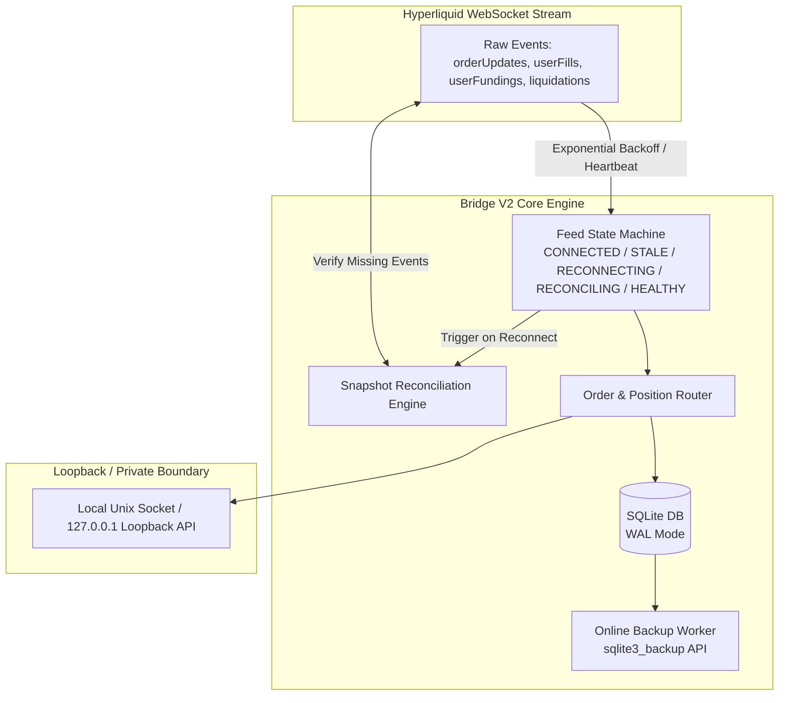
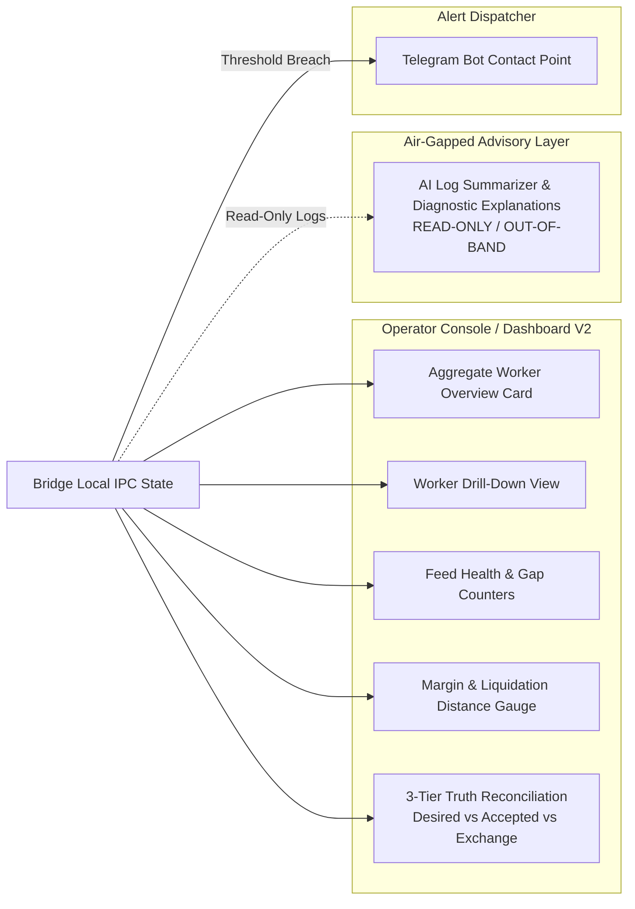

# Bridge V2 & Dashboard V2 External Research & Architecture Recommendations

**Draft Date:** 2026-08-17  
**Author:** Gemini Bounded Implementer  
**Target Transfer:** Bridge V2 / Dashboard V2 Decision Records (to be reviewed, verified, and transferred by owning Codex thread / human owner)  
**Status:** Architecture & Research Proposal Only — does NOT claim acceptance, implementation, deployment, or trading authorization.

---

## 1. Executive Summary & Context

This document compiles evidence-based architecture recommendations for the future **Bridge V2** and **Dashboard V2** subsystems. It draws strictly from current official documentation (Hyperliquid API/WebSocket/Margining, SQLite WAL & Online Backup, Prometheus/Grafana, and Freqtrade) and evaluates architectural patterns from mature open-source trading and observability systems.

### Scope & Authority Notice
- **Research & Advice Only:** This document does not modify, replace, or authorize changes to the live V1 Bridge, Pine scripts, TradingView parity, trading parameters, or host deployment configurations.
- **No V1 Interruption:** All proposals apply strictly to future V2 design specifications.
- **Simplicity First:** Simple, robust, low-overhead architectures are preferred over complex, heavyweight frameworks.
- **Acceptance Boundary:** In accordance with `AGENTS.md`, this draft is an implementer proposal. The Lead Orchestrator (Codex) and the human owner retain sole authority to inspect, test, and accept these recommendations.

---

## 2. Reference Evidence & Source Attribution

### 2.1. Verified Official Technical Documentation
The following official facts form the baseline for these recommendations:
1. **Hyperliquid WebSocket Disconnects & Recovery:** Automated clients must handle periodic disconnects and reconnect gracefully; snapshot acknowledgements or queries can recover missed data.  
   *Source:* [Hyperliquid WebSocket Documentation](https://hyperliquid.gitbook.io/hyperliquid-docs/for-developers/api/websocket)
2. **Hyperliquid Rich WebSocket Subscriptions:** The WebSocket API provides native streams for `candle`, `orderUpdates`, `userEvents`, `userFills`, `userFundings`, `activeAssetData`, and `nonUserCancel`/`liquidation` events.  
   *Source:* [Hyperliquid Subscriptions Documentation](https://hyperliquid.gitbook.io/hyperliquid-docs/for-developers/api/websocket/subscriptions)
3. **Hyperliquid Dead-Man Switch (`scheduleCancel`):** The exchange endpoint provides a `scheduleCancel` action that schedules a cancel-all after a minimum 5-second countdown with limited trigger mechanics. Cancel-all operations can cancel resting protective orders.  
   *Source:* [Hyperliquid Exchange Endpoint Documentation](https://hyperliquid.gitbook.io/Hyperliquid-docs/for-developers/api/exchange-endpoint)
4. **Hyperliquid Margining & Liquidation Mechanics:** Liquidations are driven by mark price, maintenance margin requirements, margin modes (Cross vs Isolated), and partial liquidation mechanics.  
   *Sources:* [Hyperliquid Margining](https://hyperliquid.gitbook.io/hyperliquid-docs/trading/margining) & [Hyperliquid Liquidations](https://hyperliquid.gitbook.io/hyperliquid-docs/trading/liquidations)
5. **SQLite Online Backup API & WAL Mode:** SQLite's Online Backup API (`sqlite3_backup_*` / `VACUUM INTO`) creates consistent, uncorrupted snapshots while live writes continue. In WAL mode, readers and writers coexist, checkpointing is necessary to prevent unbounded WAL growth, and raw file-copying of only the main `.db` file during active writes produces corrupt backups.  
   *Sources:* [SQLite Online Backup API](https://sqlite.org/backup.html) & [SQLite WAL Mode](https://sqlite.org/wal.html)
6. **Prometheus & Grafana Alerting Patterns:** Exporters provide standardized pull/push metric interfaces; Grafana supports versioned contact points and direct Telegram notifications.  
   *Sources:* [Prometheus Exporter Guidelines](https://prometheus.io/docs/instrumenting/exporters/) & [Grafana Alerting Contact Points](https://grafana.com/docs/grafana/latest/alerting/fundamentals/notifications/contact-points/)
7. **Freqtrade Private Access & UI Isolation:** Best practices strictly discourage exposing trading bot APIs directly to the public internet, recommending localhost binding with SSH tunneling or VPN, and decoupling monitoring UI/API from bot execution.  
   *Sources:* [Freqtrade REST API](https://www.freqtrade.io/en/stable/rest-api/) & [FreqUI Repository](https://github.com/freqtrade/frequi)

### 2.2. Open-Source Idea Sources (Reference Only — Not Technical Authority)
The following third-party projects are reviewed as conceptual inspirations. Their maturity, dependencies, and code must be independently verified before adopting any design pattern:
- **`freqtrade/freqtrade` & `freqtrade/frequi`:** Patterns for local loopback API servers, separate web UI processes, and role separation.
- **`mirror29/inalpha`:** Patterns for operator consoles, per-runner state cards, risk lockouts, and strictly isolating AI components outside the direct order execution path.
- **`tesserspace/tesser`:** Patterns for explicit WebSocket connection state machines, heartbeats, snapshot reconciliation routines, structured logs, and local data-gap telemetry.
- **`yutiansut/opentrade`:** Large-scale reference for multi-account pre-trade risk checks and order aggregation (noted for high complexity).
- **`visualHFT/VisualHFT`:** Plugin-based read-only market data and execution event visualization.

---

## 3. Backend & Bridge V2 Recommendations

---

### Recommendation B1: Explicit Feed State Machine & Resubscription Reconciliation

- **Problem Observed:** Network blips, exchange-side maintenance, or silent WebSocket disconnects can cause dropped fill notifications, unacknowledged order transitions, or ghost positions without crashing the process.
- **Proposed Solution:** Implement an explicit 5-state finite-state machine (FSM) for all exchange WebSocket connections:
  $$\text{CONNECTED} \longrightarrow \text{STALE} \longrightarrow \text{RECONNECTING} \longrightarrow \text{RECONCILING} \longrightarrow \text{HEALTHY}$$
  - Enforce exponential backoff with jitter on reconnect.
  - Upon reconnection, immediately resubscribe and trigger an active REST snapshot query (`userEvents`, `orderUpdates`, open orders, positions) to reconcile and heal any missed state gaps before marking the feed `HEALTHY`.
- **Why Useful:** Eliminates silent state desynchronization between the local Bridge database and exchange truth.
- **Risk / Safety Concern:** Reconciliation logic must be idempotent and non-blocking so it never overwrites in-flight orders or delays critical stop updates.
- **Implementation Boundary:** Bounded to the Bridge network/feed transport layer.
- **Suggested Audit Tier:** **T1** (Core Bridge feed transport & reconciliation logic; escalates to **T0** if reconciliation touches active order-cancellation routines).
- **Source URL:** https://hyperliquid.gitbook.io/hyperliquid-docs/for-developers/api/websocket *(Idea source: https://github.com/tesserspace/tesser)*
- **Disposition:** **ADOPT NOW AS DESIGN**

---

### Recommendation B2: Hyperliquid Rich WebSocket Subscription Stream Ingestion

- **Problem Observed:** Relying solely on REST polling for fills, funding rates, or liquidations introduces latency and risks hitting API rate limits during high market volatility.
- **Proposed Solution:** Ingest native Hyperliquid WebSocket subscription streams:
  - `orderUpdates`: Immediate tracking of resting, filled, rejected, or canceled orders.
  - `userFills`: Execution prices, slippage tracking, and fee recording.
  - `userFundings`: Real-time tracking of funding rate cash flows.
  - `activeAssetData`: Live mark price, oracle price, and open interest.
  - `nonUserCancel` / `liquidation`: Immediate detection of exchange-triggered liquidations or margin cancellations.
- **Why Useful:** Sub-second event awareness enables instant telemetry updates and eliminates polling overhead.
- **Risk / Safety Concern:** High event throughput during market crashes could back up an unbuffered message queue. Ingestion must use non-blocking asynchronous event queues.
- **Implementation Boundary:** Read-only exchange adapter and event dispatcher inside Bridge.
- **Suggested Audit Tier:** **T1**
- **Source URL:** https://hyperliquid.gitbook.io/hyperliquid-docs/for-developers/api/websocket/subscriptions
- **Disposition:** **ADOPT NOW AS DESIGN**

---

### Recommendation B3: Safe SQLite Online Backup API & WAL Lifecycle Management

- **Problem Observed:** Simple file-copying (`cp` or script backup) of an active SQLite database in WAL mode produces corrupt backups because transactions reside across `.db`, `.db-wal`, and `.db-shm` files. Furthermore, uncheckpointed WAL files can grow unbounded and degrade read query performance.
- **Proposed Solution:**
  1. Use the official SQLite Online Backup API (`sqlite3_backup_*` or `VACUUM INTO '<destination>'`) to create atomic, consistent database snapshots while live writes proceed uninterrupted.
  2. Implement periodic, non-blocking passive checkpoints (`PRAGMA wal_checkpoint(PASSIVE)`).
  3. Include an automated offline verification step that opens the snapshot in a separate read-only process and executes `PRAGMA integrity_check`.
- **Why Useful:** Provides reliable, zero-downtime backups and disaster recovery without locking the trading engine.
- **Risk / Safety Concern:** Aggressive checkpointing (`TRUNCATE` / `RESTART`) could cause lock contention on write operations. Checkpoints must remain strictly passive during active trading hours.
- **Implementation Boundary:** Database management and scheduled maintenance utilities.
- **Suggested Audit Tier:** **T1**
- **Source URL:** https://sqlite.org/backup.html and https://sqlite.org/wal.html
- **Disposition:** **ADOPT NOW AS DESIGN**

---

### Recommendation B4: Evaluation of Exchange Dead-Man Switch (`scheduleCancel`)

- **Problem Observed:** If the Bridge server crashes or suffers total network loss, open resting limit orders or positions might be left unattended on the exchange.
- **Proposed Solution:** Hyperliquid's exchange endpoint supports `scheduleCancel` (minimum 5-second countdown). The bot must periodically ping the endpoint to push back the cancellation timer; if the bot goes silent, the exchange automatically cancels open orders.
- **Why Useful:** Protects against catastrophic server failure by cleaning up stale limit orders.
- **Risk / Safety Concern:** **CRITICAL SAFETY HAZARD.** Hyperliquid's `scheduleCancel` performs a blanket *cancel-all*. If resting protective stop-loss orders are placed on the exchange, `scheduleCancel` would cancel those protective stops, leaving existing positions completely naked during a transient network blip. Furthermore, the 5-second minimum timer and strict rate limits make this mechanism fragile.
- **Implementation Boundary:** Broker / Exchange execution layer (**T0** surface).
- **Suggested Audit Tier:** **T0**
- **Source URL:** https://hyperliquid.gitbook.io/Hyperliquid-docs/for-developers/api/exchange-endpoint
- **Disposition:** **REJECT OR DEFER** *(Defer indefinitely. Do NOT adopt unless separate protected analysis proves that native protective stop-loss orders survive or cancel scope can be strictly isolated).*

---

### Recommendation B5: Loopback-Only Private API & Process Separation

- **Problem Observed:** Exposing trading APIs or dashboard ports to the public internet creates severe security vulnerabilities, including unauthorized command injection, credential theft, and denial-of-service risks.
- **Proposed Solution:**
  - Follow Freqtrade's proven security model: bind all Bridge APIs and metrics endpoints strictly to `127.0.0.1` (loopback) or local Unix domain sockets.
  - Restrict remote access exclusively to encrypted SSH tunnels with key-based authentication or private WireGuard VPNs.
  - Decouple the execution process from the dashboard/monitoring process using independent systemd services with OS-level resource limits (cgroups).
- **Why Useful:** Completely eliminates public internet attack vectors and ensures a dashboard crash never affects trade execution.
- **Risk / Safety Concern:** Misconfiguration binding to `0.0.0.0` or improper firewall rules.
- **Implementation Boundary:** Host configuration, systemd service definitions, and API server binding.
- **Suggested Audit Tier:** **T0** for host firewall and deployment scripts; **T1** for API server network binding.
- **Source URL:** https://www.freqtrade.io/en/stable/rest-api/ *(Idea source: https://github.com/freqtrade/freqtrade)*
- **Disposition:** **ADOPT NOW AS DESIGN**

---

## 4. Dashboard & Observability V2 Recommendations

---

### Recommendation D1: Three-Tier Truth Reconciliation Visualization

- **Problem Observed:** In automated trading systems, drift can silently develop between what the strategy intended, what the bridge accepted, and what the exchange executed. Showing only a single "position" number masks critical execution gaps.
- **Proposed Solution:** Build a dedicated Three-Tier Truth component in the worker drill-down view:
  1. **Desired State:** The signal emitted by the TradingView/Pine alert webhook.
  2. **Accepted State:** The order intent recorded, validated, and staged in the local Bridge database.
  3. **Exchange Truth:** The actual filled size, open position, and active resting orders reported by Hyperliquid's WebSocket feed.
  - Display color-coded status indicators (e.g., Green = Synced, Amber = In-Flight / Pending, Red = State Mismatch / Drift).
- **Why Useful:** Gives the operator instant visual clarity on execution fidelity, slippage, and pending order lifecycles.
- **Risk / Safety Concern:** Purely a read-only presentation component. Must not include manual "one-click re-balance" actions that bypass pre-trade risk controls.
- **Implementation Boundary:** Dashboard frontend and read-only schema endpoint.
- **Suggested Audit Tier:** **T2** (Schema / UI contract documentation) & **T3** (UI mock fixtures and styling).
- **Source URL:** Idea source: https://github.com/tesserspace/tesser and https://github.com/visualHFT/VisualHFT
- **Disposition:** **ADOPT NOW AS DESIGN**

---

### Recommendation D2: Real-Time Feed Health, Latency & Data-Gap Counters

- **Problem Observed:** A dashboard showing stale prices without clear warning can lead operators to assume normal operations during severe network outages.
- **Proposed Solution:** Provide explicit visual telemetry for data transport health:
  - Prominent badge displaying the active feed state: `CONNECTED`, `STALE`, `RECONNECTING`, `RECONCILING`, or `HEALTHY`.
  - **Last Event Age:** Millisecond/second counter showing the time elapsed since the most recent valid WebSocket packet.
  - **Data Gap & Drop Counters:** Cumulative metrics tracking dropped packets, reconnect attempts, and sequence anomalies.
- **Why Useful:** Immediate visual diagnosis of network degradation or WebSocket feed stalls.
- **Risk / Safety Concern:** High telemetry refresh rates could increase frontend CPU usage if unthrottled. Telemetry polling/push should be batched (e.g., 500ms–1000ms intervals).
- **Implementation Boundary:** Dashboard telemetry bar and Bridge health status API.
- **Suggested Audit Tier:** **T2**
- **Source URL:** https://hyperliquid.gitbook.io/hyperliquid-docs/for-developers/api/websocket *(Idea source: https://github.com/tesserspace/tesser)*
- **Disposition:** **ADOPT NOW AS DESIGN**

---

### Recommendation D3: Margin Health, Leverage Mode & Liquidation-Distance Gauges

- **Problem Observed:** In perpetual contract trading, sudden market volatility can rapidly push leveraged positions toward maintenance margin limits and liquidation.
- **Proposed Solution:** Integrate official Hyperliquid margining telemetry into the dashboard:
  - Account and subaccount identifiers.
  - Margin Mode label (`Cross` vs `Isolated`).
  - Total account margin, maintenance margin requirement, and current margin utilization ratio.
  - Real-time **Liquidation Distance (%)** gauge calculated from current mark price vs calculated liquidation price:
    $$\text{Liquidation Distance \%} = \frac{|\text{Mark Price} - \text{Liquidation Price}|}{\text{Mark Price}} \times 100$$
- **Why Useful:** Empowers the operator to observe margin stress and evaluate portfolio safety before partial liquidations occur.
- **Risk / Safety Concern:** Mathematical miscalculations could give false confidence. Formulas must strictly follow Hyperliquid's official margining documentation.
- **Implementation Boundary:** Dashboard risk card and read-only account data transformer.
- **Suggested Audit Tier:** **T2**
- **Source URL:** https://hyperliquid.gitbook.io/hyperliquid-docs/trading/liquidations and https://hyperliquid.gitbook.io/hyperliquid-docs/trading/margining
- **Disposition:** **ADOPT NOW AS DESIGN**

---

### Recommendation D4: Aggregate Multi-Runner Overview with Granular Worker Drill-Down

- **Problem Observed:** In multi-strategy or multi-symbol deployments, a flat list of logs or executions makes it difficult to quickly identify which specific runner is experiencing errors.
- **Proposed Solution:** Implement a two-level operator console inspired by FreqUI and inAlpha:
  1. **Aggregate Overview:** High-level summary cards showing system status, total open exposure, aggregate PnL, active worker count, and error flags.
  2. **Worker Drill-Down:** Dedicated tab per runner displaying its specific strategy parameters, state machine stage, execution history, order ledger, and filtered log stream.
- **Why Useful:** Rapid triage of system-wide operations combined with deep diagnostic capability on demand.
- **Risk / Safety Concern:** UI complexity and excessive DOM rendering if hundreds of workers are loaded simultaneously. Must use paginated or virtualized lists.
- **Implementation Boundary:** Dashboard navigation and layout structure.
- **Suggested Audit Tier:** **T2** / **T3**
- **Source URL:** Idea source: https://github.com/mirror29/inalpha and https://github.com/freqtrade/frequi
- **Disposition:** **ADOPT NOW AS DESIGN**

---

### Recommendation D5: Lean Built-in Metrics & Telegram Alerting vs Full Prometheus/Grafana Stack

- **Problem Observed:** Installing a full Prometheus + Grafana + Exporter stack on a single VPS consumes substantial system memory (300MB–500MB+ RAM), adds complex configuration overhead, and requires multi-port management.
- **Proposed Solution:**
  - Build a lightweight internal metrics collector into Bridge V2 that tracks:
    - Service heartbeat and process uptime
    - Feed state and last event age
    - Naked / unhedged position duration
    - SQLite WAL size and checkpoint age
    - Host CPU, RAM, and disk utilization
  - Dispatch critical threshold alerts directly to a configured **Telegram channel** using standard HTTPS webhooks (matching Grafana contact-point alert ergonomics without the server overhead).
  - Store dashboard schemas and alert threshold definitions as version-controlled JSON/YAML configuration files.
  - Re-evaluate a full Prometheus/Grafana stack only if multi-host federation or high-cardinality time-series analytics are required in the future.
- **Why Useful:** Delivers 95% of operational alerting and telemetry benefits with <20MB RAM footprint and zero external server dependencies.
- **Risk / Safety Concern:** Telegram rate limiting or webhook delivery drops during network outages. Alert dispatcher must implement local deduplication and alert storm throttling.
- **Implementation Boundary:** Telemetry worker, alert rule evaluator, and notification dispatcher.
- **Suggested Audit Tier:** **T1**
- **Source URL:** https://prometheus.io/docs/instrumenting/exporters/ and https://grafana.com/docs/grafana/latest/alerting/fundamentals/notifications/contact-points/ *(Idea source: https://github.com/freqtrade/freqtrade)*
- **Disposition:** **EVALUATE** *(Adopt lean built-in metrics + Telegram alerts for V2; keep heavyweight Prometheus/Grafana stack deferred).*

---

### Recommendation D6: Strict Air-Gapped Separation of AI Insights from Economic Execution

- **Problem Observed:** Introducing LLM reasoning or AI agents into trading dashboards introduces non-deterministic failure modes, prompt injection risks, and latency if AI is placed on the order execution path.
- **Proposed Solution:** Follow inAlpha's architectural rule: enforce a strict, one-way boundary.
  - AI tools (log explanation, post-trade analysis, anomaly summarization) must operate strictly **out-of-band** as read-only diagnostic assistants.
  - AI components have **zero access** to trading credentials, cannot generate or modify orders, cannot override risk limits, and cannot block synchronous execution loops.
- **Why Useful:** Enables intelligent diagnostic assistance and automated morning reports without risking rogue trades or unvetted actions.
- **Risk / Safety Concern:** Human operator over-reliance on AI summaries. Dashboard must clearly label AI output as "Advisory Only — Verify with Raw Logs".
- **Implementation Boundary:** AI integration architecture and permission boundaries.
- **Suggested Audit Tier:** **T0** (for architectural credential isolation and execution lockout); **T2** (for documentation and UI presentation).
- **Source URL:** Idea source: https://github.com/mirror29/inalpha
- **Disposition:** **ADOPT NOW AS DESIGN**

---

## 5. Prioritized Implementation Roadmap

| Priority Stage | Scope / Components | Description & Rationale | Suggested Audit Tier |
| :--- | :--- | :--- | :--- |
| **NOW** *(Design & Fixtures)* | **Feed FSM Specification** | Formalize 5-state feed FSM (`CONNECTED`, `STALE`, `RECONNECTING`, `RECONCILING`, `HEALTHY`) with exponential backoff fixtures. | **T1** |
| | **Three-Tier Truth Schema** | Define JSON schemas and UI mockup contracts for Desired vs Accepted vs Exchange state reconciliation. | **T2** / **T3** |
| | **Safe SQLite Backup Script** | Draft and unit-test non-blocking `sqlite3_backup_*` / `VACUUM INTO` backup and integrity verification utilities. | **T1** |
| | **Margin & Telemetry Contract** | Document formulas for Liquidation Distance and data-freshness metrics using official Hyperliquid specs. | **T2** |
| | **Loopback Security Policy** | Define localhost-only binding and systemd process separation templates for VPS deployment. | **T0** / **T1** |
| | **Air-Gapped AI Boundary** | Document strict one-way read-only architecture for AI diagnostic tools. | **T0** / **T2** |
| **AFTER V1 SOAK** *(Protected Integration)* | **Hyperliquid WS Streams** | Implement live ingestion of `orderUpdates`, `userFills`, `userFundings`, and liquidation event streams. | **T1** |
| | **Live State Reconciliation** | Connect the FSM reconciliation engine to query active exchange snapshots post-reconnection. | **T1** |
| | **Telegram Alert Dispatcher** | Implement lightweight alert evaluator pushing heartbeat, stale feed, and WAL alerts to Telegram. | **T1** |
| | **Dashboard V2 Frontend** | Build the lightweight, responsive operator UI implementing the aggregate overview and worker drill-downs. | **T2** / **T3** |
| **EXPLICITLY DEFERRED** *(Do Not Build)* | **Exchange Dead-Man Switch** | `scheduleCancel` deferred indefinitely until protective stop survival and isolated cancellation scopes are proven. | **T0** (Deferred) |
| | **Prometheus/Grafana Stack** | Deferred to prevent VPS resource bloat unless multi-server orchestration is required. | **T1** (Deferred) |
| | **Complex Order Aggregators** | Heavyweight multi-broker adapters (OpenTrade style) deferred as unnecessary over-engineering. | — |

---

## 6. Source Quality Evaluation & Open Verification Questions

### 6.1. Source Quality & Authority Assessment
- **Official Documentation (Hyperliquid, SQLite, Prometheus, Grafana, Freqtrade):** High authority. Technical facts regarding WebSocket disconnects, event payloads, WAL behavior, and loopback security are definitive and verified.
- **Open-Source Idea Projects (Freqtrade, inAlpha, Tesser, OpenTrade, VisualHFT):** Medium-to-Low authority. These repositories provide valuable conceptual design patterns (such as three-tier reconciliation and AI air-gapping), but their implementations must be treated as illustrative ideas rather than production-ready code for MTC.

### 6.2. Open Verification Questions for Future V2 Design
1. **Hyperliquid Stop-Loss Cancellation Scope:** Does Hyperliquid's `scheduleCancel` endpoint cancel all order types indiscriminately (including resting trigger stop-loss orders), or can it be scoped strictly to resting limit orders? *(If indiscriminate, it remains permanently disqualified).*
2. **Snapshot Reconciliation Query Limits:** What are the exact rate-limit weights for REST snapshot queries (`userEvents` / `openOrders`) executed immediately following a WebSocket reconnect during high-load market periods?
3. **SQLite WAL Passive Checkpoint Latency:** What is the maximum measured disk I/O latency when running `PRAGMA wal_checkpoint(PASSIVE)` under a simulated load of 50 order insertions per second?
4. **WebSocket Event Buffering under VPS Load:** In a constrained VPS environment (e.g., 2 vCPU, 4GB RAM), what is the optimal queue depth and drop policy for incoming `activeAssetData` tick events during extreme market volatility?

---

## 7. Governance, Safety Boundary & Transfer Checklist

> ### Critical Boundary Disclaimer
> This document is strictly an informational architecture and research proposal.
> 
> **NO AUTHORIZATION IS GRANTED OR IMPLIED FOR:**
> - Modifying any live V1 Bridge code, Pine script, or TradingView webhook configuration.
> - Altering trading parameters, risk limits, broker integrations, or order routing logic.
> - Deploying new services, running staging scripts, or executing unsanctioned systemd commands.
> - Changing host firewall configurations, generating production credentials, or modifying live state databases.

### Codex / Lead Orchestrator Transfer Checklist
The Lead Orchestrator (Codex) and the human owner should verify the following criteria before incorporating these recommendations into canonical V2 roadmaps:

- [ ] **Strict Non-Interference:** Confirmed that all recommendations are strictly scoped to future V2 architecture and propose zero changes to the active V1 codebase.
- [ ] **Factual Accuracy:** Verified that all Hyperliquid, SQLite, and Freqtrade references align with official documentation.
- [ ] **Dangerous Features Blocked:** Confirmed that the `scheduleCancel` dead-man switch is explicitly flagged as a safety hazard and deferred.
- [ ] **Security & Loopback Preserved:** Verified that private-only loopback architecture (`127.0.0.1` / SSH tunnel / VPN) is mandated.
- [ ] **Lightweight Observability Prioritized:** Confirmed that lightweight built-in metrics and Telegram alerting are prioritized over heavyweight server stacks.
- [ ] **AI Air-Gap Enforced:** Verified that AI reasoning and diagnostic components are strictly isolated from economic order execution.
- [ ] **Audit Tier Consistency:** Ensured that suggested audit tiers (**T0**, **T1**, **T2**, **T3**) conform to `AGENTS.md`.

---
