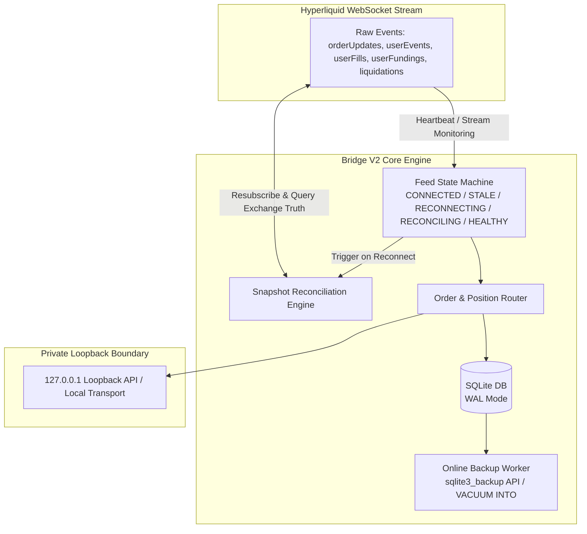
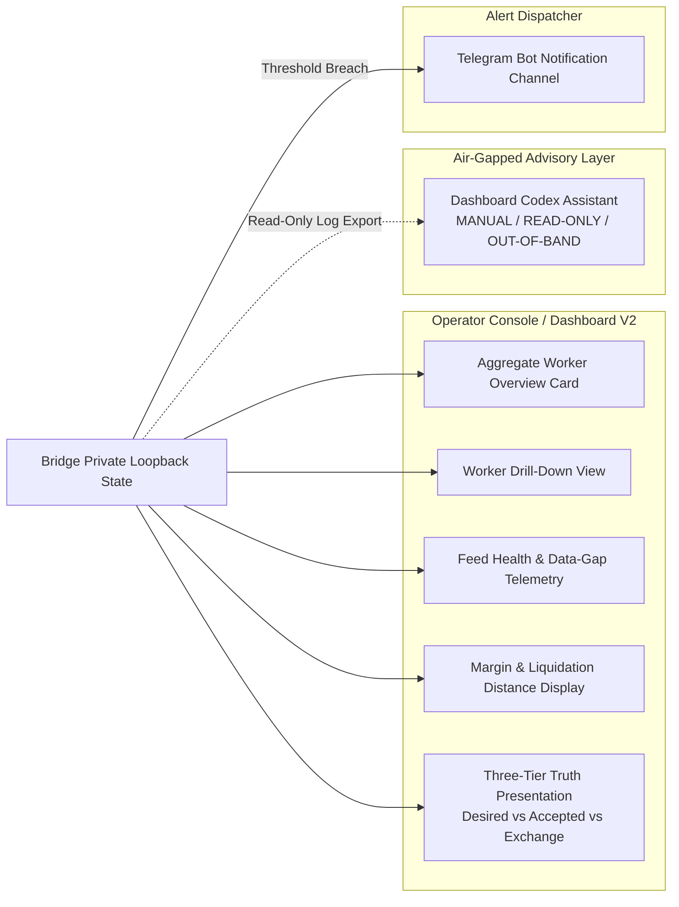

# Bridge V2 & Dashboard V2 External Research & Architecture Recommendations

**Draft Date:** 2026-08-17  
**Author:** Gemini Bounded Implementer  
**Target Transfer:** Bridge V2 / Dashboard V2 Decision Records (to be reviewed, verified, and transferred by owning Codex thread / human owner)  
**Status:** LEAD-CORRECTED RESEARCH CANDIDATE — does NOT claim acceptance, implementation, deployment, or trading authorization.

---

## 1. Executive Summary & Context

This document compiles evidence-based architecture recommendations for the future **Bridge V2** and **Dashboard V2** subsystems. It draws strictly from official documentation for primary technical authority (Hyperliquid API/WebSocket/Margining and SQLite WAL & Online Backup), official reference documentation (Prometheus/Grafana exporter and contact point specifications), and architectural patterns from mature open-source trading and observability systems (such as Freqtrade, evaluated strictly as a third-party reference).

### Scope & Governance Notice
- **Research & Candidate Advice Only:** This document does not modify, replace, or authorize changes to the live V1 Bridge, Pine scripts, TradingView parity, trading parameters, or host deployment configurations.
- **No V1 Interruption:** All proposals apply strictly to future V2 design evaluations.
- **Simplicity First:** Simple, robust, low-overhead architectures are preferred over complex, heavyweight frameworks.
- **Acceptance Boundary:** In accordance with `AGENTS.md`, this draft is an implementer candidate. The Lead Orchestrator (Codex) and the human owner retain sole authority to inspect, test, and accept these recommendations.
- **Audit Tier Alignment:** In this repository, any Bridge network feed, broker/exchange event ingestion, reconciliation, persistence/backup implementation, host/systemd/network binding, risk/margin transformer that may affect live interpretation, or alerting that can influence operations defaults to protected **T0**. Documentation-only contracts are **T2**. Read-only fixture/mock dashboard product code is **T1**. **T3** is reserved strictly for checkpoints, indexes, prompts, and process artifacts (not UI code).

---

## 2. Reference Evidence & Source Attribution

### 2.1. Verified Primary & Reference Technical Documentation
The following technical sources establish the baseline for these recommendations:
1. **Hyperliquid WebSocket Disconnects & Recovery (Official Exchange Authority):** Automated clients must handle periodic disconnects and reconnect gracefully; recovery entails resubscribing, processing snapshot acknowledgements where supplied, and querying documented exchange truth endpoints as applicable.  
   *Source:* [Hyperliquid WebSocket Documentation](https://hyperliquid.gitbook.io/hyperliquid-docs/for-developers/api/websocket)
2. **Hyperliquid Rich WebSocket Subscriptions (Official Exchange Authority):** The WebSocket API provides native streams for `candle`, `orderUpdates`, `userEvents`, `userFills`, `userFundings`, `activeAssetData`, and `nonUserCancel`/`liquidation` events. Note that `userEvents` is a WebSocket subscription stream.  
   *Source:* [Hyperliquid Subscriptions Documentation](https://hyperliquid.gitbook.io/hyperliquid-docs/for-developers/api/websocket/subscriptions)
3. **Hyperliquid Dead-Man Switch (`scheduleCancel`) (Official Exchange Authority):** The exchange endpoint provides a `scheduleCancel` action that schedules a cancel-all after a minimum 5-second countdown with documented trigger mechanics. Whether this cancel-all action cancels resting protective trigger orders (such as stop-losses) is an unresolved safety hypothesis that requires explicit verification before any adoption consideration.  
   *Source:* [Hyperliquid Exchange Endpoint Documentation](https://hyperliquid.gitbook.io/Hyperliquid-docs/for-developers/api/exchange-endpoint)
4. **Hyperliquid Margining & Liquidation Mechanics (Official Exchange Authority):** Liquidations are driven by mark price, maintenance margin requirements, margin modes (Cross vs Isolated), and partial liquidation mechanics. Exchange-reported liquidation price and margin state represent definitive primary truth.  
   *Sources:* [Hyperliquid Margining](https://hyperliquid.gitbook.io/hyperliquid-docs/trading/margining) & [Hyperliquid Liquidations](https://hyperliquid.gitbook.io/hyperliquid-docs/trading/liquidations)
5. **SQLite Online Backup API & WAL Mode (Official Database Authority):** SQLite's Online Backup API (`sqlite3_backup_*`) is the primary candidate to create consistent snapshots while live writes proceed. `VACUUM INTO '<destination>'` is an official SQLite-supported snapshot alternative. In WAL mode, copying only the main `.db` file while WAL activity exists can yield an incomplete, inconsistent, or unusable backup because committed transactions may reside in the WAL file. Checkpointing is necessary to prevent unbounded WAL growth.  
   *Sources:* [SQLite Online Backup API](https://sqlite.org/backup.html) & [SQLite WAL Mode](https://sqlite.org/wal.html)
6. **Prometheus & Grafana Reference Documentation:** Exporters provide standardized metric exposition interfaces; Grafana supports versioned contact points and direct notification channels.  
   *Sources:* [Prometheus Exporter Guidelines](https://prometheus.io/docs/instrumenting/exporters/) & [Grafana Alerting Contact Points](https://grafana.com/docs/grafana/latest/alerting/fundamentals/notifications/contact-points/)
7. **Freqtrade Third-Party Reference Patterns:** Freqtrade documentation describes patterns for private localhost API binding, optional remote access via SSH tunneling or VPN, and decoupling monitoring UI from bot execution. (Note: Freqtrade documentation is authoritative solely for Freqtrade itself, serving here strictly as a third-party reference).  
   *Sources:* [Freqtrade REST API](https://www.freqtrade.io/en/stable/rest-api/) & [FreqUI Repository](https://github.com/freqtrade/frequi)

### 2.2. Open-Source Idea Sources (Reference Only — Not Technical Authority)
The following third-party projects are reviewed as conceptual inspirations. Their patterns, maturity, and dependencies must be independently evaluated:
- **`freqtrade/freqtrade` & `freqtrade/frequi`:** Reference patterns for local loopback API servers, UI separation options, and operational role boundaries.
- **`mirror29/inalpha`:** Patterns for operator consoles, per-runner state cards, risk lockouts, and strictly isolating AI components outside the direct order execution path.
- **`tesserspace/tesser`:** Patterns for explicit WebSocket connection state machines, heartbeats, snapshot reconciliation routines, structured logs, and local data-gap telemetry.
- **`yutiansut/opentrade`:** Reference for multi-account risk management patterns (noted for high complexity; deferred).
- **`visualHFT/VisualHFT`:** Plugin-based read-only market data and execution event visualization patterns.

---

## 3. Backend & Bridge V2 Recommendations

---

### Recommendation B1: Explicit Feed State Machine & Resubscription Reconciliation

- **Problem Observed:** Network blips, exchange-side maintenance, or silent WebSocket disconnects can cause dropped fill notifications, unacknowledged order transitions, or ghost positions without crashing the process.
- **Proposed Solution:** Implement an explicit 5-state finite-state machine (FSM) for exchange WebSocket connections:
  $$\text{CONNECTED} \longrightarrow \text{STALE} \longrightarrow \text{RECONNECTING} \longrightarrow \text{RECONCILING} \longrightarrow \text{HEALTHY}$$
  - Enforce exponential backoff with jitter on reconnect.
  - Reconnect recovery flow: immediately resubscribe to required WebSocket streams, process snapshot acknowledgements where supplied by the exchange, and query documented exchange truth endpoints as applicable to reconcile local state gaps before marking the feed `HEALTHY`. The exact endpoint selection and rate-limit budget remain an open verification plan.
- **Why Useful:** Event-driven updates reduce reliance on polling, while reconciliation ensures local state remains aligned with exchange truth.
- **Risk / Safety Concern:** Reconciliation logic must be idempotent and non-blocking so it never overwrites in-flight orders or delays critical operations.
- **Implementation Boundary:** Bridge network feed transport and reconciliation subsystem.
- **Suggested Audit Tier:** **T0** for feed, network ingestion, and reconciliation implementation (protected surface); **T2** for documentation-only contracts.
- **Source URL:** https://hyperliquid.gitbook.io/hyperliquid-docs/for-developers/api/websocket *(Idea source: https://github.com/tesserspace/tesser)*
- **Disposition:** **ADOPT NOW AS DESIGN**

---

### Recommendation B2: Hyperliquid Rich WebSocket Subscription Stream Ingestion

- **Problem Observed:** Relying solely on periodic REST polling introduces unnecessary transport overhead and risks rate-limit throttling during periods of high market activity.
- **Proposed Solution:** Ingest native Hyperliquid WebSocket subscription streams:
  - `orderUpdates`: Tracking of resting, filled, rejected, or canceled orders.
  - `userEvents`: User account updates, fill notifications, and balance events via WebSocket subscription.
  - `userFills`: Execution prices, fee recording, and fill details.
  - `userFundings`: Real-time tracking of funding rate cash flows.
  - `activeAssetData`: Live mark price, oracle price, and open interest.
  - `nonUserCancel` / `liquidation`: Immediate detection of exchange-triggered liquidations or margin cancellations.
- **Why Useful:** Event-driven stream updates reduce reliance on polling while maintaining responsive event awareness. Periodic authoritative queries remain available for baseline synchronization.
- **Risk / Safety Concern:** High event throughput during market volatility requires non-blocking asynchronous event handling. Buffer sizing and overflow handling must be evaluated against actual load.
- **Implementation Boundary:** Exchange feed adapter and event dispatcher inside Bridge.
- **Suggested Audit Tier:** **T0** for broker/exchange event ingestion implementation; **T2** for documentation contracts.
- **Source URL:** https://hyperliquid.gitbook.io/hyperliquid-docs/for-developers/api/websocket/subscriptions
- **Disposition:** **ADOPT NOW AS DESIGN**

---

### Recommendation B3: Safe SQLite Online Backup API & WAL Lifecycle Management

- **Problem Observed:** Copying only the main `.db` database file while WAL activity exists can yield an incomplete, inconsistent, or unusable backup because committed transactions may reside in the `.db-wal` file. In addition, unmanaged WAL growth can consume disk space and degrade read performance.
- **Proposed Solution:**
  1. Use the official SQLite Online Backup API (`sqlite3_backup_*`) as the primary candidate to create consistent, atomic database snapshots while live writes continue.
  2. Evaluate `VACUUM INTO '<destination>'` as a separate SQLite-supported snapshot alternative.
  3. Define non-blocking passive checkpointing (`PRAGMA wal_checkpoint(PASSIVE)`) as an evaluated policy, measuring checkpoint duration under actual load before fixing operational cadence.
  4. Include an offline verification step that opens the snapshot in a read-only process and executes `PRAGMA integrity_check`.
- **Why Useful:** Provides reliable, zero-downtime backups and disaster recovery without risking inconsistent data or blocking write operations.
- **Risk / Safety Concern:** Backup implementation directly touches live persistence and recovery. Aggressive checkpointing modes (`TRUNCATE` / `RESTART`) could cause write locks and must not be used during active operations.
- **Implementation Boundary:** Persistence, backup, and database maintenance subsystem.
- **Suggested Audit Tier:** **T0** for backup and persistence implementation (touches live persistence and recovery); **T2** for documentation contracts.
- **Source URL:** https://sqlite.org/backup.html and https://sqlite.org/wal.html
- **Disposition:** **ADOPT NOW AS DESIGN**

---

### Recommendation B4: Evaluation of Exchange Dead-Man Switch (`scheduleCancel`)

- **Problem Observed:** If the Bridge host crashes or experiences catastrophic network disconnection, open resting limit orders could remain unattended on the exchange.
- **Proposed Solution (Evaluation):** Hyperliquid's exchange endpoint supports `scheduleCancel` with a minimum 5-second countdown and documented trigger mechanics.
- **Risk / Safety Concern:** **UNRESOLVED SAFETY HYPOTHESIS.** Official documentation establishes `scheduleCancel` semantics and trigger limits, but whether it cancels protective stop-loss triggers along with resting limit orders remains an unresolved safety hypothesis that must be rigorously verified. If it indiscriminately cancels resting protective stops, it would leave open positions unprotected during transient network disconnects.
- **Implementation Boundary:** Broker / Exchange execution layer.
- **Suggested Audit Tier:** **T0** (Deferred)
- **Source URL:** https://hyperliquid.gitbook.io/Hyperliquid-docs/for-developers/api/exchange-endpoint
- **Disposition:** **DEFER** (Maintain disposition as DEFER. Do not adopt unless explicit testing proves whether protective stop orders survive or whether cancellation scopes can be safely isolated).

---

### Recommendation B5: Loopback-Only Private Access & Process Architecture Evaluation

- **Problem Observed:** Exposing trading APIs or dashboard ports to the public internet creates severe security vulnerabilities, including unauthorized access and denial-of-service risks.
- **Proposed Solution:**
  - Enforce private localhost binding (`127.0.0.1`) for all Bridge APIs and telemetry endpoints. Remote access must occur strictly over secure private channels (such as SSH tunneling or private VPN).
  - Process Architecture Option: Note that current V1 serves dashboard assets directly within the same FastAPI process on the same VPS. For V2, whether to maintain this same-process model or split the dashboard into a separate constrained loopback service is an open architectural choice to be decided after measuring VPS resource headroom and operational complexity.
  - Deployment options (e.g., systemd service isolation, IPC mechanisms) should be evaluated based on operational simplicity and measured host overhead.
- **Why Useful:** Prevents public internet exposure and bounds attack surfaces to authenticated private channels.
- **Risk / Safety Concern:** Host-level binding misconfigurations or overly complex multi-service IPC.
- **Implementation Boundary:** Host network binding, systemd configuration, and service architecture.
- **Suggested Audit Tier:** **T0** for host/systemd/network binding implementation; **T2** for documentation contracts.
- **Source URL:** https://www.freqtrade.io/en/stable/rest-api/ *(Third-party reference; idea source: https://github.com/freqtrade/freqtrade)*
- **Disposition:** **ADOPT NOW AS DESIGN** (Private loopback binding adopted; same-process vs separate service remains an open evaluation).

---

## 4. Dashboard & Observability V2 Recommendations

---

### Recommendation D1: Three-Tier Truth Reconciliation Visualization

- **Problem Observed:** In automated trading systems, state divergence can occur between strategy intent, bridge staging, and exchange execution. Presenting a single unverified position value obscures execution discrepancies.
- **Proposed Solution:** Build a read-only Three-Tier Truth presentation component:
  1. **Desired State:** Signal emitted by the strategy / TradingView webhook.
  2. **Accepted State:** Order intent validated, staged, and tracked in the local Bridge database.
  3. **Exchange Truth:** Actual filled position size, execution price, and resting order state reported by Hyperliquid exchange feeds.
  - Display clear status indicators (e.g., Synced, In-Flight, or State Mismatch).
- **Why Useful:** Provides immediate operator visibility into execution fidelity and order lifecycle stages.
- **Risk / Safety Concern:** Purely a read-only display. Must not introduce unvalidated manual execution controls that bypass automated risk checks.
- **Implementation Boundary:** Dashboard UI presentation and read-only schema endpoint.
- **Suggested Audit Tier:** **T1** for read-only dashboard product code and UI fixtures; **T2** for documentation contracts and schemas; **T0** for underlying exchange reconciliation engines.
- **Source URL:** Idea source: https://github.com/tesserspace/tesser and https://github.com/visualHFT/VisualHFT
- **Disposition:** **ADOPT NOW AS DESIGN**

---

### Recommendation D2: Real-Time Feed Health, Latency & Data-Gap Telemetry

- **Problem Observed:** Displaying market or execution data without clear transport health indicators can cause operators to mistake stalled feeds for active markets.
- **Proposed Solution:** Provide explicit visual telemetry for data transport status:
  - Feed status badge: `CONNECTED`, `STALE`, `RECONNECTING`, `RECONCILING`, or `HEALTHY`.
  - **Last Event Age:** Elapsed time indicator showing freshness of the most recent valid WebSocket packet.
  - **Data Gap & Reconnect Telemetry:** Cumulative counters tracking reconnect events, dropped frames, and stream sequence gaps.
  - Refresh rates should be configured based on measured frontend performance rather than fixed assumptions.
- **Why Useful:** Enables rapid visual identification of connection degradation or exchange feed stalls.
- **Risk / Safety Concern:** Presentation layer only. Telemetry updates must be throttled appropriately to prevent unnecessary frontend rendering overhead.
- **Implementation Boundary:** Dashboard telemetry display and read-only health endpoint.
- **Suggested Audit Tier:** **T1** for read-only dashboard product code; **T2** for telemetry documentation contracts; **T0** for underlying feed health transformers.
- **Source URL:** https://hyperliquid.gitbook.io/hyperliquid-docs/for-developers/api/websocket *(Idea source: https://github.com/tesserspace/tesser)*
- **Disposition:** **ADOPT NOW AS DESIGN**

---

### Recommendation D3: Margin Health, Leverage Mode & Liquidation-Distance Presentation

- **Problem Observed:** In leveraged perpetual trading, sudden price movements can stress margin requirements and approach liquidation thresholds.
- **Proposed Solution:** Integrate exchange margining telemetry into the operator view:
  - Account and subaccount identifiers, margin mode (`Cross` vs `Isolated`), total margin, and maintenance margin utilization.
  - **Primary Truth:** Rely directly on exchange-provided liquidation price and margin values.
  - **Presentation Metric:** If the dashboard derives a display percentage from mark price and liquidation price, label it strictly as a presentation calculation (never as the exchange margin formula), and explicitly display freshness or unknown states when exchange data is missing:
    $$\text{Display Liquidation Distance \% (Presentation Only)} = \frac{|\text{Mark Price} - \text{Liquidation Price}|}{\text{Mark Price}} \times 100$$
- **Why Useful:** Allows the operator to monitor margin stress and distance to liquidation with clear distinction between exchange truth and derived display metrics.
- **Risk / Safety Concern:** Presenting derived metrics as official margin calculations could mislead operators. Freshness and unknown states must be prominent.
- **Implementation Boundary:** Dashboard risk card and read-only account data transformer.
- **Suggested Audit Tier:** **T0** for risk/margin transformers that may affect live interpretation; **T1** for read-only UI presentation code; **T2** for documentation contracts.
- **Source URL:** https://hyperliquid.gitbook.io/hyperliquid-docs/trading/liquidations and https://hyperliquid.gitbook.io/hyperliquid-docs/trading/margining
- **Disposition:** **ADOPT NOW AS DESIGN**

---

### Recommendation D4: Aggregate Multi-Runner Overview with Granular Worker Drill-Down

- **Problem Observed:** In multi-strategy configurations, flat log feeds make it difficult to isolate issues affecting specific runners.
- **Proposed Solution:** Implement a structured two-level operator console:
  1. **Aggregate Overview:** Summary cards showing system status, total exposure, aggregate PnL, active runners, and warning flags.
  2. **Worker Drill-Down:** Dedicated tab per runner displaying strategy parameters, state machine stage, execution history, and filtered logs.
- **Why Useful:** Facilitates rapid system-wide triage while maintaining deep diagnostic capability per runner.
- **Risk / Safety Concern:** High DOM rendering overhead if many workers update concurrently; should employ virtualization or pagination.
- **Implementation Boundary:** Dashboard layout and UI component hierarchy.
- **Suggested Audit Tier:** **T1** for dashboard product code and UI fixtures; **T2** for layout documentation contracts.
- **Source URL:** Idea source: https://github.com/mirror29/inalpha and https://github.com/freqtrade/frequi
- **Disposition:** **ADOPT NOW AS DESIGN**

---

### Recommendation D5: Lean Built-in Metrics & Alerting vs Heavyweight Monitoring Stacks

- **Problem Observed:** Deploying full external monitoring stacks (such as Prometheus, Grafana, and multiple node exporters) on a single VPS adds configuration overhead, multi-port maintenance, and resource consumption that must be weighed against actual VPS headroom and operational complexity.
- **Proposed Solution:**
  - Build a lightweight internal metrics and alerting mechanism into Bridge V2:
    - Service heartbeat and uptime tracking
    - Feed connection state and event freshness
    - Position duration and unhedged exposure warnings
    - SQLite WAL size and checkpoint status
    - Host resource utilization monitoring
  - Dispatch critical alerts directly to a configured **Telegram channel** using standard HTTPS webhooks (providing essential push notifications with minimal operational overhead).
  - Define alert rule evaluation parameters and rate throttling as measured configuration options.
  - Re-evaluate a full Prometheus/Grafana stack only if multi-node federation or complex time-series storage becomes a measured operational requirement.
- **Why Useful:** Delivers operational alerting and core telemetry with minimal host complexity and no mandatory external server stack dependencies.
- **Risk / Safety Concern:** Alerting mechanisms that influence live operations must be dependable; webhook dispatchers must handle delivery failures and rate limiting safely.
- **Implementation Boundary:** Telemetry evaluator and alert dispatch subsystem.
- **Suggested Audit Tier:** **T0** for alerting implementation that can influence operations; **T1** for local test utilities; **T2** for alert documentation and schema contracts.
- **Source URL:** https://prometheus.io/docs/instrumenting/exporters/ and https://grafana.com/docs/grafana/latest/alerting/fundamentals/notifications/contact-points/ *(Idea source: https://github.com/freqtrade/freqtrade)*
- **Disposition:** **EVALUATE** (Prioritize lean internal telemetry and Telegram alerts; measure VPS headroom before considering external monitoring stacks).

---

### Recommendation D6: Strict AI Operational Boundaries & Architectural Air-Gap

- **Problem Observed:** Introducing AI/LLM components into trading systems without strict boundaries creates non-deterministic risks, hallucination hazards, and potential execution interference.
- **Proposed Solution:** Establish strict architectural boundaries aligned with repository governance:
  1. **Dashboard Codex Assistant:** Operates strictly as a manual, read-only subscription assistant for log explanations, report formatting, and post-trade summaries. It has **zero execution authority**, zero access to credentials, and cannot edit Bridge code or trigger trades.
  2. **Future Bridge LLM Gate (Hypothetical / Evaluated):** If an LLM-based risk gate is ever evaluated in future research, it must be **initially OFF**. If enabled, it may strictly **veto or restrict** actions (e.g., blocking an anomalous order), but may **never originate, increase, or widen** risk/order size.
  3. **Hard System Isolation:** Neither assistant nor gate can edit Bridge code, modify risk configurations, or receive economic controls.
- **Why Useful:** Allows leveraging AI for diagnostic summaries without exposing the execution pipeline to non-deterministic risk.
- **Risk / Safety Concern:** Operator over-reliance on advisory text; all AI summaries must be explicitly marked as advisory.
- **Implementation Boundary:** AI integration architecture, security permissions, and execution boundaries.
- **Suggested Audit Tier:** **T0** for execution lockout rails and architectural credential isolation; **T2** for documentation contracts.
- **Source URL:** Idea source: https://github.com/mirror29/inalpha
- **Disposition:** **ADOPT NOW AS DESIGN**

---

## 5. Prioritized Implementation Roadmap

| Priority Stage | Scope / Components | Description & Rationale | Suggested Audit Tier |
| :--- | :--- | :--- | :--- |
| **NOW** *(Design, Contracts & Fixtures)* | **Feed FSM Specification** | Formalize 5-state feed FSM (`CONNECTED`, `STALE`, `RECONNECTING`, `RECONCILING`, `HEALTHY`) and reconnect contract. | **T2** (Contract) / **T1** (Mock Fixture) |
| | **Three-Tier Truth Schema** | Define JSON schemas and read-only UI mockup contracts for Desired vs Accepted vs Exchange state. | **T2** (Schema) / **T1** (UI Fixture) |
| | **Safe SQLite Backup Spec** | Document `sqlite3_backup_*` primary path and `VACUUM INTO` alternative; define evaluated passive checkpoint policy. | **T2** (Spec) / **T0** (Backup Implementation) |
| | **Margin & Telemetry Contract** | Document exchange liquidation truth and presentation distance calculations with freshness states. | **T2** (Contract) / **T0** (Risk Transformer) |
| | **Loopback Security Policy** | Define private localhost binding policy; document same-process vs separate loopback service evaluation. | **T2** (Policy) / **T0** (Host Binding) |
| | **AI Safety Boundary Policy** | Formalize manual read-only dashboard assistant rules and strict veto-only / initially-OFF LLM gate constraints. | **T2** (Policy) / **T0** (Isolation Rails) |
| **AFTER V1 SOAK** *(Protected Implementation & Integration)* | **Hyperliquid WS Stream Ingestion** | Implement live ingestion for `orderUpdates`, `userEvents`, `userFills`, `userFundings`, and liquidations. | **T0** (Protected Ingestion) |
| | **Live State Reconciliation Engine** | Implement resubscription and exchange truth query routine upon WebSocket reconnection. | **T0** (Protected Engine) |
| | **Lean Metrics & Telegram Alerting** | Implement internal telemetry collection and Telegram webhook alert dispatching. | **T0** (Operational Alerting) |
| | **Dashboard V2 Read-Only UI** | Build lightweight, responsive operator UI featuring aggregate overview and worker drill-downs. | **T1** (Read-Only Product Code) |
| **EXPLICITLY DEFERRED** *(Open Questions / Do Not Build Without Proof)* | **Exchange Dead-Man Switch** | `scheduleCancel` deferred indefinitely until protective trigger survival hypothesis is verified. | **T0** (Deferred) |
| | **Heavyweight Prometheus/Grafana Stack** | Deferred pending measurement of VPS resource headroom and demonstrated multi-node operational need. | **T0** / **T1** (Deferred) |
| | **Complex Multi-Broker Aggregators** | Heavyweight multi-account order routing frameworks deferred as unnecessary architectural complexity. | — (Deferred) |

---

## 6. Source Quality Evaluation & Open Verification Questions

### 6.1. Source Quality & Authority Assessment
- **Hyperliquid Official Documentation:** Primary technical authority for exchange facts, WebSocket streams, rate limits, and margining rules.
- **SQLite Official Documentation:** Primary technical authority for WAL mode semantics, database locking, and Online Backup API behavior.
- **Prometheus & Grafana Official Documentation:** Technical reference for exporter specifications and alerting contact point patterns.
- **Freqtrade Documentation & Repositories:** Third-party open-source reference; authoritative solely for Freqtrade itself, providing useful operational patterns for private loopback access and UI decoupling.
- **Open-Source Idea Repositories (`inalpha`, `tesser`, `opentrade`, `visualHFT`):** Conceptual references only. Ideas must be independently designed, verified, and implemented according to MTC repository standards.

### 6.2. Exact Open Verification Questions for Future V2 Design
1. **Hyperliquid `scheduleCancel` Protective Trigger Safety Hypothesis:** Does Hyperliquid's `scheduleCancel` endpoint cancel all order types indiscriminately (including resting protective stop-loss triggers), or can it be scoped strictly to non-protective limit orders? *(Unresolved safety hypothesis; must remain deferred until experimentally verified on testnet/isolated account).*
2. **WebSocket Reconnection & Rate-Limit Strategy:** What are the documented rate-limit weights and optimal batching strategies when resubscribing to WebSocket streams and querying exchange truth endpoints following a reconnect during high-load periods?
3. **SQLite WAL Passive Checkpoint & Backup Performance:** What is the measured disk I/O latency and write concurrency behavior of `PRAGMA wal_checkpoint(PASSIVE)` and the Online Backup API (`sqlite3_backup_*` / `VACUUM INTO`) under active Bridge transaction throughput?
4. **VPS Resource Headroom & Process Architecture:** What are the measured CPU and RAM footprints of a single-process deployment (FastAPI serving UI assets) versus a separate loopback service on the target VPS, and does the isolation benefit justify the additional operational complexity?
5. **WebSocket Message Queue Sizing:** What queue depth and overflow/drop policy are required for incoming WebSocket market data and user streams during extreme volatility to prevent memory accumulation while avoiding event loss?
6. **Margin & Liquidation Presentation Telemetry:** What are the exact exchange payloads for liquidation price across isolated and cross margin modes, and how should unknown or stale states be represented in the operator UI?

---

## 7. Governance, Safety Boundary & Transfer Checklist

> ### Critical Boundary Disclaimer
> This document is strictly an informational architecture and research candidate.
> 
> **NO AUTHORIZATION IS GRANTED OR IMPLIED FOR:**
> - Modifying any live V1 Bridge code, Pine script, or TradingView webhook configuration.
> - Altering trading parameters, risk limits, broker integrations, or order routing logic.
> - Deploying new services, running staging scripts, or executing unsanctioned systemd commands.
> - Changing host firewall configurations, generating production credentials, or modifying live state databases.

### Codex / Lead Orchestrator Transfer Checklist
The Lead Orchestrator (Codex) and the human owner should verify the following criteria before incorporating these recommendations into canonical V2 roadmaps:

- [ ] **Strict Non-Interference:** Confirmed that all recommendations are strictly scoped to future V2 architecture and propose zero changes to the active V1 codebase.
- [ ] **Factual Accuracy:** Verified that all Hyperliquid and SQLite references align with official documentation, and that Freqtrade is cited strictly as a third-party reference.
- [ ] **Dangerous Features Blocked:** Confirmed that the `scheduleCancel` dead-man switch is flagged as an unresolved safety hypothesis and deferred.
- [ ] **Security & Loopback Preserved:** Verified that private-only loopback architecture (`127.0.0.1` / SSH tunnel / VPN) is maintained, with process separation evaluated based on measured VPS headroom.
- [ ] **Lightweight Observability Prioritized:** Confirmed that lean internal metrics and Telegram alerting are prioritized over heavyweight server stacks.
- [ ] **AI Air-Gap Enforced:** Verified that AI reasoning is restricted to manual read-only assistance, with any future LLM gate constrained to veto-only (initially OFF) and completely isolated from economic controls or code editing.
- [ ] **Audit Tier Consistency:** Ensured that suggested audit tiers conform strictly to `AGENTS.md` (T0 for protected/live/persistence/feed/host surfaces, T1 for read-only fixture/mock code, T2 for docs/schemas, T3 for process artifacts only).

---

